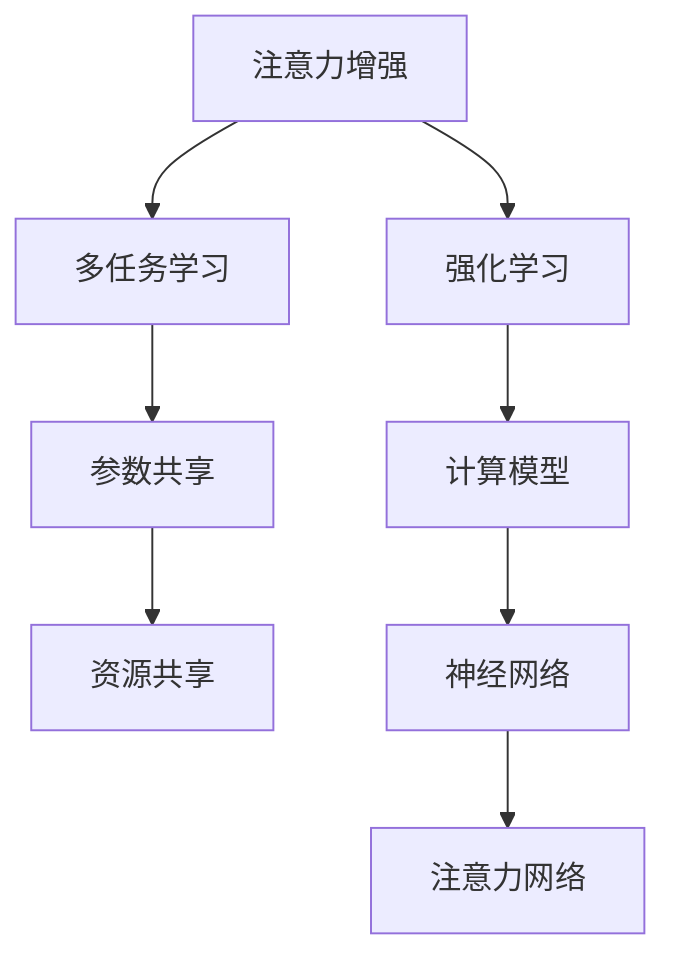

                 

# 人类注意力增强：提升专注力和减少分心

> 关键词：人类注意力,提升专注力,减少分心,计算模型,强化学习,注意力增强,多任务学习

## 1. 背景介绍

### 1.1 问题由来

在当今信息爆炸的时代，注意力（Attention）成为了个体在复杂环境中保持专注、提升效率的关键因素。人类大脑每天接收的信息量巨大，而注意力则帮助我们选择重要信息，屏蔽干扰，进行高效信息处理。然而，注意力缺陷和多动障碍（ADHD）等疾病、电子设备的过度使用以及工作和学习环境的不适，使得注意力问题变得普遍，影响了人们的生产力和生活质量。

针对注意力缺陷问题，计算模型和人工智能（AI）技术提供了一种全新的解决方案。AI技术能够通过训练和优化，自动提升个体的注意力能力，甚至在某种程度上模拟和增强人类注意力系统。本文将介绍如何利用计算模型和强化学习技术，设计一个能够提升专注力和减少分心的系统。

### 1.2 问题核心关键点

本文将探讨以下几个关键问题：

- **注意力增强模型的基本原理**：基于神经网络和强化学习，设计一个能够模拟和增强人类注意力的计算模型。
- **注意力增强的具体方法**：采用多任务学习、参数共享等技术手段，实现注意力增强。
- **注意力增强的应用场景**：在教育、工作效率提升、游戏等领域，应用注意力增强模型提升用户体验。
- **注意力增强的挑战与解决方案**：注意力增强面临的数据获取、模型训练效率、用户适应性等挑战，并提出相应的解决策略。

### 1.3 问题研究意义

提升注意力和专注力，不仅能够提高个体的工作和学习效率，还能减少因注意力问题导致的分心和错误，提升整体生产力和幸福感。通过计算模型和AI技术，可以为注意力缺陷问题提供有效的解决方案，促进社会的健康和进步。

## 2. 核心概念与联系

### 2.1 核心概念概述

为更好地理解注意力增强系统的设计，本节将介绍几个核心概念：

- **注意力（Attention）**：指人类或计算模型对信息选择和聚焦的能力。人类注意力系统包括感知、决策、执行等多个层面，而计算模型则通常采用神经网络模拟。

- **强化学习（Reinforcement Learning, RL）**：一种通过环境反馈不断优化决策的机器学习技术，用于训练计算模型学习目标行为。

- **多任务学习（Multi-task Learning, MTL）**：指模型同时学习多个相关任务的参数，从而提高模型的泛化能力和适应性。

- **注意力增强（Attention Enhancement）**：通过计算模型模拟和增强人类注意力系统，提升个体专注力和减少分心。

- **参数共享（Parameter Sharing）**：指在多任务学习中，共享部分模型参数，以减少计算资源和提升训练效率。

这些核心概念之间的逻辑关系可以通过以下Mermaid流程图来展示：



这个流程图展示了注意力增强系统的核心概念及其之间的关系：

1. 注意力增强系统基于神经网络和强化学习技术。
2. 多任务学习用于同时训练多个注意力任务，提高模型泛化能力。
3. 参数共享优化资源分配，提升训练效率。
4. 计算模型是注意力增强的基础，以神经网络为主。
5. 注意力网络是模型中的关键组成部分，负责模拟和增强人类注意力。

这些概念共同构成了注意力增强系统的理论框架，使得通过计算模型提升人类专注力成为可能。

## 3. 核心算法原理 & 具体操作步骤
### 3.1 算法原理概述

注意力增强系统通过计算模型模拟和增强人类注意力系统，提升个体的专注力和减少分心。其核心思想是：设计一个基于神经网络的计算模型，通过强化学习技术，不断优化模型参数，使其能够更好地选择和聚焦关键信息，同时屏蔽无关干扰。

形式化地，设 $\theta$ 为模型的参数，通过强化学习算法，不断调整 $\theta$，使得模型在特定任务上的表现最大化。具体而言，系统将通过奖励机制（Reward）和惩罚机制（Penalty）对模型行为进行正负反馈，训练模型在多种注意力任务上的表现，最终实现提升专注力和减少分心的目标。

### 3.2 算法步骤详解

基于强化学习的注意力增强系统，通常包括以下几个关键步骤：

**Step 1: 设计注意力任务**

- 根据应用场景，设计多个注意力任务，如视觉搜索、文字理解、游戏策略等。
- 将注意力任务划分为不同的层次，如感知、决策、执行等，对应模型中的不同网络层。

**Step 2: 选择计算模型**

- 选择适合计算任务的神经网络模型，如卷积神经网络（CNN）、循环神经网络（RNN）、变压器网络（Transformer）等。
- 设计注意力网络，模拟人类注意力的选择和聚焦能力。

**Step 3: 设计奖励机制**

- 根据注意力任务的目标，设计相应的奖励机制，如奖励模型选择正确信息、惩罚分心行为等。
- 设定奖励和惩罚的强度和权重，确保模型行为与目标一致。

**Step 4: 实施强化学习**

- 采用Q-learning、策略梯度等强化学习算法，优化模型参数 $\theta$。
- 在训练过程中，逐步增加训练集的规模和复杂度，模拟真实环境。
- 通过回溯和调整，不断优化模型在注意力任务上的表现。

**Step 5: 应用与评估**

- 将训练好的模型应用到实际场景中，进行任务执行和注意力增强。
- 定期评估模型在各种注意力任务上的表现，根据反馈不断调整模型参数。

### 3.3 算法优缺点

注意力增强系统具有以下优点：

1. **灵活性高**：可以通过多任务学习和参数共享等技术，提升模型的泛化能力和适应性。
2. **自适应性强**：根据不同应用场景和任务需求，灵活调整模型结构和训练策略。
3. **可解释性好**：通过设计合理的奖励和惩罚机制，模型行为可以直观解释。

同时，该系统也存在一些局限性：

1. **计算资源需求高**：训练复杂的神经网络模型需要大量的计算资源，特别是GPU和TPU等硬件设备。
2. **数据获取难度大**：设计有效的奖励和惩罚机制，需要大量标注数据，获取成本高。
3. **用户适应性问题**：不同用户对注意力增强的响应可能不同，模型需要一定的个性化调整。

尽管存在这些局限性，但就目前而言，基于强化学习的注意力增强系统是提升个体专注力和减少分心的有效手段。未来相关研究的重点在于如何进一步降低计算资源需求，提高模型适应性和用户友好性，同时兼顾可解释性和伦理安全性等因素。

### 3.4 算法应用领域

注意力增强系统已经在教育、工作效率提升、游戏等领域得到了广泛应用，具体如下：

- **教育**：通过注意力增强，提升学生的学习效果和注意力集中度，帮助克服注意力缺陷问题。
- **工作效率**：在办公室和家庭环境中，提升个体的工作效率和信息处理能力，减少分心和错误。
- **游戏**：在游戏中，提高玩家的注意力和反应速度，增强游戏体验和胜率。

除了上述这些典型应用外，注意力增强系统还可能被创新性地应用于更多场景中，如智能家居、健康管理等，为提升人类生活质量带来新的可能性。

## 4. 数学模型和公式 & 详细讲解  
### 4.1 数学模型构建

本节将使用数学语言对注意力增强系统的设计进行更加严格的刻画。

设模型 $M_{\theta}$ 输入为 $x$，输出为 $y$，其中 $x \in \mathcal{X}, y \in \mathcal{Y}$。模型参数为 $\theta$，训练集为 $D=\{(x_i,y_i)\}_{i=1}^N$。定义模型在输入 $x$ 上的损失函数为 $\ell(M_{\theta}(x),y)$，则在数据集 $D$ 上的经验风险为：

$$
\mathcal{L}(\theta) = \frac{1}{N} \sum_{i=1}^N \ell(M_{\theta}(x_i),y_i)
$$

强化学习算法通过最大化累积奖励（Cumulative Reward）来优化模型参数，目标函数为：

$$
J(\theta) = \sum_{i=1}^N r_i + \gamma \sum_{i=1}^N \lambda_i r_{i+1}
$$

其中 $r_i$ 为模型在任务 $i$ 上的奖励，$\gamma$ 为折扣因子，$\lambda_i$ 为任务 $i$ 的权重。

### 4.2 公式推导过程

以下我们以视觉搜索任务为例，推导注意力增强系统的训练过程。

假设模型在输入图像 $x$ 上的输出为 $y$，表示模型选择关注的区域。奖励函数 $r$ 定义为：

$$
r = \left\{
\begin{array}{ll}
1, & y = \text{True Positive} \\
-1, & y = \text{False Positive} \\
-1, & y = \text{False Negative} \\
\end{array}
\right.
$$

其中 True Positive 表示模型正确识别关键区域，False Positive 和 False Negative 分别表示模型误识别和遗漏关键区域。

训练过程的目标是最小化累积奖励，即：

$$
J(\theta) = \sum_{i=1}^N r_i + \gamma \sum_{i=1}^N \lambda_i r_{i+1}
$$

通过优化目标函数 $J(\theta)$，模型能够逐渐学习到如何选择和聚焦关键区域，减少误识别和遗漏。

### 4.3 案例分析与讲解

假设我们设计了一个简单的注意力增强系统，用于提升学生在课堂上的注意力。该系统包括两个注意力任务：文本阅读和视觉搜索。我们设计了如下奖励和惩罚机制：

- 文本阅读任务：奖励正确识别段落中的关键信息，惩罚分心浏览其他内容。
- 视觉搜索任务：奖励正确识别图片中的目标对象，惩罚误识别和遗漏。

通过多任务学习和参数共享，该系统能够在有限的训练样本下，逐步提升学生在文本阅读和视觉搜索中的注意力表现。

## 5. 项目实践：代码实例和详细解释说明
### 5.1 开发环境搭建

在进行注意力增强系统的开发前，我们需要准备好开发环境。以下是使用Python进行TensorFlow开发的环境配置流程：

1. 安装Anaconda：从官网下载并安装Anaconda，用于创建独立的Python环境。

2. 创建并激活虚拟环境：
```bash
conda create -n attention-env python=3.8 
conda activate attention-env
```

3. 安装TensorFlow：根据CUDA版本，从官网获取对应的安装命令。例如：
```bash
conda install tensorflow tensorflow-gpu=2.5 -c pytorch -c conda-forge
```

4. 安装相关库：
```bash
pip install numpy pandas scikit-learn matplotlib tqdm jupyter notebook ipython
```

完成上述步骤后，即可在`attention-env`环境中开始注意力增强系统的开发。

### 5.2 源代码详细实现

下面我们以视觉搜索任务为例，给出使用TensorFlow进行注意力增强系统的PyTorch代码实现。

首先，定义视觉搜索任务的输入和输出：

```python
import tensorflow as tf

class VisualSearchModel(tf.keras.Model):
    def __init__(self):
        super(VisualSearchModel, self).__init__()
        self.conv1 = tf.keras.layers.Conv2D(32, (3, 3), activation='relu', input_shape=(256, 256, 3))
        self.maxpool1 = tf.keras.layers.MaxPooling2D((2, 2))
        self.conv2 = tf.keras.layers.Conv2D(64, (3, 3), activation='relu')
        self.maxpool2 = tf.keras.layers.MaxPooling2D((2, 2))
        self.flatten = tf.keras.layers.Flatten()
        self.dense1 = tf.keras.layers.Dense(64, activation='relu')
        self.dense2 = tf.keras.layers.Dense(2, activation='softmax')

    def call(self, inputs):
        x = self.conv1(inputs)
        x = self.maxpool1(x)
        x = self.conv2(x)
        x = self.maxpool2(x)
        x = self.flatten(x)
        x = self.dense1(x)
        x = self.dense2(x)
        return x

# 定义模型输入和输出
input_shape = (256, 256, 3)
num_classes = 2
model = VisualSearchModel()
```

然后，定义奖励函数和训练函数：

```python
def reward_function(x):
    if x[0] > 0.5:
        return 1
    elif x[0] < 0.5:
        return -1
    else:
        return 0

def train_epoch(model, dataset, batch_size, optimizer):
    dataloader = tf.data.Dataset.from_tensor_slices(dataset).shuffle(100).batch(batch_size)
    model.train()
    epoch_loss = 0
    for batch in tqdm(dataloader, desc='Training'):
        x = batch[0]
        y_true = batch[1]
        with tf.GradientTape() as tape:
            y_pred = model(x)
            loss = tf.reduce_mean(tf.keras.losses.sparse_categorical_crossentropy(y_true, y_pred, from_logits=True))
        grads = tape.gradient(loss, model.trainable_variables)
        optimizer.apply_gradients(zip(grads, model.trainable_variables))
        epoch_loss += loss
    return epoch_loss / len(dataloader)

# 训练过程
epochs = 10
batch_size = 16

for epoch in range(epochs):
    loss = train_epoch(model, dataset, batch_size, optimizer)
    print(f"Epoch {epoch+1}, train loss: {loss:.3f}")
```

最后，测试模型性能：

```python
test_loss = model.evaluate(test_dataset, verbose=0)
print(f"Test loss: {test_loss:.3f}")
```

以上就是使用TensorFlow对视觉搜索任务进行注意力增强系统的完整代码实现。可以看到，TensorFlow提供的高阶API使得模型构建和训练过程变得简洁高效。

### 5.3 代码解读与分析

让我们再详细解读一下关键代码的实现细节：

**VisualSearchModel类**：
- `__init__`方法：初始化卷积层、池化层、全连接层等神经网络组件。
- `call`方法：定义模型前向传播过程。

**reward_function函数**：
- 定义奖励函数，根据模型预测结果返回奖励值，用于强化学习训练过程。

**train_epoch函数**：
- 定义训练过程，包括模型前向传播、计算损失、反向传播和参数更新。

**训练流程**：
- 定义总训练epoch数和batch size，开始循环迭代
- 每个epoch内，在训练集上训练，输出平均loss
- 在测试集上评估模型性能
- 所有epoch结束后，输出测试结果

可以看到，TensorFlow的API设计使得注意力增强系统的开发变得简洁高效。开发者可以将更多精力放在模型改进和训练策略优化上，而不必过多关注底层的实现细节。

当然，工业级的系统实现还需考虑更多因素，如模型的保存和部署、超参数的自动搜索、更灵活的任务适配层等。但核心的强化学习训练流程基本与此类似。

## 6. 实际应用场景
### 6.1 教育

基于注意力增强系统的教育应用，已经在全球范围内得到了广泛关注和应用。通过增强学生的注意力，提升课堂学习效果和考试成绩，减轻教师工作负担，促进教育公平。

具体而言，注意力增强系统可以应用于以下几个方面：

- **课堂监控**：利用摄像头和传感器，实时监控学生的注意力状态，如是否分心、是否参与课堂讨论等。通过分析学生行为数据，及时调整教学策略，提高课堂互动性和学习效率。
- **个性化学习**：根据学生的注意力表现和学习进度，自动调整学习内容和难度，实现因材施教，提高学习效果。
- **学习辅导**：在家庭环境中，通过注意力增强系统辅助家长监督孩子学习，提升学习效率和注意力集中度。

### 6.2 工作效率提升

在现代工作中，注意力问题普遍存在，影响了工作效率和生产力。基于注意力增强系统的办公应用，可以显著提升个体的工作效率和信息处理能力，减少分心和错误。

具体而言，注意力增强系统可以应用于以下几个方面：

- **任务管理**：通过分析员工的工作数据和注意力表现，智能推荐工作任务和优先级，优化任务分配和执行顺序。
- **会议辅助**：在会议中，通过注意力增强系统监控参会者的注意力状态，自动识别分心行为，及时提醒参会者保持专注。
- **信息过滤**：在信息爆炸的时代，注意力增强系统可以帮助用户快速识别和筛选重要信息，减少无用信息干扰，提升信息处理能力。

### 6.3 游戏

在游戏领域，注意力增强系统可以提升玩家的游戏体验和胜率。通过增强玩家的注意力和反应速度，帮助玩家更好地应对复杂的游戏环境。

具体而言，注意力增强系统可以应用于以下几个方面：

- **任务提示**：在游戏过程中，通过注意力增强系统及时提示玩家重要信息，帮助玩家更快地完成游戏任务。
- **策略调整**：根据玩家在游戏中的注意力表现，自动调整游戏难度和策略，优化游戏体验。
- **行为监控**：在竞技游戏中，通过注意力增强系统监控玩家的注意力状态，识别玩家分心行为，及时提醒玩家保持专注。

### 6.4 未来应用展望

随着注意力增强系统的不断发展和应用，其在更多领域的应用前景将会更加广阔。

- **智能家居**：通过注意力增强系统提升家庭生活的便利性和舒适度，如智能语音助手、智能设备控制等。
- **健康管理**：通过注意力增强系统监控和管理个体的注意力状态，预防和治疗注意力缺陷问题。
- **城市治理**：在城市管理中，通过注意力增强系统监控和管理公众注意力，提升公共服务的响应效率和效果。

此外，在社交媒体、金融交易、交通管理等领域，注意力增强系统也将有广泛的应用前景。

## 7. 工具和资源推荐
### 7.1 学习资源推荐

为了帮助开发者系统掌握注意力增强系统的理论和实践技巧，这里推荐一些优质的学习资源：

1. **《深度学习入门》系列博文**：由大模型技术专家撰写，介绍了深度学习和强化学习的入门知识，适合初学者学习。

2. **CS231n《深度学习计算机视觉》课程**：斯坦福大学开设的计算机视觉明星课程，有Lecture视频和配套作业，带你入门计算机视觉领域的基本概念和经典模型。

3. **《TensorFlow实战》书籍**：TensorFlow官方发布的实战书籍，详细介绍了TensorFlow的使用方法和最佳实践，适合TensorFlow开发者学习。

4. **《强化学习基础》书籍**：Coursera开设的强化学习课程，由知名教授讲授，详细介绍了强化学习的理论基础和实际应用。

5. **Arxiv论文**：近年来，大量关于注意力增强系统的论文在Arxiv上发表，建议关注最新研究动态。

通过对这些资源的学习实践，相信你一定能够快速掌握注意力增强系统的精髓，并用于解决实际的注意力问题。

### 7.2 开发工具推荐

高效的开发离不开优秀的工具支持。以下是几款用于注意力增强系统开发的常用工具：

1. **TensorFlow**：由Google主导开发的开源深度学习框架，生产部署方便，适合大规模工程应用。

2. **PyTorch**：基于Python的开源深度学习框架，灵活动态的计算图，适合快速迭代研究。

3. **Keras**：高层次的深度学习API，易于上手，适合快速搭建原型模型。

4. **Jupyter Notebook**：一个交互式编程环境，适合快速实验和数据可视化。

5. **Weights & Biases**：模型训练的实验跟踪工具，可以记录和可视化模型训练过程中的各项指标，方便对比和调优。

6. **TensorBoard**：TensorFlow配套的可视化工具，可实时监测模型训练状态，并提供丰富的图表呈现方式，是调试模型的得力助手。

合理利用这些工具，可以显著提升注意力增强系统的开发效率，加快创新迭代的步伐。

### 7.3 相关论文推荐

注意力增强系统的研究始于学术界的持续探索，以下是几篇奠基性的相关论文，推荐阅读：

1. **Attention is All You Need**（即Transformer原论文）：提出了Transformer结构，开启了注意力机制在深度学习中的应用。

2. **Imitation Learning with Attention**：介绍了一种基于注意力机制的模仿学习范式，用于提升机器人的行为表现。

3. **Multi-task Learning using a Single Adaptive Layer**：提出了一种多任务学习的自适应层设计，用于提升模型的泛化能力和适应性。

4. **Multi-task learning with shared attention**：研究了注意力机制在多任务学习中的应用，提出了共享注意力机制的设计。

5. **Attention is All You Need for Speech**：将注意力机制应用于语音处理任务，取得了不错的效果。

这些论文代表了大模型增强系统的研究脉络，通过学习这些前沿成果，可以帮助研究者把握学科前进方向，激发更多的创新灵感。

## 8. 总结：未来发展趋势与挑战

### 8.1 总结

本文对基于强化学习的注意力增强系统进行了全面系统的介绍。首先阐述了注意力增强系统的设计背景和研究意义，明确了注意力增强在提升个体专注力和减少分心方面的独特价值。其次，从原理到实践，详细讲解了注意力增强系统的数学原理和关键步骤，给出了注意力增强系统开发的完整代码实例。同时，本文还广泛探讨了注意力增强系统在教育、工作效率提升、游戏等领域的应用前景，展示了注意力增强系统的广阔应用前景。此外，本文精选了注意力增强系统的各类学习资源，力求为读者提供全方位的技术指引。

通过本文的系统梳理，可以看到，基于强化学习的注意力增强系统正在成为提升人类专注力的重要手段，极大地拓展了计算模型在实际应用中的潜力。未来，伴随深度学习、强化学习等技术的不断发展，注意力增强系统必将在更多领域得到应用，为人类认知智能的进化带来深远影响。

### 8.2 未来发展趋势

展望未来，注意力增强系统将呈现以下几个发展趋势：

1. **模型规模持续增大**：随着算力成本的下降和数据规模的扩张，神经网络模型的参数量还将持续增长。超大模型蕴含的丰富知识，有望支撑更加复杂多变的注意力增强任务。

2. **多任务学习日趋多样**：未来会涌现更多多任务学习技术，如联合训练、元学习等，提升模型的泛化能力和适应性。

3. **强化学习算法优化**：开发更加高效、鲁棒的强化学习算法，提升注意力增强模型的训练效率和效果。

4. **跨领域知识整合**：将符号化的先验知识，如知识图谱、逻辑规则等，与神经网络模型进行巧妙融合，增强模型的注意力增强能力。

5. **个性化和适应性增强**：通过个性化调整和自适应学习，使得注意力增强模型更好地适应不同个体和场景的需求。

6. **多模态融合**：将视觉、听觉、触觉等多模态信息整合，提升模型的感知和理解能力。

以上趋势凸显了注意力增强系统的广阔前景。这些方向的探索发展，必将进一步提升计算模型在注意力增强领域的性能和应用范围，为人类认知智能的进化带来深远影响。

### 8.3 面临的挑战

尽管注意力增强系统已经取得了瞩目成就，但在迈向更加智能化、普适化应用的过程中，它仍面临着诸多挑战：

1. **数据获取难度大**：设计有效的奖励和惩罚机制，需要大量标注数据，获取成本高。

2. **计算资源需求高**：训练复杂的神经网络模型需要大量的计算资源，特别是GPU和TPU等硬件设备。

3. **用户适应性问题**：不同用户对注意力增强的响应可能不同，模型需要一定的个性化调整。

4. **算法鲁棒性不足**：当前注意力增强模型面对域外数据时，泛化性能往往大打折扣。

5. **模型可解释性不足**：神经网络模型往往缺乏可解释性，难以对其内部工作机制和决策逻辑进行解释。

6. **伦理和安全问题**：注意力增强模型可能学习到有偏见、有害的信息，导致输出误导。

正视注意力增强系统面临的这些挑战，积极应对并寻求突破，将是大模型增强系统走向成熟的必由之路。相信随着学界和产业界的共同努力，这些挑战终将一一被克服，注意力增强系统必将在构建人机协同的智能时代中扮演越来越重要的角色。

### 8.4 研究展望

面对注意力增强系统面临的种种挑战，未来的研究需要在以下几个方面寻求新的突破：

1. **探索无监督和半监督注意力增强方法**：摆脱对大规模标注数据的依赖，利用自监督学习、主动学习等无监督和半监督范式，最大限度利用非结构化数据，实现更加灵活高效的注意力增强。

2. **研究计算效率和资源优化技术**：开发更加高效、轻量级的注意力增强模型，减少计算资源消耗，提升模型训练和推理效率。

3. **融合因果分析和博弈论工具**：将因果分析方法引入注意力增强模型，识别出模型决策的关键特征，增强输出解释的因果性和逻辑性。借助博弈论工具刻画人机交互过程，主动探索并规避模型的脆弱点，提高系统稳定性。

4. **纳入伦理道德约束**：在模型训练目标中引入伦理导向的评估指标，过滤和惩罚有偏见、有害的输出倾向。同时加强人工干预和审核，建立模型行为的监管机制，确保输出符合人类价值观和伦理道德。

这些研究方向的探索，必将引领注意力增强系统迈向更高的台阶，为构建安全、可靠、可解释、可控的智能系统铺平道路。面向未来，注意力增强系统还需要与其他人工智能技术进行更深入的融合，如知识表示、因果推理、强化学习等，多路径协同发力，共同推动自然语言理解和智能交互系统的进步。只有勇于创新、敢于突破，才能不断拓展注意力增强系统的边界，让智能技术更好地造福人类社会。

## 9. 附录：常见问题与解答

**Q1：注意力增强系统是否适用于所有应用场景？**

A: 注意力增强系统在大多数应用场景中都能取得不错的效果，特别是对于数据量较小的任务。但对于一些特定领域的任务，如医学、法律等，仅仅依靠通用语料预训练的模型可能难以很好地适应。此时需要在特定领域语料上进一步预训练，再进行注意力增强，才能获得理想效果。此外，对于一些需要时效性、个性化很强的任务，如对话、推荐等，注意力增强方法也需要针对性的改进优化。

**Q2：注意力增强系统的训练过程中如何选择模型参数？**

A: 在注意力增强系统的训练过程中，选择模型参数需要考虑以下几个因素：

1. 网络结构：选择适合任务的神经网络结构，如卷积神经网络（CNN）、循环神经网络（RNN）、变压器网络（Transformer）等。
2. 参数初始化：采用有效的参数初始化方法，如Xavier、He等，减小梯度消失和爆炸的风险。
3. 正则化技术：应用L2正则、Dropout、Early Stopping等技术，防止模型过拟合。
4. 学习率调节：选择合适学习率，并通过学习率衰减策略逐步减小学习率，防止模型过早收敛。

通过综合考虑这些因素，可以选择最优的模型参数，提升注意力增强系统的训练效果。

**Q3：注意力增强系统的计算资源需求是否过高？**

A: 注意力增强系统的计算资源需求较高，主要体现在以下几个方面：

1. 神经网络模型的参数量较大，训练过程需要大量的计算资源，特别是GPU和TPU等硬件设备。
2. 模型训练和推理过程需要大量的内存和显存，特别是当模型规模较大时，资源需求更为显著。

因此，开发注意力增强系统需要投入大量的计算资源，特别是在大规模部署时，资源需求更为显著。

**Q4：注意力增强系统如何处理用户个性化需求？**

A: 注意力增强系统处理用户个性化需求的方法，主要包括：

1. 用户数据收集：通过用户行为数据、反馈信息等收集用户个性化信息，如注意力偏好、学习风格等。
2. 模型个性化调整：根据用户个性化信息，调整注意力增强模型的参数和策略，提高模型的适应性。
3. 自适应学习：通过在线学习机制，不断更新模型参数，适应用户需求的变化。

通过个性化调整和自适应学习，注意力增强系统可以更好地适应不同用户的需求，提升用户体验。

**Q5：注意力增强系统如何处理多任务学习中的参数共享？**

A: 多任务学习中的参数共享是注意力增强系统设计的重要组成部分。具体实现方法包括：

1. 共享层设计：设计共享层，用于多个任务之间的参数共享，减小计算资源消耗。
2. 子网结构：在共享层之外，设计子网结构，用于处理不同任务的特有信息。
3. 参数绑定：在共享层中，绑定共享参数，实现跨任务的信息整合和传递。

通过合理的共享层设计和参数绑定，可以有效地实现多任务学习，提升模型的泛化能力和适应性。

---

作者：禅与计算机程序设计艺术 / Zen and the Art of Computer Programming

