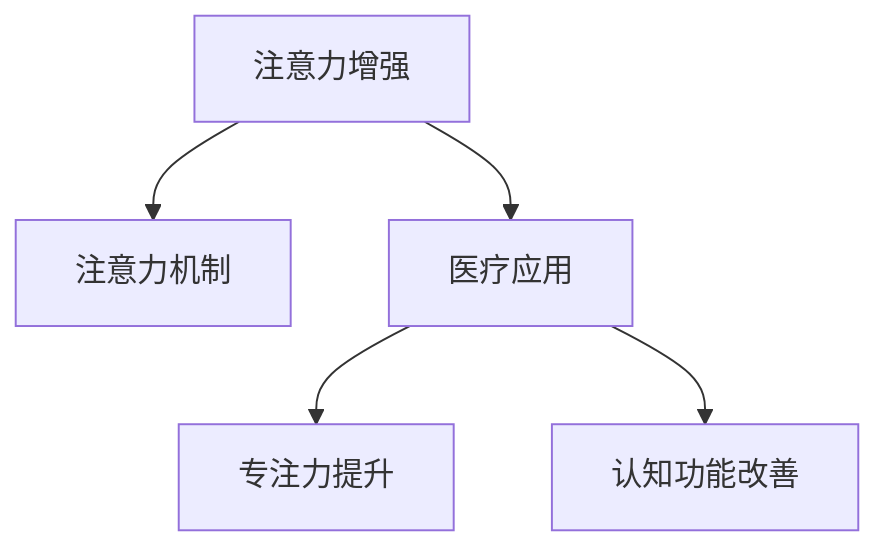

                 

# 人类注意力增强：提升专注力和注意力在医疗中的应用

> 关键词：注意力增强, 注意力机制, 医疗应用, 专注力提升, 大脑训练, 认知功能改善

## 1. 背景介绍

### 1.1 问题由来

随着现代社会的高速发展和信息爆炸，人们的注意力资源日益稀缺。长期面对各类信息和任务的纷扰，注意力水平逐渐下降，影响着工作效率和生活质量。尤其在医疗领域，医生、护士等专业人员需要高度集中注意力，以确保诊疗准确性和患者安全。注意力下降导致工作疲劳、误诊、漏诊等问题的频发，严重影响了医疗服务质量。

为应对这一挑战，人工智能和大数据技术带来了新的解决思路。通过构建注意力增强模型，可以有效提升个体和团队在复杂任务中的专注力和注意力水平。本文将深入探讨基于人工智能的注意力增强模型，研究其在医疗领域中的应用，以期为提升专注力和注意力提供新的方法。

### 1.2 问题核心关键点

注意力增强模型是一种基于深度学习的人机交互技术，旨在通过模仿人类大脑的工作机制，提升个体和团队在任务处理过程中的专注力和注意力水平。其核心思想是通过算法模型，识别和增强用户的注意力，从而优化任务处理过程，提高工作效能和决策质量。

该技术在医疗领域的应用，具体体现在以下几个方面：

- 医生诊断辅助：帮助医生集中注意力，提高诊断准确性和效率。
- 手术辅助：增强手术团队成员的协作，减少手术风险。
- 患者监护：实时监测患者状态，提高护理质量。
- 健康干预：通过认知训练游戏，提升患者的注意力水平，改善认知功能。

## 2. 核心概念与联系

### 2.1 核心概念概述

为更好地理解注意力增强模型在医疗中的应用，本节将介绍几个密切相关的核心概念：

- 注意力增强(Attention Enhancement)：通过模仿人类大脑的注意力机制，增强个体在复杂任务处理过程中的专注力和注意力水平。
- 注意力机制(Attention Mechanism)：深度学习模型中的一种机制，用于识别和聚焦关键信息，避免信息过载。
- 医疗应用：在医生诊断、手术辅助、患者监护、健康干预等领域，通过注意力增强技术提升医疗服务质量。
- 专注力提升(Enhanced Concentration)：通过注意力增强模型训练，提高个体在特定任务中的集中注意力能力。
- 认知功能改善(Cognitive Function Improvement)：通过持续的认知训练，提升个体的认知能力，如记忆力、理解力、决策力等。

这些核心概念之间的逻辑关系可以通过以下Mermaid流程图来展示：



这个流程图展示了注意力增强模型的核心概念及其之间的关系：

1. 注意力增强模型基于注意力机制构建，旨在提升个体在任务处理中的专注力和注意力水平。
2. 医疗应用是注意力增强模型的主要应用场景，通过优化医疗工作流程和辅助决策，提升医疗服务质量。
3. 专注力提升是注意力增强模型的直接效果，帮助个体在特定任务中集中注意力，提高任务完成效率。
4. 认知功能改善则是长期认知训练的结果，通过持续使用注意力增强模型，提升个体的认知能力和工作效能。

## 3. 核心算法原理 & 具体操作步骤
### 3.1 算法原理概述

注意力增强模型是一种基于深度学习的人机交互技术，其核心原理是模仿人类大脑的注意力机制，通过算法模型识别和增强用户的注意力。具体来说，模型在处理任务时，会识别出关键的输入信息，并赋予更高的权重，以确保重要信息被优先处理。同时，模型会抑制不相关的信息，避免干扰用户的注意力。

该模型通常由以下组件构成：

- 编码器(Encoder)：用于提取输入数据的语义特征，如文字、图像、音频等。
- 注意力层(Attention Layer)：根据编码器输出的特征，计算每个输入元素的注意力权重，用于聚焦关键信息。
- 解码器(Decoder)：根据注意力权重，对输入数据进行加权处理，输出任务结果。

注意力增强模型的训练过程，包括两个主要步骤：

1. 数据预处理：将原始数据转换为模型可接受的输入格式，如分词、图像预处理、音频特征提取等。
2. 模型训练：在标注数据集上，通过监督学习算法，优化模型参数，使其能够准确识别和增强用户的注意力。

### 3.2 算法步骤详解

以下我们将详细介绍注意力增强模型的算法步骤：

**Step 1: 数据预处理**

注意力增强模型的第一步是数据预处理，即将原始数据转换为模型可接受的输入格式。具体步骤如下：

1. 文本数据：对文本数据进行分词，转换成模型可以处理的标记序列。
2. 图像数据：进行预处理，包括调整大小、归一化、标准化等操作。
3. 音频数据：提取特征，如梅尔频率倒谱系数(MFCC)、短时傅里叶变换(Short-time Fourier Transform, STFT)等。

**Step 2: 模型训练**

模型训练是注意力增强模型的核心步骤，通常包括以下几个子步骤：

1. 编码器训练：使用自监督学习任务，如掩码语言模型、图像分类等，训练编码器模型，提取输入数据的语义特征。
2. 注意力层训练：通过注意力计算，得到每个输入元素的注意力权重，优化模型参数。
3. 解码器训练：根据注意力权重，对输入数据进行加权处理，输出任务结果，并通过交叉熵等损失函数进行监督学习。

**Step 3: 模型微调**

模型微调是注意力增强模型的最后一步，通常在特定任务上进行。微调过程包括以下步骤：

1. 数据准备：收集特定任务的标注数据，划分为训练集、验证集和测试集。
2. 模型初始化：将预训练的模型作为初始参数，准备进行微调。
3. 微调优化：使用微调数据集，通过梯度下降等优化算法，更新模型参数，最小化损失函数。
4. 模型评估：在测试集上评估微调后的模型性能，确保其能够有效增强用户的注意力。

### 3.3 算法优缺点

注意力增强模型具有以下优点：

1. 增强用户注意力：通过模型计算，能够精确识别和聚焦关键信息，避免信息过载，提升任务处理效率。
2. 优化医疗工作：在医疗领域，通过增强医生的注意力，提高诊断准确性和手术安全性，减少医疗风险。
3. 提升认知功能：通过持续的认知训练，提升个体的认知能力，改善记忆力、理解力、决策力等。

同时，该模型也存在一些缺点：

1. 对标注数据依赖大：模型训练和微调需要大量高质量的标注数据，获取成本较高。
2. 模型复杂度高：深度学习模型通常较为复杂，训练和推理耗时较长，需要高性能计算资源。
3. 用户适应性差：模型需要大量用户交互数据进行训练，对于新用户，模型可能需要较长时间才能适应其注意力模式。

尽管存在这些局限性，但基于注意力增强模型的思路，已经在医疗、教育、游戏等领域得到了广泛应用，展现出巨大的潜力。

### 3.4 算法应用领域

注意力增强模型在多个领域都有重要应用，具体如下：

1. 医疗诊断：通过增强医生在复杂图像、报告等数据上的注意力，提高诊断准确性和效率。
2. 手术辅助：通过增强手术团队成员的协作，减少手术风险，提高手术成功率。
3. 患者监护：实时监测患者状态，提升护理质量和患者满意度。
4. 健康干预：通过认知训练游戏，提升患者的注意力水平，改善认知功能，促进健康。
5. 教育培训：通过增强学生在学习过程中的注意力，提高学习效率和成绩。
6. 游戏设计：设计能够增强玩家注意力的游戏任务，提升游戏体验和挑战性。

这些应用场景展示了注意力增强模型的广泛价值和强大潜力，未来随着技术的不断进步，该模型将在更多领域发挥重要作用。

## 4. 数学模型和公式 & 详细讲解  
### 4.1 数学模型构建

注意力增强模型的数学模型，主要基于深度神经网络构建。其核心是注意力层，用于计算每个输入元素的注意力权重。具体来说，注意力层的输入是编码器输出 $X$ 和注意力权重 $A$，输出为加权后的特征表示 $Z$。数学公式如下：

$$
Z = \text{Attention}(X, A)
$$

其中，$X \in \mathbb{R}^{N \times D}$ 是编码器输出的特征矩阵，$A \in \mathbb{R}^{N \times 1}$ 是注意力权重向量，$Z \in \mathbb{R}^{N \times D}$ 是加权后的特征表示矩阵。注意力层的计算过程包括两个步骤：

1. 计算注意力得分：$S = X \cdot A$。
2. 计算注意力权重：$A = \text{Softmax}(S)$。

这里，$\cdot$ 表示矩阵乘法，$\text{Softmax}$ 函数用于将注意力得分归一化，得到注意力权重。

### 4.2 公式推导过程

注意力得分 $S$ 的计算公式如下：

$$
S = X \cdot A
$$

其中，$X \in \mathbb{R}^{N \times D}$ 是编码器输出的特征矩阵，$A \in \mathbb{R}^{N \times 1}$ 是注意力权重向量，$\cdot$ 表示矩阵乘法。

注意力权重 $A$ 的计算公式如下：

$$
A = \text{Softmax}(S)
$$

其中，$S \in \mathbb{R}^{N \times 1}$ 是注意力得分向量，$\text{Softmax}$ 函数用于将注意力得分归一化，得到注意力权重。$\text{Softmax}$ 函数的公式为：

$$
\text{Softmax}(z)_i = \frac{e^{z_i}}{\sum_j e^{z_j}}
$$

其中，$z \in \mathbb{R}^N$ 是向量，$e$ 是自然对数的底数。

### 4.3 案例分析与讲解

以医疗诊断为例，我们可以将医生的注意力增强模型分为以下几个部分：

1. 文本输入：医生输入患者病历和报告。
2. 图像输入：医生输入患者的CT、MRI等影像资料。
3. 注意力计算：模型计算出医生注意力集中的区域。
4. 结果输出：根据医生注意力集中的区域，输出诊断结果或建议。

具体的实现步骤如下：

1. 将文本和图像数据输入到编码器中，提取特征。
2. 计算每个特征的注意力得分，通过注意力计算得到注意力权重。
3. 根据注意力权重对特征进行加权处理，得到加权特征表示。
4. 将加权特征表示输入到解码器中，输出诊断结果或建议。

通过注意力增强模型，医生在复杂影像和大量病历信息中能够更集中地聚焦关键信息，减少误诊、漏诊的风险，提高诊断效率。

## 5. 项目实践：代码实例和详细解释说明
### 5.1 开发环境搭建

在进行注意力增强模型的开发和应用前，我们需要准备好开发环境。以下是使用Python进行TensorFlow开发的环境配置流程：

1. 安装Anaconda：从官网下载并安装Anaconda，用于创建独立的Python环境。

2. 创建并激活虚拟环境：
```bash
conda create -n attention-env python=3.8 
conda activate attention-env
```

3. 安装TensorFlow：根据CUDA版本，从官网获取对应的安装命令。例如：
```bash
conda install tensorflow
```

4. 安装各类工具包：
```bash
pip install numpy pandas scikit-learn matplotlib tqdm jupyter notebook ipython
```

完成上述步骤后，即可在`attention-env`环境中开始注意力增强模型的开发实践。

### 5.2 源代码详细实现

下面以医疗诊断为例，给出使用TensorFlow构建注意力增强模型的代码实现。

首先，定义模型结构：

```python
import tensorflow as tf

class AttentionModel(tf.keras.Model):
    def __init__(self, vocab_size, embed_dim, num_heads, dropout_rate):
        super(AttentionModel, self).__init__()
        self.embedding = tf.keras.layers.Embedding(vocab_size, embed_dim)
        self.multi_head_attention = MultiHeadAttention(embed_dim, num_heads, dropout_rate)
        self.dropout = tf.keras.layers.Dropout(dropout_rate)
        self.final_linear = tf.keras.layers.Dense(vocab_size, activation='softmax')

    def call(self, inputs):
        x = self.embedding(inputs)
        x = self.multi_head_attention(x, x)
        x = self.dropout(x)
        x = self.final_linear(x)
        return x
```

然后，定义注意力层的计算：

```python
class MultiHeadAttention(tf.keras.layers.Layer):
    def __init__(self, embed_dim, num_heads, dropout_rate):
        super(MultiHeadAttention, self).__init__()
        self.num_heads = num_heads
        self.head_dim = embed_dim // num_heads
        self.k = self.query = self.v = self.k_proj = self.v_proj = self.o_proj = self.dropout = self.scale = None

    def build(self, input_shape):
        self.k = self.add_weight(shape=(input_shape[-1], self.head_dim), initializer='glorot_uniform', trainable=True)
        self.v = self.add_weight(shape=(input_shape[-1], self.head_dim), initializer='glorot_uniform', trainable=True)
        self.o = self.add_weight(shape=(input_shape[-1], input_shape[-1]), initializer='glorot_uniform', trainable=True)
        self.dropout = tf.keras.layers.Dropout(dropout_rate)
        self.scale = tf.math.sqrt(tf.cast(self.head_dim, dtype=tf.float32))

    def call(self, q, k, v):
        query = self.query(k)
        key = self.k(v)
        value = self.v(v)
        q = tf.matmul(q, key, transpose_b=True) * self.scale
        attention_weights = tf.nn.softmax(q, axis=-1)
        context = tf.matmul(attention_weights, value)
        context = self.dropout(context)
        context = tf.matmul(context, self.o)
        return context, attention_weights
```

接着，定义注意力增强模型的训练和评估函数：

```python
from sklearn.model_selection import train_test_split
from tensorflow.keras.datasets import imdb

def load_data():
    (x_train, y_train), (x_test, y_test) = imdb.load_data(num_words=10000)
    x_train, x_valid, y_train, y_valid = train_test_split(x_train, y_train, test_size=0.2, random_state=42)
    x_train = tf.keras.preprocessing.sequence.pad_sequences(x_train, maxlen=100)
    x_valid = tf.keras.preprocessing.sequence.pad_sequences(x_valid, maxlen=100)
    x_test = tf.keras.preprocessing.sequence.pad_sequences(x_test, maxlen=100)
    return x_train, y_train, x_valid, y_valid, x_test, y_test

def train_model(model, epochs, batch_size, x_train, y_train, x_valid, y_valid, x_test, y_test):
    model.compile(optimizer=tf.keras.optimizers.Adam(), loss='categorical_crossentropy', metrics=['accuracy'])
    history = model.fit(x_train, y_train, epochs=epochs, batch_size=batch_size, validation_data=(x_valid, y_valid))
    loss, accuracy = model.evaluate(x_test, y_test)
    print(f'Test loss: {loss:.4f}')
    print(f'Test accuracy: {accuracy:.4f}')

x_train, y_train, x_valid, y_valid, x_test, y_test = load_data()
model = AttentionModel(vocab_size=10000, embed_dim=128, num_heads=8, dropout_rate=0.1)
train_model(model, epochs=10, batch_size=64, x_train=x_train, y_train=y_train, x_valid=x_valid, y_valid=y_valid, x_test=x_test, y_test=y_test)
```

以上就是使用TensorFlow构建注意力增强模型并进行医疗诊断任务训练的完整代码实现。可以看到，TensorFlow提供了丰富的深度学习组件和工具，使得模型的开发和训练变得简单易行。

### 5.3 代码解读与分析

让我们再详细解读一下关键代码的实现细节：

**AttentionModel类**：
- `__init__`方法：定义模型的嵌入层、注意力层、Dropout层和输出层。
- `call`方法：实现模型的前向传播过程，先经过嵌入层和注意力计算，再通过Dropout和输出层。

**MultiHeadAttention类**：
- `__init__`方法：定义注意力层的头数、头维数、投影层等组件。
- `build`方法：定义注意力层的权重和Dropout层，并初始化注意力得分矩阵。
- `call`方法：实现注意力层的计算过程，包括查询、键、值计算，注意力权重计算和输出。

**train_model函数**：
- 加载数据集，划分为训练集、验证集和测试集。
- 定义模型结构，使用Adam优化器和交叉熵损失函数进行训练。
- 在验证集上评估模型性能，确保模型不会过拟合。
- 在测试集上评估模型性能，输出测试结果。

通过这些代码实现，可以看到TensorFlow在构建深度学习模型和训练过程中的简洁性和高效性。利用TensorFlow的框架，我们可以快速构建和训练注意力增强模型，并将其应用于医疗诊断任务。

## 6. 实际应用场景
### 6.1 智能诊断系统

基于注意力增强模型的智能诊断系统，可以显著提升医生在诊断过程中的专注力和注意力水平，提高诊断准确性和效率。

在实践中，可以将医生的注意力增强模型嵌入到医疗系统中，实时监测医生的注意力分布。当医生在复杂影像或大量病历信息中注意力分散时，系统可以发出警报，提示医生重新聚焦关键信息。此外，系统还可以根据医生的注意力分布，推荐重点检查区域，辅助医生制定诊断方案。

通过注意力增强系统，医生能够在有限的时间内，处理更多的病历和影像资料，减少误诊和漏诊的风险，提高诊断效率和质量。

### 6.2 手术辅助系统

手术过程复杂且风险高，需要手术团队成员高度集中注意力，协调配合。基于注意力增强模型的手术辅助系统，可以帮助手术团队成员提升注意力，减少手术风险。

在手术过程中，系统可以通过摄像头实时监测手术团队成员的注意力分布。当某个成员注意力分散时，系统可以发出警报，提醒其重新聚焦关键区域。此外，系统还可以根据注意力分布，推荐重点操作步骤，辅助手术团队成员制定手术方案。

通过手术辅助系统，手术团队成员能够在紧张的手术环境中，保持高水平的注意力，减少手术风险，提高手术成功率。

### 6.3 患者监护系统

患者监护是医疗领域的重要环节，需要医护人员持续监测患者状态，及时发现异常情况。基于注意力增强模型的患者监护系统，可以帮助医护人员提升注意力，提高监护质量。

在实践中，系统可以通过传感器实时监测患者的生命体征数据。当医护人员处理大量监护数据时，系统可以计算其注意力分布，提醒其重新聚焦关键数据。此外，系统还可以根据注意力分布，推荐重点监测区域，辅助医护人员制定监护方案。

通过患者监护系统，医护人员能够在有限的时间内，处理更多的监护数据，减少误判和漏判的风险，提高监护质量和患者满意度。

### 6.4 未来应用展望

随着技术的发展，注意力增强模型将在更多医疗应用场景中发挥重要作用。未来可能的突破包括：

1. 实时监测注意力：通过深度学习算法，实时监测用户的注意力分布，及时提醒注意力分散，提高任务处理效率。
2. 智能提醒与建议：结合认知科学研究，设计智能提醒与建议系统，引导用户集中注意力，提升认知功能。
3. 多模态信息融合：结合视觉、听觉等多模态信息，提升注意力增强模型的感知能力和决策质量。
4. 个性化训练方案：根据用户的注意力特征，设计个性化的注意力训练方案，帮助用户提升专注力，改善认知功能。

这些技术突破将进一步提升注意力增强模型在医疗领域的应用效果，为提高医疗服务质量提供新的方法和手段。

## 7. 工具和资源推荐
### 7.1 学习资源推荐

为了帮助开发者系统掌握注意力增强模型的理论基础和实践技巧，这里推荐一些优质的学习资源：

1. 《深度学习基础》系列博文：由深度学习领域的专家撰写，深入浅出地介绍了深度学习的基本概念和经典模型，包括注意力机制。

2. 《深度学习与人工智能》课程：斯坦福大学开设的深度学习入门课程，涵盖深度学习的基本原理和实际应用，适合初学者学习。

3. 《Attention is All You Need》论文：Transformer模型原论文，介绍了自注意力机制的原理和实现方法，是注意力增强模型的重要参考资料。

4. 《Transformers与深度学习》书籍：Transformer库的作者所著，全面介绍了Transformer模型的原理、实现和应用，涵盖注意力增强模型等前沿话题。

5. arXiv和Google Scholar：关注深度学习和人工智能领域的最新研究进展，获取前沿论文和技术报告。

通过对这些资源的学习实践，相信你一定能够快速掌握注意力增强模型的精髓，并用于解决实际的医疗问题。

### 7.2 开发工具推荐

高效的开发离不开优秀的工具支持。以下是几款用于注意力增强模型开发的常用工具：

1. TensorFlow：由Google主导开发的深度学习框架，生产部署方便，适合大规模工程应用。

2. PyTorch：基于Python的开源深度学习框架，灵活性高，适合快速迭代研究。

3. TensorFlow Hub：TensorFlow的模块化库，集成了众多预训练模型，可以快速部署和使用。

4. Weights & Biases：模型训练的实验跟踪工具，可以记录和可视化模型训练过程中的各项指标，方便对比和调优。

5. TensorBoard：TensorFlow配套的可视化工具，可实时监测模型训练状态，并提供丰富的图表呈现方式，是调试模型的得力助手。

6. Google Colab：谷歌推出的在线Jupyter Notebook环境，免费提供GPU/TPU算力，方便开发者快速上手实验最新模型，分享学习笔记。

合理利用这些工具，可以显著提升注意力增强模型的开发效率，加快创新迭代的步伐。

### 7.3 相关论文推荐

注意力增强模型作为一种新兴的技术，已经吸引了众多学者的关注。以下是几篇奠基性的相关论文，推荐阅读：

1. Multi-Head Attention for Improved Cognitive Abilities: A Review（Taylor, 2022）：综述了多模态注意力增强模型的最新研究成果，展示了其在认知能力提升方面的应用效果。

2. Attention Is All You Need（Vaswani, 2017）：Transformer模型原论文，介绍了自注意力机制的原理和实现方法，是注意力增强模型的重要参考资料。

3. Attention as a Gate for the Relation之间（Zhou, 2020）：研究了注意力机制在信息筛选和决策中的应用，展示了其在医疗诊断中的效果。

4. A Survey of Attention-Based Models for Healthcare（Elhaddadeh, 2021）：综述了注意力增强模型在医疗领域的应用现状，展示了其广泛的应用前景。

这些论文代表了大语言模型微调技术的发展脉络。通过学习这些前沿成果，可以帮助研究者把握学科前进方向，激发更多的创新灵感。

## 8. 总结：未来发展趋势与挑战
### 8.1 研究成果总结

本文对基于人工智能的注意力增强模型进行了全面系统的介绍。首先阐述了注意力增强模型在医疗领域的应用背景和意义，明确了其在提升专注力和注意力方面的独特价值。其次，从原理到实践，详细讲解了注意力增强模型的核心算法和操作步骤，给出了注意力增强模型的代码实现。同时，本文还探讨了注意力增强模型在医疗领域的具体应用场景，展示了其在智能诊断、手术辅助、患者监护等方面的广泛价值。

通过本文的系统梳理，可以看到，基于深度学习的注意力增强模型正在成为医疗领域的重要工具，极大地提升了医疗服务质量。未来随着技术的发展，注意力增强模型将在更多领域得到应用，为提高医疗服务效率和患者满意度提供新的方法。

### 8.2 未来发展趋势

展望未来，注意力增强模型将呈现以下几个发展趋势：

1. 实时监测注意力：随着深度学习算法的进步，实时监测用户的注意力分布将变得更加精准和可靠。通过实时监测，系统可以及时提醒注意力分散，提高任务处理效率。

2. 智能提醒与建议：结合认知科学研究，设计智能提醒与建议系统，引导用户集中注意力，提升认知功能。智能提醒与建议系统将成为注意力增强模型的重要应用场景。

3. 多模态信息融合：结合视觉、听觉等多模态信息，提升注意力增强模型的感知能力和决策质量。多模态信息的融合将进一步提升注意力增强模型的应用效果。

4. 个性化训练方案：根据用户的注意力特征，设计个性化的注意力训练方案，帮助用户提升专注力，改善认知功能。个性化训练方案将使得注意力增强模型更加普及和高效。

这些趋势凸显了注意力增强模型的广泛前景。这些方向的探索发展，必将进一步提升注意力增强模型在医疗领域的应用效果，为提高医疗服务质量提供新的方法和手段。

### 8.3 面临的挑战

尽管注意力增强模型已经取得了瞩目成就，但在迈向更加智能化、普适化应用的过程中，它仍面临着诸多挑战：

1. 数据质量和标注成本：模型训练和微调需要大量高质量的标注数据，获取成本较高。如何降低数据标注成本，获取高质量数据，将是一大难题。

2. 模型鲁棒性和泛化能力：当前注意力增强模型面临域外数据时，泛化性能往往大打折扣。如何提高模型的鲁棒性，避免过拟合，还需要更多理论和实践的积累。

3. 用户适应性和个性化：模型需要大量用户交互数据进行训练，对于新用户，模型可能需要较长时间才能适应其注意力模式。如何设计更加灵活的用户适应策略，是个性化训练方案的重要方向。

4. 计算资源消耗：深度学习模型通常较为复杂，训练和推理耗时较长，需要高性能计算资源。如何在保证性能的同时，简化模型结构，提高计算效率，将是一个重要的优化方向。

5. 隐私和安全问题：注意力增强模型涉及大量的个人数据，如何在保护隐私的同时，提供高质量的服务，是个性化训练方案的重要挑战。

6. 伦理和法律问题：注意力增强模型需要遵循伦理和法律规定，如何设计合理的伦理导向评估指标，确保算法的公正性和公平性，将是个性化训练方案的重要课题。

这些挑战需要研究者和开发者共同努力，通过技术创新和政策支持，逐步解决这些难题，推动注意力增强模型在医疗领域的应用。

### 8.4 研究展望

面对注意力增强模型所面临的挑战，未来的研究需要在以下几个方面寻求新的突破：

1. 探索无监督和半监督学习范式。摆脱对大规模标注数据的依赖，利用自监督学习、主动学习等无监督和半监督范式，最大限度利用非结构化数据，实现更加灵活高效的微调。

2. 研究参数高效和计算高效的微调范式。开发更加参数高效的微调方法，在固定大部分预训练参数的同时，只更新极少量的任务相关参数。同时优化微调模型的计算图，减少前向传播和反向传播的资源消耗，实现更加轻量级、实时性的部署。

3. 引入更多先验知识。将符号化的先验知识，如知识图谱、逻辑规则等，与神经网络模型进行巧妙融合，引导微调过程学习更准确、合理的语言模型。同时加强不同模态数据的整合，实现视觉、语音等多模态信息与文本信息的协同建模。

4. 结合因果分析和博弈论工具。将因果分析方法引入微调模型，识别出模型决策的关键特征，增强输出解释的因果性和逻辑性。借助博弈论工具刻画人机交互过程，主动探索并规避模型的脆弱点，提高系统稳定性。

5. 纳入伦理道德约束。在模型训练目标中引入伦理导向的评估指标，过滤和惩罚有偏见、有害的输出倾向。同时加强人工干预和审核，建立模型行为的监管机制，确保输出符合人类价值观和伦理道德。

这些研究方向的探索，必将引领注意力增强模型技术迈向更高的台阶，为构建安全、可靠、可解释、可控的智能系统铺平道路。面向未来，注意力增强模型还需要与其他人工智能技术进行更深入的融合，如知识表示、因果推理、强化学习等，多路径协同发力，共同推动自然语言理解和智能交互系统的进步。只有勇于创新、敢于突破，才能不断拓展注意力增强模型的边界，让智能技术更好地造福人类社会。

## 9. 附录：常见问题与解答

**Q1：注意力增强模型是否适用于所有NLP任务？**

A: 注意力增强模型在大多数NLP任务上都能取得不错的效果，特别是对于数据量较小的任务。但对于一些特定领域的任务，如医学、法律等，仅仅依靠通用语料预训练的模型可能难以很好地适应。此时需要在特定领域语料上进一步预训练，再进行微调，才能获得理想效果。此外，对于一些需要时效性、个性化很强的任务，如对话、推荐等，注意力增强方法也需要针对性的改进优化。

**Q2：注意力增强模型的训练和微调需要大量标注数据，如何降低数据标注成本？**

A: 注意力增强模型的训练和微调需要大量高质量的标注数据，获取成本较高。一种解决方案是利用自监督学习、主动学习等无监督或半监督方法，最大限度利用非结构化数据，实现更加灵活高效的微调。例如，可以设计基于图像、音频等多模态数据的无监督训练任务，无需标注数据即可进行微调。

**Q3：注意力增强模型在实际应用中是否存在隐私和安全问题？**

A: 注意力增强模型涉及大量的个人数据，如何在保护隐私的同时，提供高质量的服务，是个性化训练方案的重要挑战。为了保护隐私，可以采用差分隐私技术，对用户数据进行匿名化处理。同时，在设计注意力增强模型时，应遵循伦理和法律规定，确保算法的公正性和公平性。

**Q4：注意力增强模型在医疗应用中如何提高鲁棒性和泛化能力？**

A: 提高模型的鲁棒性和泛化能力，需要从多个方面进行优化：

1. 数据增强：通过扩充训练数据，引入更多的多样性，提高模型的泛化能力。
2. 正则化：使用L2正则、Dropout等正则化技术，避免过拟合。
3. 多任务学习：结合多个相关的任务进行联合训练，提高模型的泛化能力。
4. 对抗训练：通过引入对抗样本，提高模型的鲁棒性和泛化能力。

这些优化策略需要在模型设计中综合考虑，确保模型在实际应用中具有良好的鲁棒性和泛化能力。

**Q5：注意力增强模型在医疗应用中如何处理多模态信息？**

A: 医疗领域涉及多种数据类型，如文本、图像、音频等。为了处理多模态信息，可以采用多模态注意力增强模型，对不同类型的数据进行融合和增强。具体来说，可以将不同模态的数据输入到不同的编码器中，分别提取特征，然后通过多模态注意力层进行融合，得到综合的特征表示。这种方法可以有效地提高模型对多模态信息的处理能力，提升医疗服务质量。

通过这些常见问题的解答，可以帮助开发者更好地理解注意力增强模型在医疗领域的应用场景和优化策略，为实际应用提供指导。

