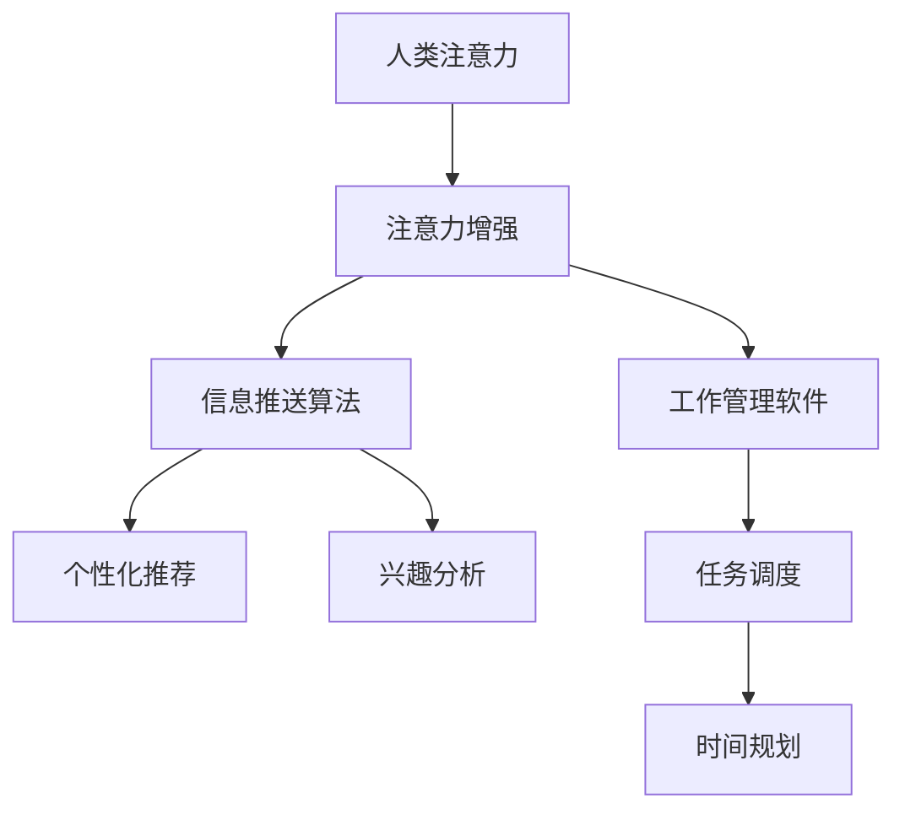

                 

# 人类注意力增强：提升专注力和注意力在商业中的未来发展方向

## 1. 背景介绍

### 1.1 问题由来

在当今信息爆炸的时代，注意力成为了我们获取知识、做出决策、甚至维持日常生活不可或缺的关键资源。然而，注意力是有限的，如何在大量的信息中快速识别并聚焦于最重要的内容，成为了一个重要挑战。尤其是在商业领域，决策的速度和质量直接影响着企业的竞争力。因此，如何提升人类的注意力，使之更高效、更有条理地进行工作，成为了许多商业和科技公司研究的热点话题。

### 1.2 问题核心关键点

提升人类注意力的方法主要可以分为两类：一类是通过技术手段改善人的注意力集中能力；另一类是通过环境、工具的设计，辅助人在原有注意力基础上提升效率。前者包括脑波训练、注意力训练应用等；后者则包括信息推送算法、工作管理软件等。本文主要聚焦于后者，探讨通过技术手段提升商业领域中的人类注意力。

### 1.3 问题研究意义

提升商业领域中的人类注意力，不仅可以提升决策的效率和质量，还能有效应对信息过载的挑战，提升企业的创新能力和市场竞争力。对于个人，提升注意力可以带来更佳的工作和学习效果，提升生活质量。

## 2. 核心概念与联系

### 2.1 核心概念概述

为更好地理解提升人类注意力的技术手段，本节将介绍几个关键概念：

- **人类注意力**：指人对外界刺激信息的聚焦和处理能力，是一种有限的资源，需要通过训练和优化来提升。
- **注意力增强**：通过技术手段，改善或提升人类的注意力集中和处理能力，以应对信息过载的挑战。
- **信息推送算法**：通过分析用户的注意力偏好，为用户推荐更相关的信息，提高信息获取的效率和质量。
- **工作管理软件**：通过提供时间管理、任务管理等功能，帮助用户更有条理地安排工作和任务，提高工作效率。

这些概念之间的联系可以通过以下Mermaid流程图来展示：



这个流程图展示了一个从人类注意力出发，通过注意力增强、信息推送、工作管理等手段，最终提升信息处理效率和任务完成效率的流程。

## 3. 核心算法原理 & 具体操作步骤
### 3.1 算法原理概述

提升人类注意力的技术手段，本质上是通过数据分析和机器学习算法，对用户的注意力行为进行建模和预测，从而辅助其更好地处理信息和管理任务。

具体而言，可以从以下几个方面进行建模和优化：

- **注意力模型**：通过分析用户在不同任务和信息源上的行为，建立用户注意力的模型，预测其未来行为。
- **个性化推荐系统**：根据用户的行为和偏好，推荐最相关和最有价值的信息，提高信息获取效率。
- **任务调度优化**：通过优化任务调度和分配，合理分配时间和资源，提升工作效率。

### 3.2 算法步骤详解

提升人类注意力的技术手段一般包括以下几个关键步骤：

**Step 1: 数据收集与预处理**
- 收集用户在不同任务和信息源上的行为数据，如浏览时间、点击次数、任务完成时间等。
- 对数据进行清洗和归一化，去除异常值和噪声，以提高模型的准确性和泛化能力。

**Step 2: 建模与训练**
- 选择合适的模型结构，如线性回归、决策树、随机森林、神经网络等，用于建立用户注意力模型。
- 使用训练数据集对模型进行训练，调整模型参数以提高预测准确性。
- 使用验证集对模型进行调优，防止过拟合。

**Step 3: 预测与优化**
- 对新用户或新任务，使用训练好的模型进行注意力预测。
- 根据预测结果，推荐最相关的信息，调整任务调度和分配，优化用户的工作流程。
- 定期收集用户反馈，更新模型，不断提升预测效果和用户体验。

### 3.3 算法优缺点

提升人类注意力的技术手段具有以下优点：
- 提高信息处理效率：通过个性化推荐和任务调度优化，用户可以更快、更准确地获取和处理信息，提升工作效率。
- 提升用户体验：通过智能化的信息推荐和工作管理，用户可以更好地管理时间和资源，提高生活质量。
- 数据驱动：通过大量数据分析和机器学习，提升注意力预测的准确性，不断优化系统效果。

同时，这些技术手段也存在一定的局限性：
- 数据隐私问题：收集和分析用户数据，可能涉及隐私问题，需要严格的隐私保护措施。
- 模型依赖性：依赖于用户数据的准确性和完备性，如果数据不足或质量不高，模型预测效果将大打折扣。
- 算法复杂性：提升注意力的技术手段通常涉及复杂的算法和模型，实现和维护成本较高。

尽管存在这些局限性，但就目前而言，通过技术手段提升人类注意力仍然是大势所趋。未来相关研究的重点在于如何进一步降低数据获取和处理成本，提升模型的鲁棒性和可解释性，同时兼顾隐私保护和用户体验。

### 3.4 算法应用领域

提升人类注意力的技术手段已经在多个领域得到了应用，包括但不限于：

- **智能客服**：通过分析用户的通话记录和反馈，推荐最相关的答案，提升客户服务质量。
- **广告推荐**：根据用户的浏览和点击行为，推荐最相关的广告，提高广告转化率。
- **工作管理**：提供任务分配、时间规划等功能，帮助用户更好地管理时间和任务，提升工作效率。
- **信息推送**：根据用户兴趣和行为，推荐最相关的信息，提升信息获取效率。
- **健康管理**：通过分析用户的健康数据，推荐最相关的健康建议，提升生活质量。

这些领域的应用展示了提升人类注意力的技术手段的广阔前景，未来还将拓展到更多场景中，为人类生活和工作的各个方面带来积极影响。

## 4. 数学模型和公式 & 详细讲解 & 举例说明
### 4.1 数学模型构建

提升人类注意力的技术手段通常涉及以下几个关键模型：

- **用户注意力模型**：使用多变量线性回归模型，建立用户注意力的预测公式。
- **个性化推荐模型**：使用协同过滤、基于内容的推荐算法等，为用户推荐最相关的信息。
- **任务调度模型**：使用线性规划、整数规划等，优化任务调度和分配。

以用户注意力模型为例，假设用户在工作上的注意力集中度由以下因素决定：

- 工作任务的复杂度：$C$
- 用户的疲劳度：$F$
- 任务的紧急程度：$E$
- 工作环境的质量：$H$

则用户注意力模型可以表示为：

$$ A = f(C, F, E, H) $$

其中 $f$ 为预测函数，$A$ 为用户的注意力集中度，$C, F, E, H$ 为影响因素的取值。

### 4.2 公式推导过程

以用户注意力模型为例，假设 $A$ 的取值为0到1之间，模型的预测函数 $f$ 为线性函数：

$$ A = \beta_0 + \beta_1 C + \beta_2 F + \beta_3 E + \beta_4 H $$

其中 $\beta_0, \beta_1, \beta_2, \beta_3, \beta_4$ 为模型的系数，需要通过训练数据集进行求解。

在实际应用中，可以通过以下步骤进行模型训练和预测：

1. 收集用户在不同任务和环境下的注意力集中度数据，建立训练集。
2. 将数据带入上述线性回归模型，求解 $\beta$。
3. 对新用户或新任务，使用训练好的模型进行注意力预测，从而进行个性化推荐和任务调度优化。

### 4.3 案例分析与讲解

假设某公司使用提升人类注意力的技术手段，对员工的工作任务进行优化。公司收集了员工在不同任务和环境下的工作时间、休息时间、任务完成时间和任务复杂度数据，建立了用户注意力模型。通过分析员工的历史工作数据，公司发现员工在复杂任务和紧急任务上的注意力集中度较低，在安静和舒适的工作环境下注意力集中度较高。

公司根据模型预测结果，为员工推荐适当的工作任务，优化任务调度和分配。例如，在复杂任务和紧急任务下，将部分任务分派给其他员工，以减轻员工负担。同时，通过调整工作环境，如增加空气质量、调节光线和温度等，提升员工的注意力集中度。通过这些优化措施，公司的员工工作效率显著提升，任务完成质量也有所提高。

## 5. 项目实践：代码实例和详细解释说明
### 5.1 开发环境搭建

在进行注意力增强项目实践前，我们需要准备好开发环境。以下是使用Python进行PyTorch开发的环境配置流程：

1. 安装Anaconda：从官网下载并安装Anaconda，用于创建独立的Python环境。

2. 创建并激活虚拟环境：
```bash
conda create -n attention-env python=3.8 
conda activate attention-env
```

3. 安装PyTorch：根据CUDA版本，从官网获取对应的安装命令。例如：
```bash
conda install pytorch torchvision torchaudio cudatoolkit=11.1 -c pytorch -c conda-forge
```

4. 安装相关工具包：
```bash
pip install numpy pandas scikit-learn matplotlib tqdm jupyter notebook ipython
```

完成上述步骤后，即可在`attention-env`环境中开始注意力增强项目的开发。

### 5.2 源代码详细实现

下面以个性化推荐系统为例，给出使用PyTorch进行用户注意力模型训练和预测的代码实现。

首先，定义注意力模型：

```python
import torch
from torch import nn
from sklearn.preprocessing import StandardScaler

class AttentionModel(nn.Module):
    def __init__(self, n_features):
        super(AttentionModel, self).__init__()
        self.scaler = StandardScaler()
        self.fc1 = nn.Linear(n_features, 64)
        self.fc2 = nn.Linear(64, 1)
        
    def forward(self, x):
        x_scaled = self.scaler.fit_transform(x)
        x = self.fc1(x_scaled)
        x = torch.sigmoid(self.fc2(x))
        return x
```

然后，定义数据处理函数：

```python
from sklearn.model_selection import train_test_split
from sklearn.metrics import mean_absolute_error

def process_data(data, target, split_ratio=0.8, random_state=42):
    X_train, X_test, y_train, y_test = train_test_split(data, target, test_size=split_ratio, random_state=random_state)
    scaler = StandardScaler()
    X_train = scaler.fit_transform(X_train)
    X_test = scaler.transform(X_test)
    return X_train, X_test, y_train, y_test
```

接着，定义模型训练和评估函数：

```python
def train_model(model, X_train, y_train, epochs=100, batch_size=32):
    optimizer = torch.optim.Adam(model.parameters(), lr=0.001)
    criterion = nn.MSELoss()
    model.train()
    for epoch in range(epochs):
        loss = 0
        for i in range(0, len(X_train), batch_size):
            X_batch, y_batch = X_train[i:i+batch_size], y_train[i:i+batch_size]
            optimizer.zero_grad()
            output = model(X_batch)
            loss += criterion(output, y_batch)
            loss.backward()
            optimizer.step()
        loss /= len(X_train)
        if (epoch+1) % 10 == 0:
            model.eval()
            with torch.no_grad():
                X_test, y_test = X_test, y_test
                output = model(X_test)
                mae = mean_absolute_error(y_test, output)
                print(f"Epoch {epoch+1}, Loss: {loss:.4f}, MAE: {mae:.4f}")
```

最后，启动模型训练和测试：

```python
X_train, X_test, y_train, y_test = process_data(data, target)
model = AttentionModel(n_features)
train_model(model, X_train, y_train)
```

以上就是使用PyTorch对用户注意力模型进行训练和预测的完整代码实现。可以看到，PyTorch配合机器学习库，使得模型训练的实现变得简洁高效。

### 5.3 代码解读与分析

让我们再详细解读一下关键代码的实现细节：

**AttentionModel类**：
- `__init__`方法：初始化模型的参数和预处理组件，如特征缩放器。
- `forward`方法：实现模型的前向传播，将输入数据通过线性变换和激活函数，得到注意力预测值。

**process_data函数**：
- 使用`train_test_split`将数据划分为训练集和测试集，并使用`StandardScaler`对数据进行归一化处理。

**train_model函数**：
- 定义优化器和损失函数。
- 在每个epoch中，对数据进行批处理，前向传播计算损失并反向传播更新模型参数。
- 在每个epoch结束后，输出平均loss和均方误差，并在测试集上评估模型性能。

**启动训练和测试**：
- 使用`process_data`函数将数据划分为训练集和测试集。
- 定义模型实例，调用`train_model`函数进行训练。

可以看到，PyTorch配合机器学习库，使得模型训练的实现变得简洁高效。开发者可以将更多精力放在数据处理、模型改进等高层逻辑上，而不必过多关注底层的实现细节。

当然，工业级的系统实现还需考虑更多因素，如模型的保存和部署、超参数的自动搜索、更灵活的任务适配层等。但核心的注意力增强范式基本与此类似。

## 6. 实际应用场景
### 6.1 智能客服系统

基于用户注意力增强技术的智能客服系统，可以显著提升客户服务质量和效率。传统客服往往需要配备大量人力，高峰期响应缓慢，且一致性和专业性难以保证。而使用用户注意力增强技术的客服系统，可以根据客户的需求和历史行为，推荐最相关的答案，提高服务响应速度和质量。

在技术实现上，可以收集客户的历史行为数据，如咨询记录、购买历史、社交媒体互动等，建立客户注意力模型。根据客户当前的咨询意图和行为，推荐最相关的答案模板，提升客户满意度。对于客户提出的新问题，还可以接入检索系统实时搜索相关内容，动态组织生成回答，提升系统的智能化水平。

### 6.2 广告推荐系统

提升广告推荐系统中的用户注意力，可以显著提高广告的转化率和用户满意度。当前广告推荐系统往往依赖于用户的点击行为进行推荐，忽视了用户在其他行为上的注意力偏好。通过用户注意力增强技术，广告推荐系统可以全面分析用户的行为数据，推荐更相关和有价值的信息，提高广告的投放效果。

在实现上，可以收集用户的浏览、点击、分享等行为数据，分析用户在不同渠道上的注意力集中度和偏好。根据这些数据，优化广告推荐算法，提高广告的展示效果和点击率。同时，通过分析用户的兴趣变化，及时调整广告内容和投放策略，提升广告的长期效果。

### 6.3 工作管理软件

提升工作管理软件中的用户注意力，可以帮助用户更好地管理时间和任务，提高工作效率。传统工作管理软件往往只提供任务列表和时间表，忽视了用户在不同任务上的注意力集中度和优先级。通过用户注意力增强技术，工作管理软件可以推荐最相关和最紧急的任务，优化任务调度和分配，提升用户的工作效率。

在实现上，可以收集用户在不同任务上的工作时间和完成任务的质量数据，建立用户注意力模型。根据用户的工作状态和注意力集中度，推荐最相关和最紧急的任务，调整任务的优先级和时间安排，帮助用户更高效地完成任务。同时，通过分析用户的工作习惯和偏好，个性化调整工作管理界面和功能，提升用户的使用体验。

### 6.4 未来应用展望

随着用户注意力增强技术的不断发展，其在商业领域的应用将不断拓展，为企业的数字化转型和智能化升级带来新的机遇。

在智慧医疗领域，提升患者和治疗方案的匹配度，提高诊疗效果和患者满意度。通过分析患者的健康数据和历史治疗记录，推荐最合适的治疗方案，提升诊疗效率和效果。

在智能教育领域，提升学生的学习效果和学习体验。通过分析学生的学习行为和偏好，推荐最相关和最有价值的学习资源，提升学生的学习效率和效果。同时，通过个性化调整学习内容和方式，提升学生的学习兴趣和积极性。

在智能交通领域，提升交通管理和调度效率。通过分析驾驶员和乘客的行为数据，推荐最合适的行车路线和交通方式，优化交通流量和通行效率。同时，通过分析交通状况和天气变化，实时调整交通管理和调度策略，提升交通系统的智能化水平。

## 7. 工具和资源推荐
### 7.1 学习资源推荐

为了帮助开发者系统掌握注意力增强技术，这里推荐一些优质的学习资源：

1. **《深度学习与自然语言处理》（第二版）**：斯坦福大学的经典教材，系统介绍了深度学习在NLP领域的应用，包括注意力机制、推荐系统等。

2. **《Python数据科学手册》**：涵盖了数据分析、机器学习、深度学习等技术栈的全面指南，适合初学者入门。

3. **Coursera《Machine Learning》课程**：由斯坦福大学Andrew Ng教授主讲，系统介绍了机器学习的基本概念和算法，适合深入学习。

4. **Kaggle**：全球最大的数据科学竞赛平台，提供大量数据集和竞赛，可以锻炼数据分析和模型训练能力。

5. **Transformers库官方文档**：提供了丰富的预训练模型和微调样例代码，是进行注意力增强任务开发的必备资料。

通过对这些资源的学习实践，相信你一定能够快速掌握注意力增强技术的精髓，并用于解决实际的商业问题。

### 7.2 开发工具推荐

高效的开发离不开优秀的工具支持。以下是几款用于注意力增强开发的常用工具：

1. **PyTorch**：基于Python的开源深度学习框架，灵活动态的计算图，适合快速迭代研究。大部分预训练模型都有PyTorch版本的实现。

2. **TensorFlow**：由Google主导开发的开源深度学习框架，生产部署方便，适合大规模工程应用。同样有丰富的预训练模型资源。

3. **Jupyter Notebook**：免费的交互式编程环境，适合进行实验和分享学习笔记。

4. **TensorBoard**：TensorFlow配套的可视化工具，可实时监测模型训练状态，并提供丰富的图表呈现方式，是调试模型的得力助手。

5. **Weights & Biases**：模型训练的实验跟踪工具，可以记录和可视化模型训练过程中的各项指标，方便对比和调优。

合理利用这些工具，可以显著提升注意力增强任务的开发效率，加快创新迭代的步伐。

### 7.3 相关论文推荐

注意力增强技术的发展源于学界的持续研究。以下是几篇奠基性的相关论文，推荐阅读：

1. **Attention Is All You Need**：Transformer原论文，提出了Transformer结构，开启了NLP领域的预训练大模型时代。

2. **A Survey on Recommendation Systems**：综述性论文，系统介绍了推荐系统的发展历史和前沿技术。

3. **Deep Attention Models for Recommendation**：研究了深度学习在推荐系统中的应用，提出了多种基于注意力的推荐算法。

4. **Multi-Task Attention Models for Collaborative Filtering**：提出多任务注意力模型，通过联合训练优化推荐效果。

这些论文代表了大注意力增强技术的发展脉络。通过学习这些前沿成果，可以帮助研究者把握学科前进方向，激发更多的创新灵感。

## 8. 总结：未来发展趋势与挑战
### 8.1 总结

本文对提升人类注意力的技术手段进行了全面系统的介绍。首先阐述了提升注意力的重要性，明确了注意力增强在提升决策效率和用户满意度方面的独特价值。其次，从原理到实践，详细讲解了注意力增强的数学模型和关键步骤，给出了注意力增强任务开发的完整代码实例。同时，本文还广泛探讨了注意力增强技术在商业领域的应用前景，展示了其广阔的发展潜力。

通过本文的系统梳理，可以看到，提升商业领域中的人类注意力，不仅可以提升决策的效率和质量，还能有效应对信息过载的挑战，提升企业的创新能力和市场竞争力。对于个人，提升注意力可以带来更佳的工作和学习效果，提升生活质量。

### 8.2 未来发展趋势

展望未来，注意力增强技术将呈现以下几个发展趋势：

1. **个性化推荐系统的普及**：随着技术的发展，基于注意力增强的个性化推荐系统将更加普及，覆盖更多的应用场景，提升信息获取效率。

2. **智能工作管理系统的进化**：未来的工作管理系统将更加智能化和个性化，根据用户的行为和偏好，动态调整任务调度和分配，提升工作效率。

3. **多模态注意力增强**：将注意力增强技术扩展到视觉、语音等多模态数据，实现跨模态的智能交互和协同建模，提升系统理解和处理复杂任务的能力。

4. **联邦学习的应用**：通过联邦学习技术，多方共享用户数据，提升模型训练效果，保护用户隐私。

5. **实时注意力监控**：实时监测用户注意力状态，及时调整任务和信息推荐策略，提升用户体验和系统智能性。

6. **可解释性和透明度提升**：提升模型的可解释性和透明度，让用户更好地理解注意力增强系统的决策过程，提升用户信任和满意度。

这些趋势凸显了注意力增强技术的广阔前景，未来的研究和应用将不断拓展其应用范围和深度。

### 8.3 面临的挑战

尽管注意力增强技术已经取得了瞩目成就，但在迈向更加智能化、普适化应用的过程中，它仍面临着诸多挑战：

1. **数据隐私问题**：收集和分析用户数据，可能涉及隐私问题，需要严格的隐私保护措施。

2. **模型依赖性**：依赖于用户数据的准确性和完备性，如果数据不足或质量不高，模型预测效果将大打折扣。

3. **算法复杂性**：注意力增强技术通常涉及复杂的算法和模型，实现和维护成本较高。

4. **用户体验问题**：注意力增强系统需要根据用户行为和偏好进行实时调整，如果调整不合理，可能导致用户体验下降。

5. **计算资源要求**：注意力增强系统通常需要大量的计算资源，特别是在大规模数据和模型训练时，计算成本较高。

6. **安全性问题**：注意力增强系统需要应对恶意攻击和滥用，保障系统的安全性和鲁棒性。

正视这些挑战，积极应对并寻求突破，将使注意力增强技术迈向成熟的商业应用。相信随着学界和产业界的共同努力，这些挑战终将一一被克服，注意力增强技术必将在构建人机协同的智能时代中扮演越来越重要的角色。

### 8.4 研究展望

未来的研究需要在以下几个方面寻求新的突破：

1. **改进用户注意力模型**：开发更加高效和鲁棒的注意力模型，提高模型预测的准确性和泛化能力。

2. **融合更多先验知识**：将符号化的先验知识，如知识图谱、逻辑规则等，与神经网络模型进行巧妙融合，提升模型决策的逻辑性和合理性。

3. **多模态数据融合**：将视觉、语音、文本等多模态数据进行融合，提升系统的理解和处理复杂任务的能力。

4. **联邦学习的应用**：通过联邦学习技术，多方共享用户数据，提升模型训练效果，保护用户隐私。

5. **实时监控和调整**：实时监测用户注意力状态，动态调整任务和信息推荐策略，提升用户体验和系统智能性。

6. **可解释性和透明度提升**：提升模型的可解释性和透明度，让用户更好地理解注意力增强系统的决策过程，提升用户信任和满意度。

这些研究方向的探索，将引领注意力增强技术迈向更高的台阶，为构建安全、可靠、可解释、可控的智能系统铺平道路。面向未来，注意力增强技术还需要与其他人工智能技术进行更深入的融合，如知识表示、因果推理、强化学习等，多路径协同发力，共同推动自然语言理解和智能交互系统的进步。只有勇于创新、敢于突破，才能不断拓展语言模型的边界，让智能技术更好地造福人类社会。

## 9. 附录：常见问题与解答

**Q1：提升人类注意力的技术手段是否适用于所有商业场景？**

A: 提升人类注意力的技术手段在大多数商业场景中都有应用价值，但对于一些需要高精度和实时性的场景，如医疗诊断、金融交易等，可能需要结合其他技术和方法进行优化。

**Q2：如何选择合适的模型结构？**

A: 模型结构的选择需要根据具体任务和数据特点进行，一般可以先尝试简单的线性回归模型，再逐步增加模型复杂度，如加入非线性项、集成学习等，优化模型性能。

**Q3：数据收集和预处理需要注意哪些问题？**

A: 数据收集和预处理是模型训练的关键步骤，需要注意数据的多样性、代表性、完备性，以及异常值和噪声的处理。同时，数据的归一化和标准化处理，可以提升模型的泛化能力。

**Q4：如何降低模型依赖性？**

A: 可以通过数据增强、对抗训练等方法，提高模型的鲁棒性和泛化能力，降低对数据质量和数量的依赖。同时，可以考虑引入多种先验知识，提升模型的决策逻辑性和合理性。

**Q5：如何提升模型的可解释性？**

A: 可以通过可视化技术，展示模型的内部决策过程，解释模型预测的依据。同时，可以考虑使用可解释性较强的模型结构，如决策树、逻辑回归等，提升模型的透明度和可解释性。

这些问题的解答，展示了注意力增强技术在商业领域应用的广泛性和复杂性，需要开发者根据具体场景进行优化和调整，才能充分发挥其潜力。

---

作者：禅与计算机程序设计艺术 / Zen and the Art of Computer Programming

