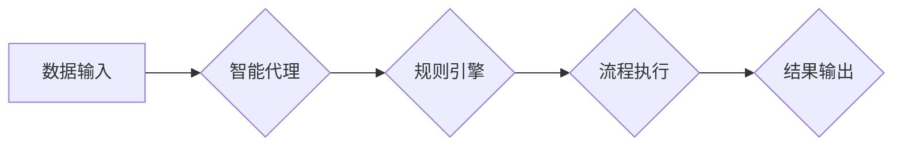

> Agentic Workflow, 智能流程, 自动化, 协作, 决策, 机器学习, 深度学习, 应用场景

## 1. 背景介绍

在当今数字化时代，企业和组织面临着日益复杂的业务流程和不断增长的数据量。传统的流程管理方式难以应对这种快速变化的挑战。为了提高效率、降低成本和增强灵活性，Agentic Workflow（智能流程）应运而生。

Agentic Workflow是一种基于人工智能（AI）的流程自动化技术，它能够智能地识别、理解和执行业务流程，并根据实时数据和环境变化进行动态调整。与传统的流程管理方式相比，Agentic Workflow具有以下优势：

* **自动化**: 自动化重复性任务，解放人力资源，提高效率。
* **智能化**: 利用AI技术，智能识别流程步骤，自动决策，提高流程效率和准确性。
* **灵活性**: 可以根据业务需求动态调整流程，适应不断变化的环境。
* **协作**: 支持多方协作，提高流程透明度和效率。

## 2. 核心概念与联系

Agentic Workflow的核心概念包括：

* **代理（Agent）**:  智能实体，能够感知环境、做出决策并执行行动。
* **流程（Workflow）**: 一系列相互关联的步骤，用于完成特定任务。
* **规则（Rule）**: 用于指导代理执行流程的决策准则。
* **数据（Data）**: 流程执行过程中产生的信息，用于代理决策和流程调整。

**Agentic Workflow 架构**



## 3. 核心算法原理 & 具体操作步骤

### 3.1  算法原理概述

Agentic Workflow的核心算法原理基于**强化学习**和**图神经网络**。

* **强化学习**:  智能代理通过与环境交互，学习最佳的决策策略，以最大化奖励。
* **图神经网络**: 用于表示和分析流程中的关系和依赖性，帮助代理理解流程结构和执行步骤。

### 3.2  算法步骤详解

1. **流程建模**: 将业务流程抽象为图结构，其中节点代表流程步骤，边代表步骤之间的关系。
2. **代理训练**: 利用强化学习算法，训练智能代理，使其能够根据流程图和输入数据做出最佳决策。
3. **规则引擎**: 基于预定义的规则和代理的决策，执行流程步骤。
4. **数据反馈**: 流程执行过程中产生的数据反馈给代理，用于更新决策策略。
5. **流程调整**: 根据代理的决策和数据反馈，动态调整流程结构和执行步骤。

### 3.3  算法优缺点

**优点**:

* 自动化程度高，提高效率。
* 智能决策，提高流程准确性。
* 灵活性强，适应变化的业务需求。

**缺点**:

* 训练复杂，需要大量数据和计算资源。
* 算法解释性差，难以理解代理的决策过程。

### 3.4  算法应用领域

Agentic Workflow在以下领域具有广泛的应用前景：

* **金融服务**: 自动化贷款审批、风险评估等流程。
* **医疗保健**: 自动化病历处理、预约挂号等流程。
* **制造业**: 自动化生产调度、质量控制等流程。
* **电商**: 自动化订单处理、物流配送等流程。

## 4. 数学模型和公式 & 详细讲解 & 举例说明

### 4.1  数学模型构建

Agentic Workflow的数学模型可以基于马尔可夫决策过程（MDP）构建。

* 状态空间：流程执行的当前状态。
* 动作空间：代理可以执行的行动。
* 转移概率：从一个状态到另一个状态的概率。
* 奖励函数：代理在某个状态执行某个行动获得的奖励。

### 4.2  公式推导过程

目标是找到一个策略π，使得代理在执行流程过程中获得最大的累积奖励。

$$
\pi^* = \arg\max_{\pi} \mathbb{E}_{\pi} \sum_{t=0}^{\infty} \gamma^t r_t
$$

其中：

* $\pi^*$：最优策略。
* $\mathbb{E}_{\pi}$：根据策略π的期望值。
* $r_t$：时间步t的奖励。
* $\gamma$：折扣因子，控制未来奖励的权重。

### 4.3  案例分析与讲解

例如，在贷款审批流程中，代理可以执行以下行动：

* 审批通过
* 审批拒绝
* 要求补充信息

每个行动都有不同的奖励，例如审批通过获得高奖励，审批拒绝获得低奖励，要求补充信息获得中等奖励。

通过强化学习算法，代理可以学习到最佳的审批策略，以最大化奖励，即提高贷款审批的效率和准确性。

## 5. 项目实践：代码实例和详细解释说明

### 5.1  开发环境搭建

* Python 3.x
* TensorFlow 或 PyTorch
* 其他必要的库，例如：NumPy、Pandas、Scikit-learn

### 5.2  源代码详细实现

```python
# 导入必要的库
import tensorflow as tf

# 定义代理模型
class Agent(tf.keras.Model):
    def __init__(self):
        super(Agent, self).__init__()
        # 定义模型结构
        self.dense1 = tf.keras.layers.Dense(64, activation='relu')
        self.dense2 = tf.keras.layers.Dense(32, activation='relu')
        self.output = tf.keras.layers.Dense(3, activation='softmax')

    def call(self, inputs):
        x = self.dense1(inputs)
        x = self.dense2(x)
        return self.output(x)

# 实例化代理模型
agent = Agent()

# 定义奖励函数
def reward_function(state, action):
    # 根据状态和动作计算奖励
    # ...

# 训练代理模型
# ...

```

### 5.3  代码解读与分析

* 代理模型使用深度神经网络结构，输入流程状态，输出动作概率分布。
* 奖励函数根据流程执行结果计算奖励，引导代理学习最佳决策策略。
* 训练过程使用强化学习算法，例如Q学习或深度Q网络。

### 5.4  运行结果展示

* 通过训练后的代理模型，可以自动执行流程，并根据实际情况动态调整流程步骤。
* 可以通过监控代理的决策过程和流程执行结果，评估代理的性能和效果。

## 6. 实际应用场景

### 6.1  金融服务

* **贷款审批**: 智能代理可以根据客户的信用评分、收入证明等信息，自动审批贷款申请，提高审批效率和准确性。
* **风险评估**: 智能代理可以分析客户的交易记录、行为模式等数据，识别潜在的风险，并采取相应的措施。

### 6.2  医疗保健

* **病历处理**: 智能代理可以自动提取病历中的关键信息，例如症状、诊断、治疗方案等，提高病历处理效率。
* **预约挂号**: 智能代理可以根据患者的预约时间、医生排班等信息，自动安排挂号时间，提高预约效率。

### 6.3  制造业

* **生产调度**: 智能代理可以根据生产计划、设备状态、物料库存等信息，自动安排生产任务，提高生产效率和产能利用率。
* **质量控制**: 智能代理可以监控生产过程中的关键指标，识别产品缺陷，并采取相应的措施，提高产品质量。

### 6.4  未来应用展望

Agentic Workflow在未来将有更广泛的应用场景，例如：

* **智能客服**: 智能代理可以自动处理客户咨询、投诉等问题，提高客户服务效率。
* **个性化推荐**: 智能代理可以根据用户的兴趣爱好、购买历史等信息，提供个性化的产品推荐。
* **自动驾驶**: 智能代理可以控制车辆行驶，实现自动驾驶功能。

## 7. 工具和资源推荐

### 7.1  学习资源推荐

* **书籍**:
    * 《Reinforcement Learning: An Introduction》 by Richard S. Sutton and Andrew G. Barto
    * 《Deep Learning》 by Ian Goodfellow, Yoshua Bengio, and Aaron Courville
* **在线课程**:
    * Coursera: Reinforcement Learning Specialization
    * Udacity: Deep Learning Nanodegree

### 7.2  开发工具推荐

* **TensorFlow**: 开源深度学习框架
* **PyTorch**: 开源深度学习框架
* **Keras**: 高级深度学习API

### 7.3  相关论文推荐

* **Deep Reinforcement Learning for Robotics** by Levine et al.
* **Proximal Policy Optimization Algorithms** by Schulman et al.
* **Attention Is All You Need** by Vaswani et al.

## 8. 总结：未来发展趋势与挑战

### 8.1  研究成果总结

Agentic Workflow是一个新兴的领域，近年来取得了显著的进展。

* 强化学习算法在代理训练方面取得了突破。
* 图神经网络在流程建模和分析方面展现出强大的能力。
*  Agentic Workflow在多个领域得到了实际应用，并取得了良好的效果。

### 8.2  未来发展趋势

* **更强大的代理模型**: 开发更强大的代理模型，能够处理更复杂的任务和环境。
* **更有效的训练方法**: 研究更有效的训练方法，降低训练成本和时间。
* **更广泛的应用场景**: 将Agentic Workflow应用到更多领域，例如自动驾驶、医疗诊断等。

### 8.3  面临的挑战

* **数据获取和标注**: 训练Agentic Workflow模型需要大量的数据，获取和标注这些数据是一个挑战。
* **算法解释性**: 现有的强化学习算法解释性差，难以理解代理的决策过程。
* **安全性和可靠性**: Agentic Workflow系统需要保证安全性和可靠性，避免出现意外情况。

### 8.4  研究展望

未来，Agentic Workflow将继续是一个重要的研究方向，需要进一步探索以下问题：

* 如何开发更强大的代理模型，能够处理更复杂的任务和环境？
* 如何提高算法的解释性，使得人类能够更好地理解代理的决策过程？
* 如何保证Agentic Workflow系统的安全性和可靠性？


## 9. 附录：常见问题与解答

* **什么是Agentic Workflow？**

Agentic Workflow是一种基于人工智能的流程自动化技术，它能够智能地识别、理解和执行业务流程，并根据实时数据和环境变化进行动态调整。

* **Agentic Workflow有哪些优势？**

Agentic Workflow具有以下优势：

* 自动化程度高，提高效率。
* 智能决策，提高流程准确性。
* 灵活性强，适应变化的业务需求。

* **Agentic Workflow有哪些应用场景？**

Agentic Workflow在金融服务、医疗保健、制造业等多个领域具有广泛的应用前景。

* **如何学习Agentic Workflow？**

可以参考上述学习资源推荐，学习强化学习和深度学习相关知识。

作者：禅与计算机程序设计艺术 / Zen and the Art of Computer Programming


<end_of_turn>