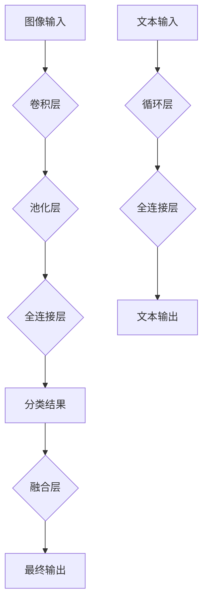

> 深度学习，计算机视觉，自然语言处理，Andrej Karpathy，特斯拉，OpenAI，卷积神经网络，循环神经网络

## 1. 背景介绍

深度学习作为人工智能领域最前沿的技术之一，近年来取得了令人瞩目的成就，在计算机视觉、自然语言处理、语音识别等领域取得了突破性的进展。而Andrej Karpathy作为深度学习领域的领军人物，其对深度学习的贡献和推动作用不可忽视。

Andrej Karpathy是一位计算机科学家，斯坦福大学博士毕业，曾任特斯拉高级工程师，现任OpenAI研究科学家。他以其在深度学习领域的开创性研究和技术贡献而闻名。

## 2. 核心概念与联系

Karpathy的研究主要集中在深度学习的应用，特别是计算机视觉和自然语言处理。他提出了许多新的算法和架构，并将其应用于实际问题，取得了显著的成果。

**2.1 核心概念：**

* **卷积神经网络 (CNN):**  CNN是一种专门用于处理图像数据的深度学习网络结构。它通过卷积操作提取图像特征，并通过多个卷积层和池化层进行特征层次化提取，最终实现图像分类、目标检测等任务。
* **循环神经网络 (RNN):** RNN是一种专门用于处理序列数据的深度学习网络结构。它具有记忆单元，可以记住之前的信息，从而处理时间序列数据，例如文本、语音等。

**2.2 核心概念联系：**

Karpathy的研究将CNN和RNN结合起来，开发出新的深度学习模型，用于解决更复杂的任务，例如图像字幕生成、视频理解等。

**2.3 Mermaid 流程图：**



## 3. 核心算法原理 & 具体操作步骤

**3.1 算法原理概述**

Karpathy的研究主要集中在以下几个方面：

* **图像字幕生成:** 利用CNN提取图像特征，结合RNN生成图像描述的文本。
* **视频理解:** 利用CNN和RNN分析视频序列，理解视频内容。
* **自动驾驶:** 利用CNN和RNN处理摄像头和传感器数据，实现自动驾驶功能。

**3.2 算法步骤详解**

**3.2.1 图像字幕生成:**

1. **图像特征提取:** 使用CNN提取图像特征，例如物体、场景等。
2. **文本编码:** 使用RNN将文本编码成向量表示。
3. **特征融合:** 将图像特征和文本编码结果融合在一起。
4. **文本生成:** 使用RNN生成图像描述的文本。

**3.2.2 视频理解:**

1. **帧特征提取:** 使用CNN提取每帧图像的特征。
2. **时间序列建模:** 使用RNN建模视频帧之间的关系，理解视频内容。
3. **事件识别:** 利用视频理解结果识别视频中的事件。

**3.3 算法优缺点**

**优点:**

* 能够处理复杂的数据，例如图像、视频、文本等。
* 能够自动学习特征，无需人工特征工程。
* 能够取得令人瞩目的性能，在许多任务上超越传统方法。

**缺点:**

* 训练数据量大，需要大量的计算资源。
* 模型解释性差，难以理解模型的决策过程。
* 对噪声数据敏感，容易受到噪声的影响。

**3.4 算法应用领域**

* **计算机视觉:** 图像分类、目标检测、图像分割、图像生成等。
* **自然语言处理:** 文本分类、情感分析、机器翻译、文本摘要等。
* **语音识别:** 语音转文本、语音合成等。
* **自动驾驶:** 视觉感知、路径规划、决策控制等。
* **医疗诊断:** 病理图像分析、疾病预测等。

## 4. 数学模型和公式 & 详细讲解 & 举例说明

**4.1 数学模型构建**

深度学习模型通常由多个层组成，每一层都包含多个神经元。神经元之间通过权重连接，权重决定了神经元之间的传递强度。

**4.2 公式推导过程**

深度学习模型的训练过程是通过优化权重来实现的。常用的优化算法包括梯度下降法、动量法、Adam算法等。

**4.3 案例分析与讲解**

**4.3.1 举例说明：**

假设我们有一个简单的深度学习模型，包含两层神经元，第一层有5个神经元，第二层有3个神经元。

* **输入层:** 5个输入特征。
* **隐藏层:** 5个神经元，每个神经元接收5个输入特征的加权和，并通过激活函数进行处理。
* **输出层:** 3个神经元，每个神经元接收隐藏层5个神经元的加权和，并输出最终结果。

**4.3.2 公式推导:**

* **隐藏层神经元输出:**

```
h_i = f(w_i1 * x_1 + w_i2 * x_2 + ... + w_in * x_n)
```

其中：

* $h_i$ 是隐藏层第i个神经元的输出。
* $f$ 是激活函数，例如ReLU函数。
* $w_ij$ 是隐藏层第i个神经元与输入层第j个神经元的权重。
* $x_j$ 是输入层第j个特征。

* **输出层神经元输出:**

```
y_i = g(v_i1 * h_1 + v_i2 * h_2 + ... + v_im * h_m)
```

其中：

* $y_i$ 是输出层第i个神经元的输出。
* $g$ 是激活函数，例如softmax函数。
* $v_ij$ 是输出层第i个神经元与隐藏层第j个神经元的权重。
* $h_j$ 是隐藏层第j个神经元的输出。

## 5. 项目实践：代码实例和详细解释说明

**5.1 开发环境搭建**

* Python 3.x
* TensorFlow 或 PyTorch 深度学习框架
* CUDA 和 cuDNN (可选，用于GPU加速)

**5.2 源代码详细实现**

```python
import tensorflow as tf

# 定义模型结构
model = tf.keras.models.Sequential([
    tf.keras.layers.Conv2D(32, (3, 3), activation='relu', input_shape=(28, 28, 1)),
    tf.keras.layers.MaxPooling2D((2, 2)),
    tf.keras.layers.Conv2D(64, (3, 3), activation='relu'),
    tf.keras.layers.MaxPooling2D((2, 2)),
    tf.keras.layers.Flatten(),
    tf.keras.layers.Dense(10, activation='softmax')
])

# 编译模型
model.compile(optimizer='adam',
              loss='sparse_categorical_crossentropy',
              metrics=['accuracy'])

# 训练模型
model.fit(x_train, y_train, epochs=5)

# 评估模型
loss, accuracy = model.evaluate(x_test, y_test)
print('Test loss:', loss)
print('Test accuracy:', accuracy)
```

**5.3 代码解读与分析**

* **模型结构:** 该代码定义了一个简单的卷积神经网络模型，包含两层卷积层、两层池化层、一层全连接层和一层输出层。
* **激活函数:** 使用ReLU函数作为卷积层和全连接层的激活函数，使用softmax函数作为输出层的激活函数。
* **优化器:** 使用Adam优化器来训练模型。
* **损失函数:** 使用sparse_categorical_crossentropy作为损失函数，用于分类任务。
* **指标:** 使用accuracy作为评估指标，用于衡量模型的准确率。

**5.4 运行结果展示**

训练完成后，可以将模型应用于新的数据进行预测。

## 6. 实际应用场景

**6.1 图像分类:**

* **医疗诊断:** 利用CNN对病理图像进行分类，辅助医生诊断疾病。
* **工业缺陷检测:** 利用CNN检测工业产品中的缺陷，提高产品质量。
* **人脸识别:** 利用CNN识别人脸，用于身份验证和安全监控。

**6.2 自然语言处理:**

* **机器翻译:** 利用RNN和Transformer模型将文本从一种语言翻译成另一种语言。
* **文本摘要:** 利用RNN和Transformer模型生成文本的摘要。
* **情感分析:** 利用RNN和Transformer模型分析文本的情感倾向。

**6.3 自动驾驶:**

* **视觉感知:** 利用CNN分析摄像头和雷达数据，识别道路、车辆和行人。
* **路径规划:** 利用RNN和强化学习算法规划车辆行驶路径。
* **决策控制:** 利用深度学习模型控制车辆的加速、减速和转向。

**6.4 未来应用展望**

深度学习技术还在不断发展，未来将有更多新的应用场景出现，例如：

* **个性化推荐:** 利用深度学习模型分析用户的行为数据，提供个性化的商品推荐。
* **药物研发:** 利用深度学习模型预测药物的活性，加速药物研发过程。
* **科学发现:** 利用深度学习模型分析大规模数据，发现新的科学规律。

## 7. 工具和资源推荐

**7.1 学习资源推荐**

* **书籍:**
    * 深度学习 (Deep Learning) - Ian Goodfellow, Yoshua Bengio, Aaron Courville
    * 深度学习实践 (Deep Learning with Python) - Francois Chollet
* **在线课程:**
    * 深度学习 Specialization - Andrew Ng (Coursera)
    * fast.ai - Practical Deep Learning for Coders
* **博客和网站:**
    * Andrej Karpathy's Blog: https://karpathy.github.io/
    * OpenAI Blog: https://openai.com/blog/

**7.2 开发工具推荐**

* **TensorFlow:** https://www.tensorflow.org/
* **PyTorch:** https://pytorch.org/
* **Keras:** https://keras.io/

**7.3 相关论文推荐**

* **ImageNet Classification with Deep Convolutional Neural Networks** - Alex Krizhevsky, Ilya Sutskever, Geoffrey E. Hinton
* **Sequence to Sequence Learning with Neural Networks** - Ilya Sutskever, Oriol Vinyals, Quoc V. Le
* **Attention Is All You Need** - Ashish Vaswani, Noam Shazeer, Niki Parmar, Jakob Uszkoreit, Llion Jones, Aidan N. Gomez, Łukasz Kaiser, Illia Polosukhin

## 8. 总结：未来发展趋势与挑战

**8.1 研究成果总结**

深度学习技术取得了令人瞩目的成就，在许多领域取得了突破性的进展。

**8.2 未来发展趋势**

* **模型规模和复杂度:** 深度学习模型将继续朝着更大、更复杂的方向发展。
* **数据效率:** 研究更有效的深度学习算法，能够利用更少的数据进行训练。
* **可解释性:** 研究更可解释的深度学习模型，能够更好地理解模型的决策过程。
* **边缘计算:** 将深度学习模型部署到边缘设备上，实现更快速的推理速度和更低的延迟。

**8.3 面临的挑战**

* **数据获取和标注:** 深度学习模型需要大量的训练数据，数据获取和标注成本高昂。
* **计算资源:** 训练大型深度学习模型需要大量的计算资源，成本高昂。
* **模型安全性:** 深度学习模型容易受到攻击，需要研究更安全的深度学习模型。

**8.4 研究展望**

未来，深度学习技术将继续发展，在更多领域发挥重要作用。


## 9. 附录：常见问题与解答

**9.1 什么是深度学习