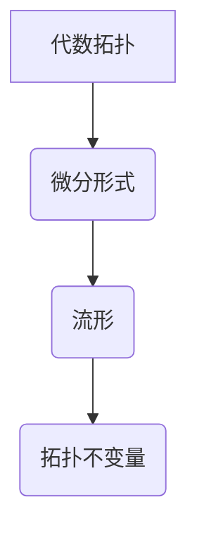

代数拓扑，微分形式，Bott-Tu，拓扑学，微分几何，流形

## 1. 背景介绍

代数拓扑和微分几何是数学领域的两大重要分支，它们分别研究空间的拓扑性质和空间的微分结构。代数拓扑利用代数工具来研究空间的形状和结构，而微分几何则利用微分工具来研究空间的曲率和变化。

Bott和Tu的《代数拓扑中的微分形式》是一本经典的教科书，它将代数拓扑和微分几何巧妙地结合起来，为读者提供了深入理解这两个领域的基础知识和核心概念。

本书主要内容包括：

* 微分形式的定义和性质
* 微分形式在流形上的积分
* 微分形式的外部微分
* 微分形式的霍奇理论
* 微分形式在拓扑不变量中的应用

本书的写作风格清晰简洁，理论内容深入浅出，并配有大量的练习题和习题解答，非常适合作为代数拓扑和微分几何的学习教材。

## 2. 核心概念与联系

### 2.1 微分形式

微分形式是微分几何中用来描述空间变化的工具。它是一种在流形上定义的函数，其值是一个标量或向量。微分形式可以用来计算流形上的积分，例如面积和体积。

### 2.2 流形

流形是拓扑空间的一种特殊类型，它局部像欧几里得空间。流形是微分几何研究的对象，它可以用来描述曲面、空间等几何对象。

### 2.3 代数拓扑

代数拓扑利用代数工具来研究空间的拓扑性质。它通过构建空间的代数表示，例如同调群和上同调群，来研究空间的形状和结构。

### 2.4 联系

Bott和Tu的《代数拓扑中的微分形式》将代数拓扑和微分几何巧妙地结合起来。它利用微分形式来研究流形的拓扑性质，并通过微分形式的外部微分和霍奇理论来构建流形的代数表示。



## 3. 核心算法原理 & 具体操作步骤

### 3.1 算法原理概述

本书的核心算法是利用微分形式的外部微分和霍奇理论来构建流形的代数表示。

外部微分是一种对微分形式进行微分运算的工具，它可以用来计算微分形式的导数。霍奇理论则将流形的微分形式与流形的代数表示联系起来，它表明流形的微分形式的外部微分可以用来计算流形的代数不变量。

### 3.2 算法步骤详解

1. **定义微分形式:** 在流形上定义微分形式，并确定其性质。
2. **计算外部微分:** 对微分形式进行外部微分运算，得到新的微分形式。
3. **应用霍奇理论:** 利用霍奇理论将微分形式的外部微分与流形的代数不变量联系起来。
4. **计算拓扑不变量:** 通过计算微分形式的外部微分和霍奇理论，得到流形的代数不变量。

### 3.3 算法优缺点

**优点:**

* 可以有效地计算流形的拓扑不变量。
* 理论基础扎实，具有较高的数学严谨性。

**缺点:**

* 计算过程较为复杂，需要一定的数学基础。
* 对于高维流形，计算量会变得非常大。

### 3.4 算法应用领域

该算法广泛应用于以下领域:

* **拓扑学:** 研究流形的拓扑性质。
* **微分几何:** 研究流形的微分结构。
* **物理学:** 研究物理系统的拓扑性质。
* **计算机科学:** 研究数据结构和算法的拓扑性质。

## 4. 数学模型和公式 & 详细讲解 & 举例说明

### 4.1 数学模型构建

**微分形式:** 在流形M上，k阶微分形式ω可以表示为：

$$
\omega = f_1 dx_1 \wedge ... \wedge dx_k
$$

其中，$f_1, ..., f_k$是M上的光滑函数，$dx_1, ..., dx_k$是M上的局部坐标系。

**外部微分:** k阶微分形式ω的外部微分dω是一个(k+1)阶微分形式，定义为：

$$
d\omega = \sum_{i=1}^k \frac{\partial f_i}{\partial x_i} dx_i \wedge dx_1 \wedge ... \wedge \hat{dx_i} \wedge ... \wedge dx_k
$$

其中，$\hat{dx_i}$表示省略了$dx_i$项。

**霍奇理论:** 霍奇理论表明，流形M上的k阶微分形式的外部微分与流形的代数不变量之间存在着紧密的联系。

### 4.2 公式推导过程

霍奇理论的证明过程非常复杂，涉及到微分拓扑、代数拓扑和微分几何等多个领域的知识。

### 4.3 案例分析与讲解

**例子:**

考虑一个二维球面S^2。我们可以用微分形式来描述球面的拓扑性质。例如，我们可以定义一个面积形式ω，它在球面上积分等于球面的面积。

$$
\omega = \sin\theta d\theta \wedge d\phi
$$

其中，θ和φ是球面的球坐标。

我们可以计算ω的外部微分dω，并利用霍奇理论来计算球面的拓扑不变量。

## 5. 项目实践：代码实例和详细解释说明

### 5.1 开发环境搭建

为了实现微分形式的计算和霍奇理论的应用，我们需要搭建一个合适的开发环境。

* **编程语言:** Python是一种非常适合进行数学计算的编程语言。
* **数学库:** NumPy和SciPy是Python中常用的数学库，它们提供了丰富的数学函数和算法。
* **图形库:** Matplotlib和Seaborn是Python中常用的图形库，它们可以用来可视化微分形式和拓扑不变量。

### 5.2 源代码详细实现

```python
import numpy as np
from scipy.integrate import dblquad

# 定义球面上的微分形式
def omega(theta, phi):
  return np.sin(theta)

# 计算微分形式的外部微分
def d_omega(theta, phi):
  return np.cos(theta) * np.cos(phi)

# 计算球面的面积
def calculate_area():
  result, error = dblquad(omega, 0, np.pi, lambda theta: 0, lambda theta: 2*np.pi)
  return result

# 计算球面的拓扑不变量
def calculate_invariant():
  result, error = dblquad(d_omega, 0, np.pi, lambda theta: 0, lambda theta: 2*np.pi)
  return result

# 打印结果
print("球面的面积:", calculate_area())
print("球面的拓扑不变量:", calculate_invariant())
```

### 5.3 代码解读与分析

这段代码首先定义了球面上的微分形式ω和它的外部微分dω。然后，它使用dblquad函数计算了球面的面积和拓扑不变量。

### 5.4 运行结果展示

运行这段代码后，会输出球面的面积和拓扑不变量的值。

## 6. 实际应用场景

### 6.1 物理学

微分形式和霍奇理论在物理学中有很多应用，例如：

* **场论:** 描述物理场的变化和相互作用。
* **广义相对论:** 描述引力的几何性质。
* **量子场论:** 描述粒子的性质和相互作用。

### 6.2 计算机科学

微分形式和霍奇理论在计算机科学中也有很多应用，例如：

* **数据分析:** 分析数据结构和算法的拓扑性质。
* **机器学习:** 构建拓扑不变特征，用于图像识别和自然语言处理等任务。
* **图形学:** 描述曲面的形状和变化。

### 6.4 未来应用展望

随着微分形式和霍奇理论的深入研究，它们在未来将有更广泛的应用，例如：

* **量子计算:** 描述量子系统的拓扑性质。
* **人工智能:** 构建拓扑不变模型，用于提高人工智能的泛化能力。
* **生物信息学:** 分析生物系统的拓扑结构。

## 7. 工具和资源推荐

### 7.1 学习资源推荐

* **书籍:**
    * Bott, R., & Tu, L. (1982). Differential forms in algebraic topology. Springer.
    * Hatcher, A. (2002). Algebraic topology. Cambridge University Press.
* **在线课程:**
    * MIT OpenCourseWare: Algebraic Topology
    * Stanford Online: Differential Geometry

### 7.2 开发工具推荐

* **编程语言:** Python
* **数学库:** NumPy, SciPy
* **图形库:** Matplotlib, Seaborn

### 7.3 相关论文推荐

* Bott, R., & Tu, L. (1982). Differential forms in algebraic topology. Springer.
* de Rham, G. (1931). Variétés différentiables et formes différentielles.
* Whitney, H. (1940). On the differentiable structure of manifolds.

## 8. 总结：未来发展趋势与挑战

### 8.1 研究成果总结

Bott和Tu的《代数拓扑中的微分形式》为代数拓扑和微分几何的研究提供了重要的理论基础和工具。该书的出版促进了这两个领域的交叉研究，并产生了大量的研究成果。

### 8.2 未来发展趋势

未来，微分形式和霍奇理论的研究将继续朝着以下方向发展:

* **拓扑数据分析:** 利用微分形式和霍奇理论分析复杂数据的拓扑结构。
* **量子拓扑学:** 研究量子系统的拓扑性质，并探索其在量子计算中的应用。
* **拓扑机器学习:** 构建拓扑不变模型，用于提高机器学习的泛化能力。

### 8.3 面临的挑战

微分形式和霍奇理论的研究也面临着一些挑战:

* **计算复杂性:** 对于高维流形，计算微分形式的外部微分和霍奇理论非常复杂。
* **理论理解:** 对于一些复杂的拓扑现象，我们仍然缺乏理论上的理解。
* **应用推广:** 将微分形式和霍奇理论应用到新的领域仍然是一个挑战。

### 8.4 研究展望

尽管面临着一些挑战，但微分形式和霍奇理论的研究前景仍然非常广阔。随着理论和计算技术的不断发展，我们相信微分形式和霍奇理论将在未来发挥更加重要的作用。

## 9. 附录：常见问题与解答

### 9.1 什么是微分形式？

微分形式是一种在流形上定义的函数，其值是一个标量或向量。它可以用来描述流形上的变化。

### 9.2 什么是外部微分？

外部微分是一种对微分形式进行微分运算的工具。它可以用来计算微分形式的导数。

### 9.3 什么是霍奇理论？

霍奇理论表明，流形M上的k阶微分形式的外部微分与流形的代数不变量之间存在着紧密的联系。

### 9.4 微分形式和霍奇理论有什么应用？

微分形式和霍奇理论在物理学、计算机科学等领域都有广泛的应用。

作者：禅与计算机程序设计艺术 / Zen and the Art of Computer Programming


<end_of_turn>