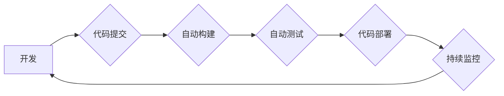

DevOps, 持续集成, 持续交付, 自动化, 监控, 协作, 敏捷开发

## 1. 背景介绍

在当今快速迭代的软件开发环境中，传统的开发和运维模式已经难以满足业务需求。DevOps 作为一种新的软件开发和运维理念，应运而生。它强调开发团队和运维团队之间的紧密协作，通过自动化、持续集成和持续交付等实践，实现快速、高效、可靠的软件交付。

DevOps 的核心目标是缩短软件交付周期，提高软件质量，并增强团队协作效率。它打破了传统开发和运维之间的壁垒，促进了软件开发流程的自动化和持续改进。

## 2. 核心概念与联系

DevOps 的核心概念包括：

* **持续集成 (Continuous Integration):** 开发人员频繁地将代码提交到共享代码库中，并自动构建和测试代码，确保代码质量和稳定性。
* **持续交付 (Continuous Delivery):** 将经过测试的代码自动部署到测试环境和生产环境，实现快速、可靠的软件交付。
* **自动化:** 通过自动化工具和脚本，实现代码构建、测试、部署等流程的自动化，提高效率和降低人为错误。
* **监控:** 实时监控软件运行状态，及时发现和解决问题，确保软件稳定运行。
* **协作:** 开发团队和运维团队之间紧密协作，共同负责软件的开发、测试、部署和维护。

**DevOps 流程图:**



## 3. 核心算法原理 & 具体操作步骤

DevOps 中涉及到许多算法和技术，例如版本控制算法、自动化测试算法、容器化技术等。

### 3.1  算法原理概述

* **版本控制算法:** Git 是一种常用的分布式版本控制系统，它使用算法来跟踪代码的修改历史，并允许开发人员回滚到之前的版本。
* **自动化测试算法:** 自动化测试算法可以根据测试用例自动执行测试，并生成测试报告。常见的自动化测试框架包括 Selenium、JUnit 和 pytest。
* **容器化技术:** 容器化技术将应用程序及其依赖项打包成一个独立的容器，可以方便地部署和运行在不同的环境中。Docker 和 Kubernetes 是常用的容器化技术。

### 3.2  算法步骤详解

* **版本控制:**
    1. 创建一个 Git 仓库。
    2. 将代码添加到仓库中。
    3. 提交代码更改。
    4. 推送代码到远程仓库。
* **自动化测试:**
    1. 编写测试用例。
    2. 使用自动化测试框架执行测试。
    3. 分析测试报告。
* **容器化:**
    1. 创建 Dockerfile。
    2. 构建 Docker 镜像。
    3. 部署 Docker 容器。

### 3.3  算法优缺点

* **版本控制:**
    * 优点: 跟踪代码历史、回滚版本、协作开发。
    * 缺点: 学习曲线较陡、需要配置服务器。
* **自动化测试:**
    * 优点: 提高测试效率、降低测试成本、提高测试覆盖率。
    * 缺点: 需要编写测试用例、维护测试用例。
* **容器化:**
    * 优点: 简化部署、提高资源利用率、提高应用程序可移植性。
    * 缺点: 需要学习 Docker 和 Kubernetes 等工具。

### 3.4  算法应用领域

* **版本控制:** 软件开发、网站维护、文档管理等。
* **自动化测试:** 软件测试、网站测试、移动应用测试等。
* **容器化:** 云计算、微服务架构、大数据平台等。

## 4. 数学模型和公式 & 详细讲解 & 举例说明

DevOps 中涉及到一些数学模型和公式，例如：

* **软件交付周期:**  $T = \frac{C}{R}$，其中 $T$ 是软件交付周期，$C$ 是代码变更量，$R$ 是代码变更处理速度。
* **软件缺陷率:** $D = \frac{N}{S}$，其中 $D$ 是软件缺陷率，$N$ 是软件缺陷数量，$S$ 是软件代码行数。

### 4.1  数学模型构建

DevOps 中的数学模型通常用于量化软件开发和运维过程中的关键指标，例如软件交付周期、软件缺陷率、系统可用性等。

### 4.2  公式推导过程

软件交付周期公式的推导过程如下：

1. 假设软件开发是一个线性过程，代码变更量 $C$ 是固定的。
2. 代码变更处理速度 $R$ 是一个常数。
3. 因此，软件交付周期 $T$ 等于代码变更量 $C$ 除以代码变更处理速度 $R$。

### 4.3  案例分析与讲解

假设一个软件项目需要开发 1000 行代码，代码变更处理速度为每小时 100 行。根据公式 $T = \frac{C}{R}$，软件交付周期为 10 小时。

## 5. 项目实践：代码实例和详细解释说明

以下是一个简单的 DevOps 项目实践示例，演示如何使用 Git、Docker 和 Kubernetes 实现持续集成和持续交付。

### 5.1  开发环境搭建

1. 安装 Git、Docker 和 Kubernetes。
2. 创建一个 Git 仓库。
3. 创建一个 Dockerfile。

### 5.2  源代码详细实现

```python
# app.py
from flask import Flask

app = Flask(__name__)

@app.route('/')
def hello_world():
    return 'Hello, World!'

if __name__ == '__main__':
    app.run(host='0.0.0.0', port=8080)
```

### 5.3  代码解读与分析

* `app.py` 是一个简单的 Flask 应用程序，它定义了一个 `/` 路由，返回 "Hello, World!" 字符串。
* `Dockerfile` 定义了应用程序的运行环境，包括操作系统、运行时环境和应用程序代码。

### 5.4  运行结果展示

1. 构建 Docker 镜像。
2. 部署 Docker 容器到 Kubernetes 集群。
3. 访问应用程序的 URL，查看 "Hello, World!" 字符串。

## 6. 实际应用场景

DevOps 的应用场景非常广泛，例如：

* **软件开发:** 提高软件开发效率、降低软件开发成本、提高软件质量。
* **网站运营:** 提高网站稳定性、降低网站故障率、提高网站可用性。
* **云计算:** 简化云资源管理、提高云资源利用率、降低云资源成本。

### 6.4  未来应用展望

DevOps 将在未来继续发展和演进，例如：

* **人工智能:** 将人工智能技术应用于 DevOps 流程，例如自动化的代码审查、测试和部署。
* **云原生:** 与云原生技术更加紧密地结合，例如使用 Kubernetes 进行容器化部署和管理。
* **安全:** 将安全纳入 DevOps 流程，例如自动化的安全测试和漏洞扫描。

## 7. 工具和资源推荐

### 7.1  学习资源推荐

* **书籍:**
    * The Phoenix Project
    * DevOps Handbook
    * Accelerate
* **网站:**
    * DevOps.com
    * The DevOps Institute
    * GitLab

### 7.2  开发工具推荐

* **版本控制:** Git
* **自动化测试:** Selenium, JUnit, pytest
* **容器化:** Docker, Kubernetes
* **持续集成和持续交付:** Jenkins, GitLab CI/CD, CircleCI

### 7.3  相关论文推荐

* The Phoenix Project: A Novel About IT, DevOps, and Helping Your Business Win
* Accelerate: The Science of Lean Software and DevOps: Building and Scaling High Performing Technology Organizations
* DevOps Handbook: How to Create World-Class Agility, Reliability, and Security in Technology Organizations

## 8. 总结：未来发展趋势与挑战

### 8.1  研究成果总结

DevOps 已经成为软件开发和运维领域的重要趋势，它帮助企业提高软件开发效率、降低软件开发成本、提高软件质量。

### 8.2  未来发展趋势

DevOps 将继续发展和演进，例如：

* **人工智能:** 将人工智能技术应用于 DevOps 流程，例如自动化的代码审查、测试和部署。
* **云原生:** 与云原生技术更加紧密地结合，例如使用 Kubernetes 进行容器化部署和管理。
* **安全:** 将安全纳入 DevOps 流程，例如自动化的安全测试和漏洞扫描。

### 8.3  面临的挑战

DevOps 的实施也面临一些挑战，例如：

* **文化转变:** DevOps 需要企业文化和组织结构的转变，需要打破开发和运维之间的壁垒。
* **技能缺口:** DevOps 需要具备多种技能的工程师，例如软件开发、运维、自动化和云计算。
* **工具集成:** DevOps 需要集成多种工具，需要确保工具之间能够互操作。

### 8.4  研究展望

未来，DevOps 研究将继续关注以下几个方面:

* **人工智能驱动的 DevOps:** 如何利用人工智能技术自动化 DevOps 流程，提高效率和降低成本。
* **云原生 DevOps:** 如何将 DevOps 与云原生技术更加紧密地结合，实现更灵活、更弹性的软件交付。
* **安全 DevOps:** 如何将安全纳入 DevOps 流程，确保软件的安全性。

## 9. 附录：常见问题与解答

* **什么是 DevOps?** DevOps 是一种软件开发和运维理念，强调开发团队和运维团队之间的紧密协作，通过自动化、持续集成和持续交付等实践，实现快速、高效、可靠的软件交付。
* **DevOps 的优势是什么?** DevOps 的优势包括提高软件开发效率、降低软件开发成本、提高软件质量、提高团队协作效率等。
* **如何实施 DevOps?** DevOps 的实施需要企业文化和组织结构的转变，需要选择合适的工具和技术，并进行持续改进。


作者：禅与计算机程序设计艺术 / Zen and the Art of Computer Programming 
<end_of_turn>