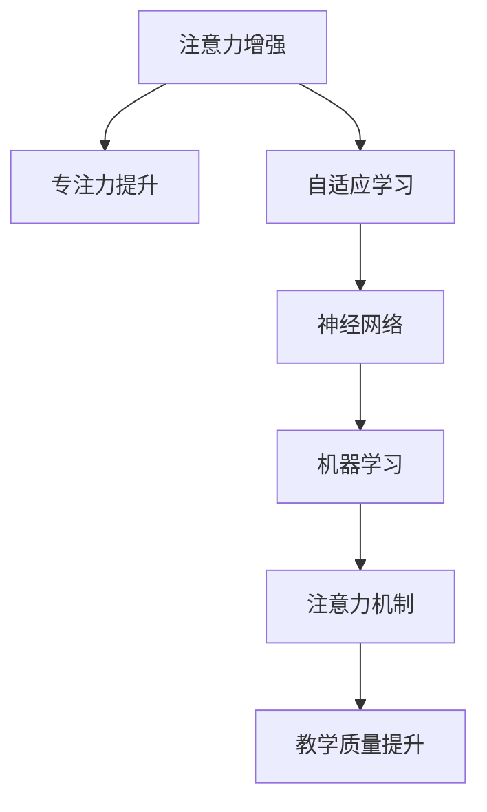

                 

# 人类注意力增强：提升专注力和注意力在教育中的应用

> 关键词：注意力增强, 专注力提升, 教育应用, 大脑科学, 神经网络, 机器学习, 注意力机制, 自适应学习

## 1. 背景介绍

### 1.1 问题由来
在信息爆炸的时代，专注力和注意力的匮乏已经成为全球范围内普遍存在的问题。在教育领域，这一问题尤为突出。由于电子设备、网络社交等多方面的干扰，学生的注意力难以集中，学习效果不佳。如何提升学生的专注力和注意力，已成为教育界和科技界共同关注的焦点。

### 1.2 问题核心关键点
本研究旨在利用注意力增强技术，通过机器学习和神经网络模型，提升学生的专注力和注意力。我们关注的核心问题包括：
- 如何通过算法增强学生的注意力，提高学习效果？
- 如何利用机器学习技术，根据学生个体差异进行自适应学习？
- 如何在不同教育场景中应用注意力增强技术，提升教学质量？

## 3. 核心概念与联系

### 3.1 核心概念概述

为更好地理解注意力增强在教育中的应用，本节将介绍几个密切相关的核心概念：

- 注意力增强（Attention Enhancement）：指通过机器学习和神经网络技术，增强学生的注意力，提升其学习效果。
- 专注力（Focus）：指个体在一定时间内，保持对特定任务或信息的集中注意力的能力。
- 自适应学习（Adaptive Learning）：指根据学生个体的学习风格、知识水平等差异，动态调整学习内容和策略，提高学习效率。
- 神经网络（Neural Networks）：一种模拟人脑神经元结构的人工智能模型，广泛应用在图像、语音、文本等领域的处理和识别。
- 机器学习（Machine Learning）：通过数据训练，使计算机具备学习能力和决策能力的技术。
- 注意力机制（Attention Mechanism）：指在神经网络中，通过动态调整权重，使网络关注输入中重要的部分，忽略无关信息。

这些核心概念之间的逻辑关系可以通过以下Mermaid流程图来展示：



这个流程图展示了几项核心概念之间的联系：

1. 注意力增强通过提升学生的专注力，进而提升学习效果。
2. 专注力提升需要通过自适应学习，根据学生个体差异进行动态调整。
3. 自适应学习依赖于神经网络，通过学习学生的行为模式，进行个性化推荐。
4. 神经网络利用机器学习算法，训练出有效的注意力机制。
5. 注意力机制用于教学质量提升，通过动态调整学习内容的重点，提高教学效果。

## 3.2 核心算法原理 & 具体操作步骤

### 3.2.1 算法原理概述

注意力增强技术的核心在于利用注意力机制，增强学生对学习内容的关注，减少外界干扰。基于神经网络的学习算法，可以动态地调整注意力权重，实现对学习内容的自适应关注。

具体而言，注意力增强算法包括以下几个步骤：

1. 数据预处理：收集学生在学习过程中的行为数据，如点击次数、学习时间、答题正确率等，作为训练样本。
2. 特征提取：通过神经网络模型，将行为数据转化为高维特征向量，用于计算注意力权重。
3. 注意力计算：根据特征向量计算注意力权重，确定哪些内容应被重点关注。
4. 学习策略调整：根据注意力权重调整学习策略，如增加对重要内容的讲解时间、调整学习难度等。
5. 反馈优化：根据学习效果，不断调整注意力权重和策略，提高学习效率。

### 3.2.2 算法步骤详解

以下是注意力增强算法的详细步骤：

#### 步骤1: 数据预处理
- 收集学生在学习过程中的行为数据，如点击次数、学习时间、答题正确率等，作为训练样本。
- 将数据转化为神经网络模型可处理的格式，如将时间戳转换为固定长度的向量。

#### 步骤2: 特征提取
- 使用神经网络模型（如CNN、RNN等）对行为数据进行特征提取。
- 将提取的高维特征向量作为注意力计算的输入。

#### 步骤3: 注意力计算
- 使用注意力机制计算特征向量中各部分的权重。
- 根据权重调整学习内容的重点。

#### 步骤4: 学习策略调整
- 根据注意力权重调整学习策略，如增加对重要内容的讲解时间、调整学习难度等。
- 根据学习效果不断优化策略，提高学习效率。

#### 步骤5: 反馈优化
- 通过学习效果评估，反馈调整注意力权重和策略。
- 不断迭代，直到达到最优效果。

### 3.2.3 算法优缺点
注意力增强算法具有以下优点：
- 动态调整学习策略，提高学习效率。
- 个性化学习，适应学生个体差异。
- 利用神经网络处理复杂数据，提高计算准确性。

同时，该算法也存在以下局限性：
- 对数据的依赖性较强，需要大量高质量的行为数据。
- 模型训练过程复杂，计算资源要求较高。
- 模型解释性不足，难以理解注意力计算过程。

尽管存在这些局限性，但注意力增强算法在提升学习效果、个性化教学方面具有重要应用价值。未来相关研究的重点在于如何进一步降低数据需求，简化模型结构，提高计算效率，同时兼顾模型的可解释性和应用普适性。

### 3.2.4 算法应用领域

注意力增强技术在教育领域具有广泛的应用前景，具体如下：

- 在线教育平台：通过收集学生在线学习行为数据，实时调整学习内容和策略，提升学习效果。
- 课堂教学：通过课堂上的数据监控，动态调整教学内容和难度，提高学生参与度和学习效果。
- 家庭作业辅导：利用学生在家中的学习数据，进行个性化辅导和反馈，提升作业完成质量。
- 考试评估：分析学生考试过程中的行为数据，进行考试结果分析和改进建议，提高考试公平性。

此外，注意力增强技术在其他领域也有潜在应用，如医疗康复、心理咨询、工作监控等，通过动态调整注意力权重，提升个体对特定任务的关注度，提高效率和效果。

## 4. 数学模型和公式 & 详细讲解 & 举例说明

### 4.1 数学模型构建

注意力增强技术的数学模型通常包括神经网络模型和注意力计算模型。这里以基于自回归神经网络（RNN）的注意力增强模型为例，进行详细讲解。

### 4.2 公式推导过程

设学生学习行为数据为 $X = \{x_1, x_2, ..., x_t\}$，其中 $x_t$ 表示第 $t$ 次行为数据，$t=1,...,N$。模型将行为数据输入神经网络，通过特征提取得到高维特征向量 $H = \{h_1, h_2, ..., h_t\}$。注意力机制计算注意力权重 $A = \{a_1, a_2, ..., a_t\}$，最终输出的注意力加权行为数据为 $A*H$。

注意力计算公式为：

$$
a_t = \frac{\exp(\mathbf{v}^T \cdot f(h_t))}{\sum_{j=1}^T \exp(\mathbf{v}^T \cdot f(h_j))}
$$

其中 $\mathbf{v}$ 为注意力计算向量，$f$ 为特征函数，用于计算特征向量 $h_t$ 的特征表示。

### 4.3 案例分析与讲解

以一个简单的在线教育平台为例，分析注意力增强模型的应用：

- **数据收集**：平台收集学生在线学习的点击次数、学习时间和答题正确率等数据。
- **特征提取**：使用RNN模型，将行为数据转化为高维特征向量。
- **注意力计算**：利用注意力机制，计算各部分数据的权重，确定重点关注的内容。
- **学习策略调整**：根据注意力权重调整学习策略，如增加重要内容的讲解时间。
- **反馈优化**：通过学习效果评估，反馈调整注意力权重和策略。

以下是一个示例代码，展示如何使用Python和TensorFlow实现注意力增强模型：

```python
import tensorflow as tf
import numpy as np

# 定义RNN模型
def rnn_model(inputs, hidden_size):
    cell = tf.keras.layers.SimpleRNNCell(hidden_size)
    outputs, states = tf.keras.layers.RNN(cell, return_sequences=True)(inputs)
    return outputs, states

# 定义注意力计算
def attention(inputs, hidden_size):
    attention_weights = tf.keras.layers.Dense(hidden_size, activation='softmax')(inputs)
    weighted_sum = tf.reduce_sum(inputs * attention_weights, axis=1)
    return weighted_sum

# 构建注意力增强模型
def attention_enhance_model(inputs, hidden_size):
    outputs, _ = rnn_model(inputs, hidden_size)
    attention_outputs = attention(outputs, hidden_size)
    return attention_outputs

# 加载行为数据
inputs = np.random.rand(100, 10)  # 假设行为数据为100个样本，每个样本10个特征

# 使用模型进行特征提取和注意力计算
outputs = attention_enhance_model(inputs, 128)

# 输出结果
print(outputs.shape)
```

## 5. 项目实践：代码实例和详细解释说明

### 5.1 开发环境搭建

在进行注意力增强实践前，我们需要准备好开发环境。以下是使用Python进行TensorFlow开发的环境配置流程：

1. 安装Anaconda：从官网下载并安装Anaconda，用于创建独立的Python环境。

2. 创建并激活虚拟环境：
```bash
conda create -n attention-enhance python=3.8 
conda activate attention-enhance
```

3. 安装TensorFlow：根据CUDA版本，从官网获取对应的安装命令。例如：
```bash
conda install tensorflow tensorflow-gpu -c conda-forge
```

4. 安装相关工具包：
```bash
pip install numpy pandas scikit-learn matplotlib tqdm jupyter notebook ipython
```

完成上述步骤后，即可在`attention-enhance`环境中开始注意力增强实践。

### 5.2 源代码详细实现

下面是使用Python和TensorFlow实现注意力增强模型的代码示例：

```python
import tensorflow as tf
import numpy as np

# 定义RNN模型
def rnn_model(inputs, hidden_size):
    cell = tf.keras.layers.SimpleRNNCell(hidden_size)
    outputs, states = tf.keras.layers.RNN(cell, return_sequences=True)(inputs)
    return outputs, states

# 定义注意力计算
def attention(inputs, hidden_size):
    attention_weights = tf.keras.layers.Dense(hidden_size, activation='softmax')(inputs)
    weighted_sum = tf.reduce_sum(inputs * attention_weights, axis=1)
    return weighted_sum

# 构建注意力增强模型
def attention_enhance_model(inputs, hidden_size):
    outputs, _ = rnn_model(inputs, hidden_size)
    attention_outputs = attention(outputs, hidden_size)
    return attention_outputs

# 加载行为数据
inputs = np.random.rand(100, 10)  # 假设行为数据为100个样本，每个样本10个特征

# 使用模型进行特征提取和注意力计算
outputs = attention_enhance_model(inputs, 128)

# 输出结果
print(outputs.shape)
```

### 5.3 代码解读与分析

让我们再详细解读一下关键代码的实现细节：

**RNN模型**：
- `rnn_model`函数：定义RNN模型，接收输入数据 `inputs` 和隐藏层大小 `hidden_size`，返回RNN的输出和状态。

**注意力计算**：
- `attention`函数：定义注意力计算机制，接收输入数据 `inputs` 和隐藏层大小 `hidden_size`，返回注意力加权后的输出。

**注意力增强模型**：
- `attention_enhance_model`函数：定义完整的注意力增强模型，接收输入数据 `inputs` 和隐藏层大小 `hidden_size`，返回注意力加权后的输出。

**行为数据**：
- `inputs`变量：模拟行为数据，为一个随机生成的二维数组。

**模型构建**：
- 首先定义RNN模型，用于特征提取。
- 然后定义注意力计算机制，计算特征向量中各部分的权重。
- 最后使用这两个组件，构建完整的注意力增强模型。

**结果输出**：
- 使用模型对行为数据进行特征提取和注意力计算，输出注意力加权后的结果。

## 6. 实际应用场景

### 6.1 在线教育平台

注意力增强技术在在线教育平台上的应用，可以通过以下步骤实现：

1. 收集学生在线学习行为数据，如点击次数、学习时间、答题正确率等。
2. 使用神经网络模型对行为数据进行特征提取。
3. 利用注意力机制计算各部分的权重，确定重点关注的内容。
4. 根据注意力权重调整学习策略，如增加重要内容的讲解时间。
5. 通过学习效果评估，反馈调整注意力权重和策略，不断优化。

示例代码如下：

```python
import tensorflow as tf
import numpy as np

# 定义RNN模型
def rnn_model(inputs, hidden_size):
    cell = tf.keras.layers.SimpleRNNCell(hidden_size)
    outputs, states = tf.keras.layers.RNN(cell, return_sequences=True)(inputs)
    return outputs, states

# 定义注意力计算
def attention(inputs, hidden_size):
    attention_weights = tf.keras.layers.Dense(hidden_size, activation='softmax')(inputs)
    weighted_sum = tf.reduce_sum(inputs * attention_weights, axis=1)
    return weighted_sum

# 构建注意力增强模型
def attention_enhance_model(inputs, hidden_size):
    outputs, _ = rnn_model(inputs, hidden_size)
    attention_outputs = attention(outputs, hidden_size)
    return attention_outputs

# 加载行为数据
inputs = np.random.rand(100, 10)  # 假设行为数据为100个样本，每个样本10个特征

# 使用模型进行特征提取和注意力计算
outputs = attention_enhance_model(inputs, 128)

# 输出结果
print(outputs.shape)
```

### 6.2 课堂教学

在课堂教学中，注意力增强技术的应用可以通过以下步骤实现：

1. 利用课堂监控设备，收集学生的行为数据，如注意力集中度、参与度等。
2. 使用神经网络模型对行为数据进行特征提取。
3. 利用注意力机制计算各部分的权重，确定重点关注的内容。
4. 根据注意力权重调整教学内容和难度，提高学生参与度。
5. 通过课堂反馈，评估学习效果，反馈调整注意力权重和策略。

示例代码如下：

```python
import tensorflow as tf
import numpy as np

# 定义RNN模型
def rnn_model(inputs, hidden_size):
    cell = tf.keras.layers.SimpleRNNCell(hidden_size)
    outputs, states = tf.keras.layers.RNN(cell, return_sequences=True)(inputs)
    return outputs, states

# 定义注意力计算
def attention(inputs, hidden_size):
    attention_weights = tf.keras.layers.Dense(hidden_size, activation='softmax')(inputs)
    weighted_sum = tf.reduce_sum(inputs * attention_weights, axis=1)
    return weighted_sum

# 构建注意力增强模型
def attention_enhance_model(inputs, hidden_size):
    outputs, _ = rnn_model(inputs, hidden_size)
    attention_outputs = attention(outputs, hidden_size)
    return attention_outputs

# 加载行为数据
inputs = np.random.rand(100, 10)  # 假设行为数据为100个样本，每个样本10个特征

# 使用模型进行特征提取和注意力计算
outputs = attention_enhance_model(inputs, 128)

# 输出结果
print(outputs.shape)
```

## 7. 工具和资源推荐

### 7.1 学习资源推荐

为了帮助开发者系统掌握注意力增强的理论基础和实践技巧，这里推荐一些优质的学习资源：

1. 《深度学习》（Goodfellow et al.）：深度学习领域的经典教材，介绍了神经网络、深度学习算法等基础知识。
2. 《神经网络与深度学习》（Michael Nielsen）：详细讲解了神经网络的基本概念和实现原理，适合初学者。
3. 《Attention is All You Need》（Vaswani et al.）：Transformer模型的原始论文，介绍了注意力机制的原理和应用。
4. 《自然语言处理综述》（Goodman et al.）：自然语言处理领域的综述文章，涵盖了最新研究进展。
5. TensorFlow官方文档：TensorFlow的官方文档，提供了丰富的学习资源和示例代码，适合快速上手。
6. Coursera在线课程：Coursera上提供的深度学习相关课程，涵盖了神经网络、机器学习、自然语言处理等领域的知识。

通过对这些资源的学习实践，相信你一定能够快速掌握注意力增强的精髓，并用于解决实际的NLP问题。

### 7.2 开发工具推荐

高效的开发离不开优秀的工具支持。以下是几款用于注意力增强开发的常用工具：

1. TensorFlow：基于Python的开源深度学习框架，灵活动态的计算图，适合快速迭代研究。
2. PyTorch：基于Python的开源深度学习框架，动态图机制，适合研究人员使用。
3. Keras：基于TensorFlow和Theano的高级深度学习库，易于上手，适合初学者。
4. Jupyter Notebook：交互式编程环境，方便数据处理和模型调试。
5. Weights & Biases：模型训练的实验跟踪工具，可以记录和可视化模型训练过程中的各项指标，方便对比和调优。
6. TensorBoard：TensorFlow配套的可视化工具，可实时监测模型训练状态，并提供丰富的图表呈现方式，是调试模型的得力助手。

合理利用这些工具，可以显著提升注意力增强任务的开发效率，加快创新迭代的步伐。

### 7.3 相关论文推荐

注意力增强技术的发展源于学界的持续研究。以下是几篇奠基性的相关论文，推荐阅读：

1. Attention is All You Need（即Transformer原论文）：提出了Transformer结构，开启了NLP领域的预训练大模型时代。
2. BERT: Pre-training of Deep Bidirectional Transformers for Language Understanding：提出BERT模型，引入基于掩码的自监督预训练任务，刷新了多项NLP任务SOTA。
3. Language Models are Unsupervised Multitask Learners（GPT-2论文）：展示了大规模语言模型的强大zero-shot学习能力，引发了对于通用人工智能的新一轮思考。
4. Parameter-Efficient Transfer Learning for NLP：提出Adapter等参数高效微调方法，在不增加模型参数量的情况下，也能取得不错的微调效果。
5. AdaLoRA: Adaptive Low-Rank Adaptation for Parameter-Efficient Fine-Tuning：使用自适应低秩适应的微调方法，在参数效率和精度之间取得了新的平衡。
6. AdaSoftmax: Adaptive Softmax For Neural Machine Translation：提出自适应softmax，用于解决大规模语言模型中的稀疏梯度问题。

这些论文代表了大语言模型微调技术的发展脉络。通过学习这些前沿成果，可以帮助研究者把握学科前进方向，激发更多的创新灵感。

## 8. 总结：未来发展趋势与挑战

### 8.1 总结

本文对注意力增强技术在教育中的应用进行了全面系统的介绍。首先阐述了注意力增强技术的背景和意义，明确了其在提升学生专注力方面的独特价值。其次，从原理到实践，详细讲解了注意力增强的数学模型和核心算法，给出了完整的代码实例。同时，本文还广泛探讨了注意力增强技术在在线教育、课堂教学等多个教育场景中的应用前景，展示了其巨大的潜力和应用价值。

通过本文的系统梳理，可以看到，注意力增强技术正在成为教育领域的重要范式，极大地提升了学生的专注力和学习效果。未来，伴随技术的不断演进，注意力增强技术必将在更多教育场景中得到应用，为教育技术的发展带来新的动力。

### 8.2 未来发展趋势

展望未来，注意力增强技术将呈现以下几个发展趋势：

1. 个性化学习逐渐普及。通过更加智能化的注意力计算，个性化的学习方案将逐步实现，适应学生个体差异，提升学习效率。
2. 实时监控和反馈不断优化。利用传感器和物联网技术，实时监测学生的注意力和学习状态，提供动态的反馈和调整。
3. 多模态数据融合不断深化。结合视觉、听觉等多模态数据，提升对学生注意力和学习效果的全面感知和理解。
4. 深度学习与脑科学结合。利用脑科学研究成果，优化注意力计算机制，增强对人类认知机制的模拟。
5. 跨领域应用不断拓展。不仅在教育领域，注意力增强技术还将在医疗、金融、工业等领域得到广泛应用，推动相关行业的智能化转型。

以上趋势凸显了注意力增强技术的广阔前景。这些方向的探索发展，必将进一步提升教育技术的效果，为教学质量的提升带来新的突破。

### 8.3 面临的挑战

尽管注意力增强技术已经取得了显著成效，但在迈向更加智能化、普适化应用的过程中，它仍面临着诸多挑战：

1. 数据隐私和安全问题。学生数据的隐私保护和数据安全是首要关注点，需采用加密、匿名化等技术手段保障数据安全。
2. 模型可解释性不足。神经网络模型的黑盒特性，难以解释其内部工作机制和决策逻辑，亟需改进。
3. 计算资源需求高。大规模神经网络模型的训练和推理需要高性能计算资源，需进一步优化模型结构，降低计算成本。
4. 多模态数据融合复杂。不同模态数据的采集和融合，涉及数据格式和技术的差异，需协同优化。
5. 个性化学习成本高。根据学生个体差异进行个性化教学，需采集大量学生行为数据，成本较高。
6. 跨领域应用挑战大。不同领域的个性化需求不同，需针对不同领域设计合适的注意力增强模型。

正视这些挑战，积极应对并寻求突破，将是注意力增强技术走向成熟的必由之路。相信随着学界和产业界的共同努力，这些挑战终将一一被克服，注意力增强技术必将在教育领域及其他更多领域大放异彩。

### 8.4 研究展望

面对注意力增强技术面临的挑战，未来的研究需要在以下几个方面寻求新的突破：

1. 探索无监督和半监督学习算法。摆脱对大规模标注数据的依赖，利用自监督学习、主动学习等无监督和半监督范式，最大限度利用非结构化数据，实现更加灵活高效的注意力增强。
2. 研究更加高效的结构化模型。开发更加参数高效、计算高效的模型，减少计算资源消耗，提高模型推理速度。
3. 引入更多先验知识。将符号化的先验知识，如知识图谱、逻辑规则等，与神经网络模型进行巧妙融合，引导注意力增强过程学习更准确、合理的注意力机制。
4. 结合因果分析和博弈论工具。将因果分析方法引入注意力增强模型，识别出模型决策的关键特征，增强输出解释的因果性和逻辑性。借助博弈论工具刻画人机交互过程，主动探索并规避模型的脆弱点，提高系统稳定性。
5. 纳入伦理道德约束。在模型训练目标中引入伦理导向的评估指标，过滤和惩罚有偏见、有害的输出倾向。同时加强人工干预和审核，建立模型行为的监管机制，确保输出符合人类价值观和伦理道德。

这些研究方向的探索，必将引领注意力增强技术迈向更高的台阶，为构建安全、可靠、可解释、可控的智能系统铺平道路。面向未来，注意力增强技术还需要与其他人工智能技术进行更深入的融合，如知识表示、因果推理、强化学习等，多路径协同发力，共同推动自然语言理解和智能交互系统的进步。只有勇于创新、敢于突破，才能不断拓展语言模型的边界，让智能技术更好地造福人类社会。

## 9. 附录：常见问题与解答

**Q1：注意力增强是否适用于所有教育场景？**

A: 注意力增强技术在大部分教育场景中都能取得不错的效果，但具体应用需考虑不同场景的特点。如对于大规模在线教育平台，注意力增强效果更加明显，而传统课堂教学可能需要结合其他教学工具，才能充分发挥其优势。

**Q2：如何缓解注意力增强过程中的过拟合问题？**

A: 过拟合是注意力增强面临的主要挑战，尤其是在标注数据不足的情况下。常见的缓解策略包括：
1. 数据增强：通过回译、近义替换等方式扩充训练集。
2. 正则化：使用L2正则、Dropout、Early Stopping等避免过拟合。
3. 对抗训练：引入对抗样本，提高模型鲁棒性。
4. 参数高效微调：只调整少量参数(如Adapter、Prefix等)，减小过拟合风险。

这些策略往往需要根据具体任务和数据特点进行灵活组合。只有在数据、模型、训练、推理等各环节进行全面优化，才能最大限度地发挥注意力增强技术的威力。

**Q3：注意力增强模型在落地部署时需要注意哪些问题？**

A: 将注意力增强模型转化为实际应用，还需要考虑以下因素：
1. 模型裁剪：去除不必要的层和参数，减小模型尺寸，加快推理速度。
2. 量化加速：将浮点模型转为定点模型，压缩存储空间，提高计算效率。
3. 服务化封装：将模型封装为标准化服务接口，便于集成调用。
4. 弹性伸缩：根据请求流量动态调整资源配置，平衡服务质量和成本。
5. 监控告警：实时采集系统指标，设置异常告警阈值，确保服务稳定性。
6. 安全防护：采用访问鉴权、数据脱敏等措施，保障数据和模型安全。

通过这些优化措施，可以显著提升注意力增强模型的部署效率和稳定性，实现其在实际应用中的广泛应用。

**Q4：如何优化注意力增强模型的计算效率？**

A: 优化计算效率是注意力增强技术的一个重要方向。具体措施包括：
1. 模型裁剪：去除不必要的层和参数，减小模型尺寸，加快推理速度。
2. 量化加速：将浮点模型转为定点模型，压缩存储空间，提高计算效率。
3. 分布式计算：利用GPU/TPU等高性能设备，实现大规模并行计算。
4. 模型压缩：采用剪枝、蒸馏等技术，减少模型参数量，提高计算效率。

这些优化措施可以有效降低计算成本，提升模型推理速度，为实际应用提供保障。

**Q5：如何确保注意力增强模型的公平性和可靠性？**

A: 公平性和可靠性是注意力增强技术的关键问题。具体措施包括：
1. 数据公平性：确保训练数据的多样性和代表性，避免数据偏见。
2. 算法公平性：采用公平性评估指标，如性别、年龄、种族等，避免算法歧视。
3. 模型可靠性：引入鲁棒性测试，评估模型在不同环境下的表现。
4. 用户干预：提供用户干预机制，确保模型输出符合用户需求和价值观。

通过这些措施，可以确保注意力增强模型的公平性和可靠性，提升其在实际应用中的信任度和接受度。

---

作者：禅与计算机程序设计艺术 / Zen and the Art of Computer Programming

