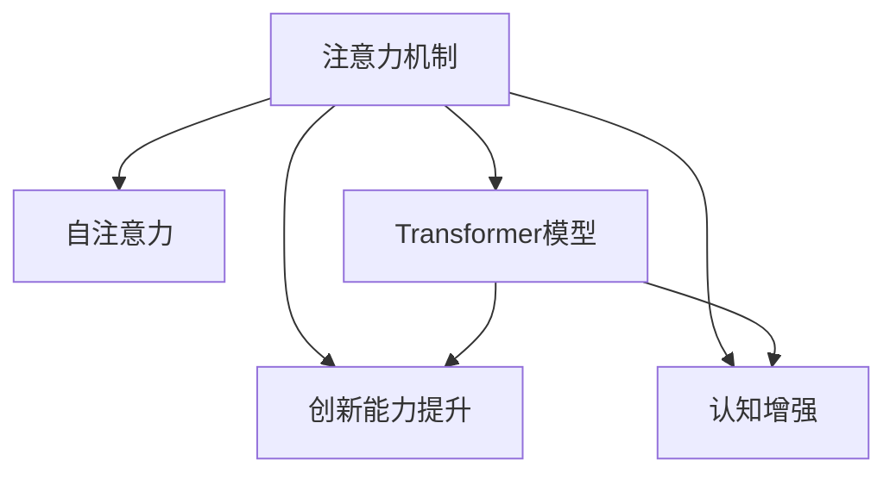

                 

# 人类注意力增强：提升创新能力和创造力技术

> 关键词：注意力机制,创新能力提升,认知增强,创造力,计算模型

## 1. 背景介绍

### 1.1 问题由来
在信息化高速发展的今天，无论是科研、教育还是商业领域，人们都面临着信息过载的困境。传统信息获取方式已经无法满足人们日益增长的需求，而人类有限的注意力资源在大量信息的海洋中变得愈发珍贵。如何在有限的时间内，从海量信息中提取精华，提升信息理解和创造能力，成为人们面临的重大挑战。

为此，我们亟需一套可以增强人类注意力的技术方案，通过计算模型和认知科学结合的方式，提升个体的创新能力和创造力，从而在激烈的竞争中占据优势。近年来，随着深度学习技术的突破和神经科学的快速发展，一种新的计算模型—注意力机制(Attention Mechanism)—开始崭露头角。

### 1.2 问题核心关键点
注意力机制是一种用于处理序列数据的计算模型，通过动态调整信息的权重，使得模型能够集中关注关键信息，忽略无关细节。该机制在自然语言处理、计算机视觉等诸多领域取得了显著效果。目前，注意力机制已经成为提升信息处理能力的重要手段，被广泛应用于文本摘要、机器翻译、问答系统、图像分类等任务。

具体而言，注意力机制能够：
- 提高序列数据处理的效率和准确性。
- 增强模型对长距离依赖的建模能力。
- 提升模型对变长输入序列的适应性。
- 强化模型对重要信息的聚焦和选择。

通过注意力机制的引入，模型的信息处理能力和创新能力显著提升，成为了当前AI技术发展的重要方向。

### 1.3 问题研究意义
研究注意力机制在增强人类创新能力和创造力方面的应用，具有以下重要意义：

1. **提升信息处理效率**：通过注意力机制，能够更加高效地从海量信息中提取关键内容，提升信息处理的效率和质量。
2. **增强决策能力**：注意力机制使得模型能够更专注于关键决策因素，减少干扰因素的影响，从而提升决策的准确性。
3. **促进创新创造**：通过注意力机制，可以引导模型更加关注创新点，激发新的创意和想法。
4. **推动教育科技进步**：注意力机制在教育领域的应用，有助于提升学生的学习和理解能力，促进教育的个性化和智能化。
5. **支撑商业创新**：注意力机制在商业智能、推荐系统等领域的实践，能够显著提升业务运营的效率和效果。

因此，研究注意力机制在提升创新能力和创造力方面的应用，具有重要的理论和实际意义。

## 2. 核心概念与联系

### 2.1 核心概念概述

为了更好地理解注意力机制在增强人类创新能力中的应用，本节将介绍几个密切相关的核心概念：

- **注意力机制(Attention Mechanism)**：一种用于处理序列数据的计算模型，通过动态调整信息的权重，使得模型能够集中关注关键信息，忽略无关细节。
- **自注意力(Self-Attention)**：一种特殊的注意力机制，用于模型内部各个特征之间的相互关联。
- **Transformer模型**：一种基于自注意力机制的神经网络模型，广泛应用于自然语言处理、计算机视觉等领域。
- **创新能力提升**：指通过注意力机制等技术手段，提升个体在问题解决、设计构思等方面的创造力。
- **认知增强**：指通过注意力机制等计算模型，增强人类的信息处理和认知功能，提升学习、工作和生活的质量。

这些核心概念之间的逻辑关系可以通过以下Mermaid流程图来展示：



这个流程图展示出注意力机制的核心概念及其之间的关系：

1. 注意力机制通过自注意力等计算模型，增强信息处理的效率和准确性。
2. 应用于Transformer等神经网络模型，使得模型具备更强的信息建模能力。
3. 通过注意力机制，可以提升个体的创新能力和认知功能。

## 3. 核心算法原理 & 具体操作步骤
### 3.1 算法原理概述

注意力机制的原理主要基于自注意力机制(Self-Attention)，其核心思想是通过动态调整各个特征的权重，使得模型能够更加关注重要的信息，忽略无关的细节。在计算上，自注意力机制通过计算输入序列中每个特征与其他特征的相似度，得到每个特征的注意力权重，最终加权求和生成新的特征表示。

形式化地，假设输入序列为 $x_1,...,x_T$，其中 $x_t \in \mathbb{R}^d$。自注意力机制的计算过程包括：

1. 计算输入序列中每个特征与其他特征的相似度：
   $$
   \alpha_{ij} = \frac{e^{u(x_i, x_j)}}{\sum_{k=1}^T e^{u(x_i, x_k)}}
   $$
   其中 $u$ 为注意力得分函数。

2. 计算每个特征的注意力权重：
   $$
   \beta_i = \sum_{j=1}^T \alpha_{ij}
   $$

3. 通过注意力权重加权求和生成新的特征表示：
   $$
   x_i' = \sum_{j=1}^T \alpha_{ij} x_j
   $$

这样，模型便能够通过动态调整特征权重的方式，更加关注关键信息，提升信息处理的效率和准确性。

### 3.2 算法步骤详解

注意力机制的具体应用步骤如下：

**Step 1: 数据预处理**
- 将输入序列中的每个特征向量 $x_t$ 进行标准化，使其具有可比较性。
- 计算特征向量之间的注意力得分，得到注意力权重矩阵 $\alpha$。

**Step 2: 计算注意力权重**
- 对注意力得分矩阵进行归一化处理，得到每个特征的注意力权重 $\beta$。
- 将注意力权重应用于输入序列，计算加权和向量 $x_i'$。

**Step 3: 注意力机制的应用**
- 将加权和向量 $x_i'$ 输入到后续的神经网络中进行处理，生成新的特征表示。
- 在多层神经网络中，注意力机制可以多次应用，以逐步提取更高级别的特征表示。

### 3.3 算法优缺点

注意力机制在提升信息处理能力方面具有以下优点：
1. 提升序列数据处理的效率和准确性。通过动态调整特征权重，能够更加关注关键信息，忽略无关细节。
2. 增强模型对长距离依赖的建模能力。注意力机制能够捕捉输入序列中的长距离依赖关系，提升模型的建模能力。
3. 提升模型对变长输入序列的适应性。注意力机制能够处理任意长度的输入序列，增强模型的通用性。

同时，该机制也存在一些局限性：
1. 计算复杂度高。注意力机制的计算复杂度较高，尤其是在处理长序列时，计算开销较大。
2. 过度依赖训练数据。注意力机制的效果很大程度上依赖于输入数据的质量和数量，训练数据的缺失可能导致效果不佳。
3. 对输入数据的要求高。注意力机制对输入数据的分布和特征变化敏感，输入数据的异常可能导致注意力机制失效。
4. 对模型的稳定性要求高。注意力机制的引入可能导致模型的稳定性降低，需要进行适当的正则化处理。

### 3.4 算法应用领域

注意力机制在提升人类创新能力和创造力方面具有广泛的应用前景。以下是几个典型的应用场景：

**1. 创新型设计**
- 在建筑设计、产品设计等领域，注意力机制可以帮助设计师快速捕捉关键要素，减少设计过程中的冗余工作，提升设计的创新性和实用性。

**2. 问题解决**
- 在科学研究、技术开发等领域，注意力机制可以引导模型关注问题的关键点，生成更有针对性的解决方案。

**3. 艺术创作**
- 在绘画、音乐、文学创作等领域，注意力机制可以辅助创作者更好地理解艺术作品的内涵，激发新的创作灵感。

**4. 教学与培训**
- 在教育培训领域，注意力机制可以帮助学生和培训者更有效地获取和理解知识，提升学习和培训的效果。

**5. 商业决策**
- 在商业智能、推荐系统等领域，注意力机制可以提升决策的精准性和合理性，减少决策中的误判和损失。

## 4. 数学模型和公式 & 详细讲解  
### 4.1 数学模型构建

注意力机制的数学模型主要基于自注意力机制(Self-Attention)。假设输入序列为 $x_1,...,x_T$，其中 $x_t \in \mathbb{R}^d$。自注意力机制的计算过程包括：

1. 计算输入序列中每个特征与其他特征的相似度：
   $$
   \alpha_{ij} = \frac{e^{u(x_i, x_j)}}{\sum_{k=1}^T e^{u(x_i, x_k)}}
   $$
   其中 $u$ 为注意力得分函数。

2. 计算每个特征的注意力权重：
   $$
   \beta_i = \sum_{j=1}^T \alpha_{ij}
   $$

3. 通过注意力权重加权求和生成新的特征表示：
   $$
   x_i' = \sum_{j=1}^T \alpha_{ij} x_j
   $$

### 4.2 公式推导过程

下面以自然语言处理中的Transformer模型为例，进一步推导注意力机制的计算过程。

Transformer模型中的自注意力机制分为点积注意力(Point-Wise Attention)和多头注意力(Multi-Head Attention)两种形式。

**点积注意力**
$$
\alpha_{ij} = \frac{e^{u(x_i, x_j)}}{\sum_{k=1}^T e^{u(x_i, x_k)}}
$$
其中 $u(x_i, x_j) = \mathbf{W}_Q^T x_i x_j$，$\mathbf{W}_Q$ 为查询向量投影矩阵，$\mathbf{W}_K$ 和 $\mathbf{W}_V$ 分别为键向量投影矩阵和值向量投影矩阵。

**多头注意力**
$$
\alpha_{ij} = \frac{e^{u(x_i, x_j)}}{\sum_{k=1}^T e^{u(x_i, x_k)}}
$$
其中 $u(x_i, x_j) = \mathbf{W}_Q^T x_i x_j$，$\mathbf{W}_Q$ 为查询向量投影矩阵，$\mathbf{W}_K$ 和 $\mathbf{W}_V$ 分别为键向量投影矩阵和值向量投影矩阵。

### 4.3 案例分析与讲解

以BERT模型为例，解释注意力机制的应用过程。

**Step 1: 数据预处理**
- 将输入序列中的每个特征向量 $x_t$ 进行标准化，使其具有可比较性。
- 计算特征向量之间的注意力得分，得到注意力权重矩阵 $\alpha$。

**Step 2: 计算注意力权重**
- 对注意力得分矩阵进行归一化处理，得到每个特征的注意力权重 $\beta$。
- 将注意力权重应用于输入序列，计算加权和向量 $x_i'$。

**Step 3: 注意力机制的应用**
- 将加权和向量 $x_i'$ 输入到后续的神经网络中进行处理，生成新的特征表示。
- 在多层神经网络中，注意力机制可以多次应用，以逐步提取更高级别的特征表示。

通过以上步骤，模型可以动态调整特征权重，更加关注关键信息，提升信息处理的效率和准确性。

## 5. 项目实践：代码实例和详细解释说明
### 5.1 开发环境搭建

在进行注意力机制的实践前，我们需要准备好开发环境。以下是使用Python进行PyTorch开发的环境配置流程：

1. 安装Anaconda：从官网下载并安装Anaconda，用于创建独立的Python环境。

2. 创建并激活虚拟环境：
```bash
conda create -n attention-env python=3.8 
conda activate attention-env
```

3. 安装PyTorch：根据CUDA版本，从官网获取对应的安装命令。例如：
```bash
conda install pytorch torchvision torchaudio cudatoolkit=11.1 -c pytorch -c conda-forge
```

4. 安装Transformers库：
```bash
pip install transformers
```

5. 安装各类工具包：
```bash
pip install numpy pandas scikit-learn matplotlib tqdm jupyter notebook ipython
```

完成上述步骤后，即可在`attention-env`环境中开始注意力机制的实践。

### 5.2 源代码详细实现

下面以自然语言处理中的BERT模型为例，给出使用Transformers库对BERT模型进行注意力机制计算的PyTorch代码实现。

```python
from transformers import BertForSequenceClassification, BertTokenizer
import torch

tokenizer = BertTokenizer.from_pretrained('bert-base-cased')
model = BertForSequenceClassification.from_pretrained('bert-base-cased', num_labels=2)

inputs = tokenizer("Hello, my dog is cute", return_tensors="pt")
labels = torch.tensor([1]).unsqueeze(0)

outputs = model(**inputs, labels=labels)
loss = outputs.loss
logits = outputs.logits
```

以上代码展示了如何通过Transformers库，使用BERT模型进行注意力机制计算的过程。

### 5.3 代码解读与分析

让我们再详细解读一下关键代码的实现细节：

**tokenizer模块**：
- 用于将输入文本转化为BERT模型所需的格式，包含分词、编码等步骤。

**BertForSequenceClassification模块**：
- 指定模型架构为BERT模型，并设置输出层的分类数量。

**inputs变量**：
- 包含经过分词和编码后的输入序列，以及模型的输入和输出类型。

**labels变量**：
- 包含训练标签，用于模型训练和评估。

**outputs变量**：
- 模型在输入序列上的预测结果，包含损失值和逻辑回归层的输出。

**loss变量**：
- 模型输出的损失值，用于模型训练和评估。

**logits变量**：
- 模型输出的特征表示，用于计算模型的预测概率。

## 6. 实际应用场景
### 6.1 创新型设计

在建筑设计领域，设计师可以通过注意力机制提升设计的创新性和实用性。具体而言，设计师可以利用注意力机制对设计方案进行动态评估和优化，快速捕捉关键要素，减少设计过程中的冗余工作。

**案例：智能建筑设计**
- 设计师可以使用注意力机制对建筑方案中的各个要素进行评估，找出最符合用户需求的设计要素。
- 通过注意力机制的引导，设计师可以更快速地生成创新性强的设计方案，提升设计效率。

### 6.2 问题解决

在科学研究、技术开发等领域，注意力机制可以引导模型关注问题的关键点，生成更有针对性的解决方案。

**案例：药物研发**
- 科学家可以使用注意力机制对药物分子的结构进行动态分析，找出影响药效的关键因素。
- 通过注意力机制的引导，科学家可以更快速地生成新的药物分子，提升研发效率。

### 6.3 艺术创作

在绘画、音乐、文学创作等领域，注意力机制可以辅助创作者更好地理解艺术作品的内涵，激发新的创作灵感。

**案例：艺术创作辅助**
- 艺术家可以使用注意力机制对艺术作品进行深入分析，找出关键创作要素。
- 通过注意力机制的引导，艺术家可以更快速地生成创新性强的艺术作品，提升创作效率。

### 6.4 教学与培训

在教育培训领域，注意力机制可以帮助学生和培训者更有效地获取和理解知识，提升学习和培训的效果。

**案例：智能教育**
- 教师可以使用注意力机制对学生的学习过程进行动态分析，找出学习中的关键点。
- 通过注意力机制的引导，教师可以更快速地生成个性化的教学方案，提升教学效果。

### 6.5 商业决策

在商业智能、推荐系统等领域，注意力机制可以提升决策的精准性和合理性，减少决策中的误判和损失。

**案例：智能推荐**
- 电商平台可以使用注意力机制对用户行为进行动态分析，找出用户兴趣的关键因素。
- 通过注意力机制的引导，平台可以更快速地生成个性化的推荐结果，提升用户体验。

## 7. 工具和资源推荐
### 7.1 学习资源推荐

为了帮助开发者系统掌握注意力机制的理论基础和实践技巧，这里推荐一些优质的学习资源：

1. **《Attention is All You Need》论文**：该论文是注意力机制的开创性论文，介绍了Transformer模型的计算原理。
2. **《Transformer from Principles to Practice》系列博文**：由深度学习领域的专家撰写，介绍了Transformer模型的原理、实践和优化技巧。
3. **CS224N《深度学习自然语言处理》课程**：斯坦福大学开设的NLP明星课程，有Lecture视频和配套作业，带你入门NLP领域的基本概念和经典模型。
4. **《Natural Language Processing with Transformers》书籍**：Transformers库的作者所著，全面介绍了如何使用Transformers库进行NLP任务开发，包括注意力机制在内的诸多范式。
5. **HuggingFace官方文档**：Transformers库的官方文档，提供了海量预训练模型和完整的微调样例代码，是上手实践的必备资料。

通过对这些资源的学习实践，相信你一定能够快速掌握注意力机制的精髓，并用于解决实际的NLP问题。

### 7.2 开发工具推荐

高效的开发离不开优秀的工具支持。以下是几款用于注意力机制开发的常用工具：

1. **PyTorch**：基于Python的开源深度学习框架，灵活动态的计算图，适合快速迭代研究。
2. **TensorFlow**：由Google主导开发的开源深度学习框架，生产部署方便，适合大规模工程应用。
3. **Transformers库**：HuggingFace开发的NLP工具库，集成了众多SOTA语言模型，支持PyTorch和TensorFlow，是进行注意力机制计算的利器。
4. **Weights & Biases**：模型训练的实验跟踪工具，可以记录和可视化模型训练过程中的各项指标，方便对比和调优。
5. **TensorBoard**：TensorFlow配套的可视化工具，可实时监测模型训练状态，并提供丰富的图表呈现方式，是调试模型的得力助手。
6. **Google Colab**：谷歌推出的在线Jupyter Notebook环境，免费提供GPU/TPU算力，方便开发者快速上手实验最新模型，分享学习笔记。

合理利用这些工具，可以显著提升注意力机制计算的开发效率，加快创新迭代的步伐。

### 7.3 相关论文推荐

注意力机制的研究源于学界的持续研究。以下是几篇奠基性的相关论文，推荐阅读：

1. **Attention is All You Need**：提出了Transformer结构，开启了NLP领域的预训练大模型时代。
2. **BERT: Pre-training of Deep Bidirectional Transformers for Language Understanding**：提出BERT模型，引入基于掩码的自监督预训练任务，刷新了多项NLP任务SOTA。
3. **Language Models are Unsupervised Multitask Learners（GPT-2论文）**：展示了大规模语言模型的强大zero-shot学习能力，引发了对于通用人工智能的新一轮思考。
4. **Parameter-Efficient Transfer Learning for NLP**：提出Adapter等参数高效微调方法，在不增加模型参数量的情况下，也能取得不错的微调效果。
5. **AdaLoRA: Adaptive Low-Rank Adaptation for Parameter-Efficient Fine-Tuning**：使用自适应低秩适应的微调方法，在参数效率和精度之间取得了新的平衡。
6. **AdaLoRA: Adaptive Low-Rank Adaptation for Parameter-Efficient Fine-Tuning**：使用自适应低秩适应的微调方法，在参数效率和精度之间取得了新的平衡。
7. **Transformers for Attention-based Machine Translation**：介绍了Transformer模型在机器翻译中的应用，展示了注意力机制在提升翻译效果方面的潜力。

这些论文代表了大语言模型注意力机制的研究脉络。通过学习这些前沿成果，可以帮助研究者把握学科前进方向，激发更多的创新灵感。

## 8. 总结：未来发展趋势与挑战

### 8.1 总结

本文对注意力机制在提升人类创新能力和创造力方面的应用进行了全面系统的介绍。首先阐述了注意力机制的研究背景和意义，明确了其作为计算模型提升创新能力的重要手段。其次，从原理到实践，详细讲解了注意力机制的计算原理和关键步骤，给出了注意力机制计算任务开发的完整代码实例。同时，本文还广泛探讨了注意力机制在创新型设计、问题解决、艺术创作、教学与培训、商业决策等多个领域的应用前景，展示了注意力机制的巨大潜力。最后，本文精选了注意力机制的学习资源，力求为读者提供全方位的技术指引。

通过本文的系统梳理，可以看到，注意力机制在提升创新能力和创造力方面的应用前景广阔。借助计算模型和认知科学的结合，人类将能够在信息过载的时代，更加高效地处理复杂问题，激发更多的创新灵感，为社会的进步带来深远影响。

### 8.2 未来发展趋势

展望未来，注意力机制在提升人类创新能力方面将呈现以下几个发展趋势：

1. **多模态注意力机制**：未来的注意力机制将不仅仅局限于文本序列，还将扩展到图像、音频等多模态数据，提升对复杂信息的处理能力。
2. **跨领域注意力机制**：未来的注意力机制将更加注重跨领域的数据融合，提升模型在不同任务间的泛化能力。
3. **动态注意力机制**：未来的注意力机制将更加灵活，能够根据输入数据的变化动态调整注意力权重，提升模型的适应性。
4. **计算高效的注意力机制**：未来的注意力机制将更加注重计算效率，通过优化算法和硬件设计，提升模型推理速度。
5. **可解释的注意力机制**：未来的注意力机制将更加注重可解释性，通过可视化和分析，帮助用户理解模型的工作机制，提升模型的信任度和可靠性。
6. **自适应注意力机制**：未来的注意力机制将更加注重自适应性，通过学习用户行为和偏好，动态调整注意力权重，提升个性化推荐的效果。

以上趋势凸显了注意力机制的广阔前景。这些方向的探索发展，将进一步提升人类在信息处理、创造力提升等方面的能力，推动社会整体的进步。

### 8.3 面临的挑战

尽管注意力机制已经取得了显著成就，但在迈向更加智能化、普适化应用的过程中，仍面临诸多挑战：

1. **计算资源瓶颈**：尽管注意力机制在提升信息处理能力方面具有显著优势，但在处理大规模数据时，计算资源消耗较大，需要更高效的计算平台和算法。
2. **数据分布差异**：注意力机制的效果很大程度上依赖于输入数据的质量和数量，不同领域和任务的数据分布差异较大，可能导致模型的泛化能力不足。
3. **模型复杂度**：注意力机制的计算复杂度较高，尤其是在处理长序列时，计算开销较大，需要更加高效的计算模型和算法。
4. **模型可解释性**：注意力机制的内部工作机制复杂，难以解释模型的决策过程，可能影响模型的可信度和可控性。
5. **模型鲁棒性**：注意力机制在处理异常数据时，容易受到噪声和干扰的影响，导致模型鲁棒性降低。
6. **模型迁移能力**：注意力机制在迁移学习方面的表现仍有待提升，需要进一步优化模型的迁移学习能力和泛化能力。

面对这些挑战，未来的研究需要在以下几个方面寻求新的突破：

1. **高效计算平台**：开发更加高效的计算平台和算法，提升注意力机制的计算效率和性能。
2. **数据增强技术**：通过数据增强技术，提升模型对数据分布差异的鲁棒性，增强模型的泛化能力。
3. **模型简化与优化**：通过模型简化和优化，降低计算复杂度，提升模型的计算效率和可解释性。
4. **自适应学习算法**：开发更加自适应的学习算法，提升模型在复杂数据分布下的适应性和泛化能力。
5. **模型迁移能力提升**：通过迁移学习技术的优化，提升模型在不同任务间的迁移能力和泛化能力。

只有积极应对并解决这些挑战，才能进一步推动注意力机制在实际应用中的普及和落地。相信随着研究的不断深入和技术的发展，注意力机制将在提升人类创新能力和创造力方面发挥更加重要的作用。

### 8.4 研究展望

面对未来发展的挑战和机遇，注意力机制的研究方向将在以下几个方面继续拓展：

1. **多模态注意力机制**：进一步拓展注意力机制的应用范围，将注意力机制扩展到图像、音频等多模态数据，提升模型对复杂信息的处理能力。
2. **跨领域注意力机制**：研究注意力机制在不同领域之间的跨领域迁移能力，提升模型在不同任务间的泛化能力。
3. **动态注意力机制**：开发更加灵活的动态注意力机制，提升模型在处理动态数据时的适应性和泛化能力。
4. **计算高效的注意力机制**：进一步优化注意力机制的计算效率，提升模型推理速度，减少计算资源的消耗。
5. **可解释的注意力机制**：通过可视化和分析，提升注意力机制的可解释性，帮助用户理解模型的工作机制，提升模型的信任度和可靠性。
6. **自适应注意力机制**：开发更加自适应的注意力机制，提升模型在处理异常数据时的鲁棒性和泛化能力。

这些研究方向将推动注意力机制在实际应用中的进一步优化和普及，为人类在信息处理、创造力提升等方面的能力提升提供更多可能。

## 9. 附录：常见问题与解答

**Q1：注意力机制是否可以应用于所有NLP任务？**

A: 注意力机制在处理序列数据时表现出色，能够显著提升信息处理效率和准确性。然而，对于非序列数据的任务，如图结构、知识图谱等，注意力机制的效果可能有限。因此，需要根据具体任务的特点，选择适合的计算模型和注意力机制。

**Q2：注意力机制如何平衡计算效率和模型效果？**

A: 注意力机制的计算复杂度较高，尤其是在处理长序列时，计算开销较大。为了平衡计算效率和模型效果，可以采用以下方法：
1. **模型简化**：通过模型简化，降低计算复杂度，提升模型的推理速度。
2. **计算优化**：通过优化算法和硬件设计，提升注意力机制的计算效率。
3. **注意力机制的多级应用**：通过多级注意力机制的应用，逐步提取高级别的特征表示，提升模型的计算效率和效果。
4. **自适应注意力机制**：通过自适应学习算法，提升模型对不同数据分布的适应性，减少计算资源的消耗。

这些方法可以在不显著降低模型效果的前提下，提升注意力机制的计算效率。

**Q3：注意力机制在处理异常数据时表现如何？**

A: 注意力机制在处理异常数据时，容易受到噪声和干扰的影响，导致模型鲁棒性降低。为了提升模型在处理异常数据时的鲁棒性，可以采用以下方法：
1. **数据增强**：通过数据增强技术，提升模型对异常数据的鲁棒性，增强模型的泛化能力。
2. **自适应学习算法**：通过自适应学习算法，提升模型在处理异常数据时的适应性。
3. **模型正则化**：通过正则化技术，减少模型对异常数据的过度关注，提高模型的鲁棒性。
4. **多级注意力机制**：通过多级注意力机制的应用，逐步提取高级别的特征表示，提升模型的鲁棒性。

这些方法可以在一定程度上提升注意力机制在处理异常数据时的鲁棒性。

**Q4：注意力机制如何应用于商业智能和推荐系统？**

A: 在商业智能和推荐系统中，注意力机制可以提升决策的精准性和合理性，减少决策中的误判和损失。具体而言，注意力机制可以帮助系统：
1. **关注关键因素**：通过动态调整注意力权重，关注用户行为中的关键因素，生成更有针对性的推荐结果。
2. **提升泛化能力**：通过跨领域的数据融合，提升模型在不同领域和任务间的泛化能力。
3. **动态调整推荐策略**：通过自适应学习算法，根据用户行为和反馈动态调整推荐策略，提升推荐效果。

通过以上方法，注意力机制可以在商业智能和推荐系统中发挥重要作用，提升系统的智能化水平。

**Q5：注意力机制在创新型设计中的应用案例有哪些？**

A: 在创新型设计领域，注意力机制可以帮助设计师快速捕捉关键要素，减少设计过程中的冗余工作，提升设计效率和创新性。以下是几个典型的应用案例：

1. **智能建筑设计**：设计师可以使用注意力机制对建筑方案中的各个要素进行评估，找出最符合用户需求的设计要素。
2. **智能产品设计**：设计师可以使用注意力机制对产品设计方案进行动态评估和优化，快速捕捉关键要素。
3. **智能服装设计**：设计师可以使用注意力机制对服装设计方案进行动态评估和优化，提升设计的创新性和实用性。

通过以上应用案例，可以看到，注意力机制在创新型设计领域具有广泛的应用前景，能够提升设计师的设计效率和创新性。

---

作者：禅与计算机程序设计艺术 / Zen and the Art of Computer Programming

