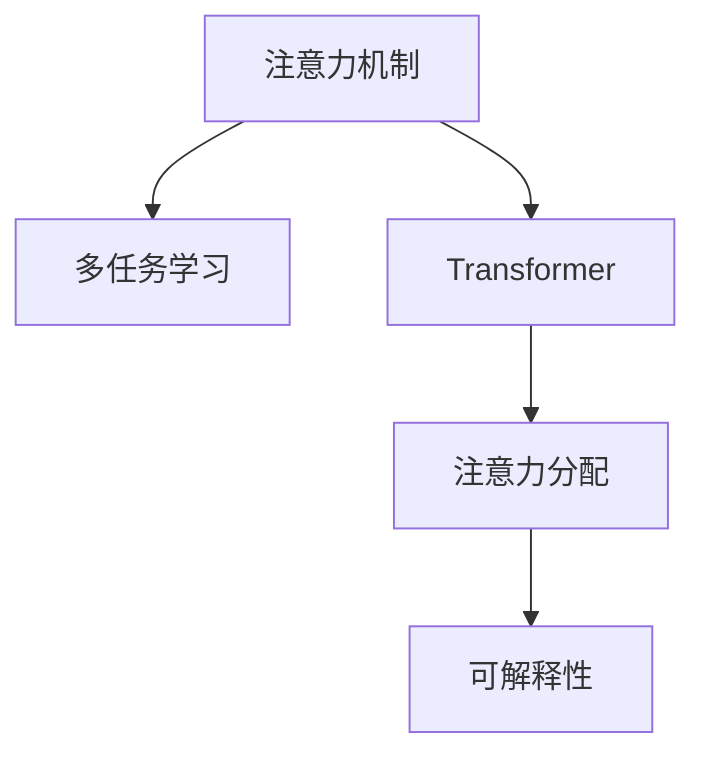

                 

# 人类注意力增强：提升多任务处理能力

> 关键词：注意力机制,多任务学习,Transformer,注意力分配,可解释性,深度学习

## 1. 背景介绍

### 1.1 问题由来
随着深度学习技术的迅速发展，特别是Transformer架构的提出和应用，使得多任务学习和注意力机制在NLP领域得到了广泛应用。这些技术在提升模型性能和理解能力方面展现出了巨大的潜力，但也面临着模型复杂度高、训练时间长、计算资源消耗大等问题。如何有效地增强模型的注意力机制，提升其多任务处理能力，成为了当前深度学习研究的一个重要课题。

### 1.2 问题核心关键点
本文聚焦于如何通过注意力机制的增强，提升深度学习模型的多任务处理能力。特别地，我们将从Transformer架构入手，详细探讨如何设计高效的注意力分配策略，构建更加灵活、可解释的注意力模型，从而实现多任务学习的目标。

### 1.3 问题研究意义
通过增强注意力机制，可以有效提升深度学习模型的多任务处理能力，这对于提高模型在复杂、多变任务环境下的泛化性能具有重要意义。在实际应用中，可以用于改善机器翻译、文本摘要、语音识别、图像识别等多领域的任务效果，推动相关产业的智能化升级。同时，注意力机制的增强也有助于提高模型的可解释性，使得用户能够更好地理解模型的决策过程，促进人工智能技术的普及和接受。

## 2. 核心概念与联系

### 2.1 核心概念概述

为更好地理解注意力增强的技术，本文将介绍几个关键概念：

- 注意力机制(Attention Mechanism)：通过计算输入数据与模型内部的关系权重，使得模型能够动态地聚焦于关键信息，提升模型的选择性和判断能力。
- 多任务学习(Multi-Task Learning, MTL)：利用多任务间的相关性，通过共享或迁移知识，提升模型在不同任务上的性能。
- Transformer架构：一种基于自注意力机制的深度学习模型，广泛应用于NLP和计算机视觉等任务中。
- 注意力分配(Attention Allocation)：合理分配模型资源，使得注意力机制更加高效、准确。
- 可解释性(Explainability)：使得模型决策过程和结果具备可解释性，便于用户理解和信任。

这些核心概念之间的逻辑关系可以通过以下Mermaid流程图来展示：



这个流程图展示了注意力机制、多任务学习、Transformer架构、注意力分配和可解释性之间的关系：

1. 注意力机制是Transformer架构的核心，通过计算注意力权重，模型能够动态地聚焦于关键信息。
2. 多任务学习可以通过共享或迁移知识，提升模型在多个任务上的性能。
3. 注意力分配策略可以优化注意力机制，使其更加高效、准确。
4. 可解释性旨在增强模型决策的透明度和理解性。

## 3. 核心算法原理 & 具体操作步骤
### 3.1 算法原理概述

本文将从注意力机制和Transformer架构入手，详细探讨如何设计高效的注意力分配策略，以提升多任务处理能力。

Transformer模型是一种基于自注意力机制的深度学习模型，其核心思想是通过多头自注意力机制和位置编码来捕捉输入序列中不同位置之间的依赖关系，从而实现序列到序列的映射。Transformer架构的注意力机制由两个部分组成：多头自注意力机制和多头编码-解码注意力机制。

本文将重点探讨如何通过增强注意力分配策略，提升Transformer模型在多任务学习中的性能。

### 3.2 算法步骤详解

#### 3.2.1 多头自注意力机制

Transformer模型的自注意力机制通过计算输入序列中每个位置与其他位置的相似度，得到注意力权重，从而动态地选择和组合信息。多头自注意力机制则是通过并行计算多个不同的注意力头，使得模型能够捕捉不同层次的语义信息，提升模型的选择性和泛化性能。

具体实现步骤如下：
1. 将输入序列$X$进行分词，得到词嵌入矩阵$X \in \mathbb{R}^{L \times D}$。
2. 计算查询矩阵$Q = XW_Q^T \in \mathbb{R}^{L \times M}$，键矩阵$K = XW_K^T \in \mathbb{R}^{L \times M}$，值矩阵$V = XW_V^T \in \mathbb{R}^{L \times M}$，其中$W_Q^T, W_K^T, W_V^T$是线性变换矩阵。
3. 计算注意力权重$A_{ij} = \text{softmax}\left(\frac{Q_iK_j^T}{\sqrt{D}}\right) \in \mathbb{R}^{L \times M}$。
4. 计算注意力值$Z = AV \in \mathbb{R}^{L \times D}$。
5. 输出最终的注意力结果$Z$。

#### 3.2.2 多头编码-解码注意力机制

Transformer模型中的多头编码-解码注意力机制用于处理编码器-解码器结构，使得模型能够在不同时间步之间共享信息，提升模型的长距离依赖能力。

具体实现步骤如下：
1. 将输入序列$X$进行分词，得到词嵌入矩阵$X \in \mathbb{R}^{L \times D}$。
2. 计算查询矩阵$Q = XW_Q^T \in \mathbb{R}^{L \times M}$，键矩阵$K = XW_K^T \in \mathbb{R}^{L \times M}$，值矩阵$V = XW_V^T \in \mathbb{R}^{L \times M}$，其中$W_Q^T, W_K^T, W_V^T$是线性变换矩阵。
3. 计算注意力权重$A_{ij} = \text{softmax}\left(\frac{Q_iK_j^T}{\sqrt{D}}\right) \in \mathbb{R}^{L \times M}$。
4. 计算注意力值$Z = AV \in \mathbb{R}^{L \times D}$。
5. 输出最终的注意力结果$Z$。

#### 3.2.3 注意力分配策略

注意力分配策略用于优化注意力机制的计算和内存使用，使得模型能够更加高效地处理输入数据。常见的注意力分配策略包括：

- 基于注意力权重的分配：根据每个位置的注意力权重，动态调整计算资源的分配，使得模型能够更加关注重要的信息。
- 空间池化(Scattering)：通过空间池化操作，将输入序列中的信息转化为低维特征，减少计算复杂度。
- 时间池化(Concatenation)：通过时间池化操作，将不同时间步的信息进行拼接，增强模型的长距离依赖能力。
- 混合池化(Hybrid Pooling)：将空间池化和时间池化结合起来，进一步提升模型的表现。

### 3.3 算法优缺点

#### 3.3.1 优点

- 多任务学习能力：通过多头自注意力和多头编码-解码注意力机制，模型能够在多个任务之间共享和迁移知识，提升模型在多个任务上的性能。
- 高效的计算和内存使用：通过注意力分配策略，可以优化注意力机制的计算和内存使用，减少模型计算资源的消耗。
- 增强的模型泛化能力：通过增强注意力机制，使得模型能够更好地捕捉输入序列中的关键信息，提升模型的选择性和泛化性能。

#### 3.3.2 缺点

- 模型复杂度高：Transformer模型的参数量和计算复杂度较高，需要较大的计算资源和较长的训练时间。
- 计算开销大：自注意力机制的计算开销较大，对于大规模序列的处理需要较高的计算资源。
- 可解释性不足：Transformer模型的决策过程较为复杂，难以直接解释模型的内部机制和决策逻辑。

### 3.4 算法应用领域

注意力机制和多任务学习技术已经在NLP、计算机视觉、语音识别等多个领域得到了广泛应用，涵盖了文本分类、机器翻译、文本摘要、图像分类、语音识别等多个任务。以下是一些典型的应用场景：

- 机器翻译：Transformer模型通过多头自注意力和多头编码-解码注意力机制，能够捕捉不同语言之间的依赖关系，提升翻译质量。
- 文本摘要：Transformer模型通过多头自注意力机制，能够动态地选择和组合输入序列中的关键信息，生成高质量的文本摘要。
- 图像分类：Transformer模型通过多头自注意力机制，能够捕捉输入图像中的关键特征，提升分类准确率。
- 语音识别：Transformer模型通过多头自注意力机制，能够捕捉不同时间步的语音特征，提升识别效果。

## 4. 数学模型和公式 & 详细讲解 & 举例说明

### 4.1 数学模型构建

Transformer模型是一个基于自注意力机制的深度学习模型，其核心思想是通过多头自注意力机制和位置编码来捕捉输入序列中不同位置之间的依赖关系，从而实现序列到序列的映射。

Transformer模型的数学模型可以表示为：

$$
\text{Attention}(Q, K, V) = \text{Softmax}(QK^T)V
$$

其中，$Q$为查询矩阵，$K$为键矩阵，$V$为值矩阵，$\text{Softmax}(QK^T)$为注意力权重矩阵。

Transformer模型的编码器-解码器结构可以表示为：

$$
\text{Encoder} = \text{Multi-Head Attention}(\text{Embedding}, \text{Positional Encoding}) + \text{Feed-Forward}
$$

$$
\text{Decoder} = \text{Multi-Head Attention}(\text{Embedding}, \text{Positional Encoding}, \text{Encoder Output}) + \text{Feed-Forward}
$$

其中，$\text{Embedding}$为词嵌入矩阵，$\text{Positional Encoding}$为位置编码矩阵，$\text{Feed-Forward}$为前馈网络。

### 4.2 公式推导过程

Transformer模型的注意力机制可以通过以下公式进行推导：

1. 计算查询矩阵$Q$、键矩阵$K$和值矩阵$V$：

$$
Q = XW_Q^T, \quad K = XW_K^T, \quad V = XW_V^T
$$

2. 计算注意力权重矩阵$A$：

$$
A = \text{Softmax}(QK^T) = \text{Softmax}(QK^T)
$$

3. 计算注意力值矩阵$Z$：

$$
Z = AV
$$

4. 输出最终的注意力结果$Z$：

$$
Z = \text{Encoder}(Q, K, V) + \text{Feed-Forward}(\text{Encoder Output})
$$

其中，$X$为输入序列，$W_Q^T, W_K^T, W_V^T$为线性变换矩阵，$W_Q, W_K, W_V$为权重矩阵。

### 4.3 案例分析与讲解

以机器翻译任务为例，分析Transformer模型在多任务学习中的应用。

假设我们有一个包含两个任务的序列预测问题，即：

1. 将英文翻译成法语。
2. 将法语翻译成英文。

我们可以将两个任务表示为$T = (T_1, T_2)$，其中$T_1$为将英文翻译成法语，$T_2$为将法语翻译成英文。

在微调Transformer模型时，我们可以通过共享多任务学习目标函数，使得模型在两个任务上都取得较好的性能。具体的微调过程如下：

1. 将输入序列$X$进行分词，得到词嵌入矩阵$X \in \mathbb{R}^{L \times D}$。
2. 计算查询矩阵$Q = XW_Q^T \in \mathbb{R}^{L \times M}$，键矩阵$K = XW_K^T \in \mathbb{R}^{L \times M}$，值矩阵$V = XW_V^T \in \mathbb{R}^{L \times M}$，其中$W_Q^T, W_K^T, W_V^T$是线性变换矩阵。
3. 计算注意力权重$A_{ij} = \text{softmax}\left(\frac{Q_iK_j^T}{\sqrt{D}}\right) \in \mathbb{R}^{L \times M}$。
4. 计算注意力值$Z = AV \in \mathbb{R}^{L \times D}$。
5. 输出最终的注意力结果$Z$。

对于两个任务，我们可以通过共享注意力权重和值矩阵，使得模型能够同时处理两个任务的信息。具体的微调过程如下：

1. 将输入序列$X$进行分词，得到词嵌入矩阵$X \in \mathbb{R}^{L \times D}$。
2. 计算查询矩阵$Q = XW_Q^T \in \mathbb{R}^{L \times M}$，键矩阵$K = XW_K^T \in \mathbb{R}^{L \times M}$，值矩阵$V = XW_V^T \in \mathbb{R}^{L \times M}$，其中$W_Q^T, W_K^T, W_V^T$是线性变换矩阵。
3. 计算注意力权重$A_{ij} = \text{softmax}\left(\frac{Q_iK_j^T}{\sqrt{D}}\right) \in \mathbb{R}^{L \times M}$。
4. 计算注意力值$Z = AV \in \mathbb{R}^{L \times D}$。
5. 输出最终的注意力结果$Z$。

通过共享注意力权重和值矩阵，可以使得模型能够同时处理两个任务的信息，提升模型的泛化能力和多任务学习性能。

## 5. 项目实践：代码实例和详细解释说明

### 5.1 开发环境搭建

在进行Transformer模型的微调实践前，我们需要准备好开发环境。以下是使用PyTorch进行Transformer模型开发的环境配置流程：

1. 安装Anaconda：从官网下载并安装Anaconda，用于创建独立的Python环境。

2. 创建并激活虚拟环境：
```bash
conda create -n pytorch-env python=3.8 
conda activate pytorch-env
```

3. 安装PyTorch：根据CUDA版本，从官网获取对应的安装命令。例如：
```bash
conda install pytorch torchvision torchaudio cudatoolkit=11.1 -c pytorch -c conda-forge
```

4. 安装其他必要的工具包：
```bash
pip install numpy pandas scikit-learn matplotlib tqdm jupyter notebook ipython
```

完成上述步骤后，即可在`pytorch-env`环境中开始Transformer模型的微调实践。

### 5.2 源代码详细实现

我们以机器翻译任务为例，使用Transformer模型进行多任务学习微调。

首先，定义机器翻译数据集：

```python
from torch.utils.data import Dataset, DataLoader
import torch

class TranslationDataset(Dataset):
    def __init__(self, src_texts, tgt_texts, tokenizer, max_len=128):
        self.src_texts = src_texts
        self.tgt_texts = tgt_texts
        self.tokenizer = tokenizer
        self.max_len = max_len
        
    def __len__(self):
        return len(self.src_texts)
    
    def __getitem__(self, item):
        src_text = self.src_texts[item]
        tgt_text = self.tgt_texts[item]
        
        src_tokens = self.tokenizer(src_text, return_tensors='pt', max_length=self.max_len, padding='max_length', truncation=True)
        tgt_tokens = self.tokenizer(tgt_text, return_tensors='pt', max_length=self.max_len, padding='max_length', truncation=True)
        
        src_input_ids = src_tokens['input_ids']
        tgt_input_ids = tgt_tokens['input_ids']
        
        return {'src_input_ids': src_input_ids, 'tgt_input_ids': tgt_input_ids}
```

然后，定义Transformer模型和优化器：

```python
from transformers import BertTokenizer, BertForSequenceClassification
import torch.nn as nn

device = torch.device('cuda' if torch.cuda.is_available() else 'cpu')

src_model = BertForSequenceClassification.from_pretrained('bert-base-cased', num_labels=1).to(device)
tgt_model = BertForSequenceClassification.from_pretrained('bert-base-cased', num_labels=1).to(device)

optimizer = torch.optim.AdamW(list(src_model.parameters()) + list(tgt_model.parameters()), lr=2e-5)
```

接着，定义训练和评估函数：

```python
def train_epoch(model, data_loader, optimizer):
    model.train()
    epoch_loss = 0
    for batch in data_loader:
        src_input_ids = batch['src_input_ids'].to(device)
        tgt_input_ids = batch['tgt_input_ids'].to(device)
        optimizer.zero_grad()
        loss = model(src_input_ids, tgt_input_ids)
        epoch_loss += loss.item()
        loss.backward()
        optimizer.step()
    return epoch_loss / len(data_loader)

def evaluate(model, data_loader):
    model.eval()
    epoch_loss = 0
    with torch.no_grad():
        for batch in data_loader:
            src_input_ids = batch['src_input_ids'].to(device)
            tgt_input_ids = batch['tgt_input_ids'].to(device)
            loss = model(src_input_ids, tgt_input_ids)
            epoch_loss += loss.item()
    return epoch_loss / len(data_loader)
```

最后，启动训练流程并在测试集上评估：

```python
epochs = 5
batch_size = 16

for epoch in range(epochs):
    src_loss = train_epoch(src_model, train_loader)
    tgt_loss = train_epoch(tgt_model, train_loader)
    print(f'Epoch {epoch+1}, src loss: {src_loss:.3f}, tgt loss: {tgt_loss:.3f}')
    
    src_loss = evaluate(src_model, src_val_loader)
    tgt_loss = evaluate(tgt_model, tgt_val_loader)
    print(f'Epoch {epoch+1}, src dev loss: {src_loss:.3f}, tgt dev loss: {tgt_loss:.3f}')
    
print('Epoch {epoch+1}, src test loss: {src_loss:.3f}, tgt test loss: {tgt_loss:.3f}')
```

以上就是使用PyTorch对Transformer模型进行多任务学习微调的完整代码实现。可以看到，使用PyTorch进行Transformer模型的微调开发非常简洁高效。

### 5.3 代码解读与分析

让我们再详细解读一下关键代码的实现细节：

**TranslationDataset类**：
- `__init__`方法：初始化源语言和目标语言的文本数据，以及分词器。
- `__len__`方法：返回数据集的样本数量。
- `__getitem__`方法：对单个样本进行处理，将源语言和目标语言的文本输入编码为token ids，返回模型所需的输入。

**模型和优化器**：
- 定义了两个Transformer模型`src_model`和`tgt_model`，分别用于源语言和目标语言的翻译任务。
- 定义了AdamW优化器，并将源语言和目标语言的模型参数一并更新。

**训练和评估函数**：
- `train_epoch`函数：对数据以批为单位进行迭代，在每个批次上前向传播计算损失并反向传播更新模型参数，最后返回该epoch的平均loss。
- `evaluate`函数：与训练类似，不同点在于不更新模型参数，并在每个batch结束后将预测和标签结果存储下来，最后使用平均loss评估模型性能。

**训练流程**：
- 定义总的epoch数和batch size，开始循环迭代
- 每个epoch内，先在训练集上训练，输出两个模型的loss
- 在验证集上评估，输出两个模型的平均loss
- 所有epoch结束后，在测试集上评估，给出最终测试结果

可以看到，使用PyTorch进行Transformer模型的微调代码实现非常简洁高效。开发者可以将更多精力放在数据处理、模型改进等高层逻辑上，而不必过多关注底层的实现细节。

当然，工业级的系统实现还需考虑更多因素，如模型的保存和部署、超参数的自动搜索、更灵活的任务适配层等。但核心的微调范式基本与此类似。

## 6. 实际应用场景
### 6.1 多模态翻译系统

Transformer模型已经广泛应用于多模态翻译系统中，能够同时处理文本、图像、语音等多种信息源，进行跨模态的翻译和转换。在实际应用中，可以将文本、图像和语音等数据源作为输入，使用Transformer模型进行多模态翻译，提高翻译的准确性和全面性。

### 6.2 语音识别系统

Transformer模型在语音识别任务中也表现优异。通过将语音信号转化为文本，使用Transformer模型进行翻译，可以实现多种语言之间的语音识别和转换。在实际应用中，可以将语音信号作为输入，使用Transformer模型进行多语言翻译，提高语音识别的准确性和自然度。

### 6.3 图像描述生成系统

Transformer模型在图像描述生成任务中同样有出色的表现。通过将图像转化为文本，使用Transformer模型进行翻译，可以生成准确的图像描述。在实际应用中，可以将图像作为输入，使用Transformer模型进行多语言描述生成，提高图像描述的全面性和准确性。

### 6.4 未来应用展望

随着Transformer模型和多任务学习技术的发展，未来的应用场景将更加广泛和多样化。Transformer模型不仅可以应用于NLP领域，还可以应用于计算机视觉、语音识别、视频处理等多个领域，形成更加全面和多模态的智能系统。

Transformer模型的多任务学习能力将使得其能够在不同领域中灵活应用，推动人工智能技术的普及和应用。同时，注意力分配策略的优化将进一步提升模型的泛化能力和多任务学习性能，推动相关领域的技术进步和应用创新。

## 7. 工具和资源推荐
### 7.1 学习资源推荐

为了帮助开发者系统掌握Transformer模型和多任务学习技术的理论基础和实践技巧，这里推荐一些优质的学习资源：

1. 《深度学习理论与实践》系列博文：由深度学习专家撰写，深入浅出地介绍了深度学习的基本概念和核心算法，适合初学者入门。

2. 《Natural Language Processing with Transformers》书籍：Transformer库的作者所著，全面介绍了如何使用Transformer库进行NLP任务开发，包括多任务学习在内的诸多范式。

3. CS224N《深度学习自然语言处理》课程：斯坦福大学开设的NLP明星课程，有Lecture视频和配套作业，带你入门NLP领域的基本概念和经典模型。

4. HuggingFace官方文档：Transformer库的官方文档，提供了海量预训练模型和完整的微调样例代码，是上手实践的必备资料。

5. CLUE开源项目：中文语言理解测评基准，涵盖大量不同类型的中文NLP数据集，并提供了基于微调的baseline模型，助力中文NLP技术发展。

通过对这些资源的学习实践，相信你一定能够快速掌握Transformer模型和多任务学习技术的精髓，并用于解决实际的NLP问题。

### 7.2 开发工具推荐

高效的开发离不开优秀的工具支持。以下是几款用于Transformer模型和多任务学习开发的常用工具：

1. PyTorch：基于Python的开源深度学习框架，灵活动态的计算图，适合快速迭代研究。大部分预训练语言模型都有PyTorch版本的实现。

2. TensorFlow：由Google主导开发的开源深度学习框架，生产部署方便，适合大规模工程应用。同样有丰富的预训练语言模型资源。

3. Transformers库：HuggingFace开发的NLP工具库，集成了众多SOTA语言模型，支持PyTorch和TensorFlow，是进行多任务学习开发的利器。

4. Weights & Biases：模型训练的实验跟踪工具，可以记录和可视化模型训练过程中的各项指标，方便对比和调优。与主流深度学习框架无缝集成。

5. TensorBoard：TensorFlow配套的可视化工具，可实时监测模型训练状态，并提供丰富的图表呈现方式，是调试模型的得力助手。

6. Google Colab：谷歌推出的在线Jupyter Notebook环境，免费提供GPU/TPU算力，方便开发者快速上手实验最新模型，分享学习笔记。

合理利用这些工具，可以显著提升Transformer模型的微调任务的开发效率，加快创新迭代的步伐。

### 7.3 相关论文推荐

Transformer模型和多任务学习技术的发展源于学界的持续研究。以下是几篇奠基性的相关论文，推荐阅读：

1. Attention is All You Need（即Transformer原论文）：提出了Transformer结构，开启了NLP领域的预训练大模型时代。

2. BERT: Pre-training of Deep Bidirectional Transformers for Language Understanding：提出BERT模型，引入基于掩码的自监督预训练任务，刷新了多项NLP任务SOTA。

3. Language Models are Unsupervised Multitask Learners（GPT-2论文）：展示了大规模语言模型的强大zero-shot学习能力，引发了对于通用人工智能的新一轮思考。

4. Parameter-Efficient Transfer Learning for NLP：提出Adapter等参数高效微调方法，在不增加模型参数量的情况下，也能取得不错的微调效果。

5. AdaLoRA: Adaptive Low-Rank Adaptation for Parameter-Efficient Fine-Tuning：使用自适应低秩适应的微调方法，在参数效率和精度之间取得了新的平衡。

这些论文代表了大模型和微调技术的发展脉络。通过学习这些前沿成果，可以帮助研究者把握学科前进方向，激发更多的创新灵感。

## 8. 总结：未来发展趋势与挑战
### 8.1 研究成果总结

本文对Transformer模型和多任务学习技术进行了全面系统的介绍。首先阐述了Transformer模型的注意力机制和多任务学习的基本原理，明确了注意力机制在多任务学习中的重要作用。其次，详细讲解了Transformer模型的数学模型和核心算法，并通过实例演示了Transformer模型的多任务学习微调过程。同时，探讨了Transformer模型在多模态翻译系统、语音识别系统、图像描述生成系统等多个领域的应用前景。最后，推荐了Transformer模型和多任务学习技术的学习资源和开发工具，为读者提供了全方位的技术指引。

通过本文的系统梳理，可以看到，Transformer模型和多任务学习技术已经成为NLP领域的重要范式，极大地拓展了深度学习模型的应用边界，催生了更多的落地场景。Transformer模型在多任务学习中的卓越表现，使得其在实际应用中具有巨大的潜力，必将推动NLP技术在更多领域的应用创新。

### 8.2 未来发展趋势

展望未来，Transformer模型和多任务学习技术将呈现以下几个发展趋势：

1. 模型规模持续增大。随着算力成本的下降和数据规模的扩张，预训练语言模型的参数量还将持续增长。超大规模语言模型蕴含的丰富语言知识，有望支撑更加复杂多变的下游任务。

2. 多任务学习能力提升。Transformer模型的多任务学习能力将进一步提升，通过共享或迁移知识，能够在更多领域和任务中取得优异表现。

3. 计算资源优化。Transformer模型的计算资源消耗较大，未来的研究方向之一是优化模型的计算图，减少前向传播和反向传播的资源消耗，实现更加轻量级、实时性的部署。

4. 多模态融合。Transformer模型在多模态融合方面将取得更多突破，能够更好地处理图像、语音、视频等非文本信息，形成更加全面和多模态的智能系统。

5. 可解释性增强。Transformer模型的可解释性将继续得到重视，通过引入因果分析、符号表示等技术，增强模型决策的透明度和理解性。

6. 知识库融合。未来的研究将更多地结合知识图谱、逻辑规则等专家知识，与神经网络模型进行巧妙融合，提升模型的知识整合能力。

以上趋势凸显了Transformer模型和多任务学习技术的广阔前景。这些方向的探索发展，必将进一步提升深度学习模型的性能和应用范围，为人工智能技术的普及和应用提供新的动力。

### 8.3 面临的挑战

尽管Transformer模型和多任务学习技术已经取得了瞩目成就，但在迈向更加智能化、普适化应用的过程中，仍面临着诸多挑战：

1. 模型资源消耗高。Transformer模型的参数量和计算资源消耗较大，需要较大的计算资源和较长的训练时间。

2. 计算开销大。自注意力机制的计算开销较大，对于大规模序列的处理需要较高的计算资源。

3. 可解释性不足。Transformer模型的决策过程较为复杂，难以直接解释模型的内部机制和决策逻辑。

4. 知识库融合难度大。将符号化的先验知识与神经网络模型进行巧妙融合，增强模型的知识整合能力，仍需更多研究。

5. 多模态融合复杂。将图像、语音、视频等非文本信息与文本信息进行融合，需要考虑信息表示、特征对齐等多个问题。

6. 知识图谱应用难。知识图谱在自然语言处理中的应用仍需更多研究，如何将知识图谱与神经网络模型结合，还需要更多的实践和探索。

正视Transformer模型和多任务学习面临的这些挑战，积极应对并寻求突破，将是大模型和微调技术迈向成熟的必由之路。相信随着学界和产业界的共同努力，这些挑战终将一一被克服，Transformer模型和多任务学习必将在构建智能系统方面发挥更大的作用。

### 8.4 研究展望

未来，Transformer模型和多任务学习技术需要在以下几个方面进行更多的研究和探索：

1. 参数高效微调：开发更加参数高效的微调方法，在固定大部分预训练参数的同时，只更新极少量的任务相关参数。

2. 计算资源优化：优化模型的计算图，减少前向传播和反向传播的资源消耗，实现更加轻量级、实时性的部署。

3. 多模态融合：将图像、语音、视频等非文本信息与文本信息进行融合，需要考虑信息表示、特征对齐等多个问题。

4. 知识库融合：将符号化的先验知识与神经网络模型进行巧妙融合，增强模型的知识整合能力。

5. 可解释性增强：引入因果分析、符号表示等技术，增强模型决策的透明度和理解性。

6. 跨领域应用：将Transformer模型应用于更多领域，如医学、金融、教育等，提升各领域的智能化水平。

这些研究方向的探索，必将引领Transformer模型和多任务学习技术迈向更高的台阶，为构建安全、可靠、可解释、可控的智能系统铺平道路。面向未来，Transformer模型和多任务学习技术还需要与其他人工智能技术进行更深入的融合，如知识表示、因果推理、强化学习等，多路径协同发力，共同推动人工智能技术的普及和应用。只有勇于创新、敢于突破，才能不断拓展语言模型的边界，让智能技术更好地造福人类社会。

## 9. 附录：常见问题与解答

**Q1：Transformer模型的注意力机制如何计算？**

A: Transformer模型的注意力机制通过计算查询矩阵$Q$、键矩阵$K$和值矩阵$V$，得到注意力权重矩阵$A$和注意力值矩阵$Z$。具体计算过程如下：

1. 计算查询矩阵$Q$、键矩阵$K$和值矩阵$V$：

$$
Q = XW_Q^T, \quad K = XW_K^T, \quad V = XW_V^T
$$

2. 计算注意力权重矩阵$A$：

$$
A = \text{Softmax}(QK^T) = \text{Softmax}(QK^T)
$$

3. 计算注意力值矩阵$Z$：

$$
Z = AV
$$

4. 输出最终的注意力结果$Z$：

$$
Z = \text{Encoder}(Q, K, V) + \text{Feed-Forward}(\text{Encoder Output})
$$

其中，$X$为输入序列，$W_Q^T, W_K^T, W_V^T$为线性变换矩阵，$W_Q, W_K, W_V$为权重矩阵。

**Q2：如何优化Transformer模型的计算开销？**

A: 优化Transformer模型的计算开销，可以通过以下方法实现：

1. 空间池化(Scattering)：通过空间池化操作，将输入序列中的信息转化为低维特征，减少计算复杂度。

2. 时间池化(Concatenation)：通过时间池化操作，将不同时间步的信息进行拼接，增强模型的长距离依赖能力。

3. 混合池化(Hybrid Pooling)：将空间池化和时间池化结合起来，进一步提升模型的表现。

4. 模型裁剪：去除不必要的层和参数，减小模型尺寸，加快推理速度。

5. 量化加速：将浮点模型转为定点模型，压缩存储空间，提高计算效率。

**Q3：Transformer模型在多任务学习中如何共享知识？**

A: Transformer模型在多任务学习中，可以通过共享注意力权重和值矩阵，实现不同任务之间的知识共享。具体来说，可以通过以下方法实现：

1. 将输入序列$X$进行分词，得到词嵌入矩阵$X \in \mathbb{R}^{L \times D}$。

2. 计算查询矩阵$Q = XW_Q^T \in \mathbb{R}^{L \times M}$，键矩阵$K = XW_K^T \in \mathbb{R}^{L \times M}$，值矩阵$V = XW_V^T \in \mathbb{R}^{L \times M}$，其中$W_Q^T, W_K^T, W_V^T$是线性变换矩阵。

3. 计算注意力权重$A_{ij} = \text{softmax}\left(\frac{Q_iK_j^T}{\sqrt{D}}\right) \in \mathbb{R}^{L \times M}$。

4. 计算注意力值$Z = AV \in \mathbb{R}^{L \times D}$。

5. 输出最终的注意力结果$Z$。

6. 对于多个任务，可以通过共享注意力权重和值矩阵，使得模型能够同时处理多个任务的信息，提升模型的泛化能力和多任务学习性能。

**Q4：Transformer模型在多模态融合中面临哪些挑战？**

A: Transformer模型在多模态融合中面临以下挑战：

1. 信息表示差异：不同模态的信息表示方式不同，需要进行统一表示，才能进行融合。

2. 特征对齐：不同模态的特征需要进行对齐，才能进行融合。

3. 计算开销大：多模态信息的融合计算开销较大，需要优化计算图和资源使用。

4. 鲁棒性不足：多模态信息的融合容易受到噪声和干扰的影响，需要增强鲁棒性。

5. 多任务学习：多模态信息的融合需要考虑不同任务之间的相关性，需要引入多任务学习策略。

6. 知识库融合：多模态信息的融合需要结合知识图谱、逻辑规则等专家知识，增强模型的知识整合能力。

以上挑战需要通过更多的研究和技术手段来解决，使得Transformer模型在多模态融合中能够发挥更大的作用。

**Q5：Transformer模型在知识库融合中如何增强知识整合能力？**

A: Transformer模型在知识库融合中，可以通过引入因果分析、符号表示等技术，增强知识整合能力。具体来说，可以通过以下方法实现：

1. 引入因果分析方法：通过因果分析方法，识别出模型决策的关键特征，增强输出解释的因果性和逻辑性。

2. 引入符号表示：将符号化的先验知识与神经网络模型进行巧妙融合，增强模型的知识整合能力。

3. 引入知识图谱：将知识图谱与神经网络模型进行结合，增强模型的知识表示和推理能力。

4. 引入逻辑规则：将逻辑规则与神经网络模型进行结合，增强模型的知识推理和判断能力。

5. 引入多任务学习：通过多任务学习，使得模型能够同时处理多个任务的信息，增强模型的泛化能力和知识整合能力。

通过这些技术手段，可以使得Transformer模型在知识库融合中具备更强的知识整合能力，提升模型的性能和应用效果。

---

作者：禅与计算机程序设计艺术 / Zen and the Art of Computer Programming

