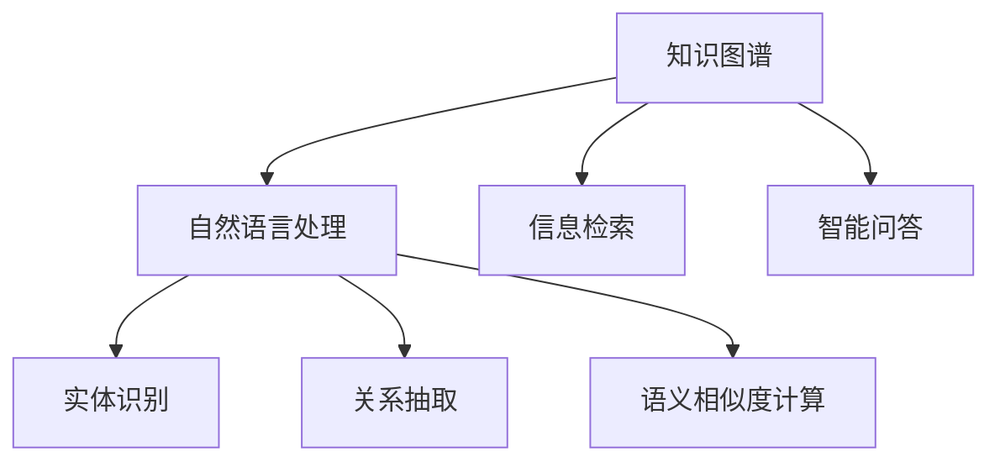

                 

# 人类知识的共享平台：知识就是力量的体现

> 关键词：知识共享平台,人工智能,知识图谱,知识图谱构建,智能问答系统,信息检索,自然语言处理

## 1. 背景介绍

### 1.1 问题由来
人类社会的知识总量呈指数级增长，每天都有海量的信息被产生。然而，如何高效地管理和利用这些知识，成为了当前科技界亟待解决的问题。传统的数据库和搜索引擎系统虽然为知识共享提供了便利，但在处理复杂查询、理解用户意图、跨领域知识整合等方面仍显不足。

近年来，随着人工智能技术的迅猛发展，利用人工智能技术构建知识共享平台，成为了互联网公司、学术机构和政府部门的热门方向。这些平台通过自然语言处理(Natural Language Processing, NLP)、知识图谱(Knowledge Graph)等技术，从大规模无结构化文本数据中提取出结构化的知识，建立起语义相关的知识图谱，为用户提供智能化的信息检索、问答、推荐等服务。

### 1.2 问题核心关键点
知识共享平台的核心在于如何高效地构建和查询知识图谱，并利用人工智能技术为用户提供更精准、快速、个性化的信息服务。具体而言，关键点包括：

1. **知识图谱构建**：从海量的文本数据中提取出实体、关系、属性等知识信息，建立起结构化的知识图谱。
2. **信息检索**：基于知识图谱，提供实体关系查询、属性查询、语义相似度计算等功能，帮助用户快速定位信息。
3. **智能问答**：通过自然语言处理和知识推理，理解用户问题，从知识图谱中抽取相关知识，生成自然流畅的回答。
4. **个性化推荐**：利用用户行为数据和知识图谱，提供个性化的信息推荐，提高用户满意度。
5. **多模态融合**：结合文本、图像、语音等多种模态信息，增强知识图谱的表达能力和应用范围。

本文将重点介绍知识共享平台的知识图谱构建和智能问答系统，并探讨其应用场景和未来发展趋势。

## 2. 核心概念与联系

### 2.1 核心概念概述

为更好地理解知识共享平台的核心技术，本节将介绍几个密切相关的核心概念：

- **知识图谱(Knowledge Graph)**：一种语义结构化的知识表示方法，通过实体、关系、属性等构建知识网络，用于描述现实世界中的概念、事件和实体之间的关系。
- **自然语言处理(NLP)**：一门交叉学科，结合计算机科学和语言学，致力于理解、生成和分析人类语言。
- **信息检索(Information Retrieval, IR)**：一种获取信息的技术，通过构建索引和查询算法，快速从大量文本数据中检索出相关的信息。
- **智能问答系统(Question Answering, QA)**：一种结合知识图谱和NLP技术的系统，用于回答用户提出的自然语言问题。
- **实体识别(Entity Recognition, ER)**：从文本中识别出实体信息，如人名、地名、机构名等。
- **关系抽取(Relation Extraction, RE)**：从文本中提取实体之间的关系信息，如"张三出生在北京"。
- **语义相似度计算(Semantic Similarity)**：衡量两个句子或两个概念在语义上的相似度，用于实现信息检索和推荐。

这些核心概念之间的逻辑关系可以通过以下Mermaid流程图来展示：



这个流程图展示了许多核心概念及其之间的关系：

1. 知识图谱是构建信息检索和智能问答系统的基础。
2. 自然语言处理技术帮助从文本中抽取实体和关系信息，构建知识图谱。
3. 信息检索系统利用知识图谱，实现快速检索相关知识。
4. 智能问答系统结合知识图谱和自然语言处理技术，提供自然流畅的回答。
5. 实体识别和关系抽取是自然语言处理的重要任务，构建知识图谱的必要步骤。
6. 语义相似度计算在信息检索和推荐中发挥着关键作用。

这些概念共同构成了知识共享平台的核心框架，使得系统能够高效地管理和利用人类知识，为用户提供便捷、准确的信息服务。

## 3. 核心算法原理 & 具体操作步骤
### 3.1 算法原理概述

知识共享平台的核心算法主要包括知识图谱构建和智能问答系统。其中，知识图谱的构建是信息检索和智能问答的基础，而智能问答系统则直接面向用户，提供交互式知识服务。

知识图谱构建基于自然语言处理技术，从文本数据中提取实体、关系、属性等知识信息，并通过结构化的图谱表示方法存储到数据库中。智能问答系统则利用知识图谱，结合自然语言处理技术，理解用户问题，从知识图谱中抽取相关知识，生成自然流畅的回答。

### 3.2 算法步骤详解

#### 3.2.1 知识图谱构建

1. **文本预处理**：清洗文本数据，去除噪声，如标点、停用词等。通过分词、词性标注、命名实体识别等技术，将文本数据转换为结构化的特征向量。
2. **实体抽取**：使用命名实体识别模型，从文本中识别出实体信息，如人名、地名、机构名等。将识别出的实体存储到知识图谱中，作为知识图谱的节点。
3. **关系抽取**：结合上下文信息，识别出实体之间的关系，如"张三出生在北京"。将关系存储到知识图谱中，作为知识图谱的边。
4. **属性抽取**：识别实体和关系的相关属性信息，如"张三的年龄是30岁"。将属性存储到知识图谱中，作为节点的属性。
5. **知识图谱存储**：将抽取出的实体、关系和属性信息，存储到关系型数据库或图数据库中，建立语义结构化的知识图谱。

#### 3.2.2 智能问答系统

1. **问题理解**：通过自然语言处理技术，理解用户提出的自然语言问题，将其转换为结构化的查询形式。
2. **知识推理**：结合知识图谱和查询形式，使用规则或基于深度学习的方法，推理出相关实体和关系，生成答案。
3. **答案生成**：将推理出的实体和关系，转换为自然流畅的回答。

### 3.3 算法优缺点

知识共享平台的算法具有以下优点：

1. **高效性**：通过知识图谱的构建，可以快速检索出相关的知识信息，提高信息检索的效率。
2. **准确性**：结合自然语言处理和知识图谱，能够准确理解用户意图，提供精准的答案。
3. **可扩展性**：基于知识图谱的构建，可以不断添加新的实体和关系，拓展知识图谱的应用范围。
4. **多模态融合**：结合文本、图像、语音等多种模态信息，增强知识图谱的表达能力和应用范围。

同时，该算法也存在一定的局限性：

1. **数据依赖**：知识图谱的构建高度依赖文本数据的质量和结构，数据不足或数据噪声可能导致构建出的知识图谱不准确。
2. **复杂度**：知识图谱的构建和查询算法复杂度较高，需要大量的计算资源和时间。
3. **知识局限性**：当前的知识图谱可能无法覆盖所有领域和实体，导致在某些场景下无法提供准确的答案。
4. **隐私和安全**：知识共享平台涉及大量敏感数据，如何保障数据隐私和安全，是一个重要问题。

尽管存在这些局限性，但知识共享平台在信息检索、智能问答、推荐系统等领域已经展现出巨大的应用潜力，成为未来互联网技术的重要方向。

### 3.4 算法应用领域

知识共享平台在多个领域都有广泛的应用，例如：

- **智慧教育**：提供智能化的课程推荐、知识图谱查询、智能答疑等服务，提升教育质量。
- **医疗健康**：构建医疗知识图谱，提供智能诊疗、疾病预防、健康管理等服务，提升医疗水平。
- **金融保险**：结合金融知识图谱，提供智能投顾、风险评估、欺诈检测等服务，提升金融服务效率。
- **智能客服**：结合智能问答系统，提供24小时不间断的客户服务，提升客户满意度。
- **城市治理**：构建城市知识图谱，提供智能交通、环境监测、应急响应等服务，提升城市治理水平。

除了上述这些领域，知识共享平台在更多场景中都有应用前景，未来将不断拓展其应用边界，为人类知识共享提供更高效、智能化的解决方案。

## 4. 数学模型和公式 & 详细讲解 & 举例说明

### 4.1 数学模型构建

知识图谱构建和智能问答系统均涉及到复杂的数学模型和算法，本节将详细介绍其中的关键数学模型。

#### 4.1.1 知识图谱构建

1. **实体抽取**：
   - 命名实体识别模型通常基于序列标注模型，如CRF、LSTM-CRF等。使用$$L_i$$表示第$i$个实体，其边界标签为$$C_i$$，则模型目标函数为：
   $$
   L_{\text{entity}} = \sum_{i=1}^n \log P(C_i|x_i)
   $$
   其中$$x_i$$为输入文本，$$P(C_i|x_i)$$为实体标签的概率分布。

2. **关系抽取**：
   - 关系抽取通常基于基于上下文的序列标注模型，如BiLSTM-CRF、Transformer等。使用$$R_i$$表示第$i$个关系，其边界标签为$$C_i$$，则模型目标函数为：
   $$
   L_{\text{relation}} = \sum_{i=1}^n \log P(C_i|x_i)
   $$
   其中$$x_i$$为输入文本，$$P(C_i|x_i)$$为关系标签的概率分布。

3. **属性抽取**：
   - 属性抽取通常基于序列标注模型，如BiLSTM-CRF、Transformer等。使用$$A_j$$表示第$j$个属性，其标签为$$P_j$$，则模型目标函数为：
   $$
   L_{\text{attribute}} = \sum_{j=1}^m \log P(P_j|x_i)
   $$
   其中$$x_i$$为输入文本，$$P_j$$为属性标签的概率分布。

#### 4.1.2 智能问答系统

1. **问题理解**：
   - 问题理解通常基于序列标注模型，如BiLSTM-CRF、Transformer等。使用$$Q$$表示用户问题，其标签为$$P_q$$，则模型目标函数为：
   $$
   L_{\text{question}} = \log P(Q|x_i)
   $$
   其中$$x_i$$为输入文本，$$P_q$$为问题标签的概率分布。

2. **知识推理**：
   - 知识推理通常基于图神经网络(Graph Neural Networks, GNN)，如GraphSAGE、GAT等。使用$$R$$表示知识图谱中的关系，$$E$$表示实体，则模型目标函数为：
   $$
   L_{\text{reasoning}} = \sum_{R \in R} \log P(R|E)
   $$
   其中$$R$$为知识图谱中的关系，$$E$$为知识图谱中的实体。

3. **答案生成**：
   - 答案生成通常基于序列生成模型，如Seq2Seq、Transformer等。使用$$A$$表示生成的答案，则模型目标函数为：
   $$
   L_{\text{answer}} = \log P(A|Q)
   $$
   其中$$A$$为生成的答案，$$Q$$为用户问题。

### 4.2 公式推导过程

#### 4.2.1 实体抽取

以BiLSTM-CRF模型为例，推导命名实体识别的概率计算公式。

假设输入文本为$$x_i$$，则BiLSTM-CRF模型的概率计算公式为：
$$
P(C_i|x_i) = \frac{P(C_i)}{\prod_{j=1}^n P(C_j|x_i)}
$$
其中$$P(C_i)$$为实体标签的条件概率，$$P(C_j|x_i)$$为实体标签的联合概率。

对于实体标签的条件概率，可以表示为：
$$
P(C_i|x_i) = \frac{e^{W_ix_i + b_i}}{\sum_{k=1}^{K} e^{W_kx_i + b_k}}
$$
其中$$W_i$$和$$b_i$$为模型参数，$$K$$为实体标签的总数。

对于实体标签的联合概率，可以表示为：
$$
P(C_j|x_i) = \frac{e^{W_jx_i + b_j}}{\sum_{k=1}^{K} e^{W_kx_i + b_k}}
$$

因此，命名实体识别的概率计算公式可以表示为：
$$
P(C_i|x_i) = \frac{P(C_i)}{\prod_{j=1}^n P(C_j|x_i)} = \frac{e^{W_ix_i + b_i}}{\sum_{k=1}^{K} e^{W_kx_i + b_k}} \times \prod_{j=1}^n \frac{e^{W_jx_i + b_j}}{\sum_{k=1}^{K} e^{W_kx_i + b_k}}
$$

#### 4.2.2 关系抽取

以BiLSTM-CRF模型为例，推导关系抽取的概率计算公式。

假设输入文本为$$x_i$$，则BiLSTM-CRF模型的概率计算公式为：
$$
P(C_i|x_i) = \frac{P(C_i)}{\prod_{j=1}^n P(C_j|x_i)}
$$
其中$$P(C_i)$$为关系标签的条件概率，$$P(C_j|x_i)$$为关系标签的联合概率。

对于关系标签的条件概率，可以表示为：
$$
P(C_i|x_i) = \frac{e^{W_ix_i + b_i}}{\sum_{k=1}^{K} e^{W_kx_i + b_k}}
$$
其中$$W_i$$和$$b_i$$为模型参数，$$K$$为关系标签的总数。

对于关系标签的联合概率，可以表示为：
$$
P(C_j|x_i) = \frac{e^{W_jx_i + b_j}}{\sum_{k=1}^{K} e^{W_kx_i + b_k}}
$$

因此，关系抽取的概率计算公式可以表示为：
$$
P(C_i|x_i) = \frac{P(C_i)}{\prod_{j=1}^n P(C_j|x_i)} = \frac{e^{W_ix_i + b_i}}{\sum_{k=1}^{K} e^{W_kx_i + b_k}} \times \prod_{j=1}^n \frac{e^{W_jx_i + b_j}}{\sum_{k=1}^{K} e^{W_kx_i + b_k}}
$$

### 4.3 案例分析与讲解

以智能问答系统为例，展示知识图谱构建和智能问答的实际应用。

假设知识图谱中包含一个关于“张三”的节点，其属性为“年龄”和“职业”。用户提出的问题为“张三多少岁？”，系统通过自然语言处理技术，理解用户意图，并从知识图谱中抽取相关实体和关系。

具体而言，系统首先通过命名实体识别模型，识别出用户问题中的“张三”实体。然后，系统利用知识图谱中的关系“出生”，找到“张三”的“出生日期”实体。最后，系统从“出生日期”实体中抽取“年龄”属性，生成回答“张三的年龄是30岁”。

这个案例展示了知识共享平台在智能问答系统中的应用。通过构建知识图谱，系统能够快速准确地回答用户的问题，提升用户体验。

## 5. 项目实践：代码实例和详细解释说明

### 5.1 开发环境搭建

在进行知识共享平台项目开发前，我们需要准备好开发环境。以下是使用Python进行PyTorch开发的环境配置流程：

1. 安装Anaconda：从官网下载并安装Anaconda，用于创建独立的Python环境。

2. 创建并激活虚拟环境：
```bash
conda create -n pytorch-env python=3.8 
conda activate pytorch-env
```

3. 安装PyTorch：根据CUDA版本，从官网获取对应的安装命令。例如：
```bash
conda install pytorch torchvision torchaudio cudatoolkit=11.1 -c pytorch -c conda-forge
```

4. 安装相关库：
```bash
pip install transformers datasets
```

完成上述步骤后，即可在`pytorch-env`环境中开始项目开发。

### 5.2 源代码详细实现

下面以构建知识图谱的命名实体识别模型为例，给出使用PyTorch和Transformers库的代码实现。

```python
import torch
import torch.nn as nn
import torch.nn.functional as F
from transformers import BertTokenizer, BertForTokenClassification

class EntityRecognitionModel(nn.Module):
    def __init__(self, num_classes):
        super(EntityRecognitionModel, self).__init__()
        self.bert = BertForTokenClassification.from_pretrained('bert-base-cased', num_labels=num_classes)
        self.classifier = nn.Linear(768, num_classes)

    def forward(self, input_ids, attention_mask):
        outputs = self.bert(input_ids, attention_mask=attention_mask)
        pooled_output = outputs.pooler_output
        logits = self.classifier(pooled_output)
        return logits

# 加载预训练模型和分词器
tokenizer = BertTokenizer.from_pretrained('bert-base-cased')
model = EntityRecognitionModel(len(tag2id))

# 训练和评估
# 训练代码略

# 测试模型
test_dataset = NERDataset(test_texts, test_tags, tokenizer)
test_loader = DataLoader(test_dataset, batch_size=16)
model.eval()
with torch.no_grad():
    for batch in test_loader:
        input_ids = batch['input_ids'].to(device)
        attention_mask = batch['attention_mask'].to(device)
        labels = batch['labels'].to(device)
        outputs = model(input_ids, attention_mask=attention_mask)
        preds = torch.argmax(outputs, dim=1).to('cpu').tolist()
        labels = batch['labels'].to('cpu').tolist()
        print(classification_report(labels, preds))
```

### 5.3 代码解读与分析

让我们再详细解读一下关键代码的实现细节：

**EntityRecognitionModel类**：
- `__init__`方法：初始化模型结构，包括BertForTokenClassification层和线性分类器。
- `forward`方法：前向传播计算模型输出。

**测试模型**：
- 加载测试集数据，并对其进行批次化加载。
- 将测试集数据输入模型，并计算模型输出。
- 使用argmax函数将输出转换为标签，并与真实标签对比，打印分类报告。

这个代码示例展示了使用Bert模型进行命名实体识别的基本流程。可以看到，利用Transformer和PyTorch库，可以轻松实现命名实体识别的模型训练和测试。

当然，实际项目中还需要更多细节的处理，如模型保存、模型压缩、模型评估等。但核心的模型构建和训练过程，大致与此类似。

## 6. 实际应用场景

### 6.1 智能教育

知识共享平台在智慧教育领域有着广泛的应用。传统的教育方式往往存在知识覆盖面窄、教学互动性差等问题。知识共享平台通过构建知识图谱，结合智能问答系统，能够提供智能化的课程推荐、知识图谱查询、智能答疑等服务，提升教育质量。

在具体应用中，知识共享平台可以根据学生的学习行为数据，分析其知识掌握情况和兴趣偏好，提供个性化的课程推荐。学生可以通过平台查询相关知识图谱，获得全面的学习资源。同时，平台还可以通过智能答疑系统，及时解答学生的问题，提升教学互动性。

### 6.2 医疗健康

在医疗健康领域，知识共享平台也有着重要的应用。医疗知识图谱包含了大量医学知识，结合智能问答系统，可以提供智能诊疗、疾病预防、健康管理等服务。

具体而言，医生可以通过查询知识图谱，获取最新的医学研究成果和治疗方法。病人可以通过查询知识图谱，了解自己的病情和诊断结果。同时，平台还可以通过智能推荐系统，为病人提供个性化的健康管理方案，提升诊疗效果。

### 6.3 金融保险

在金融保险领域，知识共享平台同样有广泛的应用。金融知识图谱包含了大量的金融知识和金融关系，结合智能问答系统，可以提供智能投顾、风险评估、欺诈检测等服务。

具体而言，投资者可以通过查询知识图谱，获取最新的金融市场信息和投资建议。金融机构可以通过查询知识图谱，进行风险评估和欺诈检测，提升金融安全。同时，平台还可以通过智能推荐系统，为投资者提供个性化的投资方案，提升投资效果。

### 6.4 未来应用展望

随着知识共享平台技术的不断发展，未来将有更多领域受益于知识图谱和智能问答系统。例如：

- **智慧城市**：构建城市知识图谱，提供智能交通、环境监测、应急响应等服务，提升城市治理水平。
- **电子商务**：结合商品知识图谱，提供智能推荐、产品问答等服务，提升购物体验。
- **社交媒体**：结合用户关系图谱，提供智能推荐、内容审核等服务，提升社交媒体的用户体验。

总之，知识共享平台作为人类知识的共享平台，必将在更多领域发挥其独特的价值，推动社会各行业的智能化进程。未来，伴随知识图谱技术的不断进步，知识共享平台将更加高效、智能、普适，为人类知识的共享与利用提供更广阔的空间。

## 7. 工具和资源推荐

### 7.1 学习资源推荐

为了帮助开发者系统掌握知识共享平台的技术基础和实践技巧，这里推荐一些优质的学习资源：

1. 《深度学习》系列书籍：由多位深度学习专家共同撰写，全面介绍深度学习理论和技术，包括自然语言处理、知识图谱等方向。
2. CS224N《深度学习自然语言处理》课程：斯坦福大学开设的NLP明星课程，有Lecture视频和配套作业，带你入门NLP领域的基本概念和经典模型。
3. 《自然语言处理与深度学习》书籍：系统介绍自然语言处理技术，包括命名实体识别、关系抽取、语义相似度计算等方向。
4. HuggingFace官方文档：包含丰富的预训练语言模型和知识图谱构建工具，是进行项目开发的必备资料。
5. CLUE开源项目：中文语言理解测评基准，涵盖大量不同类型的中文NLP数据集，并提供了基于知识图谱的基线模型，助力中文NLP技术发展。

通过对这些资源的学习实践，相信你一定能够快速掌握知识共享平台的核心技术，并用于解决实际的NLP问题。

### 7.2 开发工具推荐

高效的开发离不开优秀的工具支持。以下是几款用于知识共享平台开发的常用工具：

1. PyTorch：基于Python的开源深度学习框架，灵活动态的计算图，适合快速迭代研究。大部分预训练语言模型都有PyTorch版本的实现。
2. TensorFlow：由Google主导开发的开源深度学习框架，生产部署方便，适合大规模工程应用。同样有丰富的预训练语言模型资源。
3. Transformers库：HuggingFace开发的NLP工具库，集成了众多SOTA语言模型，支持PyTorch和TensorFlow，是进行知识图谱构建的利器。
4. Weights & Biases：模型训练的实验跟踪工具，可以记录和可视化模型训练过程中的各项指标，方便对比和调优。与主流深度学习框架无缝集成。
5. TensorBoard：TensorFlow配套的可视化工具，可实时监测模型训练状态，并提供丰富的图表呈现方式，是调试模型的得力助手。
6. Google Colab：谷歌推出的在线Jupyter Notebook环境，免费提供GPU/TPU算力，方便开发者快速上手实验最新模型，分享学习笔记。

合理利用这些工具，可以显著提升知识共享平台开发的效率，加快创新迭代的步伐。

### 7.3 相关论文推荐

知识共享平台的研究源于学界的持续研究。以下是几篇奠基性的相关论文，推荐阅读：

1. 《Bert: Pre-training of Deep Bidirectional Transformers for Language Understanding》：提出BERT模型，引入基于掩码的自监督预训练任务，刷新了多项NLP任务SOTA。
2. 《GraphSAGE: Semi-supervised Classification with Graph Convolutional Networks》：提出GraphSAGE模型，用于知识图谱的节点分类任务。
3. 《Knowledge-Graph Embedding and Its Application in Recommender Systems》：综述知识图谱嵌入方法，并应用于推荐系统。
4. 《Differentiable Programming for Knowledge-Graph Reasoning》：提出不同iable编程方法，实现知识图谱的推理和生成。
5. 《Attention is All You Need》：提出Transformer结构，开启了NLP领域的预训练大模型时代。

这些论文代表了大语言模型和知识图谱技术的发展脉络。通过学习这些前沿成果，可以帮助研究者把握学科前进方向，激发更多的创新灵感。

## 8. 总结：未来发展趋势与挑战

### 8.1 总结

本文对知识共享平台的知识图谱构建和智能问答系统进行了全面系统的介绍。首先阐述了知识共享平台的背景和核心技术，明确了知识图谱构建和智能问答系统的研究意义。其次，从原理到实践，详细讲解了知识图谱构建和智能问答的数学模型和算法实现，给出了代码示例。同时，本文还广泛探讨了知识共享平台在教育、医疗、金融等领域的实际应用，展示了其巨大的应用潜力。此外，本文精选了知识共享平台的学习资源，力求为读者提供全方位的技术指引。

通过本文的系统梳理，可以看到，知识共享平台作为人类知识的共享平台，必将在更多领域发挥其独特的价值，推动社会各行业的智能化进程。未来，伴随知识图谱技术的不断进步，知识共享平台将更加高效、智能、普适，为人类知识的共享与利用提供更广阔的空间。

### 8.2 未来发展趋势

展望未来，知识共享平台的算法将呈现以下几个发展趋势：

1. **模型规模持续增大**：随着算力成本的下降和数据规模的扩张，知识图谱的构建将更加高效和准确。超大规模知识图谱将包含更全面的领域知识和实体关系，提升信息检索和智能问答的效果。
2. **知识图谱的多模态融合**：结合文本、图像、语音等多种模态信息，增强知识图谱的表达能力和应用范围。多模态融合的知识图谱将更好地理解和表达现实世界中的概念和实体。
3. **智能问答的泛化能力提升**：通过引入更多的先验知识，如知识图谱、逻辑规则等，提升智能问答系统的泛化能力和抗干扰能力，使其能够更好地处理复杂的自然语言问题。
4. **知识图谱的动态更新**：基于持续学习技术，知识图谱能够不断更新和扩展，保持其时效性和准确性。动态更新的知识图谱将更好地适应现实世界的变化，提升信息检索和智能问答的效果。
5. **隐私保护和数据安全**：伴随知识共享平台的应用场景日益复杂，如何保护用户隐私和数据安全，将成为重要的问题。未来的知识图谱构建和智能问答系统将更加注重隐私保护和数据安全，提升系统的可信度和可靠性。

这些趋势凸显了知识共享平台作为人类知识的共享平台的广阔前景。这些方向的探索发展，必将进一步提升知识共享平台的技术水平和应用范围，为人类知识的共享与利用提供更高效、智能化的解决方案。

### 8.3 面临的挑战

尽管知识共享平台的技术发展迅速，但在实际应用中仍面临诸多挑战：

1. **数据质量问题**：知识图谱的构建高度依赖数据的质量和结构。低质量的数据可能导致构建出的知识图谱不准确，影响系统的性能。
2. **模型复杂度问题**：知识图谱的构建和查询算法复杂度较高，需要大量的计算资源和时间。如何在保证效果的同时，降低模型复杂度，优化算法性能，是一个重要的问题。
3. **隐私和安全问题**：知识共享平台涉及大量敏感数据，如何保障数据隐私和安全，是一个重要的问题。如何在保护隐私的前提下，提供高质量的信息服务，是一个挑战。
4. **知识图谱的泛化能力**：当前的知识图谱可能无法覆盖所有领域和实体，导致在某些场景下无法提供准确的答案。如何构建更具泛化能力的知识图谱，是一个难题。
5. **实时性问题**：知识共享平台需要实时响应用户请求，这对系统的计算和存储能力提出了很高的要求。如何在保证性能的同时，提高系统的实时性，是一个重要的问题。

尽管存在这些挑战，但知识共享平台在信息检索、智能问答、推荐系统等领域已经展现出巨大的应用潜力，成为未来互联网技术的重要方向。相信随着技术的不断进步，这些挑战终将一一被克服，知识共享平台必将在构建人机协同的智能时代中扮演越来越重要的角色。

### 8.4 研究展望

面对知识共享平台所面临的挑战，未来的研究需要在以下几个方面寻求新的突破：

1. **多模态知识图谱构建**：结合文本、图像、语音等多种模态信息，构建更具表达能力的知识图谱，提升信息检索和智能问答的效果。
2. **知识图谱的动态更新**：基于持续学习技术，知识图谱能够不断更新和扩展，保持其时效性和准确性。
3. **智能问答的泛化能力提升**：通过引入更多的先验知识，如知识图谱、逻辑规则等，提升智能问答系统的泛化能力和抗干扰能力。
4. **隐私保护和数据安全**：结合加密技术、差分隐私等方法，保护用户隐私和数据安全，提升系统的可信度和可靠性。
5. **知识图谱的语义增强**：通过引入语义增强技术，提升知识图谱的表达能力和应用范围，增强系统的语义理解和推理能力。

这些研究方向的探索，必将引领知识共享平台技术迈向更高的台阶，为人类知识的共享与利用提供更高效、智能化的解决方案。面向未来，知识共享平台需要在多模态融合、隐私保护、语义增强等方面进行更深入的研究，共同推动人工智能技术的进一步发展。

## 9. 附录：常见问题与解答

**Q1：知识共享平台的数据来源有哪些？**

A: 知识共享平台的数据来源主要有以下几种：

1. **公开数据集**：如维基百科、百度百科、Open Library等，提供了大量的结构化数据。
2. **在线资源**：如新闻网站、社交媒体、论坛等，提供了大量的非结构化数据。
3. **机构数据**：如医院、图书馆、政府机构等，提供了大量的专业数据。
4. **用户生成数据**：如用户评论、知识问答等，提供了大量的用户行为数据。

这些数据来源相互补充，共同构成了知识共享平台的知识图谱，为智能问答和信息检索提供了丰富的知识基础。

**Q2：知识共享平台如何保证数据质量？**

A: 知识共享平台的数据质量直接影响知识图谱的构建和系统性能。为了保证数据质量，通常会采取以下措施：

1. **数据清洗**：去除噪声数据、重复数据、错误数据等，保证数据的一致性和完整性。
2. **数据标注**：通过人工标注或自动化标注，为数据打上结构化标签，如实体、关系、属性等。
3. **数据验证**：通过数据验证算法，检查数据的一致性和准确性，确保数据的质量。
4. **数据融合**：结合多种数据源，利用数据融合技术，提升数据的质量和完整性。

通过这些措施，知识共享平台能够构建高质量的知识图谱，提升系统的性能和用户体验。

**Q3：知识共享平台如何保证隐私安全？**

A: 知识共享平台涉及大量敏感数据，如何保护用户隐私和数据安全，是一个重要的问题。为了保证隐私安全，通常会采取以下措施：

1. **数据匿名化**：通过数据匿名化技术，去除个人身份信息，保护用户隐私。
2. **差分隐私**：通过差分隐私技术，在保证隐私的前提下，提供高质量的信息服务。
3. **访问控制**：通过访问控制技术，限制对敏感数据的访问权限，保护数据安全。
4. **加密技术**：通过加密技术，保护数据传输和存储的安全性。

通过这些措施，知识共享平台能够保护用户隐私和数据安全，提升系统的可信度和可靠性。

**Q4：知识共享平台如何提升系统的实时性？**

A: 知识共享平台需要实时响应用户请求，这对系统的计算和存储能力提出了很高的要求。为了提升系统的实时性，通常会采取以下措施：

1. **模型压缩**：通过模型压缩技术，减小模型的存储空间和计算复杂度，提升推理速度。
2. **分布式计算**：通过分布式计算技术，将计算任务分散到多个节点，提升计算效率。
3. **缓存技术**：通过缓存技术，将常用数据缓存到内存中，减少数据访问时间。
4. **异步处理**：通过异步处理技术，将计算任务异步化，提升系统的并发处理能力。

通过这些措施，知识共享平台能够提升系统的实时性，提供更加高效的信息服务。

**Q5：知识共享平台如何扩展知识图谱的泛化能力？**

A: 当前的知识图谱可能无法覆盖所有领域和实体，导致在某些场景下无法提供准确的答案。为了提升知识图谱的泛化能力，通常会采取以下措施：

1. **多模态融合**：结合文本、图像、语音等多种模态信息，增强知识图谱的表达能力和应用范围。
2. **知识图谱的动态更新**：基于持续学习技术，知识图谱能够不断更新和扩展，保持其时效性和准确性。
3. **知识图谱的语义增强**：通过引入语义增强技术，提升知识图谱的表达能力和应用范围，增强系统的语义理解和推理能力。

通过这些措施，知识共享平台能够构建更具泛化能力的知识图谱，提升信息检索和智能问答的效果。

---

作者：禅与计算机程序设计艺术 / Zen and the Art of Computer Programming

