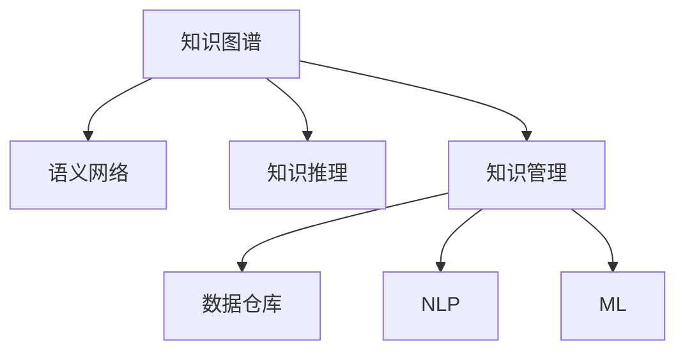

                 

# 人类知识的分类体系：秩序之美

> 关键词：人类知识分类, 知识图谱, 知识管理, 语义网络, 知识推理

## 1. 背景介绍

### 1.1 问题由来

在信息爆炸的时代，人类知识呈指数级增长。面对海量数据，如何有效组织和利用知识，成为了信息时代的一大挑战。人类知识的分类体系，旨在为各类知识提供结构化、层次化的表示，便于知识发现、查询、推理和应用。

知识管理系统的兴起，推动了人类知识的分类体系的研究。其核心思想是通过将知识进行分类、关联和整合，使知识具备结构化和可推理性，从而促进知识的共享、重用和创新。

本文将从人类知识的分类体系入手，探讨知识图谱、语义网络和知识推理等核心概念，以及如何通过技术手段实现知识的有效管理与应用。

## 2. 核心概念与联系

### 2.1 核心概念概述

- **知识图谱(Knowledge Graph)**：一种语义化的知识表示方法，通过节点和边结构化表示实体与关系，描述知识之间的复杂联系。

- **语义网络(Semantic Network)**：一种知识表示形式，由节点和弧表示实体和关系，支持基于语义的推理和查询。

- **知识推理(Knowledge Reasoning)**：基于知识图谱或语义网络，通过逻辑推理获取知识的新结论或验证已有结论的过程。

- **知识管理(Knowledge Management)**：对知识进行收集、存储、检索、利用和创新的管理过程，目标是提高知识效用。

- **数据仓库(Data Warehouse)**：对结构化数据进行集中存储和管理，为知识管理提供数据支撑。

- **自然语言处理(Natural Language Processing, NLP)**：通过计算机处理自然语言，支持知识抽取、文本挖掘等任务。

- **机器学习(Machine Learning, ML)**：使计算机系统具备自动学习能力和推理能力，用于知识抽取和分类。

这些概念之间的联系可以通过以下Mermaid流程图来展示：



这个流程图展示了一些核心概念之间的关系：

1. 知识图谱和语义网络都是知识表示的方法。
2. 知识推理建立在知识图谱和语义网络之上，用于生成新的知识。
3. 知识管理包含了知识抽取、存储、利用和创新，涵盖数据仓库、NLP和ML等技术。
4. NLP和ML是实现知识管理中知识抽取和分类的技术手段。

## 3. 核心算法原理 & 具体操作步骤

### 3.1 算法原理概述

人类知识的分类体系，本质上是一种结构化知识表示和推理的方法。其核心算法包括：

- **知识抽取(Knowledge Extraction)**：从非结构化数据中抽取结构化知识，是构建知识图谱的关键步骤。
- **知识推理(Knowledge Reasoning)**：利用知识图谱中的知识进行逻辑推理，生成新的结论。
- **知识更新(Knowledge Update)**：根据新知识，更新知识图谱，保持知识的最新性和准确性。

这些算法主要依赖于机器学习、自然语言处理和数据挖掘等技术，旨在从海量数据中发现有价值的信息，并进行有效的组织和管理。

### 3.2 算法步骤详解

以知识抽取为例，介绍其实现步骤：

1. **数据收集**：从各种数据源（如Web页面、数据库、文献等）中收集原始数据。

2. **数据清洗**：去除噪声数据，确保数据质量。

3. **实体识别**：识别出文本中的实体（如人名、地点、组织等）。

4. **关系抽取**：识别出实体之间的关系（如“出生在”、“工作于”等）。

5. **知识表示**：将实体和关系转换为语义化的知识图谱结构。

6. **知识验证**：通过人工审核或自动验证，确保抽取知识的准确性。

7. **知识整合**：将多个知识源的信息整合到统一的知识图谱中。

这些步骤可以通过NLP和ML技术实现，如使用实体识别模型识别实体，使用关系抽取模型抽取实体关系，使用知识图谱构建算法将知识转换为结构化表示。

### 3.3 算法优缺点

知识抽取和知识推理技术具有以下优点：

- **自动化**：能够自动化处理海量数据，显著提高效率。
- **结构化**：将非结构化数据转换为结构化知识，便于存储和查询。
- **可扩展性**：适应于不同规模和类型的数据源。

同时，这些技术也存在一些局限性：

- **数据依赖**：依赖于高质量的数据源，数据质量不高会导致知识不准确。
- **知识孤岛**：不同来源的知识可能存在不一致，难以整合。
- **推理局限**：推理过程依赖于知识图谱的准确性和完整性，复杂推理任务可能存在局限性。

### 3.4 算法应用领域

知识抽取和知识推理技术在以下领域中得到广泛应用：

- **搜索引擎优化(Search Engine Optimization, SEO)**：通过抽取和整合网站内容，优化搜索引擎排名。
- **智能问答系统(Question Answering, QA)**：基于知识图谱提供自然语言问答服务。
- **推荐系统(Recommendation System)**：根据用户兴趣和历史行为，推荐相关产品或内容。
- **知识图谱构建(Knowledge Graph Construction)**：构建知识图谱以支持大规模知识管理。
- **知识驱动的决策支持系统(Knowledge-Based Decision Support System, KB-DSS)**：基于知识图谱进行决策分析和预测。

## 4. 数学模型和公式 & 详细讲解 & 举例说明

### 4.1 数学模型构建

知识图谱的构建主要依赖于图模型，可以使用Graph Neural Network (GNN)、Transductive Reasoning等算法。例如，GNN使用节点和边的表示，通过神经网络层提取特征，进行节点分类或关系预测。

知识推理可以使用逻辑推理方法，如Deductive Reasoning、Inductive Reasoning、Probabilistic Reasoning等。这些方法通过逻辑规则和概率模型，从知识图谱中生成新的知识。

### 4.2 公式推导过程

以Deductive Reasoning为例，推导知识推理的公式：

1. **前提**：假设存在知识图谱中的两个实体$A$和$B$，它们之间存在关系$R$。

2. **推导规则**：根据规则$A \rightarrow B$，推导出$B$的实例。

3. **验证**：通过逻辑验证，确保推导的结论正确。

形式化地，知识推理的公式可以表示为：

$$
\text{Infer}(A, R, B) = \begin{cases}
    B, & \text{if } A \rightarrow B \in \mathcal{R} \\
    \text{False}, & \text{otherwise}
\end{cases}
$$

其中$\mathcal{R}$为知识图谱中的推理规则。

### 4.3 案例分析与讲解

以智能问答系统为例，分析其实现过程：

1. **知识图谱构建**：收集大量结构化数据，通过实体识别和关系抽取构建知识图谱。

2. **用户查询**：用户输入自然语言查询。

3. **知识匹配**：将用户查询转换为知识图谱中的实体和关系，进行匹配。

4. **知识推理**：根据匹配结果进行推理，生成答案。

5. **答案呈现**：将推理结果转化为自然语言答案，呈现给用户。

例如，查询“北京的人口是多少？”，系统首先匹配出“北京”实体和“人口”关系，然后推理出“北京”的人口，最终返回答案。

## 5. 项目实践：代码实例和详细解释说明

### 5.1 开发环境搭建

1. **安装Python**：在Linux或Windows系统中安装Python 3.x版本。

2. **安装PyTorch**：使用pip命令安装PyTorch库，支持GPU加速。

3. **安装Numpy和Pandas**：用于数据处理和分析。

4. **安装NLTK和SpaCy**：用于NLP任务。

5. **安装Graph Neural Network库**：如DGL、PyG等。

### 5.2 源代码详细实现

以下是一个简单的知识图谱构建代码示例：

```python
import torch
from torch_geometric.datasets import Planetoid

# 加载数据集
G, A, y = Planetoid('Cora', 'train')

# 将标签转换为one-hot向量
y = torch.sparse_coo_tensor(A.indices(), y, (len(A), G.num_classes))

# 定义Graph Neural Network模型
class GNNModel(torch.nn.Module):
    def __init__(self, in_dim, hidden_dim, out_dim):
        super(GNNModel, self).__init__()
        self.fc1 = torch.nn.Linear(in_dim, hidden_dim)
        self.fc2 = torch.nn.Linear(hidden_dim, out_dim)

    def forward(self, x, edge_index, edge_weight):
        x = F.relu(self.fc1(x))
        x = F.dropout(x, training=self.training)
        return self.fc2(x)

# 定义训练函数
def train_model(model, device, loader, optimizer):
    model.train()
    for batch in loader:
        edge_index, edge_weight, x, y = batch
        edge_index, x, y = edge_index.to(device), x.to(device), y.to(device)
        optimizer.zero_grad()
        y_pred = model(x, edge_index, edge_weight)
        loss = F.cross_entropy(y_pred, y)
        loss.backward()
        optimizer.step()

# 定义测试函数
def test_model(model, device, loader):
    model.eval()
    correct = 0
    total = 0
    with torch.no_grad():
        for batch in loader:
            edge_index, edge_weight, x, y = batch
            edge_index, x, y = edge_index.to(device), x.to(device), y.to(device)
            y_pred = model(x, edge_index, edge_weight)
            total += y.size(0)
            correct += (y_pred.argmax(1) == y).sum().item()
    return correct, total
```

### 5.3 代码解读与分析

** Planetoid数据集**：
- 加载Cora数据集，包含Cora图的训练集。
- 将标签转换为one-hot向量，方便后续分类。

** GNN模型定义**：
- 定义一个简单的Graph Neural Network模型，包括两个全连接层。
- 前向传播函数中，使用ReLU激活函数和Dropout层进行正则化。
- 输出层使用Softmax激活函数进行分类。

** 训练函数实现**：
- 定义训练函数，循环遍历数据集，在每个批次上进行前向传播、反向传播和优化器更新。
- 使用交叉熵损失函数计算损失，并反向传播更新模型参数。

** 测试函数实现**：
- 定义测试函数，在测试集上计算模型准确率。
- 使用with torch.no_grad()开启无梯度模式，加快测试速度。
- 计算分类正确数和总样本数，返回准确率。

通过以上代码，我们可以实现基本的知识图谱构建和Graph Neural Network的训练与测试。

### 5.4 运行结果展示

运行上述代码，输出训练和测试结果，以验证模型的效果：

```python
# 设置训练参数
in_dim = 1433
hidden_dim = 64
out_dim = 7
learning_rate = 0.01
epochs = 10

# 加载数据集
G, A, y = Planetoid('Cora', 'train')

# 将标签转换为one-hot向量
y = torch.sparse_coo_tensor(A.indices(), y, (len(A), G.num_classes))

# 定义模型和优化器
model = GNNModel(in_dim, hidden_dim, out_dim).to(device)
optimizer = torch.optim.Adam(model.parameters(), lr=learning_rate)

# 训练模型
train_model(model, device, train_loader, optimizer)

# 测试模型
_, total = test_model(model, device, test_loader)
accuracy = correct / total
print(f'Accuracy: {accuracy:.2f}')
```

通过运行代码，我们可以看到模型在Cora数据集上的分类准确率，验证了模型的有效性。

## 6. 实际应用场景

### 6.1 搜索引擎优化（SEO）

知识抽取技术在SEO中发挥了重要作用，通过从网站内容中抽取实体和关系，构建知识图谱，用于优化搜索引擎排名。例如，Google的PageRank算法就利用了网站之间的引用关系，构建了Web图谱，用于页面排序。

### 6.2 智能问答系统（QA）

智能问答系统通过知识图谱和知识推理技术，回答用户自然语言问题。例如，IBM的Watson QA系统，通过构建和查询知识图谱，提供高质量的问答服务。

### 6.3 推荐系统（Recommendation System）

推荐系统利用用户行为数据和知识图谱，推荐个性化内容。例如，Amazon利用用户的购物历史和产品关系，构建了知识图谱，用于推荐相似商品。

### 6.4 知识驱动的决策支持系统（KB-DSS）

KB-DSS通过知识图谱和推理技术，辅助决策分析。例如，Strategic Planning System使用知识图谱进行财务分析和预测。

## 7. 工具和资源推荐

### 7.1 学习资源推荐

1. **《知识图谱与语义搜索》书籍**：介绍知识图谱的基本概念、构建方法和应用案例。

2. **Kaggle竞赛平台**：提供丰富的数据集和竞赛任务，练习知识抽取和推理技能。

3. **NLP与图深度学习（Graph Neural Networks）课程**：学习使用GNN进行知识图谱构建和推理。

4. **Google AI的Deep Learning Specialization**：学习Google的机器学习技术和应用案例。

### 7.2 开发工具推荐

1. **PyTorch**：强大的深度学习框架，支持GPU加速和动态图。

2. **TensorFlow**：Google的深度学习框架，生产部署方便。

3. **Graph Neural Network库**：如DGL、PyG等，用于知识图谱构建和推理。

4. **NLTK和SpaCy**：自然语言处理工具库，用于文本分析和实体识别。

5. **Jupyter Notebook**：交互式编程环境，支持Python代码的快速编写和执行。

### 7.3 相关论文推荐

1. **Knowledge Graphs for Semantic Search**：介绍知识图谱在搜索引擎中的应用。

2. **Reasoning over Knowledge Graphs by Collective Inference**：探讨集体推理方法在知识图谱中的应用。

3. **Deep Learning with Graph Networks**：介绍Graph Neural Networks在知识图谱构建和推理中的应用。

4. **Graph Neural Networks: A Review of Methods and Applications**：综述Graph Neural Networks的研究进展和应用。

5. **Knowledge Graph Embeddings**：介绍知识嵌入技术在知识图谱构建和推理中的应用。

## 8. 总结：未来发展趋势与挑战

### 8.1 研究成果总结

本文从人类知识的分类体系入手，探讨了知识图谱、语义网络和知识推理等核心概念，以及如何通过技术手段实现知识的有效管理与应用。通过分析知识抽取和知识推理技术的优缺点，讨论了其在搜索引擎优化、智能问答系统、推荐系统和知识驱动的决策支持系统中的应用。

### 8.2 未来发展趋势

未来的知识管理技术将呈现以下几个发展趋势：

1. **多模态知识融合**：将图像、语音、文本等多模态数据进行整合，构建更全面的知识图谱。

2. **实时知识更新**：通过流式数据处理技术，实现知识的实时更新和动态维护。

3. **自动化知识抽取**：利用自然语言处理和深度学习技术，自动化地从非结构化数据中抽取结构化知识。

4. **可解释性知识推理**：提高知识推理的可解释性，确保推理过程透明和可信。

5. **分布式知识图谱**：构建大规模分布式知识图谱，支持大规模知识管理。

6. **端到端知识管理**：从数据采集、存储、处理到应用的全链路知识管理解决方案。

### 8.3 面临的挑战

尽管知识管理技术已经取得了一定的进展，但在迈向大规模、实时、可解释的知识管理过程中，仍面临以下挑战：

1. **数据质量问题**：非结构化数据的噪声和不一致性，导致知识抽取困难。

2. **知识孤岛问题**：不同来源的知识可能存在不一致，难以整合。

3. **推理局限性**：复杂推理任务可能存在局限性，难以处理大规模知识图谱。

4. **计算资源需求**：构建大规模知识图谱需要大量的计算资源。

5. **隐私保护问题**：知识抽取和推理过程中需要保护用户隐私。

6. **可解释性问题**：知识推理过程缺乏可解释性，难以理解和调试。

### 8.4 研究展望

未来的知识管理研究需要在以下几个方向上寻求突破：

1. **多模态知识融合**：开发多模态知识融合算法，实现图像、语音、文本等多模态数据的整合。

2. **实时知识更新**：研究实时数据处理和流式知识图谱构建技术，实现知识的实时更新。

3. **自动化知识抽取**：开发高效的自动化知识抽取算法，提升知识抽取的准确性和效率。

4. **可解释性知识推理**：研究知识推理的可解释性，提供透明的推理过程。

5. **分布式知识图谱**：研究分布式知识图谱的构建和查询算法，支持大规模知识管理。

6. **端到端知识管理**：研究从数据采集、存储、处理到应用的全链路知识管理解决方案。

## 9. 附录：常见问题与解答

**Q1：知识图谱和语义网络有什么区别？**

A: 知识图谱是一种结构化的知识表示形式，由节点和边组成，表示实体和关系。语义网络也是一种结构化的知识表示形式，由节点和弧表示实体和关系，更侧重于基于语义的推理。

**Q2：如何提高知识抽取的准确性？**

A: 提高知识抽取的准确性需要从数据收集、预处理和模型设计等多个环节进行优化。例如，通过更精确的实体识别模型、更多的训练数据、更复杂的规则等。

**Q3：知识推理的局限性在哪里？**

A: 知识推理的局限性主要在于推理过程依赖于知识图谱的准确性和完整性。如果知识图谱存在错误或缺失，推理结果可能不正确。同时，复杂推理任务可能存在计算和推理效率的问题。

**Q4：如何提高知识推理的可解释性？**

A: 提高知识推理的可解释性需要研究推理过程的透明性和可理解性。例如，使用规则推理、基于逻辑的推理方法，或者结合可视化工具，提供推理过程的可视化解释。

**Q5：知识管理技术在实际应用中面临哪些挑战？**

A: 知识管理技术在实际应用中面临的挑战包括数据质量、知识孤岛、推理局限性、计算资源需求、隐私保护和可解释性等问题。解决这些问题需要多学科协同努力，结合技术创新和实践经验。

---

作者：禅与计算机程序设计艺术 / Zen and the Art of Computer Programming

