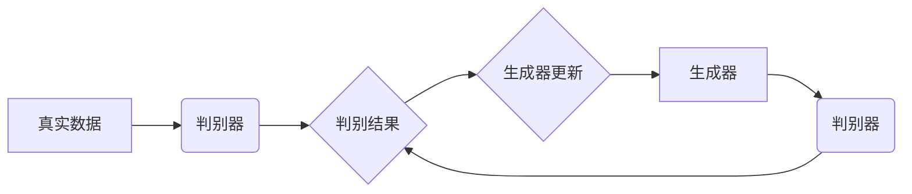

> GAN, 判别器, 生成器, 对抗训练, 深度学习, 图像生成

## 1. 背景介绍

生成对抗网络 (Generative Adversarial Networks, GANs) 是一种近年来备受关注的深度学习模型，它由两个相互竞争的网络组成：生成器 (Generator) 和判别器 (Discriminator)。GANs 的核心思想是通过对抗训练来生成逼真、高质量的样本数据。

判别器是 GANs 中负责识别真实数据和生成数据的网络。它就像一个“鉴别专家”，通过学习真实数据的特征，能够区分真实数据和生成数据。判别器的训练目标是尽可能准确地识别出真实数据和生成数据。

## 2. 核心概念与联系

GANs 的核心概念是“对抗训练”。生成器试图生成逼真的数据样本，而判别器试图识别出这些样本是真实数据还是生成数据。这两个网络在不断地相互竞争和学习，最终使得生成器能够生成越来越逼真的数据样本。

**GANs 架构流程图:**



## 3. 核心算法原理 & 具体操作步骤

### 3.1  算法原理概述

判别器的核心算法原理是基于分类模型，它学习真实数据和生成数据的特征差异，并根据这些差异进行分类。判别器通常是一个神经网络，它接收数据样本作为输入，并输出一个概率值，表示该样本是真实数据的概率。

### 3.2  算法步骤详解

1. **初始化判别器网络参数:** 随机初始化判别器网络的参数。
2. **训练判别器:**
    * 从真实数据集中随机抽取数据样本，输入到判别器网络中，并计算判别器的输出结果。
    * 从生成器生成的样本集中随机抽取数据样本，输入到判别器网络中，并计算判别器的输出结果。
    * 计算判别器的损失函数，损失函数通常是二分类交叉熵损失函数。
    * 使用梯度下降算法更新判别器网络的参数，使得损失函数最小化。
3. **训练生成器:**
    * 使用训练好的判别器网络，对生成器生成的样本进行评估。
    * 计算生成器的损失函数，损失函数通常是判别器输出的概率值，即生成器生成的样本被判别器识别为真实数据的概率。
    * 使用梯度下降算法更新生成器网络的参数，使得损失函数最小化。
4. **重复步骤2和3:** 持续训练判别器和生成器，直到生成器能够生成逼真的数据样本。

### 3.3  算法优缺点

**优点:**

* 可以生成逼真的数据样本。
* 能够学习数据的复杂分布。
* 适用于各种类型的数据生成任务。

**缺点:**

* 训练过程比较复杂，容易陷入局部最优解。
* 需要大量的训练数据。
* 判别器和生成器之间的博弈过程可能导致训练不稳定。

### 3.4  算法应用领域

GANs 广泛应用于以下领域：

* **图像生成:** 生成逼真的图像，例如人脸、风景、物体等。
* **文本生成:** 生成逼真的文本，例如文章、故事、对话等。
* **音频生成:** 生成逼真的音频，例如音乐、语音等。
* **视频生成:** 生成逼真的视频，例如电影片段、动画等。
* **数据增强:** 生成新的训练数据，提高模型的泛化能力。

## 4. 数学模型和公式 & 详细讲解 & 举例说明

### 4.1  数学模型构建

判别器的数学模型是一个分类模型，其目标是最大化识别真实数据和生成数据的准确率。

**判别器网络输出:**

$$
p(x \in R) = \sigma(W^T x + b)
$$

其中：

* $x$ 是输入数据样本。
* $W$ 是判别器网络的权重矩阵。
* $b$ 是判别器网络的偏置向量。
* $\sigma$ 是 sigmoid 函数，将输出值映射到 [0, 1] 的区间内。

**判别器损失函数:**

$$
L_D = - \frac{1}{m} \sum_{i=1}^{m} \left[ y_i \log(p(x_i \in R)) + (1 - y_i) \log(1 - p(x_i \in R)) \right]
$$

其中：

* $m$ 是训练样本的数量。
* $y_i$ 是真实标签，1 表示真实数据，0 表示生成数据。
* $p(x_i \in R)$ 是判别器对样本 $x_i$ 属于真实数据的概率预测值。

### 4.2  公式推导过程

判别器损失函数的推导过程基于二分类交叉熵损失函数。

**二分类交叉熵损失函数:**

$$
H(p, q) = - \sum_{i=1}^{n} p_i \log(q_i)
$$

其中：

* $p$ 是真实概率分布。
* $q$ 是预测概率分布。

**判别器损失函数推导:**

1. 将二分类交叉熵损失函数应用于判别器网络的输出结果。
2. 考虑真实数据和生成数据的标签信息，分别计算真实数据和生成数据的损失项。
3. 将损失项相加，得到判别器损失函数。

### 4.3  案例分析与讲解

假设我们训练一个判别器来识别猫和狗的图片。

* **真实数据:** 猫和狗的图片。
* **生成数据:** 由生成器生成的猫和狗的图片。

判别器需要学习区分猫和狗的特征，例如耳朵形状、尾巴长度、毛发颜色等。

训练过程中，判别器会不断地对真实数据和生成数据进行分类，并根据分类结果更新其参数。最终，判别器能够准确地识别出猫和狗的图片。

## 5. 项目实践：代码实例和详细解释说明

### 5.1  开发环境搭建

* Python 3.x
* TensorFlow 或 PyTorch 深度学习框架
* Jupyter Notebook 或 VS Code 代码编辑器

### 5.2  源代码详细实现

```python
import tensorflow as tf

# 定义判别器网络
def build_discriminator(input_shape):
    model = tf.keras.Sequential([
        tf.keras.layers.Input(shape=input_shape),
        tf.keras.layers.Conv2D(32, (3, 3), activation='relu', padding='same'),
        tf.keras.layers.MaxPooling2D((2, 2)),
        tf.keras.layers.Conv2D(64, (3, 3), activation='relu', padding='same'),
        tf.keras.layers.MaxPooling2D((2, 2)),
        tf.keras.layers.Flatten(),
        tf.keras.layers.Dense(1, activation='sigmoid')
    ])
    return model

# 定义判别器损失函数
def discriminator_loss(real_output, fake_output):
    real_loss = tf.keras.losses.BinaryCrossentropy()(tf.ones_like(real_output), real_output)
    fake_loss = tf.keras.losses.BinaryCrossentropy()(tf.zeros_like(fake_output), fake_output)
    total_loss = real_loss + fake_loss
    return total_loss

# ... (其他代码实现)
```

### 5.3  代码解读与分析

* **`build_discriminator(input_shape)`:** 定义判别器网络结构，包含卷积层、池化层和全连接层。
* **`discriminator_loss(real_output, fake_output)`:** 定义判别器损失函数，计算真实数据和生成数据的分类损失。
* **`...`:** 其他代码实现，例如生成器网络、训练循环等。

### 5.4  运行结果展示

训练完成后，可以评估判别器的性能，例如计算准确率、召回率等指标。

## 6. 实际应用场景

GANs 在图像生成、文本生成、音频生成、视频生成等领域有着广泛的应用场景。

### 6.1  图像生成

* **人脸生成:** 生成逼真的人脸图像，用于身份验证、虚拟助手等应用。
* **风景生成:** 生成逼真的风景图像，用于游戏、电影特效等应用。
* **物体生成:** 生成逼真的物体图像，用于3D建模、产品设计等应用。

### 6.2  文本生成

* **文章生成:** 生成逼真的文章内容，用于新闻报道、博客文章等应用。
* **故事生成:** 生成逼真的故事内容，用于娱乐、教育等应用。
* **对话生成:** 生成逼真的对话内容，用于聊天机器人、虚拟助手等应用。

### 6.3  音频生成

* **音乐生成:** 生成逼真的音乐旋律，用于音乐创作、背景音乐等应用。
* **语音生成:** 生成逼真的语音合成，用于语音助手、语音识别等应用。
* **音效生成:** 生成逼真的音效，用于游戏、电影特效等应用。

### 6.4  未来应用展望

随着 GANs 技术的不断发展，其应用场景将会更加广泛。

* **医疗领域:** 生成医学图像、预测疾病风险等。
* **金融领域:** 生成金融数据、识别欺诈行为等。
* **教育领域:** 生成个性化学习内容、模拟真实场景等。

## 7. 工具和资源推荐

### 7.1  学习资源推荐

* **书籍:**
    * "Generative Deep Learning" by David Foster
    * "Deep Learning" by Ian Goodfellow, Yoshua Bengio, and Aaron Courville
* **在线课程:**
    * Coursera: "Generative Adversarial Networks" by DeepLearning.AI
    * Udacity: "Deep Learning Nanodegree"
* **博客和网站:**
    * Distill.pub
    * Towards Data Science

### 7.2  开发工具推荐

* **TensorFlow:** https://www.tensorflow.org/
* **PyTorch:** https://pytorch.org/
* **Keras:** https://keras.io/

### 7.3  相关论文推荐

* "Generative Adversarial Networks" by Ian Goodfellow et al. (2014)
* "Improved Techniques for Training GANs" by Alec Radford et al. (2015)
* "Progressive Growing of GANs for Improved Quality, Stability, and Variation" by Tero Karras et al. (2017)

## 8. 总结：未来发展趋势与挑战

### 8.1  研究成果总结

GANs 已经取得了显著的成果，在图像生成、文本生成、音频生成等领域取得了突破性的进展。

### 8.2  未来发展趋势

* **模型架构创新:** 研究更有效的 GANs 模型架构，例如 StyleGAN、BigGAN 等。
* **训练稳定性提升:** 研究更稳定的 GANs 训练方法，例如 WGAN、LSGAN 等。
* **应用场景拓展:** 将 GANs 应用于更多领域，例如医疗、金融、教育等。

### 8.3  面临的挑战

* **训练难度:** GANs 训练过程复杂，容易陷入局部最优解。
* **模式崩溃:** 生成器可能生成模式单一、缺乏多样性的样本。
* **伦理问题:** GANs 可以生成逼真的虚假信息，可能被用于恶意目的。

### 8.4  研究展望

未来，GANs 研究将继续朝着更有效、更稳定、更安全的方向发展。


## 9. 附录：常见问题与解答

**Q1: GANs 的训练过程为什么容易陷入局部最优解？**