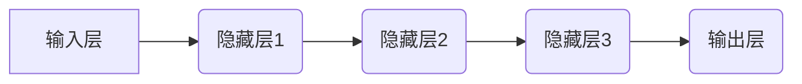

> 深度学习，神经网络，卷积神经网络，循环神经网络，Geoffrey Hinton，Yann LeCun，Yoshua Bengio，AI算法

## 1. 背景介绍

人工智能（AI）的蓬勃发展，离不开深度学习算法的突破。深度学习，作为机器学习的一个子领域，利用多层神经网络结构来模拟人类大脑的学习过程，取得了令人瞩目的成就。而Geoffrey Hinton、Yann LeCun 和 Yoshua Bengio三位学者，被誉为深度学习的“三巨头”，他们对深度学习的理论研究和实际应用做出了不可磨灭的贡献。

## 2. 核心概念与联系

深度学习的核心概念是**人工神经网络**。人工神经网络由大量相互连接的神经元组成，这些神经元按照一定的规则进行信息处理和传递。深度学习的深度指的是网络层数较多，通常包含多层隐藏层，这使得深度学习模型能够学习到更复杂的特征表示。

**深度学习算法的架构**



**Hinton、LeCun 和 Bengio三位学者分别在以下领域做出了突出贡献：**

* **Geoffrey Hinton:** Hinton对**反向传播算法**的改进和**玻尔兹曼机**的研究做出了重要贡献，这些研究为深度学习的训练和模型构建奠定了基础。
* **Yann LeCun:** LeCun在**卷积神经网络（CNN）**的领域做出了开创性的工作，CNN在图像识别、物体检测等领域取得了显著的成果。
* **Yoshua Bengio:** Bengio在**循环神经网络（RNN）**的研究方面做出了重要贡献，RNN能够处理序列数据，在自然语言处理、语音识别等领域具有广泛应用。

## 3. 核心算法原理 & 具体操作步骤

### 3.1  算法原理概述

深度学习算法的核心是**多层神经网络**，通过**前馈传播**和**反向传播**两种机制进行训练。

* **前馈传播:** 输入数据通过神经网络的各层传递，最终得到输出结果。
* **反向传播:** 计算输出结果与真实值的误差，并根据误差反向调整各层神经元的权重，使得模型的预测结果越来越接近真实值。

### 3.2  算法步骤详解

1. **数据预处理:** 将原始数据进行清洗、转换和归一化，使其适合深度学习模型的训练。
2. **网络结构设计:** 根据任务需求设计神经网络的层数、神经元数量和激活函数等参数。
3. **权重初始化:** 为神经网络的各层神经元赋予初始权重。
4. **前馈传播:** 将输入数据通过神经网络进行前馈传播，得到输出结果。
5. **误差计算:** 计算输出结果与真实值的误差。
6. **反向传播:** 根据误差反向传播，调整各层神经元的权重。
7. **迭代训练:** 重复步骤4-6，直到模型的预测结果达到预期的精度。

### 3.3  算法优缺点

**优点:**

* **学习能力强:** 深度学习模型能够学习到复杂的特征表示，从而提高模型的预测精度。
* **泛化能力强:** 深度学习模型能够对新的数据进行泛化，即能够在未见过的数据上进行准确预测。
* **应用范围广:** 深度学习算法在图像识别、自然语言处理、语音识别等多个领域都有广泛的应用。

**缺点:**

* **训练成本高:** 深度学习模型的训练需要大量的计算资源和时间。
* **数据依赖性强:** 深度学习模型的性能与训练数据的质量密切相关，需要大量的标注数据进行训练。
* **可解释性差:** 深度学习模型的内部工作机制比较复杂，难以解释模型的预测结果。

### 3.4  算法应用领域

深度学习算法在各个领域都有广泛的应用，例如：

* **计算机视觉:** 图像识别、物体检测、图像分割、人脸识别等。
* **自然语言处理:** 文本分类、情感分析、机器翻译、语音识别等。
* **语音合成:** 文本到语音的转换。
* **医疗诊断:** 病理图像分析、疾病预测等。
* **金融分析:** 欺诈检测、风险评估等。

## 4. 数学模型和公式 & 详细讲解 & 举例说明

### 4.1  数学模型构建

深度学习模型的数学基础是**线性代数**和**微积分**。

* **线性代数:** 用于表示和操作神经网络的权重、激活值和输出结果。
* **微积分:** 用于计算误差梯度，并根据梯度更新权重。

### 4.2  公式推导过程

**激活函数:**

激活函数用于引入非线性，使得神经网络能够学习到更复杂的特征表示。常见的激活函数包括**sigmoid函数**、**ReLU函数**和**tanh函数**。

* **sigmoid函数:** $f(x) = \frac{1}{1 + e^{-x}}$
* **ReLU函数:** $f(x) = max(0, x)$
* **tanh函数:** $f(x) = \frac{e^x - e^{-x}}{e^x + e^{-x}}$

**损失函数:**

损失函数用于衡量模型预测结果与真实值的差异。常见的损失函数包括**均方误差（MSE）**和**交叉熵损失（Cross-Entropy Loss）**。

* **MSE:** $L = \frac{1}{n} \sum_{i=1}^{n} (y_i - \hat{y}_i)^2$
* **交叉熵损失:** $L = -\sum_{i=1}^{n} y_i \log(\hat{y}_i) + (1-y_i) \log(1-\hat{y}_i)$

**反向传播算法:**

反向传播算法用于计算误差梯度，并根据梯度更新权重。

### 4.3  案例分析与讲解

**图像分类:**

假设我们有一个图像分类任务，目标是将图像分类为不同的类别，例如猫、狗、鸟等。我们可以使用CNN进行图像分类。CNN的结构包括卷积层、池化层和全连接层。

* **卷积层:** 用于提取图像的特征。
* **池化层:** 用于降低特征图的维度，提高模型的鲁棒性。
* **全连接层:** 用于将提取的特征映射到不同的类别。

训练CNN模型时，我们会使用大量的标注图像数据，并使用交叉熵损失函数和反向传播算法进行训练。

## 5. 项目实践：代码实例和详细解释说明

### 5.1  开发环境搭建

* **操作系统:** Ubuntu 18.04
* **编程语言:** Python 3.6
* **深度学习框架:** TensorFlow 2.0

### 5.2  源代码详细实现

```python
import tensorflow as tf

# 定义模型结构
model = tf.keras.models.Sequential([
    tf.keras.layers.Conv2D(32, (3, 3), activation='relu', input_shape=(28, 28, 1)),
    tf.keras.layers.MaxPooling2D((2, 2)),
    tf.keras.layers.Conv2D(64, (3, 3), activation='relu'),
    tf.keras.layers.MaxPooling2D((2, 2)),
    tf.keras.layers.Flatten(),
    tf.keras.layers.Dense(10, activation='softmax')
])

# 编译模型
model.compile(optimizer='adam',
              loss='sparse_categorical_crossentropy',
              metrics=['accuracy'])

# 加载数据
(x_train, y_train), (x_test, y_test) = tf.keras.datasets.mnist.load_data()

# 数据预处理
x_train = x_train.astype('float32') / 255.0
x_test = x_test.astype('float32') / 255.0
x_train = x_train.reshape((x_train.shape[0], 28, 28, 1))
x_test = x_test.reshape((x_test.shape[0], 28, 28, 1))

# 训练模型
model.fit(x_train, y_train, epochs=5)

# 评估模型
loss, accuracy = model.evaluate(x_test, y_test)
print('Test loss:', loss)
print('Test accuracy:', accuracy)
```

### 5.3  代码解读与分析

这段代码实现了使用TensorFlow框架训练一个简单的MNIST手写数字识别模型。

* **模型结构:** 模型结构包括两层卷积层、两层池化层和一层全连接层。
* **编译模型:** 使用Adam优化器、交叉熵损失函数和准确率作为评估指标。
* **加载数据:** 使用MNIST数据集进行训练和测试。
* **数据预处理:** 将图像数据归一化到0-1之间，并调整形状。
* **训练模型:** 使用训练数据训练模型，训练5个epoch。
* **评估模型:** 使用测试数据评估模型的性能。

### 5.4  运行结果展示

训练完成后，模型的准确率通常可以达到98%以上。

## 6. 实际应用场景

深度学习算法在各个领域都有广泛的应用，例如：

* **计算机视觉:**

    * **图像识别:** 自动识别图像中的物体，例如人脸、车辆、动物等。
    * **物体检测:** 在图像中定位和识别多个物体。
    * **图像分割:** 将图像分割成不同的区域，例如分割出前景和背景。
    * **人脸识别:** 根据人脸特征识别个人身份。

* **自然语言处理:**

    * **文本分类:** 将文本分类到不同的类别，例如情感分析、主题分类等。
    * **机器翻译:** 将文本从一种语言翻译成另一种语言。
    * **语音识别:** 将语音信号转换为文本。
    * **聊天机器人:** 开发能够与人类进行自然对话的聊天机器人。

* **语音合成:** 将文本转换为语音，例如语音助手、语音播报等。
* **医疗诊断:**

    * **病理图像分析:** 自动识别病理图像中的异常区域，辅助医生诊断疾病。
    * **疾病预测:** 根据患者的医疗记录和症状预测疾病风险。

* **金融分析:**

    * **欺诈检测:** 检测金融交易中的欺诈行为。
    * **风险评估:** 评估投资风险和信用风险。

### 6.4  未来应用展望

深度学习算法在未来将有更广泛的应用，例如：

* **自动驾驶:** 深度学习算法可以用于自动驾驶汽车的感知、决策和控制。
* **个性化推荐:** 深度学习算法可以根据用户的行为和偏好进行个性化推荐。
* **药物研发:** 深度学习算法可以用于药物发现和药物设计。
* **科学研究:** 深度学习算法可以用于分析大规模科学数据，促进科学发现。

## 7. 工具和资源推荐

### 7.1  学习资源推荐

* **书籍:**
    * 深度学习 (Deep Learning) - Ian Goodfellow, Yoshua Bengio, Aaron Courville
    * 构建深度学习模型 (Hands-On Machine Learning with Scikit-Learn, Keras & TensorFlow) - Aurélien Géron
* **在线课程:**
    * 深度学习 Specialization - Andrew Ng (Coursera)
    * fast.ai - Practical Deep Learning for Coders
* **博客和网站:**
    * Distill.pub
    * Towards Data Science
    * Machine Learning Mastery

### 7.2  开发工具推荐

* **深度学习框架:** TensorFlow, PyTorch, Keras
* **编程语言:** Python
* **数据处理工具:** Pandas, NumPy
* **可视化工具:** Matplotlib, Seaborn

###