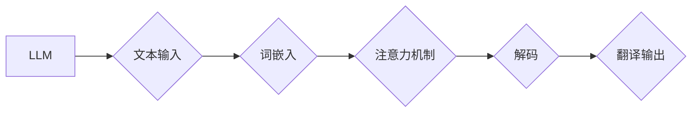

> Large Language Model (LLM), 语言翻译, 自然语言处理 (NLP), 机器学习, 深度学习, Transformer, BERT, T5

## 1. 背景介绍

语言是人类交流和理解世界的关键工具。然而，世界上的语言种类繁多，这造成了沟通障碍，阻碍了信息共享和跨文化交流。语言翻译作为解决这一问题的关键技术，一直以来备受关注。传统的机器翻译方法依赖于规则和统计模型，往往难以准确地捕捉语言的语义和文化背景。近年来，随着深度学习技术的飞速发展，基于大型语言模型 (LLM) 的机器翻译取得了显著的突破，展现出强大的翻译能力和潜力。

## 2. 核心概念与联系

**2.1  大型语言模型 (LLM)**

大型语言模型 (LLM) 是近年来深度学习领域取得的重大突破之一。它是一种基于 Transformer 架构的深度神经网络，通过训练海量文本数据，学习了语言的语法、语义和上下文关系。LLM 拥有强大的文本生成、理解和翻译能力，成为自然语言处理 (NLP) 领域的新兴明星。

**2.2  自然语言处理 (NLP)**

自然语言处理 (NLP) 是人工智能领域的一个重要分支，旨在使计算机能够理解、处理和生成人类语言。NLP 涵盖了多种任务，包括文本分类、情感分析、机器翻译、问答系统等。LLM 在 NLP 领域发挥着越来越重要的作用，为许多 NLP 任务提供了强大的工具和解决方案。

**2.3  机器翻译**

机器翻译是指利用计算机技术将一种语言文本翻译成另一种语言文本的过程。传统的机器翻译方法主要依赖于规则和统计模型，但这些方法往往难以准确地捕捉语言的语义和文化背景。基于 LLM 的机器翻译通过训练大量的平行文本数据，学习了语言之间的映射关系，能够生成更准确、更流畅的翻译结果。

**2.4  Transformer 架构**

Transformer 架构是 LLM 的核心技术之一。它是一种基于注意力机制的序列到序列模型，能够有效地捕捉文本中的长距离依赖关系。Transformer 架构的出现极大地推动了 LLM 的发展，使其能够处理更长、更复杂的文本序列。

**Mermaid 流程图**



## 3. 核心算法原理 & 具体操作步骤

**3.1  算法原理概述**

基于 LLM 的机器翻译主要基于以下核心算法原理：

* **词嵌入:** 将单词映射到低维向量空间，捕捉单词之间的语义关系。
* **注意力机制:** 允许模型关注输入序列中与当前输出词相关的部分，提高翻译的准确性和流畅度。
* **解码:** 根据输入序列和注意力机制的输出，生成目标语言的文本序列。

**3.2  算法步骤详解**

1. **预处理:** 将输入文本进行分词、词形还原等预处理操作。
2. **词嵌入:** 使用词嵌入模型将每个单词映射到低维向量空间。
3. **编码:** 使用 Transformer 编码器将输入文本序列编码成上下文表示。
4. **解码:** 使用 Transformer 解码器根据编码后的上下文表示，生成目标语言的文本序列。
5. **后处理:** 对翻译结果进行语法校正、拼写检查等后处理操作。

**3.3  算法优缺点**

**优点:**

* 准确率高: 基于 LLM 的机器翻译能够学习语言之间的复杂映射关系，生成更准确的翻译结果。
* 流畅度高: 注意力机制能够帮助模型捕捉长距离依赖关系，生成更流畅的翻译文本。
* 可扩展性强: LLM 可以通过训练更多数据和更大的模型规模来提高性能。

**缺点:**

* 计算资源消耗大: 训练和使用 LLM 需要大量的计算资源。
* 数据依赖性强: LLM 的性能取决于训练数据的质量和数量。
* 泛化能力有限: LLM 可能难以处理从未见过的词汇和语境。

**3.4  算法应用领域**

基于 LLM 的机器翻译技术在以下领域具有广泛的应用前景:

* **国际商务:** 帮助企业进行跨语言沟通和合作。
* **旅游业:** 提供便捷的语言翻译服务，方便游客出行。
* **教育:** 帮助学生学习外语，促进文化交流。
* **新闻媒体:** 快速准确地翻译新闻报道，及时传递信息。

## 4. 数学模型和公式 & 详细讲解 & 举例说明

**4.1  数学模型构建**

LLM 的核心数学模型是 Transformer 架构，它基于注意力机制和多头注意力机制来捕捉文本中的长距离依赖关系。

**4.2  公式推导过程**

Transformer 架构的核心公式包括：

* **注意力机制:**

$$
Attention(Q, K, V) = \frac{exp(Q \cdot K^T / \sqrt{d_k})}{exp(Q \cdot K^T / \sqrt{d_k})} \cdot V
$$

其中，Q、K、V 分别代表查询矩阵、键矩阵和值矩阵，$d_k$ 是键向量的维度。

* **多头注意力机制:**

$$
MultiHead(Q, K, V) = Concat(head_1, head_2, ..., head_h) \cdot W_o
$$

其中，$head_i$ 表示第 i 个注意力头的输出，$h$ 是多头数量，$W_o$ 是一个线性变换矩阵。

**4.3  案例分析与讲解**

例如，在机器翻译任务中，输入文本序列的每个单词会被编码成一个向量表示。然后，注意力机制会计算每个单词与目标语言单词之间的相关性，并根据相关性权重来生成翻译结果。

## 5. 项目实践：代码实例和详细解释说明

**5.1  开发环境搭建**

* Python 3.7+
* PyTorch 或 TensorFlow
* CUDA 和 cuDNN

**5.2  源代码详细实现**

```python
import torch
import torch.nn as nn

class Transformer(nn.Module):
    def __init__(self, vocab_size, embedding_dim, num_heads, num_layers):
        super(Transformer, self).__init__()
        self.embedding = nn.Embedding(vocab_size, embedding_dim)
        self.encoder = nn.TransformerEncoder(nn.TransformerEncoderLayer(embedding_dim, num_heads), num_layers)
        self.decoder = nn.TransformerDecoder(nn.TransformerDecoderLayer(embedding_dim, num_heads), num_layers)
        self.linear = nn.Linear(embedding_dim, vocab_size)

    def forward(self, src, tgt):
        src = self.embedding(src)
        tgt = self.embedding(tgt)
        src = self.encoder(src)
        tgt = self.decoder(tgt, src)
        output = self.linear(tgt)
        return output
```

**5.3  代码解读与分析**

* `Transformer` 类定义了 Transformer 模型的结构。
* `embedding` 层将单词映射到低维向量空间。
* `encoder` 和 `decoder` 层分别负责编码输入序列和解码目标序列。
* `linear` 层将解码后的输出映射回词汇表。

**5.4  运行结果展示**

通过训练和测试，可以评估模型的翻译准确率和流畅度。

## 6. 实际应用场景

**6.1  国际商务**

* 跨国公司可以使用机器翻译工具进行沟通，提高工作效率。
* 商业谈判和合同签署可以借助机器翻译工具进行更便捷的交流。

**6.2  旅游业**

* 旅游者可以使用机器翻译应用程序进行语言交流，方便出行。
* 旅游景点和酒店可以使用机器翻译工具提供多语言服务。

**6.3  教育**

* 学生可以使用机器翻译工具学习外语，提高语言学习效率。
* 教师可以使用机器翻译工具将教材翻译成不同语言，方便学生学习。

**6.4  未来应用展望**

* 基于 LLM 的机器翻译技术将更加准确、流畅和智能。
* 机器翻译将被集成到更多应用程序中，例如聊天机器人、语音助手等。
* 机器翻译将帮助打破语言障碍，促进全球文化交流和合作。

## 7. 工具和资源推荐

**7.1  学习资源推荐**

* **书籍:**
    * 《深度学习》
    * 《自然语言处理》
* **在线课程:**
    * Coursera: 自然语言处理
    * edX: 深度学习

**7.2  开发工具推荐**

* **PyTorch:** 深度学习框架
* **TensorFlow:** 深度学习框架
* **Hugging Face Transformers:** 预训练 Transformer 模型库

**7.3  相关论文推荐**

* 《Attention Is All You Need》
* 《BERT: Pre-training of Deep Bidirectional Transformers for Language Understanding》
* 《T5: Text-to-Text Transfer Transformer》

## 8. 总结：未来发展趋势与挑战

**8.1  研究成果总结**

基于 LLM 的机器翻译技术取得了显著的进展，能够生成更准确、更流畅的翻译结果。

**8.2  未来发展趋势**

* 模型规模和性能将继续提升。
* 模型将更加灵活和可定制。
* 机器翻译将更加智能化和个性化。

**8.3  面临的挑战**

* 数据标注成本高。
* 模型训练和部署成本高。
* 跨语言理解和文化差异仍然是一个挑战。

**8.4  研究展望**

* 开发更有效的训练方法和数据标注方法。
* 研究更强大的模型架构和算法。
* 探索跨语言理解和文化差异的解决方案。

## 9. 附录：常见问题与解答

**9.1  Q: 机器翻译和人工翻译有什么区别？**

**A:** 机器翻译使用计算机技术自动翻译文本，而人工翻译由人类翻译人员进行。机器翻译速度快，成本低，但准确性和流畅度可能不如人工翻译。

**9.2  Q: 基于 LLM 的机器翻译技术有哪些优势？**

**A:** 基于 LLM 的机器翻译技术具有更高的准确率、流畅度和可扩展性。

**9.3  Q: 如何评估机器翻译的质量？**

**A:** 机器翻译的质量可以根据 BLEU、ROUGE 等指标进行评估。

**9.4  Q: 基于 LLM 的机器翻译技术有哪些应用场景？**

**A:** 基于 LLM 的机器翻译技术在国际商务、旅游业、教育等领域具有广泛的应用前景。


作者：禅与计算机程序设计艺术 / Zen and the Art of Computer Programming 
<end_of_turn>