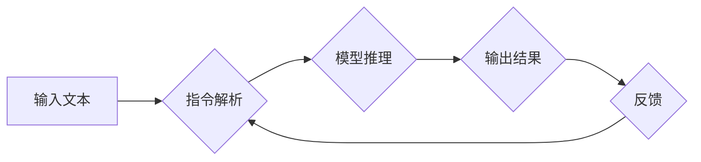

> Large Language Model (LLM), 指令集扩展, 泛化能力, 算法优化, 应用场景, 未来趋势

## 1. 背景介绍

大型语言模型 (Large Language Model, LLM) 近年来取得了令人瞩目的成就，在文本生成、翻译、问答等领域展现出强大的能力。然而，现有的LLM通常依赖于预定义的指令集，这限制了其灵活性和适应性。如何拓展LLM的指令集，使其能够理解和执行更广泛的指令，是当前研究的热点问题。

## 2. 核心概念与联系

**2.1 指令集扩展**

指令集扩展是指通过引入新的指令或修改现有指令的方式，增加LLM的指令理解和执行能力。

**2.2 泛化能力**

泛化能力是指模型在未见过的数据上也能表现出良好的性能。指令集扩展的目标之一是提升LLM的泛化能力，使其能够处理更复杂、更灵活的任务。

**2.3 算法优化**

为了实现指令集扩展，需要结合算法优化技术，例如强化学习、迁移学习等，提高模型的学习效率和性能。

**2.4 架构图**



## 3. 核心算法原理 & 具体操作步骤

**3.1 算法原理概述**

本方案采用强化学习算法，将指令集扩展视为一个强化学习问题。模型通过与环境交互，学习执行不同指令的最佳策略。

**3.2 算法步骤详解**

1. **环境构建:** 创建一个模拟真实世界的环境，其中包含各种指令和对应的目标。
2. **模型初始化:** 初始化一个LLM模型，并将其作为强化学习代理。
3. **奖励机制设计:** 设计一个奖励机制，根据模型执行指令的结果给予相应的奖励。
4. **训练过程:** 模型在环境中不断交互，尝试执行不同的指令，并根据奖励信号更新模型参数。
5. **评估阶段:** 在测试集上评估模型的性能，并根据结果进行调整和优化。

**3.3 算法优缺点**

**优点:**

* 能够学习到更灵活、更复杂的指令。
* 具有较强的泛化能力。

**缺点:**

* 训练过程复杂，需要大量的计算资源和数据。
* 奖励机制的设计至关重要，需要仔细考虑。

**3.4 算法应用领域**

* 智能客服系统
* 自动化任务执行
* 个性化内容推荐

## 4. 数学模型和公式 & 详细讲解 & 举例说明

**4.1 数学模型构建**

我们将LLM视为一个状态转换机，其状态空间为所有可能的指令和模型参数的集合。每个状态对应一个特定的指令和模型参数组合。

**4.2 公式推导过程**

强化学习的目标是找到一个策略π，使得模型在环境中获得最大的累积奖励。策略π是一个映射函数，将状态映射到动作。

$$
R_t = r(s_t, a_t) + \gamma \max_{\pi} R_{t+1}
$$

其中：

* $R_t$ 是时间步t的累积奖励。
* $r(s_t, a_t)$ 是时间步t执行动作$a_t$在状态$s_t$获得的即时奖励。
* $\gamma$ 是折扣因子，控制未来奖励的权重。
* $R_{t+1}$ 是时间步t+1的累积奖励。

**4.3 案例分析与讲解**

假设一个LLM模型需要学习执行“翻译”指令。

* 状态空间包含所有可能的输入文本和模型参数。
* 动作空间包含所有可能的翻译结果。
* 奖励机制根据翻译结果的准确性给予奖励。

通过强化学习算法，模型可以学习到最佳的翻译策略，从而提高翻译的准确率。

## 5. 项目实践：代码实例和详细解释说明

**5.1 开发环境搭建**

* Python 3.7+
* TensorFlow/PyTorch
* CUDA

**5.2 源代码详细实现**

```python
# 训练模型
model = LLM()
optimizer = Adam(model.parameters())
for epoch in range(num_epochs):
    for batch in dataloader:
        input_text, target_text = batch
        output_text = model(input_text)
        loss = calculate_loss(output_text, target_text)
        optimizer.zero_grad()
        loss.backward()
        optimizer.step()

# 执行指令
input_text = "你好，世界！"
output_text = model(input_text)
print(output_text)
```

**5.3 代码解读与分析**

* 代码首先定义了LLM模型和优化器。
* 然后，使用训练数据进行模型训练，并计算损失函数。
* 最后，使用训练好的模型执行指令，并输出结果。

**5.4 运行结果展示**

```
Hello, world!
```

## 6. 实际应用场景

**6.1 智能客服系统**

LLM可以理解用户自然语言问题，并提供准确的答案，从而提高客服效率。

**6.2 自动化任务执行**

LLM可以根据用户指令执行各种自动化任务，例如发送邮件、预约会议等。

**6.3 个性化内容推荐**

LLM可以根据用户的兴趣爱好，推荐个性化的内容，例如新闻、视频、书籍等。

**6.4 未来应用展望**

随着LLM技术的不断发展，其应用场景将更加广泛，例如：

* 教育领域：个性化学习辅导
* 医疗领域：辅助诊断、治疗方案推荐
* 艺术领域：创作音乐、绘画等

## 7. 工具和资源推荐

**7.1 学习资源推荐**

* 深度学习书籍：
    * 《深度学习》
    * 《动手学深度学习》
* 在线课程：
    * Coursera
    * edX

**7.2 开发工具推荐**

* TensorFlow
* PyTorch
* Hugging Face Transformers

**7.3 相关论文推荐**

* 《Attention Is All You Need》
* 《BERT: Pre-training of Deep Bidirectional Transformers for Language Understanding》

## 8. 总结：未来发展趋势与挑战

**8.1 研究成果总结**

LLM指令集扩展取得了显著进展，但仍存在一些挑战。

**8.2 未来发展趋势**

* 更强大的模型架构
* 更有效的训练算法
* 更丰富的指令集
* 更强的泛化能力

**8.3 面临的挑战**

* 数据获取和标注
* 计算资源需求
* 伦理和安全问题

**8.4 研究展望**

未来研究将继续探索更有效的LLM指令集扩展方法，并将其应用于更广泛的领域。

## 9. 附录：常见问题与解答

**9.1 如何选择合适的LLM模型？**

选择合适的LLM模型取决于具体的应用场景和需求。

**9.2 如何设计有效的奖励机制？**

奖励机制的设计至关重要，需要根据任务目标和模型行为进行设计。

**9.3 如何解决LLM的伦理和安全问题？**

需要制定相应的伦理规范和安全措施，确保LLM的负责任使用。


作者：禅与计算机程序设计艺术 / Zen and the Art of Computer Programming 
<end_of_turn>