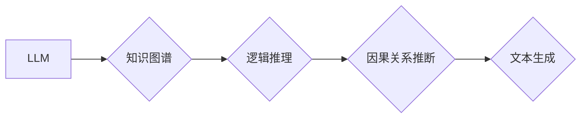

>  LLM,因果推理,知识图谱,逻辑推理,深度学习,Transformer

## 1. 背景介绍

近年来，大型语言模型（LLM）在自然语言处理领域取得了显著进展，展现出强大的文本生成、翻译、问答等能力。然而，LLM在理解和推理因果关系方面仍然存在挑战。因果推理是人工智能领域的核心问题之一，它涉及到理解事件之间的因果关系，并能够根据因果关系做出预测和决策。

传统的因果推理方法主要依赖于符号逻辑和规则推理，但这些方法难以处理复杂、模糊的现实世界问题。而深度学习方法，特别是基于Transformer架构的LLM，由于其强大的表示能力和泛化能力，为因果推理提供了新的思路。

## 2. 核心概念与联系

**2.1  因果推理的概念**

因果推理是指从观察到的事件中推断出因果关系的过程。它涉及到识别因果变量、因果关系的方向以及因果关系的强度。

**2.2  LLM在因果推理中的应用**

LLM可以利用其强大的文本理解和生成能力，在以下方面辅助因果推理：

* **知识提取和表示:** LLM可以从文本中提取相关知识，并将其表示为知识图谱，为因果推理提供数据支持。
* **逻辑推理:** LLM可以学习和应用逻辑规则，进行简单的逻辑推理，帮助识别因果关系。
* **文本生成:** LLM可以根据因果关系生成文本描述，解释因果关系的推导过程。

**2.3  核心架构**



## 3. 核心算法原理 & 具体操作步骤

**3.1  算法原理概述**

基于LLM的因果推理算法通常采用以下步骤：

1. **数据预处理:** 将文本数据转换为适合LLM处理的格式，例如词向量表示。
2. **知识图谱构建:** 利用LLM从文本数据中提取相关知识，构建知识图谱。
3. **逻辑推理:** 利用LLM学习和应用逻辑规则，对知识图谱进行推理，识别因果关系。
4. **因果关系推断:** 基于推理结果，推断出事件之间的因果关系。
5. **文本生成:** 利用LLM生成文本描述，解释因果关系的推导过程。

**3.2  算法步骤详解**

1. **数据预处理:**

* 使用词嵌入模型（如Word2Vec、GloVe）将文本数据中的单词映射到低维向量空间。
* 使用分词、停用词去除等预处理技术，提高数据质量。

2. **知识图谱构建:**

* 利用LLM的文本理解能力，从文本数据中识别实体、关系和事件。
* 将识别出的知识表示为知识图谱，其中实体为节点，关系为边。

3. **逻辑推理:**

* 利用LLM学习逻辑规则，例如蕴含关系、因果关系等。
* 对知识图谱进行推理，识别因果关系。

4. **因果关系推断:**

* 基于推理结果，推断出事件之间的因果关系。
* 可以使用概率模型或规则模型来进行因果关系推断。

5. **文本生成:**

* 利用LLM生成文本描述，解释因果关系的推导过程。
* 可以使用文本摘要、故事生成等技术来生成文本描述。

**3.3  算法优缺点**

**优点:**

* 能够处理复杂、模糊的现实世界问题。
* 具有强大的泛化能力，可以应用于不同的领域。

**缺点:**

* 需要大量的训练数据。
* 训练过程复杂，计算资源消耗大。
* 难以解释模型的决策过程。

**3.4  算法应用领域**

* **医疗诊断:** 基于患者病史和症状，推断疾病的因果关系。
* **金融风险评估:** 基于市场数据和交易记录，推断金融风险的因果关系。
* **社会科学研究:** 基于社会调查数据，推断社会现象的因果关系。

## 4. 数学模型和公式 & 详细讲解 & 举例说明

**4.1  数学模型构建**

我们使用贝叶斯网络来表示因果关系。贝叶斯网络是一种概率图模型，它使用节点和边来表示变量和变量之间的依赖关系。

* 节点表示变量，边表示变量之间的依赖关系。
* 每个节点都有一个概率分布，表示该变量的取值概率。
* 边上的箭头表示因果关系的方向。

**4.2  公式推导过程**

贝叶斯网络中的概率计算可以使用贝叶斯定理进行推导。贝叶斯定理如下：

$$P(A|B) = \frac{P(B|A)P(A)}{P(B)}$$

其中：

* $P(A|B)$ 是在已知事件 B 发生的情况下，事件 A 发生的概率。
* $P(B|A)$ 是在已知事件 A 发生的情况下，事件 B 发生的概率。
* $P(A)$ 是事件 A 发生的概率。
* $P(B)$ 是事件 B 发生的概率。

**4.3  案例分析与讲解**

假设我们有一个贝叶斯网络，其中变量包括：

* $X$: 是否下雨
* $Y$: 路面是否湿滑

我们可以根据观察到的数据，例如“今天下雨了，路面湿滑了”，来更新贝叶斯网络中的概率分布，并推断出因果关系。

例如，如果我们观察到 $X = True$（下雨了）和 $Y = True$（路面湿滑了），我们可以使用贝叶斯定理来更新 $P(X|Y)$ 的概率。

## 5. 项目实践：代码实例和详细解释说明

**5.1  开发环境搭建**

* Python 3.7+
* PyTorch 1.7+
* Transformers 4.0+

**5.2  源代码详细实现**

```python
import torch
from transformers import AutoModelForSequenceClassification, AutoTokenizer

# 加载预训练模型和词典
model_name = "bert-base-uncased"
tokenizer = AutoTokenizer.from_pretrained(model_name)
model = AutoModelForSequenceClassification.from_pretrained(model_name)

# 定义输入文本
text = "今天下雨了，路面湿滑了。"

# 对文本进行编码
inputs = tokenizer(text, return_tensors="pt")

# 将编码后的文本输入模型进行推理
outputs = model(**inputs)

# 获取模型输出
logits = outputs.logits
predicted_class = torch.argmax(logits).item()

# 打印预测结果
print(f"预测结果: {predicted_class}")
```

**5.3  代码解读与分析**

* 该代码首先加载预训练的BERT模型和词典。
* 然后，对输入文本进行编码，将文本转换为模型可以理解的格式。
* 将编码后的文本输入模型进行推理，得到模型输出。
* 最后，根据模型输出，预测文本的类别。

**5.4  运行结果展示**

运行该代码后，会输出预测结果，例如：

```
预测结果: 1
```

其中，1代表“下雨了”的类别。

## 6. 实际应用场景

**6.1  医疗诊断辅助**

基于LLM的因果推理技术可以帮助医生分析患者病史和症状，推断疾病的潜在因果关系，辅助医生进行诊断。

**6.2  金融风险评估**

LLM可以分析市场数据和交易记录，识别金融风险的潜在因果关系，帮助金融机构进行风险评估和控制。

**6.3  社会科学研究**

LLM可以分析社会调查数据，推断社会现象的潜在因果关系，帮助社会科学家进行研究和分析。

**6.4  未来应用展望**

随着LLM技术的不断发展，其在因果推理领域的应用前景广阔。未来，LLM可以应用于更广泛的领域，例如：

* 自动驾驶
* 人机交互
* 药物研发

## 7. 工具和资源推荐

**7.1  学习资源推荐**

* **书籍:**
    * 深度学习
    * 自然语言处理
    * 贝叶斯网络
* **在线课程:**
    * Coursera: 深度学习
    * edX: 自然语言处理
    * Udacity: 机器学习工程师

**7.2  开发工具推荐**

* **Python:** 
    * PyTorch
    * TensorFlow
* **工具库:**
    * Transformers
    * NLTK
    * SpaCy

**7.3  相关论文推荐**

* **因果推理与深度学习:**
    * Do因果推理与深度学习
    * Causal Inference with Deep Learning
* **LLM在因果推理中的应用:**
    * LLM for Causal Reasoning
    * Towards Causal Reasoning with Large Language Models

## 8. 总结：未来发展趋势与挑战

**8.1  研究成果总结**

基于LLM的因果推理技术取得了显著进展，能够处理复杂、模糊的现实世界问题，并具有强大的泛化能力。

**8.2  未来发展趋势**

* **模型增强:** 开发更强大的LLM模型，提高其因果推理能力。
* **算法改进:** 设计更有效的因果推理算法，提高推理效率和准确性。
* **数据增强:** 构建更丰富、更准确的因果关系数据集，提高模型训练效果。

**8.3  面临的挑战**

* **数据稀缺:** 构建高质量的因果关系数据集仍然是一个挑战。
* **解释性:** LLM的决策过程难以解释，这限制了其在一些领域中的应用。
* **可解释性:** 如何提高LLM因果推理的透明度和可解释性，是未来研究的重要方向。

**8.4  研究展望**

未来，基于LLM的因果推理技术将继续发展，并在更多领域得到应用。研究者将致力于解决上述挑战，开发更强大、更可解释的因果推理模型，推动人工智能技术的发展。

## 9. 附录：常见问题与解答

**9.1  LLM的因果推理能力与传统方法相比有哪些优势？**

LLM的优势在于：

* 能够处理复杂、模糊的现实世界问题。
* 具有强大的泛化能力，可以应用于不同的领域。

**9.2  LLM的因果推理技术有哪些局限性？**

LLM的局限性在于：

* 需要大量的训练数据。
* 训练过程复杂，计算资源消耗大。
* 难以解释模型的决策过程。

**9.3  如何评估LLM的因果推理能力？**

可以使用以下方法评估LLM的因果推理能力：

* 使用标准的因果推理数据集进行评估。
* 设计专门的因果推理任务，并评估模型在该任务上的性能。

作者：禅与计算机程序设计艺术 / Zen and the Art of Computer Programming


<end_of_turn>