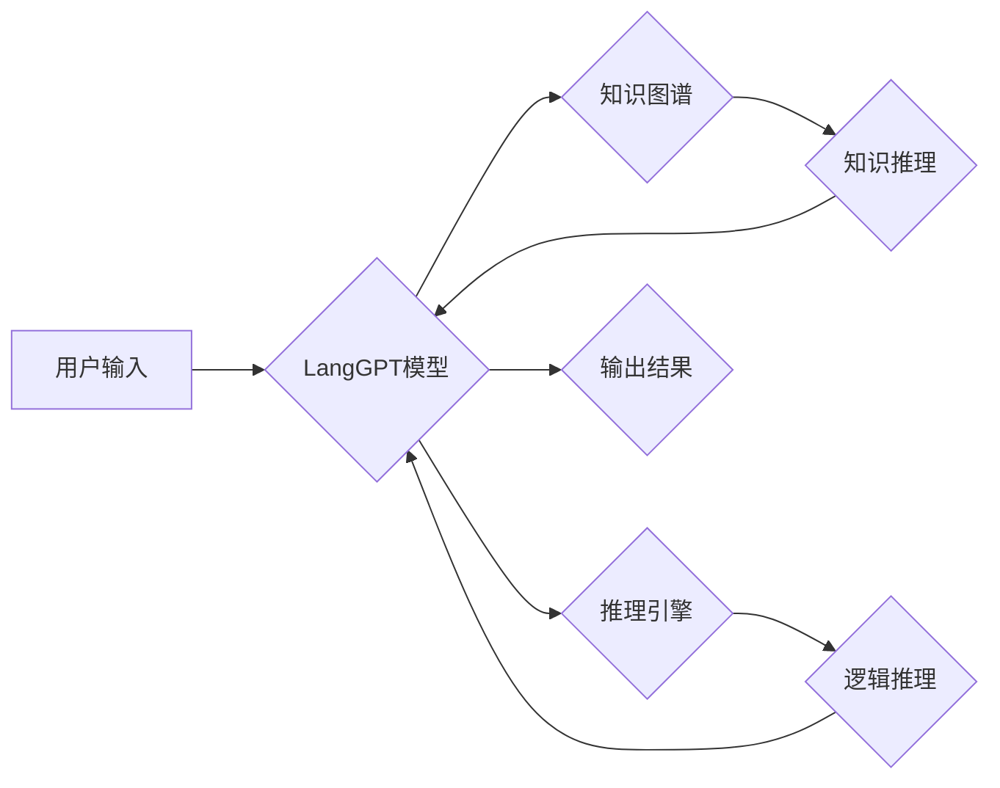

> LangGPT, 大语言模型, 复杂任务处理, 知识推理, 代码生成, 多模态理解, 创新应用

## 1. 背景介绍

近年来，深度学习技术取得了飞速发展，特别是大语言模型（LLM）的出现，为人工智能领域带来了革命性的变革。作为一种强大的文本处理工具，LLM能够理解和生成人类语言，并展现出令人惊叹的文本生成、翻译、摘要、问答等能力。然而，传统的LLM在处理复杂任务时仍然存在一些局限性，例如缺乏对知识的深度理解、推理能力有限、难以处理多模态数据等。

LangGPT作为一种新型的LLM，旨在突破这些局限性，通过融合多源数据、强化学习等技术，提升其在复杂任务处理中的能力。本文将深入探讨LangGPT的优势，分析其核心原理、算法机制以及实际应用场景，并展望其未来发展趋势。

## 2. 核心概念与联系

LangGPT的核心概念是将语言模型与知识图谱、推理引擎等其他技术模块紧密结合，形成一个完整的复杂任务处理系统。

**Mermaid 流程图：**

**核心概念解释：**

* **LangGPT模型:** 基于Transformer架构的深度学习模型，具备强大的文本理解和生成能力。
* **知识图谱:**  存储着大量结构化知识的数据库，能够为LangGPT提供丰富的背景知识和语义理解。
* **推理引擎:**  负责根据LangGPT模型的输出和知识图谱中的信息进行逻辑推理，得出更深层的结论和洞察。

## 3. 核心算法原理 & 具体操作步骤

### 3.1  算法原理概述

LangGPT的核心算法原理是基于Transformer架构的深度学习模型，结合了以下关键技术：

* **自注意力机制:**  能够捕捉文本序列中不同词语之间的语义关系，提升模型对上下文信息的理解能力。
* **多头注意力机制:**  通过使用多个注意力头，能够从不同的角度捕捉文本信息，增强模型的表达能力。
* **位置编码:**  由于Transformer模型无法直接理解词语的顺序信息，因此需要使用位置编码来嵌入词语的位置信息。
* **前馈神经网络:**  用于对每个词语的嵌入向量进行非线性变换，进一步提取语义特征。

### 3.2  算法步骤详解

LangGPT的训练过程可以概括为以下步骤：

1. **数据预处理:**  收集并预处理大量文本数据，包括清洗、分词、标记等操作。
2. **模型构建:**  根据Transformer架构构建LangGPT模型，并设置模型参数。
3. **模型训练:**  使用预处理后的文本数据训练LangGPT模型，通过反向传播算法优化模型参数。
4. **模型评估:**  使用测试数据评估模型的性能，并根据评估结果进行模型调优。
5. **模型部署:**  将训练好的LangGPT模型部署到实际应用场景中。

### 3.3  算法优缺点

**优点:**

* 强大的文本理解和生成能力
* 能够处理长文本序列
* 具备一定的知识推理能力

**缺点:**

* 训练成本高
* 对数据质量要求高
* 仍然存在一些局限性，例如难以处理复杂逻辑推理、缺乏对真实世界的理解等

### 3.4  算法应用领域

LangGPT在以下领域具有广泛的应用前景：

* **自然语言处理:**  文本分类、情感分析、机器翻译、问答系统等
* **代码生成:**  自动生成代码、代码修复、代码注释等
* **多模态理解:**  结合图像、音频等多模态数据进行理解和分析
* **知识图谱构建:**  自动构建和更新知识图谱

## 4. 数学模型和公式 & 详细讲解 & 举例说明

### 4.1  数学模型构建

LangGPT模型的核心是Transformer架构，其数学模型可以概括为以下公式：

$$
\mathbf{H} = \text{MultiHeadAttention}(\mathbf{X}, \mathbf{X}, \mathbf{W_a}) + \mathbf{X}
$$

$$
\mathbf{X} = \text{FeedForward}(\mathbf{H}, \mathbf{W_f}) + \mathbf{H}
$$

其中：

* $\mathbf{X}$: 输入文本序列的嵌入向量
* $\mathbf{H}$:  经过多头注意力机制和前馈神经网络处理后的隐藏状态向量
* $\mathbf{W_a}$:  多头注意力机制的参数矩阵
* $\mathbf{W_f}$:  前馈神经网络的参数矩阵

### 4.2  公式推导过程

上述公式的推导过程较为复杂，涉及到线性变换、激活函数、矩阵乘法等多种数学运算。

### 4.3  案例分析与讲解

假设我们输入一个文本序列“今天天气很好”，经过LangGPT模型处理后，其隐藏状态向量$\mathbf{H}$将包含关于“今天”、“天气”和“很好”之间的语义关系，例如“今天”和“天气”是时间和状态的关系，“天气”和“很好”是状态和评价的关系。

## 5. 项目实践：代码实例和详细解释说明

### 5.1  开发环境搭建

LangGPT的开发环境需要包含以下软件：

* Python 3.x
* PyTorch 或 TensorFlow 深度学习框架
* CUDA 和 cuDNN GPU加速库

### 5.2  源代码详细实现

LangGPT的源代码实现较为复杂，需要参考其官方文档或开源项目进行开发。

### 5.3  代码解读与分析

LangGPT的代码主要包含以下部分：

* 模型定义模块：定义LangGPT模型的结构和参数。
* 数据加载模块：加载和预处理训练数据。
* 训练模块：训练LangGPT模型，并进行模型评估。
* 推理模块：使用训练好的模型进行文本理解和生成任务。

### 5.4  运行结果展示

LangGPT的运行结果可以包括文本生成、翻译、摘要、问答等多种形式。

## 6. 实际应用场景

### 6.1  自然语言处理

LangGPT可以用于各种自然语言处理任务，例如：

* **文本分类:**  自动将文本分类到不同的类别，例如新闻分类、情感分析等。
* **机器翻译:**  将文本从一种语言翻译成另一种语言。
* **问答系统:**  根据用户的问题，从文本数据中找到答案。

### 6.2  代码生成

LangGPT可以用于自动生成代码，例如：

* **代码补全:**  根据用户输入的代码片段，自动补全剩余代码。
* **代码生成:**  根据用户描述的代码功能，自动生成代码。
* **代码修复:**  自动修复代码中的错误。

### 6.3  多模态理解

LangGPT可以结合图像、音频等多模态数据进行理解和分析，例如：

* **图像字幕生成:**  根据图像内容，自动生成文字描述。
* **视频摘要:**  自动生成视频的文字摘要。
* **情感分析:**  根据图像或音频内容，分析情感倾向。

### 6.4  未来应用展望

LangGPT在未来将有更广泛的应用场景，例如：

* **个性化教育:**  根据学生的学习情况，提供个性化的学习内容和辅导。
* **智能客服:**  提供更加智能和人性化的客服服务。
* **医疗诊断:**  辅助医生进行疾病诊断和治疗方案制定。

## 7. 工具和资源推荐

### 7.1  学习资源推荐

* **论文:**  BERT: Pre-training of Deep Bidirectional Transformers for Language Understanding
* **博客:**  The Illustrated Transformer
* **在线课程:**  Deep Learning Specialization (Coursera)

### 7.2  开发工具推荐

* **PyTorch:**  开源深度学习框架
* **TensorFlow:**  开源深度学习框架
* **Hugging Face Transformers:**  提供预训练的语言模型和工具

### 7.3  相关论文推荐

* **GPT-3: Language Models are Few-Shot Learners**
* **T5: Text-to-Text Transfer Transformer**
* **XLNet: Generalized Autoregressive Pretraining for Language Understanding**

## 8. 总结：未来发展趋势与挑战

### 8.1  研究成果总结

LangGPT的出现标志着LLM技术迈向新的阶段，其强大的文本理解和生成能力为复杂任务处理提供了新的可能性。

### 8.2  未来发展趋势

未来，LangGPT将朝着以下方向发展：

* **更强大的模型能力:**  通过更大的模型规模、更丰富的训练数据和更先进的训练算法，提升LangGPT的文本理解和生成能力。
* **更强的知识推理能力:**  通过与知识图谱、推理引擎等技术的深度融合，增强LangGPT的知识推理能力。
* **更广泛的应用场景:**  将LangGPT应用于更多领域，例如教育、医疗、金融等。

### 8.3  面临的挑战

LangGPT的发展也面临着一些挑战：

* **数据安全和隐私问题:**  LangGPT的训练需要大量文本数据，如何保证数据安全和隐私是一个重要问题。
* **模型可解释性和信任问题:**  LangGPT的决策过程较为复杂，如何提高模型的可解释性和信任度是一个需要解决的问题。
* **伦理和社会影响问题:**  LangGPT的应用可能会带来一些伦理和社会影响，例如信息操纵、就业替代等，需要进行深入的探讨和研究。

### 8.4  研究展望

未来，我们将继续致力于LangGPT的研发和应用，探索其在复杂任务处理中的更多可能性，并积极应对其带来的挑战，推动人工智能技术向更安全、更可信、更普惠的方向发展。

## 9. 附录：常见问题与解答

**Q1: LangGPT与其他LLM有什么区别？**

**A1:** LangGPT与其他LLM的主要区别在于其更注重知识推理和多模态理解能力。通过与知识图谱和推理引擎的融合，LangGPT能够更好地理解和处理复杂的任务。

**Q2: 如何使用LangGPT？**

**A2:**  您可以参考LangGPT的官方文档或开源项目进行开发。

**Q3: LangGPT的训练成本高吗？**

**A3:**  是的，LangGPT的训练成本较高，需要大量的计算资源和训练数据。

**Q4: LangGPT是否可以处理中文文本？**

**A4:**  是的，LangGPT可以处理多种语言的文本，包括中文。

**Q5: LangGPT的未来发展方向是什么？**

**A5:**  未来，LangGPT将朝着更强大的模型能力、更强的知识推理能力和更广泛的应用场景发展。

作者：禅与计算机程序设计艺术 / Zen and the Art of Computer Programming 
<end_of_turn>