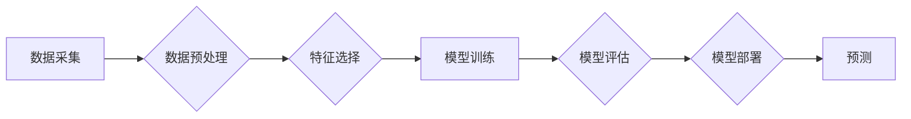

> Mahout,分类算法,机器学习,数据挖掘,Spark,算法原理,代码实例,实践应用

## 1. 背景介绍

在当今数据爆炸的时代，如何从海量数据中挖掘有价值的信息变得尤为重要。机器学习作为人工智能的重要分支，为数据分析和预测提供了强大的工具。其中，分类算法作为机器学习的核心算法之一，在文本分类、图像识别、欺诈检测等领域有着广泛的应用。

Mahout是一个基于Apache Hadoop的开源机器学习平台，提供了丰富的机器学习算法实现，包括分类算法。本文将深入讲解Mahout中的分类算法原理、代码实例以及实际应用场景，帮助读者理解和应用Mahout分类算法。

## 2. 核心概念与联系

Mahout分类算法基于统计学习理论，利用训练数据学习分类模型，并根据模型预测新的数据类别。

**核心概念:**

* **分类:** 将数据划分为预定义的类别。
* **训练数据:** 用于训练分类模型的数据集。
* **测试数据:** 用于评估分类模型性能的数据集。
* **特征:** 用于描述数据样本的属性。
* **分类模型:** 用于预测数据类别模型。

**架构流程图:**



## 3. 核心算法原理 & 具体操作步骤

### 3.1  算法原理概述

Mahout支持多种分类算法，包括朴素贝叶斯、决策树、支持向量机等。本文将以朴素贝叶斯算法为例，讲解其原理。

朴素贝叶斯算法基于贝叶斯定理，假设特征之间相互独立，计算每个类别出现的概率，并根据最大概率原则预测数据类别。

### 3.2  算法步骤详解

1. **数据预处理:** 对训练数据进行清洗、转换和特征工程，例如删除缺失值、编码类别特征等。
2. **特征选择:** 选择与分类任务相关的特征，并进行降维处理，提高模型效率。
3. **模型训练:** 计算每个类别出现的概率，以及每个特征在不同类别下的条件概率。
4. **模型评估:** 使用测试数据评估模型性能，例如准确率、召回率、F1-score等。
5. **模型部署:** 将训练好的模型部署到生产环境中，用于预测新的数据类别。

### 3.3  算法优缺点

**优点:**

* 算法简单易懂，易于实现。
* 对数据要求不高，可以处理文本、数值等多种数据类型。
* 训练速度快，适合处理大规模数据。

**缺点:**

* 假设特征之间相互独立，在实际应用中可能不成立。
* 对异常数据敏感，容易受到噪声数据的影响。

### 3.4  算法应用领域

朴素贝叶斯算法广泛应用于以下领域:

* 文本分类: 垃圾邮件过滤、情感分析、主题分类等。
* 图像识别: 手写数字识别、物体检测等。
* 欺诈检测: 信用卡欺诈检测、网络安全等。

## 4. 数学模型和公式 & 详细讲解 & 举例说明

### 4.1  数学模型构建

朴素贝叶斯算法的核心是贝叶斯定理，用于计算给定特征条件下类别出现的概率。

**贝叶斯定理:**

$$P(C|X) = \frac{P(X|C)P(C)}{P(X)}$$

其中:

* $P(C|X)$: 给定特征 $X$ 条件下类别 $C$ 出现的概率。
* $P(X|C)$: 给定类别 $C$ 条件下特征 $X$ 出现的概率。
* $P(C)$: 类别 $C$ 出现的概率。
* $P(X)$: 特征 $X$ 出现的概率。

### 4.2  公式推导过程

在朴素贝叶斯算法中，假设特征之间相互独立，则:

$$P(X|C) = \prod_{i=1}^{n} P(x_i|C)$$

其中:

* $x_i$: 特征 $i$ 的值。
* $n$: 特征数量。

将上述公式代入贝叶斯定理，得到朴素贝叶斯算法的最终公式:

$$P(C|X) = \frac{\prod_{i=1}^{n} P(x_i|C)P(C)}{P(X)}$$

### 4.3  案例分析与讲解

假设我们有一个分类任务，需要将邮件分类为“垃圾邮件”或“正常邮件”。

* 特征: 邮件内容、发送者、接收者等。
* 类别: “垃圾邮件”或“正常邮件”。

我们可以使用朴素贝叶斯算法训练模型，学习每个特征在不同类别下的条件概率。例如，我们可以计算“垃圾邮件”中包含特定关键词的概率，以及“正常邮件”中包含特定关键词的概率。

在预测新邮件类别时，我们可以根据新邮件的特征，计算其属于“垃圾邮件”或“正常邮件”的概率，并选择概率更高的类别作为预测结果。

## 5. 项目实践：代码实例和详细解释说明

### 5.1  开发环境搭建

* Java Development Kit (JDK)
* Apache Hadoop
* Mahout

### 5.2  源代码详细实现

```java
import org.apache.mahout.classifier.bayes.Bayes;
import org.apache.mahout.classifier.bayes.BayesModel;
import org.apache.mahout.common.Pair;

import java.io.File;
import java.io.IOException;
import java.util.List;

public class MahoutBayesClassifier {

    public static void main(String[] args) throws IOException {
        // 训练数据路径
        String trainingDataPath = "path/to/training/data";

        // 测试数据路径
        String testDataPath = "path/to/test/data";

        // 创建Bayes对象
        Bayes bayes = new Bayes();

        // 训练模型
        BayesModel model = bayes.train(trainingDataPath);

        // 预测测试数据
        List<Pair<String, Double>> predictions = bayes.predict(testDataPath, model);

        // 打印预测结果
        for (Pair<String, Double> prediction : predictions) {
            System.out.println("Data: " + prediction.getFirst() + ", Predicted Class: " + prediction.getSecond());
        }
    }
}
```

### 5.3  代码解读与分析

* `Bayes`类: Mahout提供的朴素贝叶斯分类算法实现。
* `train()`方法: 使用训练数据训练朴素贝叶斯模型。
* `predict()`方法: 使用训练好的模型预测测试数据类别。
* `Pair`类: 用于存储数据和预测类别的对。

### 5.4  运行结果展示

运行代码后，将输出测试数据对应的预测类别。

## 6. 实际应用场景

Mahout分类算法广泛应用于以下实际场景:

* **文本分类:**

    * 垃圾邮件过滤: 根据邮件内容特征，识别垃圾邮件并将其过滤掉。
    * 情感分析: 分析文本内容的感情倾向，例如判断用户对产品的评价是正面还是负面。
    * 主题分类: 将文本文档归类到不同的主题类别，例如新闻分类、论坛帖子分类等。

* **图像识别:**

    * 手写数字识别: 根据手写数字的图像特征，识别数字的类别。
    * 物体检测: 在图像中检测特定物体的存在，例如人脸识别、车辆识别等。

* **欺诈检测:**

    * 信用卡欺诈检测: 根据交易记录特征，识别可能存在的信用卡欺诈行为。
    * 网络安全: 检测网络攻击和恶意软件，保护系统安全。

### 6.4  未来应用展望

随着机器学习技术的不断发展，Mahout分类算法在未来将有更广泛的应用场景:

* **个性化推荐:** 根据用户的行为特征，推荐个性化的商品、服务或内容。
* **医疗诊断:** 根据患者的症状和病史特征，辅助医生进行疾病诊断。
* **金融风险评估:** 根据客户的财务状况和信用记录特征，评估客户的贷款风险。

## 7. 工具和资源推荐

### 7.1  学习资源推荐

* Mahout官方文档: https://mahout.apache.org/users/
* Mahout教程: https://mahout.apache.org/users/tutorials/
* 机器学习入门书籍: "机器学习" by Tom Mitchell

### 7.2  开发工具推荐

* Apache Hadoop
* Apache Spark
* Eclipse IDE

### 7.3  相关论文推荐

* "A Probabilistic Approach to Automatic Text Categorization" by David Lewis
* "Naive Bayes for Text Classification" by Ian H. Witten and Eibe Frank

## 8. 总结：未来发展趋势与挑战

### 8.1  研究成果总结

Mahout分类算法在文本分类、图像识别、欺诈检测等领域取得了显著成果，为数据分析和预测提供了强大的工具。

### 8.2  未来发展趋势

* **模型复杂度提升:** 研究更复杂的分类模型，例如深度学习模型，提高分类精度。
* **算法效率优化:** 优化算法训练和预测速度，提高处理大规模数据的效率。
* **跨平台支持:** 将Mahout分类算法移植到更多平台，例如云计算平台，方便用户使用。

### 8.3  面临的挑战

* **数据质量问题:** 分类算法的性能依赖于训练数据的质量，如何处理不完整、不准确的数据仍然是一个挑战。
* **特征选择问题:** 如何选择最相关的特征，提高模型性能，也是一个重要的研究方向。
* **可解释性问题:** 深度学习模型的决策过程难以解释，如何提高模型的可解释性，也是一个重要的挑战。

### 8.4  研究展望

未来，Mahout分类算法将继续朝着更智能、更高效、更可解释的方向发展，为数据分析和预测提供更强大的工具。

## 9. 附录：常见问题与解答

* **Q: Mahout分类算法的训练时间较长，如何提高训练速度？**

    A: 可以尝试使用更快的机器学习算法，例如线性分类器，或者使用分布式计算框架，例如Spark，提高训练效率。

* **Q: 如何选择合适的特征？**

    A: 可以使用特征选择算法，例如信息增益、互信息等，选择与分类任务相关的特征。

* **Q: 如何评估分类模型的性能？**

    A: 可以使用准确率、召回率、F1-score等指标评估分类模型的性能。

作者：禅与计算机程序设计艺术 / Zen and the Art of Computer Programming


<end_of_turn>