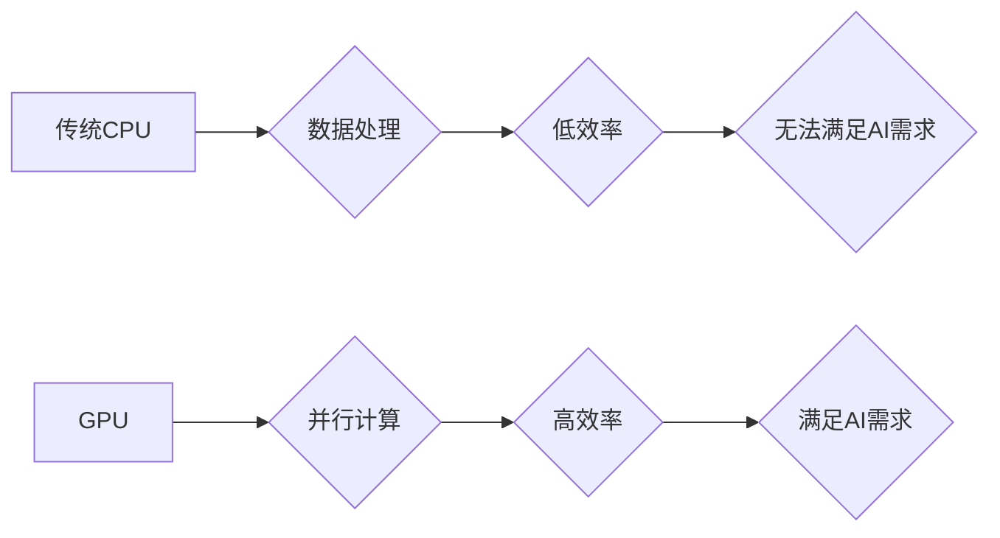

> NVIDIA, GPU, CUDA, Deep Learning, AI, 算力, 训练, 推理

## 1. 背景介绍

人工智能（AI）的蓬勃发展，对算力的需求呈指数级增长。传统的CPU架构在处理海量数据和复杂的计算任务时，效率低下，难以满足AI训练和推理的需要。而NVIDIA，作为GPU领域的领军者，凭借其强大的并行计算能力和针对AI算法优化的软件生态系统，成功地改变了AI算力格局。

## 2. 核心概念与联系

**2.1 GPU架构与AI计算**

GPU（图形处理单元）最初设计用于处理图形渲染，其核心特点是拥有大量并行计算单元，能够同时处理数千个任务。这种并行计算能力与深度学习算法的特征高度契合，因为深度学习算法本质上是大量数据并行处理的计算密集型任务。

**2.2 CUDA平台与AI软件生态**

NVIDIA开发了CUDA（Compute Unified Device Architecture）平台，将GPU转变为通用计算平台，并提供了一套完整的软件开发工具链。CUDA平台使得开发者能够利用GPU的并行计算能力，高效地开发和部署AI算法。

**2.3  NVIDIA AI软件生态**

NVIDIA不仅提供硬件平台，还构建了完善的AI软件生态系统，包括：

* **cuDNN:** 深度学习库，提供高性能的卷积神经网络（CNN）和循环神经网络（RNN）计算加速。
* **TensorRT:** 推理优化框架，能够将深度学习模型转换为高效的推理引擎，降低推理延迟和功耗。
* **Triton Inference Server:** 推理服务平台，提供模型部署、管理和监控功能。

**2.4  NVIDIA AI硬件平台**

NVIDIA推出了专门针对AI训练和推理的硬件平台，例如：

* **Tesla系列GPU:** 高性能计算GPU，用于大型AI模型训练。
* **Jetson系列嵌入式GPU:** 小型、低功耗的GPU，用于边缘AI应用。

**Mermaid 流程图**



## 3. 核心算法原理 & 具体操作步骤

**3.1  算法原理概述**

深度学习算法的核心是多层神经网络，通过学习数据中的特征表示，实现对复杂数据的理解和预测。

**3.2  算法步骤详解**

1. **数据预处理:** 将原始数据转换为深度学习模型可以理解的格式。
2. **模型构建:** 设计多层神经网络结构，包括输入层、隐藏层和输出层。
3. **参数初始化:** 为神经网络中的权重和偏置赋予初始值。
4. **前向传播:** 将输入数据通过神经网络传递，计算输出结果。
5. **反向传播:** 计算输出结果与真实值的误差，并根据误差调整神经网络的参数。
6. **优化算法:** 使用优化算法，例如梯度下降，更新神经网络的参数，降低误差。
7. **模型评估:** 使用测试数据评估模型的性能，例如准确率、召回率等。

**3.3  算法优缺点**

**优点:**

* 能够学习复杂数据中的非线性关系。
* 具有强大的泛化能力，能够应用于多种任务。

**缺点:**

* 训练过程需要大量数据和计算资源。
* 模型解释性较差，难以理解模型的决策过程。

**3.4  算法应用领域**

* **图像识别:** 人脸识别、物体检测、图像分类等。
* **自然语言处理:** 机器翻译、文本摘要、情感分析等。
* **语音识别:** 语音转文本、语音助手等。
* **推荐系统:** 商品推荐、内容推荐等。

## 4. 数学模型和公式 & 详细讲解 & 举例说明

**4.1  数学模型构建**

深度学习模型本质上是一个复杂的数学模型，其核心是神经网络的结构和参数。

**4.2  公式推导过程**

深度学习模型的训练过程基于梯度下降算法，其核心公式包括：

* **损失函数:** 用于衡量模型预测结果与真实值的差异。
* **梯度:** 用于计算损失函数对模型参数的导数。
* **更新规则:** 用于根据梯度更新模型参数。

**4.3  案例分析与讲解**

以卷积神经网络（CNN）为例，其损失函数通常为均方误差（MSE），梯度计算使用反向传播算法，更新规则使用随机梯度下降（SGD）算法。

**4.4  数学公式**

* **均方误差 (MSE):**

$$
MSE = \frac{1}{N} \sum_{i=1}^{N} (y_i - \hat{y}_i)^2
$$

其中：

* $N$ 为样本数量
* $y_i$ 为真实值
* $\hat{y}_i$ 为预测值

* **梯度下降 (Gradient Descent):**

$$
\theta = \theta - \alpha \nabla J(\theta)
$$

其中：

* $\theta$ 为模型参数
* $\alpha$ 为学习率
* $\nabla J(\theta)$ 为损失函数 $J(\theta)$ 对参数 $\theta$ 的梯度

## 5. 项目实践：代码实例和详细解释说明

**5.1  开发环境搭建**

* 安装CUDA Toolkit
* 安装cuDNN
* 安装Python和深度学习框架（例如TensorFlow或PyTorch）

**5.2  源代码详细实现**

```python
import tensorflow as tf

# 定义模型结构
model = tf.keras.models.Sequential([
    tf.keras.layers.Conv2D(32, (3, 3), activation='relu', input_shape=(28, 28, 1)),
    tf.keras.layers.MaxPooling2D((2, 2)),
    tf.keras.layers.Conv2D(64, (3, 3), activation='relu'),
    tf.keras.layers.MaxPooling2D((2, 2)),
    tf.keras.layers.Flatten(),
    tf.keras.layers.Dense(10, activation='softmax')
])

# 编译模型
model.compile(optimizer='adam',
              loss='sparse_categorical_crossentropy',
              metrics=['accuracy'])

# 训练模型
model.fit(x_train, y_train, epochs=5)

# 评估模型
loss, accuracy = model.evaluate(x_test, y_test)
print('Test loss:', loss)
print('Test accuracy:', accuracy)
```

**5.3  代码解读与分析**

这段代码定义了一个简单的卷积神经网络模型，用于手写数字识别任务。

* `tf.keras.models.Sequential` 创建了一个顺序模型，层级结构清晰。
* `tf.keras.layers.Conv2D` 定义卷积层，用于提取图像特征。
* `tf.keras.layers.MaxPooling2D` 定义最大池化层，用于降维和提高模型鲁棒性。
* `tf.keras.layers.Flatten` 将多维特征转换为一维向量。
* `tf.keras.layers.Dense` 定义全连接层，用于分类。
* `model.compile` 编译模型，指定优化器、损失函数和评价指标。
* `model.fit` 训练模型，使用训练数据进行迭代训练。
* `model.evaluate` 评估模型，使用测试数据计算损失和准确率。

**5.4  运行结果展示**

训练完成后，模型能够对新的手写数字图像进行识别，并输出识别结果。

## 6. 实际应用场景

**6.1  图像识别**

* **人脸识别:** 用于身份验证、安全监控等场景。
* **物体检测:** 用于自动驾驶、安防监控等场景。
* **图像分类:** 用于医疗影像诊断、产品分类等场景。

**6.2  自然语言处理**

* **机器翻译:** 将一种语言翻译成另一种语言。
* **文本摘要:** 自动生成文本的简要概述。
* **情感分析:** 分析文本中的情感倾向。

**6.3  语音识别**

* **语音转文本:** 将语音转换为文本。
* **语音助手:** 例如Siri、Alexa等。

**6.4  未来应用展望**

* **个性化推荐:** 基于用户行为和偏好，提供个性化的产品和服务推荐。
* **医疗诊断:** 利用AI辅助医生进行疾病诊断和治疗方案制定。
* **科学研究:** 加速科学发现和技术创新。

## 7. 工具和资源推荐

**7.1  学习资源推荐**

* **Coursera:** 提供深度学习相关的在线课程。
* **Udacity:** 提供AI和机器学习相关的在线课程和项目。
* **Fast.ai:** 提供深度学习入门和进阶课程。

**7.2  开发工具推荐**

* **TensorFlow:** 开源深度学习框架。
* **PyTorch:** 开源深度学习框架。
* **Keras:** 高级深度学习API，可以运行在TensorFlow、Theano或CNTK后端。

**7.3  相关论文推荐**

* **ImageNet Classification with Deep Convolutional Neural Networks**
* **Deep Learning**
* **Attention Is All You Need**

## 8. 总结：未来发展趋势与挑战

**8.1  研究成果总结**

NVIDIA在AI算力领域取得了显著成就，其GPU架构、CUDA平台和AI软件生态系统为深度学习的快速发展提供了坚实基础。

**8.2  未来发展趋势**

* **更高效的GPU架构:** 继续提高GPU的并行计算能力和内存带宽。
* **更强大的AI算法:** 开发更先进的深度学习算法，例如Transformer、Generative Adversarial Networks (GANs)等。
* **边缘AI的普及:** 将AI计算能力部署到边缘设备，实现更低延迟和更高效率的AI应用。

**8.3  面临的挑战**

* **算力需求的爆炸式增长:** AI模型的规模不断增长，对算力的需求也随之增加。
* **能源消耗问题:** AI训练和推理过程消耗大量能源，需要寻找更节能的解决方案。
* **数据隐私和安全问题:** AI模型的训练和应用需要大量数据，如何保护数据隐私和安全是一个重要挑战。

**8.4  研究展望**

未来，AI算力将继续发展，并推动人工智能技术的进一步进步。我们需要不断探索新的算法、架构和技术，以应对不断增长的算力需求，并解决AI技术面临的挑战。

## 9. 附录：常见问题与解答

**9.1  Q: NVIDIA GPU与CPU相比，有什么优势？**

**A:** NVIDIA GPU拥有大量并行计算单元，能够同时处理数千个任务，而CPU则采用串行计算模式。对于深度学习等并行计算密集型任务，GPU的并行计算能力能够显著提高效率。

**9.2  Q: CUDA平台是什么？**

**A:** CUDA（Compute Unified Device Architecture）是NVIDIA开发的通用计算平台，将GPU转变为通用计算平台，并提供了一套完整的软件开发工具链。

**9.3  Q: 如何选择合适的NVIDIA GPU？**

**A:** 选择合适的NVIDIA GPU需要考虑以下因素：

* **算力需求:** 不同的AI任务对算力的需求不同。
* **内存容量:** 训练大型模型需要更大的内存容量。
* **功耗:** 功耗高的GPU需要更强大的散热系统。
* **价格:** GPU的价格差异较大，需要根据预算选择。


作者：禅与计算机程序设计艺术 / Zen and the Art of Computer Programming 
<end_of_turn>