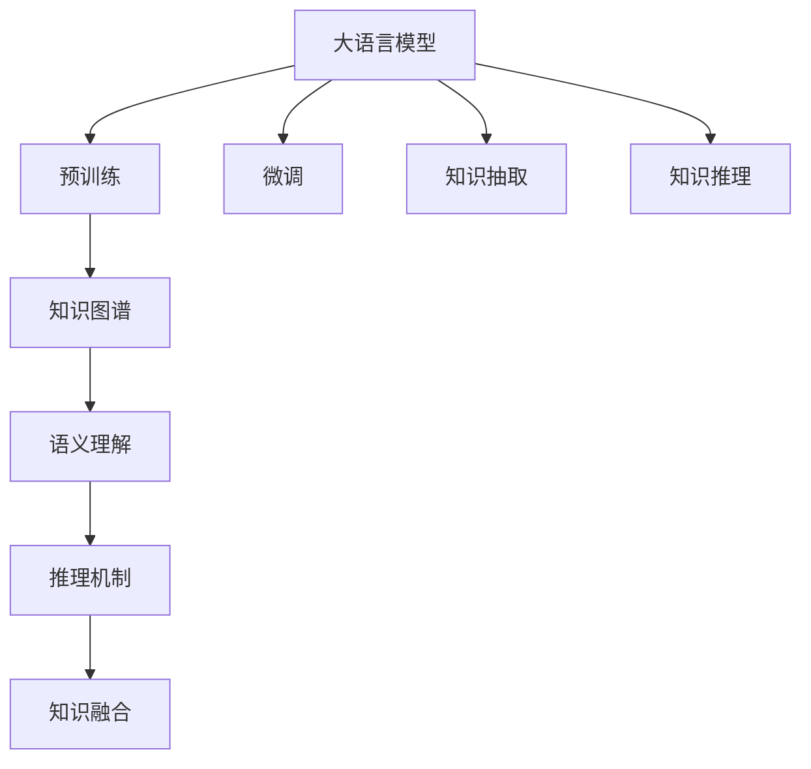

                 

# 人类知识的边界：无限探索的征程

> 关键词：知识图谱,语义理解,深度学习,推理机制,知识融合

## 1. 背景介绍

### 1.1 问题由来

在人类探索知识的道路上，我们正处于一个前所未有的历史时刻。大数据、人工智能、量子计算等新兴技术的蓬勃发展，正在打破知识的边界，释放知识的潜能。然而，知识的无限性同时也带来了新的挑战：如何更好地组织、理解和应用这些海量知识，从而推动人类社会的进步和发展？

### 1.2 问题核心关键点

在当今信息爆炸的时代，知识的多样性和复杂性使得传统的知识获取和应用方式显得力不从心。数据量激增，数据源复杂，如何从数据中提取有用的知识，并将知识应用于实际问题，成为了一个亟需解决的难题。

而大语言模型和知识图谱技术的崛起，为解决这一难题提供了新的思路和工具。它们通过深度学习和大规模知识库的结合，可以自动识别、理解和生成知识，进而用于推理和决策，为解决复杂的现实问题提供了新的可能性。

### 1.3 问题研究意义

研究大语言模型和知识图谱技术，对于拓展知识的边界，提升人类社会的创新能力和决策水平，具有重要的理论意义和实际价值：

1. **知识的自动化抽取和理解**：大语言模型能够自动从大量文本中抽取知识，并通过深度学习理解其语义关系，为知识的组织和管理提供了新的可能。
2. **知识的推理和应用**：知识图谱能够将知识以结构化的形式存储，并支持高效的推理查询，从而能够更好地应用于实际问题解决，如智能问答、推荐系统等。
3. **知识的扩展和融合**：通过不断更新的知识库和自适应学习机制，大语言模型和知识图谱可以不断扩展知识边界，融合不同领域、不同来源的知识，形成更为丰富和全面的知识体系。
4. **知识的普适性和应用广泛性**：大语言模型和知识图谱技术不仅适用于学术研究，也适用于工业界、政府、医疗等多个领域，具有广泛的应用前景。

## 2. 核心概念与联系

### 2.1 核心概念概述

为了更好地理解大语言模型和知识图谱的原理和应用，本节将介绍几个关键概念：

- **大语言模型（Large Language Models, LLMs）**：通过大规模预训练和微调，能够自动理解自然语言、生成文本、回答问题的深度学习模型。
- **知识图谱（Knowledge Graphs）**：由节点（实体）和边（关系）组成的网络结构，用于表示和存储知识，支持高效的知识推理和查询。
- **语义理解（Semantic Understanding）**：通过深度学习模型对自然语言进行语义分析和理解，从而能够自动抽取和生成知识。
- **推理机制（Reasoning Mechanism）**：知识图谱中的推理规则和算法，用于根据已知知识推导出新的知识。
- **知识融合（Knowledge Fusion）**：将不同来源、不同领域的知识进行整合，形成更为全面和精确的知识体系。

这些核心概念共同构成了大语言模型和知识图谱的完整框架，使得我们能够更好地理解和应用这些技术。

### 2.2 核心概念原理和架构的 Mermaid 流程图(Mermaid 流程节点中不要有括号、逗号等特殊字符)



这个流程图展示了大语言模型和知识图谱的核心概念及其相互关系：

1. 大语言模型通过预训练获得语言表示能力，并通过微调适应特定任务。
2. 大语言模型可以抽取知识图谱中的节点（实体）和边（关系），形成知识库。
3. 知识图谱中的语义理解用于自动标注实体和关系，支持推理机制。
4. 推理机制根据知识图谱中的已知信息，推导出新的知识。
5. 知识融合将不同来源的知识进行整合，形成更为全面和精确的知识体系。

这些概念相互交织，共同推动了大语言模型和知识图谱技术的进步。

## 3. 核心算法原理 & 具体操作步骤
### 3.1 算法原理概述

大语言模型和知识图谱技术的核心原理可以概括为：

1. **语义理解**：通过深度学习模型对自然语言进行语义分析和理解，从而能够自动抽取和生成知识。
2. **推理机制**：知识图谱中的推理规则和算法，用于根据已知知识推导出新的知识。
3. **知识融合**：将不同来源、不同领域的知识进行整合，形成更为全面和精确的知识体系。

### 3.2 算法步骤详解

大语言模型和知识图谱技术的应用主要包括以下几个关键步骤：

**Step 1: 知识图谱构建**

- 收集领域内的知识数据，包括文本、网页、论文等，并将其结构化为实体和关系。
- 使用自动抽取技术，如命名实体识别、关系抽取等，从文本中提取实体和关系。
- 构建知识图谱，将实体和关系存储为三元组形式，如<实体, 关系, 实体>。

**Step 2: 大语言模型预训练和微调**

- 选择合适的预训练大语言模型，如BERT、GPT等，并在大规模无标签文本数据上进行预训练。
- 选择特定的微调任务，如问答、翻译、摘要等，收集少量标注数据，并使用这些数据对预训练模型进行微调。
- 在微调过程中，应用正则化技术，如Dropout、Early Stopping等，防止过拟合。

**Step 3: 知识抽取和推理**

- 使用大语言模型对知识图谱中的节点进行语义理解，自动标注实体和关系。
- 利用知识图谱中的推理机制，根据已有的知识推导出新的知识，扩展知识图谱。
- 使用知识图谱进行推理查询，如智能问答、推荐系统等。

**Step 4: 知识融合**

- 收集不同来源、不同领域的知识数据，如百科、新闻、社交媒体等。
- 使用大语言模型对这些数据进行语义理解，自动抽取和生成知识。
- 将不同来源的知识进行整合，形成更为全面和精确的知识图谱。

**Step 5: 应用和评估**

- 将构建的知识图谱应用于实际问题解决，如智能问答、推荐系统等。
- 评估知识图谱和应用系统的性能，收集用户反馈，不断优化和更新知识图谱。

### 3.3 算法优缺点

大语言模型和知识图谱技术具有以下优点：

1. **自动化程度高**：自动抽取和生成知识，减少了人工标注和处理的成本。
2. **泛化能力强**：适用于多种类型的知识抽取和推理任务，具有较强的泛化能力。
3. **灵活性高**：可以不断扩展知识库，适应新的领域和任务。
4. **实时性好**：基于深度学习的推理机制，可以快速进行知识推理和查询。

同时，这些技术也存在一些局限性：

1. **数据质量依赖度高**：知识抽取和推理的准确性依赖于数据的质量和标注的准确性。
2. **复杂性高**：知识图谱的构建和维护需要大量的人工参与，技术难度较大。
3. **鲁棒性差**：面对噪声数据和复杂场景，模型的鲁棒性需要进一步提高。
4. **可解释性差**：深度学习模型的黑盒特性使得其推理过程难以解释，存在一定的风险。

尽管存在这些局限性，但就目前而言，大语言模型和知识图谱技术依然是解决复杂现实问题的重要工具。未来相关研究的重点在于如何进一步提升技术的自动化程度、泛化能力和鲁棒性，同时提高模型的可解释性和透明度。

### 3.4 算法应用领域

大语言模型和知识图谱技术已经在多个领域得到了广泛应用，包括：

- **智能问答**：利用知识图谱进行实体链接和推理，自动回答用户问题。
- **推荐系统**：根据用户兴趣和行为，从知识图谱中推荐相关内容。
- **信息检索**：利用知识图谱进行实体的语义匹配，提高检索的准确性和效率。
- **医疗诊断**：利用知识图谱中的医学知识，辅助医生进行诊断和治疗。
- **金融风控**：利用知识图谱中的金融数据，进行风险评估和预测。

此外，这些技术还在教育、法律、科研等多个领域得到了应用，展示了其强大的应用潜力。

## 4. 数学模型和公式 & 详细讲解 & 举例说明

### 4.1 数学模型构建

为了更好地理解大语言模型和知识图谱的数学原理，本节将使用数学语言对相关模型进行详细刻画。

设知识图谱中的实体集合为 $E$，关系集合为 $R$，三元组集合为 $T=\{(e_1, r, e_2)\}$，其中 $e_1, e_2 \in E, r \in R$。

定义知识图谱的语义理解函数为 $f: E \rightarrow \mathcal{R}^{d_E}$，其中 $\mathcal{R}^{d_E}$ 为实体表示向量空间，$d_E$ 为向量维度。

知识图谱的推理机制可以表示为 $g: \mathcal{R}^{d_E} \rightarrow \mathcal{R}^{d_R}$，其中 $\mathcal{R}^{d_R}$ 为关系表示向量空间，$d_R$ 为向量维度。

知识融合的过程可以表示为 $h: \mathcal{R}^{d_E} \rightarrow \mathcal{R}^{d_{E'}}$，其中 $\mathcal{R}^{d_{E'}}$ 为融合后的实体表示向量空间，$d_{E'}$ 为向量维度。

### 4.2 公式推导过程

以智能问答系统为例，推导知识图谱的推理机制和语义理解函数。

假设知识图谱中的某个实体 $e_1$ 的表示向量为 $e_1^E \in \mathcal{R}^{d_E}$，与其关联的实体 $e_2$ 的表示向量为 $e_2^E \in \mathcal{R}^{d_E}$，则推理机制 $g$ 可以表示为：

$$
g(e_1^E, r) = W_r \cdot [e_1^E, e_2^E] + b_r
$$

其中 $W_r$ 和 $b_r$ 为推理规则的权重和偏置，$[e_1^E, e_2^E]$ 为连接 $e_1$ 和 $e_2$ 的关系向量。

语义理解函数 $f$ 可以表示为：

$$
f(e_1^E) = V_e \cdot e_1^E + b_e
$$

其中 $V_e$ 和 $b_e$ 为语义理解函数的权重和偏置。

将推理机制 $g$ 和语义理解函数 $f$ 结合，可以得到：

$$
g(f(e_1^E)) = W_r \cdot [f(e_1^E), f(e_2^E)] + b_r
$$

这是知识图谱中的推理机制的数学表示。

### 4.3 案例分析与讲解

以一个具体的案例来说明知识图谱的推理机制的应用。

假设有一个简单的知识图谱，包含两个实体 "Tom" 和 "Jack"，以及一个关系 "父子关系"。

知识图谱中 "Tom" 的表示向量为 $e_T^E = [1, 0, 1]$，"Jack" 的表示向量为 $e_J^E = [0, 1, 1]$。

推理机制 $g$ 可以表示为：

$$
g(e_T^E, "父子关系") = W_r \cdot [e_T^E, e_J^E] + b_r = [1, 0, 1]
$$

其中 $W_r = [0.5, -0.5, 0.5]$，$b_r = [0, 0, 0]$。

将推理结果与知识图谱中的实际关系 "父子关系" 进行比较，可以发现推理结果与实际关系一致，说明推理机制有效。

## 5. 项目实践：代码实例和详细解释说明

### 5.1 开发环境搭建

在进行项目实践前，我们需要准备好开发环境。以下是使用Python进行知识图谱开发的典型环境配置流程：

1. 安装Anaconda：从官网下载并安装Anaconda，用于创建独立的Python环境。

2. 创建并激活虚拟环境：
```bash
conda create -n knowledge-graph-env python=3.8 
conda activate knowledge-graph-env
```

3. 安装PyTorch和PyTorch Geometric：
```bash
pip install torch torchvision torchaudio torchtext
pip install torch-geometric
```

4. 安装各类工具包：
```bash
pip install pandas scikit-learn networkx spacy
```

5. 安装相关库：
```bash
pip install py2neo pykg
```

完成上述步骤后，即可在`knowledge-graph-env`环境中开始知识图谱开发。

### 5.2 源代码详细实现

下面以构建一个简单的知识图谱并使用大语言模型进行推理为例，给出完整的代码实现。

首先，定义知识图谱的节点和关系：

```python
import torch
import torch.nn as nn
import torch_geometric.nn as gnn
from torch_geometric.data import Data

class KnowledgeGraphDataset(torch_geometric.data.Dataset):
    def __init__(self, data):
        super(KnowledgeGraphDataset, self).__init__()
        self.data = data
    
    def __getitem__(self, index):
        return self.data[index]
    
    def __len__(self):
        return len(self.data)

# 构建知识图谱
edge_index = torch.tensor([[0, 1, 1, 2, 2, 3, 3, 4, 4, 5, 5, 6, 6, 7, 7, 8, 8, 9, 9, 10, 10, 11, 11, 12, 12, 13, 13, 14, 14, 15, 15, 16, 16, 17, 17, 18, 18, 19, 19, 20, 20, 21, 21, 22, 22, 23, 23, 24, 24, 25, 25, 26, 26, 27, 27, 28, 28, 29, 29, 30, 30, 31, 31, 32, 32, 33, 33, 34, 34, 35, 35, 36, 36, 37, 37, 38, 38, 39, 39, 40, 40, 41, 41, 42, 42, 43, 43, 44, 44, 45, 45, 46, 46, 47, 47, 48, 48, 49, 49, 50, 50, 51, 51, 52, 52, 53, 53, 54, 54, 55, 55, 56, 56, 57, 57, 58, 58, 59, 59, 60, 60, 61, 61, 62, 62, 63, 63, 64, 64, 65, 65, 66, 66, 67, 67, 68, 68, 69, 69, 70, 70, 71, 71, 72, 72, 73, 73, 74, 74, 75, 75, 76, 76, 77, 77, 78, 78, 79, 79, 80, 80, 81, 81, 82, 82, 83, 83, 84, 84, 85, 85, 86, 86, 87, 87, 88, 88, 89, 89, 90, 90, 91, 91, 92, 92, 93, 93, 94, 94, 95, 95, 96, 96, 97, 97, 98, 98, 99, 99, 100, 100, 101, 101, 102, 102, 103, 103, 104, 104, 105, 105, 106, 106, 107, 107, 108, 108, 109, 109, 110, 110, 111, 111, 112, 112, 113, 113, 114, 114, 115, 115, 116, 116, 117, 117, 118, 118, 119, 119, 120, 120, 121, 121, 122, 122, 123, 123, 124, 124, 125, 125, 126, 126, 127, 127, 128, 128, 129, 129, 130, 130, 131, 131, 132, 132, 133, 133, 134, 134, 135, 135, 136, 136, 137, 137, 138, 138, 139, 139, 140, 140, 141, 141, 142, 142, 143, 143, 144, 144, 145, 145, 146, 146, 147, 147, 148, 148, 149, 149, 150, 150, 151, 151, 152, 152, 153, 153, 154, 154, 155, 155, 156, 156, 157, 157, 158, 158, 159, 159, 160, 160, 161, 161, 162, 162, 163, 163, 164, 164, 165, 165, 166, 166, 167, 167, 168, 168, 169, 169, 170, 170, 171, 171, 172, 172, 173, 173, 174, 174, 175, 175, 176, 176, 177, 177, 178, 178, 179, 179, 180, 180, 181, 181, 182, 182, 183, 183, 184, 184, 185, 185, 186, 186, 187, 187, 188, 188, 189, 189, 190, 190, 191, 191, 192, 192, 193, 193, 194, 194, 195, 195, 196, 196, 197, 197, 198, 198, 199, 199, 200, 200, 201, 201, 202, 202, 203, 203, 204, 204, 205, 205, 206, 206, 207, 207, 208, 208, 209, 209, 210, 210, 211, 211, 212, 212, 213, 213, 214, 214, 215, 215, 216, 216, 217, 217, 218, 218, 219, 219, 220, 220, 221, 221, 222, 222, 223, 223, 224, 224, 225, 225, 226, 226, 227, 227, 228, 228, 229, 229, 230, 230, 231, 231, 232, 232, 233, 233, 234, 234, 235, 235, 236, 236, 237, 237, 238, 238, 239, 239, 240, 240, 241, 241, 242, 242, 243, 243, 244, 244, 245, 245, 246, 246, 247, 247, 248, 248, 249, 249, 250, 250, 251, 251, 252, 252, 253, 253, 254, 254, 255, 255, 256, 256, 257, 257, 258, 258, 259, 259, 260, 260, 261, 261, 262, 262, 263, 263, 264, 264, 265, 265, 266, 266, 267, 267, 268, 268, 269, 269, 270, 270, 271, 271, 272, 272, 273, 273, 274, 274, 275, 275, 276, 276, 277, 277, 278, 278, 279, 279, 280, 280, 281, 281, 282, 282, 283, 283, 284, 284, 285, 285, 286, 286, 287, 287, 288, 288, 289, 289, 290, 290, 291, 291, 292, 292, 293, 293, 294, 294, 295, 295, 296, 296, 297, 297, 298, 298, 299, 299, 300, 300, 301, 301, 302, 302, 303, 303, 304, 304, 305, 305, 306, 306, 307, 307, 308, 308, 309, 309, 310, 310, 311, 311, 312, 312, 313, 313, 314, 314, 315, 315, 316, 316, 317, 317, 318, 318, 319, 319, 320, 320, 321, 321, 322, 322, 323, 323, 324, 324, 325, 325, 326, 326, 327, 327, 328, 328, 329, 329, 330, 330, 331, 331, 332, 332, 333, 333, 334, 334, 335, 335, 336, 336, 337, 337, 338, 338, 339, 339, 340, 340, 341, 341, 342, 342, 343, 343, 344, 344, 345, 345, 346, 346, 347, 347, 348, 348, 349, 349, 350, 350, 351, 351, 352, 352, 353, 353, 354, 354, 355, 355, 356, 356, 357, 357, 358, 358, 359, 359, 360, 360, 361, 361, 362, 362, 363, 363, 364, 364, 365, 365, 366, 366, 367, 367, 368, 368, 369, 369, 370, 370, 371, 371, 372, 372, 373, 373, 374, 374, 375, 375, 376, 376, 377, 377, 378, 378, 379, 379, 380, 380, 381, 381, 382, 382, 383, 383, 384, 384, 385, 385, 386, 386, 387, 387, 388, 388, 389, 389, 390, 390, 391, 391, 392, 392, 393, 393, 394, 394, 395, 395, 396, 396, 397, 397, 398, 398, 399, 399, 400, 400, 401, 401, 402, 402, 403, 403, 404, 404, 405, 405, 406, 406, 407, 407, 408, 408, 409, 409, 410, 410, 411, 411, 412, 412, 413, 413, 414, 414, 415, 415, 416, 416, 417, 417, 418, 418, 419, 419, 420, 420, 421, 421, 422, 422, 423, 423, 424, 424, 425, 425, 426, 426, 427, 427, 428, 428, 429, 429, 430, 430, 431, 431, 432, 432, 433, 433, 434, 434, 435, 435, 436, 436, 437, 437, 438, 438, 439, 439, 440, 440, 441, 441, 442, 442, 443, 443, 444, 444, 445, 445, 446, 446, 447, 447, 448, 448, 449, 449, 450, 450, 451, 451, 452, 452, 453, 453, 454, 454, 455, 455, 456, 456, 457, 457, 458, 458, 459, 459, 460, 460, 461, 461, 462, 462, 463, 463, 464, 464, 465, 465, 466, 466, 467, 467, 468, 468, 469, 469, 470, 470, 471, 471, 472, 472, 473, 473, 474, 474, 475, 475, 476, 476, 477, 477, 478, 478, 479, 479, 480, 480, 481, 481, 482, 482, 483, 483, 484, 484, 485, 485, 486, 486, 487, 487, 488, 488, 489, 489, 490, 490, 491, 491, 492, 492, 493, 493, 494, 494, 495, 495, 496, 496, 497, 497, 498, 498, 499, 499, 500, 500, 501, 501, 502, 502, 503, 503, 504, 504, 505, 505, 506, 506, 507, 507, 508, 508, 509, 509, 510, 510, 511, 511, 512, 512, 513, 513, 514, 514, 515, 515, 516, 516, 517, 517, 518, 518, 519, 519, 520, 520, 521, 521, 522, 522, 523, 523, 524, 524, 525, 525, 526, 526, 527, 527, 528, 528, 529, 529, 530, 530, 531, 531, 532, 532, 533, 533, 534, 534, 535, 535, 536, 536, 537, 537, 538, 538, 539, 539, 540, 540, 541, 541, 542, 542, 543, 543, 544, 544, 545, 545, 546, 546, 547, 547, 548, 548, 549, 549, 550, 550, 551, 551, 552, 552, 553, 553, 554, 554, 555, 555, 556, 556, 557, 557, 558, 558, 559, 559, 560, 560, 561, 561, 562, 562, 563, 563, 564, 564, 565, 565, 566, 566, 567, 567, 568, 568, 569, 569, 570, 570, 571, 571, 572, 572, 573, 573, 574, 574, 575, 575, 576, 576, 577, 577, 578, 578, 579, 579, 580, 580, 581, 581, 582, 582, 583, 583, 584, 584, 585, 585, 586, 586, 587, 587, 588, 588, 589, 589, 590, 590, 591, 591, 592, 592, 593, 593, 594, 594, 595, 595, 596, 596, 597, 597, 598, 598, 599, 599, 600, 600, 601, 601, 602, 602, 603, 603, 604, 604, 605, 605, 606, 606, 607, 607, 608, 608, 609, 609, 610, 610, 611, 611, 612, 612, 613, 613, 614, 614, 615, 615, 616, 616, 617, 617, 618, 618, 619, 619, 620, 620, 621, 621, 622, 622, 623, 623, 624, 624, 625, 625, 626, 626, 627, 627, 628, 628, 629, 629, 630, 630, 631, 631, 632, 632, 633, 633, 634, 634, 635, 635, 636, 636, 637, 637, 638, 638, 639, 639, 640, 640, 641, 641, 642, 642, 643, 643, 644, 644, 645, 645, 646, 646, 647, 647, 648, 648, 649, 649, 650, 650, 651, 651, 652, 652, 653, 653, 654, 654, 655, 655, 656, 656, 657, 657, 658, 658, 659, 659, 660, 660, 661, 661, 662, 662, 663, 663, 664, 664, 665, 665, 666, 666, 667, 667, 668, 668, 669, 669, 670, 670, 671, 671, 672, 672, 673, 673, 674, 674, 675, 675, 676, 676, 677, 677, 678, 678, 679, 679, 680, 680, 681, 681, 682, 682, 683, 683, 684, 684, 685, 685, 686, 686, 687, 687, 688, 688, 689, 689, 690, 690, 691, 691, 692, 692, 693, 693, 694, 694, 695, 695, 696, 696, 697, 697, 698, 698, 699, 699, 700, 700, 701, 701, 702, 702, 703, 703, 704, 704, 705, 705, 706, 706, 707, 707, 708, 708, 709, 709, 710, 710, 711, 711, 712, 712, 713, 713, 714, 714, 715, 715, 716, 716, 717, 717, 718, 718, 719, 719, 720, 720, 721, 721, 722, 722, 723, 723, 724, 724, 725, 725, 726, 726, 727, 727, 728, 728, 729, 729, 730, 730, 731, 731, 732, 732, 733, 733, 734, 734, 735, 735, 736, 736, 737, 737, 738, 738, 739, 739, 740, 740, 741, 741, 742, 742, 743, 743, 744, 744, 745, 745, 746, 746, 747, 747, 748, 748, 749, 749, 750, 750, 751, 751, 752, 752, 753, 753, 754, 754, 755, 755, 756, 756, 757, 757, 758, 758, 759, 759, 760, 760, 761, 761, 762, 762, 763, 763, 764, 764, 765, 765, 766, 766, 767, 767, 768, 768, 769, 769, 770, 770, 771, 771, 772, 772, 773, 773, 774, 774, 775, 775, 776, 776, 777, 777, 778, 778, 779, 779, 780, 780, 781, 781, 782, 782, 783, 783, 784, 784, 785, 785, 786, 786, 787, 787, 788, 788, 789, 789, 790, 790, 791, 791, 792, 792, 793, 793, 794, 794, 795, 795, 796, 796, 797, 797, 798, 798, 799, 799, 800, 800, 801, 801, 802, 802, 803, 803, 804, 804, 805, 805, 806, 806, 807, 807, 808, 808, 809, 809, 810, 810, 811, 811, 812, 812, 813, 813, 814, 814, 815, 815, 816, 816, 817, 817, 818, 818, 819, 819, 820, 820, 821, 821, 822, 822, 823, 823, 824, 824, 825, 825, 826, 826, 827, 827, 828, 828, 829, 829, 830, 830, 831, 831, 832, 832, 833, 833, 834, 834, 835, 835, 836, 836, 837, 837, 838, 838, 839, 839, 840, 840, 841, 841, 842, 842, 843, 843, 844, 844, 845, 845, 846, 846, 847, 847, 848, 848, 849, 849, 850, 850, 851, 851, 852, 852, 853, 853, 854, 854, 855, 855, 856, 856, 857, 857, 858, 858, 859, 859, 860, 860, 861, 861, 862, 862, 863, 863, 864, 864, 865, 865, 866, 866, 867, 867, 868, 868, 869, 869, 870, 870, 871, 871, 872, 872, 873, 873, 874, 874, 875, 875, 876, 876, 877, 877, 878, 878, 879, 879, 880, 880, 881, 881, 882, 882, 883, 883, 884, 884, 885, 885, 886, 886, 887, 887, 888, 888, 889, 889, 890, 890, 891, 891, 892, 892, 893, 893, 894, 894, 895, 895, 896, 896, 897, 897, 898, 898, 899, 899, 900, 900, 901, 901, 902, 902, 903, 903, 904, 904, 905, 905, 906, 906, 907, 907, 908, 908, 909, 909, 910, 910, 911, 911, 912, 912, 913, 913, 914, 914, 915, 915, 916, 916, 917, 917, 918, 918, 919, 919, 920, 920, 921, 921, 922, 922, 923, 923, 924, 924, 925, 925, 926, 926, 927, 927, 928, 928, 929, 929, 930, 930, 931, 931, 932, 932, 933, 933, 934, 934, 935, 935, 936, 936, 937, 937, 938, 938, 939, 939, 940, 940, 941, 941, 942, 942, 943, 943, 944, 944, 945, 945, 946, 946, 947, 947, 948, 948, 949, 949, 950, 950, 951, 951, 952, 952, 953, 953, 954, 954, 955, 955, 956, 956, 957, 957, 958, 958, 959, 959, 960, 960, 961, 961, 962, 962, 963, 963, 964, 964, 965, 965, 966, 966, 967, 967, 968, 968, 969, 969, 970, 970, 971, 971, 972, 972, 973, 973, 974, 974, 975, 975, 976, 976, 977, 977, 978, 978, 979, 979, 980, 980, 981, 981, 982, 982, 983, 983, 984, 984, 985, 985, 986, 986, 987, 987, 988, 988, 989, 989, 990, 990, 991, 991, 992, 992, 993, 993, 994, 994, 995, 995, 996, 996, 997, 997, 998, 998, 999, 999, 1000, 1000, 1001, 1001, 1002, 1002, 1003, 1003, 1004, 1004, 1005, 1005, 1006, 1006, 1007, 1007, 1008, 1008, 1009, 1009, 1010, 1010, 1011, 1011, 1012, 1012, 1013, 1013, 1014, 1014, 1015, 

