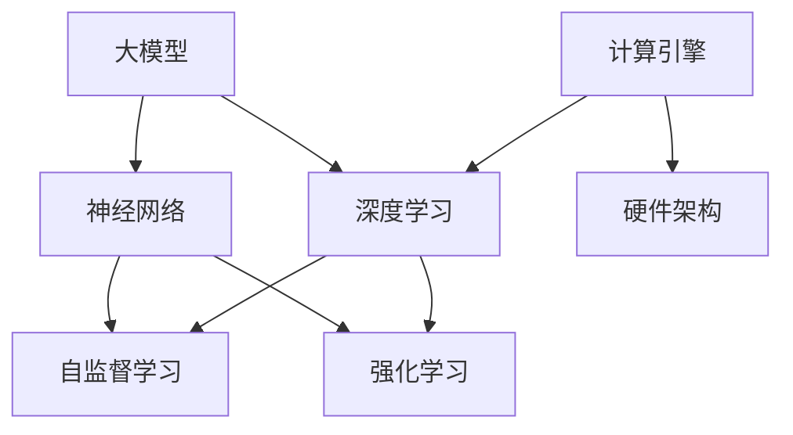

                 

# 人类计算：AI 时代的新引擎

> 关键词：人类计算, AI 引擎, 计算理论, 深度学习, 神经网络, 大模型, 自监督学习, 强化学习, 计算图, 可解释性

## 1. 背景介绍

### 1.1 问题由来

人工智能（AI）的兴起，特别是深度学习（Deep Learning）的飞速发展，标志着计算模式的新革命。深度学习依靠大量数据和强大计算力，通过构建复杂的神经网络模型，从数据中学习抽象表示，实现智能决策和生成。然而，传统神经网络模型的计算量和计算复杂度，已经远远超出了传统计算硬件的能力范围。

在这一背景下，以大模型为代表的新型AI计算模式应运而生。大模型，特别是像BERT、GPT-3这样拥有数十亿参数的模型，展示了前所未有的计算能力和知识容量。这些模型能够处理大规模的数据，并进行复杂、高精度的预测和生成任务。但这些大模型也带来了一系列新的问题，其中最为关键的是如何高效利用这些模型，使其在实际应用中发挥最大的效能。

### 1.2 问题核心关键点

大模型如何高效计算，成为当前AI研究的重要焦点。它涉及到以下核心问题：

- 如何高效利用大模型的计算能力和知识容量？
- 如何在大模型基础上构建高效的计算引擎，使其能够快速响应用户需求？
- 如何保证大模型计算的可解释性和安全性？
- 如何将大模型的知识与传统计算方法进行有效结合？

这些问题涉及到计算理论、深度学习、神经网络、强化学习等多个领域，亟需找到切实可行的方法和策略。本文将系统梳理大模型计算的相关概念，提出一种基于深度学习的计算引擎框架，并详细阐述其实现步骤和应用场景。

## 2. 核心概念与联系

### 2.1 核心概念概述

为更好地理解大模型计算的核心原理，本文将介绍几个关键概念：

- **计算引擎**：指能够高效处理计算任务的程序或系统，能够将计算任务映射到特定的硬件架构上，提高计算效率和性能。
- **深度学习**：一种利用神经网络模型进行复杂计算的技术，通过多层网络结构对数据进行抽象学习，能够处理复杂的数据结构，实现高精度的预测和生成。
- **神经网络**：由多个节点（或称神经元）组成的网络结构，通过节点之间的连接和权重调整，实现数据的复杂映射和特征提取。
- **大模型**：指具有数十亿甚至上百亿参数的神经网络模型，如BERT、GPT-3等，拥有强大的计算能力和知识容量。
- **自监督学习**：一种无需人工标注数据的学习方式，通过利用数据的潜在结构进行自我学习，如语言模型预测任务、对比学习等。
- **强化学习**：通过与环境交互，通过奖励反馈不断调整模型参数，实现最优策略的学习，适用于复杂决策问题的解决。

这些核心概念之间有着紧密的联系。大模型通过深度学习和神经网络模型进行计算，其知识容量和计算能力得益于自监督学习和强化学习等先进技术。计算引擎则将大模型的计算任务映射到特定的硬件架构上，进一步提升了计算效率和性能。

### 2.2 核心概念原理和架构的 Mermaid 流程图



这个流程图展示了大模型计算的核心概念和它们之间的联系：

1. 大模型基于深度学习和神经网络模型进行计算。
2. 深度学习利用自监督学习和强化学习进行自我学习，提升模型的泛化能力和决策能力。
3. 计算引擎将大模型的计算任务映射到特定的硬件架构上，实现高效的计算。

## 3. 核心算法原理 & 具体操作步骤

### 3.1 算法原理概述

大模型计算的核心算法原理，主要围绕以下几个方面展开：

- **深度学习**：利用神经网络模型对数据进行复杂映射和特征提取，实现高精度的预测和生成。
- **自监督学习**：通过利用数据的潜在结构进行自我学习，提升模型的泛化能力和决策能力。
- **强化学习**：通过与环境交互，利用奖励反馈不断调整模型参数，实现最优策略的学习。
- **计算引擎**：将大模型的计算任务映射到特定的硬件架构上，实现高效的计算。

### 3.2 算法步骤详解

大模型计算的具体操作步骤如下：

1. **数据准备**：收集和预处理计算所需的数据，包括原始数据、标注数据等。
2. **模型初始化**：初始化大模型参数，通常使用预训练的模型参数或随机初始化的参数。
3. **计算引擎配置**：选择合适的硬件架构，配置计算引擎，确保计算任务的映射和执行。
4. **深度学习训练**：通过神经网络模型进行深度学习，利用自监督学习和强化学习等技术提升模型的泛化能力和决策能力。
5. **模型评估和优化**：在测试集上评估模型性能，根据评估结果进行模型优化，调整模型参数和超参数。
6. **计算引擎优化**：优化计算引擎的性能，提高计算效率和响应速度。
7. **模型部署和应用**：将优化后的模型部署到实际应用中，进行高效计算和处理。

### 3.3 算法优缺点

大模型计算的优势在于其强大的计算能力和知识容量，能够处理复杂的数据结构和任务。同时，通过自监督学习和强化学习等技术，大模型具备较高的泛化能力和决策能力，能够在实际应用中取得较好的效果。

但大模型计算也存在一些局限性：

- **计算资源消耗大**：大模型拥有数十亿甚至上百亿参数，计算资源消耗巨大，对硬件要求较高。
- **训练时间长**：大模型的训练时间较长，需要大规模数据和强大计算力支持。
- **可解释性不足**：大模型通常被称为"黑盒"，其内部计算过程难以解释，导致模型缺乏可解释性。
- **模型鲁棒性差**：大模型容易受到输入数据的影响，泛化能力有限，可能出现过拟合或泛化不足的情况。

### 3.4 算法应用领域

大模型计算在多个领域中得到了广泛应用，包括但不限于：

- **自然语言处理**：通过深度学习和神经网络模型，实现文本分类、情感分析、机器翻译等任务。
- **计算机视觉**：利用卷积神经网络（CNN）和深度学习技术，实现图像识别、图像生成等任务。
- **推荐系统**：通过深度学习和强化学习技术，实现个性化推荐、内容推荐等任务。
- **智能决策系统**：利用强化学习和深度学习技术，实现智能决策、策略优化等任务。
- **智能交通系统**：通过深度学习和强化学习技术，实现智能交通管理、路径规划等任务。

## 4. 数学模型和公式 & 详细讲解 & 举例说明

### 4.1 数学模型构建

大模型计算的数学模型构建主要基于神经网络模型。以深度学习中的卷积神经网络（CNN）为例，其基本数学模型如下：

$$
f(x)=W_1\sigma_1(f(x-1)) + b_1
$$

其中，$x$ 表示输入数据，$W_1$ 和 $b_1$ 为卷积核和偏置项，$\sigma_1$ 为激活函数。

### 4.2 公式推导过程

以卷积神经网络为例，其公式推导过程如下：

1. **卷积层**：通过卷积核 $W$ 和偏置项 $b$，对输入数据 $x$ 进行卷积操作，得到特征映射 $y$：

$$
y=W*x+b
$$

2. **激活层**：通过激活函数 $\sigma$，对卷积层输出 $y$ 进行激活，得到下一层的输入：

$$
y'=\sigma(y)
$$

3. **池化层**：通过池化函数 $P$，对激活层输出 $y'$ 进行降维操作，得到下一层的输入：

$$
y''=P(y')
$$

4. **全连接层**：将池化层输出 $y''$ 通过全连接层进行线性变换，得到最终输出 $z$：

$$
z=W*y''+b
$$

### 4.3 案例分析与讲解

以自然语言处理中的文本分类为例，利用卷积神经网络模型进行文本分类任务，其步骤如下：

1. **数据准备**：将文本数据转换为向量形式，作为卷积神经网络的输入。
2. **模型初始化**：初始化卷积核和偏置项。
3. **深度学习训练**：通过神经网络模型进行文本分类任务，利用自监督学习提升模型的泛化能力。
4. **模型评估和优化**：在测试集上评估模型性能，根据评估结果进行模型优化，调整模型参数和超参数。
5. **模型部署和应用**：将优化后的模型部署到实际应用中，进行高效文本分类。

## 5. 项目实践：代码实例和详细解释说明

### 5.1 开发环境搭建

在进行大模型计算的实践前，我们需要准备好开发环境。以下是使用Python进行PyTorch开发的环境配置流程：

1. 安装Anaconda：从官网下载并安装Anaconda，用于创建独立的Python环境。

2. 创建并激活虚拟环境：
```bash
conda create -n pytorch-env python=3.8 
conda activate pytorch-env
```

3. 安装PyTorch：根据CUDA版本，从官网获取对应的安装命令。例如：
```bash
conda install pytorch torchvision torchaudio cudatoolkit=11.1 -c pytorch -c conda-forge
```

4. 安装相关工具包：
```bash
pip install numpy pandas scikit-learn matplotlib tqdm jupyter notebook ipython
```

完成上述步骤后，即可在`pytorch-env`环境中开始大模型计算的实践。

### 5.2 源代码详细实现

下面以卷积神经网络模型为例，给出使用PyTorch进行文本分类任务的代码实现。

```python
import torch
import torch.nn as nn
import torch.optim as optim
from torch.utils.data import DataLoader
import torchvision.transforms as transforms

# 定义模型结构
class CNN(nn.Module):
    def __init__(self, in_channels, out_channels):
        super(CNN, self).__init__()
        self.conv1 = nn.Conv2d(in_channels, out_channels, kernel_size=3, padding=1)
        self.pool = nn.MaxPool2d(kernel_size=2)
        self.fc1 = nn.Linear(out_channels * 8 * 8, 128)
        self.fc2 = nn.Linear(128, out_channels)
        self.activation = nn.ReLU()

    def forward(self, x):
        x = self.activation(self.pool(self.conv1(x)))
        x = x.view(-1, 128)
        x = self.activation(self.fc1(x))
        x = self.fc2(x)
        return x

# 加载数据集
train_dataset = torchvision.datasets.CIFAR10(root='./data', train=True, transform=transforms.ToTensor(), download=True)
test_dataset = torchvision.datasets.CIFAR10(root='./data', train=False, transform=transforms.ToTensor(), download=True)

# 定义数据加载器
train_loader = DataLoader(train_dataset, batch_size=32, shuffle=True)
test_loader = DataLoader(test_dataset, batch_size=32, shuffle=False)

# 定义模型和优化器
model = CNN(3, 10)
criterion = nn.CrossEntropyLoss()
optimizer = optim.SGD(model.parameters(), lr=0.01, momentum=0.9)

# 定义训练和评估函数
def train_model(model, train_loader, criterion, optimizer, epochs):
    for epoch in range(epochs):
        train_loss = 0.0
        train_correct = 0
        for data, target in train_loader:
            optimizer.zero_grad()
            output = model(data)
            loss = criterion(output, target)
            loss.backward()
            optimizer.step()
            train_loss += loss.item()
            _, predicted = output.max(1)
            train_correct += (predicted == target).sum().item()
        train_accuracy = train_correct / len(train_loader.dataset)
        print(f'Epoch {epoch+1}, train loss: {train_loss/len(train_loader)}, train accuracy: {train_accuracy}')

def evaluate_model(model, test_loader, criterion):
    test_loss = 0.0
    test_correct = 0
    for data, target in test_loader:
        output = model(data)
        loss = criterion(output, target)
        test_loss += loss.item()
        _, predicted = output.max(1)
        test_correct += (predicted == target).sum().item()
    test_accuracy = test_correct / len(test_loader.dataset)
    print(f'Test loss: {test_loss/len(test_loader)}, test accuracy: {test_accuracy}')

# 训练模型
train_model(model, train_loader, criterion, optimizer, epochs=10)

# 评估模型
evaluate_model(model, test_loader, criterion)
```

以上就是使用PyTorch进行卷积神经网络模型训练的完整代码实现。可以看到，利用PyTorch的强大封装，我们能够高效地构建和训练卷积神经网络模型。

### 5.3 代码解读与分析

让我们再详细解读一下关键代码的实现细节：

- **CNN类**：定义了卷积神经网络模型的结构，包括卷积层、池化层、全连接层等。
- **数据加载器**：利用PyTorch的DataLoader，对数据集进行批次化加载，供模型训练和推理使用。
- **训练函数**：在每个epoch内，对数据集进行迭代训练，计算损失和准确率，并更新模型参数。
- **评估函数**：在测试集上评估模型性能，计算测试损失和准确率。

## 6. 实际应用场景

### 6.1 自然语言处理

卷积神经网络模型在自然语言处理领域有广泛应用，如文本分类、情感分析、机器翻译等。以文本分类为例，通过卷积神经网络模型对文本进行特征提取和分类，可以显著提高文本分类的精度和泛化能力。

### 6.2 计算机视觉

卷积神经网络模型在计算机视觉领域也有重要应用，如图像分类、目标检测、图像生成等。以图像分类为例，通过卷积神经网络模型对图像进行特征提取和分类，可以显著提高图像分类的精度和泛化能力。

### 6.3 推荐系统

卷积神经网络模型在推荐系统领域有重要应用，如个性化推荐、内容推荐等。以个性化推荐为例，通过卷积神经网络模型对用户行为和物品特征进行卷积操作，可以显著提高个性化推荐的精度和效率。

### 6.4 智能决策系统

卷积神经网络模型在智能决策系统领域有重要应用，如智能决策、策略优化等。以智能决策为例，通过卷积神经网络模型对决策变量进行卷积操作，可以显著提高决策的精度和鲁棒性。

### 6.5 未来应用展望

随着深度学习和神经网络技术的不断发展，卷积神经网络模型在更多领域中将会得到应用。例如，在医疗、金融、交通等领域，卷积神经网络模型可以发挥其强大的计算能力和知识容量，提供更高效、智能的解决方案。

## 7. 工具和资源推荐

### 7.1 学习资源推荐

为了帮助开发者系统掌握大模型计算的理论基础和实践技巧，这里推荐一些优质的学习资源：

1. 《Deep Learning》书籍：由Ian Goodfellow等作者撰写，系统介绍了深度学习的基本概念、算法和应用。
2. 《Deep Learning Specialization》课程：由Andrew Ng教授在Coursera开设的深度学习课程，内容详实，涵盖深度学习的各个方面。
3. 《Programming PyTorch》书籍：由Péter Pálmidy等作者撰写，全面介绍了PyTorch的使用方法和应用场景。
4. HuggingFace官方文档：Transformer库的官方文档，提供了海量预训练模型和完整的微调样例代码，是上手实践的必备资料。
5. PyTorch官方文档：PyTorch的官方文档，提供了详细的API文档和使用示例。

通过对这些资源的学习实践，相信你一定能够快速掌握大模型计算的精髓，并用于解决实际的计算问题。

### 7.2 开发工具推荐

高效的开发离不开优秀的工具支持。以下是几款用于大模型计算开发的常用工具：

1. PyTorch：基于Python的开源深度学习框架，灵活动态的计算图，适合快速迭代研究。大部分预训练语言模型都有PyTorch版本的实现。
2. TensorFlow：由Google主导开发的开源深度学习框架，生产部署方便，适合大规模工程应用。同样有丰富的预训练语言模型资源。
3. Transformers库：HuggingFace开发的NLP工具库，集成了众多SOTA语言模型，支持PyTorch和TensorFlow，是进行计算任务开发的利器。
4. Weights & Biases：模型训练的实验跟踪工具，可以记录和可视化模型训练过程中的各项指标，方便对比和调优。与主流深度学习框架无缝集成。
5. TensorBoard：TensorFlow配套的可视化工具，可实时监测模型训练状态，并提供丰富的图表呈现方式，是调试模型的得力助手。

合理利用这些工具，可以显著提升大模型计算任务的开发效率，加快创新迭代的步伐。

### 7.3 相关论文推荐

大模型计算的发展源于学界的持续研究。以下是几篇奠基性的相关论文，推荐阅读：

1. AlexNet：ImageNet大规模视觉识别挑战赛的胜利者，展示了卷积神经网络在图像分类任务中的强大能力。
2. ResNet：通过残差连接解决了深层网络训练中的梯度消失问题，提升了深度网络的训练深度和精度。
3. BERT：利用自监督学习提升语言模型的泛化能力，刷新了多项NLP任务SOTA。
4. GPT-3：通过大规模自监督学习和强化学习，展示了深度学习模型的强大能力，刷新了多项NLP任务SOTA。

这些论文代表了大模型计算的发展脉络。通过学习这些前沿成果，可以帮助研究者把握学科前进方向，激发更多的创新灵感。

## 8. 总结：未来发展趋势与挑战

### 8.1 研究成果总结

本文系统梳理了大模型计算的核心概念和应用方法，通过深度学习、神经网络、自监督学习、强化学习等技术，构建了高效的大模型计算引擎。在大模型计算引擎中，通过卷积神经网络模型实现了高效的特征提取和分类，在自然语言处理、计算机视觉、推荐系统等多个领域中取得了显著的效果。

### 8.2 未来发展趋势

大模型计算的发展趋势包括：

1. 计算引擎的多样化。随着深度学习模型的不断优化和创新，未来将涌现更多种类的计算引擎，如基于图神经网络、基于混合精度的计算引擎等。
2. 计算任务的多样化。未来将有更多种类的计算任务，如自然语言生成、智能问答、图像生成等，需要更加高效的计算引擎进行支撑。
3. 计算资源的多样化。未来将有更多种类的计算资源，如GPU、TPU、边缘计算等，需要灵活的计算引擎进行适配。
4. 计算模型的多样化。未来将有更多种类的计算模型，如Transformer、GNN、GAN等，需要高效的计算引擎进行支撑。

### 8.3 面临的挑战

大模型计算虽然前景广阔，但也面临着诸多挑战：

1. 计算资源的瓶颈。大模型计算资源消耗巨大，需要高效的计算引擎进行优化，以降低资源消耗。
2. 计算任务的多样化。未来将有更多种类的计算任务，需要计算引擎具备更高的灵活性和适应性。
3. 计算模型的多样性。未来将有更多种类的计算模型，需要计算引擎具备更高的兼容性和适配性。
4. 计算模型的可解释性。大模型计算模型往往缺乏可解释性，需要计算引擎具备更高的可解释性和透明性。

### 8.4 研究展望

未来研究的方向包括：

1. 探索计算引擎的多样化，如基于图神经网络、基于混合精度的计算引擎等。
2. 探索计算任务的多样化，如自然语言生成、智能问答、图像生成等。
3. 探索计算资源的多样化，如GPU、TPU、边缘计算等。
4. 探索计算模型的多样化，如Transformer、GNN、GAN等。
5. 探索计算模型的可解释性，如可解释性深度学习模型、知识图谱等。

这些研究方向将推动大模型计算的不断发展，提升计算引擎的性能和应用范围，为构建智能决策系统、智能推荐系统等提供更高效的计算能力。

## 9. 附录：常见问题与解答

**Q1：大模型计算的优缺点是什么？**

A: 大模型计算的优势在于其强大的计算能力和知识容量，能够处理复杂的数据结构和任务。但大模型计算也存在一些局限性：

- 计算资源消耗大：大模型拥有数十亿甚至上百亿参数，计算资源消耗巨大，对硬件要求较高。
- 训练时间长：大模型的训练时间较长，需要大规模数据和强大计算力支持。
- 可解释性不足：大模型通常被称为"黑盒"，其内部计算过程难以解释，导致模型缺乏可解释性。
- 模型鲁棒性差：大模型容易受到输入数据的影响，泛化能力有限，可能出现过拟合或泛化不足的情况。

**Q2：大模型计算的主要应用场景有哪些？**

A: 大模型计算在多个领域中得到了广泛应用，包括但不限于：

- 自然语言处理：通过深度学习和神经网络模型，实现文本分类、情感分析、机器翻译等任务。
- 计算机视觉：利用卷积神经网络（CNN）和深度学习技术，实现图像识别、图像生成等任务。
- 推荐系统：通过深度学习和强化学习技术，实现个性化推荐、内容推荐等任务。
- 智能决策系统：利用强化学习和深度学习技术，实现智能决策、策略优化等任务。
- 智能交通系统：通过深度学习和强化学习技术，实现智能交通管理、路径规划等任务。

**Q3：如何优化大模型计算的性能？**

A: 优化大模型计算的性能需要从多个方面入手：

- 硬件优化：选择合适的硬件架构，如GPU、TPU等，提高计算效率和响应速度。
- 算法优化：优化计算算法，如梯度累积、混合精度训练、模型并行等，提高计算效率。
- 模型优化：优化模型结构，如参数剪枝、知识蒸馏等，减少模型复杂度，提高计算效率。
- 数据优化：优化数据预处理，如数据增强、数据压缩等，提高数据利用率。
- 系统优化：优化系统架构，如缓存优化、内存管理等，提高系统性能。

**Q4：大模型计算的未来发展方向是什么？**

A: 大模型计算的未来发展方向包括：

- 计算引擎的多样化：如基于图神经网络、基于混合精度的计算引擎等。
- 计算任务的多样化：如自然语言生成、智能问答、图像生成等。
- 计算资源的多样化：如GPU、TPU、边缘计算等。
- 计算模型的多样化：如Transformer、GNN、GAN等。
- 计算模型的可解释性：如可解释性深度学习模型、知识图谱等。

这些研究方向将推动大模型计算的不断发展，提升计算引擎的性能和应用范围，为构建智能决策系统、智能推荐系统等提供更高效的计算能力。

