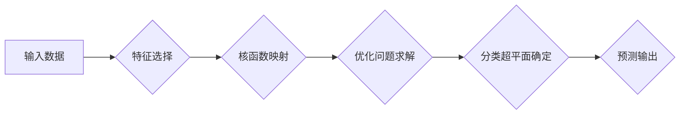

> 支持向量机(SVM)
> 机器学习
> 分类
> 回归
> 核函数
> Python

## 1. 背景介绍

在机器学习领域，分类和回归任务是基础且广泛应用的类型。支持向量机(SVM)作为一种强大的分类算法，在解决非线性分类问题方面表现出色。其核心思想是找到一个最佳的分隔超平面，将数据点有效地划分到不同的类别中。

SVM算法的优势在于：

* **高效性:** SVM算法在训练和预测过程中都具有较高的效率。
* **鲁棒性:** SVM算法对噪声数据和异常值具有较强的鲁棒性。
* **泛化能力:** SVM算法能够有效地推广到新的数据样本上。

## 2. 核心概念与联系

**2.1 支持向量**

支持向量是距离分类超平面最近的训练样本点，它们对分类超平面的确定起着关键作用。

**2.2 分类超平面**

分类超平面是将数据点划分为不同类别的决策边界。在二维空间中，分类超平面是一个直线；在三维空间中，分类超平面是一个平面。

**2.3 间隔**

间隔是指分类超平面到最近支持向量的距离。SVM算法的目标是找到一个最大间隔的分类超平面。

**2.4 核函数**

核函数是一种将低维数据映射到高维空间的技术，用于解决非线性分类问题。常用的核函数包括线性核函数、多项式核函数、径向基函数核函数等。

**2.5 优化问题**

SVM算法的核心是求解一个优化问题，目标是找到最大间隔的分类超平面。

**2.6  Mermaid 流程图**



## 3. 核心算法原理 & 具体操作步骤

### 3.1  算法原理概述

SVM算法的基本原理是找到一个最佳的分隔超平面，将数据点有效地划分到不同的类别中。这个超平面应该尽可能地远离数据点，从而提高模型的泛化能力。

### 3.2  算法步骤详解

1. **数据预处理:** 对输入数据进行清洗、转换和特征选择等预处理操作。
2. **核函数选择:** 根据数据的特征和分类任务选择合适的核函数。
3. **优化问题求解:** 使用优化算法求解SVM算法的优化问题，得到分类超平面的参数。
4. **分类预测:** 将新的数据点映射到高维空间，根据分类超平面的参数进行分类预测。

### 3.3  算法优缺点

**优点:**

* **高效性:** SVM算法在训练和预测过程中都具有较高的效率。
* **鲁棒性:** SVM算法对噪声数据和异常值具有较强的鲁棒性。
* **泛化能力:** SVM算法能够有效地推广到新的数据样本上。

**缺点:**

* **参数选择:** SVM算法需要选择核函数和惩罚参数等超参数，这些参数的选择会影响模型的性能。
* **内存消耗:** 当数据量较大时，SVM算法的内存消耗可能会比较高。

### 3.4  算法应用领域

SVM算法广泛应用于以下领域:

* **图像识别:** 人脸识别、物体检测、图像分类等。
* **文本分类:** 垃圾邮件过滤、情感分析、文本摘要等。
* **生物信息学:** 基因预测、蛋白质结构预测等。
* **金融领域:** 欺诈检测、信用评分等。

## 4. 数学模型和公式 & 详细讲解 & 举例说明

### 4.1  数学模型构建

假设我们有训练数据集：

$$
T = {(x_1, y_1), (x_2, y_2), ..., (x_N, y_N)}
$$

其中，$x_i \in R^d$ 是第 $i$ 个样本的特征向量，$y_i \in {-1, 1}$ 是第 $i$ 个样本的类别标签。

SVM的目标是找到一个最佳的分隔超平面，其数学表达式为：

$$
w^T x + b = 0
$$

其中，$w \in R^d$ 是超平面的法向量，$b \in R$ 是超平面的截距。

### 4.2  公式推导过程

SVM算法的目标是最大化间隔，即找到一个满足以下条件的超平面：

* 对于所有支持向量，都有：

$$
y_i (w^T x_i + b) \geq 1
$$

* 间隔为：

$$
\frac{2}{||w||}
$$

其中，$||w||$ 是超平面的法向量长度。

通过拉格朗日乘子法，可以将上述问题转化为一个凸二次规划问题，并求解得到最优解。

### 4.3  案例分析与讲解

假设我们有一个二维数据集，其中正类样本点位于左半平面，负类样本点位于右半平面。我们可以使用线性核函数的SVM算法进行分类。

通过训练SVM模型，我们可以得到一个最佳的分隔超平面，将正类样本点和负类样本点有效地划分开来。

## 5. 项目实践：代码实例和详细解释说明

### 5.1  开发环境搭建

* Python 3.x
* scikit-learn 库

### 5.2  源代码详细实现

```python
from sklearn import svm
from sklearn.datasets import make_classification
from sklearn.model_selection import train_test_split
from sklearn.metrics import accuracy_score

# 生成分类数据集
X, y = make_classification(n_samples=100, n_features=2, random_state=42)

# 将数据划分为训练集和测试集
X_train, X_test, y_train, y_test = train_test_split(X, y, test_size=0.2, random_state=42)

# 创建SVM分类器
clf = svm.SVC(kernel='linear')

# 训练SVM模型
clf.fit(X_train, y_train)

# 对测试集进行预测
y_pred = clf.predict(X_test)

# 计算模型准确率
accuracy = accuracy_score(y_test, y_pred)
print(f"模型准确率: {accuracy}")
```

### 5.3  代码解读与分析

* 使用 `make_classification` 函数生成一个分类数据集。
* 使用 `train_test_split` 函数将数据划分为训练集和测试集。
* 创建一个 `SVC` 类实例，指定核函数为 `linear`。
* 使用 `fit` 方法训练SVM模型。
* 使用 `predict` 方法对测试集进行预测。
* 使用 `accuracy_score` 函数计算模型准确率。

### 5.4  运行结果展示

运行上述代码，可以得到模型的准确率。

## 6. 实际应用场景

SVM算法在实际应用中具有广泛的应用场景，例如：

* **图像识别:** SVM可以用于人脸识别、物体检测、图像分类等任务。
* **文本分类:** SVM可以用于垃圾邮件过滤、情感分析、文本摘要等任务。
* **生物信息学:** SVM可以用于基因预测、蛋白质结构预测等任务。
* **金融领域:** SVM可以用于欺诈检测、信用评分等任务。

### 6.4  未来应用展望

随着机器学习技术的不断发展，SVM算法在未来将有更广泛的应用场景。例如：

* **深度学习结合:** 将SVM算法与深度学习算法结合，可以提高模型的性能。
* **大数据处理:** 针对大数据场景，可以开发更高效的SVM算法实现。
* **新领域应用:** SVM算法可以应用于更多新的领域，例如医疗诊断、智能交通等。

## 7. 工具和资源推荐

### 7.1  学习资源推荐

* **书籍:**
    * 《机器学习实战》
    * 《Python机器学习》
* **在线课程:**
    * Coursera 上的机器学习课程
    * edX 上的机器学习课程

### 7.2  开发工具推荐

* **Python:** Python 是机器学习领域最常用的编程语言。
* **scikit-learn:** scikit-learn 是一个强大的机器学习库，包含了各种算法实现，包括SVM算法。
* **TensorFlow:** TensorFlow 是一个开源的机器学习框架，可以用于构建和训练深度学习模型。

### 7.3  相关论文推荐

* **Support Vector Machines** by Vladimir Vapnik and Alexey Chervonenkis
* **A Tutorial on Support Vector Machines for Pattern Recognition** by Christopher J.C. Burges

## 8. 总结：未来发展趋势与挑战

### 8.1  研究成果总结

SVM算法在分类和回归任务中取得了显著的成果，并在许多实际应用领域中得到了广泛应用。

### 8.2  未来发展趋势

未来，SVM算法的研究将朝着以下方向发展:

* **高效性提升:** 开发更高效的SVM算法实现，能够处理更大规模的数据集。
* **鲁棒性增强:** 研究更鲁棒的SVM算法，能够更好地应对噪声数据和异常值。
* **泛化能力提高:** 研究提高SVM算法泛化能力的方法，使其能够更好地推广到新的数据样本上。

### 8.3  面临的挑战

SVM算法也面临一些挑战:

* **参数选择:** SVM算法需要选择核函数和惩罚参数等超参数，这些参数的选择会影响模型的性能。
* **内存消耗:** 当数据量较大时，SVM算法的内存消耗可能会比较高。
* **非线性问题:** 对于复杂非线性问题，SVM算法的性能可能不如其他算法。

### 8.4  研究展望

未来，研究者将继续探索SVM算法的潜力，开发更有效、更鲁棒、更易于使用的SVM算法，使其在更多领域得到应用。

## 9. 附录：常见问题与解答

**问题 1:** 如何选择SVM算法的核函数？

**解答:** 核函数的选择取决于数据的特征和分类任务。常用的核函数包括线性核函数、多项式核函数、径向基函数核函数等。

**问题 2:** SVM算法的惩罚参数C如何设置？

**解答:** 惩罚参数C控制了模型的复杂度。较小的C值会导致模型欠拟合，较大的C值会导致模型过拟合。

**问题 3:** SVM算法的内存消耗如何降低？

**解答:** 可以使用核技巧、随机梯度下降等方法降低SVM算法的内存消耗。


作者：禅与计算机程序设计艺术 / Zen and the Art of Computer Programming 
<end_of_turn>