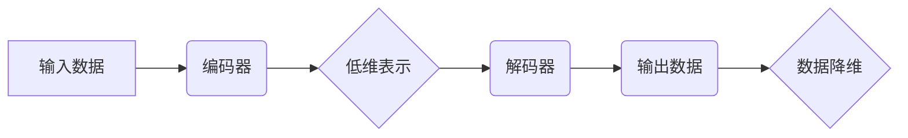

> 自动编码器、深度学习、数据降维、主成分分析、Python、TensorFlow

## 1. 背景介绍

在海量数据时代，数据降维技术显得尤为重要。它可以有效地减少数据的维度，同时保留数据的关键信息，从而提高数据处理效率，降低计算复杂度，并为后续机器学习模型的训练提供更优质的数据。传统的降维方法，如主成分分析（PCA），虽然有效，但往往难以捕捉到数据中的非线性结构。

深度学习的兴起为数据降维带来了新的机遇。自动编码器（Autoencoder）作为一种无监督学习模型，能够自动学习数据的潜在表示，并将其映射到低维空间。由于其强大的非线性建模能力，自动编码器在数据降维方面展现出优异的性能。

本篇文章将深入探讨自动编码器在数据降维中的应用，并通过Python代码实例，详细讲解其原理、算法步骤、数学模型以及实际应用场景。

## 2. 核心概念与联系

### 2.1 自动编码器

自动编码器是一种神经网络模型，其结构由编码器和解码器两部分组成。编码器负责将输入数据映射到低维空间，解码器则负责将低维表示恢复到原始数据空间。

自动编码器的训练目标是使解码器输出尽可能接近原始输入数据。通过这种训练过程，自动编码器能够学习到数据的潜在表示，即数据中的关键特征。

### 2.2 数据降维

数据降维是指将高维数据映射到低维空间的过程。降维的目标是保留数据的关键信息，同时减少数据的维度。

自动编码器可以作为一种有效的降维工具，其学习到的低维表示可以作为数据的压缩表示，用于后续的机器学习任务。

### 2.3 核心概念关系



## 3. 核心算法原理 & 具体操作步骤

### 3.1 算法原理概述

自动编码器的核心原理是利用神经网络的非线性建模能力，学习到数据的潜在表示。

训练过程如下：

1. 将输入数据输入到编码器中，编码器将数据映射到低维空间。
2. 将低维表示输入到解码器中，解码器将数据恢复到原始数据空间。
3. 计算解码器输出与原始输入数据的误差，并反向传播误差，更新编码器和解码器的参数。
4. 重复步骤1-3，直到误差达到最小值。

### 3.2 算法步骤详解

1. **数据预处理:** 将原始数据进行标准化或归一化处理，使其符合神经网络的输入要求。
2. **网络结构设计:** 根据数据的特点和降维目标，设计编码器和解码器的网络结构。
3. **参数初始化:** 初始化编码器和解码器的参数。
4. **训练模型:** 使用训练数据训练自动编码器，并通过反向传播算法更新模型参数。
5. **评估模型:** 使用测试数据评估模型的性能，例如重建误差、降维后的数据质量等。
6. **应用模型:** 将训练好的自动编码器应用于实际数据降维任务。

### 3.3 算法优缺点

**优点:**

* 能够捕捉到数据中的非线性结构。
* 可以自动学习数据的潜在表示。
* 降维后的数据保留了数据的关键信息。

**缺点:**

* 训练时间较长，需要大量的计算资源。
* 网络结构设计需要经验和技巧。
* 容易过拟合，需要进行正则化处理。

### 3.4 算法应用领域

自动编码器在数据降维方面具有广泛的应用领域，例如：

* **图像压缩:** 将图像数据降维，减少存储空间和传输带宽。
* **特征提取:** 从图像、文本等数据中提取特征，用于后续的机器学习任务。
* **异常检测:** 将数据降维，识别异常数据点。
* **数据可视化:** 将高维数据降维，方便可视化分析。

## 4. 数学模型和公式 & 详细讲解 & 举例说明

### 4.1 数学模型构建

自动编码器的数学模型可以表示为：

* 编码器：$z = f(x; \theta_e)$
* 解码器：$\hat{x} = g(z; \theta_d)$

其中：

* $x$ 是输入数据。
* $z$ 是低维表示。
* $\theta_e$ 是编码器的参数。
* $\theta_d$ 是解码器的参数。
* $f$ 是编码器的激活函数。
* $g$ 是解码器的激活函数。

### 4.2 公式推导过程

自动编码器的训练目标是最小化重建误差，即原始数据与解码器输出之间的差异。常用的损失函数是均方误差（MSE）：

$$
L = \frac{1}{N} \sum_{i=1}^{N} ||x_i - \hat{x}_i||^2
$$

其中：

* $N$ 是样本数量。
* $x_i$ 是第 $i$ 个样本的输入数据。
* $\hat{x}_i$ 是第 $i$ 个样本的解码器输出。

通过反向传播算法，可以更新编码器和解码器的参数，使损失函数最小化。

### 4.3 案例分析与讲解

假设我们有一个包含图像数据的训练集，我们希望使用自动编码器进行数据降维。

1. 我们可以设计一个编码器，将图像数据映射到一个低维空间，例如10维。
2. 我们可以设计一个解码器，将低维表示恢复到原始图像空间。
3. 我们使用训练数据训练自动编码器，并通过反向传播算法更新模型参数。
4. 训练完成后，我们可以使用编码器将新的图像数据映射到低维空间，从而实现数据降维。

## 5. 项目实践：代码实例和详细解释说明

### 5.1 开发环境搭建

本项目使用Python语言和TensorFlow深度学习框架进行开发。

需要安装以下软件：

* Python 3.x
* TensorFlow 2.x
* NumPy
* Matplotlib

### 5.2 源代码详细实现

```python
import tensorflow as tf
from tensorflow.keras import layers

# 定义编码器
encoder = tf.keras.Sequential([
    layers.Input(shape=(784,)),  # 输入数据维度为784
    layers.Dense(128, activation='relu'),
    layers.Dense(64, activation='relu'),
    layers.Dense(32, activation='relu'),
])

# 定义解码器
decoder = tf.keras.Sequential([
    layers.Input(shape=(32,)),
    layers.Dense(64, activation='relu'),
    layers.Dense(128, activation='relu'),
    layers.Dense(784, activation='sigmoid'),
])

# 构建自动编码器模型
autoencoder = tf.keras.Model(inputs=encoder.input, outputs=decoder(encoder.output))

# 编译模型
autoencoder.compile(optimizer='adam', loss='mse')

# 训练模型
autoencoder.fit(x_train, x_train, epochs=10)

# 使用编码器进行数据降维
encoded_data = encoder.predict(x_test)
```

### 5.3 代码解读与分析

* 编码器和解码器分别由多个全连接层组成，并使用ReLU激活函数。
* 编码器将输入数据映射到低维空间，解码器将低维表示恢复到原始数据空间。
* 模型使用均方误差作为损失函数，并使用Adam优化器进行训练。
* 训练完成后，我们可以使用编码器将新的数据映射到低维空间，从而实现数据降维。

### 5.4 运行结果展示

训练完成后，我们可以使用编码器将测试数据映射到低维空间，并可视化降维后的数据。

## 6. 实际应用场景

### 6.1 图像压缩

自动编码器可以用于图像压缩，将图像数据降维，减少存储空间和传输带宽。

### 6.2 特征提取

自动编码器可以从图像、文本等数据中提取特征，用于后续的机器学习任务。

### 6.3 异常检测

自动编码器可以将数据降维，识别异常数据点。

### 6.4 未来应用展望

随着深度学习技术的不断发展，自动编码器在数据降维方面的应用前景更加广阔。

## 7. 工具和资源推荐

### 7.1 学习资源推荐

* 深度学习入门书籍：
    * 《深度学习》
    * 《动手学深度学习》
* 在线课程：
    * Coursera: 深度学习
    * Udacity: 深度学习工程师

### 7.2 开发工具推荐

* TensorFlow: 深度学习框架
* PyTorch: 深度学习框架
* Keras: 高级API，用于构建和训练深度学习模型

### 7.3 相关论文推荐

* 《Auto-Encoding Variational Bayes》
* 《Stacked Autoencoders》
* 《Denoising Autoencoders》

## 8. 总结：未来发展趋势与挑战

### 8.1 研究成果总结

自动编码器在数据降维方面取得了显著的成果，能够有效地捕捉到数据中的非线性结构，并实现数据压缩和特征提取。

### 8.2 未来发展趋势

* **更强大的模型架构:** 研究更复杂的自动编码器模型架构，例如变分自动编码器（VAE）和生成对抗网络（GAN）。
* **更有效的训练算法:** 研究更有效的训练算法，例如迁移学习和强化学习，提高自动编码器的训练效率。
* **更广泛的应用场景:** 将自动编码器应用于更多领域，例如自然语言处理、语音识别和药物发现。

### 8.3 面临的挑战

* **训练时间长:** 自动编码器的训练时间较长，需要大量的计算资源。
* **网络结构设计复杂:** 自动编码器的网络结构设计需要经验和技巧。
* **过拟合问题:** 自动编码器容易过拟合，需要进行正则化处理。

### 8.4 研究展望

未来，自动编码器将在数据降维领域继续发挥重要作用，并与其他深度学习技术相结合，推动人工智能技术的进一步发展。

## 9. 附录：常见问题与解答

### 9.1 什么是自动编码器？

自动编码器是一种神经网络模型，其结构由编码器和解码器两部分组成。编码器负责将输入数据映射到低维空间，解码器则负责将低维表示恢复到原始数据空间。

### 9.2 自动编码器的训练目标是什么？

自动编码器的训练目标是最小化重建误差，即原始数据与解码器输出之间的差异。

### 9.3 自动编码器有哪些应用场景？

自动编码器在数据降维、图像压缩、特征提取、异常检测等领域具有广泛的应用场景。


作者：禅与计算机程序设计艺术 / Zen and the Art of Computer Programming 
<end_of_turn>