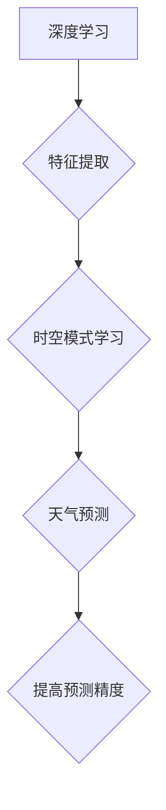

> 深度学习，天气预测，Python，神经网络，卷积神经网络，循环神经网络，LSTM，时间序列分析

## 1. 背景介绍

天气预报一直是人类社会的重要需求，它直接影响着人们的生活、生产和安全。传统的数值天气预报模型虽然取得了一定的成果，但受限于计算能力和模型复杂度，其预测精度仍然存在局限性。近年来，深度学习技术在各个领域取得了突破性进展，其强大的学习能力和非线性拟合能力为提高天气预测精度提供了新的思路。

深度学习模型能够从海量天气数据中自动提取特征，学习复杂的时空模式，从而实现更精准的天气预测。本文将以Python为编程语言，结合深度学习框架TensorFlow或PyTorch，深入探讨如何利用深度学习技术提高天气预测准确性。

## 2. 核心概念与联系

### 2.1 深度学习

深度学习是一种机器学习的子领域，它利用多层神经网络来模拟人类大脑的学习过程。深度学习模型能够自动学习数据中的特征，无需人工特征工程，从而提高模型的学习能力和预测精度。

### 2.2 天气预测

天气预测是指利用物理学、数学模型和观测数据，预测未来一段时间内的天气状况。传统的数值天气预报模型基于物理定律，通过数值模拟来预测天气变化。然而，这些模型的复杂度很高，计算量大，并且难以捕捉天气系统中的非线性模式。

### 2.3 深度学习与天气预测的结合

深度学习技术能够有效解决传统天气预报模型面临的挑战。深度学习模型能够从海量天气数据中自动提取特征，学习复杂的时空模式，从而提高天气预测的精度和效率。



## 3. 核心算法原理 & 具体操作步骤

### 3.1 算法原理概述

在天气预测领域，常用的深度学习算法包括卷积神经网络（CNN）和循环神经网络（RNN）。

* **卷积神经网络（CNN）**：CNN擅长处理图像数据，可以有效提取图像中的空间特征。在天气预测中，CNN可以用于处理卫星图像、雷达图像等数据，提取天气系统中的空间结构信息。

* **循环神经网络（RNN）**：RNN擅长处理序列数据，可以学习时间序列中的依赖关系。在天气预测中，RNN可以用于处理历史天气数据，学习天气变化的趋势和模式。

### 3.2 算法步骤详解

**使用CNN进行天气预测的步骤：**

1. **数据预处理：** 将卫星图像、雷达图像等数据进行预处理，例如归一化、裁剪等。
2. **构建CNN模型：** 设计CNN模型结构，包括卷积层、池化层、全连接层等。
3. **模型训练：** 使用训练数据训练CNN模型，调整模型参数，使模型能够准确预测天气状况。
4. **模型评估：** 使用测试数据评估模型的预测精度，例如准确率、召回率等。
5. **模型部署：** 将训练好的模型部署到生产环境中，用于实时天气预测。

**使用RNN进行天气预测的步骤：**

1. **数据预处理：** 将历史天气数据进行预处理，例如归一化、滑动窗口等。
2. **构建RNN模型：** 设计RNN模型结构，例如LSTM、GRU等。
3. **模型训练：** 使用训练数据训练RNN模型，调整模型参数，使模型能够准确预测未来天气状况。
4. **模型评估：** 使用测试数据评估模型的预测精度，例如均方误差、平均绝对误差等。
5. **模型部署：** 将训练好的模型部署到生产环境中，用于实时天气预测。

### 3.3 算法优缺点

**CNN的优点：**

* 擅长处理图像数据，可以有效提取图像中的空间特征。
* 具有较强的泛化能力，可以应用于不同的天气预测任务。

**CNN的缺点：**

* 难以捕捉时间序列中的依赖关系。
* 计算量较大，训练时间较长。

**RNN的优点：**

* 擅长处理序列数据，可以学习时间序列中的依赖关系。
* 能够捕捉天气变化的趋势和模式。

**RNN的缺点：**

* 训练难度较大，容易出现梯度消失或爆炸问题。
* 难以处理长序列数据。

### 3.4 算法应用领域

深度学习算法在天气预测领域有着广泛的应用，例如：

* **短期天气预报：** 预测未来几小时或几天的天气状况。
* **中期天气预报：** 预测未来几天或几周的天气状况。
* **极端天气预报：** 预测暴雨、洪水、干旱等极端天气事件。
* **气候变化研究：** 研究气候变化趋势和影响。

## 4. 数学模型和公式 & 详细讲解 & 举例说明

### 4.1 数学模型构建

在深度学习模型中，天气预测通常采用回归模型，将历史天气数据作为输入，预测未来天气状况。常用的回归模型包括线性回归、多项式回归和神经网络回归。

### 4.2 公式推导过程

**线性回归模型：**

假设我们有n个样本数据，每个样本包含m个特征，以及一个目标值。线性回归模型试图找到一条直线，将这些样本数据拟合。

模型公式：

$$y = w_0 + w_1x_1 + w_2x_2 + ... + w_mx_m$$

其中：

* $y$ 是目标值
* $w_0, w_1, w_2, ..., w_m$ 是模型参数
* $x_1, x_2, ..., x_m$ 是特征值

**损失函数：**

线性回归模型常用的损失函数是均方误差（MSE）：

$$MSE = \frac{1}{n}\sum_{i=1}^{n}(y_i - \hat{y}_i)^2$$

其中：

* $y_i$ 是第i个样本的目标值
* $\hat{y}_i$ 是模型预测的第i个样本的目标值

**梯度下降算法：**

梯度下降算法用于优化模型参数，使其能够最小化损失函数。

### 4.3 案例分析与讲解

假设我们想要预测房价，输入特征包括房屋面积、房间数量、地理位置等。我们可以使用线性回归模型，将这些特征作为输入，预测房价。

通过训练数据，模型会学习到每个特征对房价的影响程度，并找到最佳的模型参数。

## 5. 项目实践：代码实例和详细解释说明

### 5.1 开发环境搭建

* **操作系统：** Linux、macOS或Windows
* **Python版本：** 3.6或更高版本
* **深度学习框架：** TensorFlow或PyTorch
* **其他库：** NumPy、Pandas、Matplotlib等

### 5.2 源代码详细实现

```python
import tensorflow as tf

# 定义模型结构
model = tf.keras.models.Sequential([
    tf.keras.layers.Dense(64, activation='relu', input_shape=(10,)),
    tf.keras.layers.Dense(32, activation='relu'),
    tf.keras.layers.Dense(1)
])

# 编译模型
model.compile(optimizer='adam', loss='mse')

# 训练模型
model.fit(X_train, y_train, epochs=100)

# 评估模型
loss = model.evaluate(X_test, y_test)
print('测试损失:', loss)

# 预测
predictions = model.predict(X_new)
```

### 5.3 代码解读与分析

* **定义模型结构：** 使用`tf.keras.models.Sequential`创建模型，并添加多个`tf.keras.layers.Dense`层。
* **编译模型：** 使用`model.compile`方法指定优化器、损失函数和指标。
* **训练模型：** 使用`model.fit`方法训练模型，传入训练数据和训练轮数。
* **评估模型：** 使用`model.evaluate`方法评估模型在测试数据上的性能。
* **预测：** 使用`model.predict`方法对新数据进行预测。

### 5.4 运行结果展示

训练完成后，可以查看模型的训练损失和测试损失，以及模型在测试数据上的预测精度。

## 6. 实际应用场景

### 6.1 天气预报服务

深度学习技术可以用于构建更精准的天气预报服务，为用户提供更详细、更准确的天气信息。

### 6.2 农业生产

天气预报对于农业生产至关重要。深度学习技术可以帮助农民预测未来天气状况，从而合理安排种植、施肥、灌溉等工作。

### 6.3 交通运输

天气状况会影响交通运输安全。深度学习技术可以用于预测道路交通状况，例如拥堵、事故等，为驾驶员提供更安全的出行环境。

### 6.4 自然灾害预警

深度学习技术可以用于监测天气异常，例如暴雨、洪水、干旱等，并及时发出预警，减少自然灾害造成的损失。

### 6.5 未来应用展望

随着深度学习技术的不断发展，其在天气预测领域的应用将更加广泛和深入。未来，深度学习技术可能用于：

* 更精准的极端天气预报
* 更长期的天气预测
* 更个性化的天气服务
* 天气预测与其他领域（例如农业、交通、能源等）的融合应用

## 7. 工具和资源推荐

### 7.1 学习资源推荐

* **书籍：**
    * 《深度学习》
    * 《Python深度学习》
* **在线课程：**
    * Coursera深度学习课程
    * Udacity深度学习课程
* **博客和网站：**
    * TensorFlow官方博客
    * PyTorch官方博客
    * Towards Data Science

### 7.2 开发工具推荐

* **深度学习框架：** TensorFlow、PyTorch
* **数据处理库：** NumPy、Pandas
* **可视化库：** Matplotlib、Seaborn

### 7.3 相关论文推荐

* **《Attention Is All You Need》**
* **《Long Short-Term Memory》**
* **《Convolutional Neural Networks for Sentence Classification》**

## 8. 总结：未来发展趋势与挑战

### 8.1 研究成果总结

深度学习技术在天气预测领域取得了显著的成果，能够提高天气预测的精度和效率。

### 8.2 未来发展趋势

未来，深度学习技术在天气预测领域将继续发展，主要趋势包括：

* **模型复杂度提升：** 开发更复杂的深度学习模型，例如Transformer、Generative Adversarial Networks（GAN）等。
* **数据量增加：** 利用更多的数据源，例如卫星图像、雷达数据、地面观测数据等，提高模型的训练质量。
* **多模态融合：** 将不同类型的数据融合在一起，例如图像、文本、时间序列等，提高模型的预测精度。
* **实时预测：** 开发更快速的深度学习模型，实现实时天气预测。

### 8.3 面临的挑战

深度学习技术在天气预测领域也面临一些挑战：

* **数据质量：** 天气数据往往存在噪声、缺失值等问题，需要进行有效的数据清洗和预处理。
* **计算资源：** 训练深度学习模型需要大量的计算资源，成本较高。
* **模型解释性：** 深度学习模型的决策过程难以解释，这可能会影响模型的信任度。

### 8.4 研究展望

未来，需要继续研究如何解决深度学习技术在天气预测领域面临的挑战，例如开发更鲁棒、更解释性强的深度学习模型，以及探索更有效的训练方法和数据来源。


## 9. 附录：常见问题与解答

**Q1：如何选择合适的深度学习模型？**

**A