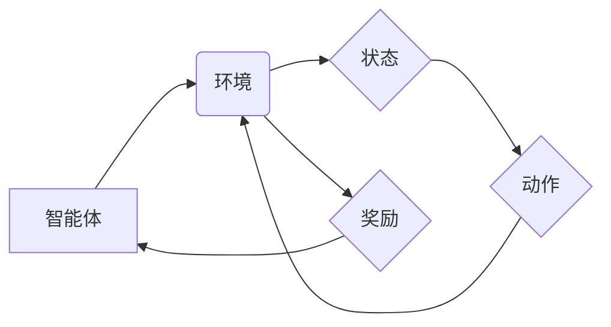

> 强化学习、Reinforcement Learning、Q-learning、Deep Q-Network、算法原理、代码实现、案例分析、应用场景

## 1. 背景介绍

在人工智能领域，强化学习 (Reinforcement Learning, RL) 作为一种重要的机器学习范式，近年来取得了显著进展，并在许多应用场景中展现出强大的潜力。与监督学习和无监督学习不同，强化学习的核心在于让智能体通过与环境的交互学习最优策略，以最大化累积的奖励。

强化学习的应用领域非常广泛，包括游戏、机器人控制、推荐系统、医疗诊断等。例如，AlphaGo 通过强化学习战胜了世界围棋冠军，自动驾驶汽车也依赖于强化学习算法来学习驾驶策略。

## 2. 核心概念与联系

**2.1 核心概念**

* **智能体 (Agent):**  与环境交互并采取行动的实体。
* **环境 (Environment):** 智能体所处的外部世界，环境会根据智能体的行动产生状态变化和奖励信号。
* **状态 (State):** 环境在特定时刻的描述，例如游戏中的棋盘状态或机器人当前的位置。
* **动作 (Action):** 智能体在特定状态下可以采取的行动，例如在游戏中落子或机器人移动。
* **奖励 (Reward):** 环境对智能体采取的行动给予的反馈，奖励可以是正值、负值或零值。
* **策略 (Policy):** 智能体在不同状态下选择动作的规则，策略可以是确定性的或概率性的。
* **价值函数 (Value Function):**  评估智能体在特定状态下采取特定策略的长期奖励的能力。

**2.2  RL 系统架构**



**2.3  RL 的目标**

强化学习的目标是找到一个最优策略，使得智能体在与环境交互的过程中能够最大化累积的奖励。

## 3. 核心算法原理 & 具体操作步骤

### 3.1  算法原理概述

Q-learning 是一种经典的强化学习算法，它通过学习一个 Q-表来评估在每个状态下采取每个动作的价值。Q-表是一个表格，其中每个单元格存储了智能体在特定状态下采取特定动作的期望未来奖励。

### 3.2  算法步骤详解

1. **初始化 Q-表:** 将 Q-表中的所有值初始化为零或一个小随机值。
2. **选择动作:** 根据当前状态和策略选择一个动作。
3. **执行动作:** 在环境中执行选择的动作，并观察环境的状态变化和奖励信号。
4. **更新 Q-表:** 使用 Bellman 方程更新 Q-表中的值，即：

 $$Q(s,a) = Q(s,a) + \alpha [r + \gamma \max_{a'} Q(s',a') - Q(s,a)]$$

其中：

* $Q(s,a)$ 是在状态 $s$ 下采取动作 $a$ 的 Q 值。
* $\alpha$ 是学习率，控制着学习速度。
* $r$ 是从环境获得的奖励。
* $\gamma$ 是折扣因子，控制着未来奖励的权重。
* $s'$ 是执行动作后进入的新状态。
* $a'$ 是在状态 $s'$ 下选择的最优动作。

5. **重复步骤 2-4:** 直到智能体达到预设的终止条件或学习完成。

### 3.3  算法优缺点

**优点:**

* 算法简单易懂，易于实现。
* 可以应用于离散状态和动作空间的问题。

**缺点:**

* 当状态和动作空间很大时，Q-表会变得非常庞大，难以存储和更新。
* 算法的性能依赖于学习率和折扣因子的选择。

### 3.4  算法应用领域

* **游戏:** 训练游戏 AI，例如 AlphaGo。
* **机器人控制:** 训练机器人执行复杂的任务，例如导航和抓取。
* **推荐系统:** 建议用户感兴趣的内容。
* **医疗诊断:** 辅助医生诊断疾病。

## 4. 数学模型和公式 & 详细讲解 & 举例说明

### 4.1  数学模型构建

强化学习的数学模型可以概括为一个马尔可夫决策过程 (MDP)，它由以下四个要素组成：

* **状态空间 S:** 所有可能的系统状态的集合。
* **动作空间 A:** 在每个状态下可执行的动作集合。
* **转移概率 P(s',r|s,a):** 从状态 s 执行动作 a 后，转移到状态 s' 并获得奖励 r 的概率。
* **奖励函数 R(s,a):** 在状态 s 执行动作 a 后获得的奖励。

### 4.2  公式推导过程

**价值函数:**

价值函数用来评估智能体在特定状态下采取特定策略的长期奖励。

* **状态价值函数:**  $V^{\pi}(s) = E_{\pi}[R_t | S_t = s]$，表示在状态 s 下，按照策略 $\pi$ 执行动作的期望累积奖励。
* **动作价值函数:** $Q^{\pi}(s,a) = E_{\pi}[R_t + \gamma V^{\pi}(S_{t+1}) | S_t = s, A_t = a]$，表示在状态 s 下采取动作 a 后，按照策略 $\pi$ 执行动作的期望累积奖励。

**Bellman 方程:**

Bellman 方程描述了价值函数的更新规则。

* **状态价值函数:** $V^{\pi}(s) = \max_a Q^{\pi}(s,a)$
* **动作价值函数:** $Q^{\pi}(s,a) = R(s,a) + \gamma \max_{a'} Q^{\pi}(s',a')$

### 4.3  案例分析与讲解

假设一个智能体在玩一个简单的游戏，游戏中有两种状态： "开始" 和 "结束"，两种动作： "前进" 和 "后退"。

* 状态空间 S = {"开始", "结束"}
* 动作空间 A = {"前进", "后退"}
* 转移概率 P(s',r|s,a) 可以根据游戏规则设定。
* 奖励函数 R(s,a) 可以根据游戏规则设定。

智能体可以通过 Q-learning 算法学习在不同状态下采取最优动作，以最大化累积的奖励。

## 5. 项目实践：代码实例和详细解释说明

### 5.1  开发环境搭建

* Python 3.x
* TensorFlow 或 PyTorch

### 5.2  源代码详细实现

```python
import numpy as np

class QLearningAgent:
    def __init__(self, state_space, action_space, learning_rate=0.1, discount_factor=0.9, epsilon=0.1):
        self.state_space = state_space
        self.action_space = action_space
        self.learning_rate = learning_rate
        self.discount_factor = discount_factor
        self.epsilon = epsilon
        self.q_table = np.zeros((state_space, action_space))

    def choose_action(self, state):
        if np.random.uniform(0, 1) < self.epsilon:
            return np.random.choice(self.action_space)
        else:
            return np.argmax(self.q_table[state, :])

    def update_q_table(self, state, action, reward, next_state):
        self.q_table[state, action] += self.learning_rate * (reward + self.discount_factor * np.max(self.q_table[next_state, :]) - self.q_table[state, action])

# ... (其他代码)
```

### 5.3  代码解读与分析

* `QLearningAgent` 类实现了 Q-learning 算法的核心逻辑。
* `__init__` 方法初始化 Q-表和算法参数。
* `choose_action` 方法根据 epsilon-greedy 策略选择动作。
* `update_q_table` 方法根据 Bellman 方程更新 Q-表。

### 5.4  运行结果展示

运行代码后，智能体会通过与环境交互学习最优策略，并最终达到预设的目标。

## 6. 实际应用场景

### 6.1  游戏 AI

强化学习在游戏 AI 中取得了显著进展，例如 AlphaGo、AlphaStar 等。

### 6.2  机器人控制

强化学习可以训练机器人执行复杂的任务，例如导航、抓取、组装等。

### 6.3  推荐系统

强化学习可以用于个性化推荐，例如推荐用户感兴趣的商品、电影、音乐等。

### 6.4  未来应用展望

强化学习在未来将有更广泛的应用，例如自动驾驶、医疗诊断、金融交易等。

## 7. 工具和资源推荐

### 7.1  学习资源推荐

* **书籍:**
    * Reinforcement Learning: An Introduction by Richard S. Sutton and Andrew G. Barto
    * Deep Reinforcement Learning Hands-On by Maxim Lapan
* **在线课程:**
    * Coursera: Reinforcement Learning Specialization
    * Udacity: Deep Reinforcement Learning Nanodegree

### 7.2  开发工具推荐

* **TensorFlow:** 深度学习框架，支持强化学习算法的实现。
* **PyTorch:** 深度学习框架，支持强化学习算法的实现。
* **OpenAI Gym:** 强化学习环境库，提供各种标准的强化学习任务。

### 7.3  相关论文推荐

* Deep Q-Network (DQN)
* Proximal Policy Optimization (PPO)
* Trust Region Policy Optimization (TRPO)

## 8. 总结：未来发展趋势与挑战

### 8.1  研究成果总结

强化学习取得了显著进展，在许多应用场景中展现出强大的潜力。

### 8.2  未来发展趋势

* **深度强化学习:** 将深度神经网络与强化学习结合，提高算法的学习能力和泛化能力。
* **多智能体强化学习:** 研究多个智能体协同学习的算法。
* **安全强化学习:** 研究如何在不损害安全的情况下训练强化学习算法。

### 8.3  面临的挑战

* **样本效率:** 强化学习算法通常需要大量的样本数据才能训练成功。
* **探索与利用的平衡:** 智能体需要在探索新策略和利用已知策略之间找到平衡。
* **可解释性:** 强化学习算法的决策过程往往难以解释。

### 8.4  研究展望

未来强化学习的研究将继续朝着更智能、更安全、更可解释的方向发展。

## 9. 附录：常见问题与解答

* **Q: 强化学习和监督学习有什么区别？**

A: 强化学习和监督学习都是机器学习范式，但它们的目标和训练方式不同。监督学习的目标是学习一个函数，将输入映射到输出，而强化学习的目标是学习一个策略，使得智能体在与环境交互的过程中能够最大化累积的奖励。

* **Q: Q-learning 算法的学习率和折扣因子应该如何设置？**

A: 学习率和折扣因子是 Q-learning 算法的重要参数，它们会影响算法的收敛速度和最终性能。学习率过高会导致算法不稳定，学习率过低会导致算法收敛速度慢。折扣因子控制着未来奖励的权重，折扣因子越大，智能体越倾向于选择长期奖励高的策略。

* **Q: 强化学习算法的应用场景有哪些？**

A: 强化学习算法的应用场景非常广泛，包括游戏、机器人控制、推荐系统、医疗诊断等。


作者：禅与计算机程序设计艺术 / Zen and the Art of Computer Programming 
<end_of_turn>