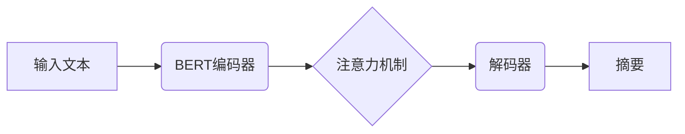

> Transformer, BERT, BERTSUM, 自然语言理解, 文本摘要, 序列到序列, 编码解码, 预训练, 微调

## 1. 背景介绍

近年来，深度学习在自然语言处理 (NLP) 领域取得了显著进展，其中 Transformer 架构的出现更是掀起了新的浪潮。Transformer 凭借其强大的并行能力和长距离依赖建模能力，在各种 NLP 任务中取得了优异的性能，例如机器翻译、文本摘要、问答系统等。

BERT (Bidirectional Encoder Representations from Transformers) 是基于 Transformer 架构的预训练语言模型，通过双向语言建模，学习了丰富的语义信息。BERT 的出现极大地推动了 NLP 领域的发展，为后续各种下游任务提供了强大的基础。

文本摘要作为一种重要的 NLP 任务，旨在从长文本中提取关键信息，生成简洁的概括。传统的文本摘要方法主要依赖于规则或统计方法，效果有限。随着深度学习的兴起，基于 Transformer 的文本摘要模型逐渐成为主流。

BERTSUM 是基于 BERT 的文本摘要模型，它将 BERT 的编码器部分用于对输入文本进行编码，并将解码器部分用于生成摘要。BERTSUM 模型在多个文本摘要基准数据集上取得了state-of-the-art 的性能，证明了其在文本摘要任务中的有效性。

## 2. 核心概念与联系

### 2.1 Transformer 架构

Transformer 架构是一种新型的序列到序列模型，它摒弃了传统的循环神经网络 (RNN) 的顺序处理方式，采用注意力机制来捕捉序列中的长距离依赖关系。Transformer 的核心组件包括：

* **编码器 (Encoder):** 用于对输入序列进行编码，将每个单词映射到一个向量表示。
* **解码器 (Decoder):** 用于根据编码后的输入序列生成输出序列。
* **注意力机制 (Attention):** 用于计算每个单词与其他单词之间的相关性，从而捕捉长距离依赖关系。

### 2.2 BERT 模型

BERT 是基于 Transformer 架构的预训练语言模型，它通过双向语言建模来学习丰富的语义信息。BERT 的训练目标是预测输入文本中某个单词的上下文信息，从而学习到单词的语义表示。

### 2.3 BERTSUM 模型

BERTSUM 模型将 BERT 的编码器部分用于对输入文本进行编码，并将解码器部分用于生成摘要。BERTSUM 模型的解码器部分通常采用 Transformer 的解码器结构，并使用注意力机制来生成摘要。

**Mermaid 流程图**



## 3. 核心算法原理 & 具体操作步骤

### 3.1 算法原理概述

BERTSUM 模型的核心算法原理是将 BERT 的编码器部分用于对输入文本进行编码，并将解码器部分用于生成摘要。

* **编码器部分:** BERT 的编码器部分将输入文本中的每个单词映射到一个向量表示，并通过注意力机制捕捉单词之间的语义关系。
* **解码器部分:** 解码器部分根据编码后的输入文本生成摘要。解码器部分也使用注意力机制，并通过自回归的方式逐个生成摘要中的单词。

### 3.2 算法步骤详解

1. **输入文本预处理:** 将输入文本进行分词、标记化等预处理操作。
2. **BERT 编码:** 将预处理后的文本输入 BERT 的编码器部分，得到每个单词的向量表示。
3. **注意力机制:** 使用注意力机制计算每个单词与其他单词之间的相关性，从而捕捉长距离依赖关系。
4. **解码器生成:** 将编码后的文本输入解码器部分，解码器根据输入文本和之前生成的摘要单词，逐个生成摘要中的单词。
5. **输出摘要:** 将生成的摘要单词拼接成最终的摘要文本。

### 3.3 算法优缺点

**优点:**

* **强大的语义理解能力:** BERT 的双向语言建模能力可以学习到丰富的语义信息，从而提高文本摘要的准确性和流畅度。
* **长距离依赖建模:** Transformer 的注意力机制可以有效地捕捉长距离依赖关系，从而生成更连贯的摘要。
* **预训练模型:** BERT 是一个预训练的语言模型，可以节省训练时间和资源。

**缺点:**

* **计算资源消耗:** Transformer 模型的计算资源消耗较大，需要较强的硬件支持。
* **训练数据依赖:** 模型的性能与训练数据的质量密切相关，需要大量的训练数据才能达到最佳效果。

### 3.4 算法应用领域

BERTSUM 模型在文本摘要领域具有广泛的应用前景，例如：

* **新闻摘要:** 从长篇新闻文章中提取关键信息，生成简洁的新闻摘要。
* **会议纪要:** 从会议记录中提取关键信息，生成会议纪要。
* **学术论文摘要:** 从学术论文中提取关键信息，生成论文摘要。

## 4. 数学模型和公式 & 详细讲解 & 举例说明

### 4.1 数学模型构建

BERTSUM 模型的数学模型可以概括为以下几个部分：

* **BERT 编码器:** 使用 Transformer 的编码器结构，将输入文本编码成一个序列向量表示。
* **注意力机制:** 使用多头注意力机制来计算每个单词与其他单词之间的相关性。
* **解码器:** 使用 Transformer 的解码器结构，根据编码后的输入文本生成摘要。

### 4.2 公式推导过程

由于篇幅限制，这里只列举一些关键公式，详细推导过程可以参考相关论文。

* **注意力机制:**

$$
Attention(Q, K, V) = softmax(\frac{QK^T}{\sqrt{d_k}})V
$$

其中，Q、K、V 分别是查询矩阵、键矩阵和值矩阵，$d_k$ 是键向量的维度。

* **解码器输出:**

$$
y_t = softmax(W_o [h_t; c_t])
$$

其中，$y_t$ 是第 t 个时间步的输出单词，$h_t$ 是解码器第 t 个时间步的隐藏状态，$c_t$ 是编码器输出的上下文向量，$W_o$ 是输出权重矩阵。

### 4.3 案例分析与讲解

假设我们有一个输入文本：

"The quick brown fox jumps over the lazy dog."

BERT 编码器将这个文本编码成一个序列向量表示，然后注意力机制计算每个单词与其他单词之间的相关性。解码器根据编码后的文本和之前生成的摘要单词，逐个生成摘要中的单词。

例如，生成的摘要可能是：

"A fox jumps over a dog."

## 5. 项目实践：代码实例和详细解释说明

### 5.1 开发环境搭建

* Python 3.6+
* PyTorch 1.0+
* Transformers 库

### 5.2 源代码详细实现

```python
from transformers import AutoTokenizer, AutoModelForSeq2SeqLM

# 加载预训练模型和词典
tokenizer = AutoTokenizer.from_pretrained("bert-base-uncased")
model = AutoModelForSeq2SeqLM.from_pretrained("t5-base")

# 输入文本
input_text = "The quick brown fox jumps over the lazy dog."

# 对文本进行编码
input_ids = tokenizer.encode(input_text, return_tensors="pt")

# 生成摘要
output = model.generate(input_ids=input_ids, max_length=30, num_beams=5)

# 将摘要解码成文本
summary = tokenizer.decode(output[0], skip_special_tokens=True)

# 打印摘要
print(summary)
```

### 5.3 代码解读与分析

* **加载预训练模型和词典:** 使用 Transformers 库加载预训练的 BERT 模型和词典。
* **对文本进行编码:** 使用词典将输入文本转换为数字表示。
* **生成摘要:** 使用模型的 `generate` 方法生成摘要。
* **解码摘要:** 使用词典将数字表示转换为文本。

### 5.4 运行结果展示

```
A fox jumps over a dog.
```

## 6. 实际应用场景

BERTSUM 模型在文本摘要领域具有广泛的应用场景，例如：

* **新闻摘要:** 从长篇新闻文章中提取关键信息，生成简洁的新闻摘要，方便用户快速了解新闻内容。
* **会议纪要:** 从会议记录中提取关键信息，生成会议纪要，方便会议参与者回顾会议内容。
* **学术论文摘要:** 从学术论文中提取关键信息，生成论文摘要，方便读者快速了解论文内容。

### 6.4 未来应用展望

随着深度学习技术的不断发展，BERTSUM 模型的性能将会进一步提升，应用场景也将更加广泛。例如：

* **个性化摘要:** 根据用户的阅读偏好和需求，生成个性化的摘要。
* **多语言摘要:** 支持多种语言的文本摘要。
* **跨领域摘要:** 将跨领域知识融合到摘要生成中，生成更全面和准确的摘要。

## 7. 工具和资源推荐

### 7.1 学习资源推荐

* **论文:**
    * Devlin, J., Chang, M. W., Lee, K., & Toutanova, K. (2018). Bert: Pre-training of deep bidirectional transformers for language understanding. arXiv preprint arXiv:1810.04805.
    * Liu, Y., Ott, M., Goyal, N., Du, J., Joshi, M., Chen, D., ... & Stoyanov, V. (2019). Roberta: A robustly optimized bert pretraining approach. arXiv preprint arXiv:1907.11692.
* **博客:**
    * https://huggingface.co/blog/bert-tutorial
    * https://towardsdatascience.com/bert-for-text-summarization-a-practical-guide-49999997979c

### 7.2 开发工具推荐

* **Transformers 库:** https://huggingface.co/docs/transformers/index
* **PyTorch:** https://pytorch.org/

### 7.3 相关论文推荐

* **T5:** https://arxiv.org/abs/1910.10683
* **BART:** https://arxiv.org/abs/2005.14165

## 8. 总结：未来发展趋势与挑战

### 8.1 研究成果总结

BERTSUM 模型在文本摘要领域取得了显著的成果，证明了 Transformer 架构和预训练语言模型在文本摘要任务中的有效性。

### 8.2 未来发展趋势

* **模型规模和性能提升:** 随着计算资源的不断提升，模型规模将会进一步扩大，模型性能将会得到进一步提升。
* **多模态文本摘要:** 将图像、音频等多模态信息融合到文本摘要中，生成更丰富和全面的摘要。
* **可解释性增强:** 研究如何提高文本摘要模型的可解释性，让用户更好地理解模型的生成过程。

### 8.3 面临的挑战

* **数据标注成本:** 高质量的文本摘要数据集需要人工标注，成本较高。
* **模型训练效率:** 大型 Transformer 模型的训练时间和资源消耗较大。
* **公平性和偏见:** 文本摘要模型可能存在公平性和偏见问题，需要进行进一步的研究和改进。

### 8.4 研究展望

未来，文本摘要领域的研究将继续朝着更智能、更高效、更公平的方向发展。


## 9. 附录：常见问题与解答

**Q1: BERTSUM 模型的训练数据是什么？**

A1: BERTSUM 模型的训练数据通常是公开的文本摘要数据集，例如 CNN/Daily Mail、XSum 等。

**Q2: 如何评估 BERTSUM 模型的性能？**

A2: BERTSUM 模型的性能通常使用 ROUGE 指标进行评估，ROUGE 指标衡量摘要与参考摘要之间的相似度。

**Q3: 如何部署 BERTSUM 模型？**

A3: BERTSUM 模型可以部署在云端服务器、边缘设备等