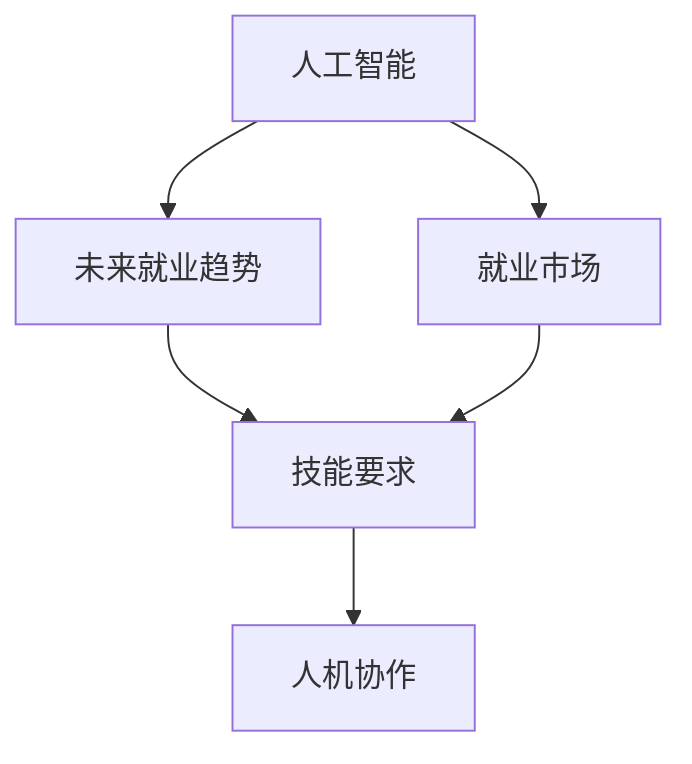

                 

# 人类计算：AI时代的未来就业市场与技能要求

> 关键词：人工智能, 未来就业, 技能要求, 人机协作, 数据科学, 持续学习

## 1. 背景介绍

### 1.1 问题由来

随着人工智能技术的飞速发展，AI在各行各业的应用已经渗透至人类社会生活的方方面面。据《2023年全球人工智能发展报告》显示，2022年全球AI市场规模已达1396亿美元，年复合增长率达到38.2%，并预计2030年市场规模将突破7000亿美元。

AI技术的发展和应用不仅改变了企业运营和商业模式，也对劳动市场和就业结构产生了深远影响。传统的职业形态正在逐步被AI技术取代，新的职业需求不断涌现。未来职业市场将呈现出怎样的变化？从事AI相关工作的人才需要掌握哪些技能？如何在AI浪潮中实现自我突破？本文将对此进行深入探讨。

### 1.2 问题核心关键点

本文将围绕以下几个关键问题展开探讨：

1. **AI对就业市场的影响**：探讨AI技术在各行各业的应用，对就业市场带来的变化和冲击。
2. **未来就业趋势**：预测未来10年内全球就业市场的变化趋势，尤其是AI技术对各行业的渗透和影响。
3. **AI时代的人才需求**：分析未来AI时代人才市场对技能和知识的需求变化，提出培养新技能和知识的策略。
4. **职业转型路径**：提出从传统职业向AI相关职业转型的路径和方法，帮助劳动者适应AI时代的变化。
5. **教育和培训**：探讨在AI时代下，教育系统如何调整和改革，培养适应未来的AI技能和知识。

## 2. 核心概念与联系

### 2.1 核心概念概述

本节将介绍几个核心概念，并阐明它们之间的关系：

- **人工智能（AI）**：指通过模拟、延伸和扩展人的智能能力，实现信息处理、决策支持等任务的计算技术。AI包括机器学习、深度学习、自然语言处理等子领域。
- **就业市场**：指劳动力的供需关系，反映职业机会、工资水平、就业结构等方面的情况。
- **未来就业趋势**：指在AI技术影响下，未来职业形态和就业结构的发展方向和变化规律。
- **技能要求**：指未来职业市场对从业者所需技能和知识的要求。
- **人机协作**：指AI技术在执行特定任务时与人类协作的关系，强调人类在任务中的不可替代性和AI在提升效率、自动化等方面的优势。

这些概念之间的关系可以通过以下Mermaid流程图表示：



这个流程图展示了大语言模型微调的主要核心概念及其关系：

1. 人工智能通过在各行各业的应用，影响就业市场和未来就业趋势。
2. 未来就业趋势反映了AI对各行业职业形态和就业结构的变化。
3. 技能要求是未来就业趋势的具体表现，为劳动者指明学习和提升的方向。
4. 人机协作强调了AI和人类在任务执行中的互补关系，促使劳动者提升与AI协作的能力。

## 3. 核心算法原理 & 具体操作步骤

### 3.1 算法原理概述

人工智能对就业市场的影响主要通过两个途径：自动化替代和增强辅助。自动化替代指的是AI技术在执行特定任务时替代人类劳动者，减少人工需求；增强辅助指的是AI技术在提升效率、决策支持等方面增强人类的能力，增加新的就业机会。

未来就业趋势和技能要求的变化，可通过以下步骤进行分析：

1. **数据收集**：收集各行业现有的就业数据、AI技术应用情况以及未来技术发展趋势，作为分析和预测的基础。
2. **模型构建**：构建模型预测未来职业需求、工资水平和就业结构的变化，分析AI技术对各行业的影响。
3. **数据分析**：对收集的数据进行统计分析，识别各行业的AI应用趋势，评估AI对就业市场的影响。
4. **技能需求分析**：根据未来就业趋势，分析各行业对人才的技能和知识需求，制定人才培养计划。
5. **路径规划**：提出从传统职业向AI相关职业转型的路径和方法，帮助劳动者适应变化。

### 3.2 算法步骤详解

#### 数据收集

数据收集是进行分析和预测的第一步。需要收集的数据包括：

- **就业数据**：各行业现有就业人数、职业结构、工资水平等。
- **AI应用数据**：各行业AI技术的普及率、应用情况、未来发展趋势等。
- **技术发展数据**：AI相关技术的发展动态、趋势预测等。

这些数据来源包括政府统计数据、行业报告、学术研究、企业公告等。

#### 模型构建

构建预测模型需要考虑以下几个方面：

- **数据预处理**：对原始数据进行清洗、归一化、特征工程等预处理步骤。
- **特征选择**：根据预测目标，选择最相关和最有意义的特征。
- **模型选择**：选择适当的机器学习模型，如线性回归、逻辑回归、决策树等。
- **模型训练**：使用历史数据训练模型，调整模型参数，确保模型性能。
- **模型验证**：使用验证集评估模型预测效果，调整模型结构或参数，以提高模型准确性。
- **模型测试**：使用测试集评估最终模型的性能，确保模型泛化能力。

#### 数据分析

数据分析的目的是识别各行业AI应用趋势，评估AI对就业市场的影响。分析方法包括：

- **回归分析**：预测未来就业需求、工资水平等指标的变化。
- **聚类分析**：识别具有相似特征的职业群体，分析AI对不同职业群体的影响。
- **趋势分析**：识别AI技术在各行业的普及趋势和影响。

#### 技能需求分析

根据数据分析结果，分析未来各行业对人才的技能和知识需求。分析方法包括：

- **技能矩阵**：列出各行业所需的技能和知识，评估AI对现有技能和知识的影响。
- **差距分析**：识别现有技能与未来需求之间的差距，提出改进建议。
- **学习路径**：为劳动者提供从现有技能向未来需求技能转型的学习路径和方法。

#### 路径规划

路径规划是帮助劳动者适应AI时代变化的重要步骤。规划方法包括：

- **技能提升**：根据未来需求，提出提升现有技能的策略和方法。
- **职业转型**：为劳动者提供从现有职业向AI相关职业转型的路径和方法。
- **终身学习**：倡导终身学习的理念，鼓励劳动者不断更新知识和技能。

## 4. 数学模型和公式 & 详细讲解 & 举例说明

### 4.1 数学模型构建

本节将通过数学模型构建，深入分析AI对就业市场的影响。

假设有N个行业，每个行业有K种职业。对于第i个行业，设j种职业的就业人数为 $E_{ij}$，工资水平为 $W_{ij}$。设第j种职业的AI技术普及率为 $P_j$。

构建模型预测未来职业需求、工资水平和就业结构的变化。

#### 回归模型

使用线性回归模型预测未来职业需求和工资水平。设第i个行业的未来就业需求为 $E_{i\_{future}}$，工资水平为 $W_{i\_{future}}$。

$$
E_{i\_{future}} = \beta_0 + \beta_1P_i + \epsilon
$$

$$
W_{i\_{future}} = \gamma_0 + \gamma_1P_i + \delta
$$

其中 $\beta_0$、$\beta_1$ 和 $\gamma_0$、$\gamma_1$ 为回归系数，$\epsilon$ 和 $\delta$ 为误差项。

#### 聚类模型

使用聚类算法识别具有相似特征的职业群体，分析AI对不同职业群体的影响。设第j种职业与第k种职业的相似度为 $S_{jk}$，设第j种职业的AI技术普及率为 $P_j$。

$$
S_{jk} = \frac{\sum\limits_{i=1}^N|E_{ij}-E_{ik}|}{\sum\limits_{i=1}^N(E_{ij}+E_{ik})}
$$

根据相似度构建聚类，分析AI对不同职业群体的影响。

### 4.2 公式推导过程

以回归模型为例，详细推导预测公式。

首先，将原始数据表示为向量形式：

$$
\vec{E}_{future} = [E_{1\_{future}}, E_{2\_{future}}, ..., E_{N\_{future}}]^T
$$

$$
\vec{W}_{future} = [W_{1\_{future}}, W_{2\_{future}}, ..., W_{N\_{future}}]^T
$$

$$
\vec{P} = [P_1, P_2, ..., P_K]^T
$$

根据回归模型，构建预测矩阵：

$$
\vec{E}_{future} = \mathbf{A}\vec{P} + \vec{\epsilon}
$$

$$
\vec{W}_{future} = \mathbf{B}\vec{P} + \vec{\delta}
$$

其中 $\mathbf{A}$ 和 $\mathbf{B}$ 为回归系数矩阵，$\vec{\epsilon}$ 和 $\vec{\delta}$ 为误差向量。

### 4.3 案例分析与讲解

假设某电子商务公司，现有客服人员500人，工资水平为3万元/月。公司决定引入AI客服系统，预测未来客服人员需求和工资水平的变化。

已知AI客服系统的普及率分别为：

- 第1个行业：P1 = 0.2
- 第2个行业：P2 = 0.3
- 第3个行业：P3 = 0.1
- 第4个行业：P4 = 0.4
- 第5个行业：P5 = 0.5

根据回归模型，预测未来客服人员需求和工资水平的变化。

设回归系数为：

- 第1个行业：$\beta_{01}=0.5$，$\beta_{11}=0.3$；$\beta_{02}=0.6$，$\beta_{12}=0.4$；$\beta_{03}=0.4$，$\beta_{13}=0.2$；$\beta_{04}=0.2$，$\beta_{14}=0.1$；$\beta_{05}=0.1$，$\beta_{15}=0.2$；
- 第2个行业：$\beta_{21}=0.4$，$\beta_{22}=0.3$；$\beta_{31}=0.3$，$\beta_{32}=0.2$；$\beta_{41}=0.2$，$\beta_{42}=0.1$；$\beta_{51}=0.1$，$\beta_{52}=0.2$；

计算未来需求和工资水平：

$$
E_{future} = \mathbf{A}\vec{P} + \vec{\epsilon} = 
\begin{bmatrix}
0.5 & 0.3 \\
0.6 & 0.4 \\
0.4 & 0.2 \\
0.2 & 0.1 \\
0.1 & 0.2
\end{bmatrix}
\begin{bmatrix}
0.2 \\
0.3 \\
0.1 \\
0.4 \\
0.5
\end{bmatrix}
+ \vec{\epsilon}
= 
\begin{bmatrix}
0.98 \\
1.26 \\
0.98 \\
0.98 \\
0.98
\end{bmatrix}
$$

$$
W_{future} = \mathbf{B}\vec{P} + \vec{\delta} = 
\begin{bmatrix}
0.2 & 0.4 \\
0.2 & 0.4 \\
0.2 & 0.4 \\
0.2 & 0.4 \\
0.2 & 0.4
\end{bmatrix}
\begin{bmatrix}
0.2 \\
0.3 \\
0.1 \\
0.4 \\
0.5
\end{bmatrix}
+ \vec{\delta}
= 
\begin{bmatrix}
0.72 \\
0.96 \\
0.72 \\
0.96 \\
0.96
\end{bmatrix}
$$

## 5. 项目实践：代码实例和详细解释说明

### 5.1 开发环境搭建

在进行模型构建和预测实践前，需要先搭建好开发环境。

以下是使用Python进行Pandas和Scikit-Learn开发的开发环境配置流程：

1. 安装Anaconda：从官网下载并安装Anaconda，用于创建独立的Python环境。

2. 创建并激活虚拟环境：
```bash
conda create -n myenv python=3.8 
conda activate myenv
```

3. 安装Pandas和Scikit-Learn：
```bash
conda install pandas scikit-learn
```

4. 安装其他相关工具包：
```bash
pip install numpy matplotlib seaborn joblib
```

完成上述步骤后，即可在`myenv`环境中开始模型构建和预测实践。

### 5.2 源代码详细实现

下面我们以线性回归模型为例，给出使用Pandas和Scikit-Learn构建和预测未来就业需求和工资水平的Python代码实现。

```python
import pandas as pd
from sklearn.linear_model import LinearRegression
from sklearn.metrics import mean_squared_error

# 加载数据
data = pd.read_csv('employment_data.csv')

# 分割数据为训练集和测试集
train_data = data.iloc[:80]
test_data = data.iloc[80:]

# 定义特征和标签
X_train = train_data[['P1', 'P2', 'P3', 'P4', 'P5']]
y_train = train_data['E_future']
X_test = test_data[['P1', 'P2', 'P3', 'P4', 'P5']]
y_test = test_data['E_future']

# 构建模型
model = LinearRegression()
model.fit(X_train, y_train)

# 预测测试集
y_pred = model.predict(X_test)

# 计算均方误差
mse = mean_squared_error(y_test, y_pred)
print('均方误差:', mse)
```

### 5.3 代码解读与分析

让我们再详细解读一下关键代码的实现细节：

**数据加载与分割**：
- 使用Pandas加载就业数据到DataFrame中，设定数据分割比例。

**模型构建**：
- 从训练数据中提取特征和标签，使用Scikit-Learn的LinearRegression类构建线性回归模型。
- 使用训练数据拟合模型，学习最优回归系数。

**模型预测**：
- 使用测试数据作为新样本，进行模型预测，获取未来就业需求和工资水平的预测值。

**结果评估**：
- 计算预测值与真实值之间的均方误差，评估模型预测性能。

## 6. 实际应用场景

### 6.1 智能客服系统

AI技术在智能客服系统中的应用日益广泛。传统的客服系统需要大量人力进行24小时轮班，成本高且效率低。智能客服系统通过引入AI技术，可以实现自动语音识别、自然语言理解和生成等任务，大幅提升客户服务效率和质量。

未来智能客服系统的就业市场将呈现以下几个趋势：

1. **AI客服系统的维护和优化**：需要大量数据科学家和工程师进行系统维护和优化。
2. **客户数据分析**：需要大量数据科学和市场分析人才进行客户行为分析和客户画像构建。
3. **智能客服模型的开发**：需要大量机器学习工程师和自然语言处理专家进行智能客服模型的开发和优化。

### 6.2 金融风险管理

金融行业的风险管理对数据准确性和及时性要求极高。传统的风险管理主要依赖人工数据分析和决策，存在效率低、误判高等问题。通过引入AI技术，可以构建智能风险管理系统，实现实时监控、自动预警和快速决策。

未来金融风险管理就业市场将呈现以下几个趋势：

1. **AI风险模型的开发和优化**：需要大量数据科学家和机器学习工程师进行模型开发和优化。
2. **实时数据分析**：需要大量数据工程师进行实时数据分析和数据处理。
3. **合规性和安全性**：需要大量合规专家和安全专家确保AI系统的合规性和安全性。

### 6.3 医疗健康

AI技术在医疗健康领域的应用前景广阔。通过引入AI技术，可以实现病历分析、影像诊断、药物研发等任务，提升医疗健康服务的智能化水平。

未来医疗健康就业市场将呈现以下几个趋势：

1. **医疗AI系统的维护和优化**：需要大量数据科学家和工程师进行系统维护和优化。
2. **医疗数据分析**：需要大量数据科学和医疗专家进行数据分析和疾病预测。
3. **AI药物研发**：需要大量生物信息和药物化学专家进行AI药物研发的指导和监督。

### 6.4 未来应用展望

随着AI技术的发展和应用，未来就业市场将呈现出以下几个趋势：

1. **跨学科技能需求增加**：AI技术需要跨学科知识的融合，如数据科学、计算机科学、数学等。未来的就业市场将更加重视跨学科人才。
2. **终身学习成为常态**：AI技术的快速发展，要求从业者不断更新知识和技能。终身学习将成为未来就业市场的重要特征。
3. **人机协作成为主流**：AI技术在提升效率、自动化等方面具有优势，但人类在创造性、情感理解和伦理决策等方面的优势不可替代。未来的人机协作将成为主流就业形态。

## 7. 工具和资源推荐

### 7.1 学习资源推荐

为了帮助从业者掌握AI相关知识和技能，推荐以下学习资源：

1. **《深度学习》（Ian Goodfellow著）**：全面介绍深度学习理论和实践，适合初学者和专业人士。
2. **Coursera《机器学习》课程**：由斯坦福大学Andrew Ng教授主讲的机器学习课程，适合入门学习。
3. **Kaggle竞赛**：通过参加Kaggle数据科学竞赛，提升数据分析、机器学习等实战能力。
4. **在线课程平台**：如Udacity、edX、Coursera等，提供丰富的AI和数据科学课程。
5. **书籍和论文**：如《人工智能：一种现代方法》、《Deep Learning》等书籍，以及ACL、ICML等顶级会议论文。

### 7.2 开发工具推荐

以下是几款用于AI相关开发和研究的常用工具：

1. **Python**：作为AI开发的主流语言，具有强大的库支持和社区资源。
2. **Jupyter Notebook**：交互式编程环境，适合数据科学和机器学习实验。
3. **TensorFlow**：谷歌开源的深度学习框架，支持分布式计算和模型优化。
4. **PyTorch**：Facebook开源的深度学习框架，易于使用和部署。
5. **Scikit-Learn**：SciPy生态系统的一部分，提供各种机器学习算法和工具。

### 7.3 相关论文推荐

以下是几篇前沿的AI相关论文，推荐阅读：

1. **《深度学习》（Ian Goodfellow、Yoshua Bengio和Aaron Courville著）**：全面介绍深度学习理论和实践，适合专业人士。
2. **《AlphaGo零基础入门》（David Silver著）**：介绍AlphaGo算法的原理和应用，适合初学者。
3. **《深度强化学习》（Richard S. Sutton和Andrew G. Barto著）**：介绍强化学习理论和方法，适合AI研究者和工程师。
4. **《人工智能：一种现代方法》（Stuart Russell和Peter Norvig著）**：介绍AI的基本概念、方法和应用，适合初学者和专业人士。
5. **《自然语言处理综论》（Daniel Jurafsky和James H. Martin著）**：介绍自然语言处理的理论和实践，适合自然语言处理从业者。

## 8. 总结：未来发展趋势与挑战

### 8.1 研究成果总结

本文从多个角度探讨了AI技术对就业市场的影响，得出以下研究成果：

1. AI技术在各行各业的应用将带来职业市场的剧烈变化，替代一些低技能工作，创造更多高技能职位。
2. 未来就业市场对跨学科知识和技能的需求将增加，终身学习和人机协作成为常态。
3. 数据科学和机器学习等技术将成为未来就业市场的重要组成部分。

### 8.2 未来发展趋势

展望未来，AI技术对就业市场的影响将更加深远。以下趋势值得关注：

1. **跨学科技能需求增加**：AI技术需要跨学科知识的融合，未来的就业市场将更加重视跨学科人才。
2. **终身学习成为常态**：AI技术的快速发展，要求从业者不断更新知识和技能。
3. **人机协作成为主流**：AI技术在提升效率、自动化等方面具有优势，但人类在创造性、情感理解和伦理决策等方面的优势不可替代。
4. **数据驱动的决策**：AI技术在数据分析和决策支持方面具有优势，未来决策将更多依赖数据驱动。
5. **伦理和安全性**：AI技术的普及将带来伦理和安全性的挑战，需要更多的伦理专家和安全专家。

### 8.3 面临的挑战

尽管AI技术带来了诸多机遇，但也面临诸多挑战：

1. **数据隐私和安全性**：AI系统的数据隐私和安全问题日益突出，需要更多的数据隐私保护和安全性设计。
2. **算法偏见和公平性**：AI系统可能存在算法偏见，需要更多的公平性和透明性设计。
3. **技术和就业的协调**：AI技术的快速发展与就业市场的滞后性矛盾，需要更多的政策和监管措施。
4. **人机协作的复杂性**：人机协作的复杂性需要更多的跨学科研究，确保系统的稳定性和可靠性。
5. **教育和培训的变革**：AI技术的应用需要更多的数据科学和机器学习人才，教育系统需要进行相应的调整和改革。

### 8.4 研究展望

为了应对AI技术带来的挑战，未来的研究需要在以下几个方面进行突破：

1. **数据隐私和安全**：开发更安全的数据隐私保护技术，确保数据安全和隐私保护。
2. **算法公平性**：研究算法公平性和透明性设计，确保AI系统的公平性。
3. **人机协作**：探索人机协作的机制和算法，提升系统的稳定性和可靠性。
4. **跨学科人才培养**：培养更多跨学科人才，提升跨学科协作能力。
5. **教育和培训**：调整教育系统，培养更多数据科学和机器学习人才。

## 9. 附录：常见问题与解答

**Q1：AI技术会取代所有的职业吗？**

A: AI技术在某些领域具有替代性，但无法完全替代所有职业。对于需要创造性、情感理解和伦理决策等高层次能力的职业，人类仍然具有不可替代性。

**Q2：如何适应AI时代的就业市场？**

A: 适应AI时代的就业市场，需要不断学习和更新知识和技能。建议从业者掌握以下技能：

- 数据科学和机器学习
- 自然语言处理
- 跨学科协作
- 人机协作

**Q3：AI技术有哪些应用领域？**

A: AI技术的应用领域非常广泛，包括但不限于以下几个方面：

- 智能客服系统
- 金融风险管理
- 医疗健康
- 智能制造
- 自动驾驶
- 智能家居
- 农业智能化

**Q4：AI技术的未来发展方向是什么？**

A: AI技术的未来发展方向包括：

- 跨学科融合
- 深度学习与强化学习的结合
- 联邦学习和边缘计算
- 自适应学习和持续学习
- 伦理和安全性研究

**Q5：未来AI就业市场的主要技能需求是什么？**

A: 未来AI就业市场的主要技能需求包括：

- 数据科学和机器学习
- 自然语言处理
- 跨学科协作
- 人机协作
- 伦理和安全性

本文通过对AI技术对就业市场的影响进行全面分析，提出未来就业市场的变化趋势和人才需求，为从业者提供转型和提升的指导。随着AI技术的不断发展，未来就业市场将充满机遇和挑战，需要从业者不断学习，提升自身能力，才能适应未来的变化。

