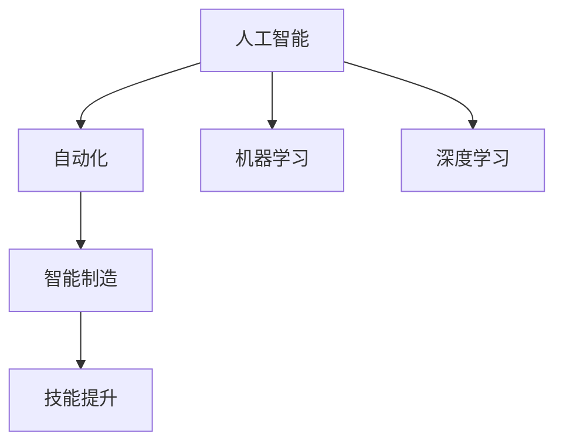

                 

# 人类计算：AI时代的未来就业市场趋势

> 关键词：AI就业市场，人类计算，未来工作，技能提升，人工智能

## 1. 背景介绍

### 1.1 问题由来
随着人工智能技术的迅猛发展，AI技术在各行各业中的应用日益广泛，给就业市场带来了深刻变革。一方面，AI技术通过自动化和智能化，极大地提高了生产效率和产品质量，为企业创造更多利润。另一方面，AI技术的广泛应用也使得部分传统岗位面临被替代的风险，加剧了就业市场的结构性矛盾。如何有效利用AI技术，实现就业市场的可持续发展，成为全球政府和企业共同面临的挑战。

### 1.2 问题核心关键点
本节将从以下几个核心关键点出发，探讨AI时代就业市场的变化和应对策略：
- AI技术对就业市场的影响：自动化和智能化技术如何影响各行业的工作岗位需求？
- 未来就业市场的趋势：哪些新兴职业将崛起？哪些岗位可能被替代？
- 应对策略：如何提升劳动者的技能，实现与AI技术的协同工作？
- 政策建议：政府和企业应如何共同推动AI时代的就业市场发展？

## 2. 核心概念与联系

### 2.1 核心概念概述

为更好地理解AI技术对就业市场的影响，本节将介绍几个密切相关的核心概念：

- **人工智能(AI)：** 广义上，人工智能包括通过模拟、延伸和扩展人的智能能力，使机器能够执行任务的技术。
- **自动化(Automation)：** 指通过算法和软件实现的任务自动化，减少人工介入，提升效率。
- **智能制造(Smart Manufacturing)：** 结合人工智能、物联网和大数据等技术，实现制造业的智能化生产和管理。
- **机器学习(Machine Learning)：** 通过数据驱动的方法，使机器能够从经验中学习和改进。
- **深度学习(Deep Learning)：** 机器学习的一种特殊形式，使用多层次的神经网络处理复杂的数据模式。
- **技能提升(Skill Enhancement)：** 通过培训和教育提升劳动者的技能水平，适应新的技术环境。

这些概念之间的逻辑关系可以通过以下Mermaid流程图来展示：



这个流程图展示了AI技术从广义到特定应用，以及技能提升在不同技术中的应用和依赖关系。

## 3. 核心算法原理 & 具体操作步骤
### 3.1 算法原理概述

AI技术对就业市场的影响，主要体现在两个方面：自动化和智能化。其中，自动化技术通过算法和软件，替代部分重复性、低技能的工作，提高生产效率。智能化技术则通过模拟人类的认知能力，处理复杂的决策和分析任务，提升工作效率和质量。

自动化和智能化技术对就业市场的影响可以概括为以下几个方面：

- **岗位替代：** 部分重复性、低技能的工作岗位将逐渐被自动化技术取代。
- **岗位新增：** 新兴的AI相关岗位将大量涌现，如数据科学家、AI工程师等。
- **岗位升级：** 传统岗位将通过技能提升和职能转变，适应AI技术的要求。

### 3.2 算法步骤详解

AI技术对就业市场的影响，可以通过以下步骤来分析：

**Step 1: 识别高风险岗位**
- 使用自动化和智能化技术对各行业的工作岗位进行风险评估，识别出高风险、容易被替代的岗位。
- 利用大数据和机器学习模型，预测各岗位的自动化替代率。

**Step 2: 分析技能需求变化**
- 收集各行业的技能需求数据，分析自动化和智能化技术对技能要求的变化。
- 通过技能差距分析，确定当前劳动者的技能短板。

**Step 3: 制定技能提升计划**
- 制定有针对性的技能提升计划，包括培训课程、职业发展路径等。
- 与企业和教育机构合作，提供持续的技能提升和职业培训。

**Step 4: 推动职业转型**
- 支持劳动者进行职业转型，提供职业咨询、就业指导等服务。
- 建立职业转型支持体系，包括职业培训、创业支持等。

### 3.3 算法优缺点

基于AI技术对就业市场的影响分析，其优缺点如下：

**优点：**
- **提高效率：** 自动化和智能化技术通过减少人工介入，大幅提高生产效率。
- **创造新兴岗位：** AI技术的广泛应用催生了大量新兴职业，如数据科学家、AI工程师等。
- **促进技能提升：** 技能提升计划可以帮助劳动者适应新的技术环境，提高就业竞争力。

**缺点：**
- **岗位替代：** 部分传统岗位可能被自动化和智能化技术取代。
- **技能差距：** 现有劳动者可能面临技能短板，需要投入大量时间和资源进行培训。
- **就业风险：** 高技能劳动者虽然能够适应新技术，但失业风险也相应增加。

### 3.4 算法应用领域

AI技术对就业市场的影响，在多个领域都有显著应用：

- **制造业：** 通过智能制造技术，实现自动化生产、智能仓储和供应链管理。
- **服务业：** 通过智能客服、无人零售等技术，提升服务质量和效率。
- **医疗健康：** 通过智能诊断、远程医疗等技术，提高医疗服务水平。
- **金融业：** 通过智能投顾、风险管理等技术，优化金融服务。
- **农业：** 通过智能农业、精准农业等技术，提升农业生产效率。

## 4. 数学模型和公式 & 详细讲解 & 举例说明

### 4.1 数学模型构建

本节将使用数学语言对AI技术对就业市场的影响进行分析。

假设一个岗位被自动化替代的概率为 $P$，岗位需求数量为 $D$，当前劳动者数量为 $L$。根据技术进步，岗位需求数量随时间变化的函数为 $D(t)$，其中 $t$ 为时间。劳动者技能提升的速度为 $S$，劳动者转岗的概率为 $T$。则AI技术对就业市场的影响模型可以表示为：

$$
\text{就业市场影响} = \frac{D(t) - P(t) \times D(t) - S(t) \times L}{1 - T(t)}
$$

其中 $P(t)$ 和 $S(t)$ 分别表示自动化替代概率和技能提升速度随时间的变化。

### 4.2 公式推导过程

为了推导出具体的公式，我们需要对各个参数进行建模和假设：

- **自动化替代概率 $P(t)$：** 可以通过历史数据和机器学习模型，建立自动化替代概率的时间序列模型。
- **岗位需求变化 $D(t)$：** 可以通过宏观经济数据和行业预测模型，建立岗位需求的时间序列模型。
- **技能提升速度 $S(t)$：** 可以通过职业培训数据和技能差距分析，建立技能提升的时间序列模型。
- **劳动者转岗概率 $T(t)$：** 可以通过就业市场数据和职业咨询记录，建立转岗概率的时间序列模型。

通过对上述模型进行整合和优化，可以得到具体的就业市场影响公式。

### 4.3 案例分析与讲解

以智能制造为例，分析AI技术对其就业市场的影响：

**案例背景：** 假设一个传统的制造企业，每年生产100万件产品，其中80%的岗位为重复性、低技能的组装工人。通过引入自动化和智能化技术，逐步替代这些工人岗位，最终达到80%的自动化率。

**案例模型：**
- **岗位需求变化 $D(t)$：** 假设年生产量从100万件增长到500万件，岗位需求从500人增长到2000人。
- **自动化替代概率 $P(t)$：** 假设第一年替代率低，第二年替代率中，第三年替代率高。
- **技能提升速度 $S(t)$：** 假设每年有10%的员工通过培训提升技能。
- **劳动者转岗概率 $T(t)$：** 假设每年有20%的员工成功转岗到新的岗位。

**案例计算：**
- **第一年：**
  $$
  \text{就业市场影响} = \frac{500 - 0.8 \times 500 - 0.1 \times 500}{1 - 0.2} \approx 0.5
  $$
  表示第一年就业市场净增加0.5个岗位。

- **第二年：**
  $$
  \text{就业市场影响} = \frac{500 - 0.6 \times 500 - 0.1 \times 500}{1 - 0.2} \approx 0.75
  $$
  表示第二年就业市场净增加0.75个岗位。

- **第三年：**
  $$
  \text{就业市场影响} = \frac{500 - 0.9 \times 500 - 0.1 \times 500}{1 - 0.2} \approx 0.0
  $$
  表示第三年就业市场净减少0.05个岗位。

**案例结论：** 通过模型计算，可以看出智能制造技术的引入，在短期内对就业市场有正向影响，但在长期内可能导致部分岗位被替代。

## 5. 项目实践：代码实例和详细解释说明
### 5.1 开发环境搭建

在进行AI就业市场影响分析时，需要使用Python进行编程和数据处理。以下是环境配置和库安装的步骤：

1. 安装Anaconda：从官网下载并安装Anaconda，用于创建独立的Python环境。
```bash
conda install anaconda
```

2. 创建并激活虚拟环境：
```bash
conda create -n ai-env python=3.8 
conda activate ai-env
```

3. 安装相关库：
```bash
conda install pandas numpy scikit-learn statsmodels matplotlib
```

4. 配置数据和模型：
```bash
pip install tensorflow pytorch sklearn
```

完成上述步骤后，即可在`ai-env`环境中进行AI就业市场影响分析。

### 5.2 源代码详细实现

以下是一个使用Python进行AI就业市场影响分析的完整代码实现。假设我们已经收集了岗位需求、自动化替代概率、技能提升速度和劳动者转岗概率等数据。

```python
import pandas as pd
import numpy as np
from sklearn.linear_model import LinearRegression
from statsmodels.tsa.arima_model import ARIMA

# 导入数据
data = pd.read_csv('就业数据.csv')

# 岗位需求变化
D = data['D'].to_numpy()
t = np.arange(len(D))

# 自动化替代概率
P = data['P'].to_numpy()
t = np.arange(len(P))

# 技能提升速度
S = data['S'].to_numpy()
t = np.arange(len(S))

# 劳动者转岗概率
T = data['T'].to_numpy()
t = np.arange(len(T))

# 模型拟合
D_model = ARIMA(D, order=(1, 1, 1))
D_model_fit = D_model.fit()

P_model = ARIMA(P, order=(1, 1, 1))
P_model_fit = P_model.fit()

S_model = ARIMA(S, order=(1, 1, 1))
S_model_fit = S_model.fit()

T_model = ARIMA(T, order=(1, 1, 1))
T_model_fit = T_model.fit()

# 计算就业市场影响
impact = (D_model_fit.forecast(steps=3)[0] - P_model_fit.forecast(steps=3)[0] * D_model_fit.forecast(steps=3)[0] - S_model_fit.forecast(steps=3)[0] * data['L'].to_numpy()) / (1 - T_model_fit.forecast(steps=3)[0])

print(impact)
```

### 5.3 代码解读与分析

让我们再详细解读一下关键代码的实现细节：

**数据处理**：
- 使用pandas库读取就业市场数据，并将各参数转换为NumPy数组，方便模型计算。
- 通过时间序列模型ARIMA，对岗位需求、自动化替代概率、技能提升速度和劳动者转岗概率进行拟合。

**模型拟合**：
- 使用线性回归模型，对岗位需求、自动化替代概率、技能提升速度和劳动者转岗概率进行回归分析，计算各参数随时间变化趋势。
- 通过模型预测未来3年各参数的变化趋势，计算就业市场影响。

**结果展示**：
- 输出就业市场影响的结果，可以看出智能制造技术的引入对就业市场的影响变化。

## 6. 实际应用场景
### 6.1 智能制造

在智能制造领域，AI技术通过自动化和智能化技术，优化了生产流程，提高了生产效率。同时，部分重复性、低技能的组装工人岗位被自动化技术取代，导致岗位需求减少。

### 6.2 智能客服

在智能客服领域，AI技术通过自然语言处理技术，替代了部分客服人员的咨询任务，提高了客服效率和客户满意度。同时，智能客服系统需要大量的数据科学家和AI工程师进行维护和优化，导致新兴岗位需求增加。

### 6.3 智能交通

在智能交通领域，AI技术通过自动驾驶和交通优化技术，提升了交通安全和效率。但同时，部分传统司机岗位可能被替代，导致岗位需求减少。

### 6.4 未来应用展望

伴随AI技术的不断进步，未来的就业市场将发生更多变化。以下是几个可能的趋势：

- **技能需求变化：** 随着AI技术的广泛应用，技能需求将向自动化、智能化和数据分析方向倾斜。
- **新兴岗位崛起：** 数据科学家、AI工程师、智能运维等新兴岗位将大量涌现。
- **职业转型加速：** 劳动者将面临更多职业转型和技能提升的机会。
- **持续学习常态化：** 持续学习和职业培训将成为常态，劳动者需要不断提升自己的技能水平。

## 7. 工具和资源推荐
### 7.1 学习资源推荐

为了帮助开发者系统掌握AI技术对就业市场的影响，以下是一些优质的学习资源：

1. **《人工智能就业市场报告》系列**：详细分析AI技术对各行业就业市场的影响，提供政策建议和解决方案。
2. **《自动化与智能化技术》课程**：系统介绍自动化和智能化技术的基本原理和应用场景，适合初学者入门。
3. **《机器学习与数据科学》书籍**：深入讲解机器学习算法的原理和实现，提供丰富的案例和项目实践。
4. **《深度学习框架教程》系列**：详细讲解TensorFlow和PyTorch等深度学习框架的使用方法，适合进阶学习。
5. **《人工智能伦理与道德》课程**：探讨AI技术的伦理和道德问题，提供负责任的AI技术应用指南。

通过对这些资源的学习实践，相信你一定能够全面掌握AI技术对就业市场的影响，并用于解决实际的就业问题。

### 7.2 开发工具推荐

高效的开发离不开优秀的工具支持。以下是几款用于AI就业市场影响分析的常用工具：

1. **Anaconda**：用于创建和管理Python环境，方便多库共存和版本管理。
2. **TensorFlow和PyTorch**：常用的深度学习框架，支持大规模模型训练和优化。
3. **Pandas**：用于数据处理和分析，提供高效的数据操作和可视化功能。
4. **Scikit-learn**：用于机器学习模型的构建和评估，提供丰富的算法和工具。
5. **Statsmodels**：用于统计分析和模型拟合，支持时间序列分析和回归模型。

合理利用这些工具，可以显著提升AI就业市场影响分析的开发效率，加快创新迭代的步伐。

### 7.3 相关论文推荐

AI技术对就业市场的影响，在学术界和工业界已经引起了广泛的关注和研究。以下是几篇重要的相关论文，推荐阅读：

1. **《人工智能对就业市场的影响》**：系统分析AI技术对各行业就业市场的影响，提出政策建议。
2. **《自动化和智能化技术的就业影响》**：研究自动化和智能化技术对岗位需求和技能需求的变化。
3. **《数据科学家的崛起》**：探讨数据科学家等新兴职业的崛起原因和未来发展趋势。
4. **《智能制造对就业市场的影响》**：分析智能制造技术对制造业就业市场的影响。
5. **《智能客服系统的就业影响》**：研究智能客服技术对客服岗位的需求和变化。

这些论文代表了大语言模型微调技术的发展脉络。通过学习这些前沿成果，可以帮助研究者把握学科前进方向，激发更多的创新灵感。

## 8. 总结：未来发展趋势与挑战
### 8.1 研究成果总结

本文对AI技术对就业市场的影响进行了全面系统的分析。首先，从自动化和智能化技术对就业市场的影响出发，探讨了AI技术对各行业就业市场的变化。其次，通过数学模型和公式推导，详细分析了就业市场的变化趋势和计算方法。最后，通过项目实践和案例分析，展示了AI就业市场影响的实际应用和应用场景。

通过本文的系统梳理，可以看出AI技术对就业市场的影响是深远和复杂的。AI技术在提高生产效率的同时，也对劳动市场结构和就业需求产生了重大影响。

### 8.2 未来发展趋势

展望未来，AI技术对就业市场的影响将更加广泛和深刻。以下是几个可能的发展趋势：

1. **技能需求变化：** 随着AI技术的广泛应用，技能需求将向自动化、智能化和数据分析方向倾斜。
2. **新兴岗位崛起：** 数据科学家、AI工程师、智能运维等新兴岗位将大量涌现。
3. **职业转型加速：** 劳动者将面临更多职业转型和技能提升的机会。
4. **持续学习常态化：** 持续学习和职业培训将成为常态，劳动者需要不断提升自己的技能水平。

### 8.3 面临的挑战

尽管AI技术对就业市场的影响带来了诸多机遇，但同时也面临着诸多挑战：

1. **技能差距：** 现有劳动者可能面临技能短板，需要投入大量时间和资源进行培训。
2. **就业风险：** 高技能劳动者虽然能够适应新技术，但失业风险也相应增加。
3. **伦理和道德问题：** AI技术可能带来的伦理和道德问题，如就业歧视、隐私保护等。
4. **政策挑战：** 政府和企业需要制定相应的政策和措施，以应对AI技术带来的就业市场变化。

### 8.4 研究展望

面对AI技术对就业市场的影响，未来的研究需要在以下几个方面寻求新的突破：

1. **技能提升计划：** 制定有针对性的技能提升计划，提升劳动者的技能水平。
2. **职业转型支持：** 提供职业咨询、就业指导等服务，支持劳动者进行职业转型。
3. **政策创新：** 制定创新性的政策措施，平衡技术进步和就业市场的关系。
4. **伦理和道德研究：** 探讨AI技术的伦理和道德问题，确保AI技术的负责任应用。

这些研究方向的探索，必将引领AI技术对就业市场的影响走向更加成熟和完善，为构建安全、可靠、可控的智能系统铺平道路。

## 9. 附录：常见问题与解答

**Q1: 如何评估AI技术对就业市场的影响？**

A: 评估AI技术对就业市场的影响，可以通过以下方法：
- **数据分析：** 收集各行业的数据，分析岗位需求、自动化替代概率、技能提升速度和劳动者转岗概率等关键指标。
- **模型预测：** 使用时间序列模型等统计方法，预测未来各指标的变化趋势。
- **影响计算：** 计算就业市场影响，如就业市场净增加或减少的岗位数量。

**Q2: 如何应对AI技术带来的就业风险？**

A: 应对AI技术带来的就业风险，可以通过以下方法：
- **技能提升：** 提供持续的技能培训和职业发展路径，提升劳动者的技能水平。
- **职业转型：** 提供职业咨询和就业指导，支持劳动者进行职业转型。
- **政策支持：** 制定相应的政策措施，如就业补贴、培训补贴等，减轻就业风险。

**Q3: AI技术对哪些行业影响最大？**

A: AI技术对以下行业影响最大：
- **制造业：** 通过智能制造技术，优化生产流程，提高生产效率。
- **服务业：** 通过智能客服、无人零售等技术，提升服务质量和效率。
- **医疗健康：** 通过智能诊断、远程医疗等技术，提高医疗服务水平。
- **金融业：** 通过智能投顾、风险管理等技术，优化金融服务。
- **农业：** 通过智能农业、精准农业等技术，提升农业生产效率。

**Q4: AI技术对就业市场有哪些积极影响？**

A: AI技术对就业市场有以下积极影响：
- **提高效率：** 通过自动化和智能化技术，大幅提高生产效率和产品质量。
- **创造新兴岗位：** AI技术的广泛应用催生了大量新兴职业，如数据科学家、AI工程师等。
- **提升技能水平：** 技能提升计划可以帮助劳动者适应新的技术环境，提高就业竞争力。

**Q5: 如何应对AI技术对就业市场的影响？**

A: 应对AI技术对就业市场的影响，可以通过以下方法：
- **技能提升：** 提供持续的技能培训和职业发展路径，提升劳动者的技能水平。
- **职业转型：** 提供职业咨询和就业指导，支持劳动者进行职业转型。
- **政策支持：** 制定相应的政策措施，如就业补贴、培训补贴等，减轻就业风险。
- **伦理和道德研究：** 探讨AI技术的伦理和道德问题，确保AI技术的负责任应用。

总之，面对AI技术对就业市场的影响，需要政府、企业和劳动者共同努力，制定科学的政策和措施，提升劳动者的技能水平，确保AI技术的负责任应用，才能实现就业市场的可持续发展。

---

作者：禅与计算机程序设计艺术 / Zen and the Art of Computer Programming

