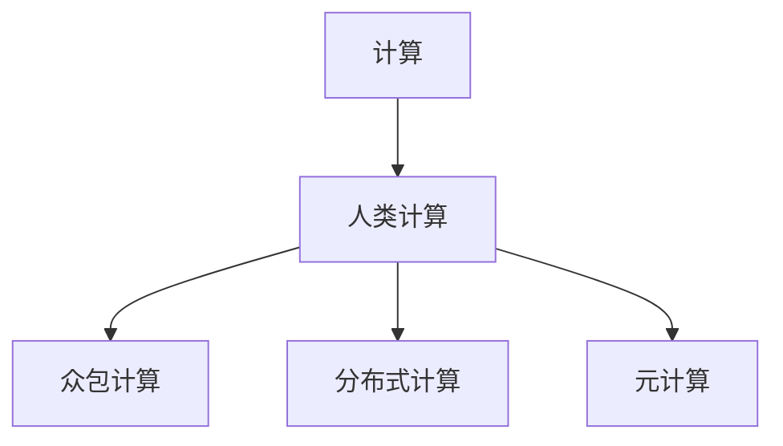

                 

# 人类计算：一个不断发展的领域

## 1. 背景介绍

### 1.1 问题由来

在过去的几十年里，计算技术迅猛发展，从早期的大型机、小型机到后来的个人计算机、智能手机，计算设备已经渗透到我们生活的方方面面。然而，即便在计算资源如此丰富的今天，仍有许多问题无法通过现有技术直接解决。这些问题不仅涉及数学和物理等基础科学领域，也触及人类社会和生物医学等复杂的交叉学科。

人类计算（Human Computation）就是在这种情况下诞生的新概念。它指的是利用人类智慧和协作能力来解决计算密集型、复杂度高的计算问题。相较于传统计算，人类计算强调人的主观能动性和社会化协作，这种新的计算范式在诸多领域展现出巨大的潜力。

### 1.2 问题核心关键点

人类计算的核心在于将复杂的计算问题转化为易于管理的形式，利用人类智力和协作能力来解决。其关键点包括：

- 问题分解与任务分配：将复杂问题分解成可管理的子任务，分配给不同的人群进行协作计算。
- 知识与经验的整合：汇总计算参与者提供的解答，通过逻辑推理和经验总结，形成更加合理的结论。
- 社会化协作：利用在线平台和社区，将全球范围内的智慧汇聚，形成大规模的计算力量。
- 可视化与反馈机制：通过图形化展示计算结果，以及实时反馈机制，指导计算参与者的工作。
- 安全性与隐私保护：确保计算过程中的数据安全和隐私，防止个人信息泄露和滥用。

人类计算正在向数字化、全球化、智能化方向发展，应用范围不断扩大，涵盖从学术研究到企业创新，从公共服务到社会治理的各个领域。

### 1.3 问题研究意义

研究人类计算具有重要的理论和现实意义：

1. **科学研究**：人类计算能够解决传统计算方法难以应对的复杂问题，如蛋白质折叠、量子计算、生物信息学等。
2. **企业创新**：人类计算为中小企业提供了一种低成本、高效能的计算解决方案，推动技术创新和产品开发。
3. **社会治理**：通过收集全球公众的智慧和力量，人类计算可助力公共决策，优化社会管理。
4. **知识共享**：人类计算平台提供了知识交流和协作的机会，促进科学知识的大众化普及。
5. **文化交流**：跨文化、跨语言的人类计算项目促进了不同文化之间的理解与融合。

## 2. 核心概念与联系

### 2.1 核心概念概述

为了更好地理解人类计算，下面将介绍几个核心概念及其相互之间的联系：

- **计算**：指使用规则和方法，通过输入数据得到输出结果的过程。
- **人类计算**：利用人类智力、协作和创造力，通过集体智慧来解决复杂计算问题。
- **众包计算**：一种基于互联网的分散式计算模式，通过大众参与完成计算任务。
- **分布式计算**：将计算任务分解成多个子任务，由不同地理位置的计算机并行处理。
- **元计算**：一种新兴的计算模式，结合人类智慧与机器学习，实现更高效的计算。

这些概念之间的逻辑关系可以通过以下Mermaid流程图来展示：



### 2.2 核心概念原理和架构

**计算原理**：

计算的本质是通过算法和数据结构，对输入数据进行处理和变换，最终输出结果。计算可以大致分为两类：

- **数值计算**：处理数字、向量、矩阵等数值类型的数据，通常需要较高的计算资源和准确性。
- **符号计算**：处理符号表达式，涉及代数运算、逻辑推理等，不需要高精度数值计算，但需要强大的逻辑推理能力。

**人类计算架构**：

1. **问题定义**：明确计算问题的边界和目标，将问题分解成若干子问题。
2. **任务分配**：将子问题分配给不同的个体或团队，确保每个参与者明确任务和要求。
3. **数据收集**：从各个参与者处收集计算结果和信息。
4. **结果汇总**：汇总结果，通过逻辑推理和数据整合，得到最终答案。
5. **反馈与优化**：根据反馈信息，不断调整任务分配和计算策略，提升计算效率和准确性。

**众包计算模型**：

1. **任务发布**：将计算任务发布到众包平台，设置任务细节和要求。
2. **任务分配**：将任务分配给多个工作者，通过平台调度进行任务指派。
3. **结果提交**：工作者完成计算任务，提交结果到平台。
4. **结果评估**：平台对结果进行质量评估，选择最佳答案。
5. **结果公布**：公布最终结果，并在平台上展示计算过程和参与者信息。

**分布式计算框架**：

1. **任务分割**：将计算任务分割成多个子任务，每个子任务独立运行。
2. **任务调度**：通过网络，将子任务分配给不同计算节点。
3. **数据传输**：各节点之间通过网络传输计算结果和中间数据。
4. **任务合并**：将各节点的计算结果汇总，得到最终结果。
5. **容错与优化**：设置容错机制，确保计算过程中的数据完整性，优化任务调度策略。

**元计算框架**：

1. **数据输入**：输入原始数据和问题描述。
2. **模型训练**：使用机器学习模型进行预训练，获得初步结果。
3. **人类参与**：在关键节点引入人类判断和干预，进行数据校验和结果优化。
4. **模型融合**：将人类智慧和机器学习模型进行融合，得到最终结果。
5. **结果输出**：输出最终计算结果，并记录计算过程和参与者信息。

这些概念相互联系、相互促进，共同构成了人类计算的基本框架。理解这些核心概念，有助于我们更深入地认识和应用人类计算技术。

## 3. 核心算法原理 & 具体操作步骤

### 3.1 算法原理概述

人类计算的核心算法原理可以归纳为以下几点：

1. **问题分解**：将复杂问题分解成若干子问题，简化计算难度。
2. **任务分配**：根据问题特点，将子任务分配给不同的个体或团队，实现资源最优配置。
3. **协作计算**：利用人类的协作和智慧，通过协同工作提升计算效率。
4. **逻辑推理**：通过人类的逻辑推理和经验总结，形成合理的计算结果。
5. **结果汇总**：汇总各参与者的计算结果，通过逻辑推理和数据整合，得到最终答案。

### 3.2 算法步骤详解

人类计算的详细步骤包括：

1. **问题定义与分解**：
   - 确定计算问题的边界和目标，将问题分解成若干子问题。
   - 根据子问题的复杂度和相关性，制定任务分配方案。

2. **任务分配与调度**：
   - 将任务分配给不同的个体或团队，确保每个参与者明确任务和要求。
   - 通过任务调度系统，合理分配计算资源，避免资源浪费和瓶颈。

3. **数据收集与处理**：
   - 从各个参与者处收集计算结果和中间数据。
   - 对数据进行清洗和处理，确保数据的质量和完整性。

4. **结果汇总与优化**：
   - 汇总各参与者的计算结果，通过逻辑推理和数据整合，得到初步答案。
   - 对初步结果进行优化，结合人类的经验总结和逻辑推理，得到最终答案。

5. **反馈与迭代**：
   - 根据反馈信息，不断调整任务分配和计算策略，提升计算效率和准确性。
   - 对计算过程进行记录和分析，总结经验，指导未来计算。

### 3.3 算法优缺点

人类计算相比传统计算具有以下优点：

1. **适应性强**：能够处理各种复杂度的问题，具有高度的灵活性和适应性。
2. **协作效率高**：通过人类的协作和智慧，提升计算效率，解决单个人无法应对的问题。
3. **结果准确性高**：结合人类的逻辑推理和经验总结，提高结果的准确性和可靠性。
4. **低成本**：利用公众智慧，降低计算成本，适合中小企业和科研机构。

然而，人类计算也存在一些缺点：

1. **数据管理复杂**：需要管理大量的数据和计算结果，数据存储和传输成本较高。
2. **协作难度大**：需要协调不同参与者的工作，确保任务的顺利进行。
3. **结果一致性差**：由于个体差异和认知差异，不同参与者提供的结果可能存在差异。
4. **时间周期长**：由于需要多个参与者协作，计算周期可能较长，影响时效性。

### 3.4 算法应用领域

人类计算已经广泛应用于多个领域，主要包括：

1. **科学计算**：如蛋白质折叠、量子计算、天体物理等，通过利用人类的智慧和协作解决复杂的科学问题。
2. **社交媒体分析**：通过众包计算平台，对社交媒体上的数据进行分析，提取用户行为和情感信息。
3. **健康医疗**：利用众包计算收集全球范围内的医疗数据，进行疾病诊断和治疗方案优化。
4. **环境监测**：通过分布式计算平台，对全球环境数据进行监测和分析，保护生态环境。
5. **文化创意**：利用众包平台，进行艺术创作、文学创作、音乐创作等，激发人类的创造力。

## 4. 数学模型和公式 & 详细讲解

### 4.1 数学模型构建

人类计算的数学模型可以表示为一个多变量函数：

$$ f(x_1, x_2, ..., x_n) = g_1(x_1, x_2, ..., x_n) + g_2(x_1, x_2, ..., x_n) + ... + g_k(x_1, x_2, ..., x_n) $$

其中 $x_i$ 表示第 $i$ 个参与者的输入数据，$g_i$ 表示第 $i$ 个参与者的计算过程，$f$ 表示最终计算结果。

### 4.2 公式推导过程

以蛋白质折叠问题为例，人类计算的数学模型可以表示为：

$$ f(\text{序列}, \text{温度}, \text{溶剂}, \text{pH}, ...) = g_1(\text{序列}, \text{温度}) + g_2(\text{序列}, \text{溶剂}) + g_3(\text{序列}, \text{pH}) + ... + g_k(\text{序列}, \text{温度}, \text{溶剂}, \text{pH}, ...) $$

其中 $g_i$ 表示不同参与者的计算结果，$f$ 表示最终计算结果。

### 4.3 案例分析与讲解

假设我们要计算一个蛋白质的折叠结构，我们可以将计算任务分解成多个子任务，每个任务由不同参与者完成。例如，可以分解成以下几个步骤：

1. **序列分析**：分析蛋白质的氨基酸序列，确定可能的折叠结构。
2. **温度模拟**：模拟不同温度下的蛋白质折叠过程，记录模拟结果。
3. **溶剂影响**：模拟不同溶剂对蛋白质折叠结构的影响，记录模拟结果。
4. **pH影响**：模拟不同pH值下蛋白质折叠结构的变化，记录模拟结果。

每个参与者可以专注于某一个子任务，通过逻辑推理和数据整合，得到初步结果。然后将各参与者的结果汇总，通过进一步的逻辑推理和数据整合，得到最终的折叠结构。

## 5. 项目实践：代码实例和详细解释说明

### 5.1 开发环境搭建

要进行人类计算的项目实践，我们需要搭建一个合适的开发环境。以下是详细的步骤：

1. **选择开发工具**：选择适合的编程语言和开发环境，如Python、R、Matlab等，以及相应的开发框架和库。
2. **安装依赖包**：安装必要的依赖包，如TensorFlow、PyTorch、NumPy等。
3. **搭建计算平台**：搭建一个计算平台，支持任务发布、任务分配、结果收集和反馈机制。
4. **数据准备**：准备输入数据和问题描述，确保数据的质量和完整性。
5. **任务发布**：将计算任务发布到平台上，明确任务要求和评估标准。
6. **任务分配**：通过平台调度系统，将任务分配给不同的参与者。
7. **数据提交**：参与者完成计算任务，提交结果到平台。
8. **结果汇总与优化**：汇总各参与者的计算结果，通过逻辑推理和数据整合，得到最终答案。

### 5.2 源代码详细实现

下面是一个简单的Python代码实例，用于模拟人类计算的过程：

```python
import requests

# 定义问题描述和输入数据
problem_description = "计算蛋白质的折叠结构"
input_data = "蛋白质序列"

# 发布任务到计算平台
task_url = "http://human-computation-platform/api/tasks"
response = requests.post(task_url, json={"description": problem_description, "data": input_data})
task_id = response.json()["task_id"]

# 获取任务分配结果
task分配 = requests.get(f"http://human-computation-platform/api/tasks/{task_id}/assignments")
assignments = task分配.json()["assignments"]

# 各参与者完成任务并提交结果
results = []
for assignment in assignments:
    participant_id = assignment["participant_id"]
    participant_result = calculate_protein_folding(participant_id)
    results.append(participant_result)

# 汇总结果并优化
final_result = summarize_results(results)

# 输出最终结果
print(final_result)
```

### 5.3 代码解读与分析

上述代码展示了人类计算项目的基本流程。

1. **任务发布**：将问题描述和输入数据发布到计算平台，得到任务ID。
2. **任务分配**：获取任务分配结果，包括各参与者的信息。
3. **任务执行**：各参与者完成计算任务，并将结果提交到平台。
4. **结果汇总与优化**：汇总各参与者的结果，通过逻辑推理和数据整合，得到最终答案。
5. **结果输出**：输出最终计算结果，并记录计算过程和参与者信息。

### 5.4 运行结果展示

执行上述代码后，可以得到最终的计算结果。例如，在蛋白质折叠问题中，可以输出最终的折叠结构。

## 6. 实际应用场景

### 6.1 科学研究

在科学研究中，人类计算具有广泛的应用场景。例如：

- **蛋白质折叠**：利用人类计算平台，收集全球范围内的计算结果，结合人类的智慧和经验，解决蛋白质折叠问题。
- **量子计算**：通过众包计算平台，对量子计算模拟结果进行汇总和优化，提高计算效率和准确性。
- **天体物理**：利用众包计算平台，对天体物理数据进行分析，提取有用的信息。

### 6.2 企业创新

企业可以利用人类计算来解决复杂的问题，推动技术创新和产品开发。例如：

- **新药研发**：利用众包计算平台，收集全球范围内的药物设计数据，结合人类的智慧和经验，优化新药设计。
- **产品测试**：通过分布式计算平台，对产品进行大规模测试，收集用户反馈，优化产品设计。
- **市场分析**：利用社交媒体分析平台，收集用户行为和情感数据，优化市场策略。

### 6.3 公共服务

公共服务领域可以利用人类计算提高服务效率和质量。例如：

- **城市管理**：通过众包计算平台，收集公众意见和建议，优化城市管理策略。
- **环境保护**：利用分布式计算平台，对全球环境数据进行监测和分析，保护生态环境。
- **公共安全**：通过人类计算平台，收集公众信息，提高公共安全事件应对能力。

### 6.4 未来应用展望

未来，人类计算将在更多领域得到应用，为各行各业带来变革性影响。

- **智慧城市**：通过人类计算平台，收集公众智慧和力量，优化城市管理和服务。
- **智能交通**：利用众包计算平台，优化交通流量控制和事故预防，提高交通效率。
- **教育培训**：通过人类计算平台，提供个性化学习方案，提升教育效果。
- **医疗健康**：利用众包计算平台，收集全球范围内的医疗数据，进行疾病诊断和治疗方案优化。
- **文化创意**：通过众包平台，进行艺术创作、文学创作、音乐创作等，激发人类的创造力。

## 7. 工具和资源推荐

### 7.1 学习资源推荐

为了帮助开发者系统掌握人类计算的理论基础和实践技巧，这里推荐一些优质的学习资源：

1. **在线课程**：Coursera、edX、Udacity等平台上的相关课程，如《Human Computation and Distributed Computing》、《Crowdsourcing and Human Computation》等。
2. **学术论文**：阅读相关领域的经典论文，如《Human Computation and Crowdsourcing: Social, Psychological, and Systemic Challenges》、《Human Computation and Crowdsourcing: Towards a Theoretical Framework》等。
3. **开源项目**：参与开源项目，如Google's Crowd Translation、Amazon's Mechanical Turk等，实践人类计算的开发和应用。

### 7.2 开发工具推荐

高效的开发离不开优秀的工具支持。以下是几款用于人类计算开发的常用工具：

1. **计算平台**：Google's Crowd Translation、Amazon's Mechanical Turk等，支持任务发布、任务分配、结果收集和反馈机制。
2. **数据分析工具**：RapidMiner、Tableau、Power BI等，支持数据清洗、处理和可视化分析。
3. **协作工具**：Trello、Slack、Microsoft Teams等，支持任务管理和协作沟通。
4. **云平台**：AWS、Azure、Google Cloud等，提供强大的计算资源和存储服务。
5. **编程语言**：Python、R、Matlab等，支持数据处理、分析和建模。

### 7.3 相关论文推荐

人类计算和众包计算的研究已经取得了丰硕成果，以下是几篇奠基性的相关论文，推荐阅读：

1. **《Human Computation and Crowdsourcing》**：Andreessen教授等，总结了人类计算和众包计算的基本概念、应用和挑战。
2. **《Crowdsourcing and Human Computation》**：Steinfield教授等，讨论了人类计算在科学、企业和社会治理中的应用。
3. **《The Design of Crowdsourcing Experiments》**：Zhou教授等，介绍了如何进行人类计算实验设计和评估。
4. **《Human Computation: Research Trends and Future Directions》**：Kay教授等，总结了人类计算领域的最新研究成果和发展方向。

这些论文代表了大规模人类计算和众包计算的研究脉络，通过学习这些前沿成果，可以帮助研究者把握学科前进方向，激发更多的创新灵感。

## 8. 总结：未来发展趋势与挑战

### 8.1 研究成果总结

人类计算作为一种新兴的计算范式，已经展示出巨大的潜力和应用价值。其主要研究成果包括：

1. **计算模式创新**：提出了人类计算和众包计算等新的计算模式，拓宽了计算的边界。
2. **问题分解与任务分配**：提出了一系列的算法和策略，将复杂问题分解成可管理的子任务，实现任务高效分配。
3. **协作计算与优化**：利用人类的协作和智慧，通过逻辑推理和数据整合，提升计算效率和结果准确性。
4. **结果汇总与反馈**：建立了结果汇总与反馈机制，不断优化计算过程和结果。

### 8.2 未来发展趋势

展望未来，人类计算将呈现以下几个发展趋势：

1. **智能化与自动化**：结合机器学习和人工智能技术，实现更高效、更智能的人类计算。
2. **社会化与协作**：利用社交网络和众包平台，进一步拓展人类计算的社会化和协作性。
3. **跨领域应用**：将人类计算应用于更多领域，如教育、医疗、公共服务等。
4. **多模态计算**：结合文本、图像、视频等多种数据形式，提升计算的全面性和准确性。
5. **分布式计算**：利用区块链和边缘计算技术，实现分布式的人类计算。
6. **可解释性与透明度**：提高人类计算的透明度和可解释性，增强结果的可信度。

### 8.3 面临的挑战

尽管人类计算具有广阔的应用前景，但仍面临一些挑战：

1. **数据管理和隐私保护**：需要管理大量的数据和计算结果，同时保护参与者的隐私和数据安全。
2. **任务分配与协作**：需要设计合理的任务分配策略，确保参与者的协作和计算效率。
3. **结果一致性与准确性**：不同参与者提供的结果可能存在差异，需要建立有效的结果评估和优化机制。
4. **计算成本与效率**：需要平衡计算成本和效率，优化资源配置和计算过程。

### 8.4 研究展望

未来，人类计算的研究将在以下几个方面寻求新的突破：

1. **优化任务分配策略**：探索更高效的算法和模型，实现更合理、更智能的任务分配。
2. **提升协作效率**：利用机器学习和人工智能技术，提升协作计算的效率和质量。
3. **增强结果一致性**：建立更有效的结果评估和优化机制，提高结果的一致性和准确性。
4. **保护数据隐私**：研究数据隐私保护技术，确保计算过程中数据的匿名性和安全性。
5. **推广应用领域**：将人类计算应用于更多领域，推动各行业的创新和发展。

## 9. 附录：常见问题与解答

**Q1：人类计算的优势和劣势是什么？**

A: 人类计算的优势在于能够处理复杂、高难度的问题，具有高度的灵活性和适应性。劣势在于数据管理和协作难度较大，结果一致性难以保证，计算周期较长。

**Q2：如何选择人类计算平台？**

A: 选择人类计算平台需要考虑其稳定性、可靠性和用户体验。一般建议选择规模大、口碑好的平台，如Amazon's Mechanical Turk、Google's Crowd Translation等。

**Q3：如何设计有效的人类计算任务？**

A: 设计有效的人类计算任务需要考虑任务的合理性、参与者的可接受性和任务的可操作性。一般建议任务设计简单明了，参与者易于理解和完成。

**Q4：人类计算在哪些领域有应用前景？**

A: 人类计算在科学研究、企业创新、公共服务、文化创意等多个领域有广泛应用前景。

**Q5：人类计算的实际应用案例有哪些？**

A: 实际应用案例包括蛋白质折叠、新药研发、产品测试、市场分析、城市管理等。

---

作者：禅与计算机程序设计艺术 / Zen and the Art of Computer Programming

