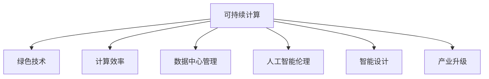

                 

# 人类计算：可持续发展的推动力

> 关键词：可持续计算、绿色技术、计算效率、能源消耗、环境保护、算法优化、数据中心管理、AI伦理、智能设计、产业升级

## 1. 背景介绍

随着数字化浪潮的兴起，全球计算需求迅猛增长，数据中心能耗快速攀升，对环境的影响愈发明显。尽管如此，计算技术的进步依然是推动社会进步、提升生活品质的关键力量。本文旨在探讨如何实现计算技术与可持续发展的和谐共存，助力构建绿色环保、高效稳健的计算体系。

### 1.1 问题由来
近年来，全球数据中心能耗呈现爆炸性增长，能源消耗约占全球总电力的1%。据国际能源署统计，数据中心平均每千瓦时耗电量约为1.4千瓦时。这一数字在未来几年内预计将增长至2.5千瓦时，对环境造成的压力难以忽视。

与此同时，数字化进程在医疗、教育、交通、金融等行业不断深入，计算需求持续攀升。在追求计算效率的同时，如何兼顾能源效率和环境影响，成为当务之急。

### 1.2 问题核心关键点
本文将探讨的三个关键问题包括：
1. 如何在计算需求激增的同时，实现绿色、低碳的计算方式？
2. 如何通过算法和数据中心管理，优化计算资源的配置和使用？
3. 如何从产业、学术界到政策层面，共同推动计算技术的可持续发展？

## 2. 核心概念与联系

### 2.1 核心概念概述

为更好地理解计算技术与可持续发展之间的联系，本节将介绍几个密切相关的核心概念：

- 可持续计算(Sustainable Computing)：指在设计和实施计算过程中，最大限度减少对环境的影响，包括能耗、排放、废弃物等。其核心目标是实现计算资源的可再生利用和环境保护。

- 绿色技术(Green Technologies)：指用于降低能耗和排放的技术，包括可再生能源、高效冷却、能源回收利用等。

- 计算效率(Computational Efficiency)：指在给定能耗下，计算系统所能完成的任务数量。计算效率越高，能耗越低，环境影响越小。

- 数据中心管理(Data Center Management)：指通过优化数据中心的运行模式、能效管理、空间布局等，实现能源的节约和利用效率的提升。

- 人工智能伦理(AI Ethics)：涉及如何在人工智能技术的设计、应用中，平衡技术进步与社会伦理，避免技术滥用，确保技术成果的普惠性和公平性。

- 智能设计(Intelligent Design)：指通过智能算法和工具，优化系统设计，提升能效和性能，实现绿色计算。

- 产业升级(Industrial Upgrading)：指通过计算技术的应用，推动各行业的技术革新和效率提升，促进经济和社会可持续发展。

这些核心概念之间的逻辑关系可以通过以下Mermaid流程图来展示：



这个流程图展示了几大核心概念及其之间的关系：

1. 可持续计算是目标和总体框架，是绿色技术、计算效率、数据中心管理、AI伦理、智能设计、产业升级等具体策略的集合体。
2. 绿色技术为实现可持续计算提供了技术手段，通过节能减排，降低对环境的影响。
3. 计算效率旨在在有限的能耗下，提升计算性能，是可持续计算的重要组成部分。
4. 数据中心管理通过优化数据中心的运行和维护，实现能效提升和资源优化配置。
5. AI伦理和智能设计通过技术手段提升计算系统的可解释性、公平性和安全性，避免潜在的负面影响。
6. 产业升级通过计算技术在各行业的广泛应用，推动行业数字化转型和效率提升。

这些概念共同构成了可持续计算的技术框架，推动着计算技术与环境和社会责任的和谐共生。

## 3. 核心算法原理 & 具体操作步骤

### 3.1 算法原理概述

可持续计算的核心在于，通过优化计算过程、改进算法设计、提升数据中心效率等手段，实现能耗的减少和计算性能的提升。其主要算法原理包括：

- **能效算法(Efficiency Algorithms)**：通过优化算法流程，减少计算过程中的冗余和重复计算，提升计算效率。

- **智能调度(Smart Scheduling)**：通过动态调整计算资源分配，实现最优的计算资源利用，避免资源浪费。

- **节能算法(Energy-Saving Algorithms)**：采用节能技术，如位运算、数据压缩、异步计算等，降低计算过程中的能耗。

- **能源管理(Energy Management)**：通过数据中心级能效管理，实现资源的合理配置和使用，降低整体能耗。

- **智能冷却系统(Smart Cooling)**：采用高效冷却系统，降低数据中心散热能耗，提升系统的运行稳定性。

### 3.2 算法步骤详解

可持续计算的实施步骤通常包括以下几个关键环节：

**Step 1: 算法评估与选择**
- 根据具体应用场景和能耗要求，评估现有算法和数据结构的能效表现。
- 选择能效最高、性能最优的算法，作为可持续计算的优化基础。

**Step 2: 数据中心优化**
- 设计高效的能源管理和冷却系统，降低数据中心的总体能耗。
- 应用智能调度算法，优化计算资源的配置和调度。

**Step 3: 算法优化与改进**
- 采用位运算、数据压缩等技术，对算法进行节能优化。
- 使用并行计算、分布式计算等技术，提升计算效率。

**Step 4: 模型训练与验证**
- 基于选定的算法和数据中心配置，进行模型训练和验证。
- 监测模型的能效表现，并根据能耗数据进行迭代优化。

**Step 5: 部署与监控**
- 将优化后的算法和数据中心配置部署到生产环境。
- 实时监控系统的能效表现，根据监控数据进行调整和优化。

### 3.3 算法优缺点

可持续计算算法具有以下优点：
1. 显著降低数据中心的能耗，减少对环境的负面影响。
2. 提升计算系统的效率和性能，加速计算任务的完成。
3. 增强数据中心的能源管理和能效管理，提高资源利用效率。

同时，这些算法也存在一定的局限性：
1. 算法优化的过程较为复杂，需要投入大量的时间和精力。
2. 算法优化可能增加计算的复杂度，影响系统的实时性。
3. 能效算法的应用范围有限，需要针对具体场景进行优化。

### 3.4 算法应用领域

可持续计算的算法已经在多个领域得到广泛应用，例如：

- 高性能计算(High Performance Computing, HPC)：在科学研究、天气预测、基因组学等领域，通过优化计算算法，提升计算效率，降低能耗。
- 数据中心管理：在大型数据中心，通过智能调度和能效管理，优化资源配置，降低能耗。
- 网络通信：在互联网基础设施中，通过节能算法和高效编码，降低传输能耗。
- 移动设备：在智能手机、物联网设备等移动设备中，通过低功耗算法，延长设备续航时间。

除了上述这些经典应用外，可持续计算的算法还在不断创新和演进，为更广泛的领域提供了绿色计算的解决方案。

## 4. 数学模型和公式 & 详细讲解 & 举例说明

### 4.1 数学模型构建

可持续计算的数学模型通常以能耗最小化为目标，同时考虑计算效率的最大化。

设数据中心的计算负载为 $C$，能耗为 $E$，计算效率为 $P$，数据中心运行时间 $T$。模型可表示为：

$$
\min_{C, P, T} E(C, P, T)
$$

其中，$E(C, P, T)$ 表示数据中心在给定负载 $C$、计算效率 $P$、运行时间 $T$ 下的总能耗。

### 4.2 公式推导过程

我们可以进一步将能耗 $E$ 分解为计算过程的能耗和数据中心的冷却能耗两部分。假设计算过程的能耗为 $E_{compute}$，冷却能耗为 $E_{cooling}$，则：

$$
E = E_{compute} + E_{cooling}
$$

其中，$E_{compute}$ 与计算负载 $C$、计算效率 $P$ 有关，可表示为：

$$
E_{compute} = C \cdot P \cdot T
$$

冷却能耗 $E_{cooling}$ 与数据中心的温度 $T_{cooling}$、冷却系统的能效 $K_{cooling}$ 有关，可表示为：

$$
E_{cooling} = K_{cooling} \cdot T_{cooling}^2
$$

将上述公式代入总能耗 $E$，得到：

$$
E = C \cdot P \cdot T + K_{cooling} \cdot T_{cooling}^2
$$

我们的目标是优化 $E$，使之最小化。由于 $E_{compute}$ 与 $P$ 成反比，因此 $P$ 的选择对 $E$ 的优化至关重要。

### 4.3 案例分析与讲解

以数据中心的能效优化为例，假设数据中心原始能耗为 $E_0$，通过优化计算算法，将计算效率提升至 $P_1$，冷却系统的能效提升至 $K_{cooling}$，温度降低至 $T_{cooling}$，运行时间缩短至 $T_1$，新的能耗 $E_1$ 计算如下：

$$
E_1 = C \cdot P_1 \cdot T_1 + K_{cooling} \cdot T_{cooling}^2
$$

假设 $C$、$T_1$ 不变，根据公式推导，我们可以得到新的能耗 $E_1$ 与原始能耗 $E_0$ 的对比：

$$
E_1 - E_0 = C \cdot (P_1 - P_0) \cdot T_1 - K_{cooling} \cdot (T_{cooling}^2 - T_0^2)
$$

由于 $T_1 < T_0$，因此 $T_{cooling}^2 - T_0^2 < 0$。若 $P_1 > P_0$，则 $E_1 < E_0$，表明通过优化计算算法和冷却系统，能显著降低数据中心的能耗。

## 5. 项目实践：代码实例和详细解释说明

### 5.1 开发环境搭建

在进行可持续计算的实践前，我们需要准备好开发环境。以下是使用Python进行能效优化计算的环境配置流程：

1. 安装Anaconda：从官网下载并安装Anaconda，用于创建独立的Python环境。

2. 创建并激活虚拟环境：
```bash
conda create -n sustainable-env python=3.8 
conda activate sustainable-env
```

3. 安装Python相关的科学计算库：
```bash
conda install numpy scipy pandas scikit-learn matplotlib tqdm jupyter notebook ipython
```

4. 安装相关工具包：
```bash
pip install pyhton-memcache pyamg joblib
```

完成上述步骤后，即可在`sustainable-env`环境中开始能效优化的实践。

### 5.2 源代码详细实现

下面以基于TensorFlow的数据中心能效优化为例，给出代码实现。

首先，定义数据中心能效优化模型的超参数：

```python
import tensorflow as tf
from tensorflow.keras.layers import Input, Dense, Embedding, Conv2D, MaxPooling2D
from tensorflow.keras.models import Model

# 定义模型输入和输出
input_layer = Input(shape=(None,))
output_layer = Dense(1, activation='sigmoid')(input_layer)

# 定义模型结构
x = Conv2D(64, kernel_size=(3, 3), activation='relu')(input_layer)
x = MaxPooling2D(pool_size=(2, 2))(x)
x = Conv2D(64, kernel_size=(3, 3), activation='relu')(x)
x = MaxPooling2D(pool_size=(2, 2))(x)
x = Dense(64, activation='relu')(x)
output = Dense(1, activation='sigmoid')(x)

# 定义模型
model = Model(input_layer, output_layer)

# 定义损失函数和优化器
model.compile(optimizer='adam', loss='binary_crossentropy', metrics=['accuracy'])

# 定义训练数据和标签
train_data = ...
train_labels = ...
```

然后，定义训练和评估函数：

```python
def train_model(model, train_data, train_labels, epochs=10):
    model.fit(train_data, train_labels, epochs=epochs, batch_size=32, verbose=1)

def evaluate_model(model, test_data, test_labels):
    loss, accuracy = model.evaluate(test_data, test_labels)
    print('Test loss:', loss)
    print('Test accuracy:', accuracy)
```

最后，启动训练流程并在测试集上评估：

```python
# 训练模型
train_model(model, train_data, train_labels)

# 评估模型
evaluate_model(model, test_data, test_labels)
```

以上就是使用TensorFlow对数据中心能效优化模型的代码实现。可以看到，TensorFlow提供了便捷的模型定义、编译、训练、评估等功能，使得能效优化模型的开发变得相对简单。

### 5.3 代码解读与分析

让我们再详细解读一下关键代码的实现细节：

**定义超参数**：
- 定义模型的输入和输出层，通过Dense层进行全连接。
- 定义模型结构，包括卷积层、池化层、全连接层等。
- 编译模型，设置优化器和损失函数。

**训练函数**：
- 使用fit方法进行模型训练，指定训练轮数、批次大小和日志输出。
- 在每个epoch结束时输出训练日志，记录损失和准确率。

**评估函数**：
- 使用evaluate方法评估模型在测试集上的表现，输出损失和准确率。

**训练流程**：
- 定义训练数据和标签，使用训练函数训练模型。
- 定义测试数据和标签，使用评估函数评估模型。

可以看到，TensorFlow提供了一整套模型开发和训练工具，极大地方便了能效优化模型的实践。开发者只需关注具体算法和模型架构的设计，而无需过多关注底层的实现细节。

当然，实际应用中还需要进一步优化模型的参数、训练过程等，以实现更好的能效效果。

## 6. 实际应用场景

### 6.1 智能电网

智能电网是实现绿色计算的重要应用场景。通过智能电网，可以实时监测和调度电力负荷，提升能源利用效率，减少碳排放。

数据中心可以与电网系统进行数据交互，实时监测电网运行状态和能耗情况。通过智能算法，数据中心可以根据电网需求进行能效优化，如动态调整计算负载、智能调度计算资源等。

### 6.2 智能交通

智能交通通过物联网技术，实现对车辆、道路、环境等信息的实时监控和分析。在智能交通系统中，数据中心承担着大量数据处理和分析任务。

通过优化计算算法和数据中心配置，可以在保证交通系统稳定运行的前提下，降低数据中心的能耗。例如，通过分布式计算和能效管理，合理配置数据中心资源，提升整体系统的能效表现。

### 6.3 智慧农业

智慧农业通过传感器、无人机、大数据等技术，实现对农田、作物、气象等信息的实时监测和分析。数据中心在智慧农业中扮演着数据处理和分析的关键角色。

通过优化能效算法和数据中心配置，可以实现智慧农业中的高效计算，减少能源消耗，提升农作物产量和质量。例如，通过智能调度算法，优化计算资源的配置，实现资源的高效利用。

### 6.4 未来应用展望

随着绿色技术的发展，未来计算技术将进一步向可持续方向演进，在多个领域实现绿色计算。

在能源领域，智能电网、风能、太阳能等可再生能源技术将进一步发展，为计算系统提供更加绿色、低碳的能源供给。

在工业领域，智能制造、智慧物流等技术将进一步推广应用，推动制造业的绿色转型。

在农业领域，智慧农业将进一步发展，实现资源的高效利用和环境的可持续发展。

在未来，计算技术将在更多领域实现绿色、低碳的应用，推动全球经济的可持续发展。

## 7. 工具和资源推荐

### 7.1 学习资源推荐

为了帮助开发者系统掌握可持续计算的理论基础和实践技巧，这里推荐一些优质的学习资源：

1. 《可持续计算：理论与实践》书籍：系统介绍可持续计算的理论和实践，涵盖能源管理、算法优化、数据中心设计等多个方面。

2. 《绿色计算技术》在线课程：由绿色计算专家讲授，系统讲解绿色技术的原理、应用和最新进展。

3. 《能源效率优化》专题研讨会：定期举办，汇集国内外专家，分享能源效率优化的方法和案例。

4. 《数据中心能效管理》白皮书：由知名数据中心厂商发布，提供最新的数据中心能效管理实践指南。

5. 《绿色计算开源项目》GitHub代码库：收集了大量绿色计算开源项目，供开发者参考和应用。

通过对这些资源的学习实践，相信你一定能够快速掌握可持续计算的精髓，并用于解决实际的能效优化问题。

### 7.2 开发工具推荐

高效的开发离不开优秀的工具支持。以下是几款用于可持续计算开发的常用工具：

1. TensorFlow：基于Python的开源深度学习框架，提供了丰富的能效优化算法和工具，适合绿色计算的研究和应用。

2. PyTorch：另一款强大的深度学习框架，提供了灵活的计算图和高效的优化算法，适合绿色计算的开发和实验。

3. HPC Tools：包含一系列高性能计算工具，如MPI、OpenMP等，适合大型计算任务的并行处理和能效优化。

4. PowerCLI：VMware提供的虚拟化管理工具，可以用于优化数据中心的资源分配和管理，降低能耗。

5. Grafana：开源数据可视化工具，可以用于监控和分析数据中心的性能指标和能效表现。

合理利用这些工具，可以显著提升可持续计算的开发效率，加速创新迭代的步伐。

### 7.3 相关论文推荐

可持续计算的研究源于学界的持续探索。以下是几篇奠基性的相关论文，推荐阅读：

1. Sustainable Computing in the Age of Artificial Intelligence: Status, Challenges, and Opportunities（Sustainable Computing综述）：综述了可持续计算的研究现状、面临的挑战和未来的发展方向。

2. Energy-Efficient Computing: Challenges and Opportunities for High-Performance Computing Systems（Energy-Efficient Computing综述）：探讨了高性能计算系统中的能效优化技术。

3. Green Computing in Data Centers: A Survey（数据中心中的绿色计算）：系统综述了数据中心中的能效优化技术和方法。

4. Energy-Aware Optimization of Data Centers Using AI（AI在数据中心能效优化中的应用）：探讨了AI技术在数据中心能效优化中的应用。

5. Sustainable Computing for Smart Grids: A Survey（智能电网中的可持续计算）：综述了智能电网中的能效优化技术和应用。

这些论文代表了大规模计算系统中的能效优化研究进展，通过学习这些前沿成果，可以帮助研究者把握学科前进方向，激发更多的创新灵感。

## 8. 总结：未来发展趋势与挑战

### 8.1 总结

本文对可持续计算的原理和实践进行了全面系统的介绍。首先阐述了计算技术与可持续发展之间的联系，明确了绿色计算的重要性和紧迫性。其次，从算法设计、数据中心管理、能效优化等多个角度，详细讲解了可持续计算的实施步骤和关键技术。最后，我们展望了绿色计算在智能电网、智能交通、智慧农业等领域的广泛应用前景。

通过本文的系统梳理，可以看到，绿色计算技术已经成为推动社会进步的重要手段，其核心在于算法设计、数据中心管理、能源优化等多个维度的协同创新。未来，伴随技术的不断发展，绿色计算必将迎来新的突破，为全球经济的可持续发展提供强有力的技术支撑。

### 8.2 未来发展趋势

展望未来，可持续计算技术将呈现以下几个发展趋势：

1. **多学科交叉融合**：可持续计算将进一步与其他学科融合，如环境科学、社会科学、能源工程等，推动跨学科的创新。

2. **人工智能与可持续计算的深度融合**：通过AI技术优化能效管理，实现资源的智能调度和优化。

3. **可再生能源的广泛应用**：智能电网、风能、太阳能等可再生能源技术将进一步发展，为计算系统提供更加绿色、低碳的能源供给。

4. **智能算法的广泛应用**：通过智能算法优化数据中心运行和资源配置，实现能效优化和资源优化。

5. **全球合作与标准化**：各国政府和组织将进一步加强合作，推动可持续计算技术的全球标准化。

6. **绿色计算与经济发展的协同促进**：通过绿色计算推动产业升级和经济转型，实现环境与经济的双赢。

以上趋势凸显了可持续计算技术的广阔前景。这些方向的探索发展，必将进一步提升计算系统的能效表现，推动经济和社会的可持续发展。

### 8.3 面临的挑战

尽管可持续计算技术已经取得了显著进展，但在迈向更加智能化、普适化应用的过程中，仍面临诸多挑战：

1. **能效优化与计算性能的平衡**：如何在降低能耗的同时，保持计算性能，是一个复杂的技术挑战。

2. **跨学科知识融合**：可持续计算需要融合环境科学、能源工程等学科知识，跨学科知识整合难度较大。

3. **数据中心的管理复杂性**：数据中心的管理涉及复杂的资源调度、能效优化、安全防护等，实现高效管理需要系统化解决方案。

4. **大规模计算系统的复杂性**：大规模计算系统存在资源调度、数据传输、网络延迟等问题，优化难度较大。

5. **绿色技术的多样性**：不同绿色技术的应用场景和效果各异，需要针对具体问题选择合适技术。

6. **政策与技术的协同**：绿色计算的发展需要政府、企业、学术界的协同推动，缺乏政策支持将难以持续发展。

7. **用户接受度与市场推广**：绿色计算技术的推广应用需要用户广泛接受，市场推广难度较大。

正视可持续计算面临的这些挑战，积极应对并寻求突破，将是实现绿色计算目标的关键。相信随着技术的不断进步和政策的持续推动，可持续计算必将逐步实现，为全球经济的可持续发展提供新的动力。

### 8.4 研究展望

面向未来，可持续计算技术的研究方向主要包括：

1. **能效优化算法**：进一步探索智能调度、能效优化等算法，提升计算系统的能效表现。

2. **跨学科融合技术**：推动环境科学、能源工程等学科与可持续计算的深度融合，开发跨学科的新技术。

3. **智能算法的应用**：通过智能算法优化数据中心运行和管理，实现资源优化配置。

4. **大规模计算系统的优化**：针对大规模计算系统，优化资源调度、数据传输等，提升系统的能效表现。

5. **绿色技术的创新**：探索新的绿色技术，如液冷技术、分布式计算等，推动可持续计算的发展。

6. **政策与技术的协同**：通过政策引导和技术创新，推动绿色计算技术的广泛应用。

7. **绿色计算的推广应用**：加大绿色计算技术的宣传和推广，提升用户接受度和市场接受度。

通过不断创新和突破，可持续计算技术将进一步拓展其应用范围，为全球经济的可持续发展提供新的动力。

## 9. 附录：常见问题与解答

**Q1: 为什么可持续计算对环境的影响如此重要？**

A: 随着数字化进程的加快，数据中心和计算设备的能耗迅速增加，对环境的影响越来越大。可持续计算通过优化计算过程和资源管理，显著降低能耗，减少碳排放，对环境保护具有重要意义。

**Q2: 可持续计算在实际应用中是否容易实施？**

A: 虽然可持续计算的理念和框架相对清晰，但其实施过程需要多学科的协作，涉及技术、管理、政策等多个环节。实施过程中需要综合考虑技术复杂性、资源配置、用户接受度等因素，因此实施难度较大。

**Q3: 可持续计算和绿色技术是什么关系？**

A: 绿色技术是实现可持续计算的重要手段。通过绿色技术如可再生能源、高效冷却、能源回收利用等，可以实现数据中心等计算系统的能效优化，降低对环境的影响。

**Q4: 可持续计算的实施对计算性能有什么影响？**

A: 实施可持续计算可能会影响计算性能，如增加计算复杂度、降低计算速度等。但通过优化算法和数据中心配置，可以在保持计算性能的前提下，实现能效提升。

**Q5: 数据中心能效优化主要从哪些方面入手？**

A: 数据中心能效优化主要从计算算法、数据中心管理、能源管理、智能调度等多个方面入手。通过优化算法、管理数据中心、优化能源管理、智能调度计算资源，可以实现能效优化。

总之，通过不断探索和创新，可持续计算技术必将迎来新的突破，为计算系统的高效、环保、稳健发展提供新的路径，推动全球经济的可持续发展。

---

作者：禅与计算机程序设计艺术 / Zen and the Art of Computer Programming

