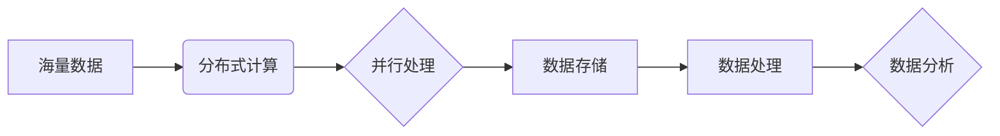

> 大数据，AI，计算原理，数据处理，机器学习，深度学习，分布式计算，Spark，Hadoop

## 1. 背景介绍

在当今信息爆炸的时代，海量数据正在以惊人的速度增长。从社交媒体、电商平台到科学研究，各个领域都产生了大量的结构化和非结构化数据。如何有效地存储、处理和分析这些数据，成为了一个重要的挑战。

人工智能（AI）作为一门新兴的学科，正在迅速发展，并为大数据处理提供了强大的工具和方法。AI算法能够从海量数据中提取有价值的信息，并进行预测、分类、识别等任务。

大数据计算是指处理海量数据的计算方法和技术。它需要克服传统计算方法的瓶颈，并采用分布式计算、并行处理等技术，才能有效地处理大规模数据。

## 2. 核心概念与联系

大数据计算的核心概念包括：

* **海量数据 (Big Data):** 指规模庞大、结构复杂、速度快的数据集。
* **分布式计算 (Distributed Computing):** 将计算任务分解成多个子任务，并分别在不同的节点上执行，从而提高计算效率。
* **并行处理 (Parallel Processing):** 在多个处理器上同时执行相同的计算任务，从而缩短计算时间。
* **数据存储 (Data Storage):** 用于存储海量数据的系统，例如Hadoop Distributed File System (HDFS)。
* **数据处理 (Data Processing):** 对海量数据进行清洗、转换、分析等操作，例如Apache Spark。

**核心概念关系图:**



## 3. 核心算法原理 & 具体操作步骤

### 3.1  算法原理概述

大数据计算中常用的算法包括：

* **MapReduce:** 分布式计算框架，将数据处理任务分解成Map和Reduce两个阶段。
* **Spark:** 基于内存的分布式计算框架，支持多种数据处理任务，例如数据清洗、转换、聚合、机器学习等。
* **Hadoop:** 开源分布式存储和处理框架，包括HDFS和YARN等组件。

### 3.2  算法步骤详解

**MapReduce算法步骤:**

1. **数据分片:** 将输入数据划分为多个数据块，每个数据块分配给一个Mapper节点。
2. **Map阶段:** 每个Mapper节点对数据块进行处理，将数据转换为键值对。
3. **数据聚合:** 将所有Mapper节点产生的键值对收集到Reduce节点。
4. **Reduce阶段:** 每个Reduce节点对相同键的键值对进行聚合，生成最终结果。

**Spark算法步骤:**

1. **数据加载:** 将数据加载到Spark集群的内存中。
2. **数据转换:** 使用Spark API对数据进行清洗、转换、聚合等操作。
3. **数据分析:** 使用Spark MLlib库进行机器学习等分析任务。
4. **结果输出:** 将分析结果输出到文件或数据库。

### 3.3  算法优缺点

**MapReduce算法:**

* **优点:** 简单易用，易于扩展，适合处理海量数据。
* **缺点:** 性能较低，数据处理速度慢，不适合实时数据处理。

**Spark算法:**

* **优点:** 性能高，数据处理速度快，支持实时数据处理，支持多种数据处理任务。
* **缺点:** 复杂度较高，需要学习Spark API，资源消耗较大。

### 3.4  算法应用领域

* **电商平台:** 商品推荐、用户画像、订单预测等。
* **社交媒体:** 内容推荐、用户行为分析、舆情监测等。
* **金融行业:** 风险评估、欺诈检测、投资决策等。
* **医疗行业:** 疾病诊断、药物研发、患者管理等。

## 4. 数学模型和公式 & 详细讲解 & 举例说明

### 4.1  数学模型构建

大数据计算中常用的数学模型包括：

* **线性回归模型:** 用于预测连续变量。
* **逻辑回归模型:** 用于预测分类变量。
* **支持向量机 (SVM):** 用于分类和回归任务。
* **决策树:** 用于分类和回归任务。

### 4.2  公式推导过程

**线性回归模型:**

目标是找到一条直线，使得预测值与实际值之间的误差最小。

$$
y = mx + c
$$

其中，$y$ 是预测值，$x$ 是输入变量，$m$ 是斜率，$c$ 是截距。

误差函数为：

$$
MSE = \frac{1}{n} \sum_{i=1}^{n} (y_i - \hat{y}_i)^2
$$

其中，$n$ 是样本数量，$y_i$ 是实际值，$\hat{y}_i$ 是预测值。

通过最小化误差函数，可以求解出$m$ 和 $c$ 的值。

### 4.3  案例分析与讲解

**案例:**

假设我们有一个数据集，包含房屋面积和房屋价格的信息。

我们可以使用线性回归模型来预测房屋价格。

**分析:**

通过训练线性回归模型，我们可以得到一条直线，这条直线可以用来预测房屋价格。

**举例:**

如果一个房屋面积为100平方米，我们可以使用线性回归模型来预测其价格。

## 5. 项目实践：代码实例和详细解释说明

### 5.1  开发环境搭建

* **操作系统:** Linux
* **编程语言:** Python
* **工具:** Apache Spark

### 5.2  源代码详细实现

```python
from pyspark.sql import SparkSession

# 创建SparkSession
spark = SparkSession.builder.appName("BigDataExample").getOrCreate()

# 加载数据
data = spark.read.csv("data.csv", header=True, inferSchema=True)

# 计算平均房价
average_price = data.agg({"price": "avg"}).collect()[0][0]

# 打印平均房价
print(f"平均房价: {average_price}")

# 关闭SparkSession
spark.stop()
```

### 5.3  代码解读与分析

* **创建SparkSession:** 创建SparkSession对象，用于连接Spark集群。
* **加载数据:** 使用`read.csv()`方法加载数据文件，并设置头部和数据类型推断。
* **计算平均房价:** 使用`agg()`方法计算平均房价，并使用`collect()`方法获取结果。
* **打印平均房价:** 打印计算出的平均房价。
* **关闭SparkSession:** 关闭SparkSession对象，释放资源。

### 5.4  运行结果展示

运行代码后，会输出平均房价的值。

## 6. 实际应用场景

* **电商平台:** 使用大数据计算分析用户行为，进行商品推荐和个性化营销。
* **金融行业:** 使用大数据计算进行风险评估、欺诈检测和投资决策。
* **医疗行业:** 使用大数据计算进行疾病诊断、药物研发和患者管理。

### 6.4  未来应用展望

* **人工智能:** 将大数据计算与人工智能结合，实现更智能的决策和预测。
* **物联网:** 处理海量物联网数据，实现智能家居、智能城市等应用。
* **边缘计算:** 将大数据计算部署到边缘设备，实现实时数据处理和分析。

## 7. 工具和资源推荐

### 7.1  学习资源推荐

* **书籍:**
    * 《Spark: The Definitive Guide》
    * 《Hadoop: The Definitive Guide》
    * 《Machine Learning》
* **在线课程:**
    * Coursera: Big Data Specialization
    * edX: Data Science MicroMasters Program

### 7.2  开发工具推荐

* **Apache Spark:** 开源分布式计算框架。
* **Apache Hadoop:** 开源分布式存储和处理框架。
* **Python:** 广泛使用的编程语言，用于大数据计算和机器学习。

### 7.3  相关论文推荐

* **MapReduce: Simplified Data Processing on Large Clusters**
* **Spark: Cluster Computing with Working Sets**
* **Deep Learning**

## 8. 总结：未来发展趋势与挑战

### 8.1  研究成果总结

大数据计算技术已经取得了显著的成果，为各个领域的数据处理和分析提供了强大的工具和方法。

### 8.2  未来发展趋势

* **人工智能与大数据计算的融合:** 将人工智能算法与大数据计算技术结合，实现更智能的决策和预测。
* **边缘计算和大数据计算的结合:** 将大数据计算部署到边缘设备，实现实时数据处理和分析。
* **数据隐私保护与安全:** 随着大数据量的增长，数据隐私保护和安全问题越来越重要。

### 8.3  面临的挑战

* **数据质量:** 大数据往往包含大量噪声和错误数据，需要进行有效的数据清洗和处理。
* **数据存储和管理:** 海量数据的存储和管理需要强大的技术支持。
* **计算资源:** 大数据计算需要大量的计算资源，成本较高。

### 8.4  研究展望

未来，大数据计算技术将继续发展，并应用于更多领域。

## 9. 附录：常见问题与解答

* **什么是大数据？**

大数据是指规模庞大、结构复杂、速度快的数据集。

* **什么是分布式计算？**

分布式计算是指将计算任务分解成多个子任务，并分别在不同的节点上执行，从而提高计算效率。

* **什么是Spark？**

Spark是一个基于内存的分布式计算框架，支持多种数据处理任务，例如数据清洗、转换、聚合、机器学习等。


作者：禅与计算机程序设计艺术 / Zen and the Art of Computer Programming 
<end_of_turn>