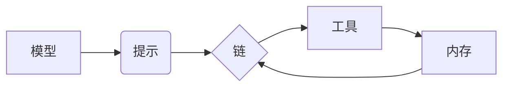

> LangChain, 大模型, 编程, 应用场景, 原理解释, 实践指南, 代码实例

## 1. 背景介绍

近年来，大模型在自然语言处理、计算机视觉、代码生成等领域取得了突破性进展，展现出强大的应用潜力。然而，如何有效地利用大模型，将其强大的能力转化为实际应用，仍然是一个重要的挑战。

LangChain 应运而生，它是一个强大的开源框架，旨在简化大模型的开发和应用。LangChain 提供了一套完整的工具和组件，帮助开发者构建复杂的应用程序，例如聊天机器人、问答系统、文本摘要等。

## 2. 核心概念与联系

LangChain 的核心概念包括：

* **模型 (Model):**  大模型，例如 GPT-3、BERT 等，负责处理文本数据。
* **提示 (Prompt):**  向模型输入的指令或文本，引导模型生成特定类型的输出。
* **链 (Chain):**  将多个组件（模型、提示、工具等）串联起来，形成一个完整的任务流程。
* **工具 (Tool):**  辅助模型完成特定任务的外部工具，例如搜索引擎、数据库等。
* **内存 (Memory):**  存储对话历史或其他相关信息，帮助模型理解上下文。

**LangChain 架构图:**



## 3. 核心算法原理 & 具体操作步骤

### 3.1  算法原理概述

LangChain 的核心算法原理是基于 **提示工程 (Prompt Engineering)** 和 **链式调用 (Chain Calling)**。

* **提示工程:** 通过精心设计提示，引导模型生成更准确、更符合预期结果的输出。
* **链式调用:** 将多个组件串联起来，形成一个完整的任务流程，实现复杂任务的分解和执行。

### 3.2  算法步骤详解

1. **定义任务:** 明确需要完成的任务目标。
2. **选择模型:** 根据任务需求选择合适的模型。
3. **设计提示:** 设计有效的提示，引导模型生成所需输出。
4. **构建链:** 将模型、提示、工具等组件串联起来，形成一个完整的任务流程。
5. **执行链:** 调用链，执行任务流程，获取最终结果。

### 3.3  算法优缺点

**优点:**

* **易于使用:** LangChain 提供了简洁易用的 API，简化了大模型的开发和应用。
* **灵活定制:** 可以根据任务需求灵活定制链的结构和组件。
* **可扩展性强:** 可以集成各种外部工具，扩展应用场景。

**缺点:**

* **模型依赖:** LangChain 的性能依赖于所选择的模型，模型质量直接影响应用效果。
* **提示设计难度:** 设计有效的提示需要一定的经验和技巧。
* **资源消耗:** 使用大模型可能会消耗大量的计算资源。

### 3.4  算法应用领域

LangChain 广泛应用于以下领域:

* **聊天机器人:**  构建智能聊天机器人，提供自然流畅的对话体验。
* **问答系统:**  构建问答系统，回答用户的问题，提供信息检索服务。
* **文本摘要:**  自动生成文本摘要，提取关键信息。
* **代码生成:**  根据自然语言描述生成代码，提高开发效率。
* **内容创作:**  辅助内容创作，例如生成文章、故事等。

## 4. 数学模型和公式 & 详细讲解 & 举例说明

### 4.1  数学模型构建

LangChain 中使用的数学模型主要用于：

* **文本表示:** 将文本转换为向量，以便模型理解和处理。常用的模型包括 Word2Vec、GloVe、BERT 等。
* **概率计算:**  预测模型输出的概率分布，例如下一个词的预测概率。常用的模型包括语言模型、循环神经网络等。

### 4.2  公式推导过程

由于篇幅限制，这里只列举一个常用的公式，即 Word2Vec 模型中的负采样损失函数：

$$
J(\theta) = -\frac{1}{T} \sum_{t=1}^{T} \sum_{i=1}^{N} \log \sigma(u_i^T h_t)
$$

其中：

* $\theta$ 是模型参数
* $T$ 是训练样本数量
* $N$ 是负采样数量
* $u_i$ 是词向量的第 $i$ 个维度
* $h_t$ 是上下文向量

### 4.3  案例分析与讲解

假设我们使用 Word2Vec 模型训练一个词向量表示，并希望学习 "king" 和 "queen" 之间的语义关系。通过训练，模型会学习到 "king" 和 "queen" 的词向量在语义空间上的位置接近。

## 5. 项目实践：代码实例和详细解释说明

### 5.1  开发环境搭建

* Python 3.7+
* PyTorch 或 TensorFlow
* LangChain 库

### 5.2  源代码详细实现

```python
from langchain.llms import OpenAI
from langchain.chains import ConversationChain
from langchain.memory import ConversationBufferMemory

# 初始化模型
llm = OpenAI(temperature=0.7)

# 初始化内存
memory = ConversationBufferMemory()

# 初始化对话链
conversation = ConversationChain(
    llm=llm,
    memory=memory,
    prompt=f"你好，我是你的助手。请问有什么可以帮你的吗？"
)

# 与模型对话
response = conversation.run("今天天气怎么样？")
print(response)
```

### 5.3  代码解读与分析

* **初始化模型:** 使用 OpenAI 库初始化 OpenAI 的 GPT-3 模型。
* **初始化内存:** 使用 ConversationBufferMemory 作为对话内存，存储对话历史。
* **初始化对话链:** 使用 ConversationChain 创建对话链，将模型和内存连接起来。
* **与模型对话:** 使用 conversation.run() 方法与模型进行对话，并打印模型的回复。

### 5.4  运行结果展示

```
今天天气晴朗，很适合外出活动。
```

## 6. 实际应用场景

### 6.1  聊天机器人

LangChain 可以用于构建智能聊天机器人，例如客服机器人、陪伴机器人等。

### 6.2  问答系统

LangChain 可以用于构建问答系统，例如知识问答系统、搜索引擎等。

### 6.3  文本摘要

LangChain 可以用于自动生成文本摘要，提取关键信息。

### 6.4  未来应用展望

LangChain 的应用场景还在不断扩展，未来可能会应用于：

* **代码生成:** 根据自然语言描述生成代码，提高开发效率。
* **内容创作:** 辅助内容创作，例如生成文章、故事等。
* **个性化推荐:** 根据用户的兴趣爱好，提供个性化的推荐服务。

## 7. 工具和资源推荐

### 7.1  学习资源推荐

* **LangChain 官方文档:** https://python.langchain.com/en/latest/
* **LangChain GitHub 仓库:** https://github.com/langchain-org/langchain

### 7.2  开发工具推荐

* **Python:** https://www.python.org/
* **PyTorch:** https://pytorch.org/
* **TensorFlow:** https://www.tensorflow.org/

### 7.3  相关论文推荐

* **Attention Is All You Need:** https://arxiv.org/abs/1706.03762
* **BERT: Pre-training of Deep Bidirectional Transformers for Language Understanding:** https://arxiv.org/abs/1810.04805

## 8. 总结：未来发展趋势与挑战

### 8.1  研究成果总结

LangChain 框架的出现，为大模型的开发和应用提供了强大的工具和支持，促进了大模型在实际应用领域的推广。

### 8.2  未来发展趋势

* **更强大的模型:** 未来将会出现更强大的大模型，例如千亿参数甚至万亿参数的模型，这将进一步提升 LangChain 的应用能力。
* **更智能的链:** 未来将会出现更智能的链，能够自动学习和优化链的结构和组件，提高应用效率。
* **更广泛的应用场景:** LangChain 的应用场景将会更加广泛，例如医疗、教育、金融等领域。

### 8.3  面临的挑战

* **模型训练成本:** 训练大型模型需要大量的计算资源和时间，成本较高。
* **数据安全:** 大模型的训练和应用需要处理大量数据，数据安全是一个重要的挑战。
* **伦理问题:** 大模型的应用可能会带来一些伦理问题，例如偏见、虚假信息等，需要引起重视。

### 8.4  研究展望

未来，LangChain 框架将会继续发展和完善，为大模型的开发和应用提供更强大的支持，推动人工智能技术的发展。

## 9. 附录：常见问题与解答

**Q1: 如何选择合适的模型？**

**A1:** 选择模型需要根据任务需求和模型性能进行评估。

**Q2: 如何设计有效的提示？**

**A2:** 设计有效的提示需要考虑以下因素：

* **明确任务:** 提示应该明确地描述任务目标。
* **提供上下文:** 提供足够的上下文信息，帮助模型理解任务背景。
* **控制输出格式:** 指定输出格式，例如文本、代码等。

**Q3: 如何解决模型的偏见问题？**

**A3:** 

* 使用多样化的训练数据，减少模型的偏见。
* 开发针对偏见问题的检测和修正方法。
* 提高模型的透明度，方便用户理解模型的决策过程。


作者：禅与计算机程序设计艺术 / Zen and the Art of Computer Programming 
<end_of_turn>