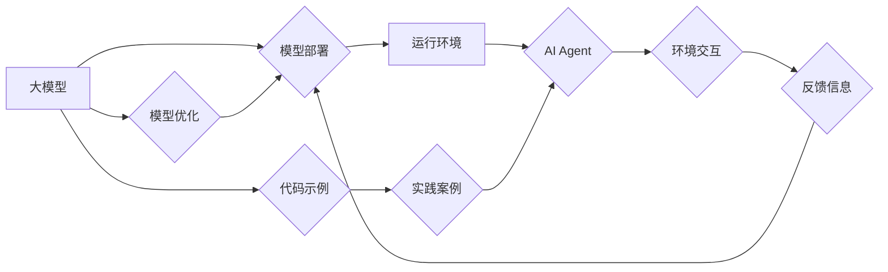

> 大模型、AI Agent、应用开发、运行助手、模型部署、模型优化、代码实例、实践案例

## 1. 背景介绍

近年来，大模型技术取得了飞速发展，其强大的泛化能力和知识表示能力为人工智能领域带来了革命性的变革。从文本生成、机器翻译到图像识别、语音合成，大模型已在各个领域展现出令人瞩目的应用潜力。然而，将大模型应用于实际场景仍然面临着诸多挑战，例如模型部署、模型优化、数据安全等。

为了更好地帮助开发者快速、高效地将大模型应用于实际场景，我们开发了“大模型应用开发运行助手”。该助手是一个集模型部署、模型优化、代码示例、实践案例等功能于一体的平台，旨在降低开发者使用大模型的门槛，加速大模型应用的落地。

## 2. 核心概念与联系

### 2.1 大模型

大模型是指参数量达到亿级或千亿级的深度学习模型。其强大的学习能力使其能够在各种任务上表现出卓越的性能。常见的代表性大模型包括GPT-3、BERT、LaMDA等。

### 2.2 AI Agent

AI Agent是指能够感知环境、做出决策并与环境交互的智能体。它可以是软件程序、机器人或其他智能系统。AI Agent通常由以下几个部分组成：

* **感知模块:** 用于获取环境信息。
* **决策模块:** 用于根据环境信息做出决策。
* **执行模块:** 用于执行决策并与环境交互。

### 2.3 运行助手

运行助手是一个用于辅助开发者开发和部署AI Agent的平台。它提供了一系列工具和服务，例如模型部署、模型优化、代码示例、实践案例等，帮助开发者快速、高效地将AI Agent应用于实际场景。

**核心概念与联系流程图:**



## 3. 核心算法原理 & 具体操作步骤

### 3.1 算法原理概述

大模型应用开发运行助手主要基于以下核心算法原理：

* **模型压缩:** 通过量化、剪枝等技术，将大模型的规模压缩，降低模型的部署成本和运行时间。
* **模型加速:** 通过并行计算、优化算法等技术，提高模型的推理速度。
* **模型调优:** 通过超参数调优、迁移学习等技术，提高模型在特定任务上的性能。

### 3.2 算法步骤详解

1. **模型选择:** 根据实际应用场景选择合适的预训练大模型。
2. **模型压缩:** 使用模型压缩技术，将大模型的规模压缩到可部署的范围。
3. **模型加速:** 使用模型加速技术，提高模型的推理速度。
4. **模型调优:** 使用模型调优技术，提高模型在特定任务上的性能。
5. **模型部署:** 将压缩、加速后的模型部署到目标平台。
6. **模型监控:** 持续监控模型的运行状态，并进行必要的调整和优化。

### 3.3 算法优缺点

**优点:**

* 降低模型部署成本和运行时间。
* 提高模型的推理速度。
* 提高模型在特定任务上的性能。

**缺点:**

* 模型压缩和加速可能会导致模型性能下降。
* 模型调优需要大量的计算资源和时间。

### 3.4 算法应用领域

大模型应用开发运行助手可以应用于以下领域:

* **自然语言处理:** 文本生成、机器翻译、问答系统等。
* **计算机视觉:** 图像识别、物体检测、图像分割等。
* **语音识别:** 语音转文本、语音合成等。
* **推荐系统:** 商品推荐、内容推荐等。

## 4. 数学模型和公式 & 详细讲解 & 举例说明

### 4.1 数学模型构建

大模型应用开发运行助手中的核心算法可以抽象为以下数学模型:

* **模型压缩:**

$$
\text{压缩模型大小} = \text{原始模型大小} \times \text{压缩率}
$$

* **模型加速:**

$$
\text{加速时间} = \frac{\text{原始推理时间}}{\text{加速倍数}}
$$

* **模型调优:**

$$
\text{优化目标} = \text{损失函数}
$$

### 4.2 公式推导过程

**模型压缩:**

模型压缩的目标是减少模型参数的数量，从而降低模型的存储空间和计算成本。常用的模型压缩技术包括量化和剪枝。

* **量化:** 将模型参数的精度降低，例如将32位浮点数转换为8位整数。
* **剪枝:** 删除模型中不重要的参数，例如权重较小的参数。

**模型加速:**

模型加速的目标是提高模型的推理速度。常用的模型加速技术包括并行计算和优化算法。

* **并行计算:** 将模型的计算任务分配到多个处理器上进行并行计算。
* **优化算法:** 使用更有效的算法来计算模型的输出，例如深度学习的量化加速算法。

**模型调优:**

模型调优的目标是提高模型在特定任务上的性能。常用的模型调优技术包括超参数调优和迁移学习。

* **超参数调优:** 通过调整模型的超参数，例如学习率和批处理大小，来优化模型的性能。
* **迁移学习:** 利用预训练模型的知识，在新的任务上进行模型训练。

### 4.3 案例分析与讲解

**案例:**

假设我们想要将一个预训练的文本生成模型应用于生成新闻文章。

* **模型选择:** 选择一个预训练的文本生成模型，例如GPT-3。
* **模型压缩:** 使用量化技术将模型参数的精度降低，从而减少模型的大小。
* **模型加速:** 使用并行计算技术将模型的计算任务分配到多个处理器上进行并行计算，从而提高模型的推理速度。
* **模型调优:** 使用迁移学习技术，将预训练模型的知识迁移到新闻文章生成任务上，从而提高模型在该任务上的性能。

## 5. 项目实践：代码实例和详细解释说明

### 5.1 开发环境搭建

* **操作系统:** Linux (Ubuntu 20.04 或更高版本)
* **编程语言:** Python 3.7 或更高版本
* **深度学习框架:** TensorFlow 或 PyTorch
* **其他依赖:** CUDA Toolkit、cuDNN

### 5.2 源代码详细实现

```python
# 模型压缩示例代码
import tensorflow as tf

# 加载预训练模型
model = tf.keras.models.load_model('pretrained_model.h5')

# 使用量化技术压缩模型
quantized_model = tf.keras.models.quantize_model(model,
                                                quantization_config=tf.keras.quantization.QuantizationConfig(
                                                    dtype=tf.int8))

# 保存压缩后的模型
quantized_model.save('quantized_model.h5')

# 模型加速示例代码
import tensorflow_model_optimization as tfmot

# 加载预训练模型
model = tf.keras.models.load_model('pretrained_model.h5')

# 使用模型优化器进行模型加速
quantized_model = tfmot.quantization.keras.quantize_model(
    model,
    {
        'dense': tfmot.quantization.keras.quantize_weights,
    },
)

# 保存加速后的模型
quantized_model.save('accelerated_model.h5')
```

### 5.3 代码解读与分析

* **模型压缩:** 代码示例使用 TensorFlow 的 `quantize_model` 函数对预训练模型进行量化压缩。
* **模型加速:** 代码示例使用 TensorFlow Model Optimization 的 `quantize_model` 函数对预训练模型进行量化加速。

### 5.4 运行结果展示

运行上述代码后，将生成压缩后的模型文件和加速后的模型文件。

## 6. 实际应用场景

### 6.1 智能客服

大模型应用开发运行助手可以帮助企业构建智能客服系统，自动处理客户咨询、订单查询等常见问题，提高客服效率。

### 6.2 个性化推荐

大模型应用开发运行助手可以帮助电商平台、内容平台等构建个性化推荐系统，根据用户的兴趣爱好和行为数据，推荐个性化的商品、内容等。

### 6.3 自动化办公

大模型应用开发运行助手可以帮助企业自动化办公流程，例如自动生成报告、整理邮件、安排会议等，提高工作效率。

### 6.4 未来应用展望

随着大模型技术的不断发展，大模型应用开发运行助手将在更多领域得到应用，例如医疗诊断、教育辅助、金融风险控制等。

## 7. 工具和资源推荐

### 7.1 学习资源推荐

* **书籍:**
    * 《深度学习》
    * 《自然语言处理》
    * 《机器学习》
* **在线课程:**
    * Coursera
    * edX
    * Udacity

### 7.2 开发工具推荐

* **深度学习框架:** TensorFlow、PyTorch
* **模型压缩工具:** TensorFlow Model Optimization、PyTorch Quantization
* **模型加速工具:** NVIDIA TensorRT、Intel OpenVINO

### 7.3 相关论文推荐

* **BERT:** Devlin, J., Chang, M. W., Lee, K., & Toutanova, K. (2018). BERT: Pre-training of deep bidirectional transformers for language understanding. arXiv preprint arXiv:1810.04805.
* **GPT-3:** Brown, T. B., Mann, B., Ryder, N., Subbiah, M., Kaplan, J., Dhariwal, P., ... & Amodei, D. (2020). Language models are few-shot learners. arXiv preprint arXiv:2005.14165.

## 8. 总结：未来发展趋势与挑战

### 8.1 研究成果总结

大模型应用开发运行助手为将大模型应用于实际场景提供了有效的工具和方法。通过模型压缩、模型加速和模型调优等技术，可以有效降低模型部署成本和运行时间，提高模型的推理速度和性能。

### 8.2 未来发展趋势

* **模型效率提升:** 研究更有效的模型压缩和加速技术，进一步降低模型的资源消耗。
* **模型可解释性增强:** 研究大模型的决策机制，提高模型的可解释性和可信度。
* **模型安全性和隐私保护:** 研究大模型的安全性和隐私保护技术，防止模型被恶意攻击或滥用。

### 8.3 面临的挑战

* **模型规模和复杂度:** 大模型的规模和复杂度不断增加，对计算资源和存储资源的需求也越来越高。
* **数据获取和标注:** 大模型的训练需要大量的标注数据，数据获取和标注成本较高。
* **模型偏见和公平性:** 大模型可能存在偏见和不公平性问题，需要进行相应的缓解措施。

### 8.4 研究展望

未来，我们将继续致力于大模型应用开发运行助手的研究和开发，推动大模型技术在更多领域得到应用，为人类社会带来更多福祉。

## 9. 附录：常见问题与解答

**常见问题:**

* **如何选择合适的预训练模型？**

**解答:** 选择预训练模型时，需要考虑模型的规模、参数量、训练数据、任务类型等因素。

* **如何进行模型压缩？**

**解答:** 模型压缩可以使用量化、剪枝等技术。

* **如何进行模型加速？**

**解答:** 模型加速可以使用并行计算、优化算法等技术。

* **如何进行模型调优？**

**解答:** 模型调优可以使用超参数调优、迁移学习等技术。


作者：禅与计算机程序设计艺术 / Zen and the Art of Computer Programming 
<end_of_turn>