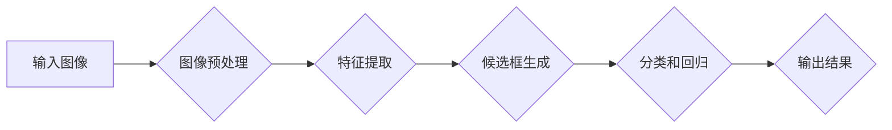

> 深度学习、对象检测、卷积神经网络、YOLO、Faster R-CNN、目标识别、图像理解

## 1. 背景介绍

在当今数据爆炸的时代，图像和视频数据成为了海量信息的重要组成部分。如何有效地理解和分析这些视觉数据，成为了一个重要的研究方向。对象检测技术作为计算机视觉领域的核心技术之一，旨在识别和定位图像或视频中存在的特定物体，并为其赋予类别标签。

传统的基于手工特征的对象检测方法依赖于人工设计的特征提取器，例如SIFT、HOG等，这些方法在性能上存在局限性，并且难以适应复杂场景下的物体变化。随着深度学习技术的兴起，基于深度学习的对象检测方法取得了显著的进展，其性能大幅提升，并能够更好地处理复杂场景下的物体检测任务。

## 2. 核心概念与联系

**2.1  深度学习与卷积神经网络**

深度学习是一种机器学习的子领域，它利用多层神经网络来学习数据中的复杂模式。卷积神经网络（CNN）是深度学习中应用最广泛的网络结构之一，其结构灵感来源于生物视觉系统，能够有效地提取图像特征。

**2.2  对象检测流程**

对象检测流程通常包括以下几个步骤：

1. **图像预处理:** 对输入图像进行尺寸调整、归一化等预处理操作，以提高模型的性能。
2. **特征提取:** 利用CNN提取图像的特征表示，这些特征能够捕捉图像中的物体形状、纹理等信息。
3. **候选框生成:** 通过区域建议网络（Region Proposal Network，RPN）生成候选物体区域，这些区域可能包含目标物体。
4. **分类和回归:** 对每个候选框进行分类和回归，判断其是否包含目标物体，并预测目标物体的边界框坐标。

**2.3  Mermaid 流程图**



## 3. 核心算法原理 & 具体操作步骤

### 3.1  算法原理概述

常见的基于深度学习的对象检测算法包括YOLO、Faster R-CNN等。这些算法都基于CNN网络结构，并结合了区域建议网络和分类回归模块。

**3.1.1  YOLO (You Only Look Once)**

YOLO是一种端到端的实时对象检测算法，其特点是速度快、精度高。YOLO将图像划分为多个网格单元，每个网格单元负责预测该区域内是否存在物体，以及物体的类别和边界框坐标。

**3.1.2  Faster R-CNN (Region-based Convolutional Neural Networks)**

Faster R-CNN是一种两阶段的对象检测算法，其第一阶段利用RPN生成候选物体区域，第二阶段利用分类回归网络对候选区域进行分类和边界框回归。Faster R-CNN的精度较高，但速度相对较慢。

### 3.2  算法步骤详解

**3.2.1  YOLO算法步骤**

1. 将输入图像划分为多个网格单元。
2. 每个网格单元预测多个候选框，每个候选框包含物体类别概率和边界框坐标。
3. 利用非极大值抑制算法去除冗余的候选框。
4. 将剩余的候选框进行分类和边界框回归，得到最终的检测结果。

**3.2.2  Faster R-CNN算法步骤**

1. 利用RPN生成候选物体区域。
2. 对每个候选区域进行特征提取。
3. 利用分类回归网络对候选区域进行分类和边界框回归。
4. 利用非极大值抑制算法去除冗余的候选框。
5. 将剩余的候选框进行分类和边界框回归，得到最终的检测结果。

### 3.3  算法优缺点

**3.3.1  YOLO算法**

* **优点:** 速度快，实时性强，适合于需要快速检测的场景。
* **缺点:** 精度相对较低，难以检测小目标和复杂场景下的物体。

**3.3.2  Faster R-CNN算法**

* **优点:** 精度较高，能够检测小目标和复杂场景下的物体。
* **缺点:** 速度相对较慢，不适合于需要实时检测的场景。

### 3.4  算法应用领域

对象检测技术广泛应用于各个领域，例如：

* **自动驾驶:** 检测道路上的车辆、行人、交通信号灯等。
* **安防监控:** 检测入侵者、异常行为等。
* **医疗诊断:** 检测病灶、肿瘤等。
* **零售业:** 人脸识别、商品识别等。

## 4. 数学模型和公式 & 详细讲解 & 举例说明

### 4.1  数学模型构建

**4.1.1  损失函数**

对象检测算法的训练过程通常使用损失函数来衡量模型的预测结果与真实标签之间的差异。常见的损失函数包括：

* **分类损失函数:** 用于衡量模型对物体的类别预测的准确性，例如交叉熵损失函数。
* **回归损失函数:** 用于衡量模型对物体的边界框坐标预测的准确性，例如均方误差损失函数。

**4.1.2  优化算法**

为了最小化损失函数，通常使用优化算法来更新模型的参数。常见的优化算法包括：

* **梯度下降法:** 通过计算梯度来更新模型参数。
* **Adam优化器:** 结合了动量和自适应学习率的优化算法。

### 4.2  公式推导过程

**4.2.1  交叉熵损失函数**

假设模型预测物体类别为 $p_i$，真实标签为 $y_i$，则交叉熵损失函数为：

$$
L_{ce} = - \sum_{i=1}^{N} y_i \log(p_i)
$$

其中，$N$ 为物体数量。

**4.2.2  均方误差损失函数**

假设模型预测的边界框坐标为 $\hat{b}$，真实标签为 $b$，则均方误差损失函数为：

$$
L_{mse} = \frac{1}{2} \sum_{i=1}^{4} (b_i - \hat{b}_i)^2
$$

其中，$b_i$ 和 $\hat{b}_i$ 分别为真实标签和模型预测的第 $i$ 个边界框坐标。

### 4.3  案例分析与讲解

**4.3.1  YOLO算法的损失函数**

YOLO算法的损失函数是分类损失函数和回归损失函数的加权和。分类损失函数用于衡量模型对物体的类别预测的准确性，回归损失函数用于衡量模型对物体的边界框坐标预测的准确性。

**4.3.2  Faster R-CNN算法的损失函数**

Faster R-CNN算法的损失函数也是分类损失函数和回归损失函数的加权和。分类损失函数用于衡量模型对物体的类别预测的准确性，回归损失函数用于衡量模型对物体的边界框坐标预测的准确性。

## 5. 项目实践：代码实例和详细解释说明

### 5.1  开发环境搭建

* **操作系统:** Ubuntu 18.04
* **深度学习框架:** TensorFlow 2.0
* **编程语言:** Python 3.7

### 5.2  源代码详细实现

```python
# YOLOv3 模型的代码示例

import tensorflow as tf

# 定义 YOLOv3 模型结构
def yolov3_model(input_shape):
    # ... 模型结构定义 ...

# 加载预训练模型权重
model = yolov3_model(input_shape)
model.load_weights('yolov3.h5')

# 定义输入图像
image = tf.random.normal(shape=(1, input_shape[0], input_shape[1], 3))

# 进行预测
predictions = model(image)

# ... 后续处理预测结果 ...
```

### 5.3  代码解读与分析

* **模型结构定义:** YOLOv3 模型结构由多个卷积层、池化层和全连接层组成，其结构设计能够有效地提取图像特征。
* **加载预训练模型权重:** 使用预训练模型权重可以提高模型的性能，并减少训练时间。
* **输入图像:** 输入图像需要进行尺寸调整，以适应模型的输入要求。
* **进行预测:** 将输入图像输入到模型中，得到预测结果。
* **后续处理预测结果:** 对预测结果进行后处理，例如非极大值抑制、坐标回归等，得到最终的检测结果。

### 5.4  运行结果展示

运行代码后，可以得到预测结果，例如检测到的物体类别和边界框坐标。

## 6. 实际应用场景

### 6.1  自动驾驶

* **车辆检测:** 检测道路上的车辆，判断其速度、距离等信息，用于辅助驾驶决策。
* **行人检测:** 检测道路上的行人，避免车辆与行人发生碰撞。
* **交通信号灯检测:** 检测交通信号灯的状态，判断车辆是否需要停车或通行。

### 6.2  安防监控

* **入侵检测:** 检测入侵者进入监控区域，触发报警。
* **异常行为检测:** 检测异常行为，例如暴力的行为、可疑的物品等。
* **人脸识别:** 对监控画面中的人员进行识别，用于身份验证或追踪。

### 6.3  医疗诊断

* **病灶检测:** 检测图像中的病灶，辅助医生诊断疾病。
* **肿瘤检测:** 检测图像中的肿瘤，判断其大小、位置等信息。
* **器官分割:** 将图像中的器官进行分割，用于医学研究或手术规划。

### 6.4  未来应用展望

随着深度学习技术的不断发展，对象检测技术将会在更多领域得到应用，例如：

* **智能家居:** 用于识别家庭成员、控制家电等。
* **机器人:** 用于帮助机器人理解周围环境，进行导航和交互。
* **增强现实:** 用于将虚拟物体叠加到现实世界中，提供更丰富的交互体验。

## 7. 工具和资源推荐

### 7.1  学习资源推荐

* **书籍:**
    * 《深度学习》 by Ian Goodfellow, Yoshua Bengio, Aaron Courville
    * 《计算机视觉: 算法与应用》 by Richard Szeliski
* **在线课程:**
    * Coursera: Deep Learning Specialization
    * Udacity: Deep Learning Nanodegree

### 7.2  开发工具推荐

* **深度学习框架:** TensorFlow, PyTorch, Keras
* **图像处理库:** OpenCV, Pillow
* **数据标注工具:** LabelImg, VGG Image Annotator

### 7.3  相关论文推荐

* **YOLO:** You Only Look Once: Unified, Real-Time Object Detection
* **Faster R-CNN:** Faster R-CNN: Towards Real-Time Object Detection with Region Proposal Networks
* **SSD:** Single Shot MultiBox Detector

## 8. 总结：未来发展趋势与挑战

### 8.1  研究成果总结

近年来，基于深度学习的对象检测技术取得了显著的进展，其精度和速度都得到了大幅提升。

### 8.2  未来发展趋势

* **模型轻量化:** 开发更轻量化的模型，以便在移动设备上进行部署。
* **多模态检测:** 将图像、视频、音频等多模态数据融合，提高检测的准确性和鲁棒性。
* **场景理解:** 将对象检测与场景理解相结合，实现更深入的视觉理解。

### 8.3  面临的挑战

* **数据标注:** 高质量的标注数据是深度学习模型训练的关键，但数据标注工作量大、成本高。
* **模型解释性:** 深度学习模型的决策过程难以解释，这限制了其在一些安全关键应用中的应用。
* **泛化能力:** 深度学习模型在训练数据之外的场景下，其性能可能下降。

### 8