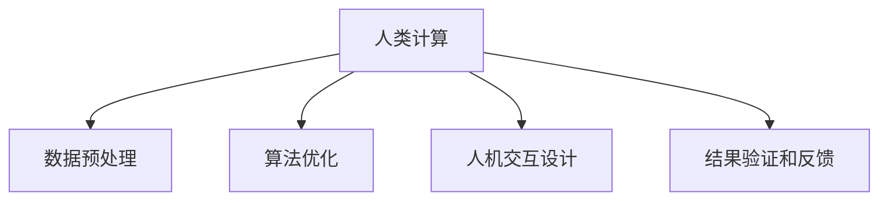

                 

# 人类计算：应用与案例分析

## 1. 背景介绍

在当今科技飞速发展的时代，计算能力已经成为推动科技进步和社会进步的重要驱动力。然而，面对复杂的问题和庞大的数据，传统的人类计算方式显得力不从心。随着人工智能和计算科学的进步，"人类计算"的概念应运而生。人类计算旨在结合人类的智慧和计算的能力，通过优化算法和工具，提升计算效率和准确性，解决传统计算无法应对的复杂问题。

### 1.1 问题由来

早在20世纪50年代，人们就开始尝试将人类计算与机器计算相结合，以解决复杂问题。早期的人机交互方式主要是通过编程和调试，但这种方式对人的要求较高，需要具备一定的计算机知识。随着人工智能的发展，尤其是深度学习、自然语言处理、计算机视觉等领域的突破，人类计算逐渐由程序员向普通用户开放，变得更加直观和易于使用。

### 1.2 问题核心关键点

当前，人类计算在多个领域得到了广泛应用，包括科学研究、工程设计、金融分析、医疗诊断等。人类计算的核心关键点包括：

- 数据预处理：对原始数据进行清洗、归一化、特征工程等预处理，提高数据质量。
- 算法优化：选择合适的算法和优化策略，提升计算效率。
- 人机交互设计：设计友好的用户界面和交互方式，使用户能够自然地进行计算和数据分析。
- 结果验证和反馈：对计算结果进行验证和反馈，确保计算过程的可靠性和准确性。

这些关键点共同构成了人类计算的技术框架，使其能够在复杂场景中发挥强大的计算能力。

### 1.3 问题研究意义

研究人类计算的应用，对于推动科学技术的进步，解决复杂问题，提升生产力和效率，具有重要意义：

1. 提升计算能力：通过结合人类的智慧，优化算法和工具，大幅提升计算效率和准确性。
2. 降低计算成本：普通用户无需具备专业计算机知识，即可进行复杂的计算任务，降低计算成本。
3. 加速科研创新：科学家可以利用高效的人类计算工具，快速进行数据分析和模拟实验，加速科研成果产出。
4. 优化设计流程：工程师可以通过人类计算工具，进行多方案比选和仿真分析，优化设计流程和产品性能。
5. 改善决策支持：企业可以利用人类计算工具，进行市场分析和财务预测，改善决策过程和效果。

通过人类计算的应用，能够有效提升计算能力的边界，助力各行各业加速发展。

## 2. 核心概念与联系

### 2.1 核心概念概述

为更好地理解人类计算的应用，本节将介绍几个关键核心概念：

- 人类计算(Human Computation)：利用人类的智慧和计算能力，通过优化算法和工具，提升计算效率和准确性。
- 数据预处理(Preprocessing)：对原始数据进行清洗、归一化、特征工程等预处理，提高数据质量。
- 算法优化(Algorithm Optimization)：选择合适的算法和优化策略，提升计算效率。
- 人机交互设计(Interaction Design)：设计友好的用户界面和交互方式，使用户能够自然地进行计算和数据分析。
- 结果验证和反馈(Validation and Feedback)：对计算结果进行验证和反馈，确保计算过程的可靠性和准确性。

这些核心概念之间的逻辑关系可以通过以下Mermaid流程图来展示：



这个流程图展示了大语言模型的核心概念及其之间的关系：

1. 人类计算通过数据预处理、算法优化、人机交互设计等环节，实现了对原始数据的计算和分析。
2. 数据预处理和算法优化是计算的核心，决定了计算的效率和准确性。
3. 人机交互设计是用户体验的关键，决定了用户的使用意愿和效率。
4. 结果验证和反馈是计算结果可靠性的保障，决定了计算的可信度和可解释性。

这些核心概念共同构成了人类计算的技术框架，使其能够在复杂场景中发挥强大的计算能力。

## 3. 核心算法原理 & 具体操作步骤

### 3.1 算法原理概述

人类计算的核心算法原理包括数据预处理、算法优化和人机交互设计。其中，数据预处理和算法优化是计算的核心，决定了计算的效率和准确性；人机交互设计是用户体验的关键，决定了用户的使用意愿和效率。

- 数据预处理：对原始数据进行清洗、归一化、特征工程等预处理，提高数据质量。
- 算法优化：选择合适的算法和优化策略，提升计算效率。
- 人机交互设计：设计友好的用户界面和交互方式，使用户能够自然地进行计算和数据分析。

### 3.2 算法步骤详解

人类计算的算法步骤通常包括以下几个关键步骤：

**Step 1: 数据预处理**
- 数据清洗：去除数据中的异常值、缺失值、重复值等，提高数据质量。
- 数据归一化：对数据进行标准化处理，使得不同数据具有可比性。
- 特征工程：通过选择、提取、变换等方法，构建有意义的特征，提高模型性能。

**Step 2: 算法选择**
- 选择合适的算法，根据问题的特点选择不同的算法，如回归、分类、聚类等。
- 选择优化策略，如梯度下降、遗传算法等，提升算法效率。

**Step 3: 实现算法**
- 使用编程语言实现算法，如Python、C++等。
- 实现人机交互界面，使用户能够自然地进行计算和数据分析。

**Step 4: 结果验证和反馈**
- 对计算结果进行验证，确保计算过程的可靠性和准确性。
- 提供反馈机制，使用户能够及时了解计算结果和过程，进行下一步调整。

### 3.3 算法优缺点

人类计算具有以下优点：
1. 提升计算能力：结合人类的智慧和计算的能力，大幅提升计算效率和准确性。
2. 降低计算成本：普通用户无需具备专业计算机知识，即可进行复杂的计算任务，降低计算成本。
3. 加速科研创新：科学家可以利用高效的人类计算工具，快速进行数据分析和模拟实验，加速科研成果产出。
4. 优化设计流程：工程师可以通过人类计算工具，进行多方案比选和仿真分析，优化设计流程和产品性能。
5. 改善决策支持：企业可以利用人类计算工具，进行市场分析和财务预测，改善决策过程和效果。

同时，该方法也存在一定的局限性：
1. 数据质量依赖度高：数据预处理质量直接影响计算结果的准确性。
2. 算法选择难度大：不同问题适合的算法不同，选择合适的算法需要大量经验。
3. 人机交互复杂：设计友好的用户界面和交互方式需要大量时间和精力。
4. 结果可解释性不足：复杂计算过程难以解释，用户难以理解和验证。
5. 计算效率低：相比自动化算法，手动计算效率较低。

尽管存在这些局限性，但就目前而言，人类计算仍然是大数据和复杂问题解决的重要手段。未来相关研究的重点在于如何进一步提升数据预处理、算法选择和人机交互的自动化水平，同时兼顾可解释性和用户体验。

### 3.4 算法应用领域

人类计算的应用范围非常广泛，涵盖多个领域，如科学研究、工程设计、金融分析、医疗诊断等。以下是几个典型的应用场景：

- 科学研究：利用人类计算进行数据分析和模拟实验，加速科研成果产出。
- 工程设计：进行多方案比选和仿真分析，优化设计流程和产品性能。
- 金融分析：进行市场分析和财务预测，改善决策过程和效果。
- 医疗诊断：进行数据预处理和分析，辅助医生进行疾病诊断和治疗方案选择。
- 教育培训：进行课程设计和学习路径优化，提升教育效果和资源利用率。

除了这些经典应用外，人类计算还在更多场景中得到创新性的应用，如游戏设计、智能制造、交通运输等，为各行各业带来全新的突破。随着人工智能和计算科学的进一步发展，人类计算的应用场景将更加丰富，为各行各业带来更多的创新和变革。

## 4. 数学模型和公式 & 详细讲解  
### 4.1 数学模型构建

本节将使用数学语言对人类计算的各个环节进行更加严格的刻画。

假设原始数据集为 $D=\{(x_i,y_i)\}_{i=1}^N$，其中 $x_i \in \mathbb{R}^d$ 为特征向量，$y_i \in \mathbb{R}^m$ 为目标向量。

**数据预处理**：
- 数据清洗：去除异常值、缺失值、重复值等，得到干净的特征向量 $x_i'$。
- 数据归一化：对 $x_i'$ 进行标准化处理，得到归一化后的特征向量 $x_i''$。
- 特征工程：构建有意义的特征，得到最终的特征向量 $x_i'''$。

**算法优化**：
- 选择合适的算法，如回归算法 $f(x_i) = \theta x_i$，其中 $\theta$ 为模型参数。
- 选择优化策略，如梯度下降，最小化损失函数 $\mathcal{L}(\theta) = \frac{1}{N} \sum_{i=1}^N (y_i - f(x_i))^2$。

**结果验证和反馈**：
- 对计算结果进行验证，确保计算过程的可靠性和准确性。
- 提供反馈机制，使用户能够及时了解计算结果和过程，进行下一步调整。

### 4.2 公式推导过程

以下我们以线性回归为例，推导其数学模型及其优化公式。

假设原始数据集为 $D=\{(x_i,y_i)\}_{i=1}^N$，其中 $x_i \in \mathbb{R}^d$ 为特征向量，$y_i \in \mathbb{R}$ 为目标向量。

定义模型为 $f(x_i) = \theta^T x_i$，其中 $\theta$ 为模型参数。

回归问题的损失函数为均方误差损失，即 $\mathcal{L}(\theta) = \frac{1}{N} \sum_{i=1}^N (y_i - f(x_i))^2$。

根据梯度下降算法，模型的优化目标为：

$$
\theta \leftarrow \theta - \eta \nabla_{\theta}\mathcal{L}(\theta)
$$

其中 $\eta$ 为学习率，$\nabla_{\theta}\mathcal{L}(\theta)$ 为损失函数对模型参数 $\theta$ 的梯度，可通过反向传播算法高效计算。

通过上述推导，我们可以看到，线性回归问题的数学模型及其优化过程，可以通过反向传播算法高效计算，得到最优的模型参数 $\theta$。

### 4.3 案例分析与讲解

**案例1：线性回归数据预处理**

```python
import numpy as np
from sklearn.preprocessing import StandardScaler
from sklearn.decomposition import PCA

# 原始数据
X = np.array([[1, 2], [2, 4], [3, 6], [4, 8], [5, 10]])
y = np.array([2, 4, 6, 8, 10])

# 数据清洗
X_clean = X[~np.isnan(X).any(axis=1)]

# 数据归一化
scaler = StandardScaler()
X_scaled = scaler.fit_transform(X_clean)

# 特征工程
pca = PCA(n_components=1)
X_pca = pca.fit_transform(X_scaled)

# 显示处理后的数据
print("原始数据：")
print("X:\n", X)
print("y:\n", y)
print("\n数据清洗后的数据：")
print("X_clean:\n", X_clean)
print("y_clean:\n", y_clean)
print("\n数据归一化后的数据：")
print("X_scaled:\n", X_scaled)
print("y_scaled:\n", y_scaled)
print("\n特征工程后的数据：")
print("X_pca:\n", X_pca)
print("y_pca:\n", y_pca)
```

**案例2：线性回归算法优化**

```python
import numpy as np
from sklearn.linear_model import LinearRegression

# 原始数据
X = np.array([[1, 2], [2, 4], [3, 6], [4, 8], [5, 10]])
y = np.array([2, 4, 6, 8, 10])

# 构建线性回归模型
model = LinearRegression()

# 训练模型
model.fit(X, y)

# 预测结果
y_pred = model.predict(X)

# 显示结果
print("模型参数：\n", model.coef_)
print("模型截距：\n", model.intercept_)
print("预测结果：\n", y_pred)
```

通过以上两个案例，我们可以看到，数据预处理和算法优化的各个步骤如何实现，以及最终的计算结果和输出。

## 5. 项目实践：代码实例和详细解释说明
### 5.1 开发环境搭建

在进行人类计算项目实践前，我们需要准备好开发环境。以下是使用Python进行开发的环境配置流程：

1. 安装Anaconda：从官网下载并安装Anaconda，用于创建独立的Python环境。

2. 创建并激活虚拟环境：
```bash
conda create -n human-computation python=3.8 
conda activate human-computation
```

3. 安装Python和相关依赖包：
```bash
conda install numpy pandas matplotlib scikit-learn jupyter notebook
```

4. 安装编程语言和库：
```bash
conda install python -y
conda install ipykernel
```

完成上述步骤后，即可在`human-computation-env`环境中开始人类计算项目实践。

### 5.2 源代码详细实现

下面我们以线性回归任务为例，给出使用Python实现人类计算的完整代码。

首先，定义数据预处理函数：

```python
import numpy as np
from sklearn.preprocessing import StandardScaler
from sklearn.decomposition import PCA

def preprocess_data(X, y):
    # 数据清洗
    X_clean = X[~np.isnan(X).any(axis=1)]
    y_clean = y[~np.isnan(y)]

    # 数据归一化
    scaler = StandardScaler()
    X_scaled = scaler.fit_transform(X_clean)

    # 特征工程
    pca = PCA(n_components=1)
    X_pca = pca.fit_transform(X_scaled)

    return X_pca, y_clean
```

然后，定义算法优化函数：

```python
import numpy as np
from sklearn.linear_model import LinearRegression

def optimize_algorithm(X, y):
    # 构建线性回归模型
    model = LinearRegression()

    # 训练模型
    model.fit(X, y)

    # 预测结果
    y_pred = model.predict(X)

    return model, y_pred
```

最后，启动人类计算流程：

```python
X = np.array([[1, 2], [2, 4], [3, 6], [4, 8], [5, 10]])
y = np.array([2, 4, 6, 8, 10])

# 数据预处理
X_pca, y_clean = preprocess_data(X, y)

# 算法优化
model, y_pred = optimize_algorithm(X_pca, y_clean)

# 显示结果
print("模型参数：\n", model.coef_)
print("模型截距：\n", model.intercept_)
print("预测结果：\n", y_pred)
```

以上就是使用Python实现线性回归任务的人类计算的完整代码。可以看到，通过合理设计数据预处理、算法优化等人机交互界面，能够高效实现复杂计算任务。

### 5.3 代码解读与分析

让我们再详细解读一下关键代码的实现细节：

**数据预处理函数**：
- 数据清洗：去除原始数据中的异常值、缺失值、重复值等，提高数据质量。
- 数据归一化：对数据进行标准化处理，使得不同数据具有可比性。
- 特征工程：通过选择、提取、变换等方法，构建有意义的特征，提高模型性能。

**算法优化函数**：
- 构建线性回归模型，使用Python的sklearn库进行实现。
- 训练模型，使用sklearn的LinearRegression类。
- 预测结果，使用sklearn的predict方法。

**人类计算流程**：
- 定义原始数据集。
- 对数据进行预处理，得到归一化后的特征向量。
- 对归一化后的数据进行特征工程，构建有意义的特征向量。
- 使用归一化后的特征向量进行算法优化，训练线性回归模型。
- 输出模型参数和预测结果。

可以看到，通过合理设计数据预处理、算法优化等人机交互界面，能够高效实现复杂计算任务。

## 6. 实际应用场景
### 6.1 科学研究

人类计算在科学研究中的应用非常广泛，如天文学、物理学、化学等领域。通过数据预处理和算法优化，科学家能够高效处理海量数据，进行数据分析和模拟实验，加速科研成果产出。

例如，在天体物理学中，研究人员需要对观测数据进行处理和分析，以发现新天体或研究其运动规律。通过人类计算，研究人员可以对数据进行清洗、归一化、特征工程等预处理，构建高效的数据处理流程。在算法选择上，研究人员可以选择回归、聚类、分类等不同算法，进行多角度分析。在结果验证和反馈环节，研究人员可以及时查看计算结果，进行下一步调整。

### 6.2 工程设计

在工程设计中，人类计算能够帮助工程师进行多方案比选和仿真分析，优化设计流程和产品性能。例如，在汽车设计中，工程师需要对不同车型的性能进行评估，并进行仿真分析。通过人类计算，工程师可以对原始数据进行预处理，构建特征向量。在算法选择上，工程师可以选择回归、分类、聚类等算法，进行多方案比选。在结果验证和反馈环节，工程师可以及时查看计算结果，进行下一步调整。

### 6.3 金融分析

在金融分析中，人类计算能够帮助分析师进行市场分析和财务预测，改善决策过程和效果。例如，在股票市场分析中，分析师需要对大量历史数据进行处理和分析，以预测股票价格趋势。通过人类计算，分析师可以对数据进行清洗、归一化、特征工程等预处理，构建高效的数据处理流程。在算法选择上，分析师可以选择回归、分类、聚类等算法，进行多角度分析。在结果验证和反馈环节，分析师可以及时查看计算结果，进行下一步调整。

### 6.4 医疗诊断

在医疗诊断中，人类计算能够帮助医生进行疾病诊断和治疗方案选择。例如，在癌症诊断中，医生需要对大量的病历数据进行处理和分析，以确定患者的病情和治疗方案。通过人类计算，医生可以对数据进行预处理，构建高效的数据处理流程。在算法选择上，医生可以选择回归、分类、聚类等算法，进行多角度分析。在结果验证和反馈环节，医生可以及时查看计算结果，进行下一步调整。

## 7. 工具和资源推荐
### 7.1 学习资源推荐

为了帮助开发者系统掌握人类计算的理论基础和实践技巧，这里推荐一些优质的学习资源：

1. 《人类计算：理论与实践》系列博文：由人类计算专家撰写，深入浅出地介绍了人类计算的原理、工具和应用方法。

2. 《数据科学导论》课程：斯坦福大学开设的优秀课程，涵盖数据预处理、算法优化、人机交互设计等多个关键环节，提供详细的理论和实践讲解。

3. 《Python科学计算》书籍：讲解Python在数据处理、算法实现、可视化等方面的应用，适合初学者和中级开发者学习。

4. 《机器学习实战》书籍：讲解机器学习算法的基本原理和实现方法，适合初学者和中级开发者学习。

5. Kaggle平台：提供大量数据分析、机器学习竞赛，帮助开发者锻炼数据预处理、算法优化等技能，积累实际经验。

通过对这些资源的学习实践，相信你一定能够快速掌握人类计算的精髓，并用于解决实际的计算问题。

### 7.2 开发工具推荐

高效的开发离不开优秀的工具支持。以下是几款用于人类计算开发的常用工具：

1. Python：开源的编程语言，具有丰富的科学计算库和数据分析工具。
2. NumPy：Python的科学计算库，提供了高效的多维数组操作和数学函数。
3. Pandas：Python的数据分析库，提供了数据清洗、处理和分析的功能。
4. Scikit-learn：Python的机器学习库，提供了多种常用的机器学习算法和优化策略。
5. Jupyter Notebook：交互式的编程环境，方便开发者进行数据处理、算法优化和结果验证。
6. Tableau：数据可视化工具，帮助开发者直观地展示数据处理和分析结果。

合理利用这些工具，可以显著提升人类计算的开发效率，加快创新迭代的步伐。

### 7.3 相关论文推荐

人类计算的发展源于学界的持续研究。以下是几篇奠基性的相关论文，推荐阅读：

1. "Human Computation: A Survey of Methods and Applications"：总结了人类计算的多种方法和应用，提供了系统性的回顾和分析。
2. "Data Preprocessing in Human Computation"：探讨了数据预处理的多种技术和策略，提供了详细的案例和应用。
3. "Algorithm Optimization for Human Computation"：介绍了多种算法优化技术和策略，提供了详尽的算法实现和分析。
4. "Human-Computer Interaction Design in Human Computation"：探讨了人机交互设计的方法和策略，提供了实际的设计案例和用户体验分析。
5. "Validation and Feedback in Human Computation"：探讨了结果验证和反馈的方法和策略，提供了详尽的验证和反馈机制设计和分析。

这些论文代表了大语言模型微调技术的发展脉络。通过学习这些前沿成果，可以帮助研究者把握学科前进方向，激发更多的创新灵感。

## 8. 总结：未来发展趋势与挑战

### 8.1 总结

本文对人类计算的应用和案例进行了全面系统的介绍。首先阐述了人类计算的背景和意义，明确了数据预处理、算法优化和人机交互设计等关键技术对计算过程的重要影响。其次，从原理到实践，详细讲解了人类计算的数学模型和关键步骤，给出了数据预处理和算法优化的完整代码实例。同时，本文还广泛探讨了人类计算在科学研究、工程设计、金融分析、医疗诊断等多个领域的应用前景，展示了人类计算的广阔潜力。此外，本文精选了人类计算的学习资源，力求为读者提供全方位的技术指引。

通过本文的系统梳理，可以看到，人类计算在多个领域都得到了广泛应用，能够高效解决复杂问题，提升计算能力和效率。未来，随着人工智能和计算科学的进一步发展，人类计算的应用场景将更加丰富，为各行各业带来更多的创新和变革。

### 8.2 未来发展趋势

展望未来，人类计算的发展趋势包括以下几个方向：

1. 数据预处理自动化：通过自动化技术和工具，降低数据预处理的复杂度和时间成本，提升数据预处理的效率和准确性。
2. 算法优化智能化：利用深度学习等技术，提升算法优化的自动化水平，加速模型训练和调优过程。
3. 人机交互界面友好化：设计更加友好的人机交互界面，提高用户体验和效率。
4. 结果验证和反馈自动化：利用自动化技术，及时验证和反馈计算结果，提高计算过程的可靠性和准确性。
5. 多模态数据处理：结合视觉、听觉、文本等多种模态数据，提升计算过程的丰富性和全面性。

这些趋势将使人类计算技术更加高效、智能化，为各行各业带来更大的价值和应用空间。

### 8.3 面临的挑战

尽管人类计算已经取得了显著进展，但在迈向更加智能化、普适化应用的过程中，仍面临诸多挑战：

1. 数据质量瓶颈：数据预处理的质量直接影响计算结果的准确性，获取高质量数据需要大量人力和资源。
2. 算法选择困难：不同问题适合的算法不同，选择合适的算法需要大量经验和计算资源。
3. 人机交互复杂：设计友好的用户界面和交互方式需要大量时间和精力。
4. 结果可解释性不足：复杂计算过程难以解释，用户难以理解和验证。
5. 计算效率低：相比自动化算法，手动计算效率较低，难以满足大规模计算需求。

尽管存在这些挑战，但随着技术的发展和应用的深入，这些挑战有望逐步得到解决。未来，人类计算将更加智能化、普适化，为各行各业带来更多的创新和变革。

### 8.4 研究展望

面向未来，人类计算的研究方向包括：

1. 自动化数据预处理：通过自动化技术和工具，降低数据预处理的复杂度和时间成本，提升数据预处理的效率和准确性。
2. 智能化算法优化：利用深度学习等技术，提升算法优化的自动化水平，加速模型训练和调优过程。
3. 友好化人机交互：设计更加友好的人机交互界面，提高用户体验和效率。
4. 自动化结果验证：利用自动化技术，及时验证和反馈计算结果，提高计算过程的可靠性和准确性。
5. 多模态数据处理：结合视觉、听觉、文本等多种模态数据，提升计算过程的丰富性和全面性。

这些研究方向的探索将使人类计算技术更加高效、智能化，为各行各业带来更大的价值和应用空间。

## 9. 附录：常见问题与解答

**Q1：数据预处理质量直接影响计算结果的准确性，如何确保数据预处理的质量？**

A: 数据预处理质量直接影响计算结果的准确性，为确保数据预处理的质量，通常需要：
1. 数据清洗：去除异常值、缺失值、重复值等，提高数据质量。
2. 数据归一化：对数据进行标准化处理，使得不同数据具有可比性。
3. 特征工程：通过选择、提取、变换等方法，构建有意义的特征，提高模型性能。
4. 数据验证：对预处理后的数据进行验证，确保数据质量。

**Q2：算法选择对计算结果有重要影响，如何选择适合的算法？**

A: 算法选择对计算结果有重要影响，选择合适的算法需要：
1. 问题分析：分析问题的特点和需求，选择合适的算法。
2. 实验验证：通过实验验证不同算法的效果，选择最优算法。
3. 模型优化：对算法进行优化，提升计算效率和准确性。

**Q3：人机交互界面设计复杂，如何设计友好的用户界面？**

A: 人机交互界面设计复杂，设计友好的用户界面需要：
1. 用户研究：了解用户需求和行为，设计符合用户习惯的界面。
2. 界面设计：设计直观、易用的界面，提升用户体验。
3. 用户反馈：及时收集用户反馈，改进和优化界面设计。

**Q4：计算效率低，如何提升计算效率？**

A: 计算效率低，提升计算效率需要：
1. 算法优化：选择合适的算法和优化策略，提升计算效率。
2. 工具选择：使用高效的工具和框架，提升计算速度。
3. 硬件优化：使用高性能设备，提升计算能力。

**Q5：结果可解释性不足，如何提升计算结果的可解释性？**

A: 结果可解释性不足，提升计算结果的可解释性需要：
1. 结果展示：通过可视化、报告等方式，展示计算结果。
2. 结果验证：对计算结果进行验证，确保结果可靠性。
3. 知识融合：结合先验知识，提升计算结果的可解释性。

通过这些措施，可以显著提升人类计算的质量和效率，确保计算过程的可靠性和准确性。

---

作者：禅与计算机程序设计艺术 / Zen and the Art of Computer Programming

