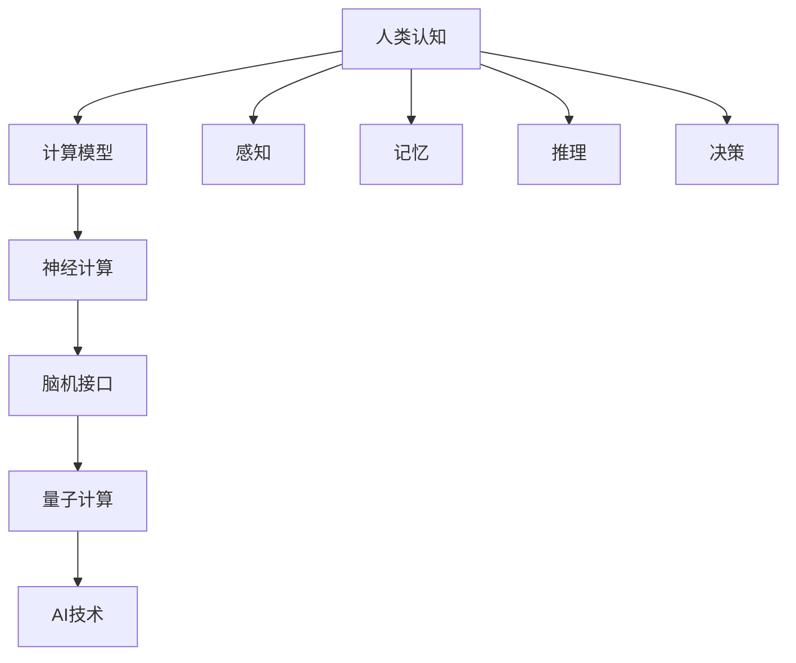

                 

# 人类计算：探索人类认知的边界

> 关键词：人类计算, 认知科学, 脑机接口, 人工智能, 未来科技

## 1. 背景介绍

在数字化时代，计算机技术的飞速发展几乎渗透到了人类生活的方方面面。我们日常使用的手机、电脑、互联网、各种应用程序，甚至智慧家居系统，都是依赖于计算机技术的强大支持。但人们是否意识到，计算机只是人类认知能力的延伸，而不是取代。本章节将带你回顾人类计算的起源与进化，探究计算机与人脑的共生关系。

### 1.1 人类计算的起源与演化

人类计算的起源可以追溯到最早期的石头和结绳记事。古代人通过记录、刻画、计算等物理手段，累积了最早的算法和计算思维。随着数学的出现和符号化，人类的计算方式逐渐演化。特别是在工业革命后，蒸汽机、电气计算器的出现，以及20世纪的计算机时代，更是彻底改变了人类的生产和生活方式。

### 1.2 计算的现实意义

计算机技术的快速发展，带来了人类生产力的巨大提升。从最初单纯的数字计算，到如今的图形处理、智能交互、自主决策，计算机已经深刻影响着人类社会的各个层面。同时，计算机的普及也带来了数据爆炸、隐私泄露等问题，需要更加深入的计算理论和技术来应对。

### 1.3 未来科技愿景

展望未来，随着量子计算、神经计算等新兴计算范式的兴起，人类计算能力有望进一步提升。未来计算的形态，不仅仅是依赖于硬件和算法，还将与人类认知、感知和决策机制深度结合，形成更加智能、自适应、人机协同的新计算体系。

## 2. 核心概念与联系

### 2.1 核心概念概述

人类计算的本质是通过计算模型模拟人类认知过程，实现智能化的信息处理和决策。以下几组核心概念构成了人类计算的理论基础：

- **人类认知与计算模型**：人类认知由感知、记忆、推理、决策等模块构成，而计算模型则通过符号、数字、逻辑等手段模拟这些模块。
- **脑机接口与神经计算**：脑机接口技术将人脑信号转化为机器指令，实现人脑与计算机的直接交互。神经计算则是模仿人脑神经元结构，实现高效、分布式的数据处理。
- **量子计算与计算范式**：量子计算利用量子叠加、量子纠缠等特性，有望突破经典计算的极限，带来全新的计算能力。
- **AI与认知增强**：人工智能技术通过模拟人类认知，实现自动化、智能化计算，进一步增强人类计算能力。

### 2.2 核心概念联系的Mermaid流程图



这个流程图展示了人类认知与计算模型、脑机接口、神经计算、量子计算和AI技术之间的关系，其中人类认知的各个组成部分通过不同计算模型实现人机协同。

## 3. 核心算法原理 & 具体操作步骤

### 3.1 算法原理概述

人类计算的核心算法原理主要体现在以下几个方面：

- **符号计算**：利用符号语言（如逻辑表达式、数学公式）进行精确计算，适用于结构化问题求解。
- **数值计算**：通过数值方法（如数值积分、数值解方程）处理非结构化问题。
- **概率计算**：基于概率模型（如贝叶斯网络、马尔可夫链）处理不确定性问题，适用于复杂的推理和预测任务。
- **模拟与仿真**：使用仿真模型（如虚拟实验、虚拟环境）进行复杂系统的分析与设计。

### 3.2 算法步骤详解

以符号计算为例，人类计算的符号计算算法大致分为以下几个步骤：

1. **定义问题**：明确问题结构，将现实问题转化为符号表达式。
2. **建立符号模型**：使用符号语言描述问题的解空间，进行符号操作。
3. **求解与验证**：通过算法求解模型，验证解的正确性和完备性。
4. **应用与优化**：将求解结果应用于实际问题，进行模型优化和改进。

### 3.3 算法优缺点

- **优点**：
  - **精确性**：符号计算可以处理精确的数学表达式，避免数值误差。
  - **通用性**：符号计算不依赖于特定数据类型，可以处理各种问题。
  - **可解释性**：符号计算结果可解释性强，易于理解与调试。

- **缺点**：
  - **计算复杂度**：符号计算往往涉及复杂的代数运算，计算复杂度较高。
  - **抽象度高**：符号计算依赖于符号表达，抽象度较高，难以直接应用于实际问题。
  - **数据规模限制**：符号计算难以处理大规模数据集。

### 3.4 算法应用领域

符号计算广泛应用于数学、物理、工程、计算机科学等多个领域，例如：

- **数学领域**：用于解析几何、微积分、数论等问题的求解。
- **物理领域**：用于复杂的物理方程求解，如爱因斯坦场方程。
- **工程领域**：用于控制系统设计、信号处理、电路分析等。
- **计算机科学**：用于算法设计和理论研究，如自动定理证明。

## 4. 数学模型和公式 & 详细讲解

### 4.1 数学模型构建

我们以符号计算中的代数系统为例，建立一个数学模型：

设 $F$ 为符号域，$R$ 为 $F$ 上的关系集，$A \in R$ 为公理集，$T \in R$ 为推理规则集。则代数系统 $\langle F, R, A, T \rangle$ 满足公理 $A$ 和推理规则 $T$，可以进行符号计算。

### 4.2 公式推导过程

以线性方程组的求解为例，推导过程如下：

设线性方程组为 $Ax=b$，其中 $A$ 为系数矩阵，$x$ 为未知数向量，$b$ 为常数向量。通过高斯消元法，可以得到：

1. **消元**：将方程组转化为上三角矩阵形式。
2. **回代**：从上到下逐步回代求解 $x$。

具体推导过程如下：

$$
A = \begin{bmatrix}
a_{11} & a_{12} & a_{13} \\
a_{21} & a_{22} & a_{23} \\
a_{31} & a_{32} & a_{33} 
\end{bmatrix}
$$

设 $u = [a_{11}, a_{12}, a_{13}]^T$，$v = [a_{21}, a_{22}, a_{23}]^T$，则：

$$
\begin{align*}
u &= \begin{bmatrix}
a_{11} \\
a_{21} \\
a_{31}
\end{bmatrix}, \\
v &= \begin{bmatrix}
a_{12} \\
a_{22} \\
a_{32}
\end{bmatrix}, \\
\end{align*}
$$

通过高斯消元，得到 $u$ 的表达式：

$$
\begin{align*}
u &= \begin{bmatrix}
1 & 0 & 0 \\
-a_{21}/a_{11} & 1 & 0 \\
-a_{31}/a_{11} & -a_{32}/a_{11} & 1 
\end{bmatrix} \begin{bmatrix}
a_{11} \\
a_{12} \\
a_{13}
\end{bmatrix} \\
&= \begin{bmatrix}
1 & 0 & 0 \\
0 & 1 & 0 \\
0 & 0 & 1
\end{bmatrix} \begin{bmatrix}
a_{11} \\
a_{12} \\
a_{13}
\end{bmatrix} \\
&= \begin{bmatrix}
a_{11} \\
a_{12} \\
a_{13}
\end{bmatrix}
\end{align*}
$$

通过回代，求解 $x$：

$$
x = \begin{bmatrix}
u_{11} & 0 & 0 \\
0 & u_{22} & 0 \\
0 & 0 & u_{33}
\end{bmatrix}^{-1} \begin{bmatrix}
b_{11} \\
b_{12} \\
b_{13}
\end{bmatrix}
$$

### 4.3 案例分析与讲解

以矩阵乘法为例，讨论其符号计算过程。

设矩阵 $A$ 与 $B$ 的乘积为 $C$，即 $C=AB$，其中：

$$
A = \begin{bmatrix}
a_{11} & a_{12} \\
a_{21} & a_{22}
\end{bmatrix}, \quad
B = \begin{bmatrix}
b_{11} & b_{12} \\
b_{21} & b_{22}
\end{bmatrix}
$$

则 $C$ 的表达式为：

$$
C = \begin{bmatrix}
a_{11}b_{11} + a_{12}b_{21} & a_{11}b_{12} + a_{12}b_{22} \\
a_{21}b_{11} + a_{22}b_{21} & a_{21}b_{12} + a_{22}b_{22}
\end{bmatrix}
$$

通过符号计算，可以推导出 $C$ 的每个元素。在实际应用中，这个计算过程可以用于矩阵分解、图形变换、数字信号处理等领域。

## 5. 项目实践：代码实例和详细解释说明

### 5.1 开发环境搭建

为了进行符号计算，需要搭建Python开发环境，并配置相应的库：

1. 安装Python：从官网下载并安装Python，建议选择3.x版本。
2. 安装Sympy库：使用pip命令安装Sympy库，进行符号计算。

```bash
pip install sympy
```

### 5.2 源代码详细实现

以符号计算矩阵乘法为例，编写Sympy代码：

```python
from sympy import Matrix, symbols

# 定义矩阵A和B
a11, a12, a21, a22 = symbols('a11 a12 a21 a22')
b11, b12, b21, b22 = symbols('b11 b12 b21 b22')

A = Matrix([[a11, a12], [a21, a22]])
B = Matrix([[b11, b12], [b21, b22]])

# 计算矩阵乘积C
C = A * B

# 输出C的表达式
print(C)
```

运行代码，得到矩阵乘积C的表达式：

$$
C = \begin{bmatrix}
a_{11}b_{11} + a_{12}b_{21} & a_{11}b_{12} + a_{12}b_{22} \\
a_{21}b_{11} + a_{22}b_{21} & a_{21}b_{12} + a_{22}b_{22}
\end{bmatrix}
$$

### 5.3 代码解读与分析

**Sympy库的使用**：
Sympy是Python的符号计算库，可以处理符号变量、表达式、方程、矩阵等复杂计算。在编写符号计算代码时，需要注意变量名、函数名等命名规范。

**矩阵乘法的计算**：
通过定义矩阵A和B，并使用Sympy的`Matrix`类，可以方便地进行矩阵乘法计算。具体过程为：
1. 创建符号变量
2. 定义矩阵A和B
3. 使用`*`运算符计算矩阵乘积
4. 输出计算结果

## 6. 实际应用场景

### 6.1 工业自动化

工业自动化是符号计算的重要应用场景之一。通过符号计算，可以模拟和优化生产流程，实现自动化控制。

例如，在机械加工中，利用符号计算模型可以模拟机床的加工过程，优化加工参数。在电气工程中，利用符号计算可以进行电路分析、信号处理等。

### 6.2 人工智能与机器学习

符号计算在人工智能与机器学习中也具有重要应用。例如，通过符号计算可以优化神经网络结构，进行知识图谱构建和推理，提升机器学习模型的性能。

### 6.3 医药与生命科学

符号计算在医药与生命科学中也有广泛应用。通过符号计算，可以模拟生物化学反应、分析基因序列、预测药物效果等。

### 6.4 未来应用展望

展望未来，符号计算将在以下方面进一步拓展其应用：

1. **量子计算**：利用符号计算模拟量子计算模型，提升量子计算的效率和准确性。
2. **脑机接口**：通过符号计算建立人脑信号与计算机指令的映射关系，实现更高效、更智能的脑机交互。
3. **多模态计算**：将符号计算与其他计算范式（如神经计算、量子计算）结合，实现更复杂、更全面的计算模型。
4. **认知增强**：利用符号计算提升人类的认知能力，增强逻辑推理、知识管理等能力。

## 7. 工具和资源推荐

### 7.1 学习资源推荐

为了系统掌握符号计算，以下是一些推荐的学习资源：

1. 《符号计算基础》：一本系统讲解符号计算原理与应用的书籍，适合初学者学习。
2. 《Python与Sympy》：讲解如何使用Python和Sympy进行符号计算，适合Python开发者学习。
3. 《符号计算与数学软件》：介绍常见符号计算软件（如Mathematica、Maple）的使用方法，适合进阶学习。
4. 《Symbolic Computation for Engineers》：一本面向工程学家的符号计算教程，讲解符号计算在工程领域的应用。

### 7.2 开发工具推荐

为了提高符号计算的效率，以下是一些推荐的工具：

1. Python语言：Python具有强大的符号计算能力，且生态系统丰富，是符号计算的首选语言。
2. Sympy库：Sympy是Python的符号计算库，支持符号变量、表达式、方程、矩阵等复杂计算。
3. Mathematica软件：Mathematica是商业级别的符号计算软件，支持符号计算、数值计算、可视化等多种功能。
4. Maple软件：Maple是另一种商业级别的符号计算软件，具有强大的符号计算和绘图功能。

### 7.3 相关论文推荐

为了深入理解符号计算的最新进展，以下是一些推荐的研究论文：

1. "Computational Logic and Reasoning"：一篇关于计算逻辑和推理的综述性文章，介绍了符号计算的基本原理和应用。
2. "Symbolic and Numerical Computation"：一篇关于符号计算和数值计算的对比分析文章，讨论了两种计算范式的优缺点和应用场景。
3. "The Power of Symbolic Computation"：一篇关于符号计算的案例分析文章，展示了符号计算在多个领域的应用实例。

## 8. 总结：未来发展趋势与挑战

### 8.1 研究成果总结

符号计算作为人类计算的重要手段，已在数学、物理、工程、计算机科学等多个领域得到广泛应用。未来，符号计算将进一步提升其计算能力，拓展其应用范围，与新兴计算范式（如神经计算、量子计算）结合，实现更加智能、高效、自适应的计算体系。

### 8.2 未来发展趋势

未来，符号计算的发展趋势如下：

1. **量子计算与符号计算结合**：利用符号计算模型模拟量子计算，提升量子计算的效率和准确性。
2. **脑机接口与符号计算结合**：通过符号计算建立人脑信号与计算机指令的映射关系，实现更高效、更智能的脑机交互。
3. **多模态计算**：将符号计算与其他计算范式（如神经计算、量子计算）结合，实现更复杂、更全面的计算模型。
4. **认知增强**：利用符号计算提升人类的认知能力，增强逻辑推理、知识管理等能力。

### 8.3 面临的挑战

尽管符号计算具有广泛的应用前景，但在发展过程中也面临以下挑战：

1. **计算复杂度**：符号计算涉及复杂的代数运算，计算复杂度较高，需要优化算法以提高计算效率。
2. **数据规模限制**：符号计算难以处理大规模数据集，需要探索新的计算范式来应对数据量不断增长的趋势。
3. **跨学科挑战**：符号计算需要与其他学科领域（如神经科学、量子物理）结合，实现跨学科协作。
4. **应用瓶颈**：符号计算难以直接应用于实际问题，需要探索新的应用场景和方法。

### 8.4 研究展望

未来，符号计算的研究方向如下：

1. **优化算法**：探索高效的符号计算算法，优化计算效率，提高计算速度。
2. **跨学科融合**：促进符号计算与其他学科领域的融合，探索新的计算范式和方法。
3. **应用拓展**：探索符号计算在更多领域的应用场景，提升其在实际问题中的适应性和实用性。
4. **人机协同**：探索符号计算与人类认知的协同机制，实现更加智能、自适应的计算体系。

## 9. 附录：常见问题与解答

### Q1：什么是符号计算？

A：符号计算（Symbolic Computation）是一种基于符号语言（如逻辑表达式、数学公式）的计算方法，与数值计算（Numerical Computation）相对。符号计算不依赖于具体的数值数据，而是通过符号变量和运算符进行精确计算，适用于解析几何、微积分、数论等问题的求解。

### Q2：符号计算与数值计算的区别是什么？

A：符号计算与数值计算的区别在于：符号计算不依赖于具体的数值数据，通过符号变量和运算符进行精确计算，适用于解析几何、微积分、数论等问题的求解；数值计算则通过具体的数值数据进行计算，适用于复杂的数值计算和模拟。

### Q3：符号计算的优缺点有哪些？

A：符号计算的优点包括精确性、通用性和可解释性。精确性指符号计算可以处理精确的数学表达式，避免数值误差；通用性指符号计算不依赖于特定数据类型，可以处理各种问题；可解释性指符号计算结果可解释性强，易于理解与调试。缺点包括计算复杂度高、抽象度高和数据规模限制。

### Q4：符号计算有哪些应用？

A：符号计算广泛应用于数学、物理、工程、计算机科学等多个领域，例如数学领域的解析几何、微积分、数论等问题的求解，物理领域的复杂物理方程求解，工程领域的控制系统设计、信号处理、电路分析等。

### Q5：符号计算的未来发展方向是什么？

A：符号计算的未来发展方向包括量子计算与符号计算结合、脑机接口与符号计算结合、多模态计算和认知增强。这些方向将进一步提升符号计算的计算能力，拓展其应用范围，与新兴计算范式结合，实现更加智能、高效、自适应的计算体系。

