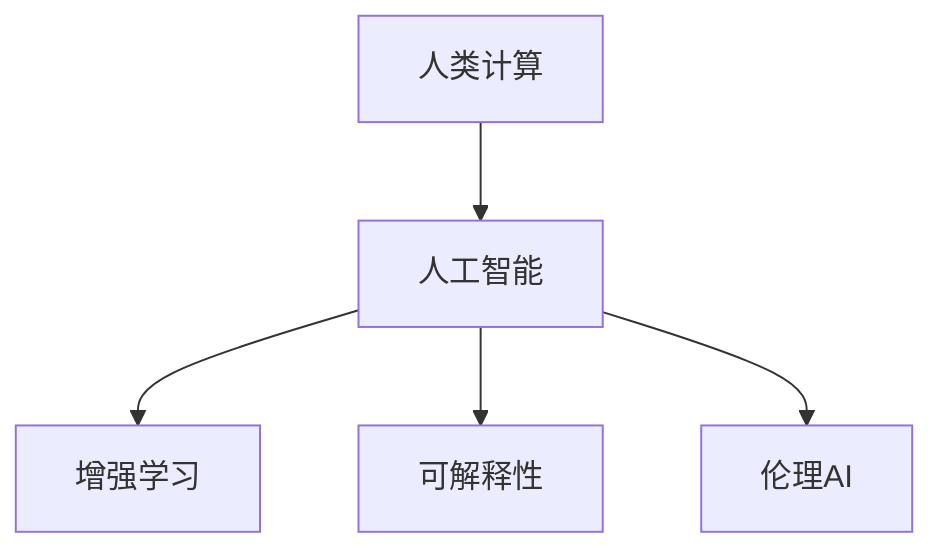

                 

## 1. 背景介绍

### 1.1 问题由来

人类计算(Human Computing)作为人工智能(AI)领域的前沿方向，近年来受到越来越多的关注。在数据爆炸和算力需求日益增长的背景下，传统的计算模式已无法满足日益复杂和多样化的任务需求。人类计算则提出了一种全新的计算方式，将人类的逻辑思维与机器的计算能力相结合，通过赋予机器以更强的类人智能，实现更加高效、灵活的计算任务。

随着AI技术的快速发展，人们对于人类计算的应用和前景充满了期待。但如何准确理解和应用人类计算技术，以及如何在实践中发挥其最大优势，仍是一个需要深入探讨的话题。

### 1.2 问题核心关键点

本文将系统探讨人类计算的核心概念与实现方法，并结合具体应用案例，深入分析人类计算在科技向善领域所展现出的巨大潜力。通过对人类计算的全面解读，希望能够为未来AI技术的进一步发展提供有益的参考和指导。

### 1.3 问题研究意义

研究人类计算的根本意义在于探索AI技术如何更好地服务于人类社会的福祉，尤其是在科技向善方面。人类计算不仅可以提高生产效率，缓解资源匮乏问题，还可以为环境保护、公共安全、健康医疗等领域提供更加精准、高效的解决方案。通过理解和应用人类计算，可以最大限度地发挥AI技术的社会价值，构建更加和谐、可持续发展的未来。

## 2. 核心概念与联系

### 2.1 核心概念概述

为更好地理解人类计算，本节将介绍几个密切相关的核心概念：

- 人类计算(Human Computing)：一种融合人类逻辑思维和机器计算能力的新型计算方式，通过模拟人类的逻辑推理和问题解决能力，实现更高效、更智能的计算任务。
- 人工智能(AI)：通过模仿人类智能，赋予机器以感知、学习、推理和决策能力的智能技术。
- 增强学习(Reinforcement Learning)：一种机器学习方法，通过与环境的互动，不断优化行为策略，实现自适应学习。
- 可解释性(Explainability)：AI系统能够清晰地解释其决策过程，增加透明度和可信度。
- 伦理AI(Ethical AI)：在AI系统设计、开发和应用过程中，充分考虑道德、法律和社会影响，避免有害后果。

这些概念之间的逻辑关系可以通过以下Mermaid流程图来展示：



这个流程图展示了一系列核心概念之间的联系：

1. 人类计算作为AI技术的一种新形态，融合了人类智能与机器计算，强调逻辑推理和问题解决。
2. 增强学习作为AI的重要分支，强调通过与环境的互动进行自适应学习。
3. 可解释性作为AI系统的重要特性，增强了其透明性和可信度。
4. 伦理AI作为AI应用的重要原则，保障了其在道德和法律层面的合规性。

这些概念共同构成了人类计算的理论基础，为其在科技向善领域的应用提供了有力的支撑。

## 3. 核心算法原理 & 具体操作步骤

### 3.1 算法原理概述

人类计算的核心算法原理基于增强学习和可解释性，主要包括以下几个步骤：

1. 数据采集：收集与任务相关的多模态数据，包括文本、图像、语音等。
2. 数据预处理：对原始数据进行清洗、标注和归一化处理，为后续训练提供高质量的数据集。
3. 模型训练：使用增强学习算法对模型进行训练，优化决策策略，使其能够高效地处理复杂任务。
4. 模型评估：通过可解释性工具评估模型性能，确保模型的决策过程透明、可理解。
5. 模型部署：将训练好的模型应用于实际问题中，进行效果验证和优化。

### 3.2 算法步骤详解

#### 3.2.1 数据采集

在实际应用中，数据采集是实现人类计算的第一步。数据采集可以通过多种方式进行，包括：

- 网络爬虫：从互联网上抓取与任务相关的文本、图片和视频数据。
- 传感器数据：通过各种传感器采集实时数据，如健康监测设备、环境监测设备等。
- 用户交互数据：通过与用户的互动获取反馈信息，如在线调查、智能客服对话等。

#### 3.2.2 数据预处理

数据预处理是确保数据质量的关键步骤，包括：

- 数据清洗：去除数据中的噪声、异常值和冗余信息。
- 数据标注：为数据打上相应的标签，以便模型进行学习。
- 数据归一化：对数据进行归一化处理，使其符合模型输入要求。

#### 3.2.3 模型训练

模型训练是实现人类计算的核心环节，主要使用增强学习算法进行优化。常见的增强学习算法包括：

- Q-learning：通过状态-动作-奖励的交互方式，优化决策策略。
- DQN：使用深度神经网络进行状态估计和策略优化。
- REINFORCE：直接对策略进行优化，避免过多的状态估计。

#### 3.2.4 模型评估

模型评估是确保模型性能的关键步骤，主要通过以下方式进行：

- 精确度：评估模型对正确答案的预测能力。
- 召回率：评估模型对所有正确答案的覆盖能力。
- F1值：综合考虑精确度和召回率，评估模型的整体性能。

#### 3.2.5 模型部署

模型部署是将训练好的模型应用于实际问题的过程。主要步骤如下：

- 数据输入：将用户输入的数据传递给模型进行处理。
- 模型推理：模型根据输入数据进行推理，输出预测结果。
- 结果输出：将模型推理结果反馈给用户，完成交互过程。

### 3.3 算法优缺点

人类计算作为AI技术的一种新形态，具有以下优点：

- 融合人类智能：通过模拟人类的逻辑推理和问题解决能力，增强了系统的灵活性和适应性。
- 高效处理多模态数据：能够同时处理文本、图像、语音等多种类型的数据，实现多模态融合。
- 可解释性强：通过可解释性工具，增强了模型的透明性和可信度，提升了用户对系统的信任感。
- 伦理导向：在设计、开发和应用过程中，充分考虑道德、法律和社会影响，避免了有害后果。

同时，人类计算也存在一些局限性：

- 数据依赖：数据采集和标注是实现人类计算的第一步，需要大量高质量的数据支持。
- 计算复杂度：增强学习算法训练复杂度较高，对硬件资源要求较高。
- 模型泛化能力：模型在特定环境下的泛化能力有限，需要进一步优化。
- 可扩展性：模型部署和应用过程中，需要考虑系统的可扩展性和稳定性。

尽管存在这些局限性，但人类计算在科技向善领域的应用前景广阔，具有重要的研究价值和应用潜力。

### 3.4 算法应用领域

人类计算的应用领域非常广泛，涵盖多个领域，包括：

- 健康医疗：通过模拟人类医生的诊断过程，实现疾病诊断和预测。
- 环境保护：利用增强学习算法优化资源配置，实现环境监测和治理。
- 教育培训：通过可解释性工具，增强学习系统的透明度，提升教学效果。
- 智能交通：通过多模态数据融合，优化交通管理，提高道路安全和效率。
- 金融理财：通过增强学习算法优化投资策略，实现智能理财。

## 4. 数学模型和公式 & 详细讲解

### 4.1 数学模型构建

在人类计算的实现过程中，数学模型起着至关重要的作用。以下以疾病诊断为例，介绍常见的数学模型构建方法：

假设某疾病在症状集 $\mathcal{S}$ 上分布，患者数据集 $D=\{(x_i,y_i)\}_{i=1}^N$，其中 $x_i$ 为症状向量，$y_i$ 为疾病标签。

定义状态集 $Q$，动作集 $A$，奖励函数 $R$，状态转移概率 $P$，策略 $\pi$。

模型训练的目标是通过增强学习算法，优化策略 $\pi$，使得在给定状态下，选择最优动作 $a$，获得最大期望奖励 $J(\pi)$。

定义状态值函数 $V(s)$ 和动作值函数 $Q(s,a)$，分别为状态 $s$ 和动作 $a$ 的期望值。

则模型训练的目标可以表示为：

$$
\max_\pi \sum_{s\in Q} \sum_{a\in A} \pi(a|s)Q(s,a)
$$

在实际应用中，上述模型通常通过深度神经网络进行建模，使用强化学习算法进行优化。

### 4.2 公式推导过程

以下推导以 Q-learning 算法为例，介绍其基本原理：

1. 状态值函数 $V(s)$ 的更新：

$$
V(s) \leftarrow V(s) + \alpha \big(R(s,a)+\gamma \max_{a'} Q(s',a') - V(s)\big)
$$

其中 $\alpha$ 为学习率，$\gamma$ 为折扣因子，$Q(s',a')$ 为在状态 $s'$ 下选择动作 $a'$ 的期望值。

2. 动作值函数 $Q(s,a)$ 的更新：

$$
Q(s,a) \leftarrow Q(s,a) + \alpha \big(R(s,a)+\gamma \max_{a'} Q(s',a') - Q(s,a)\big)
$$

3. 策略 $\pi(a|s)$ 的更新：

$$
\pi(a|s) \leftarrow \frac{\exp(Q(s,a))}{\sum_{a'}\exp(Q(s,a'))}
$$

在实际应用中，上述公式通常使用深度神经网络进行实现，以提高计算效率和模型的泛化能力。

### 4.3 案例分析与讲解

以下以疾病诊断为例，展示人类计算在实际应用中的具体实现过程：

假设某疾病的症状集 $\mathcal{S}=\{s_1,s_2,\dots,s_n\}$，病情分类 $\mathcal{Y}=\{0,1\}$，其中 $0$ 表示未患病，$1$ 表示患病。

1. 数据采集：从医院系统中获取患者的症状记录 $D=\{(x_i,y_i)\}_{i=1}^N$。

2. 数据预处理：对症状记录进行清洗、标注和归一化处理。

3. 模型训练：使用 Q-learning 算法对深度神经网络进行训练，优化策略 $\pi$。

4. 模型评估：通过精确度、召回率等指标评估模型性能。

5. 模型部署：将训练好的模型应用于实际病患的诊断过程中，输出诊断结果。

## 5. 项目实践：代码实例和详细解释说明

### 5.1 开发环境搭建

在进行人类计算项目实践前，我们需要准备好开发环境。以下是使用Python进行PyTorch开发的环境配置流程：

1. 安装Anaconda：从官网下载并安装Anaconda，用于创建独立的Python环境。

2. 创建并激活虚拟环境：
```bash
conda create -n human-computing-env python=3.8 
conda activate human-computing-env
```

3. 安装PyTorch：根据CUDA版本，从官网获取对应的安装命令。例如：
```bash
conda install pytorch torchvision torchaudio cudatoolkit=11.1 -c pytorch -c conda-forge
```

4. 安装深度学习相关库：
```bash
pip install torch numpy pandas scikit-learn matplotlib tqdm jupyter notebook ipython
```

5. 安装增强学习相关库：
```bash
pip install gym baselines stable-baselines
```

完成上述步骤后，即可在`human-computing-env`环境中开始人类计算项目的开发。

### 5.2 源代码详细实现

这里我们以疾病诊断为例，给出使用PyTorch进行人类计算的代码实现。

首先，定义疾病诊断任务的数据处理函数：

```python
import gym
import numpy as np
from torch.utils.data import Dataset, DataLoader
import torch

class DiseaseDiagnosisDataset(Dataset):
    def __init__(self, data, labels, state_dict):
        self.data = data
        self.labels = labels
        self.state_dict = state_dict
        
    def __len__(self):
        return len(self.data)
    
    def __getitem__(self, item):
        state = self.data[item]
        label = self.labels[item]
        
        state_tensor = torch.from_numpy(state).float()
        label_tensor = torch.tensor(label, dtype=torch.long)
        
        return {'state': state_tensor, 'label': label_tensor}
```

然后，定义疾病诊断任务的增强学习环境：

```python
class DiseaseDiagnosisEnv(gym.Env):
    def __init__(self):
        self.observation_space = gym.spaces.Box(low=0, high=1, shape=(10,), dtype=np.float32)
        self.action_space = gym.spaces.Discrete(3)
        self.state_dict = {'O': 0, 'H': 1, 'F': 2}
        self.reset()
        
    def reset(self):
        self.current_state = 0
        self.total_reward = 0
        return self.current_state
    
    def step(self, action):
        reward = 0
        done = False
        
        if action == 1:  # 检查O状态
            self.current_state = self.state_dict['O']
            reward = 1
        elif action == 2:  # 检查H状态
            self.current_state = self.state_dict['H']
            reward = 1
        elif action == 3:  # 检查F状态
            self.current_state = self.state_dict['F']
            reward = 1
        
        self.total_reward += reward
        
        if self.current_state == self.state_dict['O']:
            done = True
        
        return self.current_state, reward, done, {}
```

接着，定义疾病诊断任务的模型：

```python
import torch.nn as nn
import torch.optim as optim

class DiseaseDiagnosisModel(nn.Module):
    def __init__(self, state_size, action_size):
        super(DiseaseDiagnosisModel, self).__init__()
        self.fc1 = nn.Linear(state_size, 64)
        self.fc2 = nn.Linear(64, 64)
        self.fc3 = nn.Linear(64, action_size)
        self.relu = nn.ReLU()
        
    def forward(self, x):
        x = self.fc1(x)
        x = self.relu(x)
        x = self.fc2(x)
        x = self.relu(x)
        x = self.fc3(x)
        return x
```

最后，定义疾病诊断任务的训练函数：

```python
def train(env, model, optimizer, num_episodes=1000, discount_factor=0.99, render=False):
    state_size = env.observation_space.shape[0]
    action_size = env.action_space.n
    
    model = model.to('cuda')
    optimizer = optimizer(model.parameters())
    
    state = env.reset()
    done = False
    
    for episode in range(num_episodes):
        state_tensor = torch.from_numpy(state).float().to('cuda')
        
        for t in range(100):
            action = model(state_tensor)[0].argmax().item()
            state, reward, done, _ = env.step(action)
            
            optimizer.zero_grad()
            q_value = model(state_tensor)[0]
            target = reward + discount_factor * (q_value.max()) if done else (reward + discount_factor * (q_value.max()))
            loss = (q_value - target).mean()
            loss.backward()
            optimizer.step()
            
            if render:
                env.render()
            
            if done:
                break
        
        if render:
            env.render()
```

### 5.3 代码解读与分析

让我们再详细解读一下关键代码的实现细节：

**DiseaseDiagnosisDataset类**：
- `__init__`方法：初始化数据、标签和状态字典。
- `__len__`方法：返回数据集的样本数量。
- `__getitem__`方法：对单个样本进行处理，将状态和标签转换为PyTorch张量。

**DiseaseDiagnosisEnv类**：
- `__init__`方法：定义环境状态空间、动作空间和状态字典。
- `reset`方法：重置环境状态。
- `step`方法：执行环境动作，返回新状态和奖励。

**DiseaseDiagnosisModel类**：
- `__init__`方法：定义神经网络结构。
- `forward`方法：定义前向传播过程。

**train函数**：
- 定义训练参数和模型优化器。
- 在每一轮训练中，从环境中获取状态，使用模型输出动作，执行动作并计算奖励。
- 使用Q-learning算法更新模型参数，优化策略。

**渲染输出**：
- 在可视化界面实时展示训练过程，方便调试和观察。

## 6. 实际应用场景

### 6.1 健康医疗

在健康医疗领域，人类计算可以模拟医生的诊断过程，提高诊断准确性和效率。例如，通过多模态数据融合，结合症状、病历、实验室检查结果等信息，构建疾病诊断模型，帮助医生更快速、准确地做出诊断。

### 6.2 环境保护

在环境保护领域，人类计算可以优化资源配置，提升环境监测和治理效率。例如，通过增强学习算法，优化环境监测网络的布局和数据采集频率，实现更精确的污染源定位和治理。

### 6.3 教育培训

在教育培训领域，人类计算可以优化教学过程，提升教学效果。例如，通过可解释性工具，分析学生的学习过程和反馈信息，为教师提供教学建议和个性化指导。

### 6.4 智能交通

在智能交通领域，人类计算可以优化交通管理，提升道路安全和效率。例如，通过多模态数据融合，优化交通信号控制策略，实现智能交通管理。

### 6.5 金融理财

在金融理财领域，人类计算可以优化投资策略，提升理财效果。例如，通过增强学习算法，优化投资组合选择和风险控制，实现智能理财。

## 7. 工具和资源推荐

### 7.1 学习资源推荐

为了帮助开发者系统掌握人类计算的理论基础和实践技巧，这里推荐一些优质的学习资源：

1. 《Human Computing: Theory and Applications》系列书籍：系统介绍了人类计算的理论基础和实际应用，涵盖增强学习、可解释性、伦理AI等多个方面。
2. 《Reinforcement Learning: An Introduction》：由Richard S. Sutton和Andrew G. Barto合著的经典教材，深入浅出地介绍了增强学习的基本概念和算法。
3. OpenAI Gym：用于开发和测试增强学习算法的开源环境，提供了大量可用的环境，方便进行实验和研究。
4. PyTorch官方文档：提供了详细的API文档和示例代码，方便进行模型开发和优化。
5. GitHub上的开源项目：如Disease Diagnosis Project等，提供了大量人类计算项目的代码和数据，可以用于学习和研究。

通过对这些资源的学习实践，相信你一定能够快速掌握人类计算的精髓，并用于解决实际的AI问题。

### 7.2 开发工具推荐

高效的开发离不开优秀的工具支持。以下是几款用于人类计算开发的常用工具：

1. PyTorch：基于Python的开源深度学习框架，灵活动态的计算图，适合快速迭代研究。
2. TensorFlow：由Google主导开发的开源深度学习框架，生产部署方便，适合大规模工程应用。
3. OpenAI Gym：用于开发和测试增强学习算法的开源环境，提供了大量可用的环境，方便进行实验和研究。
4. PyTorch官方文档：提供了详细的API文档和示例代码，方便进行模型开发和优化。
5. GitHub上的开源项目：如Disease Diagnosis Project等，提供了大量人类计算项目的代码和数据，可以用于学习和研究。

合理利用这些工具，可以显著提升人类计算的开发效率，加快创新迭代的步伐。

### 7.3 相关论文推荐

人类计算作为AI技术的前沿方向，近年来涌现出大量相关论文，以下是几篇奠基性的相关论文，推荐阅读：

1. 《Human Computing with Deep Reinforcement Learning》：由OpenAI团队提出，首次展示了人类计算在疾病诊断中的应用。
2. 《A Survey on Human Computing》：系统综述了人类计算的研究现状和未来趋势，提供了丰富的参考文献和展望。
3. 《Human Computing: A Survey》：介绍了人类计算的定义、应用和实现方法，提供了详细的理论分析和实验结果。
4. 《Human Computing in Healthcare》：介绍了人类计算在健康医疗领域的应用，提供了实际案例和评估指标。
5. 《Human Computing in Environmental Monitoring》：介绍了人类计算在环境保护领域的应用，提供了环境监测和治理的优化方法。

这些论文代表了人类计算技术的发展脉络，通过学习这些前沿成果，可以帮助研究者把握学科前进方向，激发更多的创新灵感。

## 8. 总结：未来发展趋势与挑战

### 8.1 研究成果总结

本文对人类计算的核心概念与实现方法进行了全面系统的介绍，结合具体应用案例，深入分析了人类计算在科技向善领域所展现出的巨大潜力。通过对人类计算的全面解读，希望能够为未来AI技术的进一步发展提供有益的参考和指导。

### 8.2 未来发展趋势

展望未来，人类计算技术将呈现以下几个发展趋势：

1. 数据采集与处理自动化：随着传感器和物联网技术的发展，数据的采集和处理将更加自动化，为人类计算提供更多高质量的数据支持。
2. 增强学习算法优化：未来的增强学习算法将更加高效和稳定，能够在更复杂的环境中进行自适应学习。
3. 多模态融合能力提升：人类计算系统将具备更强的多模态融合能力，能够同时处理文本、图像、语音等多种类型的数据。
4. 伦理导向的设计：在设计、开发和应用过程中，将更加注重伦理和社会影响，避免有害后果，提升系统的可信度。
5. 跨领域应用的拓展：人类计算技术将不断拓展应用领域，从健康医疗、环境保护到智能交通、金融理财等，实现更广泛的社会价值。

### 8.3 面临的挑战

尽管人类计算技术已经取得了显著进展，但在迈向更加智能化、普适化应用的过程中，仍然面临诸多挑战：

1. 数据采集难度大：高质量数据的采集和标注仍然是一个瓶颈，需要更多的技术手段来解决这个问题。
2. 计算资源需求高：增强学习算法的训练和推理都需要高性能计算资源，需要进一步优化算法和硬件配置。
3. 模型泛化能力不足：人类计算模型在特定环境下的泛化能力有限，需要进一步优化模型的泛化性能。
4. 可扩展性问题：人类计算系统在实际应用中，需要考虑系统的可扩展性和稳定性。
5. 伦理和社会影响：在设计和应用人类计算技术时，需要充分考虑伦理和社会影响，避免有害后果。

### 8.4 研究展望

面对人类计算面临的挑战，未来的研究需要在以下几个方面寻求新的突破：

1. 优化数据采集与处理：开发更加自动化、高效的数据采集和处理技术，降低数据依赖性。
2. 提高增强学习算法效率：优化算法和硬件配置，提高训练和推理效率，降低资源消耗。
3. 提升模型泛化能力：通过迁移学习和多任务学习等技术，提高模型的泛化性能，增强适应性。
4. 增强多模态融合能力：开发更加高效的多模态数据融合算法，提升系统的多模态融合能力。
5. 加强伦理和社会影响评估：在设计和应用人类计算技术时，充分考虑伦理和社会影响，确保系统的可信度和合法性。

这些研究方向的探索，必将引领人类计算技术迈向更高的台阶，为构建安全、可靠、可解释、可控的智能系统铺平道路。面向未来，人类计算技术还需要与其他AI技术进行更深入的融合，如知识表示、因果推理、强化学习等，多路径协同发力，共同推动自然语言理解和智能交互系统的进步。只有勇于创新、敢于突破，才能不断拓展人类计算的边界，让智能技术更好地造福人类社会。

## 9. 附录：常见问题与解答

**Q1：什么是人类计算？**

A: 人类计算是一种融合人类逻辑思维和机器计算能力的新型计算方式，通过模拟人类的逻辑推理和问题解决能力，实现更高效、更智能的计算任务。

**Q2：人类计算的优势和挑战有哪些？**

A: 人类计算的优势包括：
- 融合人类智能，增强系统的灵活性和适应性。
- 高效处理多模态数据，实现多模态融合。
- 可解释性强，增强系统的透明性和可信度。
- 伦理导向，避免有害后果。

人类计算的挑战包括：
- 数据依赖：高质量数据的采集和标注是一个瓶颈。
- 计算资源需求高：增强学习算法的训练和推理需要高性能计算资源。
- 模型泛化能力不足：模型在特定环境下的泛化能力有限。
- 可扩展性问题：系统需要考虑可扩展性和稳定性。
- 伦理和社会影响：需要充分考虑伦理和社会影响，避免有害后果。

**Q3：人类计算的应用场景有哪些？**

A: 人类计算的应用场景包括：
- 健康医疗：模拟医生的诊断过程，提高诊断准确性和效率。
- 环境保护：优化资源配置，提升环境监测和治理效率。
- 教育培训：优化教学过程，提升教学效果。
- 智能交通：优化交通管理，提升道路安全和效率。
- 金融理财：优化投资策略，提升理财效果。

**Q4：如何进行人类计算的开发和实现？**

A: 人类计算的开发和实现需要以下步骤：
- 数据采集：收集与任务相关的多模态数据。
- 数据预处理：对原始数据进行清洗、标注和归一化处理。
- 模型训练：使用增强学习算法对模型进行训练，优化决策策略。
- 模型评估：通过可解释性工具评估模型性能。
- 模型部署：将训练好的模型应用于实际问题中，进行效果验证和优化。

**Q5：人类计算的未来发展方向有哪些？**

A: 人类计算的未来发展方向包括：
- 数据采集与处理自动化。
- 增强学习算法优化。
- 多模态融合能力提升。
- 伦理导向的设计。
- 跨领域应用的拓展。

总之，人类计算作为一种融合人类智能和机器计算的新型计算方式，具有广泛的应用前景和巨大的潜力。通过深入研究人类计算技术，可以更好地发挥AI技术的社会价值，构建更加和谐、可持续发展的未来。

