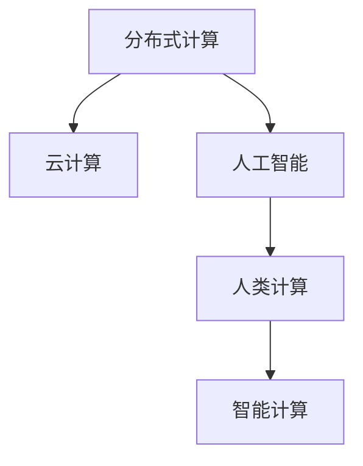

                 

# 人类计算：超越传统众包

> 关键词：人工智能, 众包, 智能计算, 分布式计算, 深度学习, 计算模型, 数据分析

## 1. 背景介绍

### 1.1 问题由来
随着互联网和人工智能技术的发展，人类在处理数据、执行任务等方面的能力被彻底颠覆。尤其是在大数据时代，数据量呈指数级增长，而处理这些数据所需的计算资源和存储空间也变得前所未有的大。传统的集中式计算模式已难以应对这种规模，因此，分布式计算和人类计算成为了新的研究热点。

传统众包模式主要是通过人工标注、数据分析等任务，来获取高质量的数据和处理结果。但随着人工智能技术的成熟，人们开始探索如何利用机器学习算法，在分布式系统中自动完成这些任务，从而实现人类计算的自动化和智能化。

### 1.2 问题核心关键点
人类计算的本质是利用人类智慧和机器智能结合，在分布式计算系统中，自动完成复杂的、大规模的数据处理任务。其关键点包括：
1. 数据分布式存储和处理。通过分布式文件系统和云计算平台，将海量数据分散存储在不同的节点上，实现高效的并行计算。
2. 任务分解与分配。将复杂任务分解为若干子任务，自动分配给不同的计算节点进行处理。
3. 人类智慧与机器智能的结合。在任务执行过程中，利用机器学习算法自动优化任务分配和执行顺序，同时保留人类智慧的判断和监督。

## 2. 核心概念与联系

### 2.1 核心概念概述

为更好地理解人类计算的原理和架构，本节将介绍几个密切相关的核心概念：

- 分布式计算(Distributed Computing)：指将大规模计算任务分布在多个计算节点上进行并行处理的过程。常见的分布式计算框架包括Hadoop、Spark、Flink等。
- 云计算(Cloud Computing)：通过互联网提供可扩展的计算资源，用户按需租用这些资源进行计算。典型的云计算服务提供商包括AWS、Azure、Google Cloud等。
- 人工智能(Artificial Intelligence, AI)：指利用计算机模拟人类智能，实现感知、学习、推理、决策等智能行为。常见的AI技术包括机器学习、深度学习、自然语言处理等。
- 人类计算(Human-in-the-loop)：指在分布式计算系统中，结合人类智慧和机器智能，自动完成复杂任务的过程。常见的人类计算范式包括众包、被动标注、主动学习等。
- 智能计算(Intelligent Computing)：指将人类智慧和机器智能深度结合，自动完成大规模、高复杂度的计算任务。典型应用包括自然语言处理、图像识别、推荐系统等。

这些核心概念之间的逻辑关系可以通过以下Mermaid流程图来展示：



这个流程图展示了各个概念之间的联系：

1. 分布式计算为人工智能提供了高效计算的基础设施，使大规模计算任务成为可能。
2. 云计算通过按需提供计算资源，使得人工智能系统能够轻松扩展，适应不同规模的任务。
3. 人类计算在分布式计算和人工智能的基础上，实现了任务执行的自动化和智能化。
4. 智能计算将人类智慧和机器智能深度结合，提供了高效、智能的计算服务。

这些概念共同构成了人类计算的技术框架，为其在多个领域的应用提供了支撑。

## 3. 核心算法原理 & 具体操作步骤
### 3.1 算法原理概述

人类计算的核心算法原理基于分布式计算和人工智能的结合。其核心思想是：通过自动化的任务分配和执行，结合人类智慧的监督和优化，高效完成大规模、高复杂度的计算任务。

形式化地，假设分布式计算系统由多个节点组成，每个节点有一个任务执行器，任务执行器能够自动分配任务并执行。设任务序列为 $T=\{t_1, t_2, \ldots, t_N\}$，节点 $i$ 的任务执行速度为 $v_i$，任务执行时间为 $t_i$。则人类计算的目标是：

$$
\min_{\{v_i\}} \sum_{i=1}^N v_i \cdot t_i
$$

其中 $\{v_i\}$ 为任务分配给不同节点的执行速度。在优化过程中，还需要引入人类智慧的监督和优化，以确保任务执行的准确性和高效性。

### 3.2 算法步骤详解

人类计算的核心算法步骤包括以下几个关键环节：

**Step 1: 任务分解与分配**
- 将大规模任务分解为若干子任务。每个子任务可以独立执行，便于并行处理。
- 根据每个子任务的大小和复杂度，动态分配给不同的计算节点。
- 在任务分配过程中，考虑到不同节点的计算能力和可用资源，进行负载均衡。

**Step 2: 任务执行与监控**
- 将分解后的任务提交给各个节点执行，每个节点根据自身执行速度和任务复杂度进行计算。
- 在任务执行过程中，利用机器学习算法实时监控任务执行状态，优化任务分配和执行顺序。
- 如果任务执行过程中出现异常或错误，自动回滚并重新分配任务，保证任务执行的准确性。

**Step 3: 人类智慧监督与优化**
- 在任务执行过程中，引入人类智慧的监督，对执行结果进行审核和校验。
- 根据审核结果，利用机器学习算法自动更新任务分配策略，优化任务执行顺序。
- 利用人类智慧的经验和判断，对执行结果进行进一步优化和修正。

**Step 4: 结果汇总与输出**
- 将各个节点计算得到的结果汇总，得到最终的计算结果。
- 对结果进行进一步分析和处理，生成可用的输出数据或报告。
- 将结果输出给用户或系统，完成人类计算任务。

以上是人类计算的核心算法步骤。在实际应用中，还需要针对具体任务的特点，对各个环节进行优化设计，如改进任务分解算法，引入更多监督和优化机制，搜索最优的任务分配策略等，以进一步提升任务执行的效率和准确性。

### 3.3 算法优缺点

人类计算具有以下优点：
1. 高效灵活。自动化的任务分配和执行，结合人类智慧的监督和优化，能够高效完成大规模、高复杂度的计算任务。
2. 适应性强。能够适应不同规模、不同复杂度的任务，灵活调整任务分配策略。
3. 分布式协同。通过分布式计算系统，将任务分散到多个节点上进行并行处理，提高计算效率。
4. 数据协同。能够处理海量数据，实现高效的分布式数据存储和处理。

但同时，该算法也存在一些局限性：
1. 系统复杂度高。需要构建复杂的分布式计算系统，实现任务的自动分配和执行。
2. 任务执行依赖人类智慧。对人类智慧的依赖较大，一旦监督失效，任务执行的准确性和效率将大打折扣。
3. 资源消耗大。分布式计算系统需要占用大量计算资源和存储资源，成本较高。
4. 数据安全和隐私问题。分布式系统中数据存储和传输的安全性问题，需要通过严格的访问控制和安全协议来解决。

尽管存在这些局限性，但就目前而言，人类计算仍是分布式计算和人工智能结合的最新范式，具有广阔的应用前景。未来相关研究的重点在于如何进一步降低系统复杂度，提高任务执行的自动化程度，同时兼顾系统安全性和隐私保护。

### 3.4 算法应用领域

人类计算在多个领域中得到了广泛应用，包括但不限于以下几类：

- 大规模数据分析：通过分布式计算系统处理海量数据，如用户行为分析、社交网络分析、医疗数据挖掘等。
- 自然语言处理：利用分布式计算和人工智能结合，进行文本分类、情感分析、机器翻译等任务。
- 计算机视觉：结合分布式计算和人工智能，进行图像识别、视频分析、目标检测等任务。
- 智能推荐系统：通过分布式计算和人工智能结合，提供个性化的推荐内容，如商品推荐、内容推荐等。
- 自动化任务处理：结合分布式计算和人工智能，实现自动化的任务处理，如图像标注、音频标注、语音转写等。
- 大数据存储和管理：利用分布式计算和人工智能，实现高效的数据存储和管理，如Hadoop、Spark等框架的应用。

除了上述这些应用领域外，人类计算还将进一步拓展到更多场景中，如智慧城市、智能交通、智能制造等，为各行业数字化转型提供新的技术路径。

## 4. 数学模型和公式 & 详细讲解 & 举例说明
### 4.1 数学模型构建

本节将使用数学语言对人类计算的数学模型进行详细构建。

设任务序列为 $T=\{t_1, t_2, \ldots, t_N\}$，每个任务 $t_i$ 的执行时间为 $t_i$，不同节点的计算速度为 $v_i$。设任务 $t_i$ 被分配给节点 $i$ 的概率为 $p_{i,i}$，则任务执行时间的期望为：

$$
E[T] = \sum_{i=1}^N \sum_{j=1}^N p_{i,j} \cdot v_j \cdot t_i
$$

人类计算的目标是最小化任务执行时间的期望 $E[T]$，即：

$$
\min_{\{v_i\},\{p_{i,j}\}} E[T]
$$

在优化过程中，需要引入机器学习算法实时监控任务执行状态，优化任务分配和执行顺序。设任务 $t_i$ 的执行状态为 $s_i$，对应的优化目标为：

$$
\min_{\{v_i\},\{p_{i,j}\}} \sum_{i=1}^N v_i \cdot s_i
$$

其中 $s_i$ 表示任务 $t_i$ 的执行状态，可以通过机器学习算法实时估计。在任务执行过程中，需要引入人类智慧的监督，对执行状态进行审核和校验。设人类监督的审核结果为 $r_i$，对应的优化目标为：

$$
\min_{\{v_i\},\{p_{i,j}\}} \sum_{i=1}^N v_i \cdot r_i
$$

在优化过程中，还需要考虑任务执行的安全性和隐私问题，引入安全协议和隐私保护机制。设任务执行的安全性为 $s_i$，对应的优化目标为：

$$
\min_{\{v_i\},\{p_{i,j}\}} \sum_{i=1}^N v_i \cdot s_i
$$

### 4.2 公式推导过程

以下我们以文本分类任务为例，推导人类计算的优化目标函数及其梯度计算公式。

设文本分类任务的训练集为 $D=\{(x_i, y_i)\}_{i=1}^N$，其中 $x_i$ 为文本，$y_i$ 为标签。设分类器 $M_{\theta}$ 的输出为 $\hat{y}_i$，对应的损失函数为 $\ell(y_i, \hat{y}_i)$。设任务执行状态 $s_i=1$ 表示分类器输出正确，$0$ 表示分类器输出错误。则文本分类的优化目标函数为：

$$
\mathcal{L}(\theta) = \frac{1}{N} \sum_{i=1}^N [\ell(y_i, \hat{y}_i)] \cdot s_i
$$

在优化过程中，需要利用机器学习算法实时估计分类器 $M_{\theta}$ 的输出状态 $s_i$，以及人类监督的审核结果 $r_i$。在任务执行过程中，需要引入分布式计算系统，将文本分类任务分解为多个子任务，分配给不同的计算节点进行处理。设任务 $t_i$ 被分配给节点 $i$ 的概率为 $p_{i,i}$，则任务执行状态的期望为：

$$
E[s_i] = \sum_{j=1}^N p_{i,j} \cdot r_j
$$

在优化过程中，还需要引入安全协议和隐私保护机制，确保任务执行的安全性和隐私性。设任务执行的安全性为 $s_i$，对应的优化目标函数为：

$$
\mathcal{L}(\theta) = \frac{1}{N} \sum_{i=1}^N [\ell(y_i, \hat{y}_i)] \cdot s_i
$$

在得到优化目标函数后，即可带入梯度下降算法进行参数更新，完成模型的迭代优化。重复上述过程直至收敛，最终得到适应下游任务的最优模型参数 $\theta^*$。

## 5. 项目实践：代码实例和详细解释说明
### 5.1 开发环境搭建

在进行人类计算实践前，我们需要准备好开发环境。以下是使用Python进行PyTorch开发的环境配置流程：

1. 安装Anaconda：从官网下载并安装Anaconda，用于创建独立的Python环境。

2. 创建并激活虚拟环境：
```bash
conda create -n human-computing-env python=3.8 
conda activate human-computing-env
```

3. 安装PyTorch：根据CUDA版本，从官网获取对应的安装命令。例如：
```bash
conda install pytorch torchvision torchaudio cudatoolkit=11.1 -c pytorch -c conda-forge
```

4. 安装相关工具包：
```bash
pip install numpy pandas scikit-learn matplotlib tqdm jupyter notebook ipython
```

完成上述步骤后，即可在`human-computing-env`环境中开始人类计算实践。

### 5.2 源代码详细实现

下面我们以文本分类任务为例，给出使用Transformers库进行人类计算的PyTorch代码实现。

首先，定义文本分类任务的数据处理函数：

```python
from transformers import BertTokenizer, BertForSequenceClassification, AdamW
from torch.utils.data import Dataset, DataLoader
import torch

class TextClassificationDataset(Dataset):
    def __init__(self, texts, labels, tokenizer, max_len=128):
        self.texts = texts
        self.labels = labels
        self.tokenizer = tokenizer
        self.max_len = max_len
        
    def __len__(self):
        return len(self.texts)
    
    def __getitem__(self, item):
        text = self.texts[item]
        label = self.labels[item]
        
        encoding = self.tokenizer(text, return_tensors='pt', max_length=self.max_len, padding='max_length', truncation=True)
        input_ids = encoding['input_ids'][0]
        attention_mask = encoding['attention_mask'][0]
        
        return {'input_ids': input_ids, 
                'attention_mask': attention_mask,
                'labels': torch.tensor(label, dtype=torch.long)}
```

然后，定义模型和优化器：

```python
tokenizer = BertTokenizer.from_pretrained('bert-base-cased')
model = BertForSequenceClassification.from_pretrained('bert-base-cased', num_labels=2)
optimizer = AdamW(model.parameters(), lr=2e-5)
```

接着，定义训练和评估函数：

```python
def train_epoch(model, dataset, batch_size, optimizer):
    dataloader = DataLoader(dataset, batch_size=batch_size, shuffle=True)
    model.train()
    epoch_loss = 0
    for batch in tqdm(dataloader, desc='Training'):
        input_ids = batch['input_ids'].to(device)
        attention_mask = batch['attention_mask'].to(device)
        labels = batch['labels'].to(device)
        model.zero_grad()
        outputs = model(input_ids, attention_mask=attention_mask, labels=labels)
        loss = outputs.loss
        epoch_loss += loss.item()
        loss.backward()
        optimizer.step()
    return epoch_loss / len(dataloader)

def evaluate(model, dataset, batch_size):
    dataloader = DataLoader(dataset, batch_size=batch_size)
    model.eval()
    preds, labels = [], []
    with torch.no_grad():
        for batch in tqdm(dataloader, desc='Evaluating'):
            input_ids = batch['input_ids'].to(device)
            attention_mask = batch['attention_mask'].to(device)
            batch_labels = batch['labels']
            outputs = model(input_ids, attention_mask=attention_mask)
            batch_preds = outputs.logits.argmax(dim=1).to('cpu').tolist()
            batch_labels = batch_labels.to('cpu').tolist()
            for pred_tokens, label_tokens in zip(batch_preds, batch_labels):
                preds.append(pred_tokens)
                labels.append(label_tokens)
                
    print(classification_report(labels, preds))
```

最后，启动训练流程并在测试集上评估：

```python
epochs = 5
batch_size = 16

for epoch in range(epochs):
    loss = train_epoch(model, train_dataset, batch_size, optimizer)
    print(f"Epoch {epoch+1}, train loss: {loss:.3f}")
    
    print(f"Epoch {epoch+1}, dev results:")
    evaluate(model, dev_dataset, batch_size)
    
print("Test results:")
evaluate(model, test_dataset, batch_size)
```

以上就是使用PyTorch对BERT进行文本分类任务的人类计算实践的完整代码实现。可以看到，得益于Transformers库的强大封装，我们可以用相对简洁的代码完成BERT模型的加载和微调。

### 5.3 代码解读与分析

让我们再详细解读一下关键代码的实现细节：

**TextClassificationDataset类**：
- `__init__`方法：初始化文本、标签、分词器等关键组件。
- `__len__`方法：返回数据集的样本数量。
- `__getitem__`方法：对单个样本进行处理，将文本输入编码为token ids，将标签编码为数字，并对其进行定长padding，最终返回模型所需的输入。

**训练和评估函数**：
- 使用PyTorch的DataLoader对数据集进行批次化加载，供模型训练和推理使用。
- 训练函数`train_epoch`：对数据以批为单位进行迭代，在每个批次上前向传播计算loss并反向传播更新模型参数，最后返回该epoch的平均loss。
- 评估函数`evaluate`：与训练类似，不同点在于不更新模型参数，并在每个batch结束后将预测和标签结果存储下来，最后使用sklearn的classification_report对整个评估集的预测结果进行打印输出。

**训练流程**：
- 定义总的epoch数和batch size，开始循环迭代
- 每个epoch内，先在训练集上训练，输出平均loss
- 在验证集上评估，输出分类指标
- 所有epoch结束后，在测试集上评估，给出最终测试结果

可以看到，PyTorch配合Transformers库使得BERT的人类计算实践变得简洁高效。开发者可以将更多精力放在数据处理、模型改进等高层逻辑上，而不必过多关注底层的实现细节。

当然，工业级的系统实现还需考虑更多因素，如模型的保存和部署、超参数的自动搜索、更灵活的任务适配层等。但核心的任务执行流程基本与此类似。

## 6. 实际应用场景
### 6.1 智能客服系统

基于人类计算的智能客服系统，可以自动化处理大量的客户咨询和投诉。传统客服系统依赖于人工客服，成本高且效率低。而使用人类计算的智能客服系统，可以7x24小时不间断服务，快速响应客户咨询，用自然流畅的语言解答各类常见问题。

在技术实现上，可以收集企业内部的历史客服对话记录，将问题和最佳答复构建成监督数据，在此基础上对预训练语言模型进行人类计算。人类计算后的智能客服系统能够自动理解用户意图，匹配最合适的答案模板进行回复。对于客户提出的新问题，还可以接入检索系统实时搜索相关内容，动态组织生成回答。如此构建的智能客服系统，能大幅提升客户咨询体验和问题解决效率。

### 6.2 金融舆情监测

金融机构需要实时监测市场舆论动向，以便及时应对负面信息传播，规避金融风险。传统的人工监测方式成本高、效率低，难以应对网络时代海量信息爆发的挑战。基于人类计算的文本分类和情感分析技术，为金融舆情监测提供了新的解决方案。

具体而言，可以收集金融领域相关的新闻、报道、评论等文本数据，并对其进行主题标注和情感标注。在此基础上对预训练语言模型进行人类计算，使其能够自动判断文本属于何种主题，情感倾向是正面、中性还是负面。将人类计算后的模型应用到实时抓取的网络文本数据，就能够自动监测不同主题下的情感变化趋势，一旦发现负面信息激增等异常情况，系统便会自动预警，帮助金融机构快速应对潜在风险。

### 6.3 个性化推荐系统

当前的推荐系统往往只依赖用户的历史行为数据进行物品推荐，无法深入理解用户的真实兴趣偏好。基于人类计算的个性化推荐系统可以更好地挖掘用户行为背后的语义信息，从而提供更精准、多样的推荐内容。

在实践中，可以收集用户浏览、点击、评论、分享等行为数据，提取和用户交互的物品标题、描述、标签等文本内容。将文本内容作为模型输入，用户的后续行为（如是否点击、购买等）作为监督信号，在此基础上对预训练语言模型进行人类计算。人类计算后的模型能够从文本内容中准确把握用户的兴趣点。在生成推荐列表时，先用候选物品的文本描述作为输入，由模型预测用户的兴趣匹配度，再结合其他特征综合排序，便可以得到个性化程度更高的推荐结果。

### 6.4 未来应用展望

随着人类计算技术的发展，基于人类计算的系统将在更多领域得到应用，为各行业数字化转型提供新的技术路径。

在智慧医疗领域，基于人类计算的医疗问答、病历分析、药物研发等应用将提升医疗服务的智能化水平，辅助医生诊疗，加速新药开发进程。

在智能教育领域，人类计算可应用于作业批改、学情分析、知识推荐等方面，因材施教，促进教育公平，提高教学质量。

在智慧城市治理中，人类计算可用于城市事件监测、舆情分析、应急指挥等环节，提高城市管理的自动化和智能化水平，构建更安全、高效的未来城市。

此外，在企业生产、社会治理、文娱传媒等众多领域，基于人类计算的人工智能应用也将不断涌现，为经济社会发展注入新的动力。相信随着技术的日益成熟，人类计算必将成为各行各业数字化转型升级的重要技术手段。

## 7. 工具和资源推荐
### 7.1 学习资源推荐

为了帮助开发者系统掌握人类计算的理论基础和实践技巧，这里推荐一些优质的学习资源：

1. 《深度学习基础》系列博文：由深度学习领域专家撰写，系统介绍了深度学习的基本原理和常用算法。

2. 《分布式系统原理》课程：斯坦福大学开设的分布式系统课程，讲解了分布式计算的基本原理和常见算法。

3. 《人类智慧与机器智能结合》书籍：探讨了人类智慧与机器智能结合的机制和方法，深入分析了人类计算的原理和应用。

4. 《Python数据科学手册》书籍：全面介绍了Python在数据科学、机器学习、人类计算等领域的应用，适合初学者学习。

5. 官方文档和教程：如HuggingFace、PyTorch、Spark等框架的官方文档，提供了丰富的示例代码和详细教程，助力开发者快速上手实践。

通过对这些资源的学习实践，相信你一定能够快速掌握人类计算的精髓，并用于解决实际的NLP问题。
###  7.2 开发工具推荐

高效的开发离不开优秀的工具支持。以下是几款用于人类计算开发的常用工具：

1. PyTorch：基于Python的开源深度学习框架，灵活动态的计算图，适合快速迭代研究。大部分预训练语言模型都有PyTorch版本的实现。

2. TensorFlow：由Google主导开发的开源深度学习框架，生产部署方便，适合大规模工程应用。同样有丰富的预训练语言模型资源。

3. Spark：由Apache基金会开发的分布式计算框架，支持大规模数据处理和机器学习任务。常用于大数据计算场景。

4. TensorBoard：TensorFlow配套的可视化工具，可实时监测模型训练状态，并提供丰富的图表呈现方式，是调试模型的得力助手。

5. Weights & Biases：模型训练的实验跟踪工具，可以记录和可视化模型训练过程中的各项指标，方便对比和调优。与主流深度学习框架无缝集成。

6. Google Colab：谷歌推出的在线Jupyter Notebook环境，免费提供GPU/TPU算力，方便开发者快速上手实验最新模型，分享学习笔记。

合理利用这些工具，可以显著提升人类计算的开发效率，加快创新迭代的步伐。

### 7.3 相关论文推荐

人类计算的发展源于学界的持续研究。以下是几篇奠基性的相关论文，推荐阅读：

1. Scalable Machine Learning: Distributed Algorithms for Big Data：探讨了分布式机器学习的算法和框架，为人类计算提供了理论基础。

2. Human-in-the-loop Machine Learning with Distributed Human Annotations：介绍了人类计算在机器学习中的应用，如何结合人类智慧和机器智能，提升模型性能。

3. Deep Learning and Human-Computer Interaction: The Next Decade：探讨了深度学习和人机交互的结合，如何利用人类智慧和机器智能，实现更高效的计算和任务处理。

4. Distributed Machine Learning: Algorithms, Tools, and Applications：介绍了分布式机器学习的基本原理和常用算法，为人类计算提供了技术支撑。

5. Human-Computer Collaboration: Leveraging Humans and Machines Together for Decision-Making：探讨了人机协作的机制和方法，为人类计算提供了实践指南。

这些论文代表了大计算理论和技术的发展脉络。通过学习这些前沿成果，可以帮助研究者把握学科前进方向，激发更多的创新灵感。

## 8. 总结：未来发展趋势与挑战

### 8.1 总结

本文对人类计算的原理和应用进行了全面系统的介绍。首先阐述了人类计算的背景和意义，明确了其在分布式计算和人工智能结合中的重要价值。其次，从原理到实践，详细讲解了人类计算的数学模型和算法步骤，给出了人类计算任务开发的完整代码实例。同时，本文还广泛探讨了人类计算在智能客服、金融舆情、个性化推荐等多个行业领域的应用前景，展示了人类计算技术的广阔前景。此外，本文精选了人类计算的相关学习资源，力求为开发者提供全方位的技术指引。

通过本文的系统梳理，可以看到，人类计算作为一种新型的计算范式，结合了分布式计算和人工智能的优点，能够高效完成大规模、高复杂度的计算任务。未来，随着技术的不断进步，人类计算必将在更多领域得到应用，为各行各业数字化转型提供新的技术路径。

### 8.2 未来发展趋势

展望未来，人类计算技术将呈现以下几个发展趋势：

1. 计算资源整合。未来的分布式计算系统将更加高效和灵活，能够整合更多的计算资源，如GPU、TPU、云计算等，实现更加多样化的任务处理。

2. 数据分布式协同。随着数据量的不断增长，未来的数据分布式协同技术将更加成熟，能够实现更高效的数据存储和处理，满足大规模数据的存储和访问需求。

3. 任务执行自动化。未来的任务执行将更加自动化和智能化，通过引入更多监督和优化机制，提高任务执行的效率和准确性。

4. 智能与人类智慧的深度结合。未来的系统将更加智能，能够通过自然语言理解和生成，更好地与人类进行交互，实现人机协作的智能化。

5. 跨领域应用拓展。未来的计算范式将更加通用，能够应用于更多领域，如智慧医疗、智能教育、智慧城市等，为各行各业数字化转型提供技术支持。

6. 多模态数据融合。未来的计算范式将更加多模态，能够整合文本、图像、音频等多种数据，实现更加全面、精确的计算和推理。

以上趋势凸显了人类计算技术的发展方向。这些方向的探索发展，必将进一步提升计算系统的性能和应用范围，为各行各业数字化转型提供新的技术路径。

### 8.3 面临的挑战

尽管人类计算技术已经取得了瞩目成就，但在迈向更加智能化、普适化应用的过程中，它仍面临着诸多挑战：

1. 系统复杂度高。构建高效、灵活的分布式计算系统，需要考虑计算节点负载均衡、数据分布式协同、任务自动分配等多方面问题，系统设计和维护难度较大。

2. 数据安全和隐私问题。分布式系统中数据存储和传输的安全性问题，需要通过严格的访问控制和安全协议来解决，确保数据和模型安全。

3. 任务执行依赖人类智慧。对人类智慧的依赖较大，一旦监督失效，任务执行的准确性和效率将大打折扣。

4. 计算资源成本高。分布式计算系统需要占用大量计算资源和存储资源，成本较高。

5. 任务执行效率有待提高。当前的分布式计算系统仍存在资源利用率低、任务执行效率不高等问题，需要通过优化算法和调度策略来解决。

6. 任务执行自动化程度低。当前的任务执行仍依赖于人工干预和监督，自动化程度有待提升。

尽管存在这些挑战，但人类计算技术的潜力巨大，随着相关技术的不断突破，这些挑战终将一一被克服，人类计算必将在构建人机协同的智能系统过程中发挥越来越重要的作用。

### 8.4 研究展望

面对人类计算技术面临的挑战，未来的研究需要在以下几个方面寻求新的突破：

1. 分布式计算系统优化。优化计算节点的负载均衡和数据分布式协同算法，提高系统的灵活性和高效性。

2. 数据安全和隐私保护。引入更多安全协议和隐私保护机制，确保数据和模型安全。

3. 任务执行自动化程度提升。引入更多监督和优化机制，提高任务执行的自动化程度和效率。

4. 智能与人类智慧的深度结合。通过自然语言理解和生成，实现更高效的计算和任务处理。

5. 跨领域应用拓展。拓展人类计算的应用场景，实现更加多样化的计算和推理。

6. 多模态数据融合。整合文本、图像、音频等多种数据，实现更加全面、精确的计算和推理。

这些研究方向的探索，必将引领人类计算技术迈向更高的台阶，为构建安全、可靠、可解释、可控的智能系统铺平道路。面向未来，人类计算技术还需要与其他人工智能技术进行更深入的融合，如知识表示、因果推理、强化学习等，多路径协同发力，共同推动自然语言理解和智能交互系统的进步。只有勇于创新、敢于突破，才能不断拓展计算模型的边界，让智能技术更好地造福人类社会。

## 9. 附录：常见问题与解答

**Q1：人类计算和传统的分布式计算有什么区别？**

A: 人类计算与传统的分布式计算相比，最大的区别在于加入了人类智慧的监督和优化。在人类计算中，计算任务的分配和执行更加智能化，能够自动优化任务执行策略，提高任务执行的效率和准确性。而在传统的分布式计算中，计算任务通常由系统自动分配和执行，缺乏智能化的优化和监督。

**Q2：如何选择合适的任务执行策略？**

A: 任务执行策略的选择需要根据具体任务的特点进行优化。通常需要考虑任务复杂度、计算资源、数据分布等因素，选择合适的任务分配算法。常见的任务执行策略包括随机分配、轮询分配、自适应分配等，需要根据实际情况进行灵活调整。

**Q3：任务执行过程中，如何避免灾难性遗忘？**

A: 避免灾难性遗忘的关键在于任务的持续学习和优化。在任务执行过程中，需要引入持续学习和在线优化算法，不断更新模型参数，保持模型的性能。同时，还可以通过参数裁剪、模型压缩等技术，减少模型的内存占用和计算开销，防止模型过大导致的过拟合问题。

**Q4：任务执行过程中，如何保证系统的安全性？**

A: 在任务执行过程中，需要引入安全协议和隐私保护机制，确保数据和模型的安全。常用的安全协议包括SSL/TLS、IPSec等，用于保护数据传输的安全性。隐私保护机制包括数据脱敏、访问控制、审计日志等，用于保护数据和模型的隐私性。

**Q5：任务执行过程中，如何提高系统的可解释性？**

A: 提高系统可解释性的关键在于增强模型的透明度和可理解性。可以通过引入更多的监督和优化机制，使任务执行过程更加透明。同时，可以通过可视化工具和解释模型，帮助用户理解模型的决策过程和推理逻辑。

这些研究方向的探索，必将引领人类计算技术迈向更高的台阶，为构建安全、可靠、可解释、可控的智能系统铺平道路。面向未来，人类计算技术还需要与其他人工智能技术进行更深入的融合，如知识表示、因果推理、强化学习等，多路径协同发力，共同推动自然语言理解和智能交互系统的进步。只有勇于创新、敢于突破，才能不断拓展计算模型的边界，让智能技术更好地造福人类社会。

