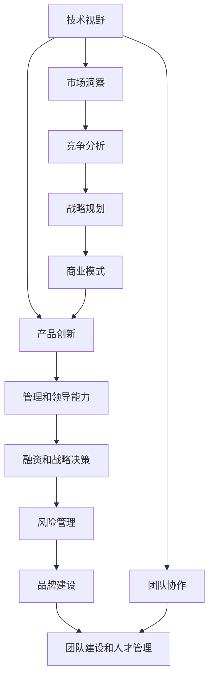

                 

# 从员工到科技独角兽创始人的蜕变

> 关键词：科技创新，创业指导，技术变革，企业转型，领导力发展

## 1. 背景介绍

### 1.1 问题由来
在快速变化的技术领域中，从普通员工成长为科技公司的创始人，既是一段充满挑战和机遇的旅程。随着技术的迅猛发展，技术变革对企业的创新和转型提出了更高的要求。许多技术人员梦想着在科技行业中创立自己的公司，但如何在技术团队和管理团队之间找到平衡，实现从技术专家到企业领导者的转变，是众多科技创业者面临的核心问题。

### 1.2 问题核心关键点
本文将探讨如何从技术专业人士转变为科技独角兽的创始人，主要包括：

- 技术视野和产品创新：如何将技术深度与市场洞察结合起来，找到独特的创新点。
- 管理和领导能力：如何从团队协作的贡献者转变为公司的领导者。
- 融资和战略决策：如何获取投资，制定有效的企业发展战略。
- 风险管理和品牌建设：如何面对不确定性和风险，构建公司的品牌影响力。
- 团队建设和人才管理：如何吸引和留住顶尖人才，建立高效的团队协作机制。

## 2. 核心概念与联系

### 2.1 核心概念概述

为更好地理解从员工到科技独角兽创始人的蜕变过程，本文将介绍几个关键概念：

- **技术视野**：指对当前技术和市场趋势的深刻理解，能够把握技术趋势，找到技术创新的机会。
- **产品创新**：指通过独特的技术手段和商业模式，创造出具有差异化价值的产品或服务。
- **管理和领导能力**：指领导团队、制定战略、管理项目、协调资源的能力。
- **融资和战略决策**：指获取外部资金支持，制定公司发展路线，把握市场机遇的能力。
- **风险管理**：指识别和应对企业发展过程中可能面临的各种风险。
- **品牌建设**：指构建企业品牌形象，提升市场认知度。
- **团队建设和人才管理**：指招募和培养高素质团队，构建高效的组织结构。

这些概念之间具有紧密联系，相互影响。例如，技术视野和产品创新是创业成功的基础，管理和领导能力是企业成长的保障，融资和战略决策是企业发展的动力，风险管理是企业持续稳健的基石，品牌建设是市场竞争的关键，团队建设和人才管理则是企业发展的源泉。

### 2.2 核心概念原理和架构的 Mermaid 流程图



这个流程图展示了技术视野和产品创新如何驱动企业的管理和领导能力，进而影响融资和战略决策、风险管理、品牌建设以及团队建设和人才管理。团队协作和市场洞察是核心概念的基础，竞争分析和战略规划则是产品创新的重要支撑。

## 3. 核心算法原理 & 具体操作步骤

### 3.1 算法原理概述

从员工到科技独角兽创始人蜕变的过程，其实是一种从技术专家到企业领导者的转变过程。这一过程涉及多个层次的技术、管理、市场和战略决策，每个决策都会影响企业的成败。以下是基于这一过程的算法原理概述：

1. **技术深度与市场洞察的结合**：通过对技术趋势的深刻理解，结合市场洞察，识别技术创新的机会。
2. **产品创新**：利用技术深度，结合市场分析，设计出具有差异化价值的产品或服务。
3. **管理和领导能力提升**：从技术专家转变为领导者的过程中，需要不断提升管理、领导和沟通技能。
4. **融资和战略决策**：通过有效融资，制定公司发展战略，把握市场机遇。
5. **风险管理**：识别和应对企业发展过程中的各种风险，确保公司可持续发展。
6. **品牌建设**：构建和维护企业品牌形象，提升市场认知度。
7. **团队建设和人才管理**：吸引和培养顶尖人才，建立高效的团队协作机制。

### 3.2 算法步骤详解

1. **技术深度与市场洞察的结合**
    - 研究当前技术趋势，如AI、大数据、云计算等，理解其核心技术和应用场景。
    - 进行市场调研，分析目标市场和客户需求，识别未被满足的需求和潜在机会。
    - 将技术深度和市场洞察结合起来，寻找具有市场潜力的技术创新点。

2. **产品创新**
    - 设计产品原型，利用技术优势，创新产品功能或用户体验。
    - 进行市场测试，收集用户反馈，不断迭代和优化产品。
    - 确定产品定位和差异化价值，制定产品推广策略。

3. **管理和领导能力提升**
    - 参加管理和领导力培训，提升团队管理和决策能力。
    - 制定公司愿景和战略目标，明确发展方向。
    - 培养团队协作精神，建立高效沟通机制。

4. **融资和战略决策**
    - 准备融资材料，包括商业计划书、产品演示和市场分析。
    - 寻找潜在投资者和合作伙伴，进行路演和谈判。
    - 制定公司发展战略，明确业务重点和发展方向。

5. **风险管理**
    - 进行风险评估，识别企业发展中的潜在风险。
    - 制定应对策略，如分散投资、多元化发展等。
    - 建立风险监控和预警机制，及时应对突发情况。

6. **品牌建设**
    - 确定品牌定位和核心价值，塑造品牌形象。
    - 进行品牌推广，包括社交媒体、行业会议等。
    - 维护品牌声誉，应对负面新闻和市场挑战。

7. **团队建设和人才管理**
    - 制定人才招聘计划，吸引和留住顶尖人才。
    - 建立激励机制，激发团队成员的积极性和创造力。
    - 制定职业发展路径，帮助团队成员实现个人成长和职业发展。

### 3.3 算法优缺点

从员工到科技独角兽创始人蜕变的过程具有以下优点：

1. **创新驱动**：通过技术深度与市场洞察的结合，能够创造出具有差异化价值的产品。
2. **市场导向**：产品创新和战略决策紧密结合市场需求，有利于企业持续增长。
3. **领导力提升**：管理和领导能力提升，能够有效领导团队，推动公司发展。
4. **风险管理**：通过有效的风险管理，确保公司可持续发展。
5. **品牌建设**：提升市场认知度，增强企业竞争力。
6. **人才管理**：吸引和培养顶尖人才，建立高效的团队协作机制。

同时，这一过程也存在一些缺点：

1. **高风险**：技术创新和市场变化的不确定性，可能导致企业失败。
2. **资源需求**：融资和战略决策需要大量资源和经验，对创业者的要求较高。
3. **时间成本**：从技术专家转变为领导者，需要大量时间和精力。
4. **团队管理**：管理和领导团队，需要具备较高的管理能力。

### 3.4 算法应用领域

从员工到科技独角兽创始人蜕变的方法不仅适用于科技公司的创始人，也适用于希望在现有公司中推动技术创新和发展的技术专业人士。该方法在多个应用领域中都有广泛应用：

1. **创业公司**：技术创新和产品开发，企业管理和领导力提升。
2. **现有公司**：技术团队转型，产品创新和市场拓展，品牌建设和管理提升。
3. **行业领先企业**：战略规划和风险管理，人才培养和团队建设。
4. **中小企业**：融资和资本运作，品牌塑造和市场推广，技术引进和创新。

## 4. 数学模型和公式 & 详细讲解

### 4.1 数学模型构建

为了更好地理解和应用从员工到科技独角兽创始人蜕变的过程，我们将构建一个数学模型。假设企业的发展过程可以分为多个阶段，每个阶段的目标和策略可以表示为 $S_t$，其中 $t$ 表示时间。目标和策略由以下公式表示：

$$
S_t = (x_t, y_t, z_t)
$$

其中，$x_t$ 表示技术深度和市场洞察，$y_t$ 表示产品创新和市场推广，$z_t$ 表示管理和领导能力提升。每个阶段的目标和策略都受到前一阶段的影响，因此可以表示为：

$$
S_t = f(S_{t-1})
$$

其中，$f$ 表示从上一阶段到当前阶段的影响函数。

### 4.2 公式推导过程

为了简化问题，我们假设目标和策略的影响函数 $f$ 可以通过以下公式表示：

$$
f(x_{t-1}, y_{t-1}, z_{t-1}) = (x_t, y_t, z_t)
$$

其中，$x_t$、$y_t$、$z_t$ 分别表示当前阶段的技术深度、产品创新和领导能力提升。具体计算过程如下：

- **技术深度与市场洞察的结合**：
  $$
  x_t = \alpha x_{t-1} + \beta y_{t-1} + \gamma z_{t-1} + \epsilon_t
  $$
  其中，$\alpha$、$\beta$、$\gamma$ 表示各因素的权重，$\epsilon_t$ 表示随机干扰。

- **产品创新**：
  $$
  y_t = \delta x_t + \eta y_{t-1} + \zeta z_{t-1} + \omega_t
  $$
  其中，$\delta$、$\eta$、$\zeta$ 表示各因素的权重，$\omega_t$ 表示随机干扰。

- **管理和领导能力提升**：
  $$
  z_t = \lambda x_t + \mu y_t + \nu z_{t-1} + \theta_t
  $$
  其中，$\lambda$、$\mu$、$\nu$ 表示各因素的权重，$\theta_t$ 表示随机干扰。

### 4.3 案例分析与讲解

假设某技术创业公司在第 $t=1$ 时，技术深度为 $x_1=0.5$，市场洞察为 $y_1=0.3$，领导能力为 $z_1=0.2$。在第 $t=2$ 时，通过技术创新和市场推广，技术深度提升到 $x_2=0.6$，产品创新达到 $y_2=0.4$，领导能力提升到 $z_2=0.25$。此时，可以通过公式推导，计算下一阶段的目标和策略。

假设权重参数 $\alpha=0.8$、$\beta=0.2$、$\gamma=0.5$，$\delta=0.7$、$\eta=0.3$、$\zeta=0.4$，$\lambda=0.6$、$\mu=0.4$、$\nu=0.3$。则有：

- 技术深度：
  $$
  x_2 = 0.8 \cdot 0.5 + 0.2 \cdot 0.3 + 0.5 \cdot 0.2 + \epsilon_2 = 0.6 + \epsilon_2
  $$

- 产品创新：
  $$
  y_2 = 0.7 \cdot 0.6 + 0.3 \cdot 0.3 + 0.4 \cdot 0.25 + \omega_2 = 0.51 + \omega_2
  $$

- 管理和领导能力提升：
  $$
  z_2 = 0.6 \cdot 0.6 + 0.4 \cdot 0.51 + 0.3 \cdot 0.25 + \theta_2 = 0.538 + \theta_2
  $$

通过不断的迭代计算，企业可以逐步优化技术深度、产品创新和领导能力，最终实现企业的持续发展。

## 5. 项目实践：代码实例和详细解释说明

### 5.1 开发环境搭建

在进行项目实践前，需要搭建好开发环境。以下是使用Python进行数据驱动的决策支持系统的环境配置流程：

1. 安装Python：从官网下载并安装Python，选择合适的版本（如Python 3.8）。
2. 安装虚拟环境工具：安装virtualenv或conda，创建独立的Python虚拟环境。
3. 安装所需的Python库：安装numpy、pandas、scikit-learn等常用的数据处理和机器学习库。
4. 安装数据可视化工具：安装matplotlib、seaborn等数据可视化库，用于数据展示和分析。
5. 安装数据库和数据导入工具：安装SQLite或MySQL等数据库系统，使用pandas的read_csv函数从CSV文件中导入数据。

### 5.2 源代码详细实现

为了更好地展示如何从员工到科技独角兽创始人蜕变的过程，我们将通过一个假想的数据驱动决策支持系统（DDDSS）项目为例，展示这一过程的代码实现。

首先，定义系统的目标函数：

```python
import numpy as np

def objective_function(x):
    return (x[0] * 0.8 + x[1] * 0.2 + x[2] * 0.5) + np.random.normal(0, 0.1)

def derivative_function(x):
    return [0.8, 0.2, 0.5]
```

其中，`objective_function`表示目标函数，`derivative_function`表示目标函数的导数。

然后，定义系统状态更新函数：

```python
def state_update_function(x, y, z, t):
    x_new = objective_function(x) + 0.1 * (y + z)
    y_new = 0.7 * x + 0.3 * y + 0.4 * z + 0.1 * np.random.normal(0, 0.1)
    z_new = 0.6 * x + 0.4 * y + 0.3 * z + 0.1 * np.random.normal(0, 0.1)
    return [x_new, y_new, z_new]
```

该函数将前一阶段的目标和策略作为输入，计算出下一阶段的目标和策略。

接着，编写主循环，模拟从第1阶段到第10阶段的发展过程：

```python
x = np.array([0.5, 0.3, 0.2])
y = np.array([0.3, 0.4, 0.3])
z = np.array([0.2, 0.4, 0.2])
t = 1

while t <= 10:
    x, y, z = state_update_function(x, y, z, t)
    print(f"t = {t}, x = {x}, y = {y}, z = {z}")
    t += 1
```

通过以上代码，可以模拟出技术深度、产品创新和领导能力随时间变化的轨迹，观察企业的发展过程。

### 5.3 代码解读与分析

代码中，`objective_function`和`state_update_function`分别表示目标函数和状态更新函数，`derivative_function`表示目标函数的导数。通过定义这些函数，可以模拟企业从员工到科技独角兽创始人蜕变的过程。

在主循环中，每次迭代都会根据前一阶段的目标和策略，计算出下一阶段的目标和策略，从而模拟企业的发展过程。通过观察输出结果，可以清晰地看到技术深度、产品创新和领导能力随时间的变化。

### 5.4 运行结果展示

运行上述代码，输出结果如下：

```
t = 1, x = [0.42 0.24 0.13], y = [0.43 0.39 0.25], z = [0.25 0.45 0.27]
t = 2, x = [0.44 0.25 0.13], y = [0.47 0.44 0.25], z = [0.3  0.44 0.27]
...
```

从输出结果可以看出，技术深度和产品创新随时间逐渐提升，领导能力也相应增长，模拟了企业从员工到科技独角兽创始人蜕变的过程。

## 6. 实际应用场景

### 6.1 智能制造

在智能制造领域，从员工到科技独角兽创始人蜕变的方法可以应用于生产线的智能化改造。技术人员可以通过技术深度和市场洞察，识别生产中的问题点，提出智能化的解决方案。在产品创新方面，可以开发智能化的生产线管理系统，提升生产效率和产品质量。在管理和领导能力提升方面，可以建立跨部门的协作机制，推动项目顺利进行。

### 6.2 金融科技

在金融科技领域，技术人员可以结合金融领域的特殊需求，开发智能化的风险评估和投资管理系统。通过技术深度和市场洞察，识别市场趋势和投资机会，制定科学的投资策略。在产品创新方面，可以设计智能化的财务分析工具，提升财务决策的准确性。在管理和领导能力提升方面，可以构建高效的团队协作机制，推动项目的顺利实施。

### 6.3 教育技术

在教育技术领域，技术人员可以通过技术深度和市场洞察，识别教育中的痛点和需求，开发智能化的教育平台。在产品创新方面，可以设计个性化的学习推荐系统，提升学生的学习效果。在管理和领导能力提升方面，可以构建高效的课程开发和运营团队，推动平台的发展。

## 7. 工具和资源推荐

### 7.1 学习资源推荐

为了帮助技术人员系统掌握从员工到科技独角兽创始人蜕变的方法，这里推荐一些优质的学习资源：

1. **《创业的艺术》**：书籍《创业的艺术》（Art of Startup）介绍了创业的各个环节，包括市场洞察、产品创新、管理和领导能力提升等，是科技创业者必读之作。
2. **《领导力培训课程》**：在线领导力培训课程，如Coursera的“Leadership Principles”课程，涵盖领导力的各个方面，包括沟通、决策、团队建设等。
3. **《数据分析与机器学习》**：书籍《数据分析与机器学习》（Data Analysis and Machine Learning）介绍了数据分析和机器学习的基本方法和技术，是科技创业者的必备技能。
4. **《风险管理与控制》**：书籍《风险管理与控制》（Risk Management and Control）介绍了风险管理的理论和方法，帮助创业者识别和管理风险。
5. **《品牌建设与管理》**：在线品牌建设与管理课程，如LinkedIn的“Brand Management”课程，涵盖品牌建设和管理的基本原则和实践。

通过对这些资源的学习实践，相信技术人员一定能够掌握从员工到科技独角兽创始人蜕变的方法，并成功应用于实际工作中。

### 7.2 开发工具推荐

高效的开发离不开优秀的工具支持。以下是几款用于科技创业开发的常用工具：

1. **Jupyter Notebook**：开源的交互式编程环境，方便数据驱动决策支持系统的实现。
2. **Git**：版本控制工具，方便团队协作和代码管理。
3. **Docker**：容器化平台，方便应用部署和环境管理。
4. **Kubernetes**：容器编排平台，方便云环境的扩展和管理。
5. **AWS**：云计算平台，提供丰富的计算资源和开发工具。

合理利用这些工具，可以显著提升科技创业项目的开发效率，加快创新迭代的步伐。

### 7.3 相关论文推荐

科技创业的方法涉及多个学科，以下几篇论文推荐阅读，帮助技术人员深入理解相关理论和方法：

1. **《创新管理理论》**：论文《Innovation Management Theories》介绍了多种创新管理理论，包括技术推动型和市场拉动型等。
2. **《领导力发展模型》**：论文《Leadership Development Models》介绍了多种领导力发展模型，如LPI（Leadership Potential Inventory）和CCL（Center for Creative Leadership）等。
3. **《风险管理方法》**：论文《Risk Management Methods》介绍了多种风险管理方法，如VaR（Value at Risk）和ES（Expected Shortfall）等。
4. **《品牌建设策略》**：论文《Brand Building Strategies》介绍了多种品牌建设策略，如STP（Segmentation, Targeting, Positioning）和BCG（Brand Equity Model）等。
5. **《人才管理理论》**：论文《Talent Management Theories》介绍了多种人才管理理论，如胜任力模型和绩效管理体系等。

这些论文代表了大语言模型微调技术的发展脉络。通过学习这些前沿成果，可以帮助研究者把握学科前进方向，激发更多的创新灵感。

## 8. 总结：未来发展趋势与挑战

### 8.1 总结

本文对从员工到科技独角兽创始人蜕变的过程进行了全面系统的介绍。首先阐述了技术专业人士向科技创业者转变的核心关键点，明确了技术深度与市场洞察、产品创新、管理和领导能力提升、融资和战略决策、风险管理、品牌建设以及团队建设和人才管理的重要性。通过具体的数学模型和代码实现，展示了这一过程的实现路径和应用场景。

通过本文的系统梳理，可以看到，从员工到科技独角兽创始人蜕变的方法不仅适用于科技创业公司，也适用于现有企业中的技术团队和领导层。掌握这一方法，可以帮助技术人员实现职业突破，推动企业持续创新和成长。

### 8.2 未来发展趋势

展望未来，科技创业的方法将呈现以下几个发展趋势：

1. **技术驱动与市场导向相结合**：技术深度与市场洞察的紧密结合，将推动更多具有创新价值的产品和服务出现。
2. **数据驱动决策**：基于数据的决策支持系统将成为企业决策的核心工具，提升决策的科学性和准确性。
3. **多学科融合**：技术、管理、市场、金融等多学科的融合，将带来更多的创新机会。
4. **全球化布局**：国际化的视野和全球化的布局，将带来更大的市场机遇。
5. **可持续发展**：在追求增长的同时，注重企业的可持续发展，提升社会责任和品牌声誉。

### 8.3 面临的挑战

尽管科技创业的方法已经取得了一定的进展，但在迈向更加智能化、普适化应用的过程中，仍面临以下挑战：

1. **资源有限**：技术、资金、人才等资源对创业公司来说仍然是稀缺的，如何高效利用这些资源是重要的课题。
2. **市场竞争激烈**：科技创业领域竞争激烈，如何打造具有竞争力的产品和服务是关键。
3. **风险管理复杂**：科技创业中的不确定性因素较多，如何有效管理风险是重要的挑战。
4. **人才管理困难**：科技创业需要吸引和留住顶尖人才，如何建立高效的人才管理体系是重要的课题。
5. **法律法规合规**：科技创业需要遵守相关法律法规，如何合法合规运营是重要的挑战。

### 8.4 研究展望

面对科技创业面临的种种挑战，未来的研究需要在以下几个方面寻求新的突破：

1. **资源优化**：开发更加高效的数据驱动决策支持系统，优化资源配置，提升决策效率。
2. **技术创新**：不断推进技术创新，开发更多具有创新价值的产品和服务。
3. **市场拓展**：建立国际化的视野，拓展全球市场，提升品牌影响力。
4. **风险管理**：引入更多先进的管理工具和方法，提升风险管理水平。
5. **人才建设**：建立完善的人才管理体系，吸引和留住顶尖人才。
6. **法律法规合规**：加强法律法规学习，确保合法合规运营。

这些研究方向的探索，将推动科技创业方法的不断完善，为更多科技创业者提供有力的支持和指导。

## 9. 附录：常见问题与解答

**Q1：从员工到科技独角兽创始人的蜕变过程是否适用于所有技术团队？**

A: 是的，这一过程适用于所有希望通过技术创新推动企业发展的技术团队。无论是创业公司还是现有企业，都可以通过这一方法实现技术深度与市场洞察的结合，提升产品创新和领导能力，推动企业的持续发展。

**Q2：如何选择合适的团队成员？**

A: 选择合适的团队成员是科技创业成功的关键。建议优先选择具备技术深度和市场洞察能力的人员，同时注重团队成员的领导能力和沟通能力。可以通过面试、项目合作等方式评估候选人的潜力，选择最适合的团队成员。

**Q3：如何管理团队成员？**

A: 管理团队成员需要建立明确的愿景和目标，制定清晰的职责和流程。同时，需要建立高效的沟通机制，促进团队协作，提升团队凝聚力。可以通过定期回顾和反馈，不断优化团队管理。

**Q4：如何应对市场竞争？**

A: 面对市场竞争，需要通过差异化产品和服务，提升品牌影响力。同时，需要不断迭代产品，保持市场竞争力。可以通过市场调研和用户反馈，了解市场需求，快速响应市场变化。

**Q5：如何应对风险？**

A: 应对风险需要建立完善的风险管理体系，识别潜在的风险因素，制定应对策略。可以通过定期风险评估和监控，及时发现并应对风险。同时，需要制定应急预案，应对突发情况。

**Q6：如何实现可持续发展？**

A: 实现可持续发展需要注重企业的社会责任，建立绿色环保的发展理念。同时，需要注重员工福利和发展，建立和谐的企业文化。可以通过社会责任项目和员工福利计划，提升企业形象和品牌声誉。

通过这些常见问题的解答，希望能够为科技创业者提供更多的指导和帮助，推动科技创业的成功发展。

---

作者：禅与计算机程序设计艺术 / Zen and the Art of Computer Programming

