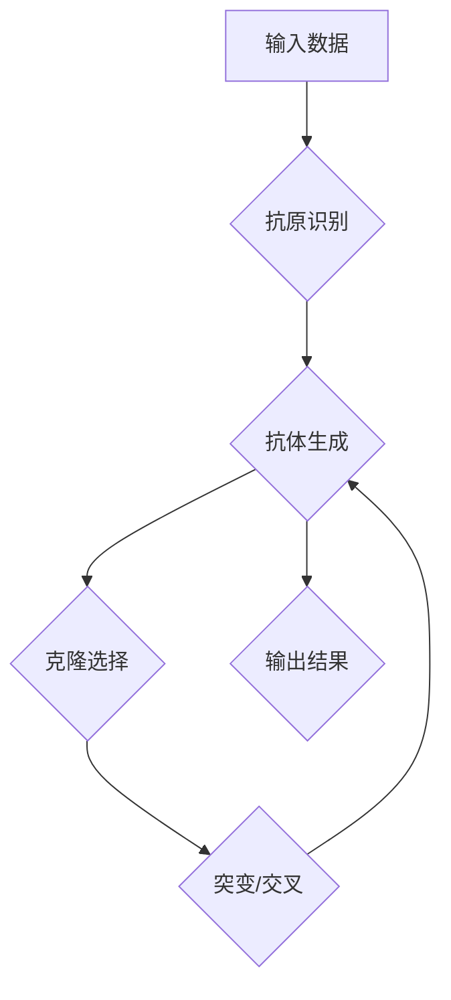

> 人工免疫算法，免疫系统，克隆选择，适应度，进化算法，机器学习

## 1. 背景介绍

在生物世界中，免疫系统是机体抵御病原体入侵的重要防御机制。它通过识别和清除病原体来维持机体的健康。近年来，受生物免疫系统启发，人工免疫算法 (Artificial Immune Systems，AIS) 作为一种新兴的智能算法，在解决复杂问题方面展现出巨大的潜力。

AIS 借鉴了免疫系统的核心机制，例如抗原识别、抗体生成、克隆选择和记忆等，将其应用于人工智能领域。AIS 算法能够学习和适应不断变化的环境，并有效地解决传统算法难以处理的复杂问题，例如分类、识别、预测和优化等。

## 2. 核心概念与联系

**2.1 核心概念**

* **抗原 (Antigen):**  AIS 中的输入数据，代表需要被识别和处理的问题。
* **抗体 (Antibody):**  AIS 中的解决方案或模型，用于识别和处理抗原。
* **克隆 (Clone):**  复制抗体，生成多个具有相同结构的抗体。
* **选择 (Selection):**  根据抗体的识别能力和适应度，选择出最佳的抗体进行繁殖。
* **突变 (Mutation):**  对抗体进行随机变化，以增加算法的探索能力。
* **交叉 (Crossover):**  将两个抗体的特征进行交换，生成新的抗体。

**2.2  AIS 架构**



## 3. 核心算法原理 & 具体操作步骤

**3.1 算法原理概述**

人工免疫算法的核心原理是模拟生物免疫系统的进化机制，通过不断迭代和优化，生成能够有效解决问题的抗体。

**3.2 算法步骤详解**

1. **初始化:** 生成初始的抗体库，每个抗体代表一个可能的解决方案。
2. **抗原识别:** 将输入数据作为抗原，识别抗原与抗体之间的匹配程度。
3. **适应度评估:** 根据抗体识别抗原的准确率和效率，计算抗体的适应度。
4. **克隆选择:** 选择适应度高的抗体进行克隆，生成多个具有相同结构的抗体。
5. **突变/交叉:** 对部分抗体进行随机变化，以增加算法的探索能力。
6. **重复步骤2-5:**  重复以上步骤，直到达到预设的迭代次数或目标适应度。
7. **输出结果:** 选择适应度最高的抗体作为最终的解决方案。

**3.3 算法优缺点**

**优点:**

* **鲁棒性强:**  能够适应复杂和不确定环境。
* **自适应性:**  能够根据环境变化自动调整算法参数。
* **并行化能力:**  能够利用多核处理器进行并行计算，提高效率。

**缺点:**

* **参数设置:**  需要根据具体问题进行参数调整，缺乏通用性。
* **计算复杂度:**  对于大规模问题，计算复杂度较高。
* **收敛性:**  算法可能陷入局部最优解。

**3.4 算法应用领域**

* **分类:**  识别图像、文本、音频等数据。
* **预测:**  预测股票价格、天气预报等。
* **优化:**  解决工程设计、资源分配等问题。
* **安全:**  入侵检测、病毒识别等。

## 4. 数学模型和公式 & 详细讲解 & 举例说明

**4.1 数学模型构建**

在 AIS 中，抗体的识别能力通常用一个函数来表示，该函数将抗原作为输入，输出识别结果。

**4.2 公式推导过程**

假设抗体为一个向量 **a**，抗原为一个向量 **x**，则识别结果可以表示为：

$$
f(a, x) = a \cdot x
$$

其中，**·** 表示向量的点积运算。

**4.3 案例分析与讲解**

例如，识别手写数字 "0" 的问题，可以将数字图像转换为向量 **x**，然后使用一个训练好的抗体向量 **a** 进行识别。

如果 **f(a, x)** 的值较大，则认为该图像为 "0"；否则，认为不是 "0"。

## 5. 项目实践：代码实例和详细解释说明

**5.1 开发环境搭建**

* Python 3.x
* NumPy
* Scikit-learn

**5.2 源代码详细实现**

```python
import numpy as np
from sklearn.datasets import load_iris

# 加载鸢尾花数据集
iris = load_iris()
X = iris.data
y = iris.target

# 初始化抗体库
num_antibodies = 100
antibody_length = X.shape[1]
antibodies = np.random.rand(num_antibodies, antibody_length)

# 训练循环
for epoch in range(100):
    # 随机选择样本进行训练
    indices = np.random.choice(X.shape[0], size=10)
    X_train = X[indices]
    y_train = y[indices]

    # 计算适应度
    fitness = np.dot(antibodies, X_train.T)
    fitness = np.argmax(fitness, axis=1)

    # 克隆选择
    selected_indices = np.where(fitness == y_train)[0]
    clones = antibodies[selected_indices]
    
    # 突变
    for i in range(len(clones)):
        clones[i] += np.random.randn(antibody_length) * 0.1

    # 更新抗体库
    antibodies = clones

# 测试
predictions = np.argmax(np.dot(antibodies, X.T), axis=1)
accuracy = np.mean(predictions == y)
print(f"Accuracy: {accuracy}")
```

**5.3 代码解读与分析**

* 代码首先加载鸢尾花数据集，并初始化一个抗体库。
* 训练循环中，随机选择样本进行训练，计算抗体的适应度，并进行克隆选择和突变操作。
* 最后，使用训练好的抗体进行测试，并计算准确率。

**5.4 运行结果展示**

运行代码后，会输出训练集的准确率。

## 6. 实际应用场景

**6.1 医疗诊断**

AIS 可以用于识别疾病的特征，辅助医生进行诊断。例如，可以利用 AIS 分析患者的病历、检查结果和基因信息，识别潜在的疾病风险。

**6.2 网络安全**

AIS 可以用于检测网络攻击，识别恶意软件和入侵行为。例如，可以利用 AIS 分析网络流量，识别异常行为并进行防御。

**6.3 数据挖掘**

AIS 可以用于发现数据中的隐藏模式和规律。例如，可以利用 AIS 分析客户行为数据，识别潜在的市场趋势。

**6.4 未来应用展望**

随着人工智能技术的不断发展，AIS 将在更多领域得到应用，例如：

* **个性化推荐:**  根据用户的兴趣和行为，推荐个性化的商品和服务。
* **自动驾驶:**  帮助车辆识别道路环境和做出决策。
* **机器人控制:**  提高机器人的自主性和适应性。

## 7. 工具和资源推荐

**7.1 学习资源推荐**

* **书籍:**
    * Artificial Immune Systems: Theory and Applications by Forrest, S., & others
    * Immune-Inspired Computation by Dasgupta, D.
* **在线课程:**
    * Coursera: Artificial Immune Systems
    * edX: Introduction to Artificial Immune Systems

**7.2 开发工具推荐**

* **Python:**  广泛用于 AIS 开发，拥有丰富的库和工具。
* **Java:**  也常用于 AIS 开发，具有良好的性能和可移植性。

**7.3 相关论文推荐**

* Forrest, S., & others. (1994). A Immune System Applied to Software Fault Detection.
* Dasgupta, D. (2007). Immune-Inspired Computation.

## 8. 总结：未来发展趋势与挑战

**8.1 研究成果总结**

近年来，AIS 领域取得了显著进展，在分类、预测、优化等方面展现出强大的应用潜力。

**8.2 未来发展趋势**

* **理论研究:**  深入研究 AIS 的理论基础，探索新的算法和模型。
* **应用拓展:**  将 AIS 应用于更多领域，例如自动驾驶、机器人控制等。
* **跨学科融合:**  将 AIS 与其他人工智能技术融合，例如深度学习、强化学习等。

**8.3 面临的挑战**

* **参数设置:**  AIS 算法的参数设置较为复杂，缺乏通用性。
* **计算复杂度:**  对于大规模问题，计算复杂度较高。
* **收敛性:**  算法可能陷入局部最优解。

**8.4 研究展望**

未来，AIS 领域将继续朝着更智能、更高效、更普适的方向发展，为解决人类面临的复杂问题提供新的解决方案。

## 9. 附录：常见问题与解答

**9.1 如何选择 AIS 算法的参数？**

参数选择需要根据具体问题和数据集进行调整，通常可以通过交叉验证等方法进行优化。

**9.2 AIS 算法的计算复杂度如何？**

AIS 算法的计算复杂度取决于算法的具体实现和问题的规模，一般来说，计算复杂度较高。

**9.3 AIS 算法是否容易陷入局部最优解？**

AIS 算法可能存在陷入局部最优解的风险，可以通过增加算法的探索能力，例如增加突变率或使用多种选择策略来缓解这个问题。


作者：禅与计算机程序设计艺术 / Zen and the Art of Computer Programming 
<end_of_turn>