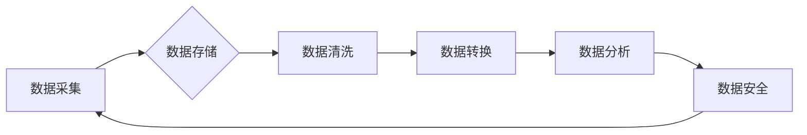

> 人工智能，数据管理，数据策略，数据安全，数据治理，数据可视化，数据分析

## 1. 背景介绍

人工智能（AI）技术近年来发展迅速，已渗透到各个行业，为企业带来了巨大的机遇和挑战。AI创业公司往往需要处理海量的数据，如何高效、安全、可靠地管理这些数据至关重要。数据管理不善将导致数据孤岛、数据质量问题、数据安全风险等，最终影响AI模型的训练效果和企业的发展。

## 2. 核心概念与联系

**2.1 数据管理的核心概念**

数据管理是指规划、组织、存储、保护、检索和利用数据的一系列活动。在AI创业公司中，数据管理涵盖以下几个关键方面：

* **数据采集:** 从各种来源收集相关数据，包括传感器数据、用户行为数据、市场数据等。
* **数据存储:** 选择合适的存储系统，例如数据库、数据湖等，安全可靠地存储数据。
* **数据清洗:** 识别和处理数据中的错误、缺失值和重复数据，提高数据质量。
* **数据转换:** 将数据转换为AI模型所需的格式，例如结构化数据、文本数据等。
* **数据分析:** 使用数据分析工具和技术，从数据中挖掘洞察和知识。
* **数据安全:** 保护数据免受未授权访问、泄露和篡改。

**2.2 数据管理与AI的关系**

数据是AI模型的燃料，高质量的数据可以训练出更准确、更智能的AI模型。数据管理与AI息息相关，良好的数据管理可以为AI应用提供高质量的数据支撑，从而提升AI应用的效果。

**2.3 数据管理架构**

数据管理架构通常包括以下几个层级：

* **数据采集层:** 负责从各种来源收集数据。
* **数据存储层:** 负责存储收集到的数据。
* **数据处理层:** 负责对数据进行清洗、转换等处理。
* **数据分析层:** 负责对数据进行分析和挖掘。
* **数据安全层:** 负责保护数据免受安全威胁。

**2.4 数据管理流程图**



## 3. 核心算法原理 & 具体操作步骤

**3.1 算法原理概述**

数据管理中常用的算法包括数据清洗算法、数据转换算法、数据分析算法等。这些算法基于一定的数学原理和统计方法，可以有效地处理和分析数据。

**3.2 算法步骤详解**

* **数据清洗算法:**

    1. 识别缺失值：使用统计方法或规则判断数据中缺失的值。
    2. 处理缺失值：根据缺失值的类型和原因，选择合适的处理方法，例如删除、填充、预测等。
    3. 识别重复数据：使用哈希函数或其他方法识别重复的数据记录。
    4. 删除重复数据：删除重复的数据记录，保留唯一的数据记录。

* **数据转换算法:**

    1. 数据类型转换：将数据从一种类型转换为另一种类型，例如将文本数据转换为数字数据。
    2. 数据格式转换：将数据从一种格式转换为另一种格式，例如将CSV格式的数据转换为JSON格式的数据。
    3. 数据编码转换：将数据从一种编码转换为另一种编码，例如将ASCII编码转换为UTF-8编码。

* **数据分析算法:**

    1. 统计分析：计算数据中各种统计指标，例如平均值、标准差、方差等。
    2. 数据挖掘：使用机器学习算法从数据中挖掘出隐藏的模式和关系。
    3. 数据可视化：使用图表和图形将数据可视化，以便于理解和分析。

**3.3 算法优缺点**

* **数据清洗算法:**

    优点：可以提高数据质量，减少数据分析中的误差。
    缺点：处理时间可能较长，需要根据具体情况选择合适的处理方法。

* **数据转换算法:**

    优点：可以将数据转换为不同的格式，方便不同的应用场景。
    缺点：转换过程可能导致数据丢失或精度下降。

* **数据分析算法:**

    优点：可以从数据中挖掘出隐藏的知识，为决策提供支持。
    缺点：需要一定的专业知识和技术能力，算法选择和参数设置对结果影响较大。

**3.4 算法应用领域**

数据管理算法广泛应用于各个领域，例如：

* **金融行业:** 风险管理、欺诈检测、客户画像。
* **医疗行业:** 疾病诊断、药物研发、患者管理。
* **电商行业:** 商品推荐、用户行为分析、库存管理。
* **制造业:** 质量控制、设备维护、生产优化。

## 4. 数学模型和公式 & 详细讲解 & 举例说明

**4.1 数学模型构建**

数据管理中常用的数学模型包括：

* **概率模型:** 用于描述数据中的随机性，例如贝叶斯网络、马尔科夫链等。
* **统计模型:** 用于描述数据的分布和关系，例如线性回归、逻辑回归等。
* **图模型:** 用于表示数据之间的关系，例如知识图谱、社交网络图等。

**4.2 公式推导过程**

例如，线性回归模型的公式如下：

$$y = \beta_0 + \beta_1x + \epsilon$$

其中：

* $y$ 是预测值
* $x$ 是输入变量
* $\beta_0$ 是截距
* $\beta_1$ 是斜率
* $\epsilon$ 是误差项

**4.3 案例分析与讲解**

假设我们想要预测房价，可以使用线性回归模型。输入变量可以是房屋面积、房间数量等，输出变量是房价。通过训练数据，我们可以得到模型参数 $\beta_0$ 和 $\beta_1$，然后使用这些参数预测新房子的价格。

## 5. 项目实践：代码实例和详细解释说明

**5.1 开发环境搭建**

* 操作系统：Linux/macOS/Windows
* Python 版本：3.6+
* 必要的库：pandas, numpy, scikit-learn

**5.2 源代码详细实现**

```python
import pandas as pd
from sklearn.linear_model import LinearRegression

# 加载数据
data = pd.read_csv('house_data.csv')

# 划分训练集和测试集
X = data[['面积', '房间']]
y = data['价格']
from sklearn.model_selection import train_test_split
X_train, X_test, y_train, y_test = train_test_split(X, y, test_size=0.2, random_state=42)

# 创建线性回归模型
model = LinearRegression()

# 训练模型
model.fit(X_train, y_train)

# 预测测试集数据
y_pred = model.predict(X_test)

# 评估模型性能
from sklearn.metrics import mean_squared_error
mse = mean_squared_error(y_test, y_pred)
print(f'均方误差: {mse}')
```

**5.3 代码解读与分析**

* 首先，我们加载数据并划分训练集和测试集。
* 然后，我们创建线性回归模型并训练模型。
* 训练完成后，我们使用模型预测测试集数据，并评估模型性能。

**5.4 运行结果展示**

运行代码后，会输出模型的均方误差值，该值越小，模型的预测效果越好。

## 6. 实际应用场景

**6.1 数据清洗在电商平台中的应用**

电商平台每天会处理海量用户数据，这些数据中可能包含错误、缺失值和重复数据。数据清洗可以帮助电商平台识别和处理这些问题，提高数据质量，从而提升推荐算法的准确性、用户体验和销售额。

**6.2 数据转换在金融行业中的应用**

金融行业需要处理各种格式的数据，例如银行交易记录、客户信息、市场数据等。数据转换可以将这些数据转换为统一的格式，方便金融机构进行数据分析和决策。

**6.3 数据分析在医疗行业中的应用**

医疗行业拥有海量患者数据，例如病历、检查结果、药物信息等。数据分析可以帮助医疗机构挖掘这些数据中的隐藏知识，例如预测疾病风险、发现新的治疗方法、优化医疗资源配置等。

**6.4 未来应用展望**

随着人工智能技术的不断发展，数据管理将变得更加重要。未来，数据管理将更加智能化、自动化和个性化，例如：

* 使用机器学习算法自动识别和处理数据中的异常值。
* 使用自然语言处理技术自动提取数据中的关键信息。
* 使用数据可视化技术将数据以更直观的方式呈现。

## 7. 工具和资源推荐

**7.1 学习资源推荐**

* **书籍:**
    * 《数据科学实战》
    * 《机器学习》
    * 《数据挖掘》
* **在线课程:**
    * Coursera: 数据科学
    * edX: 数据分析
    * Udacity: 机器学习

**7.2 开发工具推荐**

* **数据处理工具:**
    * pandas
    * numpy
    * scikit-learn
* **数据存储工具:**
    * MySQL
    * PostgreSQL
    * MongoDB
* **数据可视化工具:**
    * matplotlib
    * seaborn
    * Tableau

**7.3 相关论文推荐**

* 《数据管理在人工智能时代的新挑战》
* 《人工智能驱动的智能数据管理》
* 《数据治理与人工智能：机遇与挑战》

## 8. 总结：未来发展趋势与挑战

**8.1 研究成果总结**

本文介绍了人工智能创业数据管理的策略与措施，包括核心概念、算法原理、项目实践、实际应用场景等。数据管理是人工智能应用的基础，良好的数据管理可以为AI应用提供高质量的数据支撑，从而提升AI应用的效果。

**8.2 未来发展趋势**

未来，数据管理将更加智能化、自动化和个性化，例如：

* 使用机器学习算法自动识别和处理数据中的异常值。
* 使用自然语言处理技术自动提取数据中的关键信息。
* 使用数据可视化技术将数据以更直观的方式呈现。

**8.3 面临的挑战**

数据管理也面临着一些挑战，例如：

* 数据量爆炸式增长
* 数据质量问题
* 数据安全风险
* 数据隐私保护

**8.4 研究展望**

未来，我们需要继续研究和探索新的数据管理方法和技术，以应对数据管理的挑战，为人工智能的应用提供更好的数据支撑。

## 9. 附录：常见问题与解答

**9.1 如何选择合适的数据库？**

选择数据库需要考虑数据类型、数据量、访问频率、安全性等因素。

**9.2 如何处理缺失值？**

处理缺失值的方法包括删除、填充、预测等。

**9.3 如何保证数据安全？**

数据安全需要采取多种措施，例如访问控制、数据加密、备份恢复等。


作者：禅与计算机程序设计艺术 / Zen and the Art of Computer Programming 
<end_of_turn>