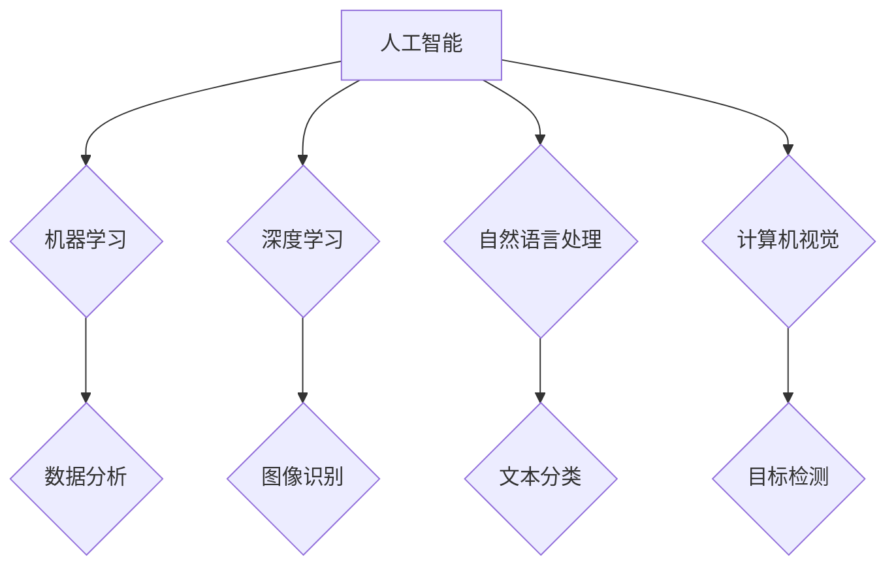

> 人工智能，机器学习，深度学习，自然语言处理，计算机视觉，产业应用，创新

## 1. 背景介绍

人工智能（Artificial Intelligence，AI）作为一门跨学科研究领域，旨在创建能够模拟和超越人类智能的智能系统。近年来，随着计算能力的飞速发展和海量数据的积累，人工智能技术取得了长足进步，并开始广泛应用于各个产业领域，推动着产业数字化转型和智能升级。

人工智能在产业中的应用，主要体现在以下几个方面：

* **自动化生产：** 利用机器学习和深度学习算法，实现生产过程的自动化控制，提高生产效率和产品质量。
* **智能客服：** 基于自然语言处理技术，开发智能客服系统，提供24小时在线服务，提升客户体验。
* **精准营销：** 通过数据分析和机器学习，精准识别目标客户，制定个性化营销策略，提高营销效果。
* **风险管理：** 利用机器学习算法，分析海量数据，识别潜在风险，降低企业风险。
* **个性化推荐：** 基于用户行为数据和机器学习算法，提供个性化产品和服务推荐，提升用户满意度。

## 2. 核心概念与联系

人工智能的核心概念包括：

* **机器学习（Machine Learning）：** 是一种人工智能技术，通过算法学习数据，发现数据中的模式和规律，从而进行预测和决策。
* **深度学习（Deep Learning）：** 是一种机器学习的子集，利用多层神经网络结构，模拟人类大脑的学习过程，能够处理更复杂的数据和任务。
* **自然语言处理（Natural Language Processing，NLP）：** 是一种人工智能技术，旨在使计算机能够理解和处理人类语言。
* **计算机视觉（Computer Vision）：** 是一种人工智能技术，旨在使计算机能够“看”和理解图像和视频。

**核心概念与联系流程图：**



## 3. 核心算法原理 & 具体操作步骤

### 3.1  算法原理概述

机器学习算法的核心原理是通过训练模型，使模型能够从数据中学习规律，并根据学习到的规律对新的数据进行预测或分类。常见的机器学习算法包括：

* **线性回归：** 用于预测连续数值，假设数据之间存在线性关系。
* **逻辑回归：** 用于分类问题，预测数据属于某个类别或不属于某个类别。
* **决策树：** 用于分类和回归问题，通过树形结构对数据进行分类或预测。
* **支持向量机：** 用于分类问题，寻找最佳的分隔超平面，将不同类别的数据分开。
* **k近邻算法：** 用于分类和回归问题，根据数据点与最近k个邻居的距离进行预测。

### 3.2  算法步骤详解

以线性回归算法为例，其具体操作步骤如下：

1. **数据准备：** 收集和预处理数据，将数据转换为模型可理解的格式。
2. **模型选择：** 选择合适的机器学习算法，例如线性回归。
3. **模型训练：** 使用训练数据训练模型，调整模型参数，使模型能够拟合数据。
4. **模型评估：** 使用测试数据评估模型的性能，例如准确率、召回率、F1-score等。
5. **模型部署：** 将训练好的模型部署到实际应用场景中，用于预测或分类新的数据。

### 3.3  算法优缺点

每个机器学习算法都有其自身的优缺点，需要根据具体应用场景选择合适的算法。

* **线性回归：** 优点：简单易懂，计算速度快；缺点：假设数据之间存在线性关系，对非线性关系的处理能力较弱。
* **逻辑回归：** 优点：适用于分类问题，易于解释；缺点：对复杂分类问题处理能力较弱。
* **决策树：** 优点：易于理解和解释，可以处理非线性关系；缺点：容易过拟合，对数据噪声敏感。
* **支持向量机：** 优点：对高维数据处理能力强，泛化能力好；缺点：训练时间较长，参数选择较复杂。
* **k近邻算法：** 优点：简单易懂，无需训练模型；缺点：计算速度慢，对数据规模敏感。

### 3.4  算法应用领域

机器学习算法广泛应用于各个领域，例如：

* **医疗保健：** 疾病诊断、药物研发、患者风险评估。
* **金融服务：** 欺诈检测、信用评分、投资决策。
* **电商：** 商品推荐、价格预测、客户画像。
* **制造业：** 质量控制、设备故障预测、生产优化。
* **交通运输：** 交通流量预测、自动驾驶、路线规划。

## 4. 数学模型和公式 & 详细讲解 & 举例说明

### 4.1  数学模型构建

机器学习算法通常基于数学模型进行构建，例如线性回归模型的数学表达式为：

$$y = w_0 + w_1x_1 + w_2x_2 + ... + w_nx_n + \epsilon$$

其中：

* $y$ 是预测值
* $w_0, w_1, w_2, ..., w_n$ 是模型参数
* $x_1, x_2, ..., x_n$ 是输入特征
* $\epsilon$ 是误差项

### 4.2  公式推导过程

模型参数的学习过程通常通过最小化损失函数来实现。损失函数衡量模型预测值与真实值的差异。常见的损失函数包括均方误差（MSE）和交叉熵损失（Cross-Entropy Loss）。

例如，线性回归模型的损失函数为均方误差：

$$Loss = \frac{1}{n}\sum_{i=1}^{n}(y_i - \hat{y}_i)^2$$

其中：

* $n$ 是样本数量
* $y_i$ 是真实值
* $\hat{y}_i$ 是模型预测值

通过梯度下降算法，不断更新模型参数，使损失函数最小化。

### 4.3  案例分析与讲解

以房价预测为例，假设我们收集了房屋面积、房间数量、地理位置等特征数据，以及对应的房价数据。我们可以使用线性回归模型对房价进行预测。

通过训练模型，我们可以得到模型参数，例如：

* $w_0 = 100000$
* $w_1 = 500$
* $w_2 = 10000$

这意味着，房屋面积每增加1平方米，房价预计增加500元；房间数量每增加1个，房价预计增加10000元。

## 5. 项目实践：代码实例和详细解释说明

### 5.1  开发环境搭建

本项目使用Python语言进行开发，需要安装以下软件：

* Python 3.x
* NumPy
* Pandas
* Scikit-learn

### 5.2  源代码详细实现

```python
import numpy as np
from sklearn.linear_model import LinearRegression
from sklearn.model_selection import train_test_split

# 加载数据
data = np.loadtxt('housing_data.csv', delimiter=',')

# 分割数据
X = data[:, :-1]  # 特征数据
y = data[:, -1]  # 目标数据
X_train, X_test, y_train, y_test = train_test_split(X, y, test_size=0.2, random_state=42)

# 创建线性回归模型
model = LinearRegression()

# 训练模型
model.fit(X_train, y_train)

# 预测测试数据
y_pred = model.predict(X_test)

# 评估模型性能
from sklearn.metrics import mean_squared_error
mse = mean_squared_error(y_test, y_pred)
print(f'Mean Squared Error: {mse}')
```

### 5.3  代码解读与分析

* 首先，加载数据并将其分割为训练集和测试集。
* 然后，创建线性回归模型并使用训练集进行模型训练。
* 接着，使用训练好的模型对测试数据进行预测。
* 最后，使用均方误差（MSE）评估模型性能。

### 5.4  运行结果展示

运行代码后，会输出模型的均方误差值，该值越小，模型的预测性能越好。

## 6. 实际应用场景

### 6.1  医疗保健

* **疾病诊断：** 利用机器学习算法分析患者的医疗影像、病历、基因信息等数据，辅助医生诊断疾病。
* **药物研发：** 通过分析药物分子结构和生物活性数据，预测药物的疗效和安全性，加速药物研发过程。
* **患者风险评估：** 根据患者的医疗历史、生活方式等数据，预测患者患病风险，进行个性化预防和治疗。

### 6.2  金融服务

* **欺诈检测：** 利用机器学习算法分析交易数据，识别异常交易行为，防止金融欺诈。
* **信用评分：** 根据客户的信用历史、收入、资产等数据，评估客户的信用风险，为贷款和保险等服务提供参考。
* **投资决策：** 利用机器学习算法分析市场数据，预测股票价格走势，辅助投资者进行投资决策。

### 6.3  电商

* **商品推荐：** 根据用户的购买历史、浏览记录等数据，推荐用户可能感兴趣的商品。
* **价格预测：** 利用机器学习算法分析市场数据，预测商品价格走势，帮助商家制定价格策略。
* **客户画像：** 根据用户的购买行为、浏览习惯等数据，构建用户画像，帮助商家进行精准营销。

### 6.4  未来应用展望

人工智能技术的发展将进一步推动产业数字化转型和智能升级，未来应用场景将更加广泛，例如：

* **自动驾驶：** 利用计算机视觉、深度学习等技术，实现车辆自动驾驶。
* **工业机器人：** 利用机器学习算法，使机器人能够自主学习和适应不同的工作环境。
* **个性化教育：** 利用人工智能技术，提供个性化的学习方案和教学内容。

## 7. 工具和资源推荐

### 7.1  学习资源推荐

* **在线课程：** Coursera、edX、Udacity等平台提供丰富的机器学习和深度学习课程。
* **书籍：** 《深入理解机器学习》、《深度学习》等书籍是机器学习和深度学习领域的经典著作。
* **博客和论坛：** 机器学习和深度学习领域的博客和论坛，例如机器之心、AI 算法等，可以获取最新的技术资讯和交流学习心得。

### 7.2  开发工具推荐

* **Python：** 机器学习和深度学习开发的常用语言。
* **NumPy：** 用于数值计算的Python库。
* **Pandas：** 用于数据分析和处理的Python库。
* **Scikit-learn：** 机器学习算法库。
* **TensorFlow、PyTorch：** 深度学习框架。

### 7.3  相关论文推荐

* **《ImageNet Classification with Deep Convolutional Neural Networks》**
* **《Attention Is All You Need》**
* **《BERT: Pre-training of Deep Bidirectional Transformers for Language Understanding》**

## 8. 总结：未来发展趋势与挑战

### 8.1  研究成果总结

近年来，人工智能技术取得了长足进步，在各个领域都取得了显著应用成果。

* **计算机视觉：** 图像识别、目标检测、图像生成等技术取得了突破性进展。
* **自然语言处理：** 机器翻译、文本摘要、对话系统等技术取得了显著提升。
* **语音识别：** 语音识别准确率不断提高，语音助手应用越来越普及。

### 8.2  未来发展趋势

未来，人工智能技术将朝着以下方向发展：

* **更强大的计算能力：** 量子计算、神经形态计算等新兴计算技术将推动人工智能算法