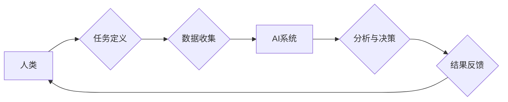

> 人工智能，协作，创造力，生产力，自动化，机器学习，深度学习，自然语言处理，计算机视觉

## 1. 背景介绍

在当今科技飞速发展的时代，人工智能（AI）正以惊人的速度发展，并深刻地改变着我们生活的方方面面。从智能手机的语音助手到自动驾驶汽车，AI技术已经渗透到我们的日常生活，并为我们带来了前所未有的便利和效率。然而，AI技术的发展也引发了人们对未来工作模式和人类角色的思考。

传统上，人们认为AI技术将取代人类的工作，导致大量失业。但随着对AI技术的深入理解，我们逐渐认识到，AI更像是一种工具，可以帮助人类提高效率、增强创造力和解决复杂问题。人类和AI的协作，将成为未来社会发展的重要趋势。

## 2. 核心概念与联系

**2.1 人类-AI协作模式**

人类-AI协作是指人类和人工智能系统共同完成任务的过程。这种协作模式可以分为以下几种类型：

* **人类在控制中:** 人类制定目标和策略，AI系统提供数据分析、决策支持等辅助功能。
* **AI在控制中:** AI系统根据预先设定的规则或学习到的知识，自动完成任务，人类则负责监督和调整。
* **协同决策:** 人类和AI系统共同参与决策过程，互相补充和完善。

**2.2 协作优势**

人类和AI协作能够发挥各自的优势，实现1+1>2的效果。

* **人类优势:** 创造力、批判性思维、情感智能、复杂问题解决能力。
* **AI优势:** 数据处理能力、计算速度、精准度、重复性任务执行能力。

**2.3 协作架构**



## 3. 核心算法原理 & 具体操作步骤

**3.1 算法原理概述**

人类-AI协作的核心算法通常基于机器学习和深度学习技术。

* **机器学习:** 算法通过学习数据样本，发现数据中的规律，并根据这些规律进行预测或分类。
* **深度学习:** 是一种更高级的机器学习方法，利用多层神经网络模拟人类大脑的学习过程，能够处理更复杂的数据和任务。

**3.2 算法步骤详解**

1. **数据收集:** 收集与任务相关的各种数据，例如文本、图像、音频等。
2. **数据预处理:** 对收集到的数据进行清洗、转换和格式化，使其适合算法训练。
3. **模型选择:** 根据任务需求选择合适的机器学习或深度学习算法模型。
4. **模型训练:** 使用训练数据训练模型，调整模型参数，使其能够准确地完成任务。
5. **模型评估:** 使用测试数据评估模型的性能，并根据评估结果进行模型优化。
6. **模型部署:** 将训练好的模型部署到实际应用场景中，用于完成任务。

**3.3 算法优缺点**

* **优点:** 能够自动学习和改进，适应不断变化的环境，提高效率和准确性。
* **缺点:** 需要大量的数据进行训练，训练过程耗时和耗能，容易受到数据偏差的影响。

**3.4 算法应用领域**

* **自然语言处理:** 语音识别、机器翻译、文本摘要、情感分析等。
* **计算机视觉:** 图像识别、物体检测、图像分类、视频分析等。
* **推荐系统:** 产品推荐、内容推荐、个性化服务等。
* **医疗诊断:** 病症诊断、影像分析、药物研发等。

## 4. 数学模型和公式 & 详细讲解 & 举例说明

**4.1 数学模型构建**

在机器学习中，常用的数学模型包括线性回归、逻辑回归、支持向量机、决策树等。这些模型都基于一定的数学公式，用来描述数据之间的关系和预测目标变量。

**4.2 公式推导过程**

例如，线性回归模型的目标是找到一条直线，能够最佳地拟合数据点。其数学公式如下：

$$y = mx + c$$

其中，y是目标变量，x是输入变量，m是斜率，c是截距。

通过最小化误差函数，可以求解出最佳的m和c值。

**4.3 案例分析与讲解**

假设我们有一组数据，记录了房屋面积和房屋价格的关系。我们可以使用线性回归模型来预测房屋价格。

通过训练模型，我们可以得到一条最佳拟合直线，例如：

$$y = 5000x + 100000$$

其中，y表示房屋价格，x表示房屋面积。

根据这个模型，我们可以预测面积为100平方米的房屋价格为：

$$y = 5000 * 100 + 100000 = 1000000$$

## 5. 项目实践：代码实例和详细解释说明

**5.1 开发环境搭建**

可以使用Python语言和相关的机器学习库，例如TensorFlow、PyTorch等，来实现人类-AI协作项目。

**5.2 源代码详细实现**

```python
import tensorflow as tf

# 定义模型
model = tf.keras.models.Sequential([
    tf.keras.layers.Dense(64, activation='relu', input_shape=(10,)),
    tf.keras.layers.Dense(10, activation='softmax')
])

# 编译模型
model.compile(optimizer='adam',
              loss='sparse_categorical_crossentropy',
              metrics=['accuracy'])

# 训练模型
model.fit(x_train, y_train, epochs=10)

# 评估模型
loss, accuracy = model.evaluate(x_test, y_test)
print('Loss:', loss)
print('Accuracy:', accuracy)
```

**5.3 代码解读与分析**

这段代码实现了简单的多分类模型训练。

* `tf.keras.models.Sequential`定义了一个顺序模型，将多个层级连接起来。
* `tf.keras.layers.Dense`定义了一个全连接层，每个神经元都连接到上一层的每个神经元。
* `activation='relu'`指定了激活函数为ReLU，用于引入非线性。
* `optimizer='adam'`指定了优化器为Adam，用于更新模型参数。
* `loss='sparse_categorical_crossentropy'`指定了损失函数为稀疏类别交叉熵，用于多分类任务。
* `metrics=['accuracy']`指定了评估指标为准确率。

**5.4 运行结果展示**

训练完成后，模型会输出训练和测试的损失值和准确率。

## 6. 实际应用场景

**6.1 智能客服**

AI聊天机器人可以自动回答客户常见问题，提供24小时在线服务，提高客户满意度。

**6.2 自动化办公**

AI可以自动完成一些重复性的办公任务，例如数据录入、文档处理、邮件分类等，提高工作效率。

**6.3 个性化推荐**

AI可以根据用户的兴趣爱好和行为数据，推荐个性化的产品、内容和服务。

**6.4 医疗辅助诊断**

AI可以辅助医生进行病症诊断，提高诊断准确率和效率。

**6.5 未来应用展望**

随着AI技术的不断发展，人类-AI协作将应用于更多领域，例如教育、金融、交通、娱乐等，为人类社会带来更多福祉。

## 7. 工具和资源推荐

**7.1 学习资源推荐**

* **在线课程:** Coursera、edX、Udacity等平台提供丰富的AI课程。
* **书籍:** 《深度学习》、《机器学习实战》等书籍是学习AI的基础教材。
* **开源项目:** TensorFlow、PyTorch等开源项目可以帮助你实践AI技术。

**7.2 开发工具推荐**

* **Python:** 作为AI开发的主要语言，Python拥有丰富的库和工具。
* **Jupyter Notebook:** 用于编写和运行Python代码，并可视化数据和结果。
* **TensorFlow/PyTorch:** 用于构建和训练深度学习模型。

**7.3 相关论文推荐**

* **《ImageNet Classification with Deep Convolutional Neural Networks》**
* **《Attention Is All You Need》**
* **《BERT: Pre-training of Deep Bidirectional Transformers for Language Understanding》**

## 8. 总结：未来发展趋势与挑战

**8.1 研究成果总结**

近年来，AI技术取得了长足的进步，在图像识别、语音识别、自然语言处理等领域取得了突破性进展。

**8.2 未来发展趋势**

* **更强大的计算能力:** 随着硬件技术的进步，AI模型将变得更加强大和复杂。
* **更丰富的应用场景:** AI将应用于更多领域，例如医疗、教育、金融等。
* **更注重伦理和安全:** 人类将更加关注AI技术的伦理和安全问题。

**8.3 面临的挑战**

* **数据获取和隐私保护:** AI模型需要大量的数据进行训练，如何获取高质量的数据并保护用户隐私是一个挑战。
* **算法可解释性和公平性:** AI模型的决策过程往往难以理解，如何保证算法的公平性和可解释性是一个重要问题。
* **人才短缺:** AI领域人才需求量大，如何培养更多AI人才是一个挑战。

**8.4 研究展望**

未来，AI研究将更加注重通用人工智能、可解释AI、安全AI等方面的研究，以更好地服务于人类社会。

## 9. 附录：常见问题与解答

**9.1 如何选择合适的AI算法？**

选择合适的AI算法取决于具体的任务需求和数据特点。

**9.2 如何解决AI模型的过拟合问题？**

可以使用正则化、交叉验证等技术来解决AI模型的过拟合问题。

**9.3 如何评估AI模型的性能？**

可以使用准确率、召回率、F1-score等指标来评估AI模型的性能。


作者：禅与计算机程序设计艺术 / Zen and the Art of Computer Programming 
<end_of_turn>