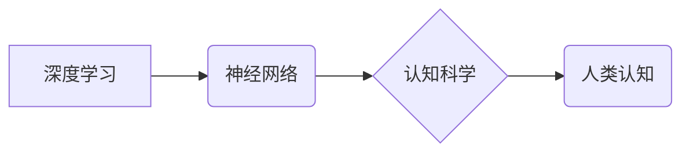

> 深度学习，神经网络，认知科学，人工智能，机器学习，算法，模型，应用

## 1. 背景介绍

人工智能（AI）的蓬勃发展，特别是深度学习技术的突破，为我们打开了通往智能未来的大门。然而，在AI的快速发展过程中，我们也面临着一些重要的认知挑战。许多人对AI的理解还停留在表面，仅仅将其视为一种技术手段，而忽略了其背后的深刻意义和潜在影响。

从浅薄到深刻的认知转变，是理解和驾驭AI时代的关键。它要求我们跳出技术本身的局限，深入思考AI的本质、原理和应用，并将其与人类认知、社会发展等更广泛的领域进行关联。

## 2. 核心概念与联系

### 2.1 深度学习

深度学习是机器学习的一个子领域，它利用多层神经网络来模拟人类大脑的学习过程。通过对大量数据进行训练，深度学习模型能够自动提取特征，并进行复杂的模式识别和预测。

### 2.2 神经网络

神经网络是由多个相互连接的神经元组成的网络结构。每个神经元接收来自其他神经元的输入信号，并根据一定的权重进行处理，最终输出一个信号。神经网络的结构和参数可以通过训练来调整，使其能够学习复杂的映射关系。

### 2.3 认知科学

认知科学研究人类的思维、学习、记忆、语言等认知过程。它试图从多学科的角度，例如心理学、神经科学、计算机科学等，来理解人类认知的机制和规律。

**核心概念与联系流程图**



## 3. 核心算法原理 & 具体操作步骤

### 3.1 算法原理概述

深度学习的核心算法是反向传播算法（Backpropagation）。该算法通过计算误差，并反向传播到网络中的各个层，调整神经元的权重和偏差，从而使模型的预测结果越来越准确。

### 3.2 算法步骤详解

1. **前向传播:** 将输入数据传递到神经网络中，并计算每个神经元的输出值。
2. **误差计算:** 将网络的输出值与实际目标值进行比较，计算误差。
3. **反向传播:** 将误差反向传播到网络中的各个层，计算每个神经元的梯度。
4. **权重更新:** 根据梯度，更新神经元的权重和偏差，使模型的预测结果更加准确。
5. **重复步骤1-4:** 迭代训练，直到模型的性能达到预期的水平。

### 3.3 算法优缺点

**优点:**

* 能够学习复杂的非线性关系。
* 具有强大的泛化能力，能够应用于各种不同的任务。

**缺点:**

* 需要大量的训练数据。
* 训练过程比较耗时和耗能。
* 模型的解释性较差。

### 3.4 算法应用领域

深度学习算法已广泛应用于图像识别、自然语言处理、语音识别、机器翻译、推荐系统等领域。

## 4. 数学模型和公式 & 详细讲解 & 举例说明

### 4.1 数学模型构建

深度学习模型通常由多个神经网络层组成，每个层包含多个神经元。每个神经元接收来自上一层的输出作为输入，并通过一个激活函数进行处理，最终输出一个信号。

**神经元模型:**

$$
y = f(w^T x + b)
$$

其中：

* $y$ 是神经元的输出值。
* $f$ 是激活函数。
* $w$ 是神经元的权重向量。
* $x$ 是神经元的输入向量。
* $b$ 是神经元的偏置。

### 4.2 公式推导过程

反向传播算法的核心是计算误差梯度，并根据梯度更新神经元的权重和偏差。

**误差函数:**

$$
E = \frac{1}{2} \sum_{i=1}^{N} (y_i - t_i)^2
$$

其中：

* $E$ 是误差函数。
* $y_i$ 是网络的输出值。
* $t_i$ 是实际目标值。
* $N$ 是样本数量。

**梯度下降算法:**

$$
w = w - \eta \frac{\partial E}{\partial w}
$$

其中：

* $\eta$ 是学习率。
* $\frac{\partial E}{\partial w}$ 是误差函数对权重的梯度。

### 4.3 案例分析与讲解

假设我们有一个简单的线性回归问题，目标是预测房价。我们可以使用一个单层神经网络来解决这个问题。

**输入:** 房屋面积

**输出:** 房价

我们可以训练这个神经网络，使其能够学习房屋面积与房价之间的关系。通过反向传播算法，我们可以更新神经元的权重和偏差，使模型的预测结果越来越准确。

## 5. 项目实践：代码实例和详细解释说明

### 5.1 开发环境搭建

* Python 3.x
* TensorFlow 或 PyTorch

### 5.2 源代码详细实现

```python
import tensorflow as tf

# 定义模型
model = tf.keras.models.Sequential([
    tf.keras.layers.Dense(units=1, input_shape=[1]),
])

# 编译模型
model.compile(optimizer='sgd', loss='mean_squared_error')

# 训练模型
model.fit(x_train, y_train, epochs=100)

# 预测房价
prediction = model.predict(x_test)
```

### 5.3 代码解读与分析

* 我们使用 TensorFlow 库构建了一个简单的线性回归模型。
* 模型只有一个全连接层，输入维度为 1，输出维度为 1。
* 我们使用随机梯度下降（SGD）作为优化器，均方误差（MSE）作为损失函数。
* 我们训练模型 100 个 epochs，并使用训练数据 `x_train` 和 `y_train` 进行训练。
* 训练完成后，我们可以使用测试数据 `x_test` 来预测房价。

### 5.4 运行结果展示

训练完成后，我们可以评估模型的性能，例如使用均方根误差 (RMSE) 来衡量预测结果与实际房价之间的差异。

## 6. 实际应用场景

深度学习技术已广泛应用于各个领域，例如：

* **图像识别:** 人脸识别、物体检测、图像分类
* **自然语言处理:** 机器翻译、文本摘要、情感分析
* **语音识别:** 语音助手、语音搜索
* **推荐系统:** 产品推荐、内容推荐
* **医疗诊断:** 病情预测、疾病诊断

## 7. 工具和资源推荐

### 7.1 学习资源推荐

* **书籍:**
    * 深度学习 (Deep Learning) - Ian Goodfellow, Yoshua Bengio, Aaron Courville
    * 构建深度学习模型 (Hands-On Machine Learning with Scikit-Learn, Keras & TensorFlow) - Aurélien Géron
* **在线课程:**
    * Coursera: 深度学习 Specialization
    * Udacity: 深度学习 Nanodegree
    * fast.ai: 深度学习课程

### 7.2 开发工具推荐

* **TensorFlow:** 开源深度学习框架
* **PyTorch:** 开源深度学习框架
* **Keras:** 高级深度学习API

### 7.3 相关论文推荐

* **AlexNet:** ImageNet Classification with Deep Convolutional Neural Networks
* **VGGNet:** Very Deep Convolutional Networks for Large-Scale Image Recognition
* **ResNet:** Deep Residual Learning for Image Recognition

## 8. 总结：未来发展趋势与挑战

### 8.1 研究成果总结

深度学习技术取得了显著的进展，在图像识别、自然语言处理等领域取得了突破性的成果。

### 8.2 未来发展趋势

* **模型更深、更广:** 研究更深层次、更广阔结构的神经网络模型。
* **数据更丰富、更智能:** 利用更多数据和更智能的数据处理方法来训练模型。
* **解释性更强:** 研究更易于理解和解释的深度学习模型。
* **应用更广泛:** 将深度学习技术应用于更多领域，例如医疗、教育、金融等。

### 8.3 面临的挑战

* **数据隐私和安全:** 深度学习模型需要大量的训练数据，如何保护数据隐私和安全是一个重要的挑战。
* **模型可解释性:** 深度学习模型的决策过程往往难以理解，如何提高模型的可解释性是一个重要的研究方向。
* **算法效率:** 训练深度学习模型需要大量的计算资源，如何提高算法效率是一个重要的挑战。

### 8.4 研究展望

未来，深度学习技术将继续发展，并对我们的生活产生更深远的影响。我们需要不断探索新的算法、新的模型和新的应用场景，并积极应对深度学习带来的挑战。

## 9. 附录：常见问题与解答

**Q1: 深度学习和机器学习有什么区别？**

**A1:** 机器学习是人工智能的一个子领域，它利用算法从数据中学习，并做出预测或决策。深度学习是机器学习的一个子领域，它利用多层神经网络来模拟人类大脑的学习过程。

**Q2: 如何选择合适的深度学习框架？**

**A2:** TensorFlow 和 PyTorch 是两个流行的深度学习框架。TensorFlow 更适合于生产环境，而 PyTorch 更适合于研究和开发。

**Q3: 如何评估深度学习模型的性能？**

**A3:** 常见的评估指标包括准确率、召回率、F1-score、AUC 等。

作者：禅与计算机程序设计艺术 / Zen and the Art of Computer Programming


<end_of_turn>