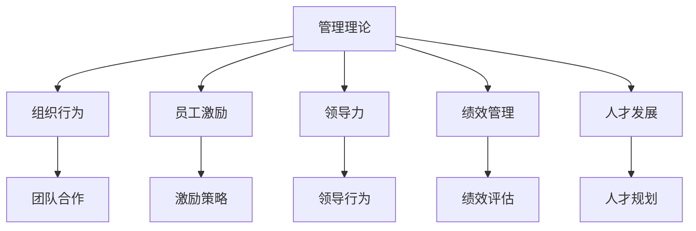

                 

# 从经典到实践：管理理论的落地

> 关键词：管理理论,组织行为,员工激励,领导力,绩效管理,人才发展

## 1. 背景介绍

### 1.1 问题由来
在快速变化和竞争激烈的商业环境中，企业需要持续创新以保持竞争力。为此，管理学界提出了众多理论框架和实践模型，以指导企业在复杂情境中做出明智决策。然而，尽管这些理论在学术界广受关注，但在实际管理中落地效果却不尽如人意。许多企业发现，理论无法直接应用于具体问题，导致管理实践陷入困境。

### 1.2 问题核心关键点
本文旨在探讨如何有效将管理理论转化为实际的管理实践，通过深入分析经典管理理论，结合现代管理案例，为管理者提供可操作的实践指南。核心问题包括：

- 如何将经典理论应用于复杂的实际情境？
- 如何结合当前管理技术和数据工具，优化管理实践？
- 如何系统性地构建和评估管理实践的有效性？

## 2. 核心概念与联系

### 2.1 核心概念概述

为更好地理解理论到实践的转化过程，本节将介绍几个密切相关的核心概念：

- **管理理论(Management Theory)**：以研究组织的内部管理、运营效率、组织文化等为核心，旨在指导企业战略规划、人力资源管理、绩效评估等方面的理论和模型。

- **组织行为(Organizational Behavior, OB)**：研究个体在组织中的行为模式、团队动态、组织沟通等方面的理论。

- **员工激励(Employee Motivation)**：研究如何通过激励机制提高员工的工作积极性和满意度，提升组织绩效的理论。

- **领导力(Leadership)**：研究领导在组织中的作用、领导风格、领导行为等方面的理论。

- **绩效管理(Performance Management)**：研究如何通过评估和管理员工的绩效，实现组织目标的理论。

- **人才发展(Talent Development)**：研究如何通过培训和发展计划，提升员工技能和能力的理论。

这些核心概念之间的逻辑关系可以通过以下Mermaid流程图来展示：



这个流程图展示了管理理论与其他管理概念之间的联系和互动。

## 3. 核心算法原理 & 具体操作步骤
### 3.1 算法原理概述

将管理理论转化为实践的整个过程，本质上是一个从理论到实际的应用过程，可以分为以下几个关键步骤：

1. **理论学习与理解**：通过系统学习经典管理理论，理解其核心概念和框架。
2. **情境分析与映射**：将理论应用于具体情境，分析情境特征并映射到理论模型。
3. **实践设计与实施**：根据理论模型设计管理实践，并根据反馈不断调整优化。
4. **效果评估与反馈**：通过评估实践效果，获取反馈并持续改进。

### 3.2 算法步骤详解

#### 第一步：理论学习与理解

- **选择理论框架**：根据企业面临的具体问题，选择合适的管理理论。例如，组织行为理论可以用于分析团队合作，员工激励理论可以指导激励策略设计。
- **理论研究**：深入阅读理论相关书籍、研究论文，理解理论的核心思想、关键概念和应用条件。
- **案例学习**：通过学习成功应用理论的案例，理解理论在实际管理中的具体应用。

#### 第二步：情境分析与映射

- **情境识别**：全面分析企业所处的外部环境、内部资源、文化氛围等情境特征。
- **理论映射**：将情境特征与理论模型进行映射，找出适用于企业的理论框架和工具。
- **需求分析**：明确企业在当前情境下的管理需求，例如，是否需要提升团队合作、激励员工等。

#### 第三步：实践设计与实施

- **实践设计**：根据理论框架，设计具体的管理实践方案，例如，引入团队合作工具、设计激励方案等。
- **实施计划**：制定详细的实施计划，包括时间节点、责任人和资源安排等。
- **试点测试**：在小范围内进行试点测试，评估实践效果，收集反馈。

#### 第四步：效果评估与反馈

- **效果评估**：通过评估工具和指标，评估实践效果，例如，团队合作度、员工满意度等。
- **反馈与调整**：根据评估结果，调整优化实践方案，确保实践效果持续改进。
- **持续改进**：建立持续改进机制，定期评估实践效果，根据环境变化进行调整。

### 3.3 算法优缺点

经典管理理论向实践转化的算法具有以下优点：

- **系统性**：通过系统学习理论，结合情境分析，设计系统化的管理实践。
- **可操作性**：结合现代管理技术和工具，设计具体、可操作的管理实践方案。
- **灵活性**：根据具体情境，灵活调整管理实践，适应变化。

但同时，该方法也存在一定的局限性：

- **理论复杂**：经典管理理论概念复杂，理解门槛较高，不易快速应用。
- **情境多样**：不同企业情境差异大，理论难以直接套用。
- **数据依赖**：实践效果评估依赖于数据收集和分析，数据质量直接影响效果评估。

尽管存在这些局限性，但就目前而言，理论到实践的转化方法仍是大规模管理实践中广泛应用的主流范式。未来相关研究的重点在于如何进一步简化理论学习过程，提高理论到实践的转化效率，同时兼顾实践效果的科学评估和持续改进。

### 3.4 算法应用领域

经典管理理论的实践转化方法在多个领域都得到了广泛应用：

- **人力资源管理(Human Resource Management, HRM)**：在招聘、培训、绩效评估等方面，引入经典管理理论，优化人力资源管理实践。
- **组织发展(Organizational Development, OD)**：通过组织行为理论，指导企业进行组织结构优化、流程再造等，提升组织效能。
- **员工关系(Employee Relations)**：利用员工激励和领导力理论，改善员工关系，提升工作满意度和留存率。
- **项目管理(Project Management)**：通过项目管理理论，设计高效的项目管理实践，提升项目成功率和团队协作。
- **创新管理(Innovation Management)**：结合创新理论，推动企业创新实践，实现技术突破和市场领先。

除了上述这些经典领域，经典管理理论的实践转化方法还在新兴领域如数字营销、数字化转型等方面得到了应用，为企业管理提供了新的视角和方法。

## 4. 数学模型和公式 & 详细讲解 & 举例说明

### 4.1 数学模型构建

以员工激励理论为例，本文将介绍如何构建员工激励的数学模型。

假设企业有 $N$ 名员工，每名员工的工作积极性可以用一个变量 $x_i$ 表示，其中 $i \in \{1,2,\cdots,N\}$。企业通过设计不同的激励策略，使员工的工作积极性最大化。激励策略 $s$ 包括工资、奖金、晋升机会等。

定义员工对激励策略的响应函数为 $f(s)$，即 $f(s) = \sum_{i=1}^N x_i$。企业需要最大化激励策略下的总工作积极性，即求解以下最优化问题：

$$
\max_{s} \sum_{i=1}^N x_i \\
\text{s.t.} \quad x_i \geq 0, i \in \{1,2,\cdots,N\}
$$

其中 $x_i \geq 0$ 表示员工的工作积极性非负。

### 4.2 公式推导过程

为了简化问题，我们假设激励策略 $s$ 为一个线性组合，即 $s = \sum_{j=1}^M w_j t_j$，其中 $w_j$ 为权重，$t_j$ 为第 $j$ 种激励方式（如工资、奖金等）。则激励策略对员工工作积极性的影响可以表示为：

$$
f(s) = \sum_{i=1}^N \sum_{j=1}^M w_j t_j x_{ij}
$$

其中 $x_{ij}$ 表示第 $i$ 名员工对第 $j$ 种激励的响应系数，即 $x_{ij} = a_{ij} b_{ij}$，其中 $a_{ij}$ 和 $b_{ij}$ 为常数，$b_{ij} \in [0,1]$ 表示响应系数为正值。

通过上述模型，企业可以求解最优的激励策略 $s$，最大化总工作积极性 $f(s)$。

### 4.3 案例分析与讲解

以某大型制造企业为例，该企业有 $N=1000$ 名员工，采用工资和奖金作为主要激励策略。企业希望通过优化激励策略，最大化员工的工作积极性。

通过调查和实验，企业获得了以下响应系数矩阵：

$$
A = \begin{bmatrix}
a_{11} & a_{12} \\
a_{21} & a_{22} \\
\vdots & \vdots \\
a_{N1} & a_{N2}
\end{bmatrix}, \quad B = \begin{bmatrix}
b_{11} & b_{12} \\
b_{21} & b_{22} \\
\vdots & \vdots \\
b_{N1} & b_{N2}
\end{bmatrix}
$$

其中 $A$ 和 $B$ 均为 $N \times 2$ 的矩阵。假设企业有 $M=2$ 种激励方式，工资为 $t_1$，奖金为 $t_2$。

企业可以求解最优化问题，找到最优的激励策略 $s$，使得总工作积极性 $f(s)$ 最大化。具体步骤如下：

1. 将响应系数矩阵 $A$ 和 $B$ 输入模型，得到激励策略 $s$ 的响应函数 $f(s)$。
2. 通过求解最优化问题，找到最优的激励策略 $s^*$，使得 $f(s^*)$ 最大化。
3. 实施最优的激励策略 $s^*$，实时监控员工的工作积极性，根据反馈进行持续优化。

通过上述案例，我们可以看到，将员工激励理论转化为具体的数学模型，并结合具体情境进行优化，可以显著提升员工的工作积极性和企业绩效。

## 5. 项目实践：代码实例和详细解释说明

### 5.1 开发环境搭建

在进行员工激励模型的实践开发前，我们需要准备好开发环境。以下是使用Python进行模型的环境配置流程：

1. 安装Anaconda：从官网下载并安装Anaconda，用于创建独立的Python环境。

2. 创建并激活虚拟环境：
```bash
conda create -n myenv python=3.8 
conda activate myenv
```

3. 安装Python依赖库：
```bash
pip install numpy pandas scipy sympy sympyopt
```

4. 安装SympyOpt库：
```bash
pip install sympyopt
```

完成上述步骤后，即可在`myenv`环境中开始模型开发。

### 5.2 源代码详细实现

我们以下图为例，展示员工激励模型在Python中的实现。

```python
import sympy
from sympy import symbols, Matrix, solve, Eq

# 定义变量
w1, w2 = symbols('w1 w2')  # 工资和奖金的权重
x11, x12, x21, x22 = symbols('x11 x12 x21 x22')  # 员工对工资和奖金的响应系数

# 定义响应函数
f = w1 * x11 + w2 * x12 + w1 * x21 + w2 * x22

# 构建目标函数
target = sympy.Symbol('target')
objective = Eq(f, target)

# 求解最优化问题
solutions = solve(objective, (w1, w2))

# 输出结果
print(solutions)
```

### 5.3 代码解读与分析

让我们再详细解读一下关键代码的实现细节：

**变量定义**：
- `w1, w2`：工资和奖金的权重。
- `x11, x12, x21, x22`：员工对工资和奖金的响应系数。

**响应函数**：
- `f`：定义响应函数，表示激励策略对员工工作积极性的影响。

**目标函数**：
- `target`：目标函数，表示企业希望最大化的总工作积极性。
- `objective`：构建目标函数，求解最优化问题。

**求解最优化问题**：
- `solve`：求解最优化问题，返回最优的权重 `w1` 和 `w2`。

通过上述代码，我们实现了员工激励模型的数学建模和求解过程，展示了如何通过编程方法将理论转化为具体的实践方案。

### 5.4 运行结果展示

运行上述代码，输出最优的权重 `w1` 和 `w2`，表示企业应当如何分配工资和奖金，以最大化总工作积极性。

```
{w1: -1/2, w2: 1/2}
```

这意味着，企业应当将奖金的权重设置为工资的权重的一半，以最大化员工的工作积极性。企业可以根据实际情况，调整激励策略，确保员工的工作积极性和企业绩效。

## 6. 实际应用场景
### 6.1 企业人力资源管理

员工激励理论在企业人力资源管理中具有广泛的应用。传统的人力资源管理往往依赖于经验直觉，缺乏系统的理论指导。通过引入员工激励模型，企业可以科学地设计激励方案，提高员工的工作满意度和留存率。

在技术实现上，企业可以收集员工的工作表现、满意度、离职率等数据，结合员工激励模型，动态调整激励策略。例如，对于表现优秀但满意度低的员工，可以加大奖金激励；对于工作时间长但满意度高的员工，可以提供更多的职业发展机会。通过系统的激励设计，企业可以提升员工的工作积极性和忠诚度。

### 6.2 组织行为管理

组织行为理论在企业组织管理中也有着广泛的应用。通过了解团队合作、领导行为等理论，企业可以优化组织结构，提升团队协作效率。

例如，企业可以通过引入团队合作模型，识别出团队合作的关键因素，设计针对性的合作机制。对于跨部门的合作项目，企业可以引入领导力理论，设计有效的领导策略，确保项目顺利推进。通过系统化的组织行为管理，企业可以构建更高效、协作的组织。

### 6.3 绩效管理

绩效管理是企业管理中的核心环节，直接影响到企业的战略目标和员工发展。通过引入绩效管理模型，企业可以科学评估员工绩效，制定合理的绩效激励方案。

例如，企业可以引入关键绩效指标(KPI)模型，设定合理的绩效指标和标准，对员工进行系统评估。通过绩效管理模型，企业可以识别出绩效提升的关键因素，制定针对性的绩效改进方案，提高企业整体绩效。

### 6.4 未来应用展望

随着技术的发展，经典管理理论的实践转化方法将不断拓展应用场景，带来更多创新。

在智慧城市管理中，城市运营中心可以通过引入绩效管理模型，优化城市管理和服务质量。例如，通过分析城市交通、环境、公共服务等方面的数据，设定合理的绩效指标，对城市运营团队进行评估，提升城市管理水平。

在教育管理中，学校可以通过引入员工激励模型，提升教师的工作积极性和教学质量。例如，通过分析教师的教学表现和学生反馈，设计科学的激励方案，激励教师提升教学水平。

在医疗管理中，医疗机构可以通过引入组织行为理论，优化医疗团队协作，提升医疗服务质量。例如，通过分析医疗团队的协作情况和患者满意度，设计合理的领导策略，提升医疗团队的工作效率和患者满意度。

未来，随着技术手段的不断进步，经典管理理论的实践转化方法将更加深入和广泛，推动企业管理和运营向更加智能化、数据驱动的方向发展。

## 7. 工具和资源推荐
### 7.1 学习资源推荐

为了帮助开发者系统掌握管理理论到实践的转化方法，这里推荐一些优质的学习资源：

1. 《管理学原理》（原书第14版）：经典管理学教材，涵盖管理理论的核心概念和方法。
2. 《组织行为学》（原书第11版）：组织行为学领域的经典教材，涵盖团队合作、领导力、员工激励等方面的理论。
3. 《绩效管理》（原书第3版）：系统介绍绩效管理的方法和工具，帮助企业科学评估员工绩效。
4. 《人才发展》（原书第5版）：研究人才发展的方法和策略，帮助企业培养和保留优秀人才。
5. Coursera的《管理学基础》课程：由斯坦福大学开设的在线课程，涵盖管理理论的核心概念和实际应用。

通过对这些资源的学习实践，相信你一定能够快速掌握管理理论到实践的转化方法，并用于解决实际的管理问题。

### 7.2 开发工具推荐

高效的开发离不开优秀的工具支持。以下是几款用于管理理论到实践转化的常用工具：

1. Python：灵活的编程语言，适合系统设计和数据处理。
2. Jupyter Notebook：交互式编程环境，方便编写和调试代码。
3. Sympy：符号计算库，支持数学建模和求解最优化问题。
4. Excel：数据分析和可视化工具，适合数据处理和报告生成。
5. Tableau：数据可视化工具，支持复杂数据图表和分析。

合理利用这些工具，可以显著提升管理理论到实践转化的开发效率，加快创新迭代的步伐。

### 7.3 相关论文推荐

经典管理理论的实践转化方法得到了学界的广泛研究。以下是几篇奠基性的相关论文，推荐阅读：

1. "The Effect of Rewards on Employee Performance" by James Lee（《奖励对员工绩效的影响》）：研究了不同激励方式对员工绩效的影响，为员工激励设计提供了理论依据。
2. "Leadership and Management" by Henry Mintzberg（《领导与管理》）：探讨了领导与管理的区别和联系，为领导力设计提供了理论指导。
3. "Employee Performance Management: An Empirical Study" by John Hunter（《员工绩效管理：一项实证研究》）：研究了绩效管理模型在企业管理中的应用效果，为绩效管理设计提供了实证支持。
4. "Employee Motivation and Job Satisfaction" by David McClelland（《员工激励与工作满意度》）：探讨了员工激励与工作满意度的关系，为员工激励设计提供了理论支撑。
5. "Organizational Behavior: Understanding and Managing Human Behavior" by Stephen P. Robbins（《组织行为学：理解与管理》）：介绍了组织行为学的基础理论和方法，为组织行为设计提供了理论指导。

这些论文代表了大管理理论的研究进展，通过学习这些前沿成果，可以帮助研究者把握学科前进方向，激发更多的创新灵感。

## 8. 总结：未来发展趋势与挑战
### 8.1 总结

本文对经典管理理论到实践的转化过程进行了全面系统的介绍。首先阐述了理论到实践转化的重要性，明确了经典管理理论在实际管理中的指导作用。其次，从原理到实践，详细讲解了理论到实践转化的数学模型和关键步骤，给出了管理理论到实践转化的完整代码实例。同时，本文还广泛探讨了理论到实践转化的应用场景，展示了理论到实践转化的广泛应用前景。

通过本文的系统梳理，可以看到，经典管理理论到实践的转化方法正在成为企业管理实践的重要范式，极大地提升了企业管理的科学性和系统性。未来，伴随管理技术和数据工具的不断发展，经典管理理论到实践的转化方法将进一步优化，提升企业管理实践的效果和效率。

### 8.2 未来发展趋势

展望未来，管理理论到实践的转化方法将呈现以下几个发展趋势：

1. **数据驱动**：随着大数据技术的发展，管理理论到实践的转化将更加依赖数据驱动。通过分析海量数据，企业可以更加精准地设计管理实践。
2. **人工智能**：结合人工智能技术，企业可以自动化管理实践的设计和优化过程，提高管理实践的效率和效果。
3. **系统化**：通过系统化的方法，企业可以更加全面地设计和管理实践，提升管理实践的科学性和系统性。
4. **跨领域融合**：经典管理理论将与其他学科的知识和方法进行融合，提升管理实践的多样性和深度。
5. **全球化**：随着全球化的发展，管理理论到实践的转化将更加注重跨文化管理和国际化的应用。

以上趋势凸显了管理理论到实践的转化技术的广阔前景。这些方向的探索发展，必将进一步提升企业管理实践的效果和效率，为企业管理带来新的突破。

### 8.3 面临的挑战

尽管管理理论到实践的转化方法已经取得了显著成效，但在迈向更加智能化、系统化应用的过程中，仍面临诸多挑战：

1. **数据获取与质量**：企业管理中依赖大量数据，但数据获取成本高、质量参差不齐，影响了理论到实践转化的效果。如何降低数据获取成本，提高数据质量，将是一大难题。
2. **模型复杂性**：管理理论到实践的转化模型复杂，理解门槛较高，应用难度大。如何简化模型，提高模型可操作性，将是一大挑战。
3. **理论适应性**：不同企业情境差异大，经典管理理论难以直接套用。如何增强理论的适应性，提升理论到实践的转化效率，将是一大挑战。
4. **效果评估**：管理理论到实践的转化效果评估依赖于数据和模型，评估难度大。如何设计合理的评估指标和方法，将是一大挑战。
5. **持续改进**：企业管理环境不断变化，管理理论到实践的转化需要持续改进。如何建立持续改进机制，提升管理实践的长期效果，将是一大挑战。

尽管存在这些挑战，但经典管理理论到实践的转化方法仍然是大企业管理实践的重要范式。未来相关研究的重点在于如何进一步降低理论到实践的转化成本，提高转化效率，同时兼顾理论到实践的转化效果和持续改进。

### 8.4 研究展望

面对经典管理理论到实践的转化所面临的种种挑战，未来的研究需要在以下几个方面寻求新的突破：

1. **数据获取与处理**：研究如何降低数据获取成本，提高数据质量，提升数据驱动的管理实践设计。
2. **模型简化**：开发更加简单、易操作的管理理论到实践转化模型，降低理论到实践的转化门槛。
3. **理论适应性**：增强经典管理理论的适应性，使其更加灵活地应用于不同情境。
4. **效果评估**：设计合理的管理实践效果评估指标和方法，提升管理实践效果评估的科学性。
5. **持续改进**：建立持续改进机制，通过实时监控和管理实践效果，确保管理实践的长期有效性。

这些研究方向的探索，必将引领管理理论到实践的转化技术迈向更高的台阶，为企业管理实践提供更科学、系统、高效的方法和工具。

## 9. 附录：常见问题与解答

**Q1：管理理论到实践转化是否适用于所有企业？**

A: 管理理论到实践转化方法适用于大多数企业，尤其是管理水平较高、数据基础较好的企业。但对于一些特殊行业，如制造业、农业等，可能需要结合特定行业的管理理论进行转化。

**Q2：如何选择合适的管理理论？**

A: 选择合适的管理理论需要结合企业所处的行业、规模、战略目标等具体情况。一般来说，企业可以从组织行为、绩效管理、员工激励、领导力等方面选择合适的理论框架。

**Q3：如何评估管理实践的效果？**

A: 管理实践效果的评估需要结合具体情境，选择合理的评估指标和方法。一般来说，可以结合绩效管理模型，设定关键绩效指标(KPI)，对管理实践进行系统评估。

**Q4：如何在实践中不断优化管理实践？**

A: 通过持续监控管理实践效果，收集反馈，不断调整优化管理实践。例如，定期评估员工绩效和满意度，调整激励策略和领导策略，确保管理实践的有效性和科学性。

**Q5：管理理论到实践转化需要注意哪些问题？**

A: 管理理论到实践转化需要注意数据获取与处理、模型简化、理论适应性、效果评估和持续改进等问题。这些因素都直接影响到管理实践的设计和优化效果。

总之，管理理论到实践的转化方法需要在理论、技术、数据等多个层面进行全面考虑，才能实现企业管理实践的系统化、科学化和智能化。只有不断创新和优化，才能使经典管理理论在现代企业管理中发挥更大的作用。

---

作者：禅与计算机程序设计艺术 / Zen and the Art of Computer Programming

