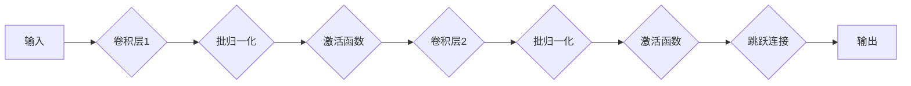

> ResNet, 残差连接, 深度学习, 计算机视觉, 模型微调

## 1. 背景介绍

深度学习在计算机视觉领域取得了显著的成就，其核心在于构建深层神经网络来学习复杂的特征表示。然而，随着网络深度的增加，梯度消失和梯度爆炸问题变得越来越严重，这限制了网络训练的深度和性能。为了解决这个问题，微软研究院于2015年提出了ResNet（Residual Network）网络架构，并取得了令人瞩目的成果。ResNet的核心创新在于引入了残差连接（Residual Connection），使得网络能够更有效地训练深层网络，并大幅提升了网络性能。

## 2. 核心概念与联系

ResNet的核心思想是通过残差连接来缓解梯度消失和梯度爆炸问题。残差连接允许网络学习残差映射，即输入到输出之间的差异。这样，网络可以学习到更小的更新量，从而更容易训练深层网络。

**残差连接的原理：**

残差连接将网络的输入直接连接到网络的输出，形成一个跳跃连接。这样，网络可以学习到输入到输出之间的差异，即残差。

**ResNet架构：**

ResNet的架构由多个残差块（Residual Block）组成。每个残差块包含两个或多个卷积层和一个跳跃连接。

**Mermaid 流程图：**



## 3. 核心算法原理 & 具体操作步骤

### 3.1  算法原理概述

ResNet的核心算法原理是残差学习。残差学习通过学习输入到输出之间的差异，即残差，来缓解梯度消失和梯度爆炸问题。

### 3.2  算法步骤详解

1. **构建残差块：**每个残差块包含两个或多个卷积层和一个跳跃连接。
2. **前向传播：**输入数据通过残差块进行前向传播，得到输出数据。
3. **反向传播：**利用输出数据和真实标签计算损失函数，并通过反向传播算法更新网络参数。
4. **训练网络：**重复前向传播和反向传播步骤，直到网络性能达到预期目标。

### 3.3  算法优缺点

**优点：**

* 缓解梯度消失和梯度爆炸问题，使得网络能够更有效地训练深层网络。
* 提升网络性能，在图像分类、目标检测等任务中取得了显著的成果。

**缺点：**

* 训练时间较长，需要大量的计算资源。
* 模型参数量较大，部署成本较高。

### 3.4  算法应用领域

ResNet算法广泛应用于计算机视觉领域，例如：

* 图像分类
* 目标检测
* 语义分割
* 图像生成

## 4. 数学模型和公式 & 详细讲解 & 举例说明

### 4.1  数学模型构建

ResNet的数学模型可以表示为一个多层感知机，其中每个层都是一个残差块。残差块的输出可以表示为：

$$
F(x) = H(x) + x
$$

其中：

* $F(x)$ 是残差块的输出
* $H(x)$ 是残差块的隐藏层输出
* $x$ 是残差块的输入

### 4.2  公式推导过程

残差连接的引入使得网络能够学习到更小的更新量，从而更容易训练深层网络。

假设网络的输入为 $x$，输出为 $y$，则网络的损失函数可以表示为：

$$
L(y, \hat{y})
$$

其中：

* $y$ 是真实标签
* $\hat{y}$ 是网络的预测输出

利用反向传播算法，可以计算网络参数的梯度：

$$
\frac{\partial L}{\partial w}
$$

其中：

* $w$ 是网络的参数

在残差连接的情况下，梯度可以表示为：

$$
\frac{\partial L}{\partial w} = \frac{\partial L}{\partial F(x)} \cdot \frac{\partial F(x)}{\partial w}
$$

由于 $F(x) = H(x) + x$，因此：

$$
\frac{\partial F(x)}{\partial w} = \frac{\partial H(x)}{\partial w} + \frac{\partial x}{\partial w} = \frac{\partial H(x)}{\partial w} + 0 = \frac{\partial H(x)}{\partial w}
$$

因此，残差连接使得梯度只依赖于隐藏层的更新，而与输入无关。

### 4.3  案例分析与讲解

假设我们有一个简单的残差块，包含两个卷积层和一个跳跃连接。输入数据为 $x$，输出数据为 $F(x)$。

1. **卷积层1：**将输入数据 $x$ 经过卷积操作，得到中间结果 $h_1$。
2. **批归一化：**对 $h_1$ 进行批归一化处理，得到 $h_2$。
3. **激活函数：**对 $h_2$ 应用激活函数，得到 $h_3$。
4. **卷积层2：**将 $h_3$ 经过卷积操作，得到中间结果 $h_4$。
5. **批归一化：**对 $h_4$ 进行批归一化处理，得到 $h_5$。
6. **激活函数：**对 $h_5$ 应用激活函数，得到 $h_6$。
7. **跳跃连接：**将输入数据 $x$ 与 $h_6$ 相加，得到最终输出 $F(x)$。

## 5. 项目实践：代码实例和详细解释说明

### 5.1  开发环境搭建

* Python 3.6+
* TensorFlow 2.0+
* CUDA 10.0+ (可选)

### 5.2  源代码详细实现

```python
import tensorflow as tf

def residual_block(input_tensor, filters):
    """
    定义一个残差块。
    """
    x = input_tensor
    x = tf.keras.layers.Conv2D(filters, kernel_size=3, padding='same')(x)
    x = tf.keras.layers.BatchNormalization()(x)
    x = tf.keras.layers.Activation('relu')(x)
    x = tf.keras.layers.Conv2D(filters, kernel_size=3, padding='same')(x)
    x = tf.keras.layers.BatchNormalization()(x)
    x = tf.keras.layers.Add()([x, input_tensor])
    x = tf.keras.layers.Activation('relu')(x)
    return x

def ResNet(input_shape, num_classes):
    """
    构建 ResNet 网络模型。
    """
    inputs = tf.keras.Input(shape=input_shape)
    x = tf.keras.layers.Conv2D(64, kernel_size=7, strides=2, padding='same')(inputs)
    x = tf.keras.layers.BatchNormalization()(x)
    x = tf.keras.layers.Activation('relu')(x)
    x = tf.keras.layers.MaxPooling2D(pool_size=(3, 3), strides=2)(x)

    # 添加多个残差块
    for i in range(10):
        x = residual_block(x, 64)

    # 全连接层
    x = tf.keras.layers.GlobalAveragePooling2D()(x)
    outputs = tf.keras.layers.Dense(num_classes, activation='softmax')(x)

    model = tf.keras.Model(inputs=inputs, outputs=outputs)
    return model

# 实例化模型
model = ResNet(input_shape=(224, 224, 3), num_classes=10)

# 打印模型结构
model.summary()
```

### 5.3  代码解读与分析

* **residual_block() 函数：**定义了一个残差块，包含两个卷积层和一个跳跃连接。
* **ResNet() 函数：**构建了 ResNet 网络模型，包含卷积层、池化层、残差块和全连接层。
* **实例化模型：**实例化 ResNet 模型，并设置输入形状和输出类别数。
* **打印模型结构：**打印模型结构，查看模型的层数、参数量等信息。

### 5.4  运行结果展示

运行代码后，可以训练 ResNet 模型，并评估模型性能。

## 6. 实际应用场景

ResNet在图像分类、目标检测、语义分割等计算机视觉任务中取得了广泛应用。

### 6.1  图像分类

ResNet可以用于识别图像中的物体类别。例如，可以训练一个 ResNet 模型来识别猫、狗、鸟等动物。

### 6.2  目标检测

ResNet可以用于检测图像中的多个目标。例如，可以训练一个 ResNet 模型来检测图像中的汽车、行人、自行车等物体。

### 6.3  语义分割

ResNet可以用于将图像分割成不同的语义区域。例如，可以训练一个 ResNet 模型来分割图像中的天空、地面、建筑物等区域。

### 6.4  未来应用展望

ResNet的应用前景广阔，未来可以应用于更多领域，例如：

* 自动驾驶
* 医疗影像分析
* 人脸识别
* 机器翻译

## 7. 工具和资源推荐

### 7.1  学习资源推荐

* **论文：**
    * Deep Residual Learning for Image Recognition (https://arxiv.org/abs/1512.03385)
* **博客：**
    * ResNet详解 (https://blog.csdn.net/u014309008/article/details/78997941)
* **课程：**
    * 深度学习 Specialization (https://www.coursera.org/specializations/deep-learning)

### 7.2  开发工具推荐

* **TensorFlow:** https://www.tensorflow.org/
* **PyTorch:** https://pytorch.org/

### 7.3  相关论文推荐

* **DenseNet:** https://arxiv.org/abs/1608.06993
* **Inception:** https://arxiv.org/abs/1409.4842
* **MobileNet:** https://arxiv.org/abs/1704.04861

## 8. 总结：未来发展趋势与挑战

### 8.1  研究成果总结

ResNet的提出极大地推动了深度学习的发展，其残差连接的创新思想被广泛应用于各种深度学习模型中。ResNet在图像分类、目标检测等任务上取得了显著的成果，并为计算机视觉领域的发展做出了重要贡献。

### 8.2  未来发展趋势

* **模型效率提升：**研究更轻量级的 ResNet 模型，以降低模型部署成本。
* **模型泛化能力增强：**研究提高 ResNet 模型泛化能力的方法，使其能够更好地适应不同的数据集和任务。
* **模型解释性增强：**研究 ResNet 模型的内部机制，提高模型的解释性。

### 8.3  面临的挑战

* **数据标注成本高：**深度学习模型的训练需要大量的标注数据，数据标注成本较高。
* **模型训练时间长：**训练深层 ResNet 模型需要大量的计算资源和时间。
* **模型安全性问题：**深度学习模型容易受到攻击，需要研究提高模型安全性的方法。

### 8.4  研究展望

未来，ResNet模型将继续朝着更轻量化、更泛