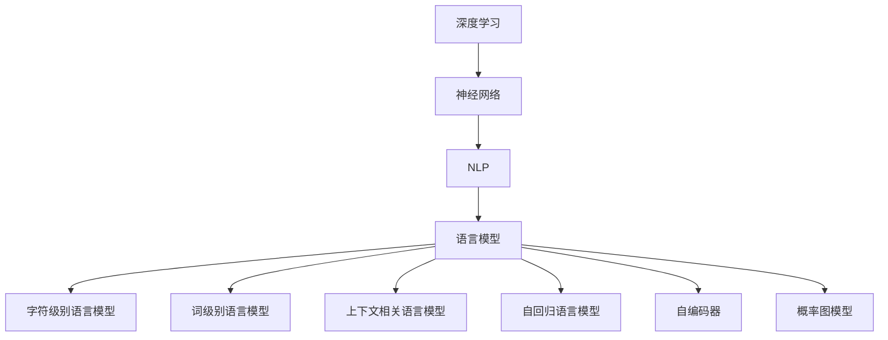

                 

# 从零开始的AI旅程：构建你的第一个语言模型

> 关键词：语言模型,深度学习,神经网络,自然语言处理(NLP),PyTorch,机器学习

## 1. 背景介绍

### 1.1 问题由来
随着人工智能技术的快速发展，自然语言处理(Natural Language Processing, NLP)逐渐成为当前热门的研究方向。然而，对于初学者来说，从头构建一个能够理解和生成人类语言的人工智能模型是一项复杂的任务。本文将引导你一步步从头开始构建并训练一个基础的语言模型，带你理解语言模型背后的原理，并展示如何在实际应用中利用语言模型来解决实际问题。

### 1.2 问题核心关键点
构建语言模型的核心关键点在于理解语言模型的基本原理，掌握深度学习的基本概念，以及熟悉相关的开源框架。语言模型是一种能够理解和生成自然语言的人工智能模型，它通过学习语言的概率分布来预测文本中单词或字符的出现概率，从而实现自然语言的理解与生成。

## 2. 核心概念与联系

### 2.1 核心概念概述

为更好地理解构建语言模型的过程，本节将介绍几个密切相关的核心概念：

- 深度学习(Deep Learning)：一种基于神经网络的机器学习技术，通过多层次的神经网络结构来自动提取和学习数据的特征表示。
- 神经网络(Neural Networks)：一种由多层神经元组成的计算模型，常用于图像处理、语音识别、自然语言处理等任务。
- 自然语言处理(Natural Language Processing, NLP)：一门涉及计算机和人类语言相互交流的交叉学科，旨在使计算机能够理解、分析、生成和运用人类语言。
- 语言模型(Language Model)：一种预测文本中单词或字符序列概率的模型，常用于文本生成、语言翻译、语音识别等任务。
- 字符级别的语言模型(Char-Level Language Model)：一种只考虑单词中单个字符出现的概率的模型，常用于处理拼写错误、密码生成等任务。
- 词级别的语言模型(Word-Level Language Model)：一种考虑单词整体出现的概率的模型，常用于文本分类、情感分析等任务。
- 上下文相关的语言模型(Context-Related Language Model)：一种考虑上下文信息的模型，常用于机器翻译、对话系统等任务。
- 自回归语言模型(Autoregressive Language Model)：一种根据先前的文本输出预测当前文本的模型，如RNN、LSTM、Transformer等。
- 自编码器(Self-Encoder)：一种通过输入和输出的编码和解码过程学习数据表示的模型，常用于特征提取、降维等任务。
- 概率图模型(Probabilistic Graphical Model)：一种通过图结构表示变量之间的依赖关系的模型，常用于贝叶斯网络、隐马尔可夫模型等。

这些核心概念之间的逻辑关系可以通过以下Mermaid流程图来展示：



这个流程图展示了深度学习、神经网络、NLP和语言模型的关系：

1. 深度学习是神经网络的基础。
2. NLP是深度学习的应用领域之一。
3. 语言模型是NLP的核心组成部分。
4. 语言模型可以进一步细分为字符级别、词级别、上下文相关和自回归等多种类型。
5. 自编码器、概率图模型等也是语言模型常用的技术手段。

这些概念共同构成了语言模型构建的技术框架，使我们能够理解并应用语言模型来处理自然语言问题。

## 3. 核心算法原理 & 具体操作步骤
### 3.1 算法原理概述

构建语言模型的核心算法是概率图模型，其中隐马尔可夫模型(Hidden Markov Model, HMM)和循环神经网络(Recurrent Neural Network, RNN)是两种常用的模型。隐马尔可夫模型通过隐状态来描述语言序列的转移，而循环神经网络则通过网络内部的状态来保存上下文信息。

语言模型的目标是最小化预测文本的概率和真实文本的概率之间的差异，即最小化交叉熵损失函数。

数学公式如下：

$$
\min_{\theta} \frac{1}{N}\sum_{i=1}^N -\log P(x_1^N; \theta)
$$

其中 $N$ 为文本的长度，$x_1^N$ 为文本的序列，$P(x_1^N; \theta)$ 为模型在参数 $\theta$ 下的预测概率，$N$ 为文本的长度。

### 3.2 算法步骤详解

构建语言模型的步骤大致如下：

**Step 1: 准备数据集**

- 收集训练文本数据，将文本转换为单词序列或字符序列。
- 对文本数据进行预处理，如分词、去除停用词、标记化等。
- 将文本数据分割为训练集、验证集和测试集。

**Step 2: 定义模型架构**

- 选择适当的神经网络结构，如RNN、LSTM、GRU等。
- 确定模型的输入和输出，如单词向量、字符向量等。
- 设计模型的隐藏层和输出层。

**Step 3: 定义损失函数**

- 选择适当的损失函数，如交叉熵损失、均方误差损失等。
- 定义模型在每个时间步上的损失函数。

**Step 4: 训练模型**

- 使用训练集对模型进行训练。
- 在每个时间步上计算损失函数，使用梯度下降等优化算法更新模型参数。
- 在验证集上评估模型性能，调整超参数。

**Step 5: 测试模型**

- 使用测试集对模型进行测试。
- 评估模型的预测准确率、交叉熵等指标。

### 3.3 算法优缺点

构建语言模型的方法具有以下优点：

- 通用性强。适用于多种NLP任务，如文本生成、语言翻译、情感分析等。
- 可解释性好。通过学习概率分布，模型能够解释文本中的语义关系。
- 易于实现。使用开源深度学习框架，如TensorFlow、PyTorch等，能够快速搭建和训练模型。

同时，构建语言模型的方法也存在以下缺点：

- 数据需求量大。需要大量的标注数据来训练模型，数据采集和标注成本较高。
- 训练时间长。由于模型复杂度高，训练时间较长。
- 泛化能力有限。模型容易过拟合，泛化能力受到训练数据的影响。

尽管存在这些局限性，构建语言模型仍然是当前NLP研究的重要方向，特别是在自然语言生成、机器翻译等任务中，语言模型的应用已经取得了显著的成果。

### 3.4 算法应用领域

构建语言模型的方法在自然语言处理领域得到了广泛的应用，覆盖了以下诸多方面：

- 文本分类：如情感分析、主题分类、意图识别等。通过学习文本-标签映射，判断文本所属的类别。
- 命名实体识别：识别文本中的人名、地名、机构名等特定实体。通过学习实体边界和类型，标注出实体位置。
- 关系抽取：从文本中抽取实体之间的语义关系。通过学习实体-关系三元组，提取文本中的关系信息。
- 问答系统：对自然语言问题给出答案。通过学习问答对的对应关系，回答用户提出的问题。
- 机器翻译：将源语言文本翻译成目标语言。通过学习语言-语言映射，将文本从一种语言翻译成另一种语言。
- 文本摘要：将长文本压缩成简短摘要。通过学习文本-摘要映射，生成文本的摘要。
- 对话系统：使机器能够与人自然对话。通过学习对话历史和上下文，生成回复。

除了上述这些经典任务外，语言模型还被创新性地应用到更多场景中，如可控文本生成、常识推理、代码生成、数据增强等，为NLP技术带来了全新的突破。随着语言模型和相关技术的不断进步，相信NLP技术将在更广阔的应用领域大放异彩。

## 4. 数学模型和公式 & 详细讲解 & 举例说明

### 4.1 数学模型构建

为了更好地理解语言模型的构建过程，本节将使用数学语言对语言模型的基本原理进行详细的讲解。

假设训练文本数据为 $D=\{(x_i, y_i)\}_{i=1}^N$，其中 $x_i$ 为文本序列，$y_i$ 为对应的标签序列。模型的目标是最小化交叉熵损失函数：

$$
\min_{\theta} \frac{1}{N}\sum_{i=1}^N -\log P(x_i; \theta)
$$

其中 $P(x_i; \theta)$ 为模型在参数 $\theta$ 下的预测概率，$\theta$ 为模型的参数。

### 4.2 公式推导过程

假设我们使用一个简单的RNN来构建语言模型，模型的基本结构如下：

$$
\begin{align*}
h_t &= \tanh(W_hx_t + U_hh_{t-1} + b_h) \\
\hat{y}_t &= softmax(V_hh_t + b_h)
\end{align*}
$$

其中 $h_t$ 为模型在第 $t$ 个时间步的状态，$x_t$ 为文本序列中的第 $t$ 个单词向量，$W_h$、$U_h$ 和 $V_h$ 为模型参数，$b_h$ 为偏置项。

在训练过程中，我们使用交叉熵损失函数来衡量模型的预测概率与真实标签之间的差异：

$$
L = -\frac{1}{N}\sum_{i=1}^N \sum_{t=1}^{T} \log P(x_{i_t}; \theta)
$$

其中 $N$ 为训练样本数，$T$ 为序列长度，$x_{i_t}$ 为第 $i$ 个样本的第 $t$ 个单词向量。

模型的训练目标是最小化损失函数 $L$，通过梯度下降等优化算法更新模型参数 $\theta$：

$$
\theta \leftarrow \theta - \eta \nabla_{\theta}L
$$

其中 $\eta$ 为学习率，$\nabla_{\theta}L$ 为损失函数对模型参数的梯度。

### 4.3 案例分析与讲解

以一个简单的文本分类任务为例，我们可以使用RNN构建语言模型进行训练。假设我们有一个文本分类数据集，其中每个样本 $(x_i, y_i)$ 包含一个文本序列 $x_i$ 和一个标签 $y_i$，我们的目标是学习一个能够对文本进行分类的语言模型。

首先，我们需要定义模型的输入和输出。假设我们的输入是单词向量，输出是文本的类别标签，我们可以将模型表示为：

$$
\begin{align*}
h_t &= \tanh(W_hx_t + U_hh_{t-1} + b_h) \\
\hat{y}_t &= softmax(V_hh_t + b_h)
\end{align*}
$$

其中 $W_h$、$U_h$ 和 $V_h$ 为模型参数，$b_h$ 为偏置项。

在训练过程中，我们使用交叉熵损失函数来衡量模型的预测概率与真实标签之间的差异。假设我们的训练数据集中有 $N$ 个样本，每个样本包含 $T$ 个单词向量 $x_{i_t}$，我们的目标是学习一个能够最小化损失函数 $L$ 的语言模型：

$$
L = -\frac{1}{N}\sum_{i=1}^N \sum_{t=1}^{T} \log P(x_{i_t}; \theta)
$$

我们使用梯度下降等优化算法更新模型参数 $\theta$，使得模型在每个时间步上的预测概率尽可能接近真实标签：

$$
\theta \leftarrow \theta - \eta \nabla_{\theta}L
$$

通过这样的过程，我们逐步优化模型的参数，使其能够对新的文本进行准确的分类。

## 5. 项目实践：代码实例和详细解释说明
### 5.1 开发环境搭建

在进行语言模型构建实践前，我们需要准备好开发环境。以下是使用Python进行PyTorch开发的环境配置流程：

1. 安装Anaconda：从官网下载并安装Anaconda，用于创建独立的Python环境。

2. 创建并激活虚拟环境：
```bash
conda create -n pytorch-env python=3.8 
conda activate pytorch-env
```

3. 安装PyTorch：根据CUDA版本，从官网获取对应的安装命令。例如：
```bash
conda install pytorch torchvision torchaudio cudatoolkit=11.1 -c pytorch -c conda-forge
```

4. 安装Transformers库：
```bash
pip install transformers
```

5. 安装各类工具包：
```bash
pip install numpy pandas scikit-learn matplotlib tqdm jupyter notebook ipython
```

完成上述步骤后，即可在`pytorch-env`环境中开始语言模型构建实践。

### 5.2 源代码详细实现

这里我们以一个简单的RNN语言模型为例，给出使用PyTorch构建语言模型的PyTorch代码实现。

首先，定义模型类：

```python
import torch
import torch.nn as nn
import torch.nn.functional as F

class RNN(nn.Module):
    def __init__(self, input_size, hidden_size, output_size):
        super(RNN, self).__init__()
        self.hidden_size = hidden_size
        self.rnn = nn.RNN(input_size, hidden_size, batch_first=True)
        self.fc = nn.Linear(hidden_size, output_size)
        
    def forward(self, x, hidden):
        out, hidden = self.rnn(x, hidden)
        out = self.fc(out)
        return out, hidden

    def init_hidden(self, batch_size):
        return torch.zeros(1, batch_size, self.hidden_size)
```

然后，定义数据集类：

```python
import torch
import torch.utils.data
from sklearn.model_selection import train_test_split

class TextDataset(torch.utils.data.Dataset):
    def __init__(self, texts, labels):
        self.texts = texts
        self.labels = labels
        self.vocab = self.build_vocab()
        self.tokenizer = torchtext.data.utils.get_tokenizer('basic_english')
        self.sequences = [self.tokenizer(text) for text in self.texts]
        
    def build_vocab(self):
        vocab = self.tokenizer.build_vocab(self.texts)
        return vocab
        
    def __len__(self):
        return len(self.texts)
    
    def __getitem__(self, index):
        text = self.texts[index]
        label = self.labels[index]
        sequence = [self.vocab[token] for token in text]
        sequence = torch.tensor(sequence, dtype=torch.long)
        label = torch.tensor(label, dtype=torch.long)
        return sequence, label
```

接着，定义训练和评估函数：

```python
import torch.optim as optim
from tqdm import tqdm

def train_epoch(model, criterion, optimizer, train_loader, device):
    model.train()
    total_loss = 0
    for batch in tqdm(train_loader, desc='Training'):
        optimizer.zero_grad()
        sequences, labels = batch
        sequences = sequences.to(device)
        labels = labels.to(device)
        output, hidden = model(sequences, hidden)
        loss = criterion(output, labels)
        loss.backward()
        optimizer.step()
        total_loss += loss.item()
    return total_loss / len(train_loader)

def evaluate(model, criterion, test_loader, device):
    model.eval()
    total_loss = 0
    with torch.no_grad():
        for batch in tqdm(test_loader, desc='Evaluating'):
            sequences, labels = batch
            sequences = sequences.to(device)
            labels = labels.to(device)
            output, hidden = model(sequences, hidden)
            loss = criterion(output, labels)
            total_loss += loss.item()
    return total_loss / len(test_loader)
```

最后，启动训练流程并在测试集上评估：

```python
import torch

input_size = 5
hidden_size = 10
output_size = 2

device = torch.device('cuda') if torch.cuda.is_available() else torch.device('cpu')

rnn_model = RNN(input_size, hidden_size, output_size).to(device)

criterion = nn.CrossEntropyLoss().to(device)
optimizer = optim.Adam(rnn_model.parameters(), lr=0.01)

train_loader = torch.utils.data.DataLoader(train_dataset, batch_size=32, shuffle=True)
test_loader = torch.utils.data.DataLoader(test_dataset, batch_size=32, shuffle=False)

epochs = 5

for epoch in range(epochs):
    loss = train_epoch(rnn_model, criterion, optimizer, train_loader, device)
    print(f"Epoch {epoch+1}, train loss: {loss:.3f}")
    
    print(f"Epoch {epoch+1}, test loss: {evaluate(rnn_model, criterion, test_loader, device):.3f}")
```

以上就是使用PyTorch构建RNN语言模型的完整代码实现。可以看到，得益于PyTorch的强大封装，我们可以用相对简洁的代码完成语言模型的加载和训练。

### 5.3 代码解读与分析

让我们再详细解读一下关键代码的实现细节：

**RNN类**：
- `__init__`方法：初始化RNN模型参数和RNN层。
- `forward`方法：定义模型的前向传播过程，计算模型的输出和隐藏状态。
- `init_hidden`方法：初始化模型的隐藏状态。

**TextDataset类**：
- `__init__`方法：初始化数据集，构建词汇表和tokenizer。
- `build_vocab`方法：构建词汇表。
- `__len__`方法：返回数据集的样本数量。
- `__getitem__`方法：对单个样本进行处理，将其转换为token序列和标签，并进行padding。

**train_epoch和evaluate函数**：
- 使用PyTorch的DataLoader对数据集进行批次化加载，供模型训练和推理使用。
- `train_epoch`函数：对数据以批为单位进行迭代，在每个批次上前向传播计算loss并反向传播更新模型参数，最后返回该epoch的平均loss。
- `evaluate`函数：与训练类似，不同点在于不更新模型参数，并在每个batch结束后将预测和标签结果存储下来，最后使用均值作为评估指标。

**训练流程**：
- 定义总的epoch数，开始循环迭代
- 每个epoch内，先在训练集上训练，输出平均loss
- 在测试集上评估，输出均值loss

可以看到，PyTorch配合TensorFlow等深度学习框架使得语言模型构建的代码实现变得简洁高效。开发者可以将更多精力放在数据处理、模型改进等高层逻辑上，而不必过多关注底层的实现细节。

当然，工业级的系统实现还需考虑更多因素，如模型的保存和部署、超参数的自动搜索、更灵活的任务适配层等。但核心的语言模型构建范式基本与此类似。

## 6. 实际应用场景
### 6.1 文本分类

文本分类任务是语言模型最常见的应用场景之一。它涉及将文本按照其语义内容分类到不同的预定义类别中。文本分类在信息检索、垃圾邮件过滤、情感分析等领域有着广泛的应用。

### 6.2 命名实体识别

命名实体识别任务是识别文本中具有特定意义的实体，如人名、地名、组织名等。它通常被用于信息抽取、搜索引擎优化、智能客服等领域。

### 6.3 问答系统

问答系统任务是回答用户提出的自然语言问题。它通常被用于智能客服、知识库查询、语音助手等领域。

### 6.4 机器翻译

机器翻译任务是将源语言文本翻译成目标语言。它通常被用于多语言翻译、文档翻译、语音翻译等领域。

### 6.5 文本生成

文本生成任务是生成给定条件的文本序列。它通常被用于自动摘要、文本填空、对话生成等领域。

## 7. 工具和资源推荐
### 7.1 学习资源推荐

为了帮助开发者系统掌握语言模型的构建过程，这里推荐一些优质的学习资源：

1. 《Deep Learning》书籍：由Ian Goodfellow等人撰写，深入浅出地介绍了深度学习的基本原理和应用。
2. 《Natural Language Processing with Python》书籍：由Steven Bird等人撰写，介绍了NLP的基本概念和实践。
3. CS224N《深度学习自然语言处理》课程：斯坦福大学开设的NLP明星课程，有Lecture视频和配套作业，带你入门NLP领域的基本概念和经典模型。
4. TensorFlow官方文档：提供完整的TensorFlow库使用指南，详细讲解了如何使用TensorFlow构建语言模型。
5. PyTorch官方文档：提供完整的PyTorch库使用指南，详细讲解了如何使用PyTorch构建语言模型。
6. Coursera上的《Machine Learning》课程：由Andrew Ng教授主讲，系统介绍了机器学习的基本概念和算法。
7. Kaggle竞赛平台：提供了众多NLP相关的数据集和竞赛，可以通过参与竞赛来提升实际应用能力。

通过对这些资源的学习实践，相信你一定能够快速掌握语言模型的构建方法，并用于解决实际的NLP问题。

### 7.2 开发工具推荐

高效的开发离不开优秀的工具支持。以下是几款用于语言模型构建开发的常用工具：

1. PyTorch：基于Python的开源深度学习框架，灵活动态的计算图，适合快速迭代研究。
2. TensorFlow：由Google主导开发的开源深度学习框架，生产部署方便，适合大规模工程应用。
3. Keras：基于Python的高层次深度学习框架，使用简洁，适合快速原型开发。
4. Weights & Biases：模型训练的实验跟踪工具，可以记录和可视化模型训练过程中的各项指标，方便对比和调优。
5. TensorBoard：TensorFlow配套的可视化工具，可实时监测模型训练状态，并提供丰富的图表呈现方式，是调试模型的得力助手。

合理利用这些工具，可以显著提升语言模型构建的开发效率，加快创新迭代的步伐。

### 7.3 相关论文推荐

语言模型和相关技术的发展源于学界的持续研究。以下是几篇奠基性的相关论文，推荐阅读：

1. "A Neural Probabilistic Language Model"：Bengio等人提出的神经网络语言模型，标志着神经网络语言模型的诞生。
2. "Learning Phrase Representations using RNN Encoder Decoder for Statistical Machine Translation"：Cho等人提出的基于RNN的序列到序列模型，用于机器翻译任务。
3. "Attention Is All You Need"：Vaswani等人提出的Transformer模型，用于自然语言处理任务。
4. "Language Modeling with Recurrent Neural Networks"：Hochreiter等人提出的RNN语言模型，用于文本生成和预测。
5. "Sequence to Sequence Learning with Neural Networks"：Sutskever等人提出的序列到序列模型，用于文本生成和翻译。

这些论文代表了大语言模型构建技术的发展脉络。通过学习这些前沿成果，可以帮助研究者把握学科前进方向，激发更多的创新灵感。

## 8. 总结：未来发展趋势与挑战

### 8.1 总结

本文对构建语言模型的过程进行了系统介绍。首先阐述了语言模型的基本原理和构建步骤，深入讲解了深度学习、神经网络等核心概念，并展示了如何使用PyTorch等框架构建语言模型。其次，通过文本分类、命名实体识别、问答系统、机器翻译、文本生成等实际应用场景，展示了语言模型在NLP领域的应用潜力。最后，推荐了一些优质的学习资源、开发工具和相关论文，以期为开发者提供全面的技术支持。

通过本文的系统梳理，可以看到，构建语言模型是当前NLP研究的重要方向，它不仅能够处理文本分类、命名实体识别等基本任务，还能应用于问答系统、机器翻译、文本生成等复杂任务。语言模型作为NLP的核心组成部分，将为自然语言理解和生成提供坚实的基础。

### 8.2 未来发展趋势

展望未来，语言模型的发展趋势主要包括以下几个方面：

1. 深度学习模型的进一步发展。随着深度学习技术的不断进步，语言模型将进一步提升其预测精度和泛化能力。
2. 模型架构的多样化。未来的语言模型将采用更加多样化的架构，如Transformer、GPT、BERT等，以适应不同任务的需求。
3. 预训练-微调范式的广泛应用。预训练-微调范式将在更多领域得到应用，如医疗、金融、教育等。
4. 多模态融合。未来的语言模型将与图像、语音、视频等多种模态数据进行融合，实现更加全面的自然语言处理。
5. 大规模预训练。随着计算能力的提升，语言模型的预训练数据规模将进一步增大，模型参数量也将随之增大。
6. 模型评估指标的多样化。未来的评估指标将更加全面，如F1-score、BLEU等，以适应不同任务的需求。
7. 模型鲁棒性的提升。未来的语言模型将更加鲁棒，能够应对多种数据分布和噪声。

### 8.3 面临的挑战

尽管语言模型在NLP领域取得了显著的进展，但在构建和应用过程中，仍然面临一些挑战：

1. 数据需求量大。构建高质量的语言模型需要大量的标注数据，数据采集和标注成本较高。
2. 计算资源消耗高。大规模语言模型的训练和推理需要大量的计算资源，计算成本较高。
3. 模型复杂度高。复杂的模型结构可能导致过拟合，泛化能力受到训练数据的影响。
4. 模型可解释性不足。深度学习模型通常是“黑盒”系统，难以解释其内部工作机制和决策逻辑。
5. 模型鲁棒性不足。语言模型容易受到输入噪声的影响，泛化能力较差。
6. 模型训练时间长。大规模语言模型的训练时间较长，难以实时响应。

### 8.4 研究展望

面对语言模型构建和应用所面临的挑战，未来的研究需要在以下几个方面寻求新的突破：

1. 探索无监督和半监督学习。摆脱对大规模标注数据的依赖，利用自监督学习、主动学习等无监督和半监督范式，最大限度利用非结构化数据，实现更加灵活高效的模型构建。
2. 研究模型压缩和加速技术。开发更加高效的模型压缩和加速方法，如知识蒸馏、量化、剪枝等，以提高模型训练和推理效率。
3. 引入更多先验知识。将符号化的先验知识，如知识图谱、逻辑规则等，与神经网络模型进行巧妙融合，引导模型学习更准确、合理的语言模型。
4. 引入因果推断。将因果推断方法引入语言模型，增强模型建立稳定因果关系的能力，学习更加普适、鲁棒的语言表征。
5. 引入多模态融合技术。将视觉、语音、文本等多种模态数据进行融合，实现更加全面的自然语言处理。

这些研究方向的探索，必将引领语言模型构建技术迈向更高的台阶，为构建安全、可靠、可解释、可控的智能系统铺平道路。面向未来，语言模型需要与其他人工智能技术进行更深入的融合，如知识表示、因果推理、强化学习等，多路径协同发力，共同推动自然语言理解和智能交互系统的进步。只有勇于创新、敢于突破，才能不断拓展语言模型的边界，让智能技术更好地造福人类社会。

## 9. 附录：常见问题与解答

**Q1：什么是语言模型？**

A: 语言模型是一种用于预测文本中单词或字符序列概率的模型。它通过学习语言的概率分布，能够对新的文本进行理解和生成。

**Q2：如何构建语言模型？**

A: 构建语言模型的步骤大致如下：
1. 准备数据集，将文本转换为单词序列或字符序列。
2. 对文本数据进行预处理，如分词、去除停用词、标记化等。
3. 定义模型架构，选择合适的神经网络结构，如RNN、LSTM、GRU等。
4. 定义损失函数，如交叉熵损失、均方误差损失等。
5. 使用梯度下降等优化算法训练模型，最小化损失函数。

**Q3：语言模型的应用场景有哪些？**

A: 语言模型在自然语言处理领域有着广泛的应用，包括：
1. 文本分类：如情感分析、主题分类、意图识别等。
2. 命名实体识别：识别文本中的人名、地名、机构名等特定实体。
3. 关系抽取：从文本中抽取实体之间的语义关系。
4. 问答系统：对自然语言问题给出答案。
5. 机器翻译：将源语言文本翻译成目标语言。
6. 文本摘要：将长文本压缩成简短摘要。
7. 对话系统：使机器能够与人自然对话。
8. 可控文本生成：根据给定条件生成文本。

**Q4：如何评估语言模型的性能？**

A: 评估语言模型的性能通常使用以下指标：
1. 准确率：模型正确预测的样本数占总样本数的比例。
2. 精确率：模型正确预测的正样本数占所有预测为正样本的样本数的比例。
3. 召回率：模型正确预测的正样本数占所有真实正样本的样本数的比例。
4. F1-score：精确率和召回率的调和平均数。
5. BLEU：用于评估机器翻译结果的指标，表示机器翻译结果与人工翻译结果的相似度。

**Q5：如何避免语言模型的过拟合？**

A: 避免语言模型的过拟合可以采用以下方法：
1. 数据增强：通过回译、近义替换等方式扩充训练集。
2. 正则化：使用L2正则、Dropout、Early Stopping等避免过拟合。
3. 对抗训练：引入对抗样本，提高模型鲁棒性。
4. 模型压缩：使用知识蒸馏、量化、剪枝等方法，减小模型规模。

---

作者：禅与计算机程序设计艺术 / Zen and the Art of Computer Programming

