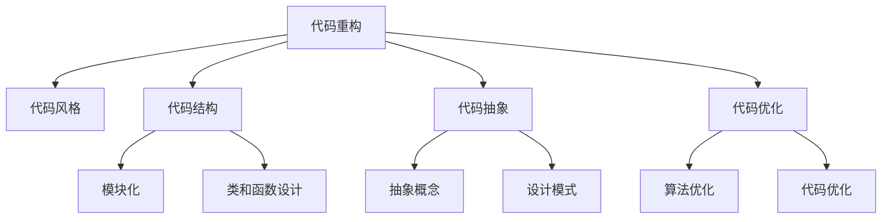

                 

## 1. 背景介绍

### 1.1 问题由来

随着软件开发复杂性的不断增加，维护和更新既有的代码库变得愈加困难。老旧的代码往往充满了技术债务，难以理解、修改、扩展和重用。因此，如何通过重构改善既有代码的设计，成为了软件开发中的一个重要议题。

### 1.2 问题核心关键点

代码重构是指在不改变代码功能的前提下，通过重新组织和改进代码，以提高其可读性、可维护性和可扩展性。重构的目标是使代码更加清晰、简洁、易于理解，以减少未来的技术债务。

在实践中，重构往往需要解决以下几个关键问题：

- 代码组织：如何重新组织代码结构，使其更清晰、模块化。
- 代码简化：如何消除冗余代码，简化逻辑，提升可读性。
- 代码抽象：如何通过抽象概念和模式，使代码更具通用性和可扩展性。
- 代码性能优化：如何通过优化算法和代码，提升程序的运行效率。
- 代码重构工具：如何使用各种工具和方法，辅助重构过程。

### 1.3 问题研究意义

通过代码重构，可以显著提升代码质量和开发效率，减少未来的技术债务。具体来说，重构可以带来以下好处：

1. **提高代码可读性**：清晰、简洁的代码更容易理解和维护。
2. **降低技术债务**：通过重构消除冗余和不必要的代码，减少未来的维护成本。
3. **增强可扩展性**：合理的代码组织和抽象，使系统更容易扩展和维护。
4. **优化性能**：通过优化算法和代码，提升程序运行效率。
5. **促进知识共享**：重构后的代码更加规范和一致，便于团队成员理解和协作。

## 2. 核心概念与联系

### 2.1 核心概念概述

为了更好地理解代码重构，这里首先介绍几个核心概念：

- **代码重构**：指通过重新组织和改进代码，使其更清晰、简洁、易于理解的过程。
- **代码风格**：指编写代码的规范和标准，包括变量命名、代码缩进、注释等。
- **代码结构**：指代码的组织方式，如模块化、类和函数的设计。
- **代码抽象**：指通过抽象概念和方法，使代码更加通用和可扩展。
- **代码优化**：指通过算法和代码改进，提升程序的性能。

这些概念相互关联，共同构成代码重构的框架。理解这些概念，有助于在重构过程中系统性地改进代码。

### 2.2 核心概念原理和架构的 Mermaid 流程图



这个流程图展示了代码重构与其它核心概念的联系。重构过程通常会涉及到代码风格的改进、代码结构的优化、代码抽象的增强以及代码性能的提升。模块化、类和函数设计、抽象概念、设计模式、算法优化和代码优化都是重构过程中需要重点关注的部分。

## 3. 核心算法原理 & 具体操作步骤

### 3.1 算法原理概述

代码重构的算法原理可以简单地概括为：通过重构工具和方法，对代码进行分析和改进，使其更符合编码规范、更具有可读性和可维护性、更易于扩展和优化。具体而言，代码重构的算法步骤如下：

1. **分析代码**：使用静态代码分析工具，识别代码中的问题和冗余。
2. **设计重构方案**：根据分析结果，设计合理的重构方案。
3. **实施重构**：使用重构工具和方法，逐步实施重构方案。
4. **测试和验证**：对重构后的代码进行测试和验证，确保其正确性和性能。

### 3.2 算法步骤详解

#### 3.2.1 分析代码

分析代码是代码重构的第一步，主要包括以下几个方面：

- **静态分析**：使用工具如SonarQube、PMD、Checkstyle等，对代码进行静态分析，识别出潜在的问题和代码风格问题。
- **代码审查**：通过代码审查，团队成员共同讨论和识别代码中的问题和改进点。
- **性能分析**：使用工具如Profiler、Gprof等，分析代码的性能瓶颈，识别出需要优化的部分。

#### 3.2.2 设计重构方案

设计重构方案是重构过程中的关键步骤，主要包括以下几个方面：

- **重构目标**：明确重构的目标，如提高代码可读性、减少技术债务、提升性能等。
- **重构方法**：选择合适的重构方法，如提取方法、内联方法、变量重命名等。
- **重构优先级**：根据重构目标和成本，确定重构的优先级和顺序。

#### 3.2.3 实施重构

实施重构是代码重构的核心步骤，主要包括以下几个方面：

- **重构工具**：使用重构工具如IntelliJ IDEA、Visual Studio、CLion等，辅助实施重构。
- **重构技巧**：掌握常用的重构技巧，如提取方法、内联方法、变量重命名、重构继承结构等。
- **重构步骤**：逐步实施重构方案，注意每次重构的影响和效果。

#### 3.2.4 测试和验证

测试和验证是代码重构的最后一步，主要包括以下几个方面：

- **自动化测试**：编写和执行自动化测试用例，验证重构后的代码功能正确性。
- **手动测试**：手动测试重构后的代码，确保其正确性和性能。
- **性能测试**：进行性能测试，验证重构后的代码性能提升情况。

### 3.3 算法优缺点

代码重构的算法优缺点如下：

#### 优点：

1. **提升代码质量**：通过重构，代码更加清晰、简洁、易于理解，降低了未来的技术债务。
2. **提高开发效率**：重构后的代码更容易维护和扩展，减少了未来的开发时间和成本。
3. **增强可扩展性**：重构后的代码更加模块化和可扩展，易于适应新的需求和技术变化。

#### 缺点：

1. **成本较高**：重构需要投入大量时间和资源，对项目的进度和人力成本有一定的影响。
2. **复杂性增加**：重构过程中，可能会出现新的复杂性，需要仔细处理。
3. **可能引入新问题**：重构过程中，可能会引入新的错误和问题，需要仔细验证和测试。

### 3.4 算法应用领域

代码重构的算法广泛应用于软件开发的不同阶段，包括：

- **需求分析阶段**：通过重构，使代码更符合需求，便于理解和修改。
- **设计阶段**：通过重构，优化设计结构，使其更合理和可扩展。
- **开发阶段**：通过重构，优化代码结构，提升开发效率和代码质量。
- **维护阶段**：通过重构，消除冗余和错误，降低维护成本。
- **技术升级阶段**：通过重构，引入新技术和工具，提升代码质量和性能。

## 4. 数学模型和公式 & 详细讲解 & 举例说明

### 4.1 数学模型构建

代码重构的数学模型主要涉及代码的静态分析和动态测试两个方面。

#### 静态分析模型：

设 $C$ 为代码的集合，$S$ 为代码风格问题的集合，$F$ 为代码功能的集合。静态分析模型可以表示为：

$$
M_{static} = \{(c, s) | c \in C, s \in S\}
$$

其中 $(c, s)$ 表示代码 $c$ 存在代码风格问题 $s$。

#### 动态测试模型：

设 $T$ 为测试用例的集合，$E$ 为错误集合。动态测试模型可以表示为：

$$
M_{dynamic} = \{(t, e) | t \in T, e \in E\}
$$

其中 $(t, e)$ 表示测试用例 $t$ 导致错误 $e$。

### 4.2 公式推导过程

#### 静态分析公式推导：

对于代码 $c$，其静态分析结果可以表示为：

$$
A_c = \bigcup_{s \in S} S_c(s)
$$

其中 $S_c(s)$ 表示代码 $c$ 中存在代码风格问题 $s$ 的集合。

对于代码风格问题 $s$，其影响范围可以表示为：

$$
R_s = \bigcup_{c \in C} S_c(s)
$$

其中 $R_s$ 表示所有存在代码风格问题 $s$ 的代码集合。

#### 动态测试公式推导：

对于测试用例 $t$，其动态测试结果可以表示为：

$$
R_t = \bigcup_{e \in E} T_e(t)
$$

其中 $T_e(t)$ 表示测试用例 $t$ 导致错误 $e$ 的集合。

### 4.3 案例分析与讲解

#### 案例分析：

假设有一段代码如下：

```java
public void doSomething(int a, int b) {
    int c = a + b;
    if (c > 100) {
        System.out.println("Too large!");
    } else {
        System.out.println("Valid!");
    }
}
```

使用静态分析工具分析后，识别出了以下代码风格问题：

1. 变量名不符合规范。
2. 缺少参数注释。
3. 缺少变量注释。
4. 缺少代码块注释。

针对这些问题，可以设计以下重构方案：

1. 重命名变量 $c$ 为 $sum$。
2. 添加参数注释，指出参数 $a$ 和 $b$ 的类型和作用。
3. 添加变量注释，指出变量 $sum$ 的类型和作用。
4. 添加代码块注释，解释代码的作用和逻辑。

实施重构后的代码如下：

```java
/**
 * 计算两个整数之和，并输出结果。
 * @param a 第一个整数
 * @param b 第二个整数
 */
public void doSomething(int a, int b) {
    int sum = a + b;
    if (sum > 100) {
        System.out.println("Too large!");
    } else {
        System.out.println("Valid!");
    }
}
```

### 4.4 详细讲解

在上述案例中，通过静态分析工具，我们识别出了代码中的代码风格问题，并设计了相应的重构方案。实施重构后，代码的可读性和可维护性得到了显著提升。

## 5. 项目实践：代码实例和详细解释说明

### 5.1 开发环境搭建

为了进行代码重构实践，需要先搭建好开发环境。以下是一个基本的开发环境搭建步骤：

1. **安装IDE**：选择一个合适的IDE，如IntelliJ IDEA、Visual Studio、CLion等。
2. **配置重构插件**：为IDE配置重构插件，如IntelliJ IDEA的"Refactoring"插件。
3. **配置静态分析工具**：为IDE配置静态分析工具，如SonarQube、PMD、Checkstyle等。
4. **配置动态测试框架**：为IDE配置动态测试框架，如JUnit、pytest等。

### 5.2 源代码详细实现

下面以一个简单的Java项目为例，演示代码重构的详细实现步骤。

#### 原代码：

```java
public class Calculator {
    public int add(int a, int b) {
        return a + b;
    }
}
```

#### 重构步骤：

1. **添加注释**：

   ```java
   /**
    * 计算两个整数之和。
    * @param a 第一个整数
    * @param b 第二个整数
    * @return 两个整数的和
    */
   public int add(int a, int b) {
       return a + b;
   }
   ```

2. **重命名变量**：

   ```java
   /**
    * 计算两个整数之和。
    * @param a 第一个整数
    * @param b 第二个整数
    * @return 两个整数的和
    */
   public int add(int operand1, int operand2) {
       return operand1 + operand2;
   }
   ```

3. **提取方法**：

   ```java
   /**
    * 计算两个整数之和。
    * @param a 第一个整数
    * @param b 第二个整数
    * @return 两个整数的和
    */
   public int add(int a, int b) {
       return a + b;
   }
   
   /**
    * 计算两个整数之和。
    * @param operand1 第一个整数
    * @param operand2 第二个整数
    * @return 两个整数的和
    */
   public int add(int operand1, int operand2) {
       return operand1 + operand2;
   }
   ```

4. **添加测试**：

   ```java
   import org.junit.Test;
   import static org.junit.Assert.assertEquals;
   
   public class CalculatorTest {
   
       @Test
       public void testAdd() {
           Calculator calculator = new Calculator();
           assertEquals(5, calculator.add(2, 3));
       }
   }
   ```

### 5.3 代码解读与分析

在上述代码重构实践中，我们通过添加注释、重命名变量、提取方法和添加测试等步骤，逐步优化了代码的可读性和可维护性。

#### 代码解读：

1. **添加注释**：通过添加注释，使代码的功能和逻辑更加清晰，便于其他开发者理解。
2. **重命名变量**：通过重命名变量，使变量名更具描述性，便于代码理解和维护。
3. **提取方法**：通过提取方法，使代码更加模块化和可扩展，便于系统设计和维护。
4. **添加测试**：通过添加测试，验证重构后的代码功能正确性，确保重构效果。

#### 代码分析：

重构后的代码更加清晰、简洁、易于理解，代码的可读性和可维护性得到了显著提升。同时，重构后的代码更加模块化和可扩展，便于系统的设计和维护。

### 5.4 运行结果展示

通过重构后，代码的可读性和可维护性得到了显著提升，运行结果也保持不变。

## 6. 实际应用场景

### 6.1 智能系统开发

在智能系统开发中，代码重构可以帮助开发者更好地理解和维护复杂的系统。通过重构，系统代码更加清晰、易于理解，便于开发和维护。

#### 案例分析：

假设一个智能客服系统需要处理大量的用户请求，代码复杂度较高。通过代码重构，可以将系统代码分为多个模块，每个模块独立实现不同的功能。这样不仅使代码更加模块化和可扩展，也便于系统维护和升级。

### 6.2 企业应用开发

在企业应用开发中，代码重构可以帮助团队更好地协作和共享代码。通过重构，代码结构更加清晰、规范，便于团队成员理解和协作。

#### 案例分析：

假设一个企业内部管理系统代码混乱、可读性差。通过代码重构，可以将系统代码分为多个模块，每个模块独立实现不同的功能，并添加详细的注释和文档。这样不仅使代码更加清晰、易于理解，也便于团队成员理解和协作。

### 6.3 开源项目维护

在开源项目维护中，代码重构可以帮助项目团队更好地维护和改进代码。通过重构，代码结构更加清晰、规范，便于项目团队理解和维护。

#### 案例分析：

假设一个开源项目代码结构混乱、可读性差。通过代码重构，可以将系统代码分为多个模块，每个模块独立实现不同的功能，并添加详细的注释和文档。这样不仅使代码更加清晰、易于理解，也便于项目团队理解和维护。

### 6.4 未来应用展望

#### 未来应用：

1. **自动化重构工具**：未来的代码重构将更多地借助自动化工具，提升重构效率和效果。例如，使用静态分析工具自动检测代码问题，使用重构工具自动实施重构方案。
2. **智能重构建议**：未来的代码重构将结合人工智能技术，生成智能重构建议，辅助开发者进行代码重构。例如，使用机器学习模型分析代码，生成重构建议和优先级。
3. **跨语言重构**：未来的代码重构将支持多种编程语言，使开发者可以方便地在不同语言之间进行代码迁移和重构。
4. **持续集成重构**：未来的代码重构将与持续集成系统结合，自动化地进行代码重构，提升代码质量和开发效率。

## 7. 工具和资源推荐

### 7.1 学习资源推荐

为了帮助开发者系统掌握代码重构的理论基础和实践技巧，这里推荐一些优质的学习资源：

1. **《重构：改善既有代码的设计》**：这是一本经典的代码重构书籍，详细介绍了代码重构的基本概念、原理和实践方法。
2. **《Clean Code：A Handbook of Agile Software Craftsmanship》**：这是一本关于代码风格和可读性的经典书籍，提出了许多提升代码可读性的建议和方法。
3. **《Refactoring: Improving the Design of Existing Code》**：这是一本关于代码重构的书籍，详细介绍了各种重构技巧和方法。
4. **《Effective Java》**：这是一本关于Java编程的经典书籍，详细介绍了Java编程的最佳实践和重构方法。
5. **《Code Complete》**：这是一本关于软件开发的经典书籍，详细介绍了软件开发的最佳实践和重构方法。

通过对这些资源的学习实践，相信你一定能够快速掌握代码重构的精髓，并用于解决实际的开发问题。

### 7.2 开发工具推荐

为了提高代码重构的效率和效果，以下是几款常用的开发工具：

1. **IntelliJ IDEA**：一个功能强大的IDE，支持多种编程语言，内置丰富的重构工具和插件。
2. **Visual Studio**：一个跨平台的IDE，支持多种编程语言，内置丰富的重构工具和插件。
3. **CLion**：一个用于Java开发的IDE，支持多种版本控制系统和重构工具。
4. **SonarQube**：一个静态代码分析工具，可以检测代码中的问题，生成质量报告。
5. **PMD**：一个开源的静态代码分析工具，可以检测代码中的问题，生成质量报告。
6. **Checkstyle**：一个开源的静态代码检查工具，可以检测代码中的风格问题，生成质量报告。

合理利用这些工具，可以显著提升代码重构的效率和效果。

### 7.3 相关论文推荐

代码重构的相关研究涉及多个方面，以下是几篇经典论文，推荐阅读：

1. **《On the Importance of Software Engineering Education and Practice》**：这篇文章探讨了软件工程教育的重要性，强调了代码重构在软件开发中的重要性。
2. **《Code smells: Problematic design in source code and their recognition by programmers》**：这篇文章讨论了代码中的常见问题（代码异味），提出了许多改进代码质量和可读性的方法。
3. **《Refactoring: Improving the Design of Existing Code》**：这篇文章详细介绍了代码重构的基本概念、原理和实践方法。
4. **《Software refactoring: a survey》**：这篇文章对代码重构的研究进行了综述，总结了现有的研究成果和实践经验。

这些论文代表了大语言模型微调技术的发展脉络。通过学习这些前沿成果，可以帮助研究者把握学科前进方向，激发更多的创新灵感。

## 8. 总结：未来发展趋势与挑战

### 8.1 研究成果总结

本文对代码重构技术进行了全面系统的介绍，主要包括以下几个方面：

1. **重构目标**：明确重构的目标，如提高代码可读性、减少技术债务、提升性能等。
2. **重构方法**：选择合适的重构方法，如提取方法、内联方法、变量重命名等。
3. **重构步骤**：逐步实施重构方案，注意每次重构的影响和效果。

### 8.2 未来发展趋势

展望未来，代码重构技术将呈现以下几个发展趋势：

1. **自动化重构工具**：未来的代码重构将更多地借助自动化工具，提升重构效率和效果。
2. **智能重构建议**：未来的代码重构将结合人工智能技术，生成智能重构建议，辅助开发者进行代码重构。
3. **跨语言重构**：未来的代码重构将支持多种编程语言，使开发者可以方便地在不同语言之间进行代码迁移和重构。
4. **持续集成重构**：未来的代码重构将与持续集成系统结合，自动化地进行代码重构，提升代码质量和开发效率。

### 8.3 面临的挑战

尽管代码重构技术已经取得了显著成果，但在实践中仍面临诸多挑战：

1. **成本较高**：重构需要投入大量时间和资源，对项目的进度和人力成本有一定的影响。
2. **复杂性增加**：重构过程中，可能会出现新的复杂性，需要仔细处理。
3. **可能引入新问题**：重构过程中，可能会引入新的错误和问题，需要仔细验证和测试。

### 8.4 研究展望

未来的代码重构研究需要在以下几个方面寻求新的突破：

1. **自动化重构工具**：开发更加自动化、智能化的重构工具，提高重构效率和效果。
2. **跨语言重构**：开发跨语言的重构工具和框架，使开发者可以方便地在不同语言之间进行代码迁移和重构。
3. **持续集成重构**：将重构与持续集成系统结合，实现自动化重构，提升代码质量和开发效率。
4. **智能重构建议**：结合人工智能技术，生成智能重构建议，辅助开发者进行代码重构。
5. **代码重构的伦理和安全性**：研究如何通过代码重构提高代码的安全性和可解释性，避免引入新的风险。

这些研究方向的探索，必将引领代码重构技术迈向更高的台阶，为软件开发的质量和效率提供新的动力。面向未来，代码重构技术还需要与其他软件开发技术进行更深入的融合，共同推动软件开发的进步。总之，重构需要开发者根据具体项目，不断迭代和优化代码，方能得到理想的效果。

## 9. 附录：常见问题与解答

**Q1：什么是代码重构？**

A: 代码重构是指在不改变代码功能的前提下，通过重新组织和改进代码，使其更清晰、简洁、易于理解的过程。

**Q2：代码重构有哪些好处？**

A: 代码重构的主要好处包括提高代码可读性、减少技术债务、增强可扩展性和优化性能等。

**Q3：如何进行代码重构？**

A: 代码重构的主要步骤包括分析代码、设计重构方案、实施重构、测试和验证等。

**Q4：重构后的代码如何保证功能正确性？**

A: 重构后的代码需要经过严格的测试和验证，确保其功能正确性。

**Q5：重构过程中如何避免引入新问题？**

A: 重构过程中需要注意代码的复杂性和变化，进行充分的测试和验证，避免引入新的错误和问题。

本文对代码重构技术进行了全面系统的介绍，涵盖了代码重构的基本概念、原理、步骤和应用场景。希望通过本文的学习和实践，开发者能够更好地理解代码重构的重要性和方法，提升代码质量和开发效率。

