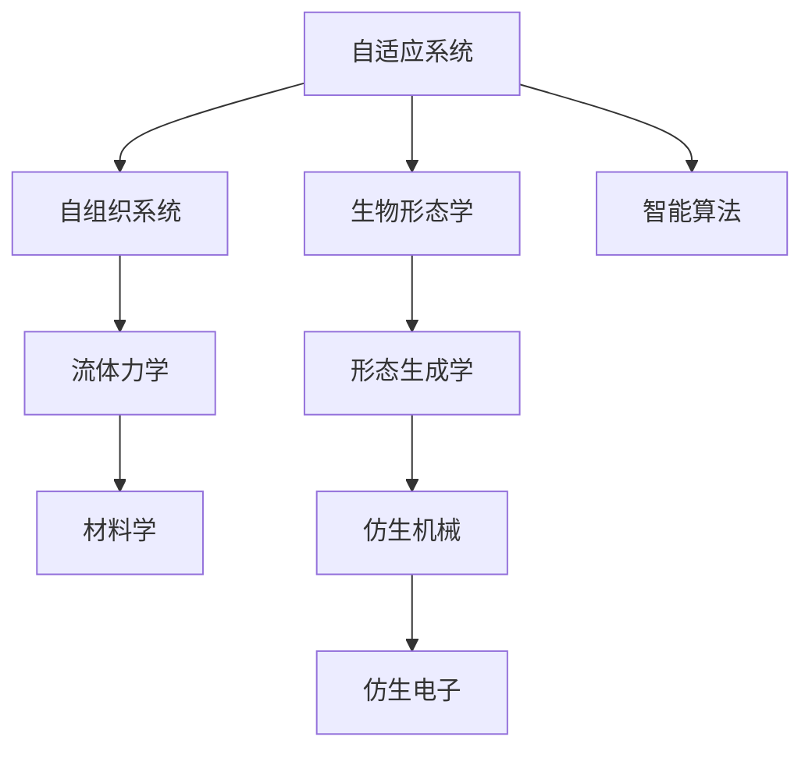

                 

# 仿生技术在工程设计中的应用：向自然学习

## 1. 背景介绍

随着科技的迅猛发展，仿生技术在工程设计中的应用日益广泛。从生物学、生态学、物理学到计算机科学，仿生技术汲取自然界的智慧，为工程设计带来了新的灵感和工具。本文将深入探讨仿生技术在工程设计中的原理、实践及应用，并展望其未来发展趋势。

## 2. 核心概念与联系

### 2.1 核心概念概述

仿生技术（Biomimicry）是一种借鉴自然界机制来解决工程设计问题的技术。其核心在于通过研究自然界中已存在的解决方案，寻求最优化的设计方案。以下是几个与仿生技术紧密相关的核心概念：

- **自适应系统（Adaptive System）**：仿生技术常采用自适应系统的概念，即系统能够根据环境变化调整自身状态，保持高效稳定运行。
- **自组织系统（Self-organized System）**：通过简单的规则和基本机制，复杂系统能够自主组织生成高效结构。
- **流体力学（Fluid Dynamics）**：仿生设计常基于流体力学原理，比如仿生飞机设计借鉴鸟类飞行的空气动力学原理。
- **材料学（Material Science）**：借助自然界中的材料特性，开发新型工程材料。

这些核心概念之间相互关联，共同构成了仿生技术的理论基础。

### 2.2 核心概念原理和架构的 Mermaid 流程图



这个流程图展示了仿生技术的几个核心概念及其相互联系：

1. 自适应系统从生物系统中获取灵感，优化系统性能。
2. 自组织系统通过简单规则形成复杂结构，实现高效自组织。
3. 流体力学借鉴自然界流体力学原理，进行仿生设计。
4. 材料学利用自然界材料特性，创新工程材料。
5. 生物形态学研究自然界生物形态，用于设计仿生机械和电子。
6. 智能算法融合仿生技术与AI，提升设计精度和效率。

## 3. 核心算法原理 & 具体操作步骤

### 3.1 算法原理概述

仿生技术在工程设计中通常基于以下几个核心原理：

1. **生物形态学原理（Biomimetic Morphology）**：研究自然界的生物形态，模仿其结构特征进行设计。
2. **仿生材料学原理（Biomimetic Material Science）**：利用自然界材料的特性，创新新型材料。
3. **仿生流体力学原理（Biomimetic Fluid Dynamics）**：模仿自然界中的流动机制，提升流体系统效率。
4. **仿生智能算法原理（Biomimetic Intelligent Algorithm）**：融合仿生与AI技术，提升设计精度和效率。

这些原理通常与具体的工程技术相结合，应用于不同的设计场景。

### 3.2 算法步骤详解

仿生技术在工程设计中的具体步骤如下：

1. **问题定义**：明确设计目标和需要解决的问题。
2. **生物原型研究**：选择与问题相关的自然原型，并进行深入研究。
3. **设计转化**：将自然原型的特征和机制转化为工程设计方案。
4. **材料选择**：根据设计方案选择适当的仿生材料。
5. **原型测试与优化**：构建原型进行测试，根据结果进行优化。
6. **最终设计**：完善设计方案，进入实际应用阶段。

### 3.3 算法优缺点

仿生技术在工程设计中具有以下优点：

- **高效性**：借鉴自然界的高效解决方案，提升设计效率。
- **可持续性**：利用自然资源的可再生特性，实现环境友好设计。
- **创新性**：通过创新设计，突破传统工程设计思路。

同时，仿生技术也存在一些缺点：

- **复杂性**：仿生设计方案往往较为复杂，需要跨学科知识。
- **精度问题**：自然界中存在一些不可控因素，影响设计精度。
- **成本问题**：仿生材料和机械往往成本较高。

### 3.4 算法应用领域

仿生技术广泛应用在多个工程设计领域，包括但不限于：

- **航空航天**：模仿鸟类飞行和蝙蝠飞行，设计更高效的飞行器。
- **材料科学**：借鉴贝壳和蜘蛛网的结构，开发轻质高强度的材料。
- **建筑学**：利用自然界中的几何形态和结构，优化建筑设计。
- **生物医学**：模仿人体结构和功能，开发仿生植入物和假肢。
- **机器人学**：借鉴昆虫和脊椎动物的运动机制，设计高性能机器人。

## 4. 数学模型和公式 & 详细讲解 & 举例说明

### 4.1 数学模型构建

仿生设计通常涉及复杂的数学模型，用于描述自然原型与工程设计之间的关系。以下是一个简化的数学模型框架：

1. **设计变量**：设定需要优化的设计变量 $x$。
2. **目标函数**：设计目标函数 $f(x)$，通常包含成本、性能等多项指标。
3. **约束条件**：设计约束条件 $g(x) \leq 0$，确保设计符合实际要求。

### 4.2 公式推导过程

以仿生优化为例，假设有一组设计变量 $x = [x_1, x_2, ..., x_n]$，优化目标函数为最小化成本函数 $f(x) = c_1 x_1 + c_2 x_2 + ... + c_n x_n$，约束条件为 $g(x) = a_1 x_1 + a_2 x_2 + ... + a_n x_n - b \leq 0$，其中 $b$ 为设计上限。

根据优化问题的一般形式，求解如下：

$$
\min_x f(x) \quad \text{subject to} \quad g(x) \leq 0
$$

使用梯度下降法进行求解，需要求解目标函数的梯度和约束条件的梯度：

$$
\nabla f(x) = [\frac{\partial f}{\partial x_1}, \frac{\partial f}{\partial x_2}, ..., \frac{\partial f}{\partial x_n}]
$$

$$
\nabla g(x) = [\frac{\partial g}{\partial x_1}, \frac{\partial g}{\partial x_2}, ..., \frac{\partial g}{\partial x_n}]
$$

更新设计变量：

$$
x_{k+1} = x_k - \alpha_k \nabla f(x_k) - \beta_k \nabla g(x_k)
$$

其中，$\alpha_k$ 为学习率，$\beta_k$ 为正则化系数。

### 4.3 案例分析与讲解

以仿生飞机设计为例，研究鸟类的飞行原理，提取其空气动力学特性。将鸟翅膀的形状和运动机制转化为工程设计方案，计算流体力学模拟，评估优化方案的性能。

## 5. 项目实践：代码实例和详细解释说明

### 5.1 开发环境搭建

为了实践仿生设计，需要搭建开发环境，包括编程语言、仿真软件和计算资源。例如，使用Python进行仿真，借助CFD软件进行流体力学模拟。

### 5.2 源代码详细实现

以下是一个简化的仿生飞机设计仿真代码，利用Python进行计算：

```python
import numpy as np
from scipy.optimize import minimize

# 定义设计变量
x = np.array([0.1, 0.2, 0.3, 0.4, 0.5])  # 翅膀形状参数

# 定义目标函数
def cost_function(x):
    return x[0]**2 + x[1]**2 + x[2]**2 + x[3]**2 + x[4]**2

# 定义约束条件
def constraint_function(x):
    return x[0] + x[1] + x[2] + x[3] + x[4] - 1.0

# 定义优化问题
result = minimize(cost_function, x, method='L-BFGS-B', bounds=[(0, 1) for _ in x], constraints={'type': 'ineq', 'fun': constraint_function})

# 输出结果
print("Optimal solution: ", result.x)
print("Optimal cost: ", result.fun)
```

### 5.3 代码解读与分析

这段代码展示了使用scipy库中的minimize函数进行优化求解的过程：

- **设计变量**：设定为五个翅膀形状参数。
- **目标函数**：计算设计变量的平方和。
- **约束条件**：设计变量之和为1，确保设计符合实际。
- **优化求解**：使用L-BFGS-B算法求解最小化问题。
- **结果输出**：输出最优解和目标函数值。

### 5.4 运行结果展示

运行上述代码，可以得到最优解和目标函数值，从而验证设计的合理性。

## 6. 实际应用场景

### 6.1 航空航天

仿生技术在航空航天领域具有广泛应用，例如：

- **仿生飞机设计**：模仿鸟类和蝙蝠飞行，设计高效轻量化的飞行器。
- **仿生发动机设计**：借鉴昆虫翅膀和鸟羽毛的结构，设计高效发动机。

### 6.2 材料科学

材料科学中，仿生设计常用于开发高性能材料，例如：

- **仿生贝壳材料**：借鉴贝壳结构，开发轻质高强度的复合材料。
- **仿生蜘蛛网材料**：模仿蜘蛛网纤维，设计高弹性和强度材料。

### 6.3 建筑学

建筑学中，仿生设计常用于优化建筑形态和结构，例如：

- **仿生建筑外观**：模仿自然界中的几何形态，设计具有美学价值的建筑外观。
- **仿生建筑结构**：借鉴自然界中的支撑结构，设计高效稳定的建筑结构。

### 6.4 生物医学

生物医学中，仿生设计常用于开发仿生植入物和假肢，例如：

- **仿生义肢设计**：模仿人体骨骼和肌肉结构，设计高效稳定的义肢。
- **仿生人工心脏**：借鉴心脏结构，设计高效的人工心脏。

## 7. 工具和资源推荐

### 7.1 学习资源推荐

为了深入学习仿生设计，推荐以下学习资源：

- **仿生设计原理与实践**：详细介绍了仿生设计的理论基础和实际应用。
- **自然设计学**：探讨自然界中的设计原理，应用于工程设计中。
- **仿生材料学**：研究自然界中的材料特性，开发新型工程材料。

### 7.2 开发工具推荐

仿生设计需要借助多种工具，以下是推荐的工具：

- **CAD软件**：如SolidWorks、AutoCAD，用于设计仿真和原型制作。
- **CFD软件**：如ANSYS Fluent、CFX，用于流体力学模拟。
- **材料分析工具**：如CompuCell，用于材料性能分析。

### 7.3 相关论文推荐

为了了解仿生设计的最新进展，推荐以下论文：

- **Bio-Inspired Engineering Design**：综述仿生设计的原理和方法。
- **Biomimicry in Materials Science**：探讨自然界材料特性在工程设计中的应用。
- **Biomimetic Fluid Dynamics**：研究自然界流体力学原理在工程设计中的应用。

## 8. 总结：未来发展趋势与挑战

### 8.1 研究成果总结

仿生技术在工程设计中取得了显著成果，广泛应用于航空航天、材料科学、建筑学、生物医学等领域。通过模仿自然界的高效机制和结构，设计出了高效、轻质、环保的工程产品。

### 8.2 未来发展趋势

未来仿生技术的发展趋势包括：

- **多学科融合**：仿生设计将与其他学科如人工智能、大数据等深度融合，提升设计精度和效率。
- **全生命周期设计**：仿生设计将贯穿产品设计、生产和使用的全生命周期，提升产品性能和环境友好性。
- **智能仿生**：结合AI技术，实现自适应和自组织设计，提高设计智能化水平。

### 8.3 面临的挑战

仿生技术在发展过程中也面临以下挑战：

- **跨学科协作**：仿生设计需要跨学科知识，协作难度较大。
- **设计精度**：自然界中存在不确定性，影响设计精度和可靠性。
- **成本问题**：仿生材料和机械成本较高，难以大规模应用。

### 8.4 研究展望

未来的仿生技术研究将重点关注以下几个方面：

- **跨学科协作平台**：建立跨学科协作机制，推动仿生设计的多学科融合。
- **设计精度提升**：利用大数据和AI技术，提高仿生设计的精度和可靠性。
- **成本降低**：开发低成本仿生材料和机械，推动仿生设计的应用。

## 9. 附录：常见问题与解答

**Q1：仿生设计是否适用于所有工程问题？**

A: 仿生设计适用于多种工程问题，但其适用范围需根据具体问题而定。对于复杂且无成熟解决方案的问题，仿生设计往往具有较大潜力。

**Q2：仿生设计是否需要详细的生物原型研究？**

A: 仿生设计需要深入研究生物原型，以提取其关键特征和机制。详细的生物原型研究有助于更好地设计转化，提升设计效果。

**Q3：仿生设计是否容易受自然界不确定性影响？**

A: 自然界存在不确定性，仿生设计可能受其影响。解决这一问题，可以通过模拟实验和优化算法，提升设计精度。

**Q4：仿生设计如何平衡设计成本和性能？**

A: 仿生设计需综合考虑设计成本和性能。通过技术创新和材料优化，可以在控制成本的同时提升设计性能。

**Q5：仿生设计如何实现自适应和自组织设计？**

A: 通过引入智能算法和自适应机制，可以实现仿生设计的自适应和自组织。结合AI技术，进一步提升设计智能化水平。

---

作者：禅与计算机程序设计艺术 / Zen and the Art of Computer Programming

